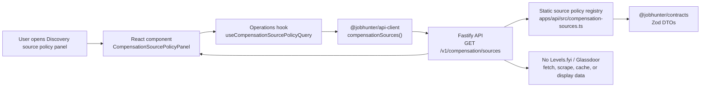

# Phase 17: Source Registry & Access Policy - Research

**Researched:** 2026-06-19
**Domain:** Local-first compensation source policy, licensing seams, TypeScript API contracts, React inspection surface
**Confidence:** HIGH for repo integration and Phase 17 scope; MEDIUM for external provider terms because official pages can change after 2026-06-19

<user_constraints>
## User Constraints (from CONTEXT.md)

### Locked Decisions

## Implementation Decisions

### Source Policy Scope
- Use a compensation-specific registry, not the existing Discovery job-board registry, because salary evidence has different access, licensing, attribution, supported-field, and disabled-reason semantics.
- Seed v1.3 source entries for posted job salary text, Eurostat Structure of Earnings Survey, ESCO occupation mapping, Spain INE Wage Structure Survey, Levels.fyi, and Glassdoor.
- Mark public Europe sources as public/available or planned public baselines, and mark Levels.fyi and Glassdoor as disabled or unavailable licensed-source seams unless explicit permitted access is configured.
- Treat non-European public salary baselines as outside active product direction.

### Access Enforcement
- The registry must be inspectable without invoking external salary providers.
- Glassdoor must not be fetched, scraped, cached, or displayed as salary data without explicit partner/API access or written permission.
- Levels.fyi must not be fetched, scraped, cached, or displayed as salary data without an explicitly configured permitted access mode and Europe coverage.
- Phase 17 may define adapter seams and disabled statuses; it must not add live external calls to Levels.fyi or Glassdoor.

### API And Contracts
- Add typed DTOs to the existing contracts package and expose them through the local TypeScript API.
- Prefer an explicit read endpoint for compensation source policy, keeping the source registry separate from job list/detail compensation audit contracts that arrive in later phases.
- Ensure API responses expose safe policy metadata only: no credentials, raw provider payloads, local paths, private account details, or scraped page content.
- Keep the response local-first and deterministic so tests can assert source policy without network.

### Frontend Surface
- Phase 17 may expose the registry in a narrow inspection surface using existing Operations query hooks and context-owned compensation/source components.
- Do not build the final Jobs list/drawer salary triage in this phase; reserve that for Phase 21.
- If surfaced in the UI now, it should distinguish public Europe baselines from disabled licensed seams and avoid marketing copy or broad explanatory text.
- Follow the existing frontend architecture: Operations owns read hooks, context components own domain UI, and views remain composers.

### the agent's Discretion
- Choose exact storage location and whether Phase 17 persists source policy as code-seeded rows or a static registry module, provided the later phases can attach source evidence to canonical compensation facts.
- Choose whether the first UI exposure belongs in existing Discovery controls, Settings, or a compensation context component, provided source policy remains clearly separate from discovery job-board health.

### Deferred Ideas (OUT OF SCOPE)

## Deferred Ideas

- Posted salary parsing and confidence facts belong to Phase 18.
- Public market estimate calculation and statistical confidence belong to Phase 19.
- Canonical compensation audit read-model and SSE updates belong to Phase 20.
- Jobs list and drawer salary triage UX belongs to Phase 21.
- End-to-end product-path QA belongs to Phase 22.
</user_constraints>

<phase_requirements>
## Phase Requirements

| ID | Description | Research Support |
|----|-------------|------------------|
| SRC-01 | User can see a salary-source registry entry for every configured compensation source, including access mode, terms/source URL, license status, source type, freshness policy, attribution requirement, supported fields, and disabled reason when unavailable. | Add a typed `CompensationSourcePolicy` DTO and read-only registry with seeded entries for all six v1.3 sources. [VERIFIED: .planning/REQUIREMENTS.md] |
| SRC-04 | User can see Levels.fyi and Glassdoor represented only as disabled or unavailable licensed-source seams unless explicit permitted access is configured. | Seed both providers with `availability: "disabled"` and `licenseStatus: "requires_license"` / `"permission_required"`; route returns policy metadata only. [VERIFIED: .planning/REQUIREMENTS.md] |
| SRC-05 | User is protected from unauthorized Glassdoor scraping because the product does not fetch, scrape, cache, or display Glassdoor-derived salary data without explicit partner/API access or written permission. | Phase 17 must add no Glassdoor adapter, fetcher, cache table, or scrape path; contract exposes only provider policy and disabled reason. [CITED: https://www.glassdoor.com/about/terms/] |
| SRC-06 | User is protected from unlicensed Levels.fyi use because the product does not fetch, scrape, cache, or display Levels.fyi-derived salary data without an explicitly configured permitted access mode and Europe coverage. | Phase 17 must add no Levels.fyi adapter, fetcher, cache table, or scrape path; contract exposes only provider policy and disabled reason. [CITED: https://www.levels.fyi/api-access/] |
</phase_requirements>

## Summary

Phase 17 should create a read-only compensation source policy registry, not a salary estimator and not a scrape/import pipeline. [VERIFIED: .planning/phases/17-source-registry-access-policy/17-CONTEXT.md] The smallest safe implementation is a static, code-seeded registry module exposed through `GET /v1/compensation/sources`, with DTOs in `packages/contracts`, a typed API client method, an Operations read hook, and a narrow Discovery-page inspection panel. [VERIFIED: codebase grep]

Use static registry data as the Phase 17 storage choice. [VERIFIED: .planning/phases/17-source-registry-access-policy/17-CONTEXT.md] A SQLite table is not needed until later phases persist imported public baseline observations or licensed-provider configuration; source IDs from this registry are stable enough for later canonical salary facts to reference. [VERIFIED: workers/automation/src/jobhunter/database.py] The static module keeps Phase 17 deterministic, network-free, and easy to test. [VERIFIED: apps/api/src/server.ts]

**Primary recommendation:** Implement `GET /v1/compensation/sources` from a static compensation source policy registry; do not add any live Levels.fyi or Glassdoor fetch/scrape/cache/display path in Phase 17. [CITED: https://www.glassdoor.com/about/terms/] [CITED: https://www.levels.fyi/api-access/]

## Project Constraints (from AGENTS.md)

- Read repo docs before architecture, workflow, or QA decisions; this research used `.planning/*`, `.planning/research/STACK.md`, `docs/architecture.md`, `docs/frontend-target.md`, `docs/local-ts-api.md`, `docs/local-reliability-qa.md`, and `docs/decisions.md`. [VERIFIED: AGENTS.md]
- Do not run auto-apply, browser submission, destructive profile/database actions, commands that submit applications, mailbox scanning, or worker-backed jobs unless explicitly requested. [VERIFIED: AGENTS.md]
- Treat payloads, local generated artifacts, job/application data, profile data, API keys, resumes, PDFs, browser profiles, SQLite databases, and logs as sensitive. [VERIFIED: AGENTS.md]
- User-facing API/UI/product-flow changes need product-path QA, not only unit tests. [VERIFIED: AGENTS.md]
- Frontend reads go through Operations hooks and ports; views compose context components; no direct `apiClient`, `useQuery`, or `queryClient` calls from views. [VERIFIED: AGENTS.md]
- Query keys are tenant-prefixed as `["tenant", tenantId, ...]`. [VERIFIED: AGENTS.md]
- Add colocated frontend tests, use existing MSW handler setup, and keep source inspection UI accessible. [VERIFIED: AGENTS.md]
- Commit messages and PR titles must follow Conventional Commits, but this research was explicitly requested with "Do not commit." [VERIFIED: AGENTS.md]

## Architectural Responsibility Map

| Capability | Primary Tier | Secondary Tier | Rationale |
|------------|--------------|----------------|-----------|
| Compensation source policy contract | API / Backend | Frontend Server: none | The TypeScript API owns product-facing JSON contracts and safe read endpoints. [VERIFIED: docs/local-ts-api.md] |
| Static compensation source registry | API / Backend | Python worker later | Phase 17 needs deterministic policy metadata only; later worker phases can reuse stable source IDs for evidence rows. [VERIFIED: .planning/phases/17-source-registry-access-policy/17-CONTEXT.md] |
| Licensed-source enforcement | API / Backend | Database / Storage later | The current phase prevents unauthorized use by not adding provider adapters/fetchers/cache tables and by exposing disabled policy only. [CITED: https://www.glassdoor.com/about/terms/] |
| Frontend source inspection | Browser / Client | API / Backend | The UI renders read-only server state through an Operations query hook and a context-owned component. [VERIFIED: docs/frontend-target.md] |
| Public vs licensed source distinction | API / Backend | Browser / Client | The contract should carry `sourceType`, `accessMode`, and `licenseStatus`; the UI displays these fields without deriving policy in React. [VERIFIED: packages/contracts/src/schemas.ts] |

## Standard Stack

### Core

| Library / Surface | Version | Purpose | Why Standard |
|-------------------|---------|---------|--------------|
| Fastify | `^5.8.5` | Add `GET /v1/compensation/sources` to the local TypeScript API. | Existing API route framework. [VERIFIED: apps/api/package.json] |
| Zod | `^4.4.1` API / `^4.4.3` web | Define and parse compensation source response schemas. | Existing contract validation style. [VERIFIED: apps/api/package.json] [VERIFIED: apps/web/package.json] |
| `@jobhunter/contracts` | workspace | Own DTOs, enums, and response schema. | Existing shared API/web contract package. [VERIFIED: docs/decisions.md] |
| `@jobhunter/api-client` | workspace | Add typed `compensationSources()` method. | Existing typed transport boundary. [VERIFIED: packages/api-client/src/client.ts] |
| TanStack Query | `^5.100.9` | Add Operations read hook for source policy. | Existing server-state cache. [VERIFIED: apps/web/package.json] |
| React | `^19.2.3` | Render read-only inspection panel. | Existing web runtime. [VERIFIED: apps/web/package.json] |
| SQLite | `3.51.0` available locally | Not needed for Phase 17 policy storage; later phases use canonical rows. | Existing local storage for canonical facts and projections. [VERIFIED: environment probe] |

### Supporting

| Surface | Purpose | When to Use |
|---------|---------|-------------|
| `apps/web/src/shared/ui/filterable-data-grid.tsx` | Inspect source policy rows in a dense table. | Use if the panel needs sorting/filtering across all six seeded sources. [VERIFIED: apps/web/src/contexts/discovery/components/DiscoveryProductControls.tsx] |
| `@tabler/icons-react` `3.44.0` | Icon affordances in buttons/status labels. | Use existing icon library, not lucide. [VERIFIED: apps/web/package.json] |
| Vitest | API/web unit tests. | Add focused tests for contract, route, hook, and component rendering. [VERIFIED: package.json] |

### Alternatives Considered

| Instead of | Could Use | Tradeoff |
|------------|-----------|----------|
| Static registry module | New `compensation_source_registry_entries` SQLite table | Table is useful once source access can be user-configured or evidence rows need FK-backed source metadata; Phase 17 only needs deterministic safe policy. [VERIFIED: workers/automation/src/jobhunter/database.py] |
| `/v1/compensation/sources` | Extend `/v1/discovery/sources` | Discovery source registry is operational job-board health and lacks compensation licensing/freshness/attribution semantics. [VERIFIED: apps/api/src/discovery-controls.ts] |
| Discovery-page panel | Final Jobs drawer/list compensation UX | Jobs triage compensation UX is explicitly Phase 21, so Phase 17 should remain a source-policy inspection surface. [VERIFIED: .planning/ROADMAP.md] |

**Installation:** No new packages. [VERIFIED: package.json]

```bash
# no install command for Phase 17
```

## Package Legitimacy Audit

No external packages are recommended or installed in Phase 17. [VERIFIED: package.json]

| Package | Registry | Age | Downloads | Source Repo | Verdict | Disposition |
|---------|----------|-----|-----------|-------------|---------|-------------|
| none | n/a | n/a | n/a | n/a | n/a | No install |

**Packages removed due to [SLOP] verdict:** none
**Packages flagged as suspicious [SUS]:** none

## Architecture Patterns

### System Architecture Diagram



### Recommended Project Structure

```text
packages/contracts/src/schemas.ts
  # Compensation source enums, DTOs, response schema
packages/api-client/src/client.ts
  # compensationSources(): Promise<CompensationSourcePolicyResponse>
apps/api/src/compensation-sources.ts
  # static seeded registry and listCompensationSources()
apps/api/src/server.ts
  # GET /v1/compensation/sources
apps/api/test/compensation-sources.test.ts
  # route returns all entries and no unsafe provider data
apps/web/src/contexts/operations/compensationKeys.ts
  # ["tenant", tenantId, "compensation", "sources"]
apps/web/src/contexts/operations/hooks/useCompensationSourcePolicyQuery.ts
  # Operations read hook
apps/web/src/contexts/discovery/components/CompensationSourcePolicyPanel.tsx
  # narrow source inspection surface
apps/web/src/contexts/discovery/components/CompensationSourcePolicyPanel.test.tsx
  # public vs licensed seam rendering
apps/web/src/views/discovery/DiscoveryView.tsx
  # compose panel below discovery runtime settings, above job source controls
```

### Pattern 1: Contract-First Read Endpoint

**What:** Define the response shape in `packages/contracts/src/schemas.ts`, have the API return that exact type, and have `@jobhunter/api-client` expose one method. [VERIFIED: packages/contracts/src/schemas.ts]
**When to use:** Phase 17 is read-only policy metadata; no mutation or SSE invalidation is needed. [VERIFIED: .planning/phases/17-source-registry-access-policy/17-CONTEXT.md]

```typescript
// Source: existing Zod/DTO contract pattern in packages/contracts/src/schemas.ts
export const COMPENSATION_SOURCE_TYPES = [
  "posted_salary_text",
  "europe_public_baseline",
  "occupation_taxonomy",
  "licensed_market_data",
] as const;

export const COMPENSATION_SOURCE_ACCESS_MODES = [
  "local_snapshot",
  "public_dataset",
  "public_api",
  "licensed_api",
  "licensed_data_feed",
  "disabled_until_permitted",
] as const;

export interface CompensationSourcePolicy {
  sourceId: string;
  displayName: string;
  sourceType: (typeof COMPENSATION_SOURCE_TYPES)[number];
  accessMode: (typeof COMPENSATION_SOURCE_ACCESS_MODES)[number];
  availability: "available" | "planned_public" | "disabled" | "unavailable";
  licenseStatus: "public" | "local_posting" | "requires_license" | "permission_required";
  termsUrl: string | null;
  sourceUrl: string | null;
  freshnessPolicy: string;
  attributionRequired: boolean;
  attributionText: string | null;
  supportedFields: string[];
  disabledReason: string | null;
}
```

### Pattern 2: Explicit Disabled Licensed Seams

**What:** Seed Levels.fyi and Glassdoor as rows, but with disabled availability and no adapter entry point. [VERIFIED: .planning/REQUIREMENTS.md]
**When to use:** Always in Phase 17; enabled licensed access is future scope unless explicit permitted access exists. [VERIFIED: .planning/STATE.md]

```typescript
// Source: official provider policy pages checked 2026-06-19.
{
  sourceId: "glassdoor",
  displayName: "Glassdoor",
  sourceType: "licensed_market_data",
  accessMode: "disabled_until_permitted",
  availability: "disabled",
  licenseStatus: "permission_required",
  termsUrl: "https://www.glassdoor.com/about/terms/",
  sourceUrl: null,
  freshnessPolicy: "Not applicable until written permission or partner access is configured.",
  attributionRequired: true,
  attributionText: "Glassdoor attribution/usage terms must be configured with permitted access.",
  supportedFields: [],
  disabledReason: "Disabled: no express written permission or permitted API/partner access is configured."
}
```

### Pattern 3: Operations Hook, Context Component, View Composer

**What:** The hook calls the API port; the component renders the domain table; the Discovery view composes the panel. [VERIFIED: docs/frontend-target.md]
**When to use:** Phase 17 source policy inspection is user-facing read-only server state. [VERIFIED: apps/web/src/contexts/operations/hooks/useDiscoveryProductControlsQuery.ts]

```typescript
// Source: existing Operations hook pattern in useDiscoveryProductControlsQuery.ts
export function useCompensationSourcePolicyQuery() {
  const tenantId = useTenantId();
  const { api } = usePorts();
  return useQuery({
    queryKey: compensationKeys.sources(tenantId),
    queryFn: () => api.compensationSources(),
    staleTime: 0,
  });
}
```

### Anti-Patterns to Avoid

- **Extending Discovery job source DTOs:** Compensation source policy has licensing, freshness, supported-field, and disabled-reason semantics that Discovery source health does not model. [VERIFIED: apps/api/src/discovery-controls.ts]
- **Creating Glassdoor or Levels.fyi fetchers "disabled by flag":** The safest Phase 17 enforcement is absence of fetch/scrape/cache code, not runtime conditional logic. [CITED: https://www.glassdoor.com/about/terms/]
- **Showing licensed-source labels as evidence:** A disabled seam is not compensation evidence and must be visually distinct from Europe public baselines. [VERIFIED: .planning/REQUIREMENTS.md]
- **Putting source policy in Jobs list/drawer:** Final compensation triage belongs to Phase 21. [VERIFIED: .planning/ROADMAP.md]

## Seeded Source Policy Entries

| Source ID | Availability | Access Mode | Source Type | License Status | Supported Fields | Disabled Reason |
|-----------|--------------|-------------|-------------|----------------|------------------|-----------------|
| `posted_job_salary_text` | available | local_snapshot | posted_salary_text | local_posting | raw salary field, compensation text excerpt, posting URL/source field | none |
| `eurostat_ses` | planned_public | public_dataset | europe_public_baseline | public | occupation/location aggregate wage baselines, dataset freshness metadata | none |
| `esco` | planned_public | public_api | occupation_taxonomy | public | occupation mapping, taxonomy URI/version, preferred labels | none |
| `ine_spain_wage_structure` | planned_public | public_dataset | europe_public_baseline | public | Spain wage aggregate tables, publication date, geography/activity/occupation dimensions where available | none |
| `levels_fyi` | disabled | disabled_until_permitted | licensed_market_data | requires_license | none until permitted access configured | no configured licensed API/data-stream access, Europe coverage, retention, attribution, and redistribution terms |
| `glassdoor` | disabled | disabled_until_permitted | licensed_market_data | permission_required | none until permitted access configured | no express written permission or permitted API/partner access configured |

Eurostat SES is an EU/candidate/EFTA earnings survey and supports an aggregate public baseline label, not company-specific market evidence. [CITED: https://ec.europa.eu/eurostat/web/microdata/collections-research/structure-of-earnings-survey] ESCO exposes APIs for ESCO classification access and should be labeled occupation mapping, not salary data. [CITED: https://esco.ec.europa.eu/en/about-esco/escopedia/escopedia/esco-api] Spain INE Wage Structure Survey latest data page lists 2024 data published 28 May 2026, and the datos.gob.es catalog says tables can be downloaded as HTML, PC-Axis, Excel, and CSV. [CITED: https://www.ine.es/dyngs/INEbase/en/operacion.htm?c=Estadistica_C&cid=1254736177025&idp=1254735976596] [CITED: https://datos.gob.es/en/catalogo/ea0042823-encuesta-anual-de-estructura-salarial]

## Don't Hand-Roll

| Problem | Don't Build | Use Instead | Why |
|---------|-------------|-------------|-----|
| API DTO validation | Ad hoc object literals without schemas | Existing Zod/schema exports in `packages/contracts` | Keeps API/client/web types aligned. [VERIFIED: packages/contracts/src/schemas.ts] |
| Source policy state machine | Boolean `enabled`/`disabled` only | Closed string unions for `availability`, `accessMode`, `licenseStatus`, `sourceType` | Requirements need unavailable licensed seams distinct from public baselines. [VERIFIED: .planning/REQUIREMENTS.md] |
| Licensed provider enforcement | A fetcher with runtime "disabled" checks | No provider adapter/fetch/cache code in Phase 17 | Absence of code prevents accidental unauthorized access. [CITED: https://www.glassdoor.com/about/terms/] |
| Frontend data loading | `useEffect(() => fetch(...))` | Operations TanStack Query hook via `usePorts()` | Existing architecture forbids direct API calls in views/components. [VERIFIED: AGENTS.md] |
| Source evidence display | React-derived policy labels | API-provided policy fields | Every displayed claim needs an explicit source of truth. [VERIFIED: AGENTS.md] |

**Key insight:** Phase 17 is an access-policy proof, not a data-ingestion proof; implementation quality is measured by what it refuses to fetch/cache as much as by what it displays. [VERIFIED: .planning/ROADMAP.md]

## Common Pitfalls

### Pitfall 1: Conflating Discovery Sources With Compensation Sources

**What goes wrong:** `/v1/discovery/sources` gains salary licensing fields, making job-board health and compensation evidence policy share one DTO. [VERIFIED: apps/api/src/discovery-controls.ts]
**Why it happens:** Existing Discovery source registry is nearby and visually similar. [VERIFIED: apps/web/src/contexts/discovery/components/DiscoveryProductControls.tsx]
**How to avoid:** Add `/v1/compensation/sources` and a compensation-specific DTO. [VERIFIED: .planning/phases/17-source-registry-access-policy/17-CONTEXT.md]
**Warning signs:** New fields such as `licenseStatus` appear on `SourceRegistryEntrySummary`. [VERIFIED: packages/contracts/src/schemas.ts]

### Pitfall 2: Disabled Licensed Seams Look Like Evidence

**What goes wrong:** The UI lists Glassdoor or Levels.fyi beside Eurostat/INE as if they contributed salary evidence. [VERIFIED: .planning/REQUIREMENTS.md]
**Why it happens:** A single "source" label hides `availability` and `sourceType`. [VERIFIED: .planning/REQUIREMENTS.md]
**How to avoid:** Render disabled licensed seams with disabled status, disabled reason, no supported fields, and no sample/count/value fields. [CITED: https://www.levels.fyi/offerings/data/]
**Warning signs:** UI text contains provider names in a compensation estimate or evidence trail before permitted access exists. [VERIFIED: .planning/STATE.md]

### Pitfall 3: Adding Provider Code Too Early

**What goes wrong:** A "future adapter" imports `httpx`, `fetch`, Playwright, or scraping helpers and can be accidentally invoked. [VERIFIED: .planning/phases/17-source-registry-access-policy/17-CONTEXT.md]
**Why it happens:** Adapter seams are often scaffolded with real network clients. [ASSUMED]
**How to avoid:** Phase 17 source modules should contain metadata only; grep tests should reject `levels.fyi`, `glassdoor`, `fetch(`, `httpx`, `EventSource`, or Playwright usage outside policy metadata/tests. [VERIFIED: codebase grep]
**Warning signs:** New files named `levels_fyi.py`, `glassdoor.py`, or route handlers with URL fetch logic. [VERIFIED: workers/automation/src/jobhunter/domain/discovery/source_registry.py]

### Pitfall 4: Treating ESCO As Salary Data

**What goes wrong:** ESCO is shown as a market salary source. [CITED: https://esco.ec.europa.eu/en/about-esco/escopedia/escopedia/esco-api]
**Why it happens:** ESCO is part of the v1.3 salary pipeline but only maps occupations. [VERIFIED: .planning/research/STACK.md]
**How to avoid:** Set `sourceType: "occupation_taxonomy"` and `supportedFields` to mapping fields only. [CITED: https://esco.ec.europa.eu/en/use-esco/use-esco-services-api]
**Warning signs:** ESCO row has `supportedFields` like `salaryRange` or `percentiles`. [VERIFIED: .planning/REQUIREMENTS.md]

## Code Examples

### API Route

```typescript
// Source: route style in apps/api/src/server.ts
import { listCompensationSources } from "./compensation-sources.js";

app.get("/v1/compensation/sources", async () => listCompensationSources());
```

### API Client Method

```typescript
// Source: client style in packages/api-client/src/client.ts
compensationSources(): Promise<CompensationSourcePolicyResponse> {
  return this.get("/v1/compensation/sources");
}
```

### Minimal Safety Test

```typescript
// Source: API test style in apps/api/test/discovery-controls.test.ts
it("lists Glassdoor and Levels.fyi only as disabled licensed seams", async () => {
  const app = buildApp(options);
  const response = await app.inject({ method: "GET", url: "/v1/compensation/sources" });
  expect(response.statusCode).toBe(200);
  const sources = response.json().sources;
  expect(sources.find((s) => s.sourceId === "glassdoor")).toMatchObject({
    availability: "disabled",
    accessMode: "disabled_until_permitted",
    supportedFields: [],
  });
  expect(sources.find((s) => s.sourceId === "levels_fyi")).toMatchObject({
    availability: "disabled",
    accessMode: "disabled_until_permitted",
    supportedFields: [],
  });
});
```

## State of the Art

| Old Approach | Current Approach | When Changed | Impact |
|--------------|------------------|--------------|--------|
| Treat all source names as equivalent labels | Carry `sourceType`, `accessMode`, `licenseStatus`, and `availability` separately | Phase 17 plan | Users can distinguish public baselines, local posting text, occupation mapping, and disabled licensed seams. [VERIFIED: .planning/REQUIREMENTS.md] |
| UI infers policy from provider name | API serves explicit source policy metadata | Existing JobHunter auditability discipline | Displayed claims have an owning source of truth. [VERIFIED: AGENTS.md] |
| Scraper-first compensation integrations | Policy-first registry with disabled licensed seams | Phase 17 plan | Product cannot accidentally use unauthorized provider data. [CITED: https://www.glassdoor.com/about/terms/] |

**Deprecated/outdated:**
- Adding Glassdoor to `DiscoverySettings.boards` is not compensation-source authorization; it is a job-board discovery setting and should not be used for salary evidence. [VERIFIED: packages/contracts/src/schemas.ts]
- Public salary pages are not a substitute for licensed API/data access. [CITED: https://www.glassdoor.com/about/terms/] [CITED: https://www.levels.fyi/offerings/data/]

## Assumptions Log

| # | Claim | Section | Risk if Wrong |
|---|-------|---------|---------------|
| A1 | Future adapter scaffolds are often accidentally made callable when real network clients are included early. [ASSUMED] | Common Pitfalls | Planner may need an explicit grep test to keep Phase 17 metadata-only. |

## Open Questions (RESOLVED)

1. **Should permitted licensed access be represented by environment/config in Phase 17?**
   - What we know: Context says Levels.fyi and Glassdoor stay disabled unless explicit permitted access is configured. [VERIFIED: .planning/phases/17-source-registry-access-policy/17-CONTEXT.md]
   - Decision: Phase 17 represents permitted licensed access through explicit environment/config gates only; without those gates the licensed seams stay unavailable with disabled reasons. [VERIFIED: .planning/REQUIREMENTS.md]
   - Implementation consequence: Levels.fyi and Glassdoor expose safe policy metadata by default, but no fetch, scrape, cache, credential, or salary observation path is added in this phase.

2. **Where should long-term source policy persistence live?**
   - What we know: Phase 17 can choose static registry or code-seeded rows. [VERIFIED: .planning/phases/17-source-registry-access-policy/17-CONTEXT.md]
   - Decision: Use a static code-seeded registry in Phase 17; introduce canonical persistence only when later phases store imported public baseline observations. [VERIFIED: workers/automation/src/jobhunter/database.py]
   - Implementation consequence: The new API route is deterministic and database-independent.

## Environment Availability

| Dependency | Required By | Available | Version | Fallback |
|------------|-------------|-----------|---------|----------|
| Node.js | TypeScript contracts/API/web tests | yes | `v25.9.0` | n/a |
| pnpm via Corepack | Workspace commands | yes | `10.24.0` | n/a |
| uv | Python worker tests if planner touches Python registry helpers | yes | `0.11.7` | n/a |
| SQLite CLI | Local schema inspection / optional tests | yes | `3.51.0` | n/a |
| `gsd-tools` PATH command | GSD seams | no | n/a | Use `/Users/eloibarti/.codex/gsd-core/bin/gsd-tools.cjs`. [VERIFIED: environment probe] |

**Missing dependencies with no fallback:** none
**Missing dependencies with fallback:** `gsd-tools` command not on `PATH`; shim path works. [VERIFIED: environment probe]

## Validation Architecture

### Test Framework

| Property | Value |
|----------|-------|
| Framework | Vitest 4.1.5 for API/web; pytest for worker if Python helpers are added. [VERIFIED: package.json] |
| Config file | Existing workspace/package configs; no new config required. [VERIFIED: package.json] |
| Quick run command | `corepack pnpm --filter @jobhunter/api test test/compensation-source-policy.test.ts && corepack pnpm --filter @jobhunter/web test src/contexts/operations/hooks/useCompensationSourcePolicyQuery.test.ts src/contexts/scoring/components/CompensationSourcePolicyPanel.test.tsx` |
| Full suite command | `pnpm test` |

### Phase Requirements -> Test Map

| Req ID | Behavior | Test Type | Automated Command | File Exists? |
|--------|----------|-----------|-------------------|--------------|
| SRC-01 | API returns all configured sources with access mode, URLs, license status, source type, freshness, attribution, supported fields, disabled reason. | API unit | `corepack pnpm --filter @jobhunter/api test test/compensation-source-policy.test.ts` | no - Wave 0 |
| SRC-01 | UI renders all source policy fields without direct API calls. | Web component | `corepack pnpm --filter @jobhunter/web test src/contexts/scoring/components/CompensationSourcePolicyPanel.test.tsx` | no - Wave 0 |
| SRC-04 | Levels.fyi and Glassdoor render only disabled/unavailable licensed seams. | API + web | same scoped API/web tests | no - Wave 0 |
| SRC-05 | No Glassdoor fetch/scrape/cache/display path exists. | Static grep + API test | `rg -n "glassdoor" apps packages workers` plus route assertions | no - Wave 0 |
| SRC-06 | No Levels.fyi fetch/scrape/cache/display path exists. | Static grep + API test | `rg -n "levels\\.fyi|levels_fyi" apps packages workers` plus route assertions | no - Wave 0 |

### Sampling Rate

- **Per task commit:** Run scoped API/web tests plus `git diff --check`. [VERIFIED: docs/local-reliability-qa.md]
- **Per wave merge:** Run `corepack pnpm api:check`, `corepack pnpm web:check`, scoped API/web tests, and static grep checks. [VERIFIED: AGENTS.md]
- **Phase gate:** `pnpm test` before `$gsd-verify-work`; browser QA on `/discovery` if UI panel is added. [VERIFIED: docs/local-reliability-qa.md]

### Wave 0 Gaps

- [ ] `apps/api/test/compensation-source-policy.test.ts` - covers SRC-01, SRC-04, SRC-05, SRC-06.
- [ ] `apps/web/src/contexts/operations/hooks/useCompensationSourcePolicyQuery.test.ts` - covers Operations hook and query key.
- [ ] `apps/web/src/contexts/scoring/components/CompensationSourcePolicyPanel.test.tsx` - covers public baseline vs disabled licensed seam rendering.
- [ ] Optional `apps/web/src/contexts/scoring/components/CompensationSourcePolicyPanel.a11y.test.tsx` if the panel uses tabs/table controls beyond existing accessible primitives. [VERIFIED: docs/local-reliability-qa.md]

## Security Domain

### Applicable ASVS Categories

| ASVS Category | Applies | Standard Control |
|---------------|---------|------------------|
| V2 Authentication | no | Local API remains loopback-bound by default; no auth change in Phase 17. [VERIFIED: docs/decisions.md] |
| V3 Session Management | no | No session or credential flow added. [VERIFIED: .planning/phases/17-source-registry-access-policy/17-CONTEXT.md] |
| V4 Access Control | yes | No unsafe mutation route; read-only policy metadata only. [VERIFIED: apps/api/src/server.ts] |
| V5 Input Validation | yes | Zod closed enums and DTO schemas in `packages/contracts`. [VERIFIED: packages/contracts/src/schemas.ts] |
| V6 Cryptography | no | No cryptographic operations or credential storage in Phase 17. [VERIFIED: .planning/phases/17-source-registry-access-policy/17-CONTEXT.md] |

### Known Threat Patterns for This Stack

| Pattern | STRIDE | Standard Mitigation |
|---------|--------|---------------------|
| Unauthorized provider scraping | Tampering / Repudiation | Do not add provider network code; expose only disabled policy metadata for Glassdoor/Levels.fyi. [CITED: https://www.glassdoor.com/about/terms/] |
| Licensed-source data leakage | Information Disclosure | Response must not include credentials, raw provider payloads, local paths, private account details, scraped page content, samples, or values. [VERIFIED: .planning/phases/17-source-registry-access-policy/17-CONTEXT.md] |
| UI misrepresentation of disabled seams as evidence | Spoofing | Contract carries `availability`, `accessMode`, `licenseStatus`, and `disabledReason`; UI renders disabled licensed seams separately. [VERIFIED: .planning/REQUIREMENTS.md] |
| SSRF through source URLs | Tampering | Phase 17 route has no request input and no server fetches source URLs. [VERIFIED: apps/api/src/server.ts] |
| Terms drift | Repudiation | Include terms/source URLs and freshness policy so future users can re-check provider status. [CITED: https://www.levels.fyi/about/terms.html] |

## Risks

| Risk | Mitigation |
|------|------------|
| Planner adds a SQLite registry table too early | Keep Phase 17 storage static; add tables only when source observations/imports exist in Phase 19+. [VERIFIED: .planning/ROADMAP.md] |
| Disabled licensed seams are hidden instead of inspectable | Seed Levels.fyi and Glassdoor as visible disabled rows with disabled reasons. [VERIFIED: .planning/REQUIREMENTS.md] |
| Public baselines are labeled as company market ranges | Use `sourceType: "europe_public_baseline"` and copy that says aggregate baseline, not company-specific evidence. [CITED: https://ec.europa.eu/eurostat/web/microdata/collections-research/structure-of-earnings-survey] |
| Static metadata diverges from later Python estimator IDs | Define stable `sourceId` strings now and reuse them in Phase 19/20 canonical rows. [VERIFIED: .planning/research/STACK.md] |
| UI scope creeps into Jobs triage | Mount only on `/discovery`; no Jobs list/drawer changes in Phase 17. [VERIFIED: .planning/ROADMAP.md] |

## Sources

### Primary (HIGH confidence)

- `.planning/PROJECT.md` - v1.3 goal, source scope, safety constraints. [VERIFIED: codebase grep]
- `.planning/REQUIREMENTS.md` - SRC-01, SRC-04, SRC-05, SRC-06. [VERIFIED: codebase grep]
- `.planning/ROADMAP.md` - Phase 17 boundaries and later phase ownership. [VERIFIED: codebase grep]
- `.planning/phases/17-source-registry-access-policy/17-CONTEXT.md` - locked decisions and discretion. [VERIFIED: codebase grep]
- `.planning/research/STACK.md` - v1.3 source strategy and prior official-source research. [VERIFIED: codebase grep]
- `apps/api/src/server.ts`, `apps/api/src/discovery-controls.ts`, `packages/contracts/src/schemas.ts`, `packages/api-client/src/client.ts` - API/contract/client patterns. [VERIFIED: codebase grep]
- `apps/web/src/contexts/operations/hooks/useDiscoveryProductControlsQuery.ts`, `apps/web/src/contexts/discovery/components/DiscoveryProductControls.tsx`, `apps/web/src/views/discovery/DiscoveryView.tsx` - Operations hook and source inspection patterns. [VERIFIED: codebase grep]
- `workers/automation/src/jobhunter/domain/discovery/source_registry.py`, `workers/automation/src/jobhunter/database.py` - current Discovery registry and SQLite migration patterns. [VERIFIED: codebase grep]

### Secondary (MEDIUM confidence)

- Glassdoor Terms of Use, revised 2025-11-19 - automated agents/scraping/mining require express written permission. [CITED: https://www.glassdoor.com/about/terms/]
- Glassdoor API Help Center search result - says API partnerships are no longer supported. [CITED: https://help.glassdoor.com/s/article/Glassdoor-API?language=en_US]
- Levels.fyi API access page - API/MCP/CLI access is request-access gated. [CITED: https://www.levels.fyi/api-access/]
- Levels.fyi data offering page - paid benchmarking/data-stream/API access and data transfer restrictions. [CITED: https://www.levels.fyi/offerings/data/]
- Eurostat SES page - official structure and scope of earnings survey. [CITED: https://ec.europa.eu/eurostat/web/microdata/collections-research/structure-of-earnings-survey]
- ESCO API pages - web-service/local API access to ESCO classification. [CITED: https://esco.ec.europa.eu/en/about-esco/escopedia/escopedia/esco-api]
- Spain INE Wage Structure Survey page and datos.gob.es catalog - official latest/public table source. [CITED: https://www.ine.es/dyngs/INEbase/en/operacion.htm?c=Estadistica_C&cid=1254736177025&idp=1254735976596]

### Tertiary (LOW confidence)

- A1 adapter-scaffold caution is based on engineering experience and marked `[ASSUMED]`.

## Metadata

**Confidence breakdown:**
- Standard stack: HIGH - existing package versions and patterns verified from repo files. [VERIFIED: package.json]
- Architecture: HIGH - route/contract/hook/view-composer patterns verified from current code and docs. [VERIFIED: docs/frontend-target.md]
- External source policy: MEDIUM - official pages were checked on 2026-06-19, but provider terms and API availability can change. [CITED: https://www.glassdoor.com/about/terms/]
- Pitfalls: MEDIUM - repo-specific pitfalls are verified; future adapter-risk statement is assumed and logged. [ASSUMED]

**Research date:** 2026-06-19
**Valid until:** 2026-06-26 for external provider policy; 2026-07-19 for repo-internal architecture if no major frontend/API migration occurs.
