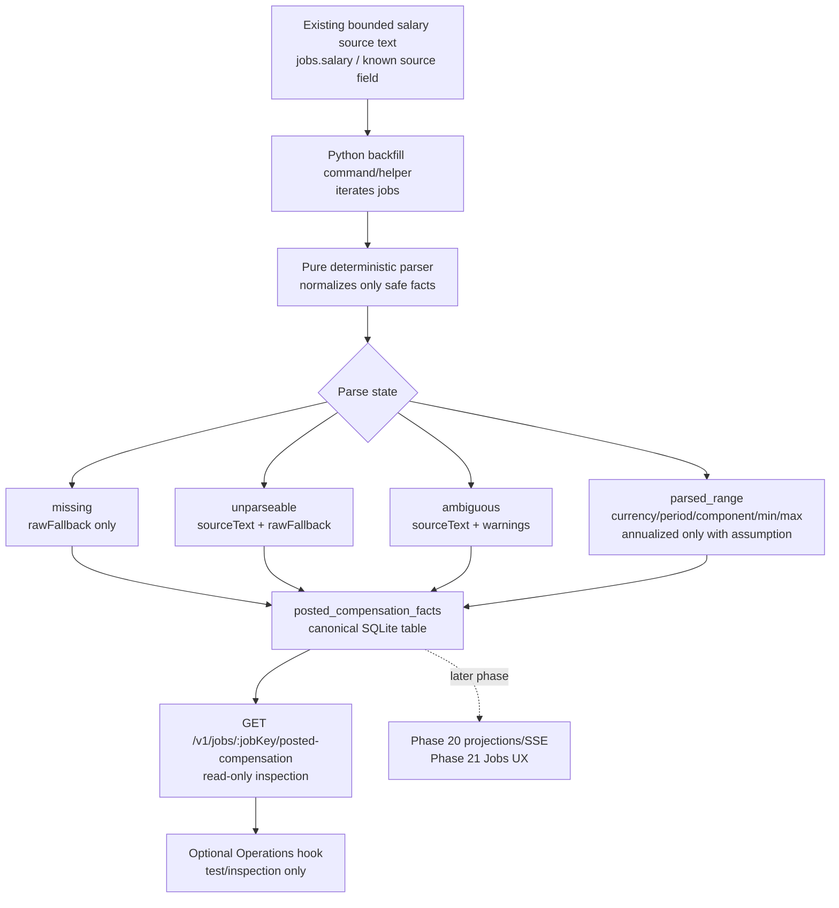

# Phase 18: Posted Compensation Facts - Research

**Researched:** 2026-06-19
**Domain:** Deterministic posted compensation parsing, canonical SQLite persistence, TypeScript inspection API, JobHunter local-first DDD architecture
**Confidence:** HIGH for repo integration and phase scope; MEDIUM for parser heuristics because final warning thresholds need implementation fixtures.

<user_constraints>
## User Constraints (from CONTEXT.md)

### Locked Decisions

Phase 18 owns posted compensation facts only. It does not estimate market ranges, import Eurostat/INE data, compare against profile floors, change scoring/ranking/filtering/apply readiness, or build the final Jobs triage compensation UX.

Phase 20 owns adding compensation summaries to the canonical job list/detail read models and SSE invalidation. Phase 21 owns final Jobs list/drawer presentation. Phase 18 may expose a narrow read-only inspection API so facts are testable and inspectable before broader read-model propagation.

- Model posted compensation as a distinct domain/read value, separate from market estimates and source registry policy.
- Additive only: keep `JobSummary.salary` and existing discovery storage behavior intact.
- Persist parsed facts in a canonical local table before exposing them through any UI-facing read model. Do not compute facts in React.
- Use deterministic parsing with explicit unsupported/ambiguous states; do not call LLMs or external services.
- Keep source text bounded and safe; do not store full descriptions or provider raw payloads in the fact table.
- Prefer a shared contract DTO with discriminated parse state so illegal combinations are avoided in API consumers.
- Use the existing Operations read path only if a web hook is needed for the inspection API; do not build final Jobs triage UI.

### the agent's Discretion

- Add shared posted compensation DTOs and parser value types.
- Add deterministic parser coverage for missing, unparseable, ambiguous, parsed range, hourly, monthly, annual, OTE, bonus, commission, equity, broad range, one-sided range, missing currency, and missing period.
- Add a canonical persistence table for per-job posted compensation facts.
- Backfill facts from existing `jobs.salary` without replacing or deleting that legacy string.
- Add a read-only API endpoint for posted compensation facts by job key or selected jobs.
- Add API/client/port support and tests if the endpoint is used by web tests.
- Document the inspection API and explicitly state that job list/detail projection propagation is Phase 20.

### Deferred Ideas (OUT OF SCOPE)

- Market estimates from Eurostat, ESCO, INE, Levels.fyi, Glassdoor, or any other benchmark provider.
- Salary-based ranking, filtering, blockers, apply readiness, or auto-apply behavior.
- Profile-floor comparison.
- Final Jobs list/drawer compensation UX.
- User correction or refresh loop.
- External salary scraping or provider network calls.
</user_constraints>

## Summary

Phase 18 should create canonical posted compensation facts beside the existing `jobs.salary` text, not replace `jobs.salary` and not propagate the facts into the Jobs list/detail projections yet. [VERIFIED: codebase grep .planning/phases/18-posted-compensation-facts/18-CONTEXT.md:24] [VERIFIED: codebase grep .planning/phases/18-posted-compensation-facts/18-CONTEXT.md:49] The repo already treats `jobs.salary` as discovery-time optional text in both Python and TypeScript mirrors, and JobSpy currently constructs that text from `min_amount`, `max_amount`, `currency`, and `interval`. [VERIFIED: codebase grep workers/automation/src/jobhunter/domain/discovery/value_objects.py:170] [VERIFIED: codebase grep workers/automation/src/jobhunter/discovery/jobspy.py:203]

The best implementation shape is a Python-owned pure parser plus a Python SQLite repository/backfill, with TypeScript contract DTOs and a narrow read-only API endpoint for inspection. [VERIFIED: codebase grep docs/architecture.md:16] [VERIFIED: codebase grep docs/local-ts-api.md:37] This keeps deterministic parsing near discovery-owned data and local migrations while letting the API expose a stable, discriminated response without React parsing. [VERIFIED: codebase grep .planning/phases/18-posted-compensation-facts/18-CONTEXT.md:51] [VERIFIED: codebase grep AGENTS.md:83]

Do not add new external packages. Use Python standard library parsing, SQLite, existing Zod/TypeScript contracts, Fastify route patterns, and existing test runners. [VERIFIED: codebase grep package.json:36] [VERIFIED: codebase grep apps/api/package.json:14] [VERIFIED: codebase grep workers/automation/pyproject.toml:56]

**Primary recommendation:** Implement `posted_compensation_facts` as a canonical local table populated by deterministic Python parsing/backfill from bounded salary source text, then expose `GET /v1/jobs/:jobKey/posted-compensation` for inspection; leave projection/SSE/final Jobs UX to Phases 20 and 21. [VERIFIED: codebase grep .planning/phases/18-posted-compensation-facts/18-CONTEXT.md:26]

## Project Constraints (from AGENTS.md)

- Check repo docs and current code before architectural claims. [VERIFIED: codebase grep AGENTS.md:1] [VERIFIED: codebase grep AGENTS.md:78]
- Do not run auto-apply, browser submission, destructive profile/database actions, or commands that submit applications without explicit user request. [VERIFIED: codebase grep AGENTS.md:30]
- Treat payloads, generated artifacts, job/application data, logs, local DBs, resumes, cover letters, PDFs, browser profiles, and secrets as sensitive. [VERIFIED: codebase grep AGENTS.md:77] [VERIFIED: codebase grep AGENTS.md:126]
- Behavior changes need unit tests; user-facing/API/product-flow changes need product-path QA beyond unit tests. [VERIFIED: codebase grep AGENTS.md:49]
- Meaningful new API/product capabilities need narrow docs updates in the owning docs, especially `docs/local-ts-api.md` for local API behavior. [VERIFIED: codebase grep AGENTS.md:53] [VERIFIED: codebase grep AGENTS.md:63]
- Every implementation task must be in a dedicated worktree, not on `main`. [VERIFIED: codebase grep AGENTS.md:103] [VERIFIED: codebase grep AGENTS.md:119]
- Auditability features must preserve explicit source of truth and must compute/persist missing audit data at the owning layer instead of masking it in the UI. [VERIFIED: codebase grep AGENTS.md:83] [VERIFIED: codebase grep AGENTS.md:85]
- Frontend reads must go through Operations hooks and ports; views compose context-owned components and must not call `useQuery`, `apiClient`, `queryClient`, `localStorage`, or `EventSource` directly. [VERIFIED: codebase grep AGENTS.md:149] [VERIFIED: codebase grep AGENTS.md:156] [VERIFIED: codebase grep AGENTS.md:197]

<phase_requirements>
## Phase Requirements

| ID | Description | Research Support |
|----|-------------|------------------|
| COMP-01 | User can see whether a job has no posted salary, an unparseable salary, an ambiguous salary, or a parsed posted range. | Use a discriminated `parseState` contract and persisted parser result. [VERIFIED: codebase grep .planning/REQUIREMENTS.md:10] |
| COMP-02 | User can inspect the exact posting field or text excerpt that produced each parsed posted salary fact. | Store bounded `sourceText` and `sourceField`, never full descriptions/provider payloads. [VERIFIED: codebase grep .planning/REQUIREMENTS.md:11] [VERIFIED: codebase grep .planning/phases/18-posted-compensation-facts/18-CONTEXT.md:53] |
| COMP-03 | User can see normalized salary range fields only when annualization assumptions are explicit. | Parser should populate normalized amounts only when currency/period/component assumptions are explicit in the fact. [VERIFIED: codebase grep .planning/REQUIREMENTS.md:12] |
| COMP-04 | User can see parse confidence and warnings for hourly, monthly, OTE, bonus, commission, equity, broad, one-sided, missing-currency, and missing-period cases. | Parser fixtures must cover each warning arm and confidence downgrade. [VERIFIED: codebase grep .planning/REQUIREMENTS.md:13] |
| COMP-05 | User can still see the legacy raw salary string when no structured compensation fact exists. | Keep `JobSummary.salary` and `jobs.salary`; API inspection response returns `rawFallback` for missing/unparseable/no fact states. [VERIFIED: codebase grep .planning/REQUIREMENTS.md:14] [VERIFIED: codebase grep apps/api/src/read-model.ts:1856] |
</phase_requirements>

## Architectural Responsibility Map

| Capability | Primary Tier | Secondary Tier | Rationale |
|------------|--------------|----------------|-----------|
| Deterministic posted salary parsing | Python worker domain/infrastructure | API for read-only exposure | Discovery data and SQLite migrations live in `workers/automation`; parser must not run in React. [VERIFIED: codebase grep docs/architecture.md:25] [VERIFIED: codebase grep .planning/phases/18-posted-compensation-facts/18-CONTEXT.md:51] |
| Canonical fact persistence/backfill | Database / Storage | Python worker repository | SQLite is the local source of truth; `jobs.salary` is existing stored data to backfill from. [VERIFIED: codebase grep docs/architecture.md:772] [VERIFIED: codebase grep workers/automation/src/jobhunter/database.py:95] |
| Inspection DTO contract | API / Backend | Shared packages | `packages/contracts` owns shared DTOs and `apps/api` owns product JSON endpoints. [VERIFIED: codebase grep docs/local-ts-api.md:498] |
| Narrow read-only inspection endpoint | API / Backend | Database | Phase 18 may expose inspection before Phase 20 read-model propagation. [VERIFIED: codebase grep .planning/phases/18-posted-compensation-facts/18-CONTEXT.md:68] |
| Optional frontend hook for inspection tests | Browser / Client | API / Backend | If needed, use Operations query key/hook and API port, matching Phase 17 compensation-source pattern. [VERIFIED: codebase grep apps/web/src/contexts/operations/hooks/useCompensationSourcePolicyQuery.ts:8] |
| Job list/detail compensation summary and SSE | Phase 20, not Phase 18 | Operations projections | Roadmap assigns projection and realtime API propagation to Phase 20. [VERIFIED: codebase grep .planning/ROADMAP.md:64] |
| Final Jobs triage UI | Phase 21, not Phase 18 | Browser / Client | Roadmap assigns list/drawer presentation to Phase 21. [VERIFIED: codebase grep .planning/ROADMAP.md:76] |

## Standard Stack

### Core

| Library | Version | Purpose | Why Standard |
|---------|---------|---------|--------------|
| Python standard library `re`, `decimal`, `dataclasses`, `enum` | Python >=3.11 project; local Python 3.14.4 | Deterministic parser and immutable value objects. | No dependency required; deterministic and testable. [VERIFIED: codebase grep workers/automation/pyproject.toml:7] [VERIFIED: environment probe] |
| SQLite via Python `sqlite3` | local CLI 3.51.0; Python stdlib binding | Canonical table, idempotent migration/backfill tests. | Existing local source of truth and worker repository pattern. [VERIFIED: codebase grep docs/architecture.md:772] [VERIFIED: environment probe] |
| `better-sqlite3` | `^12.9.0` | API read route queries canonical facts. | Existing API DB access stack. [VERIFIED: codebase grep apps/api/package.json:18] |
| Fastify | `^5.8.5` | Read-only inspection endpoint. | Existing local TypeScript API framework. [VERIFIED: codebase grep apps/api/package.json:19] |
| Zod | API `^4.4.1`, web `^4.4.3` | Contract validation and discriminated response schemas. | Existing contract pattern and frontend form/API validation library. [VERIFIED: codebase grep apps/api/package.json:20] [VERIFIED: codebase grep apps/web/package.json:57] |
| Vitest | `^4.1.5` | API/package/web tests. | Existing TypeScript test runner. [VERIFIED: codebase grep apps/api/package.json:29] [VERIFIED: codebase grep apps/web/package.json:94] |
| pytest | `>=7.0` | Parser and persistence tests. | Existing Python test runner. [VERIFIED: codebase grep workers/automation/pyproject.toml:56] |

### Supporting

| Library | Version | Purpose | When to Use |
|---------|---------|---------|-------------|
| `@jobhunter/contracts` | workspace | Shared posted compensation DTOs. | Add parse-state union and response types here. [VERIFIED: codebase grep docs/local-ts-api.md:498] |
| `@jobhunter/api-client` | workspace | Typed API client method. | Add only if frontend or tests consume the endpoint through the client. [VERIFIED: codebase grep packages/api-client/src/client.ts:128] |
| TanStack Query | `^5.100.9` | Optional Operations read hook. | Use only for a narrow inspection surface or hook test, not final UX. [VERIFIED: codebase grep apps/web/package.json:42] |

### Alternatives Considered

| Instead of | Could Use | Tradeoff |
|------------|-----------|----------|
| Python parser | TypeScript API parser | Rejected: Phase context says do not compute facts in React and facts should be persisted before UI-facing read models; Python owns discovery data/backfill. [VERIFIED: codebase grep .planning/phases/18-posted-compensation-facts/18-CONTEXT.md:51] |
| Canonical facts table | Add columns to `jobs` | Rejected: context says distinct value separate from legacy raw fallback and additive compatibility. [VERIFIED: codebase grep .planning/phases/18-posted-compensation-facts/18-CONTEXT.md:49] |
| Project into `job_list_projections` / `job_detail_projections` now | Direct read-only inspection endpoint | Rejected for Phase 18: Phase 20 owns canonical read-model propagation and SSE. [VERIFIED: codebase grep .planning/phases/18-posted-compensation-facts/18-CONTEXT.md:26] |
| LLM/external salary parser | Deterministic parser | Rejected: explicit phase decision says no LLMs or external services. [VERIFIED: codebase grep .planning/phases/18-posted-compensation-facts/18-CONTEXT.md:52] |

**Installation:**

```bash
# no external package install for Phase 18
```

## Package Legitimacy Audit

No external packages are recommended or installed for Phase 18. [VERIFIED: codebase grep package.json:61] Package legitimacy gate is not applicable because the standard stack uses existing workspace dependencies and Python standard library tools. [VERIFIED: codebase grep apps/api/package.json:14]

**Packages removed due to [SLOP] verdict:** none
**Packages flagged as suspicious [SUS]:** none

## Architecture Patterns

### System Architecture Diagram



### Recommended Project Structure

```text
packages/contracts/src/schemas.ts                         # posted compensation DTO union and response type
packages/api-client/src/client.ts                         # optional read method if frontend hook exists
apps/api/src/posted-compensation.ts                       # read mapper/query, no parsing
apps/api/src/server.ts                                    # GET /v1/jobs/:jobKey/posted-compensation
apps/api/test/posted-compensation.test.ts                 # route and safe payload tests
workers/automation/src/jobhunter/domain/compensation/     # parser value objects and pure parser
workers/automation/src/jobhunter/infrastructure/compensation/sqlite_repository.py
workers/automation/tests/test_posted_compensation_parser.py
workers/automation/tests/test_posted_compensation_repository.py
docs/local-ts-api.md                                      # endpoint docs and Phase 20 boundary note
```

### Pattern 1: Discriminated Posted Compensation Contract

**What:** Add explicit parse states (`missing`, `unparseable`, `ambiguous`, `parsed_range`) with illegal combinations excluded by TypeScript types and API mappers. [VERIFIED: codebase grep .planning/phases/18-posted-compensation-facts/18-CONTEXT.md:33]

**When to use:** Every API response for posted compensation facts. [VERIFIED: codebase grep .planning/REQUIREMENTS.md:10]

**Example:**

```typescript
// Source: packages/contracts/src/schemas.ts, following existing DTO location.
export const POSTED_COMPENSATION_PARSE_STATES = [
  "missing",
  "unparseable",
  "ambiguous",
  "parsed_range",
] as const;

export type PostedCompensationFact =
  | {
      parseState: "missing";
      sourceText: null;
      rawFallback: string | null;
      facts: [];
      warnings: [];
    }
  | {
      parseState: "unparseable" | "ambiguous";
      sourceText: string;
      rawFallback: string | null;
      facts: [];
      confidence: "low" | "medium";
      warnings: PostedCompensationWarning[];
    }
  | {
      parseState: "parsed_range";
      sourceText: string;
      rawFallback: string | null;
      facts: [PostedCompensationRangeFact, ...PostedCompensationRangeFact[]];
      confidence: "low" | "medium" | "high";
      warnings: PostedCompensationWarning[];
    };
```

### Pattern 2: Canonical Table, Legacy Raw Fallback Preserved

**What:** Create a tenant/job-scoped canonical fact table and keep `jobs.salary` unchanged. [VERIFIED: codebase grep .planning/phases/18-posted-compensation-facts/18-CONTEXT.md:50]

**When to use:** Parser backfill and any future discovery/enrichment hook that refreshes facts. [VERIFIED: codebase grep .planning/phases/18-posted-compensation-facts/18-CONTEXT.md:63]

**Example:**

```sql
-- Source: recommended Phase 18 migration shape, aligned with existing tenant/job keys.
CREATE TABLE IF NOT EXISTS posted_compensation_facts (
  tenant_id TEXT NOT NULL DEFAULT 'local',
  job_id TEXT NOT NULL,
  source_field TEXT NOT NULL,
  source_text TEXT,
  source_text_hash TEXT NOT NULL DEFAULT '',
  parse_state TEXT NOT NULL,
  component TEXT NOT NULL DEFAULT 'unknown',
  period TEXT NOT NULL DEFAULT 'unknown',
  currency TEXT,
  min_amount INTEGER,
  max_amount INTEGER,
  annualized_min_amount INTEGER,
  annualized_max_amount INTEGER,
  annualization_assumption TEXT,
  confidence TEXT NOT NULL,
  warnings_json TEXT NOT NULL DEFAULT '[]',
  raw_fallback TEXT,
  parser_version TEXT NOT NULL,
  parsed_at TEXT NOT NULL,
  PRIMARY KEY (tenant_id, job_id, source_field, source_text_hash)
);
```

### Pattern 3: Direct Inspection API Before Projection Propagation

**What:** Add a GET-only endpoint that reads the canonical table and `jobs.salary` fallback without refreshing or extending Operations projections. [VERIFIED: codebase grep .planning/phases/18-posted-compensation-facts/18-CONTEXT.md:68]

**When to use:** Phase 18 testability and inspection before Phase 20 adds list/detail read-model contracts. [VERIFIED: codebase grep .planning/ROADMAP.md:64]

**Example:**

```typescript
// Source: apps/api/src/server.ts route style.
app.get<{ Params: { jobKey: string } }>(
  "/v1/jobs/:jobKey/posted-compensation",
  async (request, reply) =>
    withDb(reply, options.dbPath, (db) => {
      const result = getPostedCompensationFact(db, decodeRouteParam(request.params.jobKey));
      if (!result) {
        void reply.code(404);
        return { ok: false, error: "job_not_found" };
      }
      return result;
    }),
);
```

### Anti-Patterns to Avoid

- **Parsing in React or view components:** Violates the phase decision to persist facts before UI-facing read models. [VERIFIED: codebase grep .planning/phases/18-posted-compensation-facts/18-CONTEXT.md:51]
- **Adding salary sort/filter/ranking:** Explicitly out of scope for Phase 18 and v1.3 warning-only behavior. [VERIFIED: codebase grep .planning/phases/18-posted-compensation-facts/18-CONTEXT.md:75] [VERIFIED: codebase grep .planning/STATE.md:73]
- **Annualizing hourly/monthly values silently:** Violates COMP-03; annualized values require explicit assumptions. [VERIFIED: codebase grep .planning/REQUIREMENTS.md:12]
- **Treating raw fallback as normalized data:** Violates COMP-05 and the context definition of raw fallback. [VERIFIED: codebase grep .planning/phases/18-posted-compensation-facts/18-CONTEXT.md:32]
- **Storing full descriptions or provider raw payloads in fact rows:** Violates bounded source text and sensitive-data constraints. [VERIFIED: codebase grep .planning/phases/18-posted-compensation-facts/18-CONTEXT.md:53] [VERIFIED: codebase grep AGENTS.md:77]

## Don't Hand-Roll

| Problem | Don't Build | Use Instead | Why |
|---------|-------------|-------------|-----|
| API transport client | Custom `fetch` in web code | `@jobhunter/api-client` plus `ApiClientPort` | Existing frontend forbids direct API calls and routes through ports. [VERIFIED: codebase grep AGENTS.md:197] |
| Frontend server-state cache | Component `useState` loading | Operations TanStack Query hook if web inspection is included | Existing architecture stores server state in Query cache. [VERIFIED: codebase grep docs/architecture.md:470] |
| Projection propagation | Ad hoc joins in read model | Phase 20 projection work | Projection tables are mirrored by Python and TS and Phase 20 owns compensation propagation. [VERIFIED: codebase grep docs/architecture.md:409] [VERIFIED: codebase grep .planning/ROADMAP.md:64] |
| Salary estimates | Benchmark inference or provider scraping | Explicit unsupported/out-of-scope state | Phase 18 is posted facts only. [VERIFIED: codebase grep .planning/phases/18-posted-compensation-facts/18-CONTEXT.md:74] |
| Numeric precision beyond source evidence | Guessing currency/period/component | Warnings plus `ambiguous` / unknown fields | False precision is a known milestone risk. [VERIFIED: codebase grep .planning/STATE.md:83] |

**Key insight:** Custom parsing is acceptable here only because the product decision requires deterministic, bounded, inspectable parsing of a constrained legacy field; market estimation, provider access, projection propagation, and final UX are separate phases. [VERIFIED: codebase grep .planning/ROADMAP.md:12]

## Runtime State Inventory

| Category | Items Found | Action Required |
|----------|-------------|-----------------|
| Stored data | `jobs.salary` is the legacy raw salary text and is currently projected as `JobSummary.salary`. [VERIFIED: codebase grep workers/automation/src/jobhunter/database.py:101] [VERIFIED: codebase grep apps/api/src/read-model.ts:1856] | Add `posted_compensation_facts`; backfill from `jobs.salary`; never delete or overwrite `jobs.salary`. |
| Live service config | None found for posted compensation facts. Existing compensation source policy is static metadata and not job-specific facts. [VERIFIED: codebase grep apps/api/src/compensation-source-policy.ts:21] | No live config migration. |
| OS-registered state | None found. Phase 18 does not register OS services. [VERIFIED: codebase grep .planning/phases/18-posted-compensation-facts/18-CONTEXT.md:72] | None. |
| Secrets/env vars | Licensed provider env gates exist for Phase 17 source policy but Phase 18 must not use provider credentials or external services. [VERIFIED: codebase grep apps/api/src/compensation-source-policy.ts:149] [VERIFIED: codebase grep .planning/phases/18-posted-compensation-facts/18-CONTEXT.md:79] | No secret/env var changes. |
| Build artifacts | None found. Phase 18 code/config changes require normal TS/Python build/test only. [VERIFIED: codebase grep package.json:36] | None beyond normal build outputs ignored by repo. |

## Common Pitfalls

### Pitfall 1: False Precision From Partial Text

**What goes wrong:** Parser turns "up to 80k", "competitive", "OTE 120k", or "50-70/hour" into precise annual base salary without warnings. [VERIFIED: codebase grep .planning/REQUIREMENTS.md:13]
**Why it happens:** Numeric extraction is easier than evidence classification. [ASSUMED]
**How to avoid:** Require component, period, currency, one-sided/broad-range, and annualization warnings before normalized/annualized fields are populated. [VERIFIED: codebase grep .planning/REQUIREMENTS.md:12]
**Warning signs:** Annualized amounts exist while `annualizationAssumption` is null or warnings are empty. [VERIFIED: codebase grep .planning/phases/18-posted-compensation-facts/18-CONTEXT.md:36]

### Pitfall 2: Raw Fallback Confusion

**What goes wrong:** API consumers treat `rawFallback` or `JobSummary.salary` as normalized salary truth. [VERIFIED: codebase grep .planning/REQUIREMENTS.md:14]
**Why it happens:** Current Jobs overview displays `job.salary` plainly. [VERIFIED: codebase grep apps/web/src/views/jobs/JobOverview.tsx:27]
**How to avoid:** Keep fallback under a clearly named field and only expose normalized fields under `parseState: "parsed_range"`. [VERIFIED: codebase grep .planning/phases/18-posted-compensation-facts/18-CONTEXT.md:54]
**Warning signs:** Tests assert range numbers from `jobs.salary` directly rather than from canonical fact rows. [VERIFIED: codebase grep workers/automation/tests/test_job_repository.py:66]

### Pitfall 3: Accidental Phase 20 / Phase 21 Scope Creep

**What goes wrong:** Planner adds compensation to `job_list_projections`, SSE handlers, or final Jobs drawer sections in Phase 18. [VERIFIED: codebase grep .planning/ROADMAP.md:64] [VERIFIED: codebase grep .planning/ROADMAP.md:76]
**Why it happens:** The feature is user-facing, but Phase 18 intentionally exposes only a testable inspection API. [VERIFIED: codebase grep .planning/phases/18-posted-compensation-facts/18-CONTEXT.md:26]
**How to avoid:** Plan Phase 18 as parser/table/backfill/API, with docs that state projection propagation is Phase 20. [VERIFIED: codebase grep .planning/phases/18-posted-compensation-facts/18-CONTEXT.md:70]
**Warning signs:** `job_list_projections` schema changes or `DomainEvent` additions appear in Phase 18. [VERIFIED: codebase grep docs/architecture.md:409]

### Pitfall 4: Sensitive Text Over-Capture

**What goes wrong:** The fact table stores full descriptions, provider payloads, local paths, or logs. [VERIFIED: codebase grep .planning/phases/18-posted-compensation-facts/18-CONTEXT.md:53]
**Why it happens:** Full job descriptions are available in enrichment and are tempting to scan. [VERIFIED: codebase grep workers/automation/src/jobhunter/domain/discovery/value_objects.py:174]
**How to avoid:** Use `jobs.salary` first and only bounded known salary/source fields; cap `source_text` length and record `source_field`. [VERIFIED: codebase grep .planning/phases/18-posted-compensation-facts/18-CONTEXT.md:31]
**Warning signs:** API test payload contains full job descriptions, provider raw keys, or local paths. [VERIFIED: codebase grep docs/local-ts-api.md:63]

### Pitfall 5: Apply/Scoring Impact

**What goes wrong:** Salary facts affect score eligibility, apply readiness, ranking, filters, or auto-apply. [VERIFIED: codebase grep .planning/phases/18-posted-compensation-facts/18-CONTEXT.md:24]
**Why it happens:** Existing scoring tests contain salary-related blocker examples, but v1.3 compensation must remain warning-only. [VERIFIED: codebase grep workers/automation/tests/test_scoring_eval.py:54] [VERIFIED: codebase grep .planning/STATE.md:73]
**How to avoid:** Add regression tests around jobs filters, score/apply readiness selectors, and apply queue selectors proving unchanged behavior. [VERIFIED: codebase grep .planning/phases/18-posted-compensation-facts/18-CONTEXT.md:86]
**Warning signs:** New code touches scoring policies, apply selectors, `JobsView` filters, or `SQL_JOB_SORT_COLUMNS`. [VERIFIED: codebase grep apps/api/test/server.test.ts:830]

## Code Examples

### Parser Result Value Object

```python
# Source: proposed domain/compensation value object, following frozen dataclass style.
from dataclasses import dataclass
from enum import Enum

class ParseState(str, Enum):
    MISSING = "missing"
    UNPARSEABLE = "unparseable"
    AMBIGUOUS = "ambiguous"
    PARSED_RANGE = "parsed_range"

@dataclass(frozen=True)
class PostedCompensationRange:
    currency: str | None
    period: str
    component: str
    min_amount: int | None
    max_amount: int | None
    annualized_min_amount: int | None = None
    annualized_max_amount: int | None = None
    annualization_assumption: str | None = None

@dataclass(frozen=True)
class PostedCompensationParse:
    parse_state: ParseState
    source_field: str
    source_text: str
    raw_fallback: str | None
    facts: tuple[PostedCompensationRange, ...]
    confidence: str
    warnings: tuple[str, ...]
```

### API Safety Test Shape

```typescript
// Source: mirror apps/api/test/compensation-source-policy.test.ts safe payload pattern.
it("does not expose full descriptions, provider payloads, paths, or secrets", async () => {
  const response = await app.inject({
    method: "GET",
    url: `/v1/jobs/${encodeURIComponent(jobKey)}/posted-compensation`,
  });
  expect(response.statusCode, response.body).toBe(200);
  const serialized = JSON.stringify(response.json());
  expect(serialized).not.toContain("full_description");
  expect(serialized).not.toContain("rawProviderPayload");
  expect(serialized).not.toContain("/Users/");
  expect(serialized).not.toContain("secret");
});
```

## State of the Art

| Old Approach | Current Approach | When Changed | Impact |
|--------------|------------------|--------------|--------|
| Legacy raw `jobs.salary` displayed as text | Canonical posted compensation fact table plus raw fallback compatibility | Phase 18 plan | Enables auditability without breaking `JobSummary.salary`. [VERIFIED: codebase grep .planning/phases/18-posted-compensation-facts/18-CONTEXT.md:50] |
| Read-model compensation parsing | Persist first, expose via API later | Phase 18/20 split | Prevents React/API read-time parsing and keeps projection parity for Phase 20. [VERIFIED: codebase grep .planning/phases/18-posted-compensation-facts/18-CONTEXT.md:51] |
| Hidden salary effects | Warning-only compensation evidence | v1.3 roadmap | No ranking/filtering/apply readiness impact in v1.3. [VERIFIED: codebase grep .planning/ROADMAP.md:12] |

**Deprecated/outdated:**

- Treating `jobs.salary` as normalized compensation is not acceptable for v1.3; it remains a legacy raw fallback only. [VERIFIED: codebase grep .planning/phases/18-posted-compensation-facts/18-CONTEXT.md:32]
- Adding provider-based market salary data in Phase 18 is out of scope. [VERIFIED: codebase grep .planning/phases/18-posted-compensation-facts/18-CONTEXT.md:74]

## Assumptions Log

| # | Claim | Section | Risk if Wrong |
|---|-------|---------|---------------|
| A1 | Numeric extraction is easier than evidence classification. | Common Pitfalls | Planner may under-allocate parser-warning fixtures. |
| A2 | Python standard library parsing is sufficient for Phase 18's constrained salary text. | Standard Stack | Parser may need additional locale cases; solve with fixtures before adding dependencies. |

## Open Questions (RESOLVED)

1. **Should Phase 18 parse full descriptions for salary text?**
   - What we know: Source text must be bounded and the fact table must not store full descriptions/provider payloads. [VERIFIED: codebase grep .planning/phases/18-posted-compensation-facts/18-CONTEXT.md:53]
   - Decision: Phase 18 parses only `jobs.salary` and explicitly bounded salary/source fields. It does not parse full descriptions, provider payloads, or arbitrary scraped text.
   - Rationale: This satisfies COMP-02 source-text inspection while preserving the sensitive-data boundary; broader excerpt extraction needs its own fixture and audit design.

2. **Should parser facts be produced during future discovery upserts or only by backfill?**
   - What we know: JobSpy writes/refreshes salary text during discovery upserts. [VERIFIED: codebase grep workers/automation/src/jobhunter/discovery/jobspy.py:352]
   - Decision: Phase 18 creates facts through Python-owned parser/persistence paths: an idempotent backfill over existing jobs and a JobSpy integration after discovery writes. API GET routes do not parse, backfill, or persist.
   - Rationale: Canonical facts are persisted before exposure, and the inspection API remains a read-only row mapper.

## Environment Availability

| Dependency | Required By | Available | Version | Fallback |
|------------|-------------|-----------|---------|----------|
| Node.js | TS contracts/API tests | yes | v25.9.0 | Project requires >=20.19.0. [VERIFIED: environment probe] [VERIFIED: codebase grep package.json:8] |
| pnpm via corepack | TS scripts | yes | 10.24.0 | None needed. [VERIFIED: environment probe] [VERIFIED: codebase grep package.json:7] |
| uv | Python tests/lint | yes | 0.11.7 | None needed. [VERIFIED: environment probe] |
| Python | Parser/repository tests | yes | 3.14.4 | Project requires >=3.11. [VERIFIED: environment probe] [VERIFIED: codebase grep workers/automation/pyproject.toml:7] |
| SQLite CLI | Schema inspection/manual debugging | yes | 3.51.0 | Python `sqlite3` / `better-sqlite3`. [VERIFIED: environment probe] |

**Missing dependencies with no fallback:** none

**Missing dependencies with fallback:** none

## Validation Architecture

### Test Framework

| Property | Value |
|----------|-------|
| Framework | pytest for Python parser/persistence; Vitest for API/contracts/web hook tests. [VERIFIED: codebase grep workers/automation/pyproject.toml:56] [VERIFIED: codebase grep apps/api/package.json:10] |
| Config file | Python config in `workers/automation/pyproject.toml`; API Vitest uses package defaults. [VERIFIED: codebase grep workers/automation/pyproject.toml:81] [VERIFIED: codebase grep apps/api/package.json:10] |
| Quick run command | `uv --project workers/automation run --extra dev pytest -q workers/automation/tests/test_posted_compensation_parser.py workers/automation/tests/test_posted_compensation_repository.py && pnpm api:test -- posted-compensation` |
| Full suite command | `pnpm test` |

### Phase Requirements -> Test Map

| Req ID | Behavior | Test Type | Automated Command | File Exists? |
|--------|----------|-----------|-------------------|--------------|
| COMP-01 | Missing/unparseable/ambiguous/parsed states persist and serialize. | unit + API | `uv --project workers/automation run --extra dev pytest -q workers/automation/tests/test_posted_compensation_parser.py && pnpm api:test -- posted-compensation` | no - Wave 0 |
| COMP-02 | Exact bounded source text and source field are inspectable. | persistence + API | `uv --project workers/automation run --extra dev pytest -q workers/automation/tests/test_posted_compensation_repository.py` | no - Wave 0 |
| COMP-03 | Normalized and annualized values appear only with explicit assumptions. | parser unit | `uv --project workers/automation run --extra dev pytest -q workers/automation/tests/test_posted_compensation_parser.py` | no - Wave 0 |
| COMP-04 | Warnings/confidence cover hourly/monthly/OTE/bonus/commission/equity/broad/one-sided/missing-currency/missing-period. | parser unit | same parser command | no - Wave 0 |
| COMP-05 | Legacy raw fallback remains available when no structured fact exists. | persistence + API regression | `pnpm api:test -- posted-compensation` | no - Wave 0 |
| Safety | No fit score, apply readiness, ranking, filtering, or apply mutation paths change. | regression | `pnpm api:test -- server` plus targeted Python apply/scoring selector tests | existing tests, add assertions |

### Sampling Rate

- **Per task commit:** `uv --project workers/automation run --extra dev pytest -q workers/automation/tests/test_posted_compensation_parser.py workers/automation/tests/test_posted_compensation_repository.py && pnpm api:test -- posted-compensation`
- **Per wave merge:** `pnpm api:check && pnpm api:test && uv --project workers/automation run --extra dev pytest -q`
- **Phase gate:** `pnpm test` plus `git diff --check`

### Wave 0 Gaps

- [ ] `workers/automation/tests/test_posted_compensation_parser.py` - covers COMP-01, COMP-03, COMP-04.
- [ ] `workers/automation/tests/test_posted_compensation_repository.py` - covers COMP-02, COMP-05, canonical table/backfill.
- [ ] `apps/api/test/posted-compensation.test.ts` - covers route contract, raw fallback, safe payload.
- [ ] Optional `apps/web/src/contexts/operations/hooks/usePostedCompensationQuery.test.ts` - only if web inspection hook is added.
- [ ] Docs update in `docs/local-ts-api.md` - endpoint and explicit Phase 20 boundary.

## Security Domain

### Applicable ASVS Categories

| ASVS Category | Applies | Standard Control |
|---------------|---------|------------------|
| V2 Authentication | no | Local API auth unchanged; endpoint is loopback local app surface. [VERIFIED: codebase grep docs/local-ts-api.md:7] |
| V3 Session Management | no | No session behavior change. [VERIFIED: codebase grep .planning/phases/18-posted-compensation-facts/18-CONTEXT.md:72] |
| V4 Access Control | yes | GET-only route; no mutation except local backfill/test helpers. [VERIFIED: codebase grep .planning/phases/18-posted-compensation-facts/18-CONTEXT.md:68] |
| V5 Input Validation | yes | Decode `jobKey`, validate DTO shape with contract types/Zod; cap source text length. [VERIFIED: codebase grep apps/api/src/server.ts:696] |
| V6 Cryptography | no | No crypto or credential storage. [VERIFIED: codebase grep .planning/phases/18-posted-compensation-facts/18-CONTEXT.md:79] |
| V7 Error Handling | yes | 404 for missing job; no raw DB errors or source payload leakage. [VERIFIED: codebase grep apps/api/src/server.ts:696] |
| V9 Communications | no | No external services or network calls. [VERIFIED: codebase grep .planning/phases/18-posted-compensation-facts/18-CONTEXT.md:79] |

### Known Threat Patterns for Phase 18

| Pattern | STRIDE | Standard Mitigation |
|---------|--------|---------------------|
| Sensitive text overexposure | Information Disclosure | Store bounded source text only; API tests reject full descriptions, local paths, provider payloads, and secrets. [VERIFIED: codebase grep AGENTS.md:77] |
| False normalized salary claim | Tampering / Repudiation | Persist parse state, confidence, warnings, and annualization assumption; never infer unsupported fields silently. [VERIFIED: codebase grep .planning/REQUIREMENTS.md:12] |
| Raw fallback treated as source of truth | Tampering | Use `rawFallback` naming and discriminated states; keep normalized fields only on parsed facts. [VERIFIED: codebase grep .planning/phases/18-posted-compensation-facts/18-CONTEXT.md:32] |
| Accidental external scraping | Information Disclosure / Legal | No provider clients or network calls in Phase 18; use synthetic salary strings in tests. [VERIFIED: codebase grep .planning/phases/18-posted-compensation-facts/18-CONTEXT.md:91] |
| Salary facts affecting apply/scoring | Elevation of Privilege / Tampering | Regression tests around jobs filters, scoring, apply readiness, and apply selectors. [VERIFIED: codebase grep .planning/phases/18-posted-compensation-facts/18-CONTEXT.md:86] |

## Sources

### Primary (HIGH confidence)

- `.planning/phases/18-posted-compensation-facts/18-CONTEXT.md` - Phase 18 scope, decisions, validation, safety.
- `.planning/REQUIREMENTS.md` - COMP-01 through COMP-05, out-of-scope salary behavior, phase traceability.
- `.planning/ROADMAP.md` - Phase 18/20/21 boundaries and v1.3 warning-only scope.
- `docs/architecture.md` - local-first architecture, bounded contexts, projections, SQLite source of truth.
- `docs/local-ts-api.md` - API read-model pattern, safe payload expectations, source-policy endpoint precedent.
- `AGENTS.md` - repo constraints, testing, sensitive-data, frontend architecture rules.
- `workers/automation/src/jobhunter/discovery/jobspy.py` - current salary construction and storage flow.
- `workers/automation/src/jobhunter/database.py` - jobs table and SQLite initialization.
- `apps/api/src/read-model.ts` and `apps/api/src/server.ts` - existing read route and `JobSummary.salary` mapping.
- `apps/api/src/compensation-source-policy.ts` and tests - Phase 17 read-only compensation endpoint precedent.

### Secondary (MEDIUM confidence)

- GSD `research-plan` seam returned websearch, but results were generic and not authoritative for this private repo; findings were cached as LOW and not used for recommendations. [VERIFIED: gsd-tools research-plan]

### Tertiary (LOW confidence)

- Assumptions A1-A2 in the Assumptions Log.

## Metadata

**Confidence breakdown:**
- Standard stack: HIGH - uses existing repo packages and Python standard library, with local version probes.
- Architecture: HIGH - directly constrained by Phase 18 context, roadmap, architecture docs, and code.
- Pitfalls: MEDIUM - key risks are explicitly named in planning state, but exact parser thresholds need fixtures.

**Research date:** 2026-06-19
**Valid until:** 2026-07-19 for local architecture; revisit sooner if Phase 20 changes projection contracts before Phase 18 implementation.
