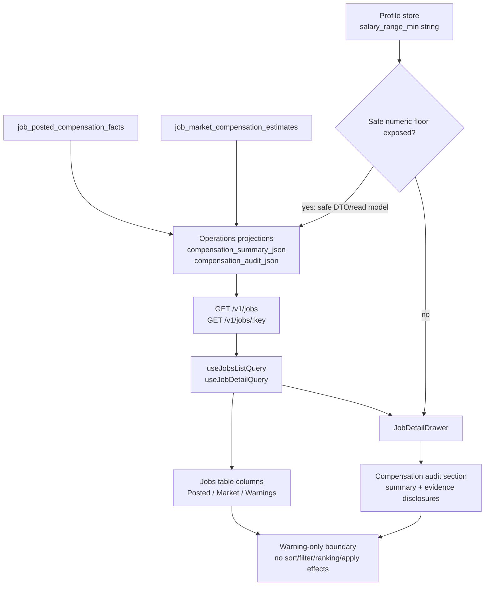

# Phase 21: Jobs Triage UX & Warning-Only Floor - Research

**Researched:** 2026-06-20
**Domain:** React/Vite Jobs triage UI on projection-backed compensation read models
**Confidence:** HIGH for codebase contracts, MEDIUM for external framework docs

<user_constraints>
## User Constraints (from CONTEXT.md)

### Locked Decisions

Copied verbatim from `.planning/phases/21-jobs-triage-ux-warning-only-floor/21-CONTEXT.md`. [VERIFIED: 21-CONTEXT.md]

#### Jobs List Compensation Scan
- **D-01:** The Jobs table should use separate `Posted`, `Market`, and `Warnings` columns rather than one combined compensation column.
- **D-02:** When both posted and market data exist, the conceptual priority is posted salary first because it is the employer-provided claim; market estimate is comparison context.
- **D-03:** Missing or unsupported values in the table should render as compact minimal dashes visually, not long explanatory labels. The dash must still be backed by accessible labels, titles, or drawer detail so missing salary and unsupported states are not silent omissions.
- **D-04:** On mobile and narrow widths, keep the separate compensation columns and rely on the existing table horizontal scroll rather than collapsing them into one responsive summary column.
- **D-05:** Compensation table fields are display-only in v1.3. Do not add salary sorting, salary filtering, ranking changes, fit-score effects, apply-readiness changes, blockers, or dispatch gates.

#### Drawer Compensation Audit Layout
- **D-06:** Add a dedicated compensation audit section immediately after `JobAuditTriage` in `JobDetailDrawer`, before description, actions, diagnostics, artifacts, and history.
- **D-07:** The drawer section should use a summary-plus-evidence structure: a top summary for posted, market, and floor comparison followed by evidence details.
- **D-08:** Source trail, confidence factors, assumptions, and detailed reasons should use progressive disclosure. The main section should stay scannable, with expanded rows/details for factor/source detail.
- **D-09:** Drawer missing states must be explicit. Explain no posted salary, insufficient evidence, unsupported market estimate states, source unavailable states, and unavailable-source reasons in the drawer even when the table uses compact dashes.

#### Warning-Only Profile Floor
- **D-10:** Phase 21 must keep profile-floor comparison in scope to satisfy UI-03 and UI-04.
- **D-11:** Use only the existing numeric profile compensation minimum for floor comparison. Do not parse free-text salary expectations in this phase.
- **D-12:** If no numeric profile compensation minimum exists, show a muted `not configured` floor state in the drawer and keep the list warning count unchanged.
- **D-13:** When posted salary and market estimate both exist, show each comparison basis separately. The UI must tell the user whether the floor concern used posted salary, market estimate, both, or neither.
- **D-14:** Floor comparison can contribute to compensation warnings and the Jobs list warning count, and can appear inside the drawer compensation audit section. It must never appear as an Apply concern, missing prerequisite, hard blocker, apply-readiness state, fit-score factor, ranking input, filter input, or apply dispatch condition.

#### Carry Forward From Prior Phases
- **D-15:** `JobSummary.salary` remains the raw discovery string for compatibility; structured compensation data is additive and preferred for new UI.
- **D-16:** Posted compensation facts and reported company-role market estimates remain visually and semantically separate in every surface.
- **D-17:** Levels.fyi and Glassdoor automated access remains disabled unless permitted access exists. Phase 21 must not add fetch, scrape, cache, import, credential, or provider network paths.
- **D-18:** Safe event/read-model payload boundaries from Phase 20 remain binding: no source text beyond allowed excerpts, no private preferences beyond safe comparison facts, no credentials, no local paths, and no unsafe provider payloads in UI fixtures, logs, stories, or events.

### the agent's Discretion

Copied verbatim from `.planning/phases/21-jobs-triage-ux-warning-only-floor/21-CONTEXT.md`. [VERIFIED: 21-CONTEXT.md]

- Choose component names, exact microcopy, iconography, and CSS class names that match the existing Jobs drawer and table conventions.
- Choose whether progressive disclosure uses native `details`, an existing shared disclosure primitive, or a small context-owned component, provided accessibility and mobile layout are verified.
- Choose exact warning labels and ordering, provided posted, market, and floor basis remain distinguishable and no warning is promoted into apply readiness or blockers.

### Deferred Ideas (OUT OF SCOPE)

Copied verbatim from `.planning/phases/21-jobs-triage-ux-warning-only-floor/21-CONTEXT.md`. [VERIFIED: 21-CONTEXT.md]

- None - discussion stayed within phase scope.
</user_constraints>

## Project Constraints (from AGENTS.md)

- Use repository docs before architectural, workflow, or QA decisions: `README.md`, `docs/local-reliability-qa.md`, `docs/local-ts-api.md`, `docs/architecture.md`, `docs/job-pipeline-architecture.md`, `docs/ddd-target.md`, `docs/frontend-target.md`, `docs/decisions.md`, `package.json`, and `workers/automation/pyproject.toml`. [VERIFIED: AGENTS.md]
- Do not run auto-apply, browser submission, destructive profile/database actions, or commands that submit applications unless explicitly requested. [VERIFIED: AGENTS.md]
- Frontend views compose context components and Operations hooks; views must not call `useQuery`, `useMutation`, `apiClient.*`, or `queryClient.*` directly. [VERIFIED: AGENTS.md]
- Server data must live in TanStack Query, URL state in typed route search params, and durable client preferences in Zustand stores. [VERIFIED: docs/frontend-target.md]
- Bounded-context folders under `apps/web/src/contexts/` mirror backend contexts; `operations/` owns read-side hooks and query-key registry. [VERIFIED: AGENTS.md]
- Jobs table column models live in `views/<view>/columns.tsx`; cell renderers compose context-owned components rather than duplicating context UI. [VERIFIED: AGENTS.md]
- Direct `localStorage`, `navigator.clipboard`, `new EventSource`, and direct API calls from feature code are forbidden; use ports and Operations/SSE infrastructure. [VERIFIED: AGENTS.md]
- Tests are colocated under `apps/web/src`, type-level tests live under `apps/web/test/types`, MSW handlers are centralized in `apps/web/src/test/msw/handlers.ts`, and a11y tests use `*.a11y.test.tsx`. [VERIFIED: AGENTS.md]
- User-facing UI/API/product-flow changes require QA that exercises the product path, not only unit tests. [VERIFIED: AGENTS.md]
- Meaningful new capabilities require narrow documentation updates in the owning documents; no documentation update is needed for internal-only refactors or tests unless behavior changes. [VERIFIED: AGENTS.md]
- Work must happen off `main`; this research was produced from branch/worktree `worktree/b25f`. [VERIFIED: git status]

<phase_requirements>
## Phase Requirements

| ID | Description | Research Support |
|----|-------------|------------------|
| UI-01 | User can scan posted salary, market estimate state, statistical confidence, and warning count from the Jobs list without opening the drawer. | Add display-only `Posted`, `Market`, and `Warnings` columns in `apps/web/src/views/jobs/columns.tsx`, reading `JobSummary.compensationSummary`. [VERIFIED: 21-UI-SPEC.md; packages/contracts/src/schemas.ts] |
| UI-02 | User can inspect a dedicated compensation audit section in the Jobs drawer showing posted range, market estimate, source trail, confidence factors, assumptions, warnings, and unavailable-source reasons. | Insert a view-local `JobCompensationAuditSection` immediately after `<JobAuditTriage detail={detail} />` and render `JobDetail.compensationAudit`. [VERIFIED: 21-UI-SPEC.md; apps/web/src/views/jobs/JobDetailDrawer.tsx; packages/contracts/src/schemas.ts] |
| UI-03 | User can see profile-floor comparison as a warning-only audit concern, never as hidden ranking, filtering, apply-readiness, or blocker behavior. | Keep floor output in compensation section/list warning count only; do not add apply-audit facts, sortable fields, filters, scoring inputs, or mutation gates. [VERIFIED: 21-CONTEXT.md; apps/web/src/views/jobs/JobsView.tsx; apps/web/src/views/jobs/JobAuditTriage.tsx] |
| UI-04 | User can tell whether profile-floor comparison used posted salary, market estimate, both, or neither. | Planner must include an explicit basis model/copy in the drawer; current contracts expose posted and market ranges separately but no dedicated floor-comparison DTO. [VERIFIED: packages/contracts/src/schemas.ts; apps/api/src/profile-store.ts] |
| UI-05 | User can see missing salary and unsupported market-estimate states explicitly rather than blank salary cells or silent omission. | Table dashes need accessible labels; drawer needs explicit not-recorded, missing, unparseable, ambiguous, not-requested, unsupported, insufficient-evidence, and source-unavailable text. [VERIFIED: 21-UI-SPEC.md; packages/contracts/src/schemas.ts] |
| UI-06 | User can review compensation source labels, freshness, confidence, and warnings on mobile and desktop without text overlap or layout crowding. | Use existing dense drawer/table styles, increase `.jobs-data-grid-table` min width, preserve horizontal scroll, and test mobile/narrow layout. [VERIFIED: 21-UI-SPEC.md; apps/web/src/styles/globals.css] |
</phase_requirements>

## Summary

Phase 21 should be planned as a view-layer UI phase over existing projection-backed compensation contracts. [VERIFIED: 21-CONTEXT.md; docs/local-ts-api.md] The Jobs list already receives `JobSummary.compensationSummary`, and the drawer already receives top-level `JobDetail.compensationAudit`; both shapes are defined in `packages/contracts/src/schemas.ts` and deserialized from projection JSON by `apps/api/src/read-model.ts`. [VERIFIED: packages/contracts/src/schemas.ts; apps/api/src/read-model.ts]

The main implementation gap is profile-floor comparison. [VERIFIED: packages/contracts/src/schemas.ts; apps/api/src/profile-store.ts] The current shared compensation contracts expose posted and market values, but they do not expose a dedicated floor-comparison result or a typed numeric profile-floor DTO on `JobDetail`. [VERIFIED: packages/contracts/src/schemas.ts] Profile storage contains `compensation_salary_range_min` and exposes it as string `profile.compensation.salary_range_min`. [VERIFIED: apps/api/src/profile-store.ts; packages/contracts/src/schemas.ts] Planning must therefore add a small, safe, source-owned floor-comparison field through the owning API/read-model path if floor warnings should affect the Jobs list warning count; otherwise the UI can only render `Floor not configured`/no warning from the current job contracts. [VERIFIED: 21-CONTEXT.md; apps/api/src/profile-store.ts]

**Primary recommendation:** Build Phase 21 in two bounded slices: first add typed, synthetic compensation fixtures and Jobs table scan columns; second add the drawer compensation audit section plus a minimal safe floor-comparison contract if not already exposed by Phase 20. [VERIFIED: 21-UI-SPEC.md; apps/web/src/test/fixtures/projections.ts]

## Architectural Responsibility Map

| Capability | Primary Tier | Secondary Tier | Rationale |
|------------|--------------|----------------|-----------|
| Jobs list compensation scan columns | Browser / Client | API / Backend | The browser renders additive `compensationSummary` fields already delivered by `/v1/jobs`; no parsing or fetching belongs in React. [VERIFIED: docs/local-ts-api.md; packages/contracts/src/schemas.ts] |
| Drawer compensation audit section | Browser / Client | API / Backend | The browser composes `JobDetail.compensationAudit` into an audit section; backend owns persisted projection JSON and canonical source separation. [VERIFIED: docs/local-ts-api.md; apps/web/src/views/jobs/JobDetailDrawer.tsx] |
| Posted and market source provenance | API / Backend | Database / Storage | Posted facts and market estimates are canonical persisted rows projected into list/detail JSON; UI consumes only safe projected fields. [VERIFIED: docs/local-ts-api.md; apps/api/src/projections.ts] |
| Profile-floor comparison | API / Backend | Browser / Client | Profile floor comes from profile storage and must stay warning-only; a safe derived comparison should be owned by the read-model/API boundary if it contributes to list warning count. [VERIFIED: apps/api/src/profile-store.ts; 21-CONTEXT.md] |
| No ranking/filtering/apply effects | API / Backend | Browser / Client | Server sort/filter query contract and apply audit/readiness contracts must not gain compensation fields; browser sortable whitelist and filter columns must not add them. [VERIFIED: apps/web/src/views/jobs/JobsView.tsx; packages/contracts/src/schemas.ts] |
| Responsive compensation evidence | Browser / Client | CSS / Design System | Table min-width/horizontal scroll and drawer wrapping are CSS/view responsibilities under the approved UI contract. [VERIFIED: 21-UI-SPEC.md; apps/web/src/styles/globals.css] |

## Standard Stack

### Core

| Library | Version | Purpose | Why Standard |
|---------|---------|---------|--------------|
| React | package `^19.2.3`, lockfile `19.2.5`; npm latest `19.2.7` modified 2026-06-19 | Component rendering for Jobs table/drawer | Existing app dependency and runtime surface. [VERIFIED: apps/web/package.json; pnpm-lock.yaml; npm registry] |
| TanStack Query | package `^5.100.9`, lockfile `5.100.9`; npm latest `5.101.0` modified 2026-06-19 | Server-state cache through Operations hooks | Existing `useJobsListQuery` and `useJobDetailQuery` use object syntax with query keys and API port. [VERIFIED: apps/web/package.json; apps/web/src/contexts/operations/hooks/useJobsListQuery.ts; TanStack Query docs] |
| TanStack Router | package `^1.93.0`, lockfile `1.169.2`; npm latest `1.170.16` modified 2026-06-19 | URL-backed Jobs search state and drawer route | `JobsView` uses route search params for sort/filter/page state. [VERIFIED: apps/web/package.json; apps/web/src/views/jobs/JobsView.tsx] |
| TanStack Table / local DataGrid wrapper | package `^8.20.0`, lockfile `8.21.3`; npm latest `8.21.3` modified 2026-06-20 | Table column model, sort/filter/pagination through `FilterableDataGrid` | Existing Jobs table column definitions live in `views/jobs/columns.tsx`; TanStack docs support display-only columns. [VERIFIED: apps/web/package.json; apps/web/src/views/jobs/columns.tsx; TanStack Table docs] |
| `@jobhunter/contracts` | workspace | `JobSummary`, `JobDetail`, compensation DTOs | Shared source of truth for list/detail read shapes. [VERIFIED: packages/contracts/src/schemas.ts] |
| Tabler icons | package and lockfile `3.44.0` | Existing icon set | UI-SPEC names Tabler and forbids new icon libraries. [VERIFIED: 21-UI-SPEC.md; apps/web/package.json] |

### Supporting

| Library | Version | Purpose | When to Use |
|---------|---------|---------|-------------|
| Vitest | package `^4.1.5`, lockfile `4.1.5`; npm latest `4.1.9` modified 2026-06-15 | Unit/component/type test runner | Focused Jobs view/drawer tests and broader web tests. [VERIFIED: apps/web/package.json; Vitest docs] |
| React Testing Library | package `^16.1.0`, lockfile `16.3.2`; npm latest `16.3.2` modified 2026-01-19 | Accessible user-facing component assertions | Use role/name/text assertions for dash labels, warnings, sections, and disclosures. [VERIFIED: apps/web/package.json; Testing Library docs] |
| jest-axe / axe-core | package `jest-axe ^9.0.0`, lockfile `9.0.0`; npm latest `10.0.0` modified 2025-03-03 | Drawer a11y coverage | Extend existing `JobDetailDrawer.a11y.test.tsx` if new disclosure/content creates axe risk. [VERIFIED: apps/web/package.json; apps/web/src/views/jobs/JobDetailDrawer.a11y.test.tsx] |
| MSW | package `^2.7.0`, lockfile `2.14.3` | Synthetic API responses | Add compensation fixtures through `apps/web/src/test/fixtures/projections.ts` and existing MSW handlers. [VERIFIED: apps/web/package.json; apps/web/src/test/msw/handlers.ts] |
| Storybook | package `^10.3.6`, lockfile `10.3.6` | Manual visual/a11y states | Extend Jobs drawer story states only if useful for populated/missing/unsupported compensation audit review. [VERIFIED: apps/web/package.json; apps/web/src/views/jobs/JobDetailDrawer.stories.tsx] |

### Alternatives Considered

| Instead of | Could Use | Tradeoff |
|------------|-----------|----------|
| Existing `FilterableDataGrid` columns | New table package or shadcn data-table rebuild | Rejected by UI-SPEC; existing grid already owns sorting/filtering/pagination and horizontal scroll. [VERIFIED: 21-UI-SPEC.md; apps/web/src/shared/ui/filterable-data-grid.tsx] |
| Native `details` for evidence disclosure | New Radix/shadcn accordion primitive | Native `details` satisfies the UI-SPEC option and avoids new primitives; use meaningful `summary` labels. [VERIFIED: 21-UI-SPEC.md; MDN summary docs; WHATWG HTML spec] |
| Backend/read-model floor comparison | React-side profile fetch and ad hoc comparison | React-side profile fetch would add cross-context data loading to a view and would not update list warning counts safely. [VERIFIED: docs/frontend-target.md; apps/web/src/views/jobs/JobsView.tsx] |

**Installation:**

```bash
# No new external package installation is recommended for Phase 21.
```

**Version verification:** Existing package and lockfile versions were checked in `apps/web/package.json` and `pnpm-lock.yaml`; npm registry latest versions and postinstall script fields were checked for the core stack on 2026-06-20. [VERIFIED: apps/web/package.json; pnpm-lock.yaml; npm registry]

## Package Legitimacy Audit

Phase 21 should not install external packages. [VERIFIED: 21-UI-SPEC.md] The audit below is a registry sanity check for already-present packages only; if the planner adds or upgrades packages, it must rerun the full Package Legitimacy Gate and add a human checkpoint for any `SUS` result. [VERIFIED: package-legitimacy seam]

| Package | Registry | Age | Downloads | Source Repo | Verdict | Disposition |
|---------|----------|-----|-----------|-------------|---------|-------------|
| `@tanstack/react-table` | npm | published latest 2025-04-14 signal | 14,837,537/wk | github.com/TanStack/table | OK | Existing dependency; no install/upgrade. [VERIFIED: package-legitimacy seam] |
| `@tanstack/react-query` | npm | latest flagged too-new | 57,878,729/wk | github.com/TanStack/query | SUS | Existing dependency; do not upgrade in this phase. [VERIFIED: package-legitimacy seam] |
| `@tanstack/react-router` | npm | latest flagged too-new | 20,087,411/wk | github.com/TanStack/router | SUS | Existing dependency; do not upgrade in this phase. [VERIFIED: package-legitimacy seam] |
| `react` | npm | latest flagged too-new | 145,648,579/wk | github.com/facebook/react | SUS | Existing dependency; do not upgrade in this phase. [VERIFIED: package-legitimacy seam] |
| `vitest` | npm | latest flagged too-new | 70,214,851/wk | github.com/vitest-dev/vitest | SUS | Existing dependency; do not upgrade in this phase. [VERIFIED: package-legitimacy seam] |
| `@testing-library/react` | npm | published latest 2026-01-19 signal | 44,492,966/wk | github.com/testing-library/react-testing-library | OK | Existing dependency; no install/upgrade. [VERIFIED: package-legitimacy seam] |
| `jest-axe` | npm | published latest 2025-03-03 signal | 1,971,309/wk | github.com/nickcolley/jest-axe | OK | Existing dependency; no install/upgrade. [VERIFIED: package-legitimacy seam] |

**Packages removed due to [SLOP] verdict:** none. [VERIFIED: package-legitimacy seam]
**Packages flagged as suspicious [SUS]:** existing latest packages `@tanstack/react-query`, `@tanstack/react-router`, `react`, and `vitest` were flagged `too-new`; planner should not upgrade/install them for Phase 21. [VERIFIED: package-legitimacy seam]

## Architecture Patterns

### System Architecture Diagram



### Recommended Project Structure

```text
apps/web/src/views/jobs/
+-- columns.tsx                     # Add display-only Posted, Market, Warnings columns.
+-- JobsView.test.tsx               # Add table scan, missing state, no-sort/no-filter tests.
+-- JobDetailDrawer.tsx             # Insert compensation section after JobAuditTriage.
+-- JobDetailDrawer.test.tsx        # Add drawer ordering, evidence, floor-basis tests.
+-- JobDetailDrawer.a11y.test.tsx   # Keep/extend axe coverage for drawer disclosures.
+-- JobDetailDrawer.stories.tsx     # Optional story state coverage for populated/missing audit.
+-- JobCompensationAuditSection.tsx # Recommended view-local section if kept separate.

apps/web/src/test/fixtures/
+-- projections.ts                  # Add canonical synthetic compensation summaries/audits.

packages/contracts/src/
+-- schemas.ts                      # Only if adding a safe floor-comparison DTO.
```

### Pattern 1: Display-Only Table Columns

**What:** Add three columns in `jobColumns()` after `Sources` and before `Location` unless implementation constraints require adjacent placement. [VERIFIED: 21-UI-SPEC.md; apps/web/src/views/jobs/columns.tsx]

**When to use:** Use for `Posted`, `Market`, and `Warnings`; omit `sortable`, `getSortValue`, and `getFilterValue` unless the existing grid requires a text value for non-filtering rendering. [VERIFIED: apps/web/src/shared/ui/filterable-data-grid.tsx; apps/web/src/views/jobs/columns.tsx]

**Example:**

```tsx
// Source: apps/web/src/views/jobs/columns.tsx and packages/contracts/src/schemas.ts
{
  id: "compensation_posted",
  label: "Posted",
  minWidth: 128,
  maxWidth: 156,
  render: (row) => <PostedCompensationCell summary={row.compensationSummary} />,
}
```

### Pattern 2: Drawer Section As Sibling To Apply Audit

**What:** Insert `JobCompensationAuditSection` immediately after `JobAuditTriage` and before the description section. [VERIFIED: 21-UI-SPEC.md; apps/web/src/views/jobs/JobDetailDrawer.tsx]

**When to use:** Use for all compensation evidence; do not add compensation floor concerns to `JobAuditTriage` apply concerns. [VERIFIED: 21-CONTEXT.md; apps/web/src/views/jobs/JobAuditTriage.tsx]

**Example:**

```tsx
// Source: apps/web/src/views/jobs/JobDetailDrawer.tsx
<JobAuditTriage detail={detail} />
<JobCompensationAuditSection
  audit={detail.compensationAudit}
  summary={detail.job.compensationSummary}
/>
<section className="section job-detail-description">
  <h3>Description</h3>
  <JobDescription text={detail.job.descriptionPreview} />
</section>
```

### Pattern 3: Native Disclosure For Evidence Details

**What:** Use `details` and `summary` for source trail and confidence/factor/assumption groups when details exceed the top summary. [VERIFIED: 21-UI-SPEC.md; MDN details docs; WHATWG HTML spec]

**When to use:** Use when the summary label can name the hidden content and include count/state, such as `3 sources` or `9 confidence factors`. [VERIFIED: 21-UI-SPEC.md]

**Example:**

```tsx
// Source: MDN <details>/<summary> docs and existing .job-audit-disclosure CSS.
<details className="job-audit-disclosure">
  <summary>
    <span className="job-audit-summary-title">Source trail</span>
    <span className="tag muted">3 sources</span>
  </summary>
  {/* source rows stay in DOM order after the summary */}
</details>
```

### Anti-Patterns to Avoid

- **React salary parsing:** Do not parse `row.salary`, source text, or free-text profile salary in React; use structured read-model fields only. [VERIFIED: 21-CONTEXT.md; 21-UI-SPEC.md]
- **Compensation sort/filter/ranking:** Do not add compensation fields to `SORTABLE_JOB_FIELDS`, table filters, route search, API sort/filter contracts, or ranking code. [VERIFIED: apps/web/src/views/jobs/JobsView.tsx; 21-CONTEXT.md]
- **Apply concern promotion:** Do not add floor warnings to `applyAudit.missingPrerequisites`, `hardBlockers`, `eligibilityConcerns`, Apply Review queue, or dispatch conditions. [VERIFIED: 21-CONTEXT.md; apps/web/src/views/jobs/JobAuditTriage.tsx]
- **Source payload leakage:** Do not put raw benchmark pages, credentials, local paths, private profile preferences, or unsafe provider payloads into fixtures, events, logs, or UI. [VERIFIED: 21-CONTEXT.md; docs/local-ts-api.md]
- **New design system:** Do not add new table, chart, registry, icon, or design-system packages. [VERIFIED: 21-UI-SPEC.md]

## Don't Hand-Roll

| Problem | Don't Build | Use Instead | Why |
|---------|-------------|-------------|-----|
| Server-state fetching | View-level `fetch`, `apiClient`, or `useQuery` in Jobs view | Existing `useJobsListQuery` and `useJobDetailQuery` | Operations hooks already own query keys, tenant prefixing, and API port usage. [VERIFIED: docs/frontend-target.md; apps/web/src/contexts/operations/hooks/useJobsListQuery.ts] |
| Table mechanics | New table abstraction | Existing `FilterableDataGrid` and `jobColumns()` | Current grid owns row activation, sort/filter UI, pagination, resizing, and horizontal table class. [VERIFIED: apps/web/src/shared/ui/filterable-data-grid.tsx; apps/web/src/views/jobs/JobsTable.tsx] |
| Disclosure behavior | Custom JS accordion | Native `details`/`summary` or existing `.job-audit-disclosure` style | Native disclosure provides toggle behavior without extra state if summaries are meaningful. [CITED: https://developer.mozilla.org/en-US/docs/Web/HTML/Reference/Elements/details] |
| Salary parsing/normalization | React string parser over `salary` or profile free text | `JobCompensationSummary`, `JobCompensationAudit`, and a safe numeric floor field | Existing contracts preserve source separation and prevent silent ranking/filtering changes. [VERIFIED: packages/contracts/src/schemas.ts; 21-CONTEXT.md] |
| Warning count derivation from unknown profile text | Free-text salary expectation parser | Existing numeric `salary_range_min` only, or `not configured` | Locked decision forbids parsing free-text salary expectations. [VERIFIED: 21-CONTEXT.md; apps/api/src/profile-store.ts] |

**Key insight:** The UI is an audit consumer, not a compensation system owner; every displayed compensation claim needs a projected or explicitly derived source of truth. [VERIFIED: AGENTS.md; docs/local-ts-api.md]

## Common Pitfalls

### Pitfall 1: Floor Comparison Without A Contract
**What goes wrong:** The UI tries to compute or count floor warnings from profile text or from values not present in the job detail/list response. [VERIFIED: apps/api/src/profile-store.ts; packages/contracts/src/schemas.ts]
**Why it happens:** `JobCompensationSummary` and `JobCompensationAudit` have posted/market data, while profile compensation minimum is stored separately as a profile string. [VERIFIED: packages/contracts/src/schemas.ts; apps/api/src/profile-store.ts]
**How to avoid:** Plan a minimal backend/read-model field for safe numeric floor comparison if list warning count must include floor warnings. [VERIFIED: 21-CONTEXT.md]
**Warning signs:** New React imports from profile hooks inside `views/jobs`, new profile fetches in `JobDetailDrawer`, or warning counts inconsistent between list and drawer. [VERIFIED: docs/frontend-target.md]

### Pitfall 2: Dashes Without Accessible Meaning
**What goes wrong:** Compact table `-` cells make missing salary and unsupported estimates look like absent data. [VERIFIED: 21-UI-SPEC.md]
**Why it happens:** The UI contract intentionally keeps table cells compact, but requires accessible labels and drawer explanation. [VERIFIED: 21-UI-SPEC.md]
**How to avoid:** Render visual dashes with `aria-label`, `title`, or screen-reader text naming the state; verify with Testing Library accessible queries. [CITED: https://testing-library.com/docs/queries/byrole/]
**Warning signs:** Tests only assert text `-` and do not assert `No posted salary recorded` or market state labels. [VERIFIED: 21-UI-SPEC.md]

### Pitfall 3: Compensation Becomes A Hidden Product Gate
**What goes wrong:** Salary warnings leak into sorting, filters, Apply concerns, readiness, blockers, score factors, or dispatch logic. [VERIFIED: 21-CONTEXT.md]
**Why it happens:** Existing Jobs UI already has sorting, filters, apply concerns, and action controls near the new compensation surface. [VERIFIED: apps/web/src/views/jobs/JobsView.tsx; apps/web/src/views/jobs/JobAuditTriage.tsx]
**How to avoid:** Add regression tests proving `SORTABLE_JOB_FIELDS` excludes compensation fields and compensation text does not appear inside `Apply concerns`. [VERIFIED: apps/web/src/views/jobs/JobsView.tsx; apps/web/src/views/jobs/JobAuditTriage.tsx]
**Warning signs:** New `JobSortField` compensation values, new route search params, or `applyAudit` fixture changes for floor concerns. [VERIFIED: packages/contracts/src/schemas.ts]

### Pitfall 4: Mobile Crowding
**What goes wrong:** New columns squeeze source/location/stage text or drawer evidence rows overlap. [VERIFIED: 21-UI-SPEC.md]
**Why it happens:** `.jobs-data-grid-table` currently has `min-width: 1320px`, and the UI contract adds three compact columns while preserving separate columns. [VERIFIED: apps/web/src/styles/globals.css; 21-UI-SPEC.md]
**How to avoid:** Increase the table min width, keep horizontal scroll, set stable widths/min widths for new cells, and use wrapping in drawer evidence rows. [VERIFIED: 21-UI-SPEC.md; apps/web/src/styles/globals.css]
**Warning signs:** CSS hides compensation columns on narrow screens or combines them into one mobile summary. [VERIFIED: 21-CONTEXT.md]

## Code Examples

### Typed Missing-State Cell

```tsx
// Source: packages/contracts/src/schemas.ts and 21-UI-SPEC.md
function MissingCompensationCell({ label }: { readonly label: string }) {
  return (
    <span className="tag muted job-compensation-dash" aria-label={label} title={label}>
      -
    </span>
  );
}
```

### Market State Display From Summary

```tsx
// Source: JobMarketCompensationSummary in packages/contracts/src/schemas.ts
function marketLabel(summary: JobCompensationSummary | null): string {
  if (!summary) return "Market estimate not requested";
  if (summary.market.displayRange) return summary.market.displayRange;
  return summary.market.estimateState.replace(/_/g, " ");
}
```

### Floor Basis Model

```ts
// Source: 21-CONTEXT.md D-11..D-14; add through contracts/read model if needed.
type CompensationFloorBasis =
  | "posted_salary_basis"
  | "market_estimate_basis"
  | "both_posted_and_market"
  | "no_comparable_compensation_basis"
  | "floor_not_configured";
```

## State of the Art

| Old Approach | Current Approach | When Changed | Impact |
|--------------|------------------|--------------|--------|
| Raw `JobSummary.salary` as the visible compensation fact | Additive structured `compensationSummary` on job list/detail and `compensationAudit` on detail | Phase 20 completed 2026-06-19 | Phase 21 should prefer structured fields and use raw salary only as labeled drawer fallback context. [VERIFIED: docs/local-ts-api.md; .planning/STATE.md] |
| Endpoint-time or client-time compensation parsing | Canonical posted/market rows projected into list/detail JSON | Phases 18-20 | UI must not parse salary facts during rendering or GET reads. [VERIFIED: docs/local-ts-api.md] |
| Salary evidence out of Jobs triage | Jobs list scan columns plus drawer audit section | Phase 21 approved UI contract 2026-06-20 | Planner should place display scan in table and detailed audit in drawer. [VERIFIED: 21-UI-SPEC.md] |
| Salary can become future ranking/filtering/blocker behavior | v1.3 warning-only floor behavior | v1.3 roadmap | Phase 21 must prove no sort/filter/rank/apply effects. [VERIFIED: .planning/ROADMAP.md; 21-CONTEXT.md] |

**Deprecated/outdated:**
- Treating legacy `JobSummary.salary` as normalized compensation is out of scope for new UI. [VERIFIED: 21-CONTEXT.md; packages/contracts/src/schemas.ts]
- Fetching, scraping, caching, importing, or credentialing Levels.fyi/Glassdoor data is out of scope for Phase 21. [VERIFIED: 21-CONTEXT.md; docs/local-ts-api.md]

## Assumptions Log

| # | Claim | Section | Risk if Wrong |
|---|-------|---------|---------------|
| - | None. All planning-critical claims are grounded in current planning docs, repo code, official docs, or registry/tool output. | - | - |

## Open Questions (RESOLVED)

1. **Where should the profile-floor comparison DTO live?**
   - What we know: `profile.compensation.salary_range_min` exists as a string in profile storage, and Phase 21 must use only an existing numeric profile compensation minimum. [VERIFIED: apps/api/src/profile-store.ts; 21-CONTEXT.md]
   - What's unclear: The current `JobCompensationSummary`/`JobCompensationAudit` contracts do not expose a `floorComparison` field or a safe numeric floor on job detail. [VERIFIED: packages/contracts/src/schemas.ts]
   - Recommendation: Add a minimal safe derived DTO through `packages/contracts`, `apps/api/src/projections.ts`/`read-model.ts`, and Python projection parity only if the list warning count must include floor warnings; otherwise render `Floor not configured` and omit the count contribution. [VERIFIED: 21-CONTEXT.md; apps/api/src/projections.ts]
   - RESOLVED: Plan `21-01` owns the TypeScript contract/API/projection path for a minimal safe `floorComparison` DTO and Plan `21-02` owns Python projection parity. The DTO remains projection-owned and warning-only; React must not parse profile salary text.

2. **Should docs be updated in Phase 21 or deferred to Phase 22 release docs?**
   - What we know: AGENTS requires docs for meaningful new capabilities, and Phase 21 changes user-facing Jobs behavior. [VERIFIED: AGENTS.md]
   - What's unclear: Phase 22 is the product-path QA and safety release phase, but Phase 21 itself creates visible Jobs list/drawer UX. [VERIFIED: .planning/ROADMAP.md]
   - Recommendation: Plan a narrow update to `docs/local-reliability-qa.md` for the new browser QA path at minimum; update `docs/local-ts-api.md` only if a floor-comparison API/read-model field is added. [VERIFIED: AGENTS.md; docs/local-reliability-qa.md]
   - RESOLVED: Plan `21-05` owns the `docs/local-reliability-qa.md` product-path QA update, while Plan `21-01` owns a narrow `docs/local-ts-api.md` update only for additive floor-comparison read-model fields.

## Environment Availability

| Dependency | Required By | Available | Version | Fallback |
|------------|-------------|-----------|---------|----------|
| Node.js | web tests/typecheck/build | yes | v22.21.1 | none needed. [VERIFIED: shell] |
| corepack | repo pnpm scripts | yes | 0.34.0 | direct `pnpm` exists. [VERIFIED: shell] |
| pnpm | package scripts | yes | 10.24.0 | corepack wrapper. [VERIFIED: shell; package.json] |
| uv | Python tests if floor projection parity touches worker | yes | 0.11.7 | skip Python only if no backend/projection changes. [VERIFIED: shell] |
| sqlite3 | seeded/local data inspection | yes | 3.51.0 | API test helpers for automated tests. [VERIFIED: shell] |
| ripgrep | code discovery | yes | 15.1.0 | none needed. [VERIFIED: shell] |
| Playwright config | browser/e2e QA | yes | `apps/web/e2e/playwright.config.ts` exists | manual browser QA if no e2e change. [VERIFIED: filesystem] |

**Missing dependencies with no fallback:** none found. [VERIFIED: shell]

**Missing dependencies with fallback:** Context7 CLI/MCP unavailable; official docs were fetched through web search and marked MEDIUM confidence. [VERIFIED: shell; websearch]

## Validation Architecture

### Test Framework

| Property | Value |
|----------|-------|
| Framework | Vitest 4.1.5 with React Testing Library 16.3.2 and MSW 2.14.3 from lockfile. [VERIFIED: pnpm-lock.yaml] |
| Config file | `apps/web/vitest.config.ts`; type-level config `apps/web/vitest.types.config.ts`. [VERIFIED: filesystem] |
| Quick run command | `corepack pnpm --filter @jobhunter/web test src/views/jobs/JobsView.test.tsx src/views/jobs/JobDetailDrawer.test.tsx src/views/jobs/JobDetailDrawer.a11y.test.tsx` [VERIFIED: apps/web/package.json] |
| Full suite command | `corepack pnpm web:check && corepack pnpm web:build && corepack pnpm --filter @jobhunter/web test` [VERIFIED: package.json; apps/web/package.json] |

### Phase Requirements -> Test Map

| Req ID | Behavior | Test Type | Automated Command | File Exists? |
|--------|----------|-----------|-------------------|--------------|
| UI-01 | Jobs list renders separate `Posted`, `Market`, `Warnings` columns with posted range, market state/confidence, and warning count. | component/unit | `corepack pnpm --filter @jobhunter/web test src/views/jobs/JobsView.test.tsx` | yes. [VERIFIED: filesystem] |
| UI-02 | Drawer renders compensation audit immediately after `JobAuditTriage` and before description, including posted, market, source, factor, assumption, warning, and unavailable reason details. | component/unit | `corepack pnpm --filter @jobhunter/web test src/views/jobs/JobDetailDrawer.test.tsx` | yes. [VERIFIED: filesystem] |
| UI-03 | Floor comparison is warning-only and absent from Apply concerns, blockers, readiness, score/ranking/filtering/dispatch surfaces. | component/unit + static assertion | `corepack pnpm --filter @jobhunter/web test src/views/jobs/JobsView.test.tsx src/views/jobs/JobDetailDrawer.test.tsx` | yes. [VERIFIED: filesystem] |
| UI-04 | Drawer states whether floor basis is posted, market, both, neither, or not configured. | component/unit | `corepack pnpm --filter @jobhunter/web test src/views/jobs/JobDetailDrawer.test.tsx` | yes. [VERIFIED: filesystem] |
| UI-05 | Missing posted salary and unsupported/insufficient/source-unavailable market states are explicit in drawer and accessible in table. | component/a11y | `corepack pnpm --filter @jobhunter/web test src/views/jobs/JobsView.test.tsx src/views/jobs/JobDetailDrawer.a11y.test.tsx` | yes. [VERIFIED: filesystem] |
| UI-06 | Mobile/desktop layout avoids overlap and preserves separate columns via horizontal scroll. | browser/manual or e2e | `corepack pnpm --filter @jobhunter/web e2e -- tests/jobs-drawer.spec.ts` if updated; otherwise manual seeded browser QA | e2e file exists. [VERIFIED: filesystem] |

### Fixture Strategy

- Add synthetic compensation fixtures to `apps/web/src/test/fixtures/projections.ts`, not real profile/job data. [VERIFIED: apps/web/src/test/fixtures/projections.ts; docs/local-reliability-qa.md]
- Cover at least: parsed posted range, no structured summary, `not_recorded`, posted `missing`, posted `unparseable`, posted `ambiguous`, market `not_requested`, `unsupported`, `insufficient_evidence`, `source_unavailable`, `estimated_range`, source conflict warning, low-sample/stale warning, floor not configured, floor below posted only, floor below market only, floor below both, and no comparable basis. [VERIFIED: packages/contracts/src/schemas.ts; 21-UI-SPEC.md]
- If floor comparison adds backend/read-model fields, add contract/API/projection parity tests near existing compensation coverage in `apps/api/test/projections.test.ts`, `apps/api/test/server.test.ts`, and Python projection tests. [VERIFIED: docs/local-reliability-qa.md; apps/api/test/projections.test.ts]

### Sampling Rate

- **Per task commit:** Run the quick Jobs view/drawer test command plus `corepack pnpm web:check`. [VERIFIED: AGENTS.md; apps/web/package.json]
- **Per wave merge:** Run `corepack pnpm --filter @jobhunter/web test`, `corepack pnpm web:build`, and targeted e2e/manual browser QA for `/jobs`. [VERIFIED: docs/local-reliability-qa.md]
- **Phase gate:** Full web suite and documented browser QA must pass before verification; if backend floor DTO is added, include API tests and relevant Python projection parity. [VERIFIED: AGENTS.md; docs/local-reliability-qa.md]

### Wave 0 Gaps

- [ ] Add compensation fixture builders to `apps/web/src/test/fixtures/projections.ts` for summary/audit states and floor comparison cases. [VERIFIED: apps/web/src/test/fixtures/projections.ts]
- [ ] Add focused `JobsView.test.tsx` assertions for the three columns, accessible dash labels, no compensation sorting/filtering, and warning count semantics. [VERIFIED: apps/web/src/views/jobs/JobsView.test.tsx]
- [ ] Add `JobDetailDrawer.test.tsx` assertions for section order, evidence rendering, disclosure labels, and floor basis copy. [VERIFIED: apps/web/src/views/jobs/JobDetailDrawer.test.tsx]
- [ ] Decide and implement minimal safe floor-comparison DTO if warning counts must include floor warnings. [VERIFIED: 21-CONTEXT.md; packages/contracts/src/schemas.ts]

## Security Domain

### Applicable ASVS Categories

| ASVS Category | Applies | Standard Control |
|---------------|---------|------------------|
| V2 Authentication | no | Local-first UI phase does not add auth. [VERIFIED: docs/architecture.md] |
| V3 Session Management | no | No session changes. [VERIFIED: 21-CONTEXT.md] |
| V4 Access Control | yes | Respect local-only safe payload boundaries; do not expose credentials, local paths, private profile preferences, or provider payloads. [VERIFIED: 21-CONTEXT.md; docs/local-ts-api.md] |
| V5 Input Validation | yes | Use existing contract types; do not parse salary strings in React; if adding API contract, validate via shared schemas/tests. [VERIFIED: packages/contracts/src/schemas.ts; 21-CONTEXT.md] |
| V6 Cryptography | no | No crypto changes. [VERIFIED: 21-CONTEXT.md] |
| V9 Communications | no | No new network/provider path; existing local API/Operations hooks remain. [VERIFIED: 21-CONTEXT.md; docs/local-ts-api.md] |
| V14 Configuration | yes | Do not enable Levels.fyi or Glassdoor automated access or introduce provider config. [VERIFIED: 21-CONTEXT.md; docs/local-ts-api.md] |

### Known Threat Patterns for This Stack

| Pattern | STRIDE | Standard Mitigation |
|---------|--------|---------------------|
| Sensitive compensation/source payload leakage into fixtures or UI | Information Disclosure | Use only safe projected fields and synthetic fixtures; exclude raw pages, credentials, local paths, private profile data beyond safe comparison facts. [VERIFIED: 21-CONTEXT.md; docs/local-ts-api.md] |
| Hidden salary gate changes user workflow | Tampering | Tests must prove no compensation sort/filter/ranking/apply readiness/blocker/dispatch changes. [VERIFIED: 21-CONTEXT.md; docs/local-reliability-qa.md] |
| False precision in weak market evidence | Spoofing / Misrepresentation | Render explicit unsupported, insufficient-evidence, source-unavailable, confidence, factor, and warning states instead of precise ranges. [VERIFIED: packages/contracts/src/schemas.ts; 21-UI-SPEC.md] |
| Accessibility omission for compact dashes or color-only warnings | Denial of usability | Use accessible labels/text and a11y tests; do not rely on color alone. [VERIFIED: 21-UI-SPEC.md; Testing Library docs] |

## Sources

### Primary (HIGH confidence)
- `.planning/phases/21-jobs-triage-ux-warning-only-floor/21-CONTEXT.md` - locked decisions, boundaries, carry-forward safety constraints. [VERIFIED: file read]
- `.planning/phases/21-jobs-triage-ux-warning-only-floor/21-UI-SPEC.md` - approved UI contract, QA contract, component ownership. [VERIFIED: file read]
- `.planning/REQUIREMENTS.md`, `.planning/ROADMAP.md`, `.planning/STATE.md` - phase requirements, milestone boundaries, prior phase state. [VERIFIED: file read]
- `AGENTS.md`, `docs/frontend-target.md`, `docs/local-reliability-qa.md`, `docs/local-ts-api.md`, `docs/architecture.md` - repo architecture, QA, safety, and workflow constraints. [VERIFIED: file read]
- `packages/contracts/src/schemas.ts`, `apps/api/src/projections.ts`, `apps/api/src/read-model.ts`, `workers/automation/src/jobhunter/infrastructure/projections/projection_builder.py` - compensation DTO and projection/read-model contracts. [VERIFIED: codebase grep/read]
- `apps/web/src/views/jobs/*`, `apps/web/src/contexts/operations/hooks/*`, `apps/web/src/test/fixtures/projections.ts`, `apps/web/src/styles/globals.css` - Jobs view implementation and test/style surfaces. [VERIFIED: codebase grep/read]

### Secondary (MEDIUM confidence)
- TanStack Table docs: https://tanstack.com/table/latest/docs/guide/column-defs and https://tanstack.com/table/v8/docs/guide/sorting - column definitions and sorting/manual sorting guidance. [CITED: tanstack.com]
- TanStack Query docs: https://tanstack.com/query/v5/docs/framework/react/guides/query-keys and https://tanstack.com/query/v5/docs/framework/react/reference/useQuery - query-key and `useQuery` object syntax guidance. [CITED: tanstack.com]
- Testing Library docs: https://testing-library.com/docs/queries/about/ and https://testing-library.com/docs/queries/byrole/ - user-visible and accessible role/name query guidance. [CITED: testing-library.com]
- Vitest docs: https://vitest.dev/guide/ and https://vitest.dev/guide/filtering - `vitest run` and file filtering. [CITED: vitest.dev]
- MDN and WHATWG HTML docs: https://developer.mozilla.org/en-US/docs/Web/HTML/Reference/Elements/details, https://developer.mozilla.org/en-US/docs/Web/HTML/Reference/Elements/summary, https://html.spec.whatwg.org/multipage/interactive-elements.html - `details`/`summary` disclosure behavior. [CITED: MDN; WHATWG]
- npm registry and GSD package-legitimacy seam - existing package versions, postinstall scripts, and legitimacy signals. [VERIFIED: npm registry; package-legitimacy seam]

### Tertiary (LOW confidence)
- None used for planning-critical recommendations. [VERIFIED: research log]

## Metadata

**Confidence breakdown:**
- Standard stack: MEDIUM - package versions and legitimacy were verified through local package files, lockfile, npm registry, and official docs; Context7 was unavailable. [VERIFIED: apps/web/package.json; pnpm-lock.yaml; npm registry]
- Architecture: HIGH - architecture and ownership are grounded in current repo docs and code. [VERIFIED: docs/frontend-target.md; apps/web/src/views/jobs; packages/contracts/src/schemas.ts]
- Pitfalls: HIGH for codebase-specific risks, MEDIUM for external disclosure/testing guidance. [VERIFIED: 21-CONTEXT.md; 21-UI-SPEC.md; official docs]

**Research date:** 2026-06-20
**Valid until:** 2026-07-20 for codebase planning unless Phase 20 contracts or frontend stack versions change first. [VERIFIED: .planning/STATE.md]
