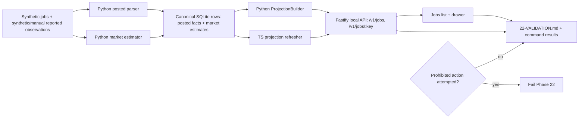

# Phase 22: Product-Path QA & Safety Release - Research

**Researched:** 2026-06-21
**Domain:** Release QA, compensation audit safety, projection-backed local web/API validation
**Confidence:** HIGH

## User Constraints (from CONTEXT.md)

Source: copied from `.planning/phases/22-product-path-qa-safety-release/22-CONTEXT.md`.

### Locked Decisions

### Fixture Matrix
- Cover every QA-01 scenario in one traceable release matrix: below-floor posted salary, above-floor posted salary, missing posted salary, unparseable salary, broad posted range, OTE/equity ambiguity, exact company-role reported compensation, adjacent-role company fallback, trimodal tier fallback, stale source, source conflict, low-confidence estimate, and insufficient evidence.
- Use synthetic jobs plus synthetic/manual reported compensation observations only. Automated provider seams such as Levels.fyi and Glassdoor unavailable states must be simulated or fixture-backed, not exercised against live providers.
- Map each fixture case to the owning layer that proves it: parser confidence, market confidence, canonical API/projection data, Jobs list rendering, Jobs drawer audit rendering, or product-path safety boundary.
- Keep the human-verifier path usable from the existing Jobs compensation triage smoke: `/jobs` seeded data should demonstrate the visible states without requiring real `~/.jobhunter` data.

### Automation Split
- Prefer automated API, projection, worker-domain, and web tests for deterministic invariants; use manual QA only for release-level visual/product-path confirmation that cannot be usefully asserted as a unit test.
- Reuse and extend existing compensation coverage in `workers/automation/tests/test_posted_compensation_parser.py`, `workers/automation/tests/test_market_compensation_estimator.py`, `apps/api/test/projections.test.ts`, `apps/api/test/server.test.ts`, `apps/web/src/views/jobs/JobsView.test.tsx`, `apps/web/src/views/jobs/JobDetailDrawer.test.tsx`, and `apps/web/e2e/tests/jobs-drawer.spec.ts`.
- Keep Playwright evidence seeded and disposable. It should exercise the Jobs list and drawer states, table horizontal scroll, drawer ordering, explicit missing/unavailable states, warning-only copy, and absence of compensation sort/filter controls.
- Do not make full-stack worker execution a prerequisite for Phase 22 QA. Worker-backed apply jobs and real generated-material regeneration are explicitly prohibited by QA-06.

### Product Safety Boundary
- Compensation facts and market estimates remain display/audit-only in v1.3. Phase 22 must prove they do not affect fit score, scoring policy, ranking, route search, filters, apply readiness, missing prerequisites, hard blockers, Apply Review concerns, Apply Review handoff, or dispatch/apply controls.
- Product-path checks should compare the same job state with compensation data present, weak, unavailable, or absent, and assert the non-compensation fields and controls stay governed by the existing scoring/apply audit contracts.
- Safety evidence must mention prohibited actions directly: no auto-apply, no browser submission, no mailbox scanning, no real generated-material regeneration, no destructive profile/database actions, no real external scraping, and no worker-backed apply jobs.
- Sensitive local data stays out of fixtures, screenshots, docs, and logs. Do not expose profile data, resumes, generated PDFs, application logs, SQLite database contents, credentials, OAuth data, or provider payloads.

### Release Evidence
- Produce a Phase 22 verification artifact that maps QA-01 through QA-06 to exact fixture cases, tests, commands, and manual QA evidence.
- Update `docs/local-reliability-qa.md` narrowly if the Phase 22 release matrix becomes reusable QA procedure beyond this milestone.
- Mark remaining QA requirements complete only after the verification artifact includes command results and safety-boundary evidence.
- Residual risks should be explicit if broad gates such as full `pnpm test`, `web:build`, or complete Python test suites are skipped for time or unrelated failures.

### the agent's Discretion
- Choose whether the release matrix is represented as markdown tables, test case names, fixture constants, or a combination, provided every QA scenario is traceable.
- Choose the smallest test additions that prove the missing invariants without duplicating coverage already proven by Phase 21.
- Choose exact command grouping for verification, but include the high-signal API, contracts, Python, web unit/a11y, Playwright, typecheck, and diff hygiene gates relevant to touched surfaces.

### Deferred Ideas (OUT OF SCOPE)

- Live Levels.fyi or Glassdoor provider access, scraping, credentials, caching, or import automation remains deferred until explicit permitted access exists.
- Salary-based ranking, filtering, hard blockers, negotiation anchors, and apply gating remain out of v1.3.
- Compensation correction workflows and profile salary preference editing remain future scope unless a later milestone reopens them.

## Summary

Phase 22 should be planned as a release QA and safety-evidence phase, not a new compensation feature phase. The current codebase already has substantial compensation coverage across parser, estimator, API, projections, Jobs list/drawer unit tests, a11y, and Playwright product-path smoke tests. [VERIFIED: `.planning/phases/22-product-path-qa-safety-release/22-CONTEXT.md`; `workers/automation/tests/test_posted_compensation_parser.py`; `workers/automation/tests/test_market_compensation_estimator.py`; `apps/api/test/server.test.ts`; `apps/api/test/projections.test.ts`; `apps/web/src/views/jobs/JobsView.test.tsx`; `apps/web/src/views/jobs/JobDetailDrawer.test.tsx`; `apps/web/e2e/tests/jobs-drawer.spec.ts`]

The planning problem is fragmented evidence: QA-01 through QA-06 are not yet mapped into a single release matrix with exact fixture names, exact tests, exact command results, and explicit prohibited-action evidence. [VERIFIED: `.planning/REQUIREMENTS.md`; `.planning/phases/22-product-path-qa-safety-release/22-CONTEXT.md`; `.planning/phases/21-jobs-triage-ux-warning-only-floor/21-VERIFICATION.md`] The smallest useful plan is to create a `22-VALIDATION.md` release matrix during execution, add deterministic tests only where the matrix exposes gaps, then produce final `22-VERIFICATION.md` evidence from the same matrix. [VERIFIED: `.planning/phases/22-product-path-qa-safety-release/22-CONTEXT.md`; `docs/local-reliability-qa.md`]

**Primary recommendation:** Plan Phase 22 as four small slices: inventory the release matrix, fill backend/API/projection gaps, fill frontend/Playwright fixture gaps, then run and document the safety validation gate. [VERIFIED: `.planning/phases/22-product-path-qa-safety-release/22-CONTEXT.md`; `docs/local-reliability-qa.md`]

## Architectural Responsibility Map

| Capability | Primary Tier | Secondary Tier | Rationale |
|------------|--------------|----------------|-----------|
| Posted salary parser confidence | Python worker domain | API read endpoint | Parser invariants live in `workers/automation/src/jobhunter/domain/compensation/posted.py`; API serves persisted facts without parsing on read. [VERIFIED: `workers/automation/tests/test_posted_compensation_parser.py`; `apps/api/test/posted-compensation-facts.test.ts`] |
| Market confidence and fallback scope | Python worker domain | API read endpoint | Company-role estimates are produced by `estimate_market_compensation`; API exposes persisted rows. [VERIFIED: `workers/automation/src/jobhunter/domain/compensation/market.py`; `workers/automation/tests/test_market_compensation_estimator.py`; `apps/api/test/market-compensation-estimates.test.ts`] |
| Canonical compensation summary/audit | API / Backend read model | Python projection builder | TypeScript and Python projection builders both materialize list summary and detail audit JSON from canonical rows. [VERIFIED: `apps/api/src/projections.ts`; `workers/automation/src/jobhunter/infrastructure/projections/projection_builder.py`; `apps/api/test/projections.test.ts`; `workers/automation/tests/test_projection_builder.py`] |
| Jobs list and drawer rendering | Browser / Client | API / Backend read model | The Jobs UI consumes projection-backed Operations data and renders display-only Posted, Market, and Warnings columns plus drawer audit details. [VERIFIED: `apps/web/src/views/jobs/JobsView.test.tsx`; `apps/web/src/views/jobs/JobDetailDrawer.test.tsx`; `docs/frontend-target.md`] |
| Product-path safety boundary | API / Backend | Browser / Client | API tests prove sort/filter/apply dispatch are unaffected; web tests prove warning labels stay in the compensation surface and out of Apply concerns/readiness. [VERIFIED: `apps/api/test/server.test.ts`; `apps/web/src/views/jobs/JobDetailDrawer.test.tsx`; `apps/web/e2e/tests/jobs-drawer.spec.ts`] |
| Release evidence and prohibited actions | QA documentation | Test commands | Phase 22 must record commands, fixture cases, manual evidence, skipped gates, and prohibited actions in a phase artifact. [VERIFIED: `.planning/phases/22-product-path-qa-safety-release/22-CONTEXT.md`; `docs/local-reliability-qa.md`] |

## Phase Requirements

| ID | Description | Research Support |
|----|-------------|------------------|
| QA-01 | User-facing compensation behavior is covered by synthetic fixtures for all named posted and market states. | Existing parser/estimator/API/web fixtures cover many states; gaps remain for a unified matrix and trimodal-tier fallback. [VERIFIED: `.planning/REQUIREMENTS.md`; `workers/automation/tests/test_posted_compensation_parser.py`; `workers/automation/tests/test_market_compensation_estimator.py`] |
| QA-02 | Product-path QA proves salary estimates do not change fit score, apply readiness, Apply Review handoff, ranking, filtering, or auto-apply behavior. | API and web tests already prove most warning-only boundaries; Phase 22 should consolidate and add same-job variant evidence. [VERIFIED: `apps/api/test/server.test.ts`; `apps/web/src/views/jobs/JobDetailDrawer.test.tsx`; `apps/web/e2e/tests/jobs-drawer.spec.ts`] |
| QA-03 | Backend tests prove parser confidence and market confidence degrade for weak source quality dimensions. | Parser degradation has direct tests; estimator has coverage for stale, missing company, missing observations, unsupported component, adjacent role, and source conflict, but lacks explicit direct tests for trimodal fallback, weak level, weak location, low sample, and dispersion/source agreement. [VERIFIED: `workers/automation/tests/test_posted_compensation_parser.py`; `workers/automation/tests/test_market_compensation_estimator.py`; `workers/automation/src/jobhunter/domain/compensation/market.py`] |
| QA-04 | API and projection tests prove audit data comes from canonical rows and parity refreshers stay safe. | TypeScript and Python projection tests already cover canonical summary/audit JSON, floor refresh, stale projection repair, malformed legacy payload repair, tenant scoping, and sensitive path omission. [VERIFIED: `apps/api/test/projections.test.ts`; `workers/automation/tests/test_projection_builder.py`] |
| QA-05 | Frontend tests prove Jobs list and drawer render posted, estimated, unavailable, insufficient-evidence, warning-only floor comparison, and source-conflict states. | JobsView, JobDetailDrawer, a11y, and Playwright cover most visible states; source-conflict should be asserted explicitly in the release matrix and e2e/product path if not already named in the visible test. [VERIFIED: `apps/web/src/views/jobs/JobsView.test.tsx`; `apps/web/src/views/jobs/JobDetailDrawer.test.tsx`; `apps/web/e2e/tests/jobs-drawer.spec.ts`] |
| QA-06 | QA uses synthetic jobs and synthetic/manual observations only and avoids prohibited actions. | Phase 21 verification and local QA docs already state this boundary; Phase 22 must re-record it in validation evidence and avoid full worker apply jobs. [VERIFIED: `.planning/phases/21-jobs-triage-ux-warning-only-floor/21-VERIFICATION.md`; `docs/local-reliability-qa.md`; `.planning/phases/22-product-path-qa-safety-release/22-CONTEXT.md`] |

## Project Constraints (from AGENTS.md)

- Use `README.md`, `docs/local-reliability-qa.md`, `docs/local-ts-api.md`, `docs/architecture.md`, `docs/job-pipeline-architecture.md`, `docs/ddd-target.md`, `docs/frontend-target.md`, `docs/decisions.md`, `package.json`, and `workers/automation/pyproject.toml` before architectural, workflow, or QA decisions. [VERIFIED: `AGENTS.md`]
- Prefer `pnpm dev` for full local development; use `pnpm dev:start` only for explicitly detached stacks. [VERIFIED: `AGENTS.md`]
- Do not run auto-apply, browser submission, destructive profile/database actions, or commands that submit applications unless explicitly requested. [VERIFIED: `AGENTS.md`]
- Use the listed verification commands for TypeScript/API/web, web unit/type/e2e, Python tests/lint, and package build; narrow them to touched surfaces when appropriate. [VERIFIED: `AGENTS.md`]
- When changing behavior, add/update unit tests; when changing user-facing behavior, local API behavior, browser flows, or UI/UX, include product-path QA. [VERIFIED: `AGENTS.md`]
- Meaningful new capabilities require narrow documentation updates in the owning docs; internal refactors, test-only changes, and behavior-neutral bug fixes do not need doc bloat. [VERIFIED: `AGENTS.md`]
- Treat payloads, local generated artifacts, job/application data, credentials, resumes, generated PDFs, browser profiles, SQLite databases, logs, OAuth data, and provider payloads as sensitive. [VERIFIED: `AGENTS.md`]
- Auditability fixes must trace displayed claims to the source of truth and preserve value; do not hide embarrassing data instead of computing or persisting the right audit data. [VERIFIED: `AGENTS.md`]
- Frontend changes must preserve bounded-context folders, view composer rules, Operations read hooks, context-owned mutation hooks, query-key conventions, SSE invalidation router, form conventions, table conventions, and ports instead of direct API/browser/storage calls. [VERIFIED: `AGENTS.md`]
- Tests should be colocated, MSW handlers should be extended in existing files, a11y tests should be colocated, and Playwright specs should live under `apps/web/e2e/tests/`. [VERIFIED: `AGENTS.md`]
- Never edit code on `main`, never leave `main` dirty, and keep work scoped; this research was written from branch `worktree/b25f`. [VERIFIED: `git branch --show-current`; `AGENTS.md`]

## Current Coverage Matrix

| Scenario / Boundary | Current Coverage | Gap To Plan |
|---------------------|------------------|-------------|
| Below-floor posted salary | Projection tests cover below-floor posted comparison; API server test covers warning-only boundary; web drawer and Playwright expose the warning-only copy. [VERIFIED: `apps/api/test/projections.test.ts`; `apps/api/test/server.test.ts`; `apps/web/src/views/jobs/JobDetailDrawer.test.tsx`; `apps/web/e2e/tests/jobs-drawer.spec.ts`] | Link these to one QA-01/QA-02 row in `22-VALIDATION.md`. [VERIFIED: `.planning/phases/22-product-path-qa-safety-release/22-CONTEXT.md`] |
| Above-floor posted salary | Projection tests cover meets-floor posted-only and both-basis cases. [VERIFIED: `apps/api/test/projections.test.ts`; `workers/automation/tests/test_projection_builder.py`] | Add an explicit release-matrix row named "above-floor posted salary"; no product feature change needed. [VERIFIED: `.planning/ROADMAP.md`; `apps/api/test/projections.test.ts`] |
| Missing posted salary | Parser, posted API, Jobs list, drawer, and Playwright missing-state smoke already cover missing/no posted states. [VERIFIED: `workers/automation/tests/test_posted_compensation_parser.py`; `apps/api/test/posted-compensation-facts.test.ts`; `apps/web/src/views/jobs/JobsView.test.tsx`; `apps/web/src/views/jobs/JobDetailDrawer.test.tsx`; `apps/web/e2e/tests/jobs-drawer.spec.ts`] | Map evidence to QA-01 and QA-05. [VERIFIED: `.planning/REQUIREMENTS.md`] |
| Unparseable salary | Parser, posted API, and drawer tests cover unparseable salary and low/no normalized range fields. [VERIFIED: `workers/automation/tests/test_posted_compensation_parser.py`; `apps/api/test/posted-compensation-facts.test.ts`; `apps/web/src/views/jobs/JobDetailDrawer.test.tsx`] | Add to matrix; Playwright can remain release-smoke only unless planner wants visual proof for every arm. [VERIFIED: `.planning/phases/22-product-path-qa-safety-release/22-CONTEXT.md`] |
| Broad posted range | Parser test and posted API warning mapping cover `broad_range`. [VERIFIED: `workers/automation/tests/test_posted_compensation_parser.py`; `apps/api/test/posted-compensation-facts.test.ts`] | If not visible in current drawer fixtures, add one compact web assertion or document backend-only ownership. [VERIFIED: `.planning/phases/22-product-path-qa-safety-release/22-CONTEXT.md`] |
| OTE/equity ambiguity | Parser covers OTE, bonus, commission, equity warnings; posted API covers ambiguous OTE; drawer covers ambiguous posted state. [VERIFIED: `workers/automation/tests/test_posted_compensation_parser.py`; `apps/api/test/posted-compensation-facts.test.ts`; `apps/web/src/views/jobs/JobDetailDrawer.test.tsx`] | Ensure matrix distinguishes parser confidence from UI state; do not add OTE/equity modeling. [VERIFIED: `.planning/REQUIREMENTS.md`] |
| Exact company-role reported compensation | Estimator, market API, projections, fixtures, and drawer source trail cover exact company-role estimates. [VERIFIED: `workers/automation/tests/test_market_compensation_estimator.py`; `apps/api/test/market-compensation-estimates.test.ts`; `apps/api/test/projections.test.ts`; `apps/web/src/test/fixtures/projections.ts`; `apps/web/src/views/jobs/JobDetailDrawer.test.tsx`] | Matrix only. [VERIFIED: `.planning/phases/22-product-path-qa-safety-release/22-CONTEXT.md`] |
| Adjacent-role fallback | Estimator directly tests company-adjacent role fallback and warning. [VERIFIED: `workers/automation/tests/test_market_compensation_estimator.py`] | Add API/projection or fixture evidence only if matrix requires user-facing trace beyond backend ownership. [VERIFIED: `.planning/REQUIREMENTS.md`; `.planning/phases/22-product-path-qa-safety-release/22-CONTEXT.md`] |
| Trimodal tier fallback | Domain code supports `tier_role_fallback` and `trimodal_tier_inferred`; direct tests were not found for this fallback. [VERIFIED: `workers/automation/src/jobhunter/domain/compensation/market.py`; `rg "tier_role_fallback|trimodal" workers/automation/tests apps/api/test apps/web/src`] | Add deterministic estimator test and, if visible fields are expected, a market API/projection fixture row. [VERIFIED: `.planning/REQUIREMENTS.md`] |
| Stale source | Estimator and market API cover stale/source-unavailable rows; web fixtures and drawer render unavailable source reasons. [VERIFIED: `workers/automation/tests/test_market_compensation_estimator.py`; `apps/api/test/market-compensation-estimates.test.ts`; `apps/web/src/test/fixtures/projections.ts`; `apps/web/src/views/jobs/JobDetailDrawer.test.tsx`] | Matrix and validation artifact. [VERIFIED: `.planning/phases/22-product-path-qa-safety-release/22-CONTEXT.md`] |
| Source conflict | Estimator covers posted-vs-market conflict; frontend fixture includes `source_conflict_with_posted_salary`. [VERIFIED: `workers/automation/tests/test_market_compensation_estimator.py`; `apps/web/src/test/fixtures/projections.ts`] | Add explicit Jobs drawer/list assertion or Playwright assertion that the source-conflict warning is visible. [VERIFIED: `.planning/REQUIREMENTS.md`] |
| Low-confidence estimate | Market API fixtures and web fixtures include low confidence for insufficient evidence. [VERIFIED: `apps/api/test/market-compensation-estimates.test.ts`; `apps/web/src/test/fixtures/projections.ts`; `apps/web/src/views/jobs/JobsView.test.tsx`] | Add direct estimator tests proving low confidence/degradation for low sample, weak level, weak location, and high dispersion/source agreement where domain code supports them. [VERIFIED: `workers/automation/src/jobhunter/domain/compensation/market.py`; `.planning/REQUIREMENTS.md`] |
| Insufficient evidence | Estimator, market API, Jobs list, and drawer cover insufficient evidence. [VERIFIED: `workers/automation/tests/test_market_compensation_estimator.py`; `apps/api/test/market-compensation-estimates.test.ts`; `apps/web/src/views/jobs/JobsView.test.tsx`; `apps/web/src/views/jobs/JobDetailDrawer.test.tsx`] | Matrix and command evidence. [VERIFIED: `.planning/phases/22-product-path-qa-safety-release/22-CONTEXT.md`] |
| Fit score/ranking/filtering/apply readiness/apply dispatch unchanged | API server tests cover compensation and market boundaries; JobsView covers absence of compensation sort/filter/search/query fields; drawer/e2e cover warnings outside Apply concerns/readiness. [VERIFIED: `apps/api/test/server.test.ts`; `apps/web/src/views/jobs/JobsView.test.tsx`; `apps/web/src/views/jobs/JobDetailDrawer.test.tsx`; `apps/web/e2e/tests/jobs-drawer.spec.ts`] | Compare same job with present/weak/unavailable/absent compensation in validation matrix if planner wants stronger QA-02 evidence. [VERIFIED: `.planning/phases/22-product-path-qa-safety-release/22-CONTEXT.md`] |
| Apply Review handoff unchanged | Playwright verifies Jobs drawer Apply Review handoff preserves selected job. [VERIFIED: `apps/web/e2e/tests/jobs-drawer.spec.ts`] | Add matrix row showing handoff test is safety evidence, not compensation feature behavior. [VERIFIED: `.planning/ROADMAP.md`] |
| Prohibited actions avoided | Phase 21 verification and local QA docs already state no real provider scraping, no real user data, no browser submission, no worker-backed apply jobs, and no destructive actions. [VERIFIED: `.planning/phases/21-jobs-triage-ux-warning-only-floor/21-VERIFICATION.md`; `docs/local-reliability-qa.md`] | Re-record in Phase 22 `22-VALIDATION.md` with exact commands run. [VERIFIED: `.planning/phases/22-product-path-qa-safety-release/22-CONTEXT.md`] |

## Standard Stack

### Core

| Library / Tool | Version | Purpose | Why Standard |
|----------------|---------|---------|--------------|
| pnpm workspace | 10.24.0 package manager, lockfile resolves current package versions | Existing TypeScript package orchestration and filtered commands. [VERIFIED: `package.json`; `pnpm --version`] | Project scripts and docs use pnpm filters for API, web, contracts, and full tests. [VERIFIED: `package.json`; `AGENTS.md`] |
| Node.js | v22.21.1 locally, package requires >=20.19.0 | Runs API/web/tooling. [VERIFIED: `node --version`; `package.json`] | Existing local runtime meets engine constraint. [VERIFIED: `node --version`; `package.json`] |
| Fastify | ^5.8.5 in API package | Local TypeScript API. [VERIFIED: `apps/api/package.json`] | ADR accepts Fastify for the local API. [VERIFIED: `docs/decisions.md`] |
| better-sqlite3 | ^12.9.0 | Local SQLite tests and read-model fixtures. [VERIFIED: `apps/api/package.json`; `apps/web/package.json`] | API/projection tests seed disposable SQLite databases directly. [VERIFIED: `apps/api/test/server.test.ts`; `apps/api/test/projections.test.ts`] |
| Zod | ^4.4.x | Shared contract and form/API validation. [VERIFIED: `apps/api/package.json`; `apps/web/package.json`; `packages/contracts/package.json`] | Contracts package owns schemas and DTOs. [VERIFIED: `docs/architecture.md`; `packages/contracts/src/schemas.ts`] |
| React + Vite | React ^19.2.3, Vite ^7.3.0 | Local web UI and build. [VERIFIED: `apps/web/package.json`; `pnpm-lock.yaml`] | ADR accepts React/Vite for frontend. [VERIFIED: `docs/decisions.md`] |
| TanStack Query / Router / Table | Query ^5.100.9, Router ^1.93.0 range, Table ^8.20.0 range | Server state, URL routing, Jobs table. [VERIFIED: `apps/web/package.json`] | Frontend target requires three-layer state and TanStack family. [VERIFIED: `docs/frontend-target.md`; `AGENTS.md`] |
| Vitest | ^4.1.5 | API/web/unit/component tests. [VERIFIED: `apps/api/package.json`; `apps/web/package.json`] | Existing API and web tests run through Vitest scripts. [VERIFIED: `package.json`] |
| Playwright | @playwright/test ^1.50.0 range, lock resolves 1.59.1 | Seeded e2e Jobs product-path checks. [VERIFIED: `apps/web/package.json`; `pnpm-lock.yaml`] | Local QA docs require `jobs-drawer.spec.ts` for compensation triage smoke. [VERIFIED: `docs/local-reliability-qa.md`] |
| uv + pytest + Ruff | uv 0.11.7 local; pytest >=7, Ruff >=0.1 optional dev | Python worker tests/lint. [VERIFIED: `uv --version`; `workers/automation/pyproject.toml`] | Worker parser, estimator, and projection tests are Python. [VERIFIED: `workers/automation/tests/test_posted_compensation_parser.py`; `workers/automation/tests/test_market_compensation_estimator.py`; `workers/automation/tests/test_projection_builder.py`] |

### Supporting

| Library / Tool | Version | Purpose | When to Use |
|----------------|---------|---------|-------------|
| React Testing Library | ^16.1.0 range, lock resolves 16.3.2 | Component and view tests. [VERIFIED: `apps/web/package.json`; `pnpm-lock.yaml`] | Use for Jobs list/drawer assertions. [VERIFIED: `apps/web/src/views/jobs/JobsView.test.tsx`; `apps/web/src/views/jobs/JobDetailDrawer.test.tsx`] |
| MSW | ^2.7.0 range, lock resolves 2.14.3 | Web test API mocks. [VERIFIED: `apps/web/package.json`; `pnpm-lock.yaml`] | Extend existing MSW handlers rather than creating new setups. [VERIFIED: `AGENTS.md`] |
| jest-axe / axe-core | jest-axe ^9.0.0, axe-core ^4.10.2 | Accessibility checks. [VERIFIED: `apps/web/package.json`] | Use existing Jobs drawer a11y test for critical compensation surfaces. [VERIFIED: `apps/web/src/views/jobs/JobDetailDrawer.a11y.test.tsx`] |

### Alternatives Considered

| Instead of | Could Use | Tradeoff |
|------------|-----------|----------|
| Existing deterministic fixtures | Live Levels.fyi or Glassdoor access | Prohibited for v1.3 QA without permitted access; use synthetic/manual reported rows only. [VERIFIED: `.planning/REQUIREMENTS.md`; `.planning/phases/22-product-path-qa-safety-release/22-CONTEXT.md`] |
| Existing Jobs Playwright smoke | Full worker-backed apply flow | Prohibited by QA-06 and unnecessary for release validation. [VERIFIED: `.planning/REQUIREMENTS.md`; `docs/local-reliability-qa.md`] |
| Existing projection/API tests | Frontend-only recomputation | Out of scope because every displayed compensation claim needs backend source of truth. [VERIFIED: `.planning/REQUIREMENTS.md`; `apps/api/test/projections.test.ts`] |

**Installation:** No installation is recommended for Phase 22. [VERIFIED: `.planning/phases/22-product-path-qa-safety-release/22-UI-SPEC.md`; `.planning/phases/22-product-path-qa-safety-release/22-CONTEXT.md`]

## Package Legitimacy Audit

No new external packages should be installed for Phase 22. [VERIFIED: `.planning/phases/22-product-path-qa-safety-release/22-UI-SPEC.md`; `.planning/phases/22-product-path-qa-safety-release/22-CONTEXT.md`]

| Package | Registry | Age | Downloads | Source Repo | Verdict | Disposition |
|---------|----------|-----|-----------|-------------|---------|-------------|
| none | n/a | n/a | n/a | n/a | n/a | No package install planned. [VERIFIED: `.planning/phases/22-product-path-qa-safety-release/22-UI-SPEC.md`] |

**Packages removed due to [SLOP] verdict:** none. [VERIFIED: no package recommendations in this research]
**Packages flagged as suspicious [SUS]:** none. [VERIFIED: no package recommendations in this research]

## Architecture Patterns

### System Architecture Diagram



This diagram follows the checked-in architecture where the TypeScript API and Python worker both operate over local SQLite projections, while the web UI consumes API read models. [VERIFIED: `docs/architecture.md`; `docs/local-ts-api.md`; `apps/api/src/projections.ts`; `workers/automation/src/jobhunter/infrastructure/projections/projection_builder.py`]

### Recommended Project Structure

```text
.planning/phases/22-product-path-qa-safety-release/
|-- 22-RESEARCH.md       # This planner input. [VERIFIED: user output request]
|-- 22-VALIDATION.md     # Recommended execution artifact for matrix + command evidence. [VERIFIED: 22-CONTEXT.md]
`-- 22-VERIFICATION.md   # Final phase verification artifact after execution. [VERIFIED: GSD phase convention]

workers/automation/tests/
|-- test_posted_compensation_parser.py       # Parser confidence gaps. [VERIFIED: existing file]
|-- test_market_compensation_estimator.py    # Market confidence/fallback gaps. [VERIFIED: existing file]
`-- test_projection_builder.py               # Python projection parity gaps. [VERIFIED: existing file]

apps/api/test/
|-- server.test.ts                         # Product-path safety boundary. [VERIFIED: existing file]
|-- projections.test.ts                    # TS projection and canonical row behavior. [VERIFIED: existing file]
|-- posted-compensation-facts.test.ts      # Posted API states. [VERIFIED: existing file]
`-- market-compensation-estimates.test.ts  # Market API states. [VERIFIED: existing file]

apps/web/src/views/jobs/
|-- JobsView.test.tsx              # Jobs list scan states. [VERIFIED: existing file]
|-- JobDetailDrawer.test.tsx       # Drawer audit states and warning-only boundary. [VERIFIED: existing file]
`-- JobDetailDrawer.a11y.test.tsx  # Drawer accessibility. [VERIFIED: existing file]

apps/web/e2e/tests/
`-- jobs-drawer.spec.ts            # Product-path Playwright smoke. [VERIFIED: existing file]
```

### Pattern 1: Matrix-First Release QA

**What:** Create a single matrix that maps each QA-01 scenario and QA-02..QA-06 boundary to fixture data, owning layer, automated test, command, and manual evidence. [VERIFIED: `.planning/phases/22-product-path-qa-safety-release/22-CONTEXT.md`]

**When to use:** Use this before adding tests, because the existing code already covers many scenarios and duplicating tests would increase maintenance cost without improving release confidence. [VERIFIED: `.planning/phases/21-jobs-triage-ux-warning-only-floor/21-VERIFICATION.md`; `docs/local-reliability-qa.md`]

**Example:**

```markdown
| Fixture | Requirement | Owner | Automated Evidence | Manual Evidence | Safety Boundary |
|---------|-------------|-------|--------------------|-----------------|-----------------|
| trimodal-tier-fallback | QA-01, QA-03 | Python estimator + API projection | `pytest ...test_market_compensation_estimator.py::test_estimates_trimodal_tier_role_fallback` | n/a | synthetic observations only |
```

Source: `.planning/phases/22-product-path-qa-safety-release/22-CONTEXT.md`. [VERIFIED: local source]

### Pattern 2: Canonical Rows Before UI Claims

**What:** Add or adjust canonical posted-fact and market-estimate fixture rows first, then prove projection/API output, then prove Jobs UI rendering. [VERIFIED: `apps/api/test/projections.test.ts`; `workers/automation/tests/test_projection_builder.py`; `apps/web/src/test/fixtures/projections.ts`]

**When to use:** Use for source-conflict, low-confidence, insufficient evidence, stale source, and trimodal fallback visibility. [VERIFIED: `.planning/REQUIREMENTS.md`; `apps/api/test/market-compensation-estimates.test.ts`]

**Example:**

```typescript
// Source: apps/api/test/market-compensation-estimates.test.ts
insertEstimate(dbPath, "https://example.com/jobs/insufficient", {
  state: "insufficient_evidence",
  minimumAmount: null,
  maximumAmount: null,
  confidenceBand: "low",
  insufficientReasons: ["missing_reported_observation"],
  warnings: ["low_sample_count"],
});
```

### Pattern 3: Same-Job Safety Comparison

**What:** Compare one otherwise-ready job with compensation present, weak, unavailable, and absent, and assert non-compensation controls remain governed by existing score/apply contracts. [VERIFIED: `.planning/phases/22-product-path-qa-safety-release/22-CONTEXT.md`; `apps/api/test/server.test.ts`]

**When to use:** Use for QA-02 because it proves warning-only behavior without building ranking/filtering/apply features. [VERIFIED: `.planning/REQUIREMENTS.md`; `apps/web/src/views/jobs/JobDetailDrawer.test.tsx`]

**Example:**

```typescript
// Source: apps/api/test/server.test.ts
expect(JOB_SORT_FIELDS).not.toContain("compensation_floor");
expect(filtered.json().filter).not.toHaveProperty("compensationFloor");
expect(JSON.stringify(detailBody.applyAudit)).not.toContain("compensation_below_profile_floor");
```

### Anti-Patterns to Avoid

- **Adding live provider access:** Phase 22 must simulate Levels.fyi and Glassdoor unavailable states or use fixture-backed/manual reported rows. [VERIFIED: `.planning/REQUIREMENTS.md`; `.planning/phases/22-product-path-qa-safety-release/22-CONTEXT.md`]
- **Turning salary into a product control:** Do not add compensation sort, filters, route search, ranking controls, apply gates, or blockers. [VERIFIED: `.planning/REQUIREMENTS.md`; `.planning/phases/22-product-path-qa-safety-release/22-UI-SPEC.md`; `apps/web/src/views/jobs/JobsView.test.tsx`]
- **Frontend-only salary estimation:** Every displayed compensation claim needs persisted backend provenance. [VERIFIED: `.planning/REQUIREMENTS.md`; `apps/api/test/projections.test.ts`]
- **Full worker-backed apply QA:** Worker-backed apply jobs, browser submission, and material regeneration are prohibited for this phase. [VERIFIED: `.planning/REQUIREMENTS.md`; `docs/local-reliability-qa.md`]
- **Duplicating covered behavior:** Add tests only where the matrix shows an uncovered invariant, especially trimodal fallback and explicit weak-factor degradation. [VERIFIED: `workers/automation/tests/test_market_compensation_estimator.py`; `workers/automation/src/jobhunter/domain/compensation/market.py`]

## Don't Hand-Roll

| Problem | Don't Build | Use Instead | Why |
|---------|-------------|-------------|-----|
| Release traceability | Ad hoc prose-only QA notes | `22-VALIDATION.md` matrix linked to existing tests and commands | Planner needs exact fixture-to-requirement mapping. [VERIFIED: `.planning/phases/22-product-path-qa-safety-release/22-CONTEXT.md`] |
| Browser product-path evidence | Custom browser scripts | Existing Playwright spec `apps/web/e2e/tests/jobs-drawer.spec.ts` | It already seeds synthetic data and verifies Jobs list/drawer safety. [VERIFIED: `apps/web/e2e/tests/jobs-drawer.spec.ts`; `docs/local-reliability-qa.md`] |
| Compensation parsing | New TypeScript parser in UI/API | Existing Python parser and persisted posted facts | Requirement forbids frontend-only salary estimation; API reads canonical rows. [VERIFIED: `.planning/REQUIREMENTS.md`; `workers/automation/tests/test_posted_compensation_parser.py`; `apps/api/test/posted-compensation-facts.test.ts`] |
| Market estimation | Location/title aggregate estimator or provider scrape | Existing company-role reported estimator with fixture observations | v1.3 uses company-role reported observations and no unauthorized scraping. [VERIFIED: `.planning/STATE.md`; `workers/automation/src/jobhunter/domain/compensation/market.py`] |
| Projection parity | One-off JSON shape in frontend tests | Existing TS and Python projection builders plus shared fixtures | Phase 20/21 established parity-safe canonical projection behavior. [VERIFIED: `apps/api/test/projections.test.ts`; `workers/automation/tests/test_projection_builder.py`; `.planning/STATE.md`] |
| Safety controls | New salary gates, filters, ranking, or apply blockers | Existing warning-only copy and absence assertions | v1.3 decision keeps salary display/audit-only. [VERIFIED: `.planning/STATE.md`; `.planning/phases/22-product-path-qa-safety-release/22-UI-SPEC.md`] |

**Key insight:** Phase 22 confidence comes from linking existing deterministic seams and closing narrow coverage gaps, not from building new compensation behavior. [VERIFIED: `.planning/phases/22-product-path-qa-safety-release/22-CONTEXT.md`; `.planning/phases/21-jobs-triage-ux-warning-only-floor/21-VERIFICATION.md`]

## Common Pitfalls

### Pitfall 1: Treating QA-01 As A New Feature Matrix

**What goes wrong:** The plan adds new UI states or new estimator behavior instead of proving existing v1.3 behavior. [VERIFIED: `.planning/phases/22-product-path-qa-safety-release/22-CONTEXT.md`]

**Why it happens:** QA-01 lists many scenarios, and several are already covered in scattered tests. [VERIFIED: `workers/automation/tests/test_posted_compensation_parser.py`; `workers/automation/tests/test_market_compensation_estimator.py`; `apps/web/src/views/jobs/JobDetailDrawer.test.tsx`]

**How to avoid:** Start with `22-VALIDATION.md` and only add tests for uncovered rows. [VERIFIED: `.planning/phases/22-product-path-qa-safety-release/22-CONTEXT.md`]

**Warning signs:** A plan proposes salary filters, ranking, correction workflows, provider credentials, or live scraping. [VERIFIED: `.planning/REQUIREMENTS.md`; `.planning/STATE.md`]

### Pitfall 2: Confusing Weak Evidence With Unavailable Sources

**What goes wrong:** Stale source, unsupported component/source, insufficient evidence, and low-confidence estimates collapse into one UI or API state. [VERIFIED: `.planning/REQUIREMENTS.md`; `apps/api/test/market-compensation-estimates.test.ts`; `apps/web/src/views/jobs/JobDetailDrawer.test.tsx`]

**Why it happens:** They all lack a reliable range, but they have different source-of-truth reasons. [VERIFIED: `workers/automation/src/jobhunter/domain/compensation/market.py`]

**How to avoid:** Keep state assertions on `estimateState`, `confidenceBand`, reason arrays, and source trail separately. [VERIFIED: `apps/api/test/market-compensation-estimates.test.ts`; `packages/contracts/src/schemas.ts`]

**Warning signs:** Tests only assert "no range" and do not assert state/reason codes. [VERIFIED: `apps/api/test/market-compensation-estimates.test.ts`]

### Pitfall 3: Product-Path QA Accidentally Runs Prohibited Work

**What goes wrong:** A QA command starts browser submission, auto-apply, mailbox scanning, worker-backed apply jobs, provider scraping, material regeneration, or destructive database actions. [VERIFIED: `.planning/REQUIREMENTS.md`; `docs/local-reliability-qa.md`; `AGENTS.md`]

**Why it happens:** JobHunter has real automation surfaces for apply, Gmail, browser automation, and workers. [VERIFIED: `docs/architecture.md`; `apps/api/test/server.test.ts`]

**How to avoid:** Use Playwright-seeded or disposable synthetic data and stubbed dispatch, and record prohibited actions in `22-VALIDATION.md`. [VERIFIED: `docs/local-reliability-qa.md`; `.planning/phases/21-jobs-triage-ux-warning-only-floor/21-VERIFICATION.md`]

**Warning signs:** The plan includes `jobhunter run`, real `~/.jobhunter` data, provider credentials, browser submission, or apply worker commands. [VERIFIED: `docs/local-reliability-qa.md`; `AGENTS.md`]

### Pitfall 4: Marking Backend Confidence Complete Without Weak-Factor Tests

**What goes wrong:** QA-03 is marked complete although direct estimator tests do not cover every weak dimension named by the requirement. [VERIFIED: `.planning/REQUIREMENTS.md`; `workers/automation/tests/test_market_compensation_estimator.py`]

**Why it happens:** Existing API/web fixtures show low confidence or insufficient evidence, but they are not proof that estimator confidence degrades for level, location, sample count, and source agreement. [VERIFIED: `apps/api/test/market-compensation-estimates.test.ts`; `workers/automation/src/jobhunter/domain/compensation/market.py`]

**How to avoid:** Add focused Python estimator tests for trimodal fallback, low sample, weak level, weak location, and high dispersion/source agreement if these are not already covered at execution time. [VERIFIED: `workers/automation/src/jobhunter/domain/compensation/market.py`; `workers/automation/tests/test_market_compensation_estimator.py`]

**Warning signs:** QA-03 evidence points only to UI text or API fixture rows. [VERIFIED: `.planning/REQUIREMENTS.md`]

## Code Examples

### Parser Weak-State Pattern

```python
# Source: workers/automation/tests/test_posted_compensation_parser.py
def test_unparseable_salary_preserves_raw_fallback_and_warning() -> None:
    fact = parse_posted_compensation("Competitive package", job_url="job-1", parsed_at="2026-06-19T10:00:00Z")

    assert fact.parse_state == "unparseable"
    assert fact.source_text == "Competitive package"
    assert fact.legacy_raw_salary == "Competitive package"
    assert "no_amount_found" in fact.warnings
    assert fact.minimum_amount is None
```

### Market Fallback Pattern

```python
# Source: workers/automation/tests/test_market_compensation_estimator.py
def test_estimates_company_adjacent_role_with_explicit_fallback_warning() -> None:
    estimate = estimate_market_compensation(
        job_url="https://example.com/jobs/backend",
        company="Acme AI",
        title="Senior Backend Engineer",
        location="Remote Europe",
        observations=(_levels(role="Senior Platform Engineer"), _glassdoor(role="Senior Software Engineer")),
        estimated_at="2026-06-19T10:00:00Z",
    )

    assert estimate.estimate_state == "estimated_range"
    assert estimate.match_scope == "company_adjacent_role"
    assert "company_role_fallback" in estimate.warnings
```

### Product-Path Boundary Pattern

```typescript
// Source: apps/api/test/server.test.ts
expect(JOB_SORT_FIELDS).not.toContain("compensation_floor");
expect(JOB_SORT_FIELDS).not.toContain("compensation_warning_count");
expect(filtered.json().filter).not.toHaveProperty("compensationFloor");
expect(JSON.stringify(detailBody.applyAudit)).not.toContain("compensation_below_profile_floor");
```

### Playwright Product-Path Pattern

```typescript
// Source: apps/web/e2e/tests/jobs-drawer.spec.ts
await expect(compensation.getByText("Compensation warnings do not change ranking, filters, apply readiness, blockers, or dispatch in v1.3.")).toBeVisible();
await expect(triage.getByText("posted_compensation_below_profile_floor")).toHaveCount(0);
await expect(drawer.getByLabel("Apply readiness")).not.toContainText(/compensation|salary|floor/i);
```

## State of the Art

| Old Approach | Current Approach | When Changed | Impact |
|--------------|------------------|--------------|--------|
| Raw `jobs.salary` string as primary salary display | Persisted posted compensation facts with parse state, confidence, source text, and raw fallback | Phase 18 | QA must prove raw salary remains compatibility data, not normalized source of truth. [VERIFIED: `.planning/STATE.md`; `apps/api/test/posted-compensation-facts.test.ts`] |
| Market estimates from title/location-style aggregates | Company-role reported observations from Levels.fyi, Glassdoor, and manual imports, with disabled provider access simulated/fixture-backed | Phase 19 | QA must use synthetic/manual reported rows and no live scraping. [VERIFIED: `.planning/STATE.md`; `workers/automation/tests/test_market_compensation_estimator.py`] |
| Read-time/client salary interpretation | Canonical projection-backed compensation summary and audit JSON | Phase 20 | API/projection tests own canonical source-of-truth validation. [VERIFIED: `.planning/STATE.md`; `apps/api/test/projections.test.ts`] |
| Compensation hidden in drawer only | Jobs list Posted/Market/Warnings scan columns plus drawer audit section | Phase 21 | Frontend QA must prove display-only columns and drawer audit states. [VERIFIED: `.planning/STATE.md`; `apps/web/src/views/jobs/JobsView.test.tsx`; `apps/web/e2e/tests/jobs-drawer.spec.ts`] |
| Salary evidence as possible gate | Warning-only floor comparison in v1.3 | Phase 21 | Product-path safety must prove no ranking, filtering, readiness, blocker, apply concern, handoff, or dispatch behavior changes. [VERIFIED: `.planning/STATE.md`; `.planning/phases/21-jobs-triage-ux-warning-only-floor/21-VERIFICATION.md`] |

**Deprecated/outdated:**
- Live Levels.fyi/Glassdoor scraping is out of scope and prohibited without explicit permitted access. [VERIFIED: `.planning/REQUIREMENTS.md`; `.planning/STATE.md`]
- Salary-based ranking, filtering, hard blockers, negotiation anchors, and apply gating are out of v1.3 scope. [VERIFIED: `.planning/REQUIREMENTS.md`; `.planning/STATE.md`]
- Frontend-only salary estimation is forbidden because displayed compensation claims need persisted provenance. [VERIFIED: `.planning/REQUIREMENTS.md`]

## Smallest Executable Plan Slices

1. **Release matrix and validation artifact:** Create `22-VALIDATION.md` with rows for QA-01 scenarios, QA-02 product-path boundaries, QA-03 weak-factor dimensions, QA-04 canonical/parity checks, QA-05 frontend states, and QA-06 prohibited actions. [VERIFIED: `.planning/phases/22-product-path-qa-safety-release/22-CONTEXT.md`]
2. **Backend gap closure:** Add focused tests in `test_market_compensation_estimator.py` for trimodal tier fallback and weak confidence factors not directly covered; add parser test only if matrix finds an untested confidence state. [VERIFIED: `workers/automation/src/jobhunter/domain/compensation/market.py`; `workers/automation/tests/test_market_compensation_estimator.py`; `workers/automation/tests/test_posted_compensation_parser.py`]
3. **API/projection release fixture closure:** Add or extend canonical rows/tests only for matrix rows lacking API/projection evidence, especially source conflict, low confidence, and trimodal fallback visibility. [VERIFIED: `apps/api/test/market-compensation-estimates.test.ts`; `apps/api/test/projections.test.ts`; `workers/automation/tests/test_projection_builder.py`]
4. **Frontend and Playwright closure:** Extend existing Jobs fixtures/tests only where visible state gaps remain; likely candidates are explicit source-conflict visibility and a matrix-driven `/jobs` seeded path for all human-verifier states. [VERIFIED: `apps/web/src/test/fixtures/projections.ts`; `apps/web/src/views/jobs/JobsView.test.tsx`; `apps/web/src/views/jobs/JobDetailDrawer.test.tsx`; `apps/web/e2e/tests/jobs-drawer.spec.ts`]
5. **Release gate and docs:** Run focused commands, optionally full `pnpm test`, update `docs/local-reliability-qa.md` only if the release matrix is reusable, then finalize `22-VERIFICATION.md`. [VERIFIED: `docs/local-reliability-qa.md`; `.planning/phases/22-product-path-qa-safety-release/22-CONTEXT.md`; `package.json`]

## Assumptions Log

All claims in this research were verified from checked-in project files, command output, or the provided phase context. No [ASSUMED] claims are used. [VERIFIED: local source inspection]

| # | Claim | Section | Risk if Wrong |
|---|-------|---------|---------------|
| none | n/a | n/a | n/a |

## Open Questions (RESOLVED)

1. **RESOLVED: Use `22-VALIDATION.md` as the working release matrix and summarize it in `22-VERIFICATION.md`.**
   What we know: The phase context requires a verification artifact mapping QA-01 through QA-06 to fixtures, tests, commands, and manual evidence. [VERIFIED: `.planning/phases/22-product-path-qa-safety-release/22-CONTEXT.md`]
   Resolution: Produce `22-VALIDATION.md` during execution as the working release matrix, then summarize/pass/fail it in `22-VERIFICATION.md`. This is now encoded in `22-VALIDATION.md` and Plans `22-01` through `22-04`. [VERIFIED: `.planning/phases/22-product-path-qa-safety-release/22-CONTEXT.md`; `.planning/phases/22-product-path-qa-safety-release/22-VALIDATION.md`]

2. **RESOLVED: Playwright should cover the visible product-path states; backend/API tests own parser-only and estimator-only nuances.**
   What we know: Context says deterministic tests should own most invariants and manual QA should cover release-level visual/product-path confirmation. [VERIFIED: `.planning/phases/22-product-path-qa-safety-release/22-CONTEXT.md`]
   Resolution: Make `/jobs` demonstrate the main visible states and source-conflict/low-confidence states; keep parser-only nuances like broad range and OTE/equity primarily in backend/API tests unless current UI already exposes them. This is now reflected in the `22-VALIDATION.md` release matrix and Plan `22-03`. [VERIFIED: `docs/local-reliability-qa.md`; `apps/web/e2e/tests/jobs-drawer.spec.ts`; `.planning/phases/22-product-path-qa-safety-release/22-VALIDATION.md`; `.planning/phases/22-product-path-qa-safety-release/22-03-PLAN.md`]

## Environment Availability

| Dependency | Required By | Available | Version | Fallback |
|------------|-------------|-----------|---------|----------|
| Node.js | TypeScript API/web tests and builds | yes | v22.21.1 | None needed. [VERIFIED: `node --version`] |
| corepack | pnpm script execution | yes | 0.34.0 | Use installed `pnpm` directly if needed. [VERIFIED: `corepack --version`; `pnpm --version`] |
| pnpm | Workspace scripts | yes | 10.24.0 | None needed. [VERIFIED: `pnpm --version`; `package.json`] |
| node_modules | Local TypeScript test execution | yes | present | Run `corepack pnpm install --frozen-lockfile` if missing. [VERIFIED: `test -d node_modules`] |
| uv | Python worker tests/lint | yes | 0.11.7 | None needed. [VERIFIED: `uv --version`] |
| Python | Worker test runtime | yes | 3.14.4 visible as `python3`; worker declares >=3.11 | Use `uv --project workers/automation run ...` so the project venv resolves the package runtime. [VERIFIED: `python3 --version`; `workers/automation/pyproject.toml`] |
| workers/automation virtualenv | Python worker commands | yes | present | `uv --project workers/automation sync --extra dev` if missing. [VERIFIED: `test -d workers/automation/.venv`] |
| Playwright browsers | E2E | not probed in research | n/a | Planner should include an install/checkpoint only if e2e command reports missing browsers. [VERIFIED: `apps/web/package.json`; `docs/local-reliability-qa.md`] |

**Missing dependencies with no fallback:** none found during research. [VERIFIED: environment probes]

**Missing dependencies with fallback:** Playwright browser install was not probed; fallback is to run the Playwright command and install browsers only if it fails with a browser-missing diagnostic. [VERIFIED: `apps/web/package.json`]

## Validation Architecture

### Test Framework

| Property | Value |
|----------|-------|
| Framework | Vitest 4.1.5 for TypeScript/API/web; pytest >=7 for Python; Playwright for e2e; jest-axe/axe-core for a11y. [VERIFIED: `apps/api/package.json`; `apps/web/package.json`; `workers/automation/pyproject.toml`] |
| Config file | API/web package scripts; web Playwright config `apps/web/e2e/playwright.config.ts`; Python pytest config in `workers/automation/pyproject.toml`. [VERIFIED: `apps/web/package.json`; `workers/automation/pyproject.toml`] |
| Quick run command | `corepack pnpm api:test -- server.test.ts projections.test.ts posted-compensation-facts.test.ts market-compensation-estimates.test.ts` plus targeted pytest/web Vitest commands below. [VERIFIED: `package.json`; `apps/api/package.json`] |
| Full suite command | `corepack pnpm test` plus `corepack pnpm --filter @jobhunter/web e2e -- tests/jobs-drawer.spec.ts` if e2e is not included in `pnpm test`. [VERIFIED: `package.json`; `apps/web/package.json`] |

### Phase Requirements -> Test Map

| Req ID | Behavior | Test Type | Automated Command | File Exists? |
|--------|----------|-----------|-------------------|--------------|
| QA-01 | Named synthetic compensation scenarios are traceable | release matrix + unit/integration/e2e | `git grep -n "QA-01" .planning/phases/22-product-path-qa-safety-release/22-VALIDATION.md` after artifact exists | Missing; Wave 0 create. [VERIFIED: `.planning/phases/22-product-path-qa-safety-release/22-CONTEXT.md`] |
| QA-02 | Compensation does not change score/readiness/handoff/ranking/filtering/apply behavior | API + web + Playwright | `corepack pnpm api:test -- server.test.ts`; `corepack pnpm --filter @jobhunter/web exec vitest run src/views/jobs/JobsView.test.tsx src/views/jobs/JobDetailDrawer.test.tsx`; `corepack pnpm --filter @jobhunter/web e2e -- tests/jobs-drawer.spec.ts` | Existing. [VERIFIED: `apps/api/test/server.test.ts`; `apps/web/src/views/jobs/JobsView.test.tsx`; `apps/web/src/views/jobs/JobDetailDrawer.test.tsx`; `apps/web/e2e/tests/jobs-drawer.spec.ts`] |
| QA-03 | Parser and market confidence degrade under weak source quality | Python unit | `uv --project workers/automation run --extra dev pytest -q workers/automation/tests/test_posted_compensation_parser.py workers/automation/tests/test_market_compensation_estimator.py` | Existing with gaps. [VERIFIED: `workers/automation/tests/test_posted_compensation_parser.py`; `workers/automation/tests/test_market_compensation_estimator.py`] |
| QA-04 | API/projection data comes from canonical rows and stays TS/Python parity-safe | API + Python projection | `corepack pnpm api:test -- projections.test.ts posted-compensation-facts.test.ts market-compensation-estimates.test.ts`; `uv --project workers/automation run --extra dev pytest -q workers/automation/tests/test_projection_builder.py` | Existing. [VERIFIED: `apps/api/test/projections.test.ts`; `apps/api/test/posted-compensation-facts.test.ts`; `apps/api/test/market-compensation-estimates.test.ts`; `workers/automation/tests/test_projection_builder.py`] |
| QA-05 | Jobs list/drawer render all required visible states | web unit/a11y/e2e | `corepack pnpm --filter @jobhunter/web exec vitest run src/views/jobs/JobsView.test.tsx src/views/jobs/JobDetailDrawer.test.tsx src/views/jobs/JobDetailDrawer.a11y.test.tsx`; `corepack pnpm --filter @jobhunter/web e2e -- tests/jobs-drawer.spec.ts` | Existing with likely source-conflict assertion gap. [VERIFIED: `apps/web/src/views/jobs/JobsView.test.tsx`; `apps/web/src/views/jobs/JobDetailDrawer.test.tsx`; `apps/web/src/views/jobs/JobDetailDrawer.a11y.test.tsx`; `apps/web/e2e/tests/jobs-drawer.spec.ts`] |
| QA-06 | Synthetic/manual-only data and prohibited actions avoided | validation artifact + command evidence | `git grep -n "no auto-apply\\|no browser submission\\|no mailbox scanning\\|no real external scraping" .planning/phases/22-product-path-qa-safety-release/22-VALIDATION.md` | Missing; Wave 0 create. [VERIFIED: `.planning/phases/22-product-path-qa-safety-release/22-CONTEXT.md`; `docs/local-reliability-qa.md`] |

### Sampling Rate

- **Per task commit:** Run the targeted command for the touched surface and `git diff --check`. [VERIFIED: `AGENTS.md`; `docs/local-reliability-qa.md`]
- **Per wave merge:** Run Python parser/estimator/projection tests, API compensation/server tests, web Jobs unit/a11y tests, `web:check`, and Playwright jobs drawer e2e. [VERIFIED: `docs/local-reliability-qa.md`; `package.json`]
- **Phase gate:** Run full `corepack pnpm test` if feasible, plus `corepack pnpm --filter @jobhunter/web e2e -- tests/jobs-drawer.spec.ts`, `corepack pnpm web:check`, `corepack pnpm web:build`, `corepack pnpm --filter @jobhunter/contracts check`, Python targeted tests, `git diff --check`, and `git status --short`. [VERIFIED: `package.json`; `docs/local-reliability-qa.md`; `.planning/phases/21-jobs-triage-ux-warning-only-floor/21-VERIFICATION.md`]

### Recommended Exact Commands

```bash
uv --project workers/automation run --extra dev pytest -q \
  workers/automation/tests/test_posted_compensation_parser.py \
  workers/automation/tests/test_market_compensation_estimator.py \
  workers/automation/tests/test_projection_builder.py \
  workers/automation/tests/test_compensation_refresh_cli.py

corepack pnpm api:test -- \
  server.test.ts \
  projections.test.ts \
  posted-compensation-facts.test.ts \
  market-compensation-estimates.test.ts

corepack pnpm --filter @jobhunter/contracts check
corepack pnpm api:check
corepack pnpm web:check
corepack pnpm web:build

corepack pnpm --filter @jobhunter/web exec vitest run \
  src/views/jobs/JobsView.test.tsx \
  src/views/jobs/JobDetailDrawer.test.tsx \
  src/views/jobs/JobDetailDrawer.a11y.test.tsx \
  src/contexts/operations/invalidation-router.test.ts \
  src/contexts/operations/every-event-has-handler.test.ts

corepack pnpm --filter @jobhunter/web e2e -- tests/jobs-drawer.spec.ts
git diff --check
git status --short
```

These commands are composed from existing project scripts and compensation QA docs. [VERIFIED: `package.json`; `apps/api/package.json`; `apps/web/package.json`; `docs/local-reliability-qa.md`; `.planning/phases/21-jobs-triage-ux-warning-only-floor/21-VERIFICATION.md`]

### Wave 0 Gaps

- [ ] `.planning/phases/22-product-path-qa-safety-release/22-VALIDATION.md` - trace QA-01 through QA-06 to fixture rows, tests, commands, manual evidence, and prohibited-action evidence. [VERIFIED: `.planning/phases/22-product-path-qa-safety-release/22-CONTEXT.md`]
- [ ] `workers/automation/tests/test_market_compensation_estimator.py` - add direct tests for trimodal tier fallback and weak-factor degradation if still missing at planning time. [VERIFIED: `workers/automation/src/jobhunter/domain/compensation/market.py`; `workers/automation/tests/test_market_compensation_estimator.py`]
- [ ] `apps/web/src/views/jobs/JobDetailDrawer.test.tsx` or `apps/web/e2e/tests/jobs-drawer.spec.ts` - add explicit source-conflict visibility assertion if matrix shows no current direct assertion. [VERIFIED: `apps/web/src/test/fixtures/projections.ts`; `apps/web/e2e/tests/jobs-drawer.spec.ts`]

## Security Domain

Security enforcement is enabled in `.planning/config.json`. [VERIFIED: `.planning/config.json`]

### Applicable ASVS Categories

| ASVS Category | Applies | Standard Control |
|---------------|---------|------------------|
| V2 Authentication | no for Phase 22 | No auth/session change is planned; local-first API binding remains loopback by default. [VERIFIED: `docs/decisions.md`; `.planning/phases/22-product-path-qa-safety-release/22-CONTEXT.md`] |
| V3 Session Management | no for Phase 22 | No session behavior is touched. [VERIFIED: `.planning/phases/22-product-path-qa-safety-release/22-CONTEXT.md`] |
| V4 Access Control | yes, local data boundary | Keep API local-first and avoid exposing private profile/artifact/provider data in fixtures, events, logs, or API responses. [VERIFIED: `AGENTS.md`; `.planning/REQUIREMENTS.md`; `apps/api/test/projections.test.ts`] |
| V5 Input Validation | yes | Use existing Zod contracts/API schemas and Python deterministic parser/estimator tests; do not add frontend-only compensation parsing. [VERIFIED: `packages/contracts/src/schemas.ts`; `workers/automation/tests/test_posted_compensation_parser.py`; `workers/automation/tests/test_market_compensation_estimator.py`] |
| V6 Cryptography | no new crypto | Do not hand-roll cryptography; Phase 22 does not add credential or provider access. [VERIFIED: `.planning/phases/22-product-path-qa-safety-release/22-CONTEXT.md`] |
| V7 Error Handling and Logging | yes | Validation artifacts and screenshots must not expose secrets, local paths, profile data, logs, SQLite contents, provider payloads, resumes, or generated PDFs. [VERIFIED: `AGENTS.md`; `.planning/phases/22-product-path-qa-safety-release/22-CONTEXT.md`] |
| V10 Malicious Code / Supply Chain | yes | Do not install new packages or third-party UI blocks. [VERIFIED: `.planning/phases/22-product-path-qa-safety-release/22-UI-SPEC.md`] |

### Known Threat Patterns for Phase 22

| Pattern | STRIDE | Standard Mitigation |
|---------|--------|---------------------|
| Real provider scraping during QA | Information Disclosure / Compliance | Use synthetic/manual reported observations only; simulate unavailable provider seams. [VERIFIED: `.planning/REQUIREMENTS.md`; `.planning/phases/22-product-path-qa-safety-release/22-CONTEXT.md`] |
| Sensitive local data in artifacts/screenshots | Information Disclosure | Use Playwright-seeded/disposable fixtures; do not expose profile data, resumes, PDFs, logs, DB contents, credentials, OAuth data, or provider payloads. [VERIFIED: `AGENTS.md`; `docs/local-reliability-qa.md`] |
| Salary warnings becoming hidden gates | Tampering / Authorization bypass of product policy | Assert absence from sorting, filtering, fit score, Apply concerns, readiness, blockers, handoff, and dispatch/apply controls. [VERIFIED: `apps/api/test/server.test.ts`; `apps/web/src/views/jobs/JobDetailDrawer.test.tsx`; `apps/web/e2e/tests/jobs-drawer.spec.ts`] |
| API/projection leaking unsafe source payloads | Information Disclosure | Assert canonical projection excludes local paths, unsafe source payloads, private preferences, and raw provider data. [VERIFIED: `apps/api/test/projections.test.ts`; `workers/automation/tests/test_projection_builder.py`; `apps/api/test/posted-compensation-facts.test.ts`] |
| QA triggering real apply/material actions | Elevation of Privilege / Safety | Use stubbed dispatch and dry-run assertions; do not run worker-backed apply jobs or material regeneration. [VERIFIED: `apps/api/test/server.test.ts`; `.planning/phases/22-product-path-qa-safety-release/22-CONTEXT.md`; `docs/local-reliability-qa.md`] |

## Sources

### Primary (HIGH confidence)

- `.planning/phases/22-product-path-qa-safety-release/22-CONTEXT.md` - locked decisions, discretion, deferred scope, release evidence requirements. [VERIFIED: local file]
- `.planning/phases/22-product-path-qa-safety-release/22-UI-SPEC.md` - UI/copy/interaction/registry safety contract. [VERIFIED: local file]
- `.planning/REQUIREMENTS.md` - QA-01 through QA-06 and out-of-scope boundaries. [VERIFIED: local file]
- `.planning/ROADMAP.md` - Phase 22 goal and success criteria. [VERIFIED: local file]
- `.planning/STATE.md` - v1.3 decisions and Phase 21 carryover. [VERIFIED: local file]
- `.planning/phases/21-jobs-triage-ux-warning-only-floor/21-VERIFICATION.md` - prior verification and residual risk. [VERIFIED: local file]
- `docs/local-reliability-qa.md` - compensation triage smoke and prohibited actions. [VERIFIED: local file]
- `AGENTS.md` - repo-specific commands, safety, docs, and frontend/test conventions. [VERIFIED: local file]
- `workers/automation/tests/test_posted_compensation_parser.py` - parser confidence and warning coverage. [VERIFIED: local file]
- `workers/automation/tests/test_market_compensation_estimator.py` and `workers/automation/src/jobhunter/domain/compensation/market.py` - estimator states, warnings, reasons, and fallback support. [VERIFIED: local file]
- `apps/api/test/server.test.ts`, `apps/api/test/projections.test.ts`, `apps/api/test/posted-compensation-facts.test.ts`, `apps/api/test/market-compensation-estimates.test.ts` - API/product-path/canonical projection coverage. [VERIFIED: local file]
- `apps/web/src/views/jobs/JobsView.test.tsx`, `apps/web/src/views/jobs/JobDetailDrawer.test.tsx`, `apps/web/src/views/jobs/JobDetailDrawer.a11y.test.tsx`, `apps/web/e2e/tests/jobs-drawer.spec.ts` - frontend and Playwright coverage. [VERIFIED: local file]

### Secondary (MEDIUM confidence)

- `docs/architecture.md`, `docs/frontend-target.md`, `docs/local-ts-api.md`, `docs/decisions.md` - architecture, frontend conventions, API behavior, and ADRs used to frame planner boundaries. [VERIFIED: local file]

### Tertiary (LOW confidence)

- None. [VERIFIED: local source inspection]

## Metadata

**Confidence breakdown:**
- Standard stack: HIGH - versions and scripts were verified from `package.json`, `apps/*/package.json`, `workers/automation/pyproject.toml`, `pnpm-lock.yaml`, and local version probes. [VERIFIED: local files and commands]
- Architecture: HIGH - architecture and ownership are documented in checked-in docs and mirrored by tests/source. [VERIFIED: `docs/architecture.md`; `docs/frontend-target.md`; `apps/api/src/projections.ts`; `workers/automation/src/jobhunter/infrastructure/projections/projection_builder.py`]
- Pitfalls: HIGH - pitfalls are direct consequences of locked Phase 22 decisions, requirements, and existing safety docs. [VERIFIED: `.planning/phases/22-product-path-qa-safety-release/22-CONTEXT.md`; `.planning/REQUIREMENTS.md`; `docs/local-reliability-qa.md`]

**Research date:** 2026-06-21
**Valid until:** 2026-06-28 for Phase 22 planning, because this is fast-moving local milestone work. [VERIFIED: `.planning/STATE.md`]
