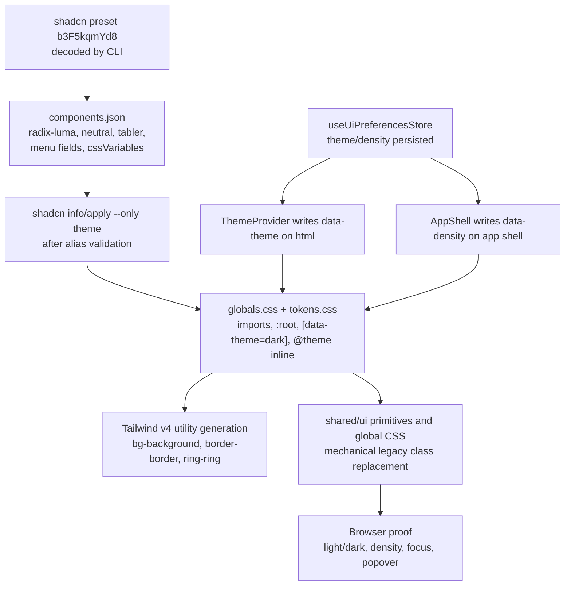

# Phase 6: Token Foundation + shadcn Preset Contract - Research

**Researched:** 2026-06-09
**Domain:** Frontend design-token migration, Tailwind CSS 4, shadcn preset/config contract
**Confidence:** HIGH for phase shape and repo boundaries; MEDIUM for exact installed package freshness because the package-legitimacy seam flagged three latest releases as recent.

<user_constraints>
## User Constraints (from CONTEXT.md)

### Locked Decisions
### Token Activation Shape
- **D-01:** The preset should be active immediately in Phase 6. This is not a parallel contract that preserves the current visual palette.
- **D-02:** Use a clean-slate token migration. Breaking visual/styling changes are acceptable because there are no active users besides the owner.
- **D-03:** Legacy aliases such as `--bg`, `--paper`, `--ink`, `--rule`, `--info`, `--danger`, `--warn`, `--ok`, `--font`, `--mono`, `bg-paper`, `text-ink`, `border-rule`, and `ring-info` should not remain part of the Phase 6 token contract.
- **D-04:** If implementation needs a short-lived compile bridge inside a single patch, it must be removed before Phase 6 is called complete. Do not hand off a compatibility-bridge state to later phases.
- **D-05:** Phase 6 should move to the simplest final-state Tailwind setup now: CSS-first `@theme inline`, no dependency on legacy Tailwind utility names, and no old config bridge unless the planner proves it is unavoidable.

### Tooling And Dependency Path
- **D-06:** Keep `shadcn` as a web dependency and import `shadcn/tailwind.css`. Do not eject/inline it in Phase 6.
- **D-07:** Install all preset-level dependencies in Phase 6: `shadcn`, `tw-animate-css`, `@fontsource-variable/geist`, `@fontsource-variable/jetbrains-mono`, `@tabler/icons-react`, and any dev dependency needed for the Vite alias setup such as `@types/node`.
- **D-08:** Use the shadcn CLI for the theme/preset surface only. The intended command shape is `pnpm dlx shadcn@latest apply b3F5kqmYd8 --only theme -y -c apps/web` after aliases validate.
- **D-09:** Do not run an uncontrolled full `shadcn apply` that rewrites primitives/components. Primitive migration remains a later phase unless mechanical token cleanup requires limited class edits.
- **D-10:** Make `components.json` match the Tailwind v4 final target in Phase 6: `style` aligned to the luma/radix-luma target, `iconLibrary` set to Tabler, CSS variables enabled, aliases preserved under `@/shared/*`, and `tailwind.config` blank if CSS-first mode works.

### Alias And Config Boundary
- **D-11:** Remove legacy token aliases now. Phase 6 is allowed to update any web styling files needed to eliminate legacy token names.
- **D-12:** The scope can be broad across web styling files if needed, but the edits must remain mechanical token/style-foundation work. Do not introduce product redesign, new route structure, or domain behavior changes.
- **D-13:** Rename app-specific status extensions now. Prefer clean names such as `--success`, `--success-foreground`, `--success-muted`, `--warning`, `--warning-foreground`, `--info`, and related semantic pairs. Remove old public names like `--ok` and `--warn`.
- **D-14:** Do not flatten lifecycle/status colors onto positional `chart-*` tokens. Chart/data tokens can exist, but status tokens should remain semantic.
- **D-15:** Delete `apps/web/tailwind.config.ts` if CSS-first `@theme inline` fully replaces it and the build passes. Also remove `@config "../../tailwind.config.ts"` and update TypeScript includes if the file is deleted.

### Validation Proof
- **D-16:** Phase 6 requires build plus browser proof. Compile-only validation is insufficient because the phase can produce broad visual fallout.
- **D-17:** The planner may choose exact automated commands based on touched files, but the validation plan must include type/build proof, shadcn CLI/config proof, token grep proof, and `git diff --check`.
- **D-18:** Browser proof is app-shell focused for Phase 6: run the app and verify body/app shell/topbar/nav/theme/density computed tokens in light and dark. Deeper route visual tours belong to later phases.
- **D-19:** Full `pnpm dev` local stack is acceptable for browser proof.
- **D-20:** Even when using the full stack, do not trigger auto-apply, browser submission, mailbox scanning, real material generation, destructive profile/database actions, or worker-backed jobs.

### the agent's Discretion
- The planner may choose the exact token values from the decoded preset and official shadcn output, as long as the visible result reflects the supplied preset.
- The planner may decide whether limited shared primitive class edits are necessary in Phase 6 to remove legacy utilities, but must not turn this into the Phase 7 primitive migration unless needed for the clean token slate.
- The planner may choose the exact automated command set, subject to the proof requirements above.

### Deferred Ideas (OUT OF SCOPE)
None - discussion stayed within phase scope.
</user_constraints>

<phase_requirements>
## Phase Requirements

| ID | Description | Research Support |
|----|-------------|------------------|
| TOKEN-01 | The web app defines shadcn standard semantic CSS variables for light and dark themes, including `background`, `foreground`, `card`, `popover`, `primary`, `secondary`, `muted`, `accent`, `destructive`, `border`, `input`, `ring`, `chart-*`, `sidebar-*`, font, and radius tokens. | Use shadcn's semantic token list and `@theme inline` scaffold as the required token matrix. [CITED: https://ui.shadcn.com/docs/theming] |
| TOKEN-02 | Tailwind 4 can generate standard shadcn utilities from the token contract via CSS-first `@theme inline` mappings while legacy JobHunter token utility names are removed or mechanically replaced before Phase 6 completion. | Tailwind v4 theme variables create utility classes; `@theme inline` is required when theme variables reference other variables. [CITED: https://tailwindcss.com/docs/theme] |
| TOKEN-03 | The decoded preset `b3F5kqmYd8` is represented in project config and tokens: `radix-luma`/luma style, neutral base, sky theme, amber chart palette, medium radius, Geist body font, JetBrains Mono heading/technical font, Tabler icon target, default-translucent menu, and subtle menu accent. | `shadcn@4.11.0 preset decode b3F5kqmYd8 --json` returned the exact values listed here. [VERIFIED: shadcn CLI] |
| TOKEN-04 | `components.json`, TypeScript aliases, and Vite aliases support current shadcn CLI validation without moving generated components outside `apps/web/src/shared/ui`. | Current `shadcn info -c apps/web` resolves `@/shared/*` to `apps/web/@/...`, proving alias setup is not yet valid; shadcn Vite docs require matching TS and Vite aliases. [VERIFIED: shadcn CLI] [CITED: https://ui.shadcn.com/docs/installation/vite] |
| TOKEN-05 | JobHunter's persisted `[data-theme="dark"]` behavior and app-shell-scoped density behavior remain compatible with the new token contract. | `ThemeProvider` writes `data-theme` to `<html>` and `AppShell` writes `data-density` around app content; Tailwind supports a `data-theme` dark variant. [VERIFIED: codebase grep] [CITED: https://tailwindcss.com/docs/dark-mode] |
| TOKEN-06 | Legacy token aliases (`--bg`, `--paper`, `--ink`, `--rule`, `--info`, `--danger`, `--warn`, `--ok`, `--font`, `--mono`, `--row`) and legacy utilities are absent from the Phase 6 public token contract; any short-lived compile bridge is removed before completion. | Current grep finds these names across `tokens.css`, `globals.css`, `tailwind.config.ts`, Storybook preview, and shared primitives; Phase 6 must include a grep-clean exit gate. [VERIFIED: codebase grep] |
</phase_requirements>

## Summary

Phase 6 should be planned as a clean-slate frontend styling infrastructure migration, not a product redesign. The final state is shadcn/Tailwind v4 semantic token vocabulary in CSS-first `@theme inline`, with `components.json` aligned to the decoded preset and old JobHunter public token names removed before completion. [VERIFIED: 06-CONTEXT.md] [CITED: https://ui.shadcn.com/docs/theming]

The existing code is not close to the final contract: `apps/web/src/styles/tokens.css` defines bespoke variables, `apps/web/src/styles/globals.css` has hundreds of direct `var(--paper)` / `var(--rule)` style uses, `apps/web/tailwind.config.ts` exposes old utility names, and shared primitives still contain classes like `bg-paper`, `text-ink`, `border-rule`, and `ring-info`. [VERIFIED: codebase grep] The planner should schedule alias/config repair before CLI use, then token/global CSS conversion, then only the minimal shared primitive edits needed to make the Phase 6 exit grep-clean. [VERIFIED: 06-CONTEXT.md]

**Primary recommendation:** Plan a two-wave Phase 6: first establish the valid shadcn/Tailwind v4 config and dependency baseline, then replace the legacy token contract mechanically across production styling until `shadcn info`, `web:check`, `web:build`, token grep, browser computed-token smoke, and `git diff --check` all pass. [VERIFIED: 06-UI-SPEC.md]

## Architectural Responsibility Map

| Capability | Primary Tier | Secondary Tier | Rationale |
|------------|-------------|----------------|-----------|
| Semantic token definitions | Browser / Client | CDN / Static | Tokens are CSS variables compiled into the Vite web bundle; no API/backend behavior owns them. [VERIFIED: codebase grep] |
| Tailwind utility generation | Browser / Client | Build tooling | Tailwind v4 utilities are generated from CSS `@theme` variables during web build. [CITED: https://tailwindcss.com/docs/theme] |
| shadcn registry/config contract | Browser / Client | Build tooling | `components.json` governs local generated component paths and CLI behavior, while generated code remains under `apps/web/src/shared/ui`. [CITED: https://ui.shadcn.com/docs/components-json] |
| Theme selection | Browser / Client | Local storage | `ThemeProvider` reads persisted UI preferences and writes `data-theme` on `<html>`. [VERIFIED: codebase grep] |
| Density selection | Browser / Client | Local storage | `AppShell` writes `data-density` below `<html>`; density is layout state, not server state. [VERIFIED: codebase grep] |
| Browser UI color matching | Browser / Client | Browser engine | `color-scheme` affects canvas, scrollbars, form controls, and other user-agent UI. [CITED: https://developer.mozilla.org/en-US/docs/Web/CSS/color-scheme] |

## Project Constraints (from AGENTS.md)

| Directive | Planning Implication |
|-----------|----------------------|
| Use repo docs before architectural, workflow, or QA decisions. [VERIFIED: AGENTS.md] | Planner must keep `docs/frontend-target.md`, `docs/architecture.md`, `docs/local-reliability-qa.md`, `docs/decisions.md`, `06-CONTEXT.md`, and `06-UI-SPEC.md` in the source set. |
| Do not run auto-apply, browser submission, destructive profile/database actions, or commands that submit applications unless explicitly asked. [VERIFIED: AGENTS.md] | Browser proof must use app shell/theme/density paths only and must not start worker-backed application actions. |
| Frontend views are composers; contexts own domain hooks/components; shared primitives live under `apps/web/src/shared/ui`. [VERIFIED: AGENTS.md] | Phase 6 token work must not move tokens into bounded contexts or create view-owned design-system APIs. |
| Direct `apiClient.*`, `localStorage.*`, `new EventSource`, and cross-component `window.dispatchEvent` are forbidden in feature code; use ports/providers. [VERIFIED: AGENTS.md] | Phase 6 should not introduce new runtime preference plumbing beyond the existing Theme/Density seams. |
| Tests are colocated; a11y tests and Storybook states are required for changed user-facing UI surfaces. [VERIFIED: AGENTS.md] | Planner should add a token-contract test and targeted browser smoke; Storybook/a11y gates are needed only if primitive/story behavior changes. |
| PRs that add meaningful capabilities must update owning docs narrowly. [VERIFIED: AGENTS.md] | Package/config/token contract changes likely require narrow updates to `docs/frontend-target.md`, `docs/local-reliability-qa.md`, or `docs/local-ts-api.md` if public dev commands/config expectations change. |
| Never edit code on `main`; work must happen in a dedicated worktree. [VERIFIED: AGENTS.md] | Current worktree is `/private/tmp/JobHunter-shadcn-standard-token-milestone` on branch `plan/shadcn-standard-token-milestone-20260609`. [VERIFIED: git branch] |

## Standard Stack

### Core

| Library | Version | Purpose | Why Standard |
|---------|---------|---------|--------------|
| `tailwindcss` | Current project: `^4.2.4`; official docs page shows v4.3 docs. [VERIFIED: package.json] [CITED: https://tailwindcss.com/docs/theme] | CSS-first utility generation from `@theme inline`. | Tailwind v4 theme variables are the utility API for design tokens. [CITED: https://tailwindcss.com/docs/theme] |
| `@tailwindcss/vite` | Current project: `^4.2.4`. [VERIFIED: package.json] | Vite integration for Tailwind CSS. | The web app already uses Vite + Tailwind plugin in `apps/web/vite.config.ts`. [VERIFIED: codebase grep] |
| `shadcn` | Latest `4.11.0`, created 2024-07-09, modified 2026-06-08. [VERIFIED: npm registry] | CLI/dependency for `shadcn/tailwind.css` and preset probing. | User decision requires keeping `shadcn` as dependency and importing `shadcn/tailwind.css`; official docs show the import in the Tailwind v4 scaffold. [VERIFIED: 06-CONTEXT.md] [CITED: https://ui.shadcn.com/docs/theming] |
| `tw-animate-css` | Latest `1.4.0`, created 2025-03-10, modified 2026-02-28. [VERIFIED: npm registry] | Tailwind v4 animation utilities used by shadcn. | shadcn Tailwind v4 docs state `tailwindcss-animate` was deprecated in favor of `tw-animate-css`. [CITED: https://ui.shadcn.com/docs/tailwind-v4] |
| `@tabler/icons-react` | Latest `3.44.0`, created 2023-01-05, modified 2026-05-08. [VERIFIED: npm registry] | Preset icon target. | Preset decode returns `iconLibrary: "tabler"` and Tabler docs install `@tabler/icons-react`. [VERIFIED: shadcn CLI] [CITED: https://docs.tabler.io/icons/libraries/react] |

### Supporting

| Library | Version | Purpose | When to Use |
|---------|---------|---------|-------------|
| `@fontsource-variable/geist` | Latest `5.2.9`, created 2024-12-29, modified 2026-05-17. [VERIFIED: npm registry] | Self-host Geist variable font for body text. | User decision and preset decode require Geist body font; Fontsource lists Geist with variable weight axis. [VERIFIED: 06-CONTEXT.md] [CITED: https://fontsource.org/fonts/geist] |
| `@fontsource-variable/jetbrains-mono` | Latest `5.2.8`, created 2023-05-21, modified 2025-09-17. [VERIFIED: npm registry] | Self-host JetBrains Mono variable font for heading/technical text. | User decision and preset decode require JetBrains Mono heading/technical font; Fontsource lists JetBrains Mono with variable weight axis. [VERIFIED: shadcn CLI] [CITED: https://fontsource.org/fonts/jetbrains-mono] |
| `@types/node` | Latest `25.9.2`, created 2016-05-17, modified 2026-06-05. [VERIFIED: npm registry] | Type support for Vite alias setup using Node path/url APIs. | shadcn Vite docs tell existing Vite projects to install `@types/node` before adding the Vite alias. [CITED: https://ui.shadcn.com/docs/installation/vite] |
| `class-variance-authority`, `clsx`, `tailwind-merge` | Existing project deps: `^0.7.1`, `^2.1.1`, `^3.5.0`. [VERIFIED: package.json] | Existing shadcn-style class composition. | Already used by copied primitives; Phase 6 should not add a new styling abstraction. [VERIFIED: codebase grep] |

### Alternatives Considered

| Instead of | Could Use | Tradeoff |
|------------|-----------|----------|
| `shadcn/tailwind.css` import | `shadcn eject` output | Rejected by user for Phase 6; ejection removes the dependency and inlines CSS, but D-06 says keep the dependency. [VERIFIED: 06-CONTEXT.md] |
| CSS-first `@theme inline` | Keep `tailwind.config.ts` bridge | Only acceptable if planner proves unavoidable for a temporary compile patch; final Phase 6 target is no legacy config bridge. [VERIFIED: 06-CONTEXT.md] |
| `data-theme` dark variant | shadcn default `.dark` selector | Rejected unless ThemeProvider is deliberately migrated; current app writes `data-theme` and Tailwind supports data-attribute dark variants. [VERIFIED: codebase grep] [CITED: https://tailwindcss.com/docs/dark-mode] |

**Installation:**

```bash
corepack pnpm --filter @jobhunter/web add shadcn tw-animate-css @fontsource-variable/geist @fontsource-variable/jetbrains-mono @tabler/icons-react
corepack pnpm --filter @jobhunter/web add -D @types/node
```

## Package Legitimacy Audit

| Package | Registry | Age | Downloads | Source Repo | Verdict | Disposition |
|---------|----------|-----|-----------|-------------|---------|-------------|
| `shadcn` | npm | ~1 yr 11 mo; latest published 2026-06-08 | 5,280,857/wk | github.com/shadcn-ui/ui | SUS: too-new latest | Approved by user decision; planner must add `checkpoint:human-verify` before install. |
| `tw-animate-css` | npm | ~1 yr 3 mo | 26,610,353/wk | github.com/Wombosvideo/tw-animate-css | OK | Approved. |
| `@fontsource-variable/geist` | npm | ~1 yr 5 mo; latest published 2026-05-17 | 878,726/wk | github.com/fontsource/font-files | SUS: too-new latest | Approved by user decision; planner must add `checkpoint:human-verify` before install. |
| `@fontsource-variable/jetbrains-mono` | npm | ~3 yr | 374,065/wk | github.com/fontsource/font-files | OK | Approved. |
| `@tabler/icons-react` | npm | ~3 yr 5 mo | 2,281,517/wk | github.com/tabler/tabler-icons | OK | Approved. |
| `@types/node` | npm | ~10 yr; latest published 2026-06-05 | 344,129,170/wk | github.com/DefinitelyTyped/DefinitelyTyped | SUS: too-new latest | Approved by official shadcn Vite docs; planner must add `checkpoint:human-verify` before install. |

**Packages removed due to [SLOP] verdict:** none. [VERIFIED: package-legitimacy]
**Packages flagged as suspicious [SUS]:** `shadcn`, `@fontsource-variable/geist`, `@types/node`. [VERIFIED: package-legitimacy]

No checked package reported a `scripts.postinstall` value in `npm view`. [VERIFIED: npm registry]

## Architecture Patterns

### System Architecture Diagram



### Recommended Project Structure

```text
apps/web/
├── components.json              # shadcn registry/config contract
├── src/styles/globals.css       # Tailwind imports, shadcn imports, @custom-variant, @theme inline, base rules
├── src/styles/tokens.css        # Optional split token file if kept; no legacy public aliases at exit
├── vite.config.ts               # @ alias for shadcn/Vite
├── tsconfig.json                # @/* path alias; remove tailwind.config include if config deleted
└── src/shared/ui/               # Minimal mechanical class edits only if required for grep-clean Phase 6
```

### Pattern 1: CSS-First shadcn Theme Contract

**What:** Define semantic CSS variables under `:root` and `[data-theme="dark"]`, expose them through top-level `@theme inline`, and make base styles consume standard shadcn utilities. [CITED: https://ui.shadcn.com/docs/theming] [CITED: https://tailwindcss.com/docs/theme]

**When to use:** Always in Phase 6; plain `:root` variables alone do not generate Tailwind utilities. [CITED: https://tailwindcss.com/docs/theme]

**Example:**

```css
/* Source: shadcn theming docs adapted to JobHunter data-theme model */
@import "tailwindcss";
@import "tw-animate-css";
@import "shadcn/tailwind.css";

@custom-variant dark (&:where([data-theme="dark"], [data-theme="dark"] *));

@theme inline {
  --color-background: var(--background);
  --color-foreground: var(--foreground);
  --color-card: var(--card);
  --color-card-foreground: var(--card-foreground);
  --color-popover: var(--popover);
  --color-popover-foreground: var(--popover-foreground);
  --color-primary: var(--primary);
  --color-primary-foreground: var(--primary-foreground);
  --color-border: var(--border);
  --color-input: var(--input);
  --color-ring: var(--ring);
  --radius-sm: calc(var(--radius) * 0.6);
  --radius-md: calc(var(--radius) * 0.8);
  --radius-lg: var(--radius);
  --radius-xl: calc(var(--radius) * 1.4);
}

:root {
  color-scheme: light;
  --radius: 0.625rem;
  --background: oklch(1 0 0);
  --foreground: oklch(0.145 0 0);
}

:root[data-theme="dark"] {
  color-scheme: dark;
  --background: oklch(0.145 0 0);
  --foreground: oklch(0.985 0 0);
}
```

### Pattern 2: shadcn Alias Repair Before CLI Apply

**What:** Add `@/*` to TypeScript and Vite before running `shadcn apply`. [CITED: https://ui.shadcn.com/docs/installation/vite]

**When to use:** First implementation wave; current `shadcn info` resolves `@/shared/*` to `apps/web/@/...`, which is invalid. [VERIFIED: shadcn CLI]

**Example:**

```ts
// Source: shadcn Vite docs, adapted to this ESM Vite config.
import { fileURLToPath } from "node:url";

export default defineConfig({
  resolve: {
    alias: {
      "@": fileURLToPath(new URL("./src", import.meta.url)),
    },
  },
});
```

### Pattern 3: Low-Specificity Density Scope

**What:** Keep density as explicit app-shell state with 32/40/48px row-height variables; use `:where([data-density="..."])` selectors if CSS selectors are needed. [VERIFIED: 06-UI-SPEC.md]

**When to use:** For row heights and dense scan surfaces; do not make density a global shadcn color token. [VERIFIED: codebase grep]

**Example:**

```css
/* Source: Phase 6 UI-SPEC + modern-web-guidance density fallback. */
:where(.app-shell) {
  --jh-row-height: 40px;
}

:where(.app-shell[data-density="compact"]) {
  --jh-row-height: 32px;
}

:where(.app-shell[data-density="comfy"]) {
  --jh-row-height: 48px;
}
```

### Anti-Patterns to Avoid

- **Leaving a permanent bridge:** Legacy token aliases may exist only inside one implementation patch and must be gone at completion. [VERIFIED: 06-CONTEXT.md]
- **Copying `.dark` without migrating ThemeProvider:** JobHunter uses `[data-theme="dark"]`; Tailwind supports data-attribute dark variants. [VERIFIED: codebase grep] [CITED: https://tailwindcss.com/docs/dark-mode]
- **Flattening status colors to chart tokens:** Chart tokens are for chart/data series; lifecycle statuses need explicit status semantics. [VERIFIED: 06-CONTEXT.md]
- **Running uncontrolled `shadcn apply`:** CLI docs support `--only theme`; user decisions prohibit broad component rewrite in Phase 6. [CITED: https://ui.shadcn.com/docs/cli] [VERIFIED: 06-CONTEXT.md]
- **Relying on body-only `color-scheme`:** Browser UI color-scheme behavior is root/page-wide; MDN recommends declaring page-wide preference on `:root` and using meta early in the head. [CITED: https://developer.mozilla.org/en-US/docs/Web/CSS/color-scheme]

## Don't Hand-Roll

| Problem | Don't Build | Use Instead | Why |
|---------|-------------|-------------|-----|
| Tailwind utility generation from tokens | Custom class generator or manual CSS for every semantic utility | Tailwind v4 `@theme inline` | Theme variables create utilities; plain variables do not. [CITED: https://tailwindcss.com/docs/theme] |
| shadcn preset application | Manual interpretation of preset code | `pnpm dlx shadcn@latest preset decode ... --json` and `apply --only theme` | CLI supports preset decode and theme-only application. [CITED: https://ui.shadcn.com/docs/cli] |
| Path alias validation | Custom resolver hack | TypeScript `paths` plus Vite `resolve.alias` | Official Vite install docs require both. [CITED: https://ui.shadcn.com/docs/installation/vite] |
| Browser-native dark UI | Custom scrollbars/form-control reimplementation | `color-scheme` on `:root` plus `[data-theme]` token overrides | `color-scheme` lets user agents theme canvas, scrollbars, controls, and browser-provided UI. [CITED: https://developer.mozilla.org/en-US/docs/Web/CSS/color-scheme] |
| Focus proof | Visual intuition only | Explicit `:focus-visible` ring plus browser keyboard smoke and contrast check | W3C requires visible focus and non-text contrast for UI state indicators. [CITED: https://www.w3.org/WAI/WCAG22/Understanding/non-text-contrast.html] [CITED: https://www.w3.org/WAI/WCAG22/Understanding/focus-appearance.html] |

**Key insight:** Phase 6 should use framework contracts to make invalid token usage fail quickly; a custom compatibility layer would recreate the legacy API the phase is supposed to delete. [VERIFIED: 06-CONTEXT.md]

## Runtime State Inventory

| Category | Items Found | Action Required |
|----------|-------------|------------------|
| Stored data | `jh:ui-preferences` in browser `localStorage` stores `theme` and `density`, not token names. [VERIFIED: codebase grep] | No data migration for token names; browser smoke must verify persisted light/dark and density still drive the new CSS. |
| Live service config | None found for token names; shadcn/token config lives in repo files. [VERIFIED: codebase grep] | No external service config migration. |
| OS-registered state | None found; no launchd/systemd/pm2 config files with token names in repo scan. [VERIFIED: file scan] | No OS re-registration. |
| Secrets/env vars | `.env.example` exists, but no token-name env var hits were found. [VERIFIED: file scan] | No secret/env var rename. |
| Build artifacts | No `dist/`, `apps/web/dist`, `.vite`, or `apps/web/node_modules/.vite` directories were present in the worktree. [VERIFIED: file scan] | No artifact cleanup now; planner should run build after implementation and ignore generated output unless intentionally committed. |

**Nothing found in category:** All five categories were checked explicitly; runtime state risk is limited to browser `localStorage` theme/density behavior, not old token-name persistence. [VERIFIED: codebase grep]

## Common Pitfalls

### Pitfall 1: Alias Repair Happens After CLI Apply

**What goes wrong:** `shadcn apply` or future CLI validation writes/resolves paths incorrectly because `@/*` is not mapped to `apps/web/src/*`. [VERIFIED: shadcn CLI]
**Why it happens:** Current `components.json` uses `@/shared/*`, but `tsconfig.json` and `vite.config.ts` do not define the alias. [VERIFIED: codebase grep]
**How to avoid:** Make alias repair the first task, then run `pnpm dlx shadcn@latest info -c apps/web`. [CITED: https://ui.shadcn.com/docs/installation/vite]
**Warning signs:** `shadcn info` resolved paths show `apps/web/@/shared/...`. [VERIFIED: shadcn CLI]

### Pitfall 2: Plain Variables Without `@theme inline`

**What goes wrong:** CSS variables exist, but Tailwind utilities such as `bg-background` or `ring-ring` are not generated or do not resolve as expected. [CITED: https://tailwindcss.com/docs/theme]
**Why it happens:** Tailwind v4 utility APIs are driven by `@theme` namespaces, not arbitrary `:root` variables. [CITED: https://tailwindcss.com/docs/theme]
**How to avoid:** Add top-level `@theme inline` mappings for every required shadcn and app-extension token. [CITED: https://ui.shadcn.com/docs/theming]
**Warning signs:** `web:build` passes only after leaving `tailwind.config.ts` legacy aliases in place. [ASSUMED]

### Pitfall 3: Dark Selector Split

**What goes wrong:** Light tokens update while dark mode stays on old values or shadcn `.dark` tokens never apply. [VERIFIED: codebase grep]
**Why it happens:** shadcn docs default to `.dark`, while JobHunter writes `[data-theme="dark"]`. [CITED: https://ui.shadcn.com/docs/theming] [VERIFIED: codebase grep]
**How to avoid:** Use `@custom-variant dark (&:where([data-theme="dark"], [data-theme="dark"] *));` and dark variable overrides under `:root[data-theme="dark"]` or `[data-theme="dark"]`. [CITED: https://tailwindcss.com/docs/dark-mode]
**Warning signs:** Computed `--background` changes on `.dark` only, not on `html[data-theme="dark"]`. [ASSUMED]

### Pitfall 4: Status Tokens Lose Product Meaning

**What goes wrong:** Success, warning, running/info, failed/destructive, blocked, stale, and missing states collapse into generic `primary`, `secondary`, or `chart-*`. [VERIFIED: 06-UI-SPEC.md]
**Why it happens:** shadcn UI role tokens are not a complete product lifecycle taxonomy. [VERIFIED: 06-CONTEXT.md]
**How to avoid:** Add clean app extension tokens such as `--success`, `--warning`, `--info`, and foreground/muted pairs; expose them via `@theme inline`; do not keep `--ok`/`--warn`. [VERIFIED: 06-CONTEXT.md]
**Warning signs:** Dashboard/pipeline status code uses `chart-1` through `chart-5` for lifecycle meanings. [VERIFIED: 06-CONTEXT.md]

### Pitfall 5: Browser Proof Ignores Native UI

**What goes wrong:** App surfaces look themed but scrollbars, form controls, focus rings, or native controls mismatch. [CITED: https://developer.mozilla.org/en-US/docs/Web/CSS/color-scheme]
**Why it happens:** `color-scheme` is missing or not synced to the manual `[data-theme]` model. [VERIFIED: codebase grep]
**How to avoid:** Add/verify `<meta name="color-scheme" content="light dark">` and root `color-scheme` values for light/dark states. [CITED: https://developer.mozilla.org/en-US/docs/Web/CSS/color-scheme]
**Warning signs:** Browser smoke in dark mode shows light native select controls or scrollbars. [ASSUMED]

## Code Examples

### Token Contract Test

```ts
// Source: repo testing pattern + Phase 6 requirements.
import { readFileSync } from "node:fs";

const css = readFileSync(new URL("../../styles/globals.css", import.meta.url), "utf8");

it("exposes required shadcn semantic tokens", () => {
  for (const token of [
    "--background",
    "--foreground",
    "--card",
    "--popover",
    "--primary",
    "--border",
    "--input",
    "--ring",
    "--chart-1",
    "--sidebar",
    "--radius",
  ]) {
    expect(css).toContain(token);
  }
});

it("does not expose legacy public token names", () => {
  expect(css).not.toMatch(/--(?:bg|paper|ink|rule|danger|warn|ok|font|mono|row)\b/);
});
```

### Browser Computed Token Smoke

```ts
// Source: Phase 6 UI-SPEC browser proof requirement.
const html = document.documentElement;
html.dataset.theme = "dark";
const styles = getComputedStyle(html);
expect(styles.getPropertyValue("--background").trim()).not.toBe("");
expect(styles.getPropertyValue("--foreground").trim()).not.toBe("");
expect(styles.getPropertyValue("color-scheme")).toContain("dark");
```

## State of the Art

| Old Approach | Current Approach | When Changed | Impact |
|--------------|------------------|--------------|--------|
| shadcn `default` style + lucide target | `radix-luma`/luma preset with Tabler icon target | Preset decoded 2026-06-09 by CLI | `components.json` must move from `style: default`, `iconLibrary: lucide` to preset fields. [VERIFIED: shadcn CLI] |
| Tailwind config as token bridge | CSS-first `@theme inline` for Tailwind v4 | shadcn Tailwind v4 docs current as fetched 2026-06-09 | Phase 6 should blank `tailwind.config` if CSS-first mode fully replaces it. [CITED: https://ui.shadcn.com/docs/components-json] |
| `tailwindcss-animate` | `tw-animate-css` | shadcn docs changelog says 2025-03-19 | Install/import `tw-animate-css`; do not add deprecated animation plugin. [CITED: https://ui.shadcn.com/docs/tailwind-v4] |
| `.dark` default selector | Project-specific `data-theme` selector | JobHunter architecture predates this phase | Keep `[data-theme="dark"]` unless ThemeProvider migration is explicitly scoped. [VERIFIED: codebase grep] |

**Deprecated/outdated:**
- Permanent legacy token names are out of scope for Phase 6 completion. [VERIFIED: 06-CONTEXT.md]
- Uncontrolled full `shadcn apply` is out of scope for Phase 6. [VERIFIED: 06-CONTEXT.md]

## Assumptions Log

| # | Claim | Section | Risk if Wrong |
|---|-------|---------|---------------|
| A1 | `web:build` passing only after retaining legacy config aliases is a warning sign that CSS-first mappings are incomplete. | Common Pitfalls | Planner may need an explicit temporary bridge task and removal task in the same wave. |
| A2 | Dark-mode native-control mismatch will be visible as light native controls or scrollbars in dark mode. | Common Pitfalls | Browser QA may miss root `color-scheme` bugs if it only inspects custom CSS variables. |
| A3 | `apps/web/src/styles/token-contract.test.ts` is the best new test file for token contract checks. | Validation Architecture | Planner may choose a different colocated test path, but still needs equivalent coverage. |
| A4 | CSS output grep or a build artifact check is the best proof that Tailwind generated required semantic utilities. | Validation Architecture | Planner may use a different generated-CSS assertion, but TOKEN-02 still needs generated utility proof. |
| A5 | Browser smoke in dark mode will expose native select/scrollbar color-scheme drift. | Common Pitfalls | Some platform/browser combinations may hide scrollbar differences, so computed `color-scheme` inspection should backstop visual smoke. |

## Open Questions (RESOLVED)

1. **Can `apps/web/tailwind.config.ts` be deleted in the same patch that removes all legacy utilities?**
   - RESOLVED: Yes, Phase 6 plans should delete `apps/web/tailwind.config.ts` as part of the same execution sequence, but only after CSS-first `@theme inline` mappings and all direct legacy utility replacements are in place. Plan 06-03 owns this decision by removing `@config`, updating `components.json` and `tsconfig.json`, deleting the config file, and requiring `web:build` plus legacy-token grep before completion.
   - Fallback if execution proves deletion temporarily impossible: keep a compile bridge only inside the active implementation patch, record the deviation, then remove it before Phase 6 verification. The phase must not hand off a compatibility-bridge state to later phases. [VERIFIED: 06-CONTEXT.md]

2. **How much primitive editing belongs in Phase 6?**
   - RESOLVED: Phase 6 includes only the primitive edits required for a clean-slate legacy-token exit: direct class/token substitutions in shared primitives and related stories/wrappers that currently reference `bg-paper`, `text-ink`, `border-rule`, `ring-info`, or direct legacy variables. Plans 06-04 and 06-05 own this mechanical cleanup.
   - Out of scope remains unchanged: no new primitive variants, behavior changes, icons, ARIA changes, domain imports, route changes, or Storybook redesign. Phase 7 still owns broader primitive-system refinement after the token foundation exists. [VERIFIED: 06-CONTEXT.md] [VERIFIED: 06-UI-SPEC.md]

## Environment Availability

| Dependency | Required By | Available | Version | Fallback |
|------------|-------------|-----------|---------|----------|
| Node.js | Vite, shadcn CLI, pnpm | yes | `v25.9.0` | Must still respect root `engines.node >=20.19.0`. [VERIFIED: command output] [VERIFIED: package.json] |
| pnpm via corepack | package install and web scripts | yes | `10.24.0` | none needed. [VERIFIED: command output] |
| shadcn CLI via `pnpm dlx` | preset decode/info/apply | yes | `4.11.0` | none; do not rely on stale generated output. [VERIFIED: shadcn CLI] |
| Vite web scripts | validation | yes | scripts present: `web:check`, `web:build`, `web:dev`, Storybook, E2E | Use narrowed web commands before full `pnpm test`. [VERIFIED: package.json] |
| Browser/dev server | browser proof | available by project command | `pnpm dev` / `pnpm web:dev` | Use full stack only if needed; do not trigger worker-backed jobs. [VERIFIED: AGENTS.md] |

**Missing dependencies with no fallback:** none identified during research. [VERIFIED: command output]

**Missing dependencies with fallback:** none identified during research. [VERIFIED: command output]

## Validation Architecture

### Test Framework

| Property | Value |
|----------|-------|
| Framework | Vitest 4.1.5, Vite 7.3.0, Storybook 10.3.6, Playwright `@playwright/test` `^1.50.0`. [VERIFIED: package.json] |
| Config file | `apps/web/vitest.config.ts`, `apps/web/vitest.types.config.ts`, `apps/web/e2e/playwright.config.ts`, `apps/web/.storybook/*`. [VERIFIED: file scan] |
| Quick run command | `corepack pnpm web:check && corepack pnpm web:build` |
| Full suite command | `corepack pnpm --filter @jobhunter/web test && corepack pnpm --filter @jobhunter/web test-d && corepack pnpm web:storybook:build` |

### Phase Requirements -> Test Map

| Req ID | Behavior | Test Type | Automated Command | File Exists? |
|--------|----------|-----------|-------------------|--------------|
| TOKEN-01 | Required semantic tokens exist in light/dark scopes. | unit/static | `corepack pnpm --filter @jobhunter/web test src/styles/token-contract.test.ts -x` | no, Wave 0 |
| TOKEN-02 | Tailwind generates `bg-background`, `text-foreground`, `border-border`, `ring-ring`, `bg-popover`, and related utilities. | build/smoke | `corepack pnpm web:build` plus CSS output grep for generated utilities | existing build script yes; CSS grep task new |
| TOKEN-03 | Preset decoded values are represented in config/tokens. | CLI/static | `corepack pnpm dlx shadcn@latest preset decode b3F5kqmYd8 --json` and config assertions | CLI yes; config assertion new |
| TOKEN-04 | `components.json`, TS alias, and Vite alias validate. | CLI/build | `corepack pnpm dlx shadcn@latest info -c apps/web` | command yes |
| TOKEN-05 | `[data-theme]` and app-shell `data-density` still drive theme/density. | browser/manual or Playwright smoke | Run app, toggle theme/density, inspect computed styles and 32/40/48px row heights | smoke spec new |
| TOKEN-06 | Legacy token names and utilities are absent at exit. | static grep | `rg -- '--bg|--paper|--ink|--rule|--danger|--warn|--ok|--font|--mono|--row|bg-paper|text-ink|border-rule|ring-info' apps/web/src apps/web/.storybook apps/web/tailwind.config.ts apps/web/components.json` returns no production hits | command yes |

### Sampling Rate

- **Per task commit:** `corepack pnpm web:check` plus targeted token grep for files touched. [VERIFIED: package.json]
- **Per wave merge:** `corepack pnpm web:build`, `corepack pnpm dlx shadcn@latest info -c apps/web`, and token grep. [VERIFIED: 06-UI-SPEC.md]
- **Phase gate:** `corepack pnpm web:check`, `corepack pnpm web:build`, `corepack pnpm dlx shadcn@latest info -c apps/web`, token grep clean, browser computed-token smoke, `git diff --check`. [VERIFIED: 06-UI-SPEC.md]

### Wave 0 Gaps

- [ ] `apps/web/src/styles/token-contract.test.ts` - covers TOKEN-01, TOKEN-03, TOKEN-06. [ASSUMED]
- [ ] CSS output grep or build artifact check - covers TOKEN-02 generated utility proof. [ASSUMED]
- [ ] Browser smoke script/checklist for app shell light/dark, focus ring, popover, and density row heights - covers TOKEN-05 and D-16 through D-18. [VERIFIED: 06-UI-SPEC.md]

## Security Domain

### Applicable ASVS Categories

| ASVS Category | Applies | Standard Control |
|---------------|---------|------------------|
| V2 Authentication | no | No auth behavior changes in Phase 6. [VERIFIED: 06-CONTEXT.md] |
| V3 Session Management | no | No session behavior changes in Phase 6. [VERIFIED: 06-CONTEXT.md] |
| V4 Access Control | no | No API/route authorization changes in Phase 6. [VERIFIED: 06-CONTEXT.md] |
| V5 Input Validation | yes, indirectly | Do not change form validation; preserve existing TanStack Form + Zod `safeParse` conventions. [VERIFIED: AGENTS.md] |
| V6 Cryptography | no | No crypto/secrets change. [VERIFIED: Runtime State Inventory] |
| V9 Communications | no | No network/SSE/API contract change. [VERIFIED: 06-CONTEXT.md] |
| V12 Files and Resources | yes, QA only | QA must not expose resumes, generated PDFs, logs, SQLite databases, browser profiles, API keys, or OAuth tokens. [VERIFIED: AGENTS.md] |
| V14 Configuration | yes | Package installs and CLI-generated config require legitimacy audit and human checkpoints for SUS packages. [VERIFIED: package-legitimacy] |

### Known Threat Patterns for Frontend Token Migration

| Pattern | STRIDE | Standard Mitigation |
|---------|--------|---------------------|
| Supply-chain install of suspicious latest package | Tampering | Gate `SUS` packages with `checkpoint:human-verify`, inspect npm metadata, and avoid postinstall scripts. [VERIFIED: package-legitimacy] |
| Sensitive local data in screenshots/browser proof | Information Disclosure | Use synthetic/seeded data and app-shell-only smoke; do not run apply automation or real generation. [VERIFIED: AGENTS.md] |
| Visual polish hides warning/audit states | Repudiation / Information Disclosure | Preserve explicit status extension tokens and audit-surface visibility; do not flatten lifecycle states to chart tokens. [VERIFIED: 06-UI-SPEC.md] |
| Invisible focus or low-contrast boundaries | Denial of Use / Accessibility | Verify 3:1 non-text contrast for component boundaries/states and visible focus indicators. [CITED: https://www.w3.org/WAI/WCAG22/Understanding/non-text-contrast.html] [CITED: https://www.w3.org/WAI/WCAG22/Understanding/focus-appearance.html] |

## Sources

### Primary

- `06-CONTEXT.md` - locked clean-slate decisions, dependency path, validation proof. [VERIFIED: codebase read]
- `06-UI-SPEC.md` - approved preset values, token/color/spacing/typography contract, browser proof expectations. [VERIFIED: codebase read]
- `apps/web/package.json`, root `package.json` - current scripts and dependency versions. [VERIFIED: codebase read]
- `apps/web/components.json`, `tokens.css`, `globals.css`, `tailwind.config.ts`, `vite.config.ts`, `tsconfig.json`, `ThemeProvider.tsx`, `AppShell.tsx`, `ui-preferences.ts` - current implementation state. [VERIFIED: codebase grep]
- shadcn CLI `4.11.0` - preset decode and current info output. [VERIFIED: shadcn CLI]
- npm registry metadata and package-legitimacy seam - versions, publish dates, repos, downloads, postinstall status, OK/SUS verdicts. [VERIFIED: npm registry]

### Official Docs

- https://ui.shadcn.com/docs/theming - semantic tokens, `@theme inline`, radius scale, default scaffold. [CITED]
- https://ui.shadcn.com/docs/installation/vite - Vite and TypeScript alias setup, `@types/node`. [CITED]
- https://ui.shadcn.com/docs/components-json - `components.json` contract and Tailwind v4 config guidance. [CITED]
- https://ui.shadcn.com/docs/tailwind-v4 - Tailwind v4 notes and `tw-animate-css` migration. [CITED]
- https://ui.shadcn.com/docs/cli - `apply --only theme`, `preset decode --json`, preset resolve/info. [CITED]
- https://ui.shadcn.com/schema.json - schema enum includes `radix-luma`, `menuColor`, and `menuAccent`. [CITED]
- https://tailwindcss.com/docs/theme - Tailwind v4 `@theme` variables and inline mode. [CITED]
- https://tailwindcss.com/docs/dark-mode - `data-theme` dark variant pattern. [CITED]
- https://developer.mozilla.org/en-US/docs/Web/CSS/color-scheme - root `color-scheme` behavior. [CITED]
- https://www.w3.org/WAI/WCAG22/Understanding/non-text-contrast.html - 3:1 non-text contrast. [CITED]
- https://www.w3.org/WAI/WCAG22/Understanding/focus-appearance.html - focus appearance guidance. [CITED]
- https://docs.tabler.io/icons/libraries/react - Tabler React package/install/use. [CITED]
- https://fontsource.org/fonts/geist and https://fontsource.org/fonts/jetbrains-mono - font families and variable axes. [CITED]

### Secondary

- `modern-web-guidance` local skill - dark mode, CSS token reactivity, accessibility, and CSS architecture guidance; used for current best-practice checks, but RESEARCH claims cite primary docs where possible. [VERIFIED: tool output]

### Tertiary

- Assumptions A1-A5 only. [ASSUMED]

## Metadata

**Confidence breakdown:**
- Standard stack: MEDIUM - package existence and official docs were checked, but three package latest releases are flagged `SUS` due recency. [VERIFIED: package-legitimacy]
- Architecture: HIGH - repo docs and code consistently place tokens in frontend shared styling, not backend/domain layers. [VERIFIED: codebase grep]
- Pitfalls: HIGH - current grep and official docs directly support alias, selector, and `@theme inline` risks. [VERIFIED: codebase grep] [CITED: https://tailwindcss.com/docs/theme]
- Validation: HIGH - scripts and QA gates exist; new token-contract and browser-smoke checks are straightforward gaps. [VERIFIED: package.json]

**Research date:** 2026-06-09
**Valid until:** 2026-06-16 for shadcn CLI/package versions; 2026-07-09 for repo architecture findings.
