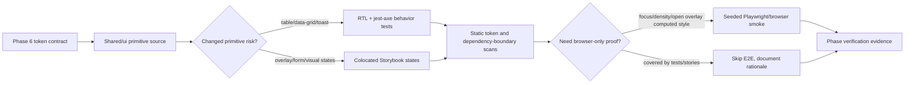

# Phase 07: Shared Primitive Token Migration - Research

**Researched:** 2026-06-10
**Domain:** React shared UI primitives, shadcn/Radix local copies, Tailwind 4 semantic tokens, Storybook/a11y proof
**Confidence:** HIGH

<user_constraints>
## User Constraints (from CONTEXT.md)

### Locked Decisions

### Primitive Scope Shape
- **D-01:** Treat Phase 7 as primitive hardening and coverage, not a second token-foundation phase. Phase 6 already made `apps/web/src/shared/ui` grep-clean for legacy token names and direct semantic CSS variable references.
- **D-02:** Keep all primitive edits behavior-preserving. Exports, props, Radix wiring, keyboard behavior, ARIA semantics, focus management, portals, animations, and stable dimensions must not change unless a test proves the current behavior is wrong.
- **D-03:** Do not run uncontrolled full `shadcn apply` or regenerate primitives wholesale. Use local mechanical edits, targeted tests, and Storybook states.
- **D-04:** Keep `shared/ui` domain-agnostic. It must not import contexts, views, API clients, query hooks, domain status helpers, local storage, EventSource, or route modules.
- **D-05:** Do not migrate visible lucide app iconography in this phase. `components.json` targets Tabler for future generated output, but visible icon migration belongs to Phase 8 unless a primitive test/story needs a local decorative icon fixture.

### Coverage Priority
- **D-06:** Focus first on high-risk primitive surfaces: `filterable-data-grid`, `data-table`, `table-pager`, dialog/sheet/drawer/dropdown/select/popover/command/tooltip/toast open states, and form controls. These combine keyboard behavior, focus, data density, or overlay readability.
- **D-07:** Storybook coverage should be per-state/per-variant, not decorative. Required states include default, disabled, focus/keyboard-reachable, destructive where applicable, loading/empty where applicable, and open overlay/menu/select/popover/dialog states.
- **D-08:** Add colocated `*.test.ts(x)` or `*.a11y.test.tsx` only where they prove behavior or accessibility that Storybook cannot prove cheaply. Do not snapshot shadcn/Radix internals just to increase file count.
- **D-09:** Use synthetic story/test data only. Do not include real profile data, resumes, generated PDFs, browser profiles, local DB content, application logs, job URLs, API keys, OAuth tokens, or other sensitive data.

### Accessibility And Density
- **D-10:** Follow current web accessibility guidance: prefer native elements over ARIA, keep accessible names/descriptions explicit, keep visible focus indicators, avoid `aria-hidden` on focusable elements, avoid positive `tabindex`, and verify keyboard paths for custom row/menu/filter interactions.
- **D-11:** Keep density behavior on the existing `.app-shell[data-density]` and `--jh-row-height` seam. Do not rely on container style queries as the only implementation path for core density behavior because Firefox support is not baseline.
- **D-12:** Overlay and menu primitives must stay readable in light and dark modes over dense content with visible boundaries/focus rings. Use standard shadcn semantic utility classes (`bg-popover`, `text-popover-foreground`, `border-border`, `ring-ring`, `bg-accent`, `text-accent-foreground`, `text-muted-foreground`, `bg-muted`) rather than introducing new token names.
- **D-13:** If an existing story disables a11y checks for a production defect, keep the deferral only when it is already tracked in `docs/backlog.md`. Any new serious/critical axe deferral requires a backlog entry per repo policy.

### Verification Contract
- **D-14:** Phase 7 verification must include `corepack pnpm web:check`, relevant colocated web tests, Storybook build, Storybook test runner where changed stories are covered, a shared/ui token-boundary scan, and targeted browser/Playwright proof for open overlays or keyboard focus where unit/story tests are insufficient.
- **D-15:** The full `corepack pnpm --filter @jobhunter/web test` command currently has known unrelated inline snapshot runner failures when invoked broadly. The planner should either fix that test-hygiene issue if it becomes required for Phase 7 completion, or document scoped verification and preserve the existing failure as unrelated carry-forward evidence.
- **D-16:** If E2E/browser proof is required, use the seeded Playwright harness or a disposable synthetic workspace. Do not run auto-apply, browser submission, mailbox scanning, real material generation, destructive profile/database actions, or worker-backed jobs.

### the agent's Discretion
- The planner may decide the exact split between stories, unit tests, a11y tests, and browser proof, as long as every Phase 7 requirement has evidence and no primitive behavior regresses.
- The planner may choose whether table/data-grid hardening is one plan or multiple plans based on dependency ordering and verification cost.
- The planner may add narrow helper test fixtures if they reduce duplication and stay under `apps/web/src/shared/ui` or existing test utilities.

### Deferred Ideas (OUT OF SCOPE)
- Visible Tabler icon migration remains Phase 8.
- Domain/status tone mapping remains Phase 9.
- Route-wide visual QA/a11y hardening remains Phase 10.
- Final global cleanup and unused dependency removal remain Phase 11.
</user_constraints>

<phase_requirements>
## Phase Requirements

| ID | Description | Research Support |
|----|-------------|------------------|
| PRIM-01 | Shared UI primitives use standard shadcn semantic classes for surfaces, text, borders, inputs, rings, actions, destructive states, disabled states, and muted/helper text. | Phase 6 verified `legacy token matches: 0`, and the current corrected shared/ui scanner also returns `legacy token matches: 0`; plan should preserve this invariant with a deterministic scanner that allows `text-muted-foreground`. [VERIFIED: 06-VERIFICATION.md + codebase grep] |
| PRIM-02 | Overlay primitives render readable `popover`/surface tokens in light and dark themes, including focus-visible states. | Overlay primitives currently use `bg-popover`, `text-popover-foreground`, `border-border`, `ring-ring`, and related shadcn utilities after Phase 6; plan must add open-state Storybook/browser proof. [VERIFIED: 06-05-SUMMARY.md + codebase grep] |
| PRIM-03 | Form, table/data-grid, card, badge, tab, checkbox, switch, skeleton, separator, and scroll-area primitives preserve behavior and accessibility while moving away from legacy color/radius/font utility names. | `filterable-data-grid.test.tsx` already covers pagination, filtering, sorting, active chips, and dialog filter interactions; table/data-grid and toast remain the highest accessibility risk. [VERIFIED: codebase grep] |
| PRIM-04 | Changed primitives have colocated tests and/or Storybook states for default, hover/active, disabled, destructive, focus, loading/empty where relevant, and open overlay states. | Current inventory is 71 shared/ui TSX files, 33 shared/ui stories, 1 shared/ui test, and 0 shared/ui a11y tests; plan should add proof only to changed/high-risk surfaces. [VERIFIED: find apps/web/src/shared/ui] |
| PRIM-05 | Shared primitives do not gain domain-specific dependencies on scoring, pipeline, materials, apply, discovery, or view modules. | Boundary scan found no new query/API/view/SSE imports but did find the known existing `MarkdownDocument.tsx` import from `contexts/operations/selectors`; plan must not expand this exception. [VERIFIED: codebase grep] |
</phase_requirements>

## Summary

Phase 7 should be planned as behavior-preserving hardening of `apps/web/src/shared/ui`, not as a token reset or shadcn regeneration. Phase 6 already established the Tailwind 4 semantic token contract, validated shadcn config, removed the legacy Tailwind bridge, and proved `legacy token matches: 0` across app/story/config surfaces. [VERIFIED: 06-VERIFICATION.md]

The highest-value plan split is: first fix/prove the production primitive a11y defects already tracked for `data-table.tsx` and `toast.tsx`; then extend `filterable-data-grid`, `data-table`, and `table-pager` behavioral coverage; then add per-state Storybook coverage and focused browser proof for overlays/forms/density/focus. This ordering reduces Storybook a11y deferrals early and keeps PRIM-04 proof tied to real risk instead of snapshots. [VERIFIED: docs/backlog.md + codebase grep]

**Primary recommendation:** Use existing shadcn/Radix local primitives and Phase 6 tokens; add targeted stories/tests/browser proof and static scans, with no new dependencies and no product workflow changes. [VERIFIED: 07-CONTEXT.md]

## Architectural Responsibility Map

| Capability | Primary Tier | Secondary Tier | Rationale |
|------------|--------------|----------------|-----------|
| Shared primitive token usage | Browser / Client | CDN / Static build output | Tailwind classes and CSS variables render in the web client and emitted CSS; generated assets prove utility output. [VERIFIED: docs/frontend-target.md + 06-VERIFICATION.md] |
| Overlay focus/readability | Browser / Client | Storybook test runner | Radix primitives own focus/portal behavior in the client; Storybook exercises open states and axe gates. [CITED: https://www.radix-ui.com/primitives/docs/components/dialog] |
| Data-grid/table keyboard behavior | Browser / Client | Vitest/jsdom | Row activation, sorting, filtering, and pagination are React component behaviors under `shared/ui`. [VERIFIED: apps/web/src/shared/ui/filterable-data-grid.tsx + data-table.tsx] |
| Primitive a11y proof | Browser / Client | Test infrastructure | Accessible names, roles, focus, and axe checks are UI-level concerns tested through RTL, jest-axe, Storybook, and Playwright. [VERIFIED: docs/local-reliability-qa.md] |
| Domain dependency boundary | Browser / Client | Static scan | `shared/ui` must stay generic and must not reach into contexts/views/API/SSE/query behavior. [VERIFIED: AGENTS.md + 07-CONTEXT.md] |

## Project Constraints (from AGENTS.md)

- Read repo docs before architecture, workflow, or QA decisions; especially `docs/frontend-target.md`, `docs/local-reliability-qa.md`, `docs/decisions.md`, `package.json`, and relevant planning artifacts. [VERIFIED: AGENTS.md]
- Do not run auto-apply, browser submission, destructive profile/database actions, or commands that submit applications unless explicitly requested. [VERIFIED: AGENTS.md]
- Meaningful behavior changes require tests; user-facing UI/API/product-flow changes require a QA stage that exercises the product path, not only unit tests. [VERIFIED: AGENTS.md]
- PRs adding meaningful capabilities require narrow documentation updates in the owning docs; internal refactors, test-only changes, and behavior-preserving renames generally do not. [VERIFIED: AGENTS.md]
- Treat payloads, local artifacts, job/application data, logs, SQLite DBs, resumes, cover letters, PDFs, browser profiles, secrets, and generated data as sensitive. [VERIFIED: AGENTS.md]
- Frontend views compose contexts; contexts and shared primitives must not import views, query clients, direct API clients, local storage, EventSource, or platform APIs directly unless going through the proper shared port/provider seam. [VERIFIED: AGENTS.md]
- Web tests should be colocated; a11y tests use `*.a11y.test.tsx`; Storybook stories are colocated; existing MSW handler files should be extended rather than creating new setups. [VERIFIED: AGENTS.md]
- Storybook a11y allows no critical/serious axe violations; any new `a11y.test = "off"` deferral must be recorded in `docs/backlog.md`. [VERIFIED: AGENTS.md]

## Standard Stack

### Core

| Library | Version | Purpose | Why Standard |
|---------|---------|---------|--------------|
| React / React DOM | locked `19.2.5` | Render shared primitives and stories. | Existing app runtime; do not change for Phase 7. [VERIFIED: pnpm-lock.yaml] |
| Tailwind CSS | locked `4.2.4` | CSS-first semantic utility generation through `@theme inline`. | Phase 6 token foundation depends on Tailwind 4 generated utilities. [VERIFIED: pnpm-lock.yaml + 06-VERIFICATION.md] |
| shadcn CLI/local copies | configured `4.11.0`; registry latest `4.11.0`, modified 2026-06-08 | Validates config and generated-output contract; primitives are owned as local copied files. | `components.json` resolves `ui` to `apps/web/src/shared/ui`; no uncontrolled apply. [VERIFIED: package.json + npm registry + 06-VERIFICATION.md] |
| Radix React primitives | locked examples: dialog `1.1.15`, dropdown `2.1.16`, select `2.2.6`, toast `1.2.15` | Focus, portals, keyboard, ARIA, and primitive behavior under shadcn wrappers. | Radix docs state dialog traps focus and uses title/description announcements; dropdown manages focus and keyboard navigation. [VERIFIED: pnpm-lock.yaml] [CITED: https://www.radix-ui.com/primitives/docs/components/dialog] |
| `cmdk` | locked `1.1.1` | Command palette primitive behavior. | Existing shadcn command wrapper dependency; current a11y deferral is tracked for initial mount. [VERIFIED: pnpm-lock.yaml + docs/backlog.md] |

### Supporting

| Library | Version | Purpose | When to Use |
|---------|---------|---------|-------------|
| Vitest | package `4.1.5`; registry latest `4.1.8`, modified 2026-06-01 | Shared/ui unit, component, and a11y tests. | Use for role/name behavior, keyboard activation, and deterministic component tests. [VERIFIED: command output + npm registry] |
| Testing Library user-event | locked `14.6.1`; registry latest `14.6.1`, modified 2025-12-13 | Keyboard and pointer interaction in component tests. | Use `user.keyboard`/role queries for row activation, dialog operation, menu/select keyboard paths. [VERIFIED: pnpm-lock.yaml + npm registry] [CITED: https://testing-library.com/docs/user-event/keyboard/] |
| Storybook / addon-a11y / test-runner | locked Storybook `10.3.6`, addon-a11y `10.3.6`, test-runner `0.24.3`; registry latest Storybook `10.4.3`, modified 2026-06-09 | Per-state visual/a11y proof for primitives. | Use for open overlays, disabled/destructive/loading/empty states, and critical/serious axe gate. [VERIFIED: pnpm-lock.yaml + npm registry] |
| Playwright | script binary `1.59.1`; registry latest `@playwright/test` `1.60.0`, modified 2026-06-10 | Browser proof for focus, computed styles, density, and open overlays when jsdom/Storybook is insufficient. | Use the seeded/disposable harness; avoid user-affecting automation. [VERIFIED: command output + npm registry] |
| jest-axe / axe-core | package `jest-axe` `9.0.0`, `axe-core` `4.10.2` | Component-level a11y checks. | Add colocated shared/ui `*.a11y.test.tsx` only for high-risk changed surfaces. [VERIFIED: apps/web/package.json] |

### Alternatives Considered

| Instead of | Could Use | Tradeoff |
|------------|-----------|----------|
| Local targeted primitive edits | Full `shadcn apply` regeneration | Rejected by locked decision because it rewrites too broad a primitive/package surface. [VERIFIED: 07-CONTEXT.md] |
| Role/name behavior tests | Snapshotting copied shadcn/Radix internals | Rejected because the phase needs behavior/a11y proof, not file-count or snapshot coverage. [VERIFIED: 07-CONTEXT.md] |
| Explicit `.app-shell[data-density]` seam | Container style queries as sole density path | Rejected because Firefox baseline support is not sufficient for core density behavior. [VERIFIED: 07-CONTEXT.md] |

**Installation:**
```bash
# No new package installation is recommended for Phase 7.
```

**Version verification:** versions above are from `apps/web/package.json`, `pnpm-lock.yaml`, package-scoped binaries, and `npm view`; `storybook --version` failed in this sandbox because npm cache files under `~/.npm` are not writable, so the lockfile/package metadata is the authoritative local version source. [VERIFIED: command output]

## Package Legitimacy Audit

> No external packages should be installed in Phase 7. The package-legitimacy gate is not applicable unless the planner expands scope to add dependencies; such expansion should be treated as a scope issue. [VERIFIED: 07-CONTEXT.md]

| Package | Registry | Age | Downloads | Source Repo | Verdict | Disposition |
|---------|----------|-----|-----------|-------------|---------|-------------|
| none | npm | — | — | — | — | No installs approved. [VERIFIED: 07-CONTEXT.md] |

**Packages removed due to [SLOP] verdict:** none. [VERIFIED: no install scope]
**Packages flagged as suspicious [SUS]:** none. [VERIFIED: no install scope]

## Architecture Patterns

### System Architecture Diagram



This is a frontend-only flow; API, SSE, query keys, domain status semantics, and routes are not inputs to the implementation path. [VERIFIED: 07-CONTEXT.md]

### Recommended Project Structure

```text
apps/web/src/shared/ui/
├── data-table.tsx                 # production primitive hardening
├── data-table.test.tsx            # add behavior/a11y proof if changed
├── data-table.stories.tsx         # remove a11y deferral after production fix
├── toast.tsx                      # production close accessible-name fix
├── toast.a11y.test.tsx            # prove close/action names if changed
├── filterable-data-grid.test.tsx  # extend existing behavioral coverage
└── *.stories.tsx                  # per-state/per-variant shared primitive proof
```

Keep any helper fixtures under `apps/web/src/shared/ui` or existing `apps/web/src/test` utilities; do not create new MSW setups for primitive tests. [VERIFIED: AGENTS.md]

### Pattern 1: High-Risk Primitive First

**What:** Start with `data-table.tsx` and `toast.tsx`, because they are production files with tracked Storybook a11y deferrals. [VERIFIED: docs/backlog.md]

**When to use:** Use this pattern for the first implementation plan, before adding broader open-state stories, so the Storybook a11y gate can shrink existing deferrals instead of inheriting them. [VERIFIED: docs/backlog.md]

**Example:**
```tsx
// Source: apps/web/src/shared/ui/toast.tsx
// Planner target: ToastClose should expose an accessible name without changing the public export.
<ToastClose aria-label="Close" />
```

### Pattern 2: Role/Name Keyboard Tests

**What:** Test user-visible behavior by accessible role and name, then drive keyboard interactions with Testing Library `userEvent`. [CITED: https://testing-library.com/docs/user-event/keyboard/]

**When to use:** Use for `FilterableDataGrid` filter dialogs, `DataTable` row activation, pagination controls, tabs/switches/checkboxes, and open overlay keyboard paths. [VERIFIED: codebase grep]

**Example:**
```tsx
// Source: apps/web/src/shared/ui/filterable-data-grid.test.tsx
const user = userEvent.setup();
await user.click(screen.getByRole("button", { name: /filter company column/i }));
await user.type(screen.getByLabelText("Company filter text"), "ac");
await user.keyboard("{Escape}");
```

### Pattern 3: Storybook State Proof

**What:** Add stories for states reviewers can inspect and Storybook can run: default, disabled, destructive, loading, empty, open overlay, selected item, dark theme, and dense wrapper cases. [VERIFIED: 07-UI-SPEC.md]

**When to use:** Use where visual/a11y state is the evidence and unit tests would duplicate Radix/shadcn internals. [VERIFIED: 07-CONTEXT.md]

**Example:**
```tsx
// Source: apps/web/src/shared/ui/dropdown-menu.stories.tsx
export const OpenByDefault = {
  render: () => (
    <DropdownMenu defaultOpen>
      <DropdownMenuTrigger asChild>
        <Button variant="outline">Actions</Button>
      </DropdownMenuTrigger>
      <DropdownMenuContent align="start">
        <DropdownMenuItem>Open in browser</DropdownMenuItem>
      </DropdownMenuContent>
    </DropdownMenu>
  ),
};
```

### Anti-Patterns to Avoid

- **Running full `shadcn apply`:** This violates D-03 and can rewrite unrelated primitive/package surfaces. [VERIFIED: 07-CONTEXT.md]
- **Adding generic snapshots:** Snapshotting copied primitive internals does not prove accessibility, focus, density, or keyboard behavior. [VERIFIED: 07-CONTEXT.md]
- **Broad visible icon migration:** `lucide-react` visible app icon migration belongs to Phase 8, not Phase 7. [VERIFIED: 07-CONTEXT.md]
- **Adding domain imports to shared/ui:** Existing `MarkdownDocument.tsx` already imports an operations selector; do not expand that exception. [VERIFIED: codebase grep]
- **Naive token grep:** `\btext-muted\b` falsely flags canonical `text-muted-foreground`; use the corrected scanner with a negative lookahead. [VERIFIED: command output]

## Don't Hand-Roll

| Problem | Don't Build | Use Instead | Why |
|---------|-------------|-------------|-----|
| Dialog/menu/select focus and keyboard behavior | Custom focus trap or ARIA menu implementation | Existing Radix-backed shadcn primitives | Radix docs describe focus trap, title/description announcements, Escape close, managed menu focus, keyboard navigation, and typeahead. [CITED: https://www.radix-ui.com/primitives/docs/components/dialog] |
| Data-grid sorting/filtering tests | DOM snapshots of rendered rows | Existing `filterable-data-grid.test.tsx` with RTL role/name interactions | Existing tests already cover real sorting/filtering/pagination behavior. [VERIFIED: codebase grep] |
| A11y gate wiring | Custom axe runner for Storybook | Existing Storybook addon-a11y and `web:storybook:test` | Repo preview sets `a11y.test = "error"` and docs say critical/serious violations fail the gate. [VERIFIED: apps/web/.storybook/preview.tsx + docs/local-reliability-qa.md] |
| Browser proof harness | New local database/browser setup | Existing seeded Playwright E2E harness | E2E config creates disposable app/db/profile/template paths and stubs dispatch where needed. [VERIFIED: apps/web/e2e/playwright.config.ts] |
| Token scanning | Ad hoc manual grep in each plan | Deterministic scanner allowing shadcn muted utilities and rejecting legacy names | Phase 6 already corrected this pitfall; current scanner returns zero matches. [VERIFIED: 06-04-SUMMARY.md + command output] |

**Key insight:** The risk is not implementing primitives from scratch; it is accidentally changing proven Radix/shadcn behavior while trying to prove token/a11y coverage. [VERIFIED: 07-CONTEXT.md]

## Runtime State Inventory

| Category | Items Found | Action Required |
|----------|-------------|-----------------|
| Stored data | None for shared primitive source changes; no database or datastore stores primitive class names as canonical runtime keys. [VERIFIED: phase boundary + codebase grep] | No data migration. |
| Live service config | None; Storybook and Vite config live in git under `apps/web/.storybook` and `apps/web/vite.config.ts`. [VERIFIED: codebase grep] | Code/config edit only if stories/config change. |
| OS-registered state | None; primitive migration does not register launchd/systemd/pm2/browser-profile state. [VERIFIED: phase boundary] | None. |
| Secrets/env vars | No Phase 7-specific secrets; E2E uses `JOBHUNTER_E2E_*` temp paths and `VITE_DEV_API_PROXY_TARGET`, but no shared primitive env keys. [VERIFIED: codebase grep] | Use disposable paths only; do not expose local data. |
| Build artifacts | `dist/web`, `dist/web/assets`, `dist/web/spikes`, and `dist/playwright-report` exist and can be stale. [VERIFIED: find dist] | Regenerate via verification commands when needed; do not treat dist output as source edits unless explicitly scoped. |

**Nothing found in category:** stored data, live service config, OS registrations, and secrets/env vars have no migration action for this phase. [VERIFIED: repo scan]

## Common Pitfalls

### Pitfall 1: Blessing Existing A11y Deferrals

**What goes wrong:** Plans add more stories while leaving `data-table.tsx` and `toast.tsx` production defects untouched. [VERIFIED: docs/backlog.md]
**Why it happens:** Storybook stories already have `a11y.test = "off"` comments, so the gate can appear green. [VERIFIED: codebase grep]
**How to avoid:** Fix or explicitly carry forward existing tracked defects; do not add new `off` deferrals without backlog entries. [VERIFIED: AGENTS.md]
**Warning signs:** `rg 'a11y: { test: "off" }'` returns more than the documented 13 entries. [VERIFIED: command output]

### Pitfall 2: Breaking Table Semantics While Fixing Visuals

**What goes wrong:** `DataTable` or `FilterableDataGrid` edits change `aria-sort`, row roles, `tabIndex`, or Enter/Space activation behavior. [VERIFIED: codebase grep]
**Why it happens:** Table primitives mix actual table markup, `div` rows, TanStack Table headers, and custom row activation. [VERIFIED: codebase grep]
**How to avoid:** Add focused tests for sortable header semantics and row activation before/with edits. [VERIFIED: docs/backlog.md]
**Warning signs:** Tests query by text only instead of roles/names or never press Enter/Space. [CITED: https://testing-library.com/docs/user-event/keyboard/]

### Pitfall 3: False Token Scan Failures

**What goes wrong:** The scanner flags valid `text-muted-foreground` as legacy `text-muted`. [VERIFIED: command output]
**Why it happens:** Word-boundary regex treats hyphen as a boundary. [VERIFIED: command output]
**How to avoid:** Use `\btext-muted(?!-foreground)\b` and list explicit legacy names. [VERIFIED: command output]
**Warning signs:** Matches are all standard shadcn muted utilities and no `bg-paper`, `text-ink`, `border-rule`, or `ring-info` appears. [VERIFIED: command output]

### Pitfall 4: Broad Web Test Command Hitting Known Snapshot Failures

**What goes wrong:** `corepack pnpm --filter @jobhunter/web test -- <file>` runs too broadly and hits unrelated inline snapshot failures. [VERIFIED: 06-06-SUMMARY.md]
**Why it happens:** The extra `--` form did not filter as intended in this workspace. [VERIFIED: 06-06-SUMMARY.md]
**How to avoid:** Use `corepack pnpm --filter @jobhunter/web test src/shared/ui/<file>.test.tsx` for scoped runs, and only run full web Vitest if the plan fixes or accepts the known hygiene issue. [VERIFIED: 06-06-SUMMARY.md]
**Warning signs:** Failures mention `ScoreBadge.test.tsx` or `ArtifactStatusBadge.test.tsx` snapshots while Phase 7 touched only shared/ui. [VERIFIED: 06-06-SUMMARY.md]

### Pitfall 5: Expanding Shared/UI Boundary

**What goes wrong:** Primitive stories/tests import contexts, views, API clients, query hooks, or direct platform APIs for convenience. [VERIFIED: AGENTS.md]
**Why it happens:** Storybook preview has many providers, making it easy to accidentally reach into app context code. [VERIFIED: apps/web/.storybook/preview.tsx]
**How to avoid:** Use synthetic data and primitive props; keep integration/product workflow proof out of Phase 7. [VERIFIED: 07-CONTEXT.md]
**Warning signs:** Boundary scan finds `@/contexts`, `@/views`, `useQuery`, `apiClient`, `EventSource`, `localStorage`, or `navigator.clipboard` under `shared/ui`. [VERIFIED: codebase grep]

## Code Examples

Verified patterns from official and repo sources:

### Corrected Legacy Token Scanner

```bash
node -e 'const fs=require("fs"); const files=process.argv.slice(1); const bad=[/\bbg-paper\b/,/\btext-ink\b/,/\bborder-rule\b/,/\bring-info\b/,/\bring-offset-paper\b/,/\bbg-bg\b/,/\btext-muted(?!-foreground)\b/,/var\(--(?:bg|paper|ink|rule|info|danger|warn|ok|font|mono|row)\)/]; let matches=[]; for (const file of files) { const text=fs.readFileSync(file,"utf8"); text.split(/\n/).forEach((line,i)=>{ if (bad.some((re)=>re.test(line))) matches.push(`${file}:${i+1}:${line.trim()}`); }); } console.log(`legacy token matches: ${matches.length}`); if (matches.length) console.log(matches.join("\n")); process.exit(matches.length?1:0);' apps/web/src/shared/ui/*.tsx apps/web/src/shared/ui/*.stories.tsx apps/web/.storybook/*.ts apps/web/components.json
```

Source: command run in this session; output was `legacy token matches: 0`. [VERIFIED: command output]

### Boundary Scan

```bash
rg -n 'from "(@/contexts|@/views|@/api|@/routes|@tanstack/react-query|../contexts|../views)|apiClient|useQuery|useMutation|EventSource|localStorage|navigator\.clipboard' apps/web/src/shared/ui
```

Source: command run in this session; no matches for query/API/view/SSE/platform imports, with the known separate `MarkdownDocument.tsx` relative context selector exception found by broader scan. [VERIFIED: command output]

### Scoped Vitest Run

```bash
corepack pnpm --filter @jobhunter/web test src/shared/ui/filterable-data-grid.test.tsx
```

Source: Phase 6 corrected file-filter pattern; avoid the broad `-- <file>` form. [VERIFIED: 06-06-SUMMARY.md]

### Storybook A11y Gate

```bash
corepack pnpm web:storybook:build
corepack pnpm web:storybook:test
```

Source: root/package scripts and QA docs. [VERIFIED: package.json + docs/local-reliability-qa.md]

## State of the Art

| Old Approach | Current Approach | When Changed | Impact |
|--------------|------------------|--------------|--------|
| Legacy bespoke token utilities such as `bg-paper`, `text-ink`, `border-rule`, `ring-info` | Standard shadcn semantic utilities from Tailwind 4 `@theme inline` | Phase 6, completed 2026-06-10 | Phase 7 must preserve grep-clean semantic utility use, not remigrate token foundations. [VERIFIED: 06-VERIFICATION.md] |
| Tailwind config bridge | CSS-first `globals.css` + `tokens.css` contract | Phase 6, completed 2026-06-10 | `apps/web/tailwind.config.ts` should stay absent; shadcn config has blank Tailwind config field. [VERIFIED: 06-VERIFICATION.md] |
| Storybook a11y as advisory only | `a11y.test = "error"` with documented `off` deferrals | Current repo state | Changed stories must not introduce new serious/critical axe deferrals without backlog entries. [VERIFIED: apps/web/.storybook/preview.tsx + docs/backlog.md] |
| Visible lucide icon migration | Tabler target only for future generated shadcn output | Phase 6 decision | Phase 7 must not migrate visible app iconography. [VERIFIED: 07-CONTEXT.md] |

**Deprecated/outdated:**
- `apps/web/tailwind.config.ts`: absent after Phase 6 and should not be reintroduced for this phase. [VERIFIED: 06-VERIFICATION.md]
- Broad `shadcn apply`: out of scope because it rewrites too much. [VERIFIED: 07-CONTEXT.md]
- Container style queries as the only density mechanism: not baseline for Firefox per prior modern web guidance, so retain explicit `data-density`. [VERIFIED: 07-CONTEXT.md]

## Assumptions Log

| # | Claim | Section | Risk if Wrong |
|---|-------|---------|---------------|
| — | None | — | All planning-relevant claims are verified from repo artifacts, command output, npm metadata, or cited official docs. |

## Open Questions (RESOLVED)

1. **RESOLVED: Should Phase 7 fix `MarkdownDocument.tsx` boundary drift or only prevent expansion?**
   - What we know: `MarkdownDocument.tsx` imports `descriptionBlocks` from `../../contexts/operations/selectors/jobDescriptionSelectors.js`. [VERIFIED: codebase grep]
   - Resolution: Phase 7 will remove the exception in Plan `07-05` by moving the pure `descriptionBlocks` helper into `apps/web/src/shared/lib/job-description-blocks.ts`, updating `MarkdownDocument.tsx` and the operations selector to import it, and adding a helper regression test. [VERIFIED: 07-05-PLAN.md]
   - Boundary rule: The final dependency-boundary scan must then report zero disallowed `shared/ui` imports, not merely no new exceptions. [VERIFIED: 07-05-PLAN.md]

2. **RESOLVED: Should the plan repair broad web Vitest snapshot hygiene?**
   - What we know: Phase 6 recorded unrelated inline snapshot runner failures in `ScoreBadge.test.tsx` and `ArtifactStatusBadge.test.tsx` when the broad web test command ran unintentionally. [VERIFIED: 06-06-SUMMARY.md]
   - Resolution: Phase 7 will keep scoped shared/ui verification and will not repair unrelated broad web Vitest snapshot hygiene unless execution changes make those failures part of a touched surface. [VERIFIED: 07-VALIDATION.md and 07-05-PLAN.md]
   - Verification rule: Plans use targeted shared/ui test commands, `web:check`, Storybook build/test, static scans, and optional targeted browser proof; any broad-suite failure remains documented as an unrelated carry-forward caveat. [VERIFIED: 07-VALIDATION.md]

3. **RESOLVED: Should wrapper/library a11y deferrals be burned down in Phase 7?**
   - What we know: `data-table.tsx` and `toast.tsx` are production primitive defects; Radix/cmdk wrapper deferrals are separate and may need upstream or local ARIA plumbing. [VERIFIED: docs/backlog.md]
   - Resolution: Phase 7 will fix production primitive defects owned by this repo, especially DataTable semantics and Toast close accessibility, while carrying tracked Radix/cmdk wrapper deferrals unless a local wrapper fix is behavior-preserving and directly covered by a plan task. [VERIFIED: 07-01-PLAN.md, 07-03-PLAN.md, 07-04-PLAN.md]
   - Backlog rule: Any remaining serious/critical Storybook a11y deferral must stay matched to `docs/backlog.md`; no new untracked deferrals may be introduced. [VERIFIED: 07-CONTEXT.md]

## Environment Availability

| Dependency | Required By | Available | Version | Fallback |
|------------|-------------|-----------|---------|----------|
| Node.js | web checks/tests/build | yes | `v25.9.0` | Project engine requires `>=20.19.0`; current is acceptable. [VERIFIED: command output + package.json] |
| Corepack | pnpm script execution | yes | `0.34.0` | Use direct `pnpm` only if Corepack is unavailable. [VERIFIED: command output] |
| pnpm | workspace scripts | yes | `10.24.0` | None needed. [VERIFIED: command output + package.json] |
| npm registry metadata | version checks | partial | `npm 11.12.1`; normal sandbox read hit cache EPERM, escalated `npm view` succeeded | Use escalated `npm view` or lockfile when cache is unwritable. [VERIFIED: command output] |
| Vitest | shared/ui tests | yes | `4.1.5` binary | Scoped package script. [VERIFIED: command output] |
| Playwright package binary | browser proof | yes | `1.59.1` via `corepack pnpm --filter @jobhunter/web exec playwright --version` | Use package script, not global `npx playwright`. [VERIFIED: command output] |
| Storybook CLI version command | Storybook proof | blocked for `storybook --version` | lockfile has `10.3.6`; command hit unwritable `~/.npm` cache | Use package scripts and lockfile; fix npm cache only if command failure blocks proof. [VERIFIED: command output + pnpm-lock.yaml] |
| uv | not required by Phase 7 implementation | yes | `0.11.7` | Not needed unless root `pnpm test` runs Python. [VERIFIED: command output] |

**Missing dependencies with no fallback:**
- None for planning. [VERIFIED: environment probes]

**Missing dependencies with fallback:**
- Global `npx playwright` is unavailable; package-scoped Playwright works. [VERIFIED: command output]
- `storybook --version` is blocked by npm cache permissions; package scripts/lockfile remain usable. [VERIFIED: command output]

## Validation Architecture

### Test Framework

| Property | Value |
|----------|-------|
| Framework | Vitest `4.1.5`, Storybook `10.3.6`, Storybook test-runner `0.24.3`, Playwright package binary `1.59.1`. [VERIFIED: command output + pnpm-lock.yaml] |
| Config file | `apps/web/vitest.config.ts`, `apps/web/vitest.types.config.ts`, `apps/web/.storybook/main.ts`, `apps/web/.storybook/preview.tsx`, `apps/web/e2e/playwright.config.ts`. [VERIFIED: codebase grep] |
| Quick run command | `corepack pnpm --filter @jobhunter/web test src/shared/ui/filterable-data-grid.test.tsx` plus any newly added shared/ui test file. [VERIFIED: 06-06-SUMMARY.md] |
| Full suite command | `corepack pnpm web:check`, `corepack pnpm web:storybook:build`, `corepack pnpm web:storybook:test`, targeted Playwright only when needed. [VERIFIED: 07-CONTEXT.md + package.json] |

### Phase Requirements -> Test Map

| Req ID | Behavior | Test Type | Automated Command | File Exists? |
|--------|----------|-----------|-------------------|--------------|
| PRIM-01 | No legacy token utilities or direct legacy vars in shared/ui/story/config surfaces. | static scan | corrected Node scanner from Code Examples | yes, command exists; no file needed. [VERIFIED: command output] |
| PRIM-02 | Overlay/menu/select/popover/dialog/toast open states readable in light/dark with focus-visible states. | Storybook + optional Playwright | `corepack pnpm web:storybook:build`; `corepack pnpm web:storybook:test`; targeted browser proof if changed | stories exist; proof gaps remain for changed open states. [VERIFIED: find + docs] |
| PRIM-03 | Form/table/data-grid/card/badge/tabs/checkbox/switch/skeleton/separator/scroll behavior and a11y preserved. | unit/a11y/story | scoped `corepack pnpm --filter @jobhunter/web test src/shared/ui/<file>.test.tsx` | only `filterable-data-grid.test.tsx` exists today; Wave 0 should add focused tests for changed high-risk files. [VERIFIED: find] |
| PRIM-04 | Changed primitives expose default/disabled/focus/destructive/loading/empty/open states. | Storybook + a11y gate | `corepack pnpm web:storybook:test` | 33 shared/ui stories exist; high-risk gaps are state depth, not story count. [VERIFIED: find + story reads] |
| PRIM-05 | Shared primitives gain no domain/query/API/view dependencies. | static scan | `rg` boundary scan from Code Examples | command exists; known `MarkdownDocument.tsx` exception should not expand. [VERIFIED: command output] |

### Sampling Rate

- **Per task commit:** `corepack pnpm web:check` and the scoped shared/ui test/story command for touched files. [VERIFIED: 07-CONTEXT.md]
- **Per wave merge:** corrected token scanner, boundary scan, `corepack pnpm web:storybook:build`, and `corepack pnpm web:storybook:test` if stories changed. [VERIFIED: docs/local-reliability-qa.md]
- **Phase gate:** `corepack pnpm web:check`, all relevant shared/ui tests, Storybook build/test, shadcn info, token/boundary scans, `git diff --check`, and targeted Playwright/browser proof if jsdom/Storybook cannot prove focus/open overlay/density behavior. [VERIFIED: 07-UI-SPEC.md]

### Wave 0 Gaps

- [ ] `apps/web/src/shared/ui/data-table.test.tsx` - cover sortable header semantics and Enter/Space row activation if `data-table.tsx` is changed. [VERIFIED: docs/backlog.md]
- [ ] `apps/web/src/shared/ui/toast.a11y.test.tsx` - cover `ToastClose` accessible name/action if `toast.tsx` is changed. [VERIFIED: docs/backlog.md]
- [ ] `apps/web/src/shared/ui/filterable-data-grid.test.tsx` - extend existing test for row activation/focus and page-size/pager disabled behavior if touched. [VERIFIED: codebase grep]
- [ ] Storybook state additions for changed overlays/forms/tables - default, disabled, focus/open/destructive/loading/empty as applicable. [VERIFIED: 07-UI-SPEC.md]

## Security Domain

### Applicable ASVS Categories

| ASVS Category | Applies | Standard Control |
|---------------|---------|------------------|
| V2 Authentication | no | No auth/session surface in shared primitive token migration. [VERIFIED: phase boundary] |
| V3 Session Management | no | No session behavior changes. [VERIFIED: phase boundary] |
| V4 Access Control | no | No API/routes/domain authorization changes. [VERIFIED: phase boundary] |
| V5 Input Validation | yes | Keep primitive form controls accessible and caller-controlled; do not add product validation or hard-coded domain errors in shared primitives. [VERIFIED: 07-UI-SPEC.md] |
| V6 Cryptography | no | No cryptography or secret storage changes. [VERIFIED: phase boundary] |

### Known Threat Patterns for React Shared UI Primitives

| Pattern | STRIDE | Standard Mitigation |
|---------|--------|---------------------|
| Sensitive data leakage in stories/tests/screenshots | Information Disclosure | Synthetic story/test data only; do not use real profile, resume, DB, logs, OAuth, generated PDFs, browser profiles, or job URLs. [VERIFIED: 07-CONTEXT.md + AGENTS.md] |
| User-affecting automation during QA | Elevation of Privilege / Tampering | Use Storybook, Vitest, and seeded Playwright only; do not run auto-apply, browser submission, mailbox scans, real material generation, destructive DB/profile actions, or worker-backed jobs. [VERIFIED: AGENTS.md] |
| Inaccessible controls causing hidden action paths | Spoofing / Tampering | Keep accessible names, visible focus, native controls where possible, and keyboard proof for custom rows/menus/filters. [VERIFIED: 07-CONTEXT.md] |
| Cross-boundary imports from shared/ui into domain code | Tampering / Maintainability risk | Static boundary scan for contexts/views/API/query/SSE/local storage/platform imports. [VERIFIED: AGENTS.md + command output] |

## Sources

### Primary (HIGH confidence)
- `07-CONTEXT.md` - locked phase boundary, coverage priority, a11y/density decisions, verification contract. [VERIFIED: file read]
- `07-UI-SPEC.md` - approved UI design contract, coverage target, known deferrals, verification contract. [VERIFIED: file read]
- `.planning/REQUIREMENTS.md` - PRIM-01 through PRIM-05. [VERIFIED: file read]
- `.planning/ROADMAP.md` - Phase 7 goal, dependency ordering, success criteria. [VERIFIED: file read]
- `.planning/STATE.md` - Phase 6 decisions and carry-forward token constraints. [VERIFIED: file read]
- `06-VERIFICATION.md`, `06-04-SUMMARY.md`, `06-05-SUMMARY.md`, `06-06-SUMMARY.md` - prior token foundation and known test-command caveats. [VERIFIED: file read]
- `AGENTS.md`, `docs/frontend-target.md`, `docs/local-reliability-qa.md`, `docs/backlog.md` - repo rules, frontend architecture, QA/a11y bar, deferrals. [VERIFIED: file read]
- `apps/web/src/shared/ui/`, `apps/web/.storybook/`, `apps/web/e2e/tests/token-foundation.spec.ts`, `package.json`, `apps/web/package.json`, `pnpm-lock.yaml` - implementation/test/tooling inventory. [VERIFIED: codebase grep]

### Secondary (MEDIUM confidence)
- shadcn Dialog docs - local component composition and Radix API handoff. [CITED: https://ui.shadcn.com/docs/components/dialog]
- Radix Dialog docs - focus trap, announcements, Escape close, title/description. [CITED: https://www.radix-ui.com/primitives/docs/components/dialog]
- Radix Dropdown Menu docs - managed focus, keyboard navigation, typeahead, disabled/highlighted state. [CITED: https://www.radix-ui.com/primitives/docs/components/dropdown-menu]
- Storybook accessibility testing docs - addon/test-runner accessibility configuration concepts. [CITED: https://storybook.js.org/docs/writing-tests/accessibility-testing]
- Testing Library user-event keyboard docs - keyboard interaction testing surface. [CITED: https://testing-library.com/docs/user-event/keyboard/]

### Tertiary (LOW confidence)
- None. All planning-relevant claims are repo-verified or cited from official docs. [VERIFIED: sources audit]

## Metadata

**Confidence breakdown:**
- Standard stack: HIGH - versions and scripts verified from package files, lockfile, commands, and npm metadata; no new installs recommended. [VERIFIED: package files + command output]
- Architecture: HIGH - phase boundary and frontend ownership are explicit in repo docs and current source. [VERIFIED: 07-CONTEXT.md + docs/frontend-target.md]
- Pitfalls: HIGH - based on current defects, prior Phase 6 command failures, and live scans. [VERIFIED: docs/backlog.md + 06-06-SUMMARY.md + command output]

**Research date:** 2026-06-10
**Valid until:** 2026-07-10 for repo-local planning; re-run npm/Storybook/Radix metadata if dependency upgrades enter scope. [VERIFIED: current-date context]
