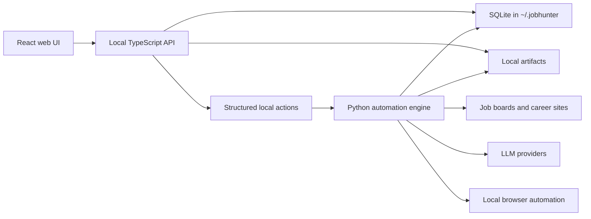

# Architecture

This document is the canonical architecture reference for JobHunter. Detailed
proposal and delivery history lives under `docs/plans/`.

## System Shape

JobHunter is a local-first job-search automation system. The product surface is
a local web UI and API; the automation engine remains Python because the
existing discovery, enrichment, scoring, tailoring, PDF generation, and apply
flows are already implemented there. The supported runtime shape has three
components: local TypeScript API, local TypeScript UI, and Python automation
engine.



## Runtime Boundaries

### Frontend

The React frontend under `apps/web` owns user interaction:

- dashboard summary
- jobs list and job detail
- artifacts list
- profile/style editor shell
- filtering, sorting, pagination, and drawer state
- UI action buttons

The frontend uses `@jobhunter/contracts` as its typed API client and schema
boundary. It should not know shell command syntax.

### TypeScript Product API

The local TypeScript API under `services/api` owns typed JSON read models and
local product endpoints. It is intentionally bound to loopback by default
because it exposes local job, profile, and artifact metadata.

Current responsibilities:

- health endpoint
- dashboard summary endpoint
- jobs list/detail endpoints
- artifacts list/detail endpoints
- artifact open endpoint with known-path validation
- profile/settings read and write endpoints
- resume PDF import draft endpoint
- structured job action endpoints for retry, material generation, dry-run apply,
  cancel, mark-applied, and mark-skipped
- pagination, filtering, and global sorting

Near-term responsibilities:

- event stream or explicit refresh contract

### Python Automation Engine

Python owns automation execution:

- discovery
- job detail enrichment
- scoring
- resume tailoring
- cover letters
- PDF generation
- profile import from resume PDF
- apply automation

Workers should be invoked through structured local actions and should update
stage state, events, and artifacts through shared helpers.

### SQLite And Files

SQLite in `~/.jobhunter/jobhunter.db` is the local source of truth for jobs,
stage states, events, artifacts, settings, and run visibility.

Generated resumes, cover letters, PDFs, logs, templates, and imported PDFs stay
on the local filesystem. Known files should be represented by artifact metadata
before the UI can open them.

## Core Data Flow

1. Discovery creates or updates jobs.
2. Stage rows are created for the canonical pipeline.
3. Each worker action updates `job_stage_states`.
4. Workers record events in `job_events`.
5. Workers register generated files in `job_artifacts`.
6. The UI reads summaries, lists, details, and artifact metadata from the API.
7. UI actions enqueue structured local actions instead of shelling out.
8. Action status and events flow back to the UI.

## Local Commands

Python CLI:

```bash
uv run jobhunter doctor
uv run jobhunter run
uv run jobhunter action score --limit 5
```

TypeScript API and web UI:

```bash
npm run api:dev
npm run web:dev
```

Verification:

```bash
npm test
uv run --extra dev pytest -q
uv run --extra dev ruff check .
git diff --check
```

## Plan History

- `docs/plans/implemented/2026-05-01-ts-product-api-python-workers-architecture.md`
- `docs/plans/implemented/2026-05-02-local-ts-api.md`
- `docs/plans/implemented/2026-05-03-local-reliability-qa.md`
