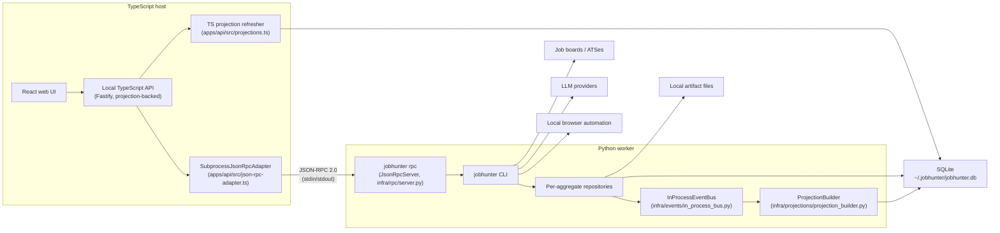
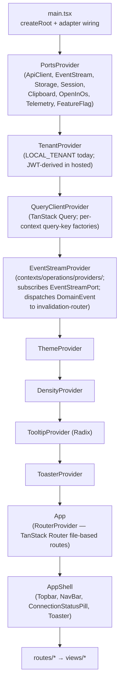
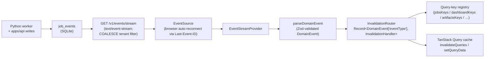

# Architecture

This document is the canonical architecture reference for JobHunter. The domain
model that this implementation realises is defined in
[`docs/ddd-target.md`](ddd-target.md). Project history lives under `docs/plans/`
and `docs/delivered.md`.

For a stage-by-stage execution view of the job pipeline, including sequence
diagrams, component diagrams, call paths, persistence, events, and failure
behavior, see [`docs/job-pipeline-architecture.md`](job-pipeline-architecture.md).

## System Shape

JobHunter is a local-first job-search automation system. The product surface is
a local web UI and API; the automation engine remains Python because the
existing discovery, enrichment, scoring, tailoring, PDF generation, and apply
flows live there. The supported runtime shape has three components: local
TypeScript API, local TypeScript UI, and Python automation worker.

The codebase is organised around the **eight bounded contexts** defined in
`docs/ddd-target.md` §3:

| Bounded context             | Aggregate root                | Where it lives                                                    |
|-----------------------------|-------------------------------|-------------------------------------------------------------------|
| Job Discovery               | `Job`                         | `workers/automation/src/jobhunter/domain/discovery/`              |
| Job Enrichment              | `JobEnrichment`               | `workers/automation/src/jobhunter/domain/enrichment/`             |
| Candidate Profile           | `Profile`                     | `workers/automation/src/jobhunter/domain/profile/`                |
| Scoring                     | `JobScore`                    | `workers/automation/src/jobhunter/domain/scoring/`                |
| Materials Generation        | `MaterialsSet`                | `workers/automation/src/jobhunter/domain/materials/`              |
| Apply Automation            | `ApplyRun`                    | `workers/automation/src/jobhunter/domain/apply/`                  |
| Pipeline Orchestration      | `JobPipelineState`            | `workers/automation/src/jobhunter/domain/pipeline/`               |
| Operations / Read-Side      | _(no aggregate — projections)_| `workers/automation/src/jobhunter/domain/operations/`             |

Repository ownership mirrors the runtime boundaries:

- `apps/web`: runnable React/Vite frontend.
- `apps/api`: runnable local Fastify API.
- `packages/contracts`: shared schemas, DTOs, enums, and JSON-RPC envelopes.
- `packages/domain-types`: pure TypeScript mirror of the Python domain model.
- `packages/api-client`: typed transport client used by the frontend and tests.
- `workers/automation`: uv-managed Python automation worker and CLI package.
- `packages/tsconfig`: shared TypeScript compiler presets.



## Bounded Context Composition

Each context exposes its **driving ports** (use cases) and depends on **driven
ports** (capabilities) for I/O. The local-mode adapters satisfy each driven
port via SQLite, the local filesystem, the local Chrome / Playwright stack, and
the local LLM clients. The hosted-mode adapters (Postgres, S3, SQS, Browserbase,
Temporal) are named in `docs/ddd-target.md` §5 but not implemented yet — they
are the next-evolution seam, not a parallel codepath today.

Cross-context integration uses the **`InProcessEventBus`** for domain events and
the **`SubprocessJsonRpcAdapter`** for the TS↔Python integration protocol
(§6.5 of `docs/ddd-target.md`).

Discovery preparation is a cross-context workflow, not a merged aggregate.
Discovery owns source and enrichment facts, then durable
`preparation_work_items` dispatch `score_job`, `tailor_resume`, and
`suppress_tailored_artifacts` to the Scoring and Materials contexts. The user
sees one preparation stage (`Discover`), while policy versions, score rows,
materials rows, and suppression state stay owned by their bounded contexts.
Operations list projections keep that product contract by exposing only
`discover` or `apply`; internal stage rows remain available in detail and
diagnostic surfaces.

The **enrichment quality gate** keeps low-confidence descriptions out of the
expensive, employer-facing steps without hiding the jobs. Each successful detail
capture records a `PostingContentSnapshot` whose `confidence` and
`quarantine_reason` are promoted onto `posting_snapshot_sets.latest_confidence` /
`latest_quarantine_reason`. A posting whose latest snapshot was quarantined as a
LOW-confidence extraction is excluded from the tailoring, cover-letter, and apply
prep selectors (`get_jobs_by_stage`, the pipeline runner's pending counters, and
the apply launcher), but stays scoreable (cheap triage) and visible with its
confidence/quarantine surfaced on the job read model and the
`PostingContentSnapshotCaptured` audit entry. A snapshot missing only its apply
URL keeps `latest_confidence` above LOW and is not gated, and an
operator-overridden LOW snapshot carries reason `none` and also passes — a
recoverable missing field never starves tailoring, and a quarantined job never
vanishes from the funnel.

## Retrieval Before Scoring

The Scoring context owns a local hybrid retrieval service under
`workers/automation/src/jobhunter/domain/scoring/retrieval.py`. It builds an
in-memory lexical index over normalized posting fields already produced by
Discovery, including Discovery's internal detail-enrichment queue drain, then
ranks candidate jobs before the scorer spends LLM calls. When
`jobhunter run score --limit N` or equivalent pipeline calls cap scoring, the
runner fetches a broader pending/enriched pool and lets hybrid retrieval choose
the top N.

Semantic search is optional. The `EmbeddingIndexPort` in
`workers/automation/src/jobhunter/domain/ports/retrieval.py` is the adapter seam
for a hosted or local embedding index; local mode defaults to
`DisabledEmbeddingIndex`, so lexical retrieval and scoring continue to work
without any external embedding service.

## Scoring Fit Assessment

The Scoring context keeps `FitScore` as a 1..10 applicant-side triage signal,
but each persisted `job_scores` row also stores the criteria snapshot and trace
used to produce it. `criteria_json` records the saved score criteria, target
criteria, minimum score, and structured profile preference fields used for the
prompt. `trace_json` records non-sensitive audit metadata: prompt/schema
versions, model name, criteria version, profile snapshot version, parser
warnings, and correction history.

The score breakdown separates soft fit from hard eligibility. `fit_band`,
`confidence`, matched/missing/transferable signals, warnings, and hard blockers
are exposed through the local API and jobs drawer. User corrections create a new
score version, preserve the correction rationale, publish `ScoreCorrected`, and
can be read back as transparent feedback signals alongside existing job actions.
They also create a non-sensitive correction signal that is persisted as a
calibration anchor on the next `scoring_policies` version. The current policy
keeps rubric weights and fit-band thresholds stable; subsequent scores load the
latest policy version and include the active anchor IDs in `trace_json`.

This is not an employer-side candidate selection system. If JobHunter is ever
used to rank people for hiring decisions, the architecture needs a separate
governance layer for validation, bias audits, notices, adverse-impact review,
and human-review procedures before production use.

## Canonical Employer Analysis (Materials sub-step)

The Materials context owns a persisted, inspectable "ideal candidate" analysis
that is the source of truth for tailoring keyword selection. It is produced by a
**three-SDK agent ensemble** — Claude Agent SDK + Codex SDK + Google Antigravity
(Gemini) SDK — running in parallel and reconciled by a Claude synthesizer pass.
The ensemble orchestrator is N-leg and partial-failure safe
(`asyncio.gather(return_exceptions=True)`), so one SDK failure records a degraded
per-leg failure instead of cancelling the healthy legs. Employer analysis runs
through the analysis draft/synthesizer ports, not the generic LLM client.

- **Domain model** (`domain/materials/analysis.py`): `JobAnalysis` /
  `JobAnalysisDraft` (Pydantic) carry role framing, inferred seniority, an
  ideal-candidate narrative, requirements classified `must_have` vs
  `nice_to_have` with a 0–1 priority weight, and reasoned keywords each tied to a
  quoted job-description evidence span and linked to the requirement they
  support (orphans allowed but flagged). The `EmployerAnalysis` aggregate is
  generation-versioned (mirroring `MaterialsSet`) and retains the reconciled
  canonical record plus every per-model sub-analysis, the per-leg failures, and
  the cross-model agreement signal.
- **Grounding gate** (`domain/materials/analysis_grounding.py`): a deterministic
  **normalized substring + snap-to-source** validator (formatting-tolerant,
  content-exact). It locates each evidence span in the posting snapshot after
  folding formatting-insignificant variation (whitespace runs, Unicode
  hyphen/dash variants, smart quotes, case), then **snaps** the stored span to
  the JD's verbatim text at the match so persisted evidence is always
  copy-paste-findable. The match must align to whole-token boundaries (its outer
  edges border a non-alphanumeric or the string edge), so a short span cannot
  ground INSIDE a larger word (a fabricated `"Go"` against `"goals"`). A span
  whose WORDS are absent from the snapshot (a paraphrase, synonym, or
  hallucination) is still rejected — the cardinal correctness gate, run on every
  draft and on the synthesized canonical before persistence. JSON Schema cannot
  express this, so it is a separate hard check.
- **Ports + adapters** (`domain/ports/materials.py`,
  `infrastructure/analysis/`): the use case depends on `AnalysisDraftPort` /
  `AnalysisSynthesizerPort`, never on a concrete SDK. The ensemble runs the legs
  with `asyncio.gather(..., return_exceptions=True)` so one SDK failure never
  cancels the healthy legs; partial failures are persisted as degraded-ensemble
  audit data and the analysis records its `legs_succeeded / legs_attempted`
  completeness. A hard error surfaces only when *all* legs fail. There is **no
  wall-clock timeout** on the analysis path — the only stop is cooperative
  cancellation.
- **Reproducibility** is a cache contract, not determinism: the analysis is
  keyed on `snapshot_hash + prompt-version + SDK-set-version`. Re-tailoring the
  same posting reuses the cached canonical record instead of re-reasoning; an
  explicit `force` recompute supersedes (never destroys) the prior generation.
- **Lifecycle**: `AnalyzeJobUseCase` runs as the `_run_analyze` front-half
  sub-step of tailor (`TailorResumeUseCase` consumes the persisted analysis), and
  is also reachable standalone through the `analyze_job` JSON-RPC method.
  Persistence is canonical rows (`job_employer_analysis` + per-model
  sub-analysis and failure child tables), never `metadata_json`. The use case
  publishes `EmployerAnalyzed`, which lands a `job_events` row so the projection
  rebuilds and the SSE invalidation router refreshes the job detail.
- **Read path**: a single projection owner serves the analysis on the job-detail
  read model (`job_detail_projections.employer_analysis_json`), built identically
  by the Python projection builder and `apps/api/src/projections.ts` and served
  by `read-model.ts` as `JobDetail.employerAnalysis`. A cross-runtime projection
  parity test covers the table on both runtimes.
- **Requirement fit read path**: requirement-led scoring persists canonical
  `job_requirement_fit_reports` and ordered `job_requirement_fit_items` rows.
  The Operations projection publishes the latest report to
  `job_detail_projections.requirement_fit_report_json` and the API serves it as
  `JobDetail.requirementFitReport`. Compatibility score fields remain available
  for queue selectors and read models that need the compact score shape.

## Per-Bullet Provenance + Granular Controls (Materials sub-step)

Building on the persisted employer analysis, every generated resume bullet (and
the executive-profile / skills lines) carries a canonical provenance record so
the user can trust each line — what real profile fact it derives from, which job
requirement it serves, the transform that produced it, and the granular rule that
governed it. Like the analysis, this is canonical rows, not `metadata_json`.

- **Domain model** (`domain/materials/provenance.py`): `BulletProvenance` is one
  record per rendered line — `bullet_id` (stable within job/generation/section/
  index), `section`, `source_id`, `evidence_ids` (canonical profile evidence),
  `requirement_ids` (FK into `EmployerAnalysis` requirements), `matched_keywords`
  (verified against the generated text), `transform_type`, `control`, a human
  `rationale`, and `generated_text` (the rendered line — the coverage anchor).
  `BulletProvenanceSet` is generation-versioned and bound to the artifact it
  explains; a forced/failed re-tailor writes a higher generation and never
  destroys the prior one. `transform_type` and `control` are closed enums in
  `value_objects.py`: `TransformType` (verbatim / rephrase / reframe /
  synthesize_from_related / quantify_from_evidence) and `ControlRule` (rephrase
  always allowed; invent only for closely-related experience; never fabricate
  metrics/titles/dates/employers).
- **Provenance builder** (`domain/materials/provenance_builder.py`): computes one
  `BulletProvenance` per bullet **against the selected candidate's rendered text**
  (using the same `resume_profile` rendering helpers the assembler uses, so the
  text is identical), maps the existing change-type vocabulary to the closed
  `TransformType`, and binds `requirement_ids` as real foreign keys by matching
  the bullet against the analysis keywords. A fabricated evidence/requirement id
  is rejected before any row is built — provenance is FK bindings, not
  model-authored free text.
- **Deterministic never-fabricate detector** (`domain/materials/fabrication_detector.py`):
  a pure check that runs **independently of the prompt**. Every numeric, date,
  percentage, money, title, and company-suffixed employer token in a generated
  bullet must trace to recorded profile evidence; a token that does not is a
  fabrication and is **hard-rejected at generation time**. A metrics-hungry job
  paired with a numberless profile yields zero unsourced numerics in the output.
- **Deterministic prose skill/tool gate** (same module, sibling of the numeric
  detector): the numeric/date/title/employer arms have no concept of a skill or
  tool, so a fabricated in-demand technology (Kubernetes, Terraform, Kafka, …)
  woven into an experience bullet or the executive summary would ship on the LLM
  judge alone. `scan_prose_skill_fabrications` closes that leak with an
  **allowlist, not a denylist**, scoped to invented **named technologies** so it
  never punishes concept keywords. It flags a job-TARGET keyword (from the
  persisted `EmployerAnalysis` keywords) that is BOTH (1) a recognised named
  technology in the curated `KNOWN_TECHNOLOGY_LEXICON` (languages/frameworks/cloud/
  databases/tools) AND (2) grounds in NEITHER the candidate's profile-backed skill
  vocabulary (`build_skill_vocabulary` = skill-category items + evidence tools +
  evidence tags) NOR the evidence corpus. Grounding is **word-form tolerant**
  (`scaled`/`scalable`/`scalability` mutually ground), so a concept keyword the
  candidate demonstrated in a different word form is never a false positive; a
  pure concept/qualification keyword (scalability, observability, microservices)
  is never gated at all. A fabricated `Kubernetes` still has no stem variant in a
  k8s-free profile, so it is still caught. Tools whose name is a homograph of a
  common word (`HOMOGRAPH_TECHNOLOGY_TERMS` = react, spark, rust, …) are the
  exception and require **exact** grounding, so a fabricated React cannot borrow
  the verb `reacted`. Matching is word-boundary anchored, so ordinary English
  words never false-fire; the skills SECTION is out of scope (it is governed by
  the skills-section allowlist). A hit is **hard-rejected exactly like an invented
  metric** (`NEVER_FABRICATE_SKILLS`).
- **Lifecycle**: the gates (provenance FK bindings + never-fabricate numeric +
  prose skill/tool) run at **two points**. First, **per candidate inside
  `TailorResumeUseCase._run_attempts`**: a candidate that clears the LLM judge but
  trips a gate is stamped `failed_fabrication_gate`, dropped from selection, and
  its per-token findings are rendered as `avoid_notes` fed into the next attempt —
  the same retry channel the judge/adversarial rejections use — so the remaining
  retry budget is spent steering the generator off the exact fabricated token
  instead of failing the run outright. Second, **after the selected candidate is
  voiced** the same gate re-confirms against the rendered text (see the voice
  re-validation below). When the retry budget is exhausted with no clean candidate
  the tailor **fails closed**: validation is downgraded so the resume is **not
  approved** (the last accepted generation's artifact + provenance are preserved)
  and each rejected candidate's gate findings stay as repair-loop audit history.
  An accepted generation persists its rows through `BulletProvenanceRepository`
  transactionally with the artifact and publishes `BulletProvenanceRecorded` (a
  `job_events` row → projection rebuild → SSE invalidation). Persistence is
  canonical rows (`job_bullet_provenance`), never `metadata_json`.
- **Read path**: the single projection owner serves provenance on the artifact's
  tailoring explanation (`artifact_list_projections.bullet_provenance_json`),
  built identically by the Python projection builder and
  `apps/api/src/projections.ts` and served by `read-model.ts` as
  `ArtifactTailoringExplanation.bulletProvenance` (a PDF artifact resolves it from
  the sibling tailored-resume row). A cross-runtime projection parity test covers
  the table on both runtimes.
- **Cover-letter truthfulness gate** (`scan_cover_letter`, same module): the cover
  letter ships to the employer as a first-person claims document, so before it is
  accepted `GenerateCoverLetterUseCase` runs the SAME deterministic guards over the
  generated body — the never-fabricate detector (metrics/dates/titles/employers)
  plus the prose skill/tool gate (`build_skill_vocabulary` + the persisted
  `EmployerAnalysis` keywords as targets), so it inherits that gate's
  named-technology scope and word-form-tolerant grounding — a fabricated
  `Kubernetes` is rejected while JD concept keywords (scalability, reliability,
  observability) woven into a grounded letter are not. Two cover-letter allowances
  keep it precise, since a letter legitimately names the job it targets: the mandatory
  `Dear …` salutation is excluded from the scan (its addressee title is not a
  claim), the target role's title tokens ground the title arm, and an employer
  mention containing the target company is not a fabricated employer. The
  numeric/date arms stay strict (job-post text is never folded into the evidence
  corpus). A detected fabrication downgrades validation so the letter is
  **REJECTED, never shipped as approved** (the aggregate stays `resume_approved`,
  not `cover_letter_ready`), and the retry loop is told exactly what to drop. The
  generator runs at temperature 0.4 (lowered from 0.7). Every accepted or rejected
  letter carries a minimal truthfulness trail (`fabrication_audit`: the controls
  run, the target-keyword count, and each finding) on its artifact `metadata_json`,
  so a rejected letter's failure survives as inspectable audit history.

## Voice Pass + Final Audit Against Rendered Text (Materials sub-step)

An explicit voice pass runs **after** the selected candidate is chosen and
**before** the final audit, so the audited text — provenance and keyword coverage
— equals the rendered/PDF text both renderers consume. Grounding is the floor:
the voice pass rewords, it never invents, and the deterministic gates are re-run
against the voiced text.

- **Voice transform** (`VoicePort` + `infrastructure/materials/voice_adapter.py`):
  an AI transform implemented via the **Claude Agent SDK** with native
  structured output. It de-buzzwords and varies bullet structure on the selected
  candidate's prose (executive profile + experience bullets only; skill term
  lists are left untouched). The SDK boundary is mocked in tests.
- **Deterministic voice proxies** (`domain/materials/voice_metrics.py`): the
  measurable gate for adopting voice edits. Buzzword density uses a focused
  lexicon built from `BANNED_WORDS` plus the quality evaluator's stock-phrase
  markers; structural variety uses opening-token diversity and bullet-length
  variance. The voiced payload is adopted only when it **measurably reduces
  buzzword density OR raises structural variety** vs the input; a no-op or a
  regression keeps the pre-voice candidate.
- **Re-validation after voice**: `TailorResumeUseCase` re-runs the
  provenance builder + the deterministic never-fabricate detector against the
  voiced text. A voice edit that introduces an unsourced numeric/date/title/
  employer is **hard-rejected exactly like a generator fabrication**: the voiced
  payload is discarded, the clean pre-voice candidate ships, and the failed voice
  stays as audit history. A reworded bullet is recorded with `transform_type =
  voice` (the outermost transform) so the shipped wording is inspectable, not a
  hidden prompt tweak.
- **Final coverage audit** (`domain/materials/coverage_audit.py`):
  keyword coverage is computed at generation time against the actual rendered
  (voiced) bullet text — never inferred from the job description — and partitions the
  analysis keywords into three honestly-labeled buckets: **covered** (demonstrated),
  **declared** (rendered from the profile's canonical skills declaration but not
  demonstrated), and **missing** (rendered nowhere the employer reads). A keyword
  counts as **covered** only when it appears in a bullet backed by real profile
  evidence: the bullet carries a canonical evidence FK (`evidence_ids`), or the
  keyword itself traces (word-boundary) to the profile evidence corpus. A requirement
  FK does **not** credit coverage — the provenance builder binds a requirement
  whenever one of its keywords appears in the line, so counting that binding would let
  a keyword ground itself (circular), rewarding the stuffing the guard exists to
  catch. A keyword whose only home is a skills-section line that no evidence
  demonstrates is **declared**, not `missing` — reporting a shipped skill as absent
  would be the same lying audit surface in the other direction. Its profile grounding
  is not "by construction" (the skills line renders the LLM's reordered
  `tailored_skill_items`, not raw `skill_categories`): surfaced coverage is read only
  from the persisted `coverage_audit_json`, which is recorded only for an **approved**
  resume, and approval requires validation whose "Fabricated skill" check rejects any
  skills item outside the profile's declared category (the prose fabrication gate
  likewise treats declared skills as backed). `coverage_ratio` stays covered/planned
  (demonstrated ratio) and is never inflated by `declared`. Substring false positives
  do not count. The read model carries `covered`/`declared`/`missing` with
  `covered_by`/`declared_by` per-keyword bullet maps so all three are inspectable.
- **Final canonical text** is the single voiced payload: `TailorResumeUseCase`
  assembles the plain-text resume from it, the provenance rows anchor to it, and
  the active resume PDF renderer consumes `TailorOutcome.final_payload`. The
  default renderer is `HtmlResumePdfAdapter` (HTML/CSS + Playwright);
  `LatexPdfAdapter` remains available only through explicit local configuration.
  A round-trip fixture asserts the audited bullet text equals the rendered text.
- **Persistence + read path**: the generation-time coverage and the voice-pass
  audit ride on the `BulletProvenanceSet` (denormalised onto the
  `job_bullet_provenance` rows as `coverage_json` / `voice_json`). The single
  projection owner serves them on the artifact's tailoring explanation
  (`artifact_list_projections.coverage_audit_json` / `voice_pass_json`), built
  identically by the Python builder and `apps/api/src/projections.ts` and served by
  `read-model.ts` as `ArtifactTailoringExplanation.coverageAudit` /
  `.voicePass` (a PDF resolves them from the sibling tailored-resume row). A
  cross-runtime parity test covers both.

## Tailoring Explanation Read Model

The read model serves tailoring audit data from canonical projection rows.

- **Artifact explanation shape.** Each artifact's tailoring explanation is parsed
  from its own `metadata_json` projection column for non-coverage audit fields.
  Per-bullet provenance, coverage, and voice come from canonical projection
  columns. A PDF resolves those canonical audit fields from the sibling
  tailored-resume projection row because the PDF is a render of that same
  artifact.
- **Keyword summary.** The `keywords` summary block (`planned` / `covered` /
  `missing` + counts) is derived from the canonical coverage audit
  (`coverage_audit_json`, computed at generation time against the rendered voiced
  text). When a generation recorded no coverage the block is empty with
  `coverageRecorded: false`; coverage is never inferred from the job description
  at read time.
- **Cross-runtime drift guard.** The Python builder test
  (`workers/automation/tests/test_audit_projection_parity.py`) and the TypeScript
  builder test (`apps/api/test/audit-projection-parity.test.ts`) both seed the
  canonical rows (scores, stage states, employer analysis, bullet provenance,
  materials artifacts) from the shared fixture
  `packages/domain-types/test/fixtures/audit_projection_parity.json`. Each runtime
  runs its own projection builder and asserts, key-for-key, both the audit read
  shapes (employer analysis + provenance/coverage/voice) AND the full dual-written
  column set for `job_list_projections`, `job_detail_projections`, and
  `dashboard_projections` (stage/score/compensation/apply/dashboard columns; the
  `*_json` columns are compared parsed, and the wall-clock `last_updated_at` /
  `generated_at` columns are asserted present but excluded from value comparison).
  A column-set guard makes each runtime's emitted columns equal the fixture's
  expected keys plus those wall-clock columns, so a one-sided column addition in
  either builder fails against the shared fixture — the drift class that let the
  Python builder ship without the score criteria/trace/correction audit columns.

## Apply Review And Outcome Feedback

The Apply Automation context has a local feedback foundation in the TypeScript
API. `apps/api/src/application-feedback.ts` owns idempotent SQLite table
creation and read/write helpers for:

- `application_review_decisions`: append-only user decisions for apply review.
- `application_outcomes`: reviewed manual or suggestion-derived outcomes.
- `application_email_evidence`: linked Gmail evidence, including body storage
  and body hash columns for confidently linked messages.
- `application_outcome_suggestions`: pending and decided classifier
  suggestions.

Apply-review approval is modeled as a recorded decision, not as an automatic
worker dispatch. Manual outcome notes are stored only in the local outcome
table.

Apply Review resume edits are modeled as a local feedback/draft layer in the
TypeScript API, not as direct writes to the Materials aggregate. The generated
HTML/CSS resume is loaded into a Plate editor; saved revisions, line edit
deltas, JobHunter comment threads, user replies, and feedback signals are
persisted in `resume_review_*` / `tailoring_feedback_signals` tables. A render
promotion validates the saved draft, creates a new `job_materials` generation
with replacement `tailored_resume` and `resume_pdf` artifacts plus layout boxes,
then marks unresolved comments as residual after acceptance. Existing approved
artifacts remain visible until that replacement generation is written, so failed
validation or render attempts do not destroy reviewable materials.

Gmail outcome feedback is implemented in
`workers/automation/src/jobhunter/infrastructure/gmail/feedback.py`, separate
from the verification-only Gmail MCP server. The scanner reuses the readonly
Gmail OAuth/client support but searches only bounded post-application windows
for known SQLite application anchors. Candidate queries combine the recipient
email with employer/ATS hints, job title/company terms, application URL/domain
tokens, and application timing. The worker reads a full Gmail body only after
metadata reaches the link-confidence threshold, then stores body text,
`body_sha256`, `linked_at`, confidence, safe link signals, and a unique provider
message ID in `application_email_evidence`. Deterministic v1 classification
writes pending `application_outcome_suggestions` for confirmations, recruiter
replies, interviews, assessments, rejections, offers, bounces, and unknowns.

`job_events.payload_json` receives safe summaries with identifiers, kinds,
sources, timestamps, confidence values, link signals, and presence flags; raw
notes and raw email bodies are not copied into domain events, projections,
logs, telemetry, or Gmail scan API responses.

## Read-Model Projections

The Operations / Read-Side context maintains denormalised projection
tables that back every read-model endpoint:

| Table                        | What it stores                                                    |
|------------------------------|-------------------------------------------------------------------|
| `job_list_projections`       | One row per job — title, employer, current stage/state, fit score, materials presence, apply status. |
| `dashboard_projections`      | Singleton aggregates: counts, funnel per stage, source breakdown, score distribution, and the outcome-conversion funnel (`outcome_conversion_json`: applied/reply/interview/offer/rejection counts by source and score band, from `application_outcomes`). |
| `job_detail_projections`     | Per-job description preview, score reasoning, full stages array, and curated audit history assembled from job events plus append-only apply feedback records. |
| `artifact_list_projections`  | All generated artifacts (resume txt/pdf, cover txt/pdf) with provenance. |
| `apply_run_projections`      | Apply-run telemetry with denormalised job context and event timeline. |
| `discovery_run_projections`  | Scheduled discovery-run status, source ids, counts, and retry metadata. |
| `source_quality_stats`       | Rolling per-source health rates used by the dashboard and discovery scheduler. |
| `operational_attempt_metrics` | Append-only stage/source/apply attempt facts with outcome, source role, failure class, retryability, scrape/operational flags, counts, and durations. |

The Python `ProjectionBuilder` (driven by `InProcessEventBus`) and the TS
`refreshProjections` helper both read new rows from `job_events` since the
shared `event_watermarks.operations_projections` watermark, recompute
projections from canonical aggregate state, and advance the watermark in the
same transaction. Both processes write to the same tables; SQLite handles the
concurrent advances. Request paths read precomputed projections instead of
assembling stage state with per-request joins.

The outcome-conversion projection materialises integer funnel counts only (both
builders must agree — the cross-runtime parity fixture asserts the
`outcome_conversion_json` column). The dashboard read model derives the
conversion rates (reply/interview/offer/rejection over applied) from those
counts so there is no cross-runtime float drift; `costPerInterview` stays `null`
until per-run apply cost is projected. This surface is read-only — it never
feeds scoring, ranking, thresholds, or apply eligibility.

Job detail audit history is assembled at read time from allow-listed lifecycle
events and append-only apply review/outcome records. It is a user-facing audit
timeline, not a debug log: raw event payloads, debug messages, local paths, raw
outcome notes, and email body text stay out of the response.
Posted-compensation facts are persisted in `job_posted_compensation_facts`
before inspection. They are exposed through both the narrow read-only
inspection API and projection-backed job list/detail compensation summaries.
Company-role market compensation estimates are persisted in
`job_market_compensation_estimates` before inspection. Estimates are
deterministic local facts derived from configured reported compensation feeds for
Euro Top Tech, Levels.fyi, Glassdoor, or manual imports, or from employer-posted
salary facts already captured by JobHunter.
Euro Top Tech rows are treated as public community-reported EUR/year total
compensation observations; Levels.fyi and Glassdoor rows are loaded only when a
permitted source-policy mode and feed path or URL are configured.
Employer-posted market rows are labeled as job posting salary text and remain
low confidence when they are based on a single posting or extrapolated fallback
tier. These rows store explicit estimate
states, normalized company and role, match scope, trimodal company tier,
confidence factors, confidence interval bounds, safe source snapshots, warnings,
and reasons. They do not store raw benchmark pages, provider payloads,
credentials, local paths, private account state, user compensation preferences,
or U.S. salary baselines.
Compensation writes emit `CompensationFactsUpdated` rows into `job_events`.
Those payloads carry only job id, changed section, state markers, and timestamp;
the Operations/SSE invalidation path refreshes job list/detail queries from the
projection tables.

## Runtime Boundaries

### Frontend

The React frontend under `apps/web` owns user interaction:

- dashboard summary
- jobs list and job detail
- artifacts list
- profile/style editor shell
- filtering, sorting, pagination, and drawer state
- UI action buttons

The frontend uses `@jobhunter/api-client` for API transport and
`@jobhunter/contracts` for shared schemas and DTOs. It should not know shell
command syntax.

The frontend follows its own DDD + hexagonal target documented in
[`docs/frontend-target.md`](frontend-target.md) — three-layer state separation,
eight bounded contexts that mirror the backend 1:1, view-vs-context dichotomy,
hexagonal frontend ports, SSE realtime via the invalidation router, and a
projection-typed Operations read-side. The summary below cross-links to the
target sections; the target doc is the canonical detail.

#### Stack

| Concern | Choice | Target ref |
|---|---|---|
| Bundler / dev server | Vite (SPA today; TanStack Start named-not-built for SSR) | §4.1, §9.1 |
| UI library | React 19 | §4.7 |
| Styling | Tailwind CSS 4 with design tokens in `tokens.css`; `darkMode: ["selector", "[data-theme='dark']"]` | §4.8 |
| Component primitives | shadcn/ui (Radix-based, copied + owned in `shared/ui/`) | §4.7 |
| Router | TanStack Router (file-based via `@tanstack/router-vite-plugin`) with route-level Zod search-param schemas | §4.3 |
| Server state | TanStack Query v5 with per-context query-key factories, `tenant`-first keys, central registry in `contexts/operations/queryKeys.ts` | §4.1, §4.4.1 |
| Tables | TanStack Table v8; column models live with the consuming view; cell renderers are imported from contexts | §3.10, §11 |
| Forms | TanStack Form + Zod `safeParse` | §4.6 |
| Client state | Zustand (`shared/stores/`) — UI prefs, toast queue, command palette, profile-import wizard draft (`persist` middleware where durability matters) | §4.9, §4.10 |
| Test runner | Vitest + React Testing Library + MSW for unit / hook / component | §10.2, §10.3 |
| End-to-end | Playwright against a seeded local API + SQLite fixture | §10.4 |
| Component-driven dev | Storybook with `addon-msw` and `addon-a11y` (critical+serious axe violations fail CI) | §10.5, §10.7 |
| Type-level tests | Vitest `typecheck` mode via `vitest.types.config.ts`; `*.test-d.ts` files live under `apps/web/test/types/`; invoked as `pnpm --filter @jobhunter/web test-d` | §10.6 |

#### Three Layers of State

Every piece of state lives in exactly one layer (`docs/frontend-target.md` §2.1):

| Layer | Owner | What lives here |
|---|---|---|
| Server state | TanStack Query cache | API-derived projections, profile, settings, dashboard summary — anything fetched from `apps/api`. |
| URL state | TanStack Router (typed search params via Zod) | Anything bookmarkable: view, filters, sort, page, page size, selected job, drawer open/close. |
| Client state | Zustand (with `persist` where appropriate) + React context | Theme, density, tenant context, transient UI like toast queue, ephemeral form drafts that do not survive navigation. |

No server data in `useState`; no filter / pagination / sort / drawer state in
`useState`; no durable user preferences in component-local state; one source of
truth per fact; components consume state through hooks (never raw stores or the
`QueryClient` directly).

#### Frontend Bounded Contexts

`apps/web/src/contexts/<name>/` mirrors the backend's eight bounded contexts
1:1 (`docs/frontend-target.md` §3, §11):

| Frontend folder | Owns | Backend mirror |
|---|---|---|
| `discovery/` | `useDeleteJobMutation`, `useDeleteJobsBulkMutation`, `useRestoreJobMutation`, `useRestoreJobsBulkMutation`, `useHideJobsBulkMutation`, `useUnhideJobsBulkMutation`, `usePermanentlyDeleteJobsBulkMutation`; future `useImportJobMutation`. | Job Discovery |
| `enrichment/` | `JobEnriched` / `EnrichmentFailed` invalidation handlers; future `useEnrichmentRetryMutation`. The enrichment aggregate is internal to Discovery's detail queue drain. | Job Enrichment |
| `profile/` | `useProfileQuery`, `useUpdateProfileMutation`, `useImportResumeMutation`, settings + credentials hooks, profile-import wizard store, profile editor + resume preview components. | Candidate Profile |
| `scoring/` | `<ScoreBadge>`, `<ScoreBreakdown>`; future `useCorrectScoreMutation`. | Scoring |
| `materials/` | `useGenerateMaterialsMutation`, `useOpenArtifactMutation`, generate / open buttons. | Materials Generation |
| `apply/` | `useApplyJobMutation`, `useDryRunApplyMutation`, `useCancelApplyMutation`, `<ApplyButton>`, `<DryRunButton>`, `<ApplyRunBadge>`, `<ApplyRunTimeline>`, `<ApplyHistory>`. | Apply Automation |
| `pipeline/` | `useRunPipelineStagesMutation`, `useRetryStageMutation`, `useCancelStageMutation`, `useMarkAppliedMutation`, `useMarkSkippedMutation`, `<StageTriggerPanel>`, `<StageBadge>`, `<StageTimeline>`, `<JobActions>`. | Pipeline Orchestration |
| `operations/` | All projection-typed read hooks (`useDashboardSummaryQuery`, `useJobsListQuery`, `useJobDetailQuery`, `useArtifactsListQuery`, `useArtifactDetailQuery`, `useApplyRunsListQuery`, `useApplyRunQuery`); query-key registry; SSE subscription; invalidation router. | Operations / Read-Side |

`views/dashboard/`, `views/jobs/`, and `views/artifacts/` are **composers, not
contexts** (`docs/frontend-target.md` §3.10). They import hooks from
`contexts/operations/` and components / mutations from aggregate contexts;
they own layout and view-local ephemeral UI (e.g., bulk-selection sets) and
nothing else. View → context dependency is one-way; views never depend on
other views.

#### Hexagonal Frontend Ports

Components and feature hooks depend only on **ports**; concrete adapters bind
to the ports in `shared/providers/PortsProvider.tsx`
(`docs/frontend-target.md` §6):

| Port | Local-mode adapter | Hosted-mode adapter (named, not built) |
|---|---|---|
| `ApiClientPort` | `FetchApiClientAdapter` (wraps `@jobhunter/api-client`) | Same adapter; baseUrl from env, `Authorization: Bearer <jwt>` injected by hosted `AuthInterceptor`. |
| `EventStreamPort` | `SseEventStreamAdapter` (`new EventSource(...)`) | `WebSocketEventStreamAdapter` if SSE proves limiting. |
| `StoragePort` | `LocalStorageAdapter` | `IndexedDbAdapter` when client-side cache exceeds 5 MB. |
| `SessionPort` | `LocalSessionAdapter` (returns `LOCAL_TENANT`) | `JwtSessionAdapter` (Auth0 / Cognito). |
| `ClipboardPort` | `NavigatorClipboardAdapter` | Same adapter. |
| `OpenInOsPort` | `OpenArtifactAdapter` (POSTs to `/v1/artifacts/:id/open`) | Disabled in hosted mode; UI surfaces a presigned-URL download instead. |
| `TelemetryPort` | `ConsoleTelemetryAdapter` (no-op) | `OpenTelemetryWebAdapter` → OTLP collector. |
| `FeatureFlagPort` | `StaticFeatureFlagAdapter` (always default) | Backend-served via `apiClient.featureFlags()`; cached in Query. |

The "frontend driving ports" (use cases) are the per-context hooks themselves
(`useApplyJobMutation`, `useDeleteJobMutation`, …) — React conventions are the
de-facto driving-port representation; no `UseCase` interface is formalised
(`docs/frontend-target.md` §6.7).

#### Provider Stack

The provider stack as wired in `apps/web/src/main.tsx` (top-down):



`EventStreamProvider` lives in `contexts/operations/providers/` because the
Operations context owns the SSE subscription and the invalidation-router
dispatch (`docs/frontend-target.md` §3.9, §7.3); every other provider lives
in `shared/providers/`.

#### Realtime — SSE → Invalidation Router → Cache



The invalidation router is **the** integration contract between the backend's
`DomainEvent` taxonomy and the frontend cache — a pure function tested in
isolation. Every backend event has a handler; the
`Record<DomainEvent["eventType"], InvalidationHandler>` typing makes a missing
handler a TypeScript compile error, and the
`every-event-has-handler.test.ts` parity test catches obvious empty-stub
implementations (`docs/frontend-target.md` §7.4).

#### Test Pyramid

`docs/frontend-target.md` §10. Vitest + React Testing Library + MSW for unit /
hook / component tests; Playwright for end-to-end critical flows; Storybook
with the a11y addon for component-driven development. Two parity tests guard
the cross-language seams:

- `every-event-has-handler.test.ts` — every `DomainEvent["eventType"]` has a
  registered invalidation handler.
- `every-stage-state-has-badge.test.tsx` — every `STAGE_STATE_KINDS` value
  has a `<StageBadge>` arm.

Detailed coverage and the a11y bar live in
[`docs/local-reliability-qa.md`](local-reliability-qa.md).

### TypeScript Product API

The local TypeScript API under `apps/api` owns typed JSON read models and
local product endpoints. It is intentionally bound to loopback by default
because it exposes local job, profile, and artifact metadata.

Current responsibilities:

- health endpoint
- dashboard summary endpoint
- jobs list/detail endpoints
- artifacts list/detail endpoints
- artifact open endpoint with known-path validation
- profile/settings read and write endpoints
- resume PDF import draft endpoint (via JSON-RPC `profile_import`)
- structured job action endpoints for retry, material generation, dry-run apply,
  cancel, mark-applied, mark-skipped
- current-policy preparation maintenance endpoints for per-job/bulk rescore and
  per-job/bulk re-tailor
- global/batch pipeline stage actions via `POST /v1/pipeline/actions/run-stage`
- pagination, filtering, and global sorting
- read-model projection refresh on every request

Simple state-transition writes (`resetJobStage`, `markJobApplied`,
`markJobSkipped`, `cancelJobAction`, `softDeleteJob`, `restoreJob`) execute
inline in the TS process against shared `@jobhunter/domain-types` value
objects. Complex commands (`apply`, `profile_import`, batched stage runs)
travel through `SubprocessJsonRpcAdapter` to the long-lived
`jobhunter rpc` worker.

### Python Automation Engine

Python owns automation execution:

- discovery
- job detail enrichment
- Discovery preparation work-item drain
- scoring
- resume tailoring
- cover letters
- PDF generation
- profile import from resume PDF
- apply automation

The worker package lives under `workers/automation`. Each bounded context owns
its aggregate, repository (in `infrastructure/<context>/`), and ports (in
`domain/ports/`). The CLI is the human-facing driving adapter; the JSON-RPC
server (`jobhunter rpc`) is the API-facing driving adapter.

### Workflow Orchestration (Local Temporal)

A local Temporal dev server (`temporal server start-dev --db-filename
"$JOBHUNTER_TEMPORAL_DB"`) is the workflow engine for the Python worker. The dev
launcher defaults `JOBHUNTER_TEMPORAL_DB` to `.dev/temporal/temporal.db` so
workflow execution history persists across local restarts. The infrastructure
split lives under `workers/automation/src/jobhunter/infrastructure/temporal/`:

- `client.py` — `get_temporal_client()` connects to `TEMPORAL_ADDRESS`
  (default `localhost:7233`) and `TEMPORAL_NAMESPACE` (default `default`).
- `worker.py` — `build_worker(client, *, workflows, activities)` returns a
  `temporalio.worker.Worker` bound to `JOBHUNTER_TASK_QUEUE`. The worker
  uses a `SandboxedWorkflowRunner` with `with_passthrough_modules("jobhunter")`
  so workflow code can construct activity-input dataclasses at the workflow
  boundary (the sandbox proxy mechanism otherwise refuses to instantiate
  frozen dataclasses imported through `imports_passed_through()`). Activity
  execution is bounded by `JOBHUNTER_MAX_CONCURRENT_ACTIVITIES` (default `4`)
  and a worker-owned `ThreadPoolExecutor(max_workers = concurrency + 2)`, so
  blocking stage work no longer spills into the process default executor.
- `run_in_activity.py` — shared helper for running synchronous domain work from
  async Temporal activities while heartbeating. Cancellation sets a cooperative
  `threading.Event`, waits up to the activity's cancel deadline for the worker
  thread to exit, and records an `abandoned_thread` operational metric if the
  thread ignores cancellation.
- `task_queues.py` — single `JOBHUNTER_TASK_QUEUE = "jobhunter-default"`.
- `registry.py` — single source of truth for `WORKFLOWS` and `ACTIVITIES`.
  The CLI imports both lists and passes them to `build_worker`; new
  workflows / activities are added by appending here.

Each internal pipeline stage (`discover`, `enrich`, `score`, `tailor`,
`cover`, `apply`, `profile_import`) ships as a Temporal **Activity** under the
owning bounded context's package — e.g. `jobhunter/scoring/activities.py`,
`jobhunter/materials/activities.py`. Activities are thin adapters: they defer
heavy imports inside the activity body and forward to the existing stage runner
(`run_pipeline` / `apply_main` / `run_local_action`). The product-facing stage
order is narrower: `discover -> apply`; `discover` drains enrichment plus
internal preparation work before the user chooses to apply.

Pipeline activities translate Python exceptions into typed Temporal
`ApplicationError`s via `domain/errors.py`. Retry policies use the `type` value
as the durable error code:

| Error type | Code | Retryable |
| --- | --- | --- |
| `ConfigurationError` | `configuration` | no |
| `AuthenticationError` | `authentication` | no |
| `MissingInputError` | `missing_input` | no |
| `TransientNetworkError` | `transient_network` | yes |
| `BrowserTransientError` | `browser_transient` | yes |
| `LlmTransientError` | `llm_transient` | yes |
| `SourceUnavailableError` | `source_unavailable` | yes |

`JobPipelineWorkflow` applies stage-specific retry policies:

| Stage | Attempts | Initial interval | Maximum interval | Non-retryable codes |
| --- | --- | --- | --- | --- |
| `discover` | 1 | default | default | `configuration`, `authentication`, `missing_input` |
| `enrich` | 3 | 5s | 60s | `configuration`, `authentication`, `missing_input` |
| `score` | 3 | 5s | 60s | `configuration`, `authentication`, `missing_input` |
| `tailor` | 3 | 10s | 120s | `configuration`, `authentication`, `missing_input` |
| `cover` | 3 | 10s | 120s | `configuration`, `authentication`, `missing_input` |

The runner still records `StageStarted`, `StageCompleted`, `StageFailed`,
operational metrics, and OTel spans through `_run_stage_observed`; the change
is that whole-stage failures propagate into Temporal instead of being converted
to normal `{"status": "error: ..."}` results. Per-item failures inside a batch
remain per-item facts when the owning context already records them that way.

Two production workflows live alongside the activities:

- `JobPipelineWorkflow` (`jobhunter/pipeline/workflow.py`) — drives the
  configured stage list serially in **batch mode** against eligible jobs in
  the local DB. Stage eligibility is owned by the underlying runner via
  `state.set_stage_state`, not by the workflow. Passing `"apply"` keeps the
  request on the same pipeline workflow path; the workflow delegates that stage
  to `ApplyWorkflow` as a child workflow.
- `ApplyWorkflow` (`jobhunter/apply/workflow.py`) — single-activity,
  **per-job** workflow with its own retry policy (`max_attempts=2`) and
  parameter shape. `apply_activity` re-raises transient failures so the
  retry policy fires; `LookupError` is wrapped in a non-retryable
  `ApplicationError` so operator errors fail fast.

The pipeline package (`jobhunter/pipeline/`) is split into `runner.py`
(the existing batch orchestrator that the activities call) and
`workflow.py` (the Temporal workflow). `__init__.py` re-exports
`run_pipeline` so existing imports keep working.

`jobhunter worker` is the long-lived process that runs the worker loop.
Live workflow state — running workflows, history, signals, retries — is
visible at `http://127.0.0.1:8233` in the Temporal Web UI.

#### Loop Closure — Visibility, Finalize, Reconciler

Workflow execution is made durable and visible in the read-model without a
TypeScript Temporal SDK and without trigger-coupled reapers:

- **`Workflow*` event family (6 types)** — `WorkflowStarted`,
  `WorkflowCompleted`, `WorkflowFailed`, `WorkflowCanceled`,
  `WorkflowTimedOut`, `WorkflowTerminated` — mirrored 1:1 across the Python and
  TS event registries and the web invalidation router. Each carries
  `workflowId`, `workflowType`, an input summary, and a terminal status within
  the 12-state `WORKFLOW_RUN_STATUSES` contract.
- **Finalize activities** (`infrastructure/temporal/finalize.py`) —
  `JobPipelineWorkflow` and `ApplyWorkflow` emit a `WorkflowStarted` marker at
  the top of `run` and record exactly one terminal event on exit
  (`WorkflowCompleted` on success, `WorkflowFailed` on a stage/exception
  failure, `WorkflowCanceled` on cooperative cancellation) via
  `record_workflow_started` / `record_workflow_outcome`. Those
  activities reuse `record_job_event` + a projection refresh; workflow bodies
  stay deterministic (all SQLite/clock IO is inside the activities).
- **Describe-based reconciler** — `_reconcile_workflow_runs` runs in the worker
  heartbeat loop (15s). It `describe`s each open `workflow_run_projections` row
  and terminalizes CLOSED executions (mapped to the matching terminal event) or
  NOT_FOUND executions (dev-server history loss → `WorkflowTerminated`), leaving
  RUNNING rows alone. This is what makes a `kill -9`'d, timed-out, or cancelled
  worker's runs terminalize on their own — replacing the trigger-coupled
  reapers. A backstop-closed run carries no app-level error detail, so the
  reconciler stamps its own reason — a `reconciled_*` `errorCode`
  (`reconciled_terminated` / `reconciled_not_found` / `reconciled_closed_<status>`)
  plus a human-readable message quoting the Temporal execution status — so the
  `/runs` UI never shows a reconciler-terminalized run with no explanation.
- **Dispatch-time open row** — the default starter writes a `WorkflowStarted`
  event immediately after a workflow start returns from Temporal. The in-workflow
  start marker remains as a duplicate-safe upsert, but a workflow killed or
  canceled before its first activity is now visible in `/runs` and can be
  terminalized by the reconciler.
- **Deterministic workflow IDs** — `WorkflowStartSpec` carries
  `id_conflict_policy` / `id_reuse_policy`; the default starter passes
  `USE_EXISTING` + `ALLOW_DUPLICATE`, so a double-start of a deterministic id
  returns the running handle instead of duplicating execution. `apply` derives a
  stable `apply-{jobKey}` id for single-job applies; the pipeline orchestrator
  keeps `run-{uuid}`.

The read side is `workflow_run_projections` (Python-sole-writer, folded from the
`Workflow*` events under the shared `operations_projections` watermark, mirrored
read-only in `apps/api/src/projections.ts`) — the unified list source for all
workflow types. See `docs/local-ts-api.md` for the `GET /v1/workflow-runs` and
`GET /v1/workflow-runs/:runId` read model.

### Observability

The Python automation worker exports OpenTelemetry spans over OTLP/HTTP to a
Langfuse instance for LLM tracing. The wiring lives under
`workers/automation/src/jobhunter/infrastructure/observability/`:

- `otel.py` — `init_otel()` configures a global `TracerProvider` with a
  `BatchSpanProcessor` feeding an `OTLPSpanExporter`. Endpoint:
  `${LANGFUSE_BASE_URL}/api/public/otel/v1/traces`. Authentication is HTTP
  Basic with `base64(LANGFUSE_PUBLIC_KEY:LANGFUSE_SECRET_KEY)`. If any of
  `LANGFUSE_PUBLIC_KEY` / `LANGFUSE_SECRET_KEY` / `LANGFUSE_BASE_URL` is
  unset, init logs a warning and the worker continues without exporting.
  `LANGFUSE_DISABLE=1` opts out even when credentials are present.
  `LANGFUSE_OTEL_TIMEOUT_SECONDS` bounds each OTLP export request and defaults
  to `5.0`.
- `llm_spans.py` — `llm_generation_span(...)` context manager that opens a
  `langfuse.observation.type=generation` span around each LLM call. It also
  sets the GenAI semantic-conventions attributes (`gen_ai.request.model`,
  `gen_ai.response.model`, `gen_ai.usage.input_tokens`,
  `gen_ai.usage.output_tokens`) so OTel-native dashboards work too.

These sources emit spans:

| Source | Span name | `langfuse.observation.type` |
| --- | --- | --- |
| Every LLM call (`jobhunter.llm.LLMClient.chat`) | `llm.<model>` | `generation` |
| Each employer-analysis ensemble draft leg (scopes `jobhunter.analysis.claude` / `.codex` / `.antigravity`) | `llm.<model>` | `generation` |
| The employer-analysis synthesizer (scope `jobhunter.analysis.synthesizer`) | `llm.<model>` | `generation` |
| The resume voice pass (scope `jobhunter.materials.voice`) | `llm.<model>` | `generation` |
| Every Temporal workflow + activity (via `temporalio.contrib.opentelemetry.TracingInterceptor`) | workflow / activity name | `span` (default) |
| Every JSON-RPC dispatch (`jobhunter.infrastructure.rpc.server.JsonRpcServer.dispatch`) | `rpc.<method>` | `span` |
| Every pipeline stage (`jobhunter.pipeline.runner`) | `pipeline.stage.<stage>` | `span` |
| Every score use-case call (`ScoreJobUseCase`) | `scoring.score_job` | `span` |
| Discover source steps (`jobspy`, `workday`, `smartextract`) | `pipeline.source.discover.<source>` | `span` |
| Scheduled discovery runs | `discovery.run` | `span` |
| Source-quality projection rebuilds | `operations.source_quality.aggregate` | `span` |

Pipeline stages and Discover source steps also emit short
`langfuse.observation.type=event` observations for their
`StageStarted` / `StageCompleted` / `StageFailed` lifecycle records. The same
lifecycle records are persisted to `job_events`, which makes long-running or
stuck stages visible through SSE/recent activity even before the synchronous
JSON-RPC request returns. The stage runner forwards the caller's `limit` to
every stage. Discovery sources use that limit as a bounded debug crawl cap,
switch to sequential source execution when a cap is present, and skip remaining
sources after the cap is reached.

The employer-analysis ensemble is the first capability on the **agent-SDK**
standard (Claude Agent SDK + Codex SDK + Google Antigravity/Gemini SDK). Those
SDKs consume the existing local session credentials (Claude Code session, reused
Codex login, and `GEMINI_API_KEY`/`GOOGLE_API_KEY` for the Antigravity leg) —
they introduce no new key management. The analysis run is visible through its
persisted `EmployerAnalyzed` `job_events` record and the read-model
`ensemble_completeness` field. Each of the four ensemble legs (the three parallel
drafts + the Claude synthesizer) and the post-selection resume voice pass wrap
their SDK model call in the same `llm_generation_span` the `LLMClient` uses, so
every frontier-model call reports its model, prompt/completion, latency, and —
when the SDK surfaces usage — input/output token counts to Langfuse. Distinct
instrumentation scopes keep the drafts, synthesizer, and voice pass separable
even though they share the `llm.<model>` span name. Because the legs run inside
the enclosing pipeline-stage / JSON-RPC span (OTel context propagates through the
`asyncio.run` + `asyncio.gather` fan-out), Langfuse aggregates their token usage
and cost onto the surrounding analysis trace — the per-analysis cost rollup —
without extra plumbing. Instrumentation never changes control flow: an SDK error
is recorded on the span and re-raised into the existing per-leg
retry/partial-failure path, and missing SDK usage degrades to a span without
token counts rather than fabricating them.

The `TracingInterceptor` is registered both client-side
(`infrastructure/temporal/client.py`) and worker-side
(`infrastructure/temporal/worker.py`) so trace context propagates from the
JSON-RPC handler that starts a workflow into the worker that runs it.

`init_otel()` is called from `jobhunter.cli._bootstrap()`, so every CLI
command (notably `jobhunter worker` and `jobhunter rpc`) configures
exporting on startup. The `worker` command calls `shutdown_otel()` on
exit so the `BatchSpanProcessor` flushes any in-flight spans.

`jobhunter doctor` includes a `Langfuse` row that probes the OTLP endpoint
with a `HEAD` request — `OK reachable`, `MISSING (set
LANGFUSE_PUBLIC_KEY/SECRET_KEY/BASE_URL)`, or `unreachable`.

Out of scope for this layer: TypeScript API / web instrumentation and
distributed-trace propagation across the TS↔Python JSON-RPC boundary
(would need TS to emit OTel context too).

### SQLite And Files

SQLite in `~/.jobhunter/jobhunter.db` is the local source of truth for jobs,
stage states, events, artifacts, normalized Candidate Profile data, profile
rendering settings/template text, run visibility, apply-review decisions,
application outcomes, linked email evidence, and outcome suggestions. The
projection tables (above) are also stored here. Dashboard settings remain
file-backed until their own storage migration.
Posted compensation facts live in the canonical
`job_posted_compensation_facts` table. The parser consumes only bounded salary
source text such as `jobs.salary`, records explicit parse states and warnings,
and keeps `jobs.salary` unchanged as a compatibility/raw fallback. It does not
store full descriptions, provider raw payloads, credentials, local paths, or
licensed-source salary data.
Market compensation estimates live in the canonical
`job_market_compensation_estimates` table. The estimator consumes deterministic
local compensation observations keyed by company, role, location, and trimodal
company tier, including imported reported-compensation observations and
employer-posted salary facts captured by JobHunter. It records explicit non-range
states only when required inputs or usable sources are missing. When sparse real
evidence exists, it emits the best available estimate by falling back from exact
company-role evidence to same-location role evidence, same-company adjacent
roles, trimodal company-tier evidence, and finally a broad market baseline. Each
estimated range also stores confidence interval bounds that widen as the fallback
tier weakens, sample support drops, locations mismatch, or source agreement gets
weaker. Estimates persist sanitized selected evidence rows for the observations
that drove the range, including row-level company, role, location, level,
component, EUR/year range, sample count, release year, safe source URL when
available, and match scores.
Employer-posted salary observations can emit low-confidence ranges with
low-sample warnings. High-value posted base-salary text with an omitted period
can be treated as annual evidence for market estimation, but bonus-only and
one-sided rows are rejected. The `jobhunter compensation-refresh` command
reparses existing posted salary text, imports explicit local
observations, configured licensed Levels.fyi and Glassdoor feeds, and public
Euro Top Tech observations additively, writes estimates for existing jobs, and
refreshes projections without running the job pipeline. It
does not alter raw `jobs.salary`, scoring, ranking, filtering, apply readiness,
or apply dispatch behavior.
Operations projections materialize compensation read data from those canonical
tables into `job_list_projections.compensation_summary_json`,
`job_detail_projections.compensation_summary_json`, and
`job_detail_projections.compensation_audit_json`. Both Python and TypeScript
projection builders own the same JSON shape. The list/detail API deserializes
those projection columns only; it does not parse raw salary text on read.
`JobSummary.salary` remains the compatibility raw string.

Generated resumes, cover letters, PDFs, logs, and imported PDFs stay on the
local filesystem. They are registered in `job_artifacts` and
`job_materials_artifacts` and surfaced via `artifact_list_projections`. Profile
data and rendering settings live in SQLite after explicit profile saves or
resume imports. Resume templates are Profile-owned style/layout configuration
with versioned rows and default selection, while per-job template overrides and
render-only refresh attempts are Materials-owned because they affect generated
artifact generations. Template edits use profile data only for preview styling;
they do not persist candidate facts into template payloads.
The apply launcher records each per-worker agent log
(`LOG_DIR/worker-{worker_id}.log`, written by `ClaudeCodeCliAdapter`) as a
`job_artifacts` row of kind `apply_log` in the same transaction as the
terminal `ApplicationSubmitted` / `ApplicationFailed` / `DryRunCompleted`
event.

## Core Data Flow

1. Discovery creates or updates jobs (via `JobRepository`).
2. Pipeline Orchestration creates `JobPipelineState` rows for the canonical
   stages.
3. Discovery preparation creates durable work items for scoring, tailoring, and
   artifact suppression when enriched jobs or live eligibility settings require
   internal preparation subwork.
4. Each domain operation publishes events through `InProcessEventBus`.
5. Workers record events in `job_events` and update per-aggregate tables
   (`job_scores`, `job_materials`, `job_enrichments`). The apply lifecycle is
   observable via `apply_run_projections`, sourced from `job_events` by the
   projection builder and keyed to Temporal workflow run history.
6. Generated files are registered in `job_artifacts` /
   `job_materials_artifacts`.
7. `ProjectionBuilder` (Python) and `refreshProjections` (TS) consume new
   `job_events` rows and rebuild affected projection rows from canonical
   aggregate state. The Python builder owns `apply_run_projections`;
   the TS API reads it directly.
8. The UI reads from the projection tables via the TS read-model — no joins.
   The Workflow Runs view at `/runs` reads
   `apply_run_projections` via `GET /v1/workflow-runs` and deep-links each
   row to the local Temporal Web UI (`http://127.0.0.1:8233`).
9. UI actions are routed through JSON-RPC for complex commands or executed
   inline for simple state transitions. JSON-RPC worker subprocesses inherit
   the API runtime `JOBHUNTER_DIR`, so action writes land in the same
   database the API and web UI read.

## Local Commands

Python CLI:

```bash
uv --project workers/automation run jobhunter doctor
uv --project workers/automation run jobhunter run
uv --project workers/automation run jobhunter action score --limit 5
uv --project workers/automation run jobhunter rpc      # long-lived JSON-RPC server
```

TypeScript API and web UI:

```bash
pnpm api:dev
pnpm web:dev
```

Verification:

```bash
pnpm -r check
pnpm -r test
uv --project workers/automation run --extra dev pytest -q
uv --project workers/automation run --extra dev ruff check .
uv --project workers/automation run python scripts/check-domain-type-parity.py
git diff --check
```
