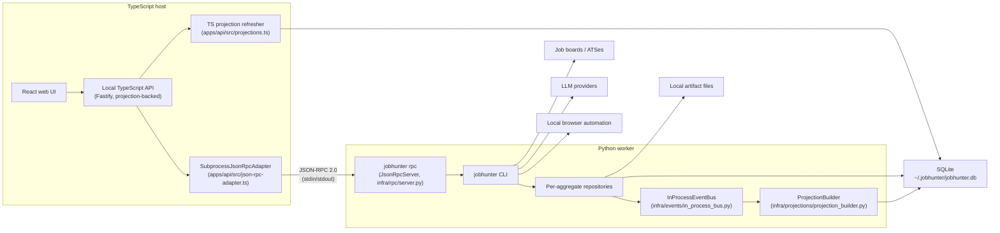
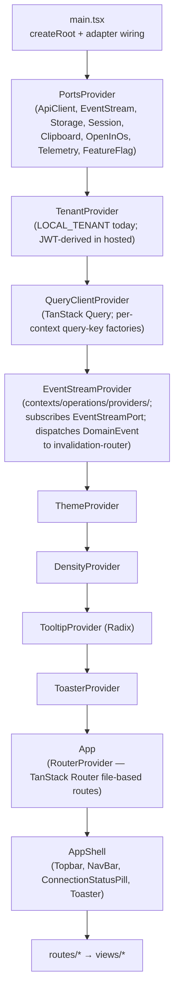
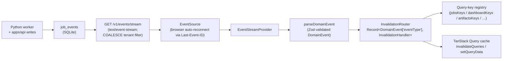

# Architecture

This document is the canonical architecture reference for JobHunter. The
target-state model that this implementation realises is defined in
[`docs/ddd-target.md`](ddd-target.md); the migration phases that took the
codebase here are summarised in
`docs/plans/implemented/2026-05-06-ddd-migration.md`. Detailed proposal and
delivery history lives under `docs/plans/`.

For a phase-by-phase execution view of the job pipeline, including sequence
diagrams, component diagrams, call paths, persistence, events, and failure
behavior, see [`docs/job-pipeline-architecture.md`](job-pipeline-architecture.md).

## System Shape

JobHunter is a local-first job-search automation system. The product surface is
a local web UI and API; the automation engine remains Python because the
existing discovery, enrichment, scoring, tailoring, PDF generation, and apply
flows live there. The supported runtime shape has three components: local
TypeScript API, local TypeScript UI, and Python automation worker.

The codebase is organised around the **eight bounded contexts** defined in
`docs/ddd-target.md` §3:

| Bounded context             | Aggregate root                | Where it lives                                                    |
|-----------------------------|-------------------------------|-------------------------------------------------------------------|
| Job Discovery               | `Job`                         | `workers/automation/src/jobhunter/domain/discovery/`              |
| Job Enrichment              | `JobEnrichment`               | `workers/automation/src/jobhunter/domain/enrichment/`             |
| Candidate Profile           | `Profile`                     | `workers/automation/src/jobhunter/domain/profile/`                |
| Scoring                     | `JobScore`                    | `workers/automation/src/jobhunter/domain/scoring/`                |
| Materials Generation        | `MaterialsSet`                | `workers/automation/src/jobhunter/domain/materials/`              |
| Apply Automation            | `ApplyRun`                    | `workers/automation/src/jobhunter/domain/apply/`                  |
| Pipeline Orchestration      | `JobPipelineState`            | `workers/automation/src/jobhunter/domain/pipeline/`               |
| Operations / Read-Side      | _(no aggregate — projections)_| `workers/automation/src/jobhunter/domain/operations/`             |

Repository ownership mirrors the runtime boundaries:

- `apps/web`: runnable React/Vite frontend.
- `apps/api`: runnable local Fastify API.
- `packages/contracts`: shared schemas, DTOs, enums, and JSON-RPC envelopes.
- `packages/domain-types`: pure TypeScript mirror of the Python domain model.
- `packages/api-client`: typed transport client used by the frontend and tests.
- `workers/automation`: uv-managed Python automation worker and CLI package.
- `packages/tsconfig`: shared TypeScript compiler presets.



## Bounded Context Composition

Each context exposes its **driving ports** (use cases) and depends on **driven
ports** (capabilities) for I/O. The local-mode adapters satisfy each driven
port via SQLite, the local filesystem, the local Chrome / Playwright stack, and
the local LLM clients. The hosted-mode adapters (Postgres, S3, SQS, Browserbase,
Temporal) are named in `docs/ddd-target.md` §5 but not implemented yet — they
are the next-evolution seam, not a parallel codepath today.

Cross-context integration rides the **`InProcessEventBus`** (Phase 3, S-08) for
domain events and the **`SubprocessJsonRpcAdapter`** (Phase 9, S-34) for the
TS↔Python integration protocol (§6.5 of `docs/ddd-target.md`). The pre-DDD
"call out via `uv run jobhunter action ...` per request" pattern is gone.

## Retrieval Before Scoring

The Scoring context owns a local hybrid retrieval service under
`workers/automation/src/jobhunter/domain/scoring/retrieval.py`. It builds an
in-memory lexical index over normalized posting fields already produced by
Discovery, including Discovery's internal detail-enrichment queue drain, then
ranks candidate jobs before the scorer spends LLM calls. When
`jobhunter run score --limit N` or equivalent pipeline calls cap scoring, the
runner fetches a broader pending/enriched pool and lets hybrid retrieval choose
the top N.

Semantic search is optional. The `EmbeddingIndexPort` in
`workers/automation/src/jobhunter/domain/ports/retrieval.py` is the adapter seam
for a hosted or local embedding index; local mode defaults to
`DisabledEmbeddingIndex`, so lexical retrieval and scoring continue to work
without any external embedding service.

## Scoring Fit Assessment

The Scoring context keeps `FitScore` as a 1..10 applicant-side triage signal,
but each persisted `job_scores` row also stores the criteria snapshot and trace
used to produce it. `criteria_json` records the saved score criteria, target
criteria, minimum score, and structured profile preference fields used for the
prompt. `trace_json` records non-sensitive audit metadata: prompt/schema
versions, model name, criteria version, profile snapshot version, parser
warnings, and correction history.

The score breakdown separates soft fit from hard eligibility. `fit_band`,
`confidence`, matched/missing/transferable signals, warnings, and hard blockers
are exposed through the local API and jobs drawer. User corrections create a new
score version, preserve the correction rationale, publish `ScoreCorrected`, and
can be read back as transparent feedback signals alongside existing job actions.
They also create a non-sensitive correction signal that is persisted as a
calibration anchor on the next `scoring_policies` version. The current policy
keeps rubric weights and fit-band thresholds stable; subsequent scores load the
latest policy version and include the active anchor IDs in `trace_json`.

This is not an employer-side candidate selection system. If JobHunter is ever
used to rank people for hiring decisions, the architecture needs a separate
governance layer for validation, bias audits, notices, adverse-impact review,
and human-review procedures before production use.

## Read-Model Projections (Phase 9)

The Operations / Read-Side context maintains denormalised projection
tables that back every read-model endpoint:

| Table                        | What it stores                                                    |
|------------------------------|-------------------------------------------------------------------|
| `job_list_projections`       | One row per job — title, employer, current stage/state, fit score, materials presence, apply status. |
| `dashboard_projections`      | Singleton aggregates: counts, funnel per stage, source breakdown, score distribution. |
| `job_detail_projections`     | Per-job description preview, score reasoning, full stages array. |
| `artifact_list_projections`  | All generated artifacts (resume txt/pdf, cover txt/pdf) with provenance. |
| `apply_run_projections`      | Apply-run telemetry with denormalised job context and event timeline. |
| `discovery_run_projections`  | Scheduled discovery-run status, source ids, counts, and retry metadata. |
| `source_quality_stats`       | Rolling per-source health rates used by the dashboard and discovery scheduler. |
| `operational_attempt_metrics` | Append-only stage/source/apply attempt facts with outcome, source role, failure class, retryability, scrape/operational flags, counts, and durations. |

The Python `ProjectionBuilder` (driven by `InProcessEventBus`) and the TS
`refreshProjections` helper both read new rows from `job_events` since the
shared `event_watermarks.operations_projections` watermark, recompute
projections from canonical aggregate state, and advance the watermark in the
same transaction. Both processes write to the same tables; SQLite handles the
concurrent advances. This kills the per-stage `LEFT JOIN ... COALESCE` soup
that the read-model used to assemble at request time.

## Runtime Boundaries

### Frontend

The React frontend under `apps/web` owns user interaction:

- dashboard summary
- jobs list and job detail
- artifacts list
- profile/style editor shell
- filtering, sorting, pagination, and drawer state
- UI action buttons

The frontend uses `@jobhunter/api-client` for API transport and
`@jobhunter/contracts` for shared schemas and DTOs. It should not know shell
command syntax.

The frontend follows its own DDD + hexagonal target documented in
[`docs/frontend-target.md`](frontend-target.md) — three-layer state separation,
eight bounded contexts that mirror the backend 1:1, view-vs-context dichotomy,
hexagonal frontend ports, SSE realtime via the invalidation router, and a
projection-typed Operations read-side. The summary below cross-links to the
target sections; the target doc is the canonical detail.

#### Stack

| Concern | Choice | Target ref |
|---|---|---|
| Bundler / dev server | Vite (SPA today; TanStack Start named-not-built for SSR) | §4.1, §9.1 |
| UI library | React 19 | §4.7 |
| Styling | Tailwind CSS 4 with design tokens in `tokens.css`; `darkMode: ["selector", "[data-theme='dark']"]` | §4.8 |
| Component primitives | shadcn/ui (Radix-based, copied + owned in `shared/ui/`) | §4.7 |
| Router | TanStack Router (file-based via `@tanstack/router-vite-plugin`) with route-level Zod search-param schemas | §4.3 |
| Server state | TanStack Query v5 with per-context query-key factories, `tenant`-first keys, central registry in `contexts/operations/queryKeys.ts` | §4.1, §4.4.1 |
| Tables | TanStack Table v8; column models live with the consuming view; cell renderers are imported from contexts | §3.10, §11 |
| Forms | TanStack Form + Zod `safeParse` | §4.6 |
| Client state | Zustand (`shared/stores/`) — UI prefs, toast queue, command palette, profile-import wizard draft (`persist` middleware where durability matters) | §4.9, §4.10 |
| Test runner | Vitest + React Testing Library + MSW for unit / hook / component | §10.2, §10.3 |
| End-to-end | Playwright against a seeded local API + SQLite fixture | §10.4 |
| Component-driven dev | Storybook with `addon-msw` and `addon-a11y` (critical+serious axe violations fail CI) | §10.5, §10.7 |
| Type-level tests | Vitest `typecheck` mode via `vitest.types.config.ts`; `*.test-d.ts` files live under `apps/web/test/types/`; invoked as `pnpm --filter @jobhunter/web test-d` | §10.6 |

#### Three Layers of State

Every piece of state lives in exactly one layer (`docs/frontend-target.md` §2.1):

| Layer | Owner | What lives here |
|---|---|---|
| Server state | TanStack Query cache | API-derived projections, profile, settings, dashboard summary — anything fetched from `apps/api`. |
| URL state | TanStack Router (typed search params via Zod) | Anything bookmarkable: view, filters, sort, page, page size, selected job, drawer open/close. |
| Client state | Zustand (with `persist` where appropriate) + React context | Theme, density, tenant context, transient UI like toast queue, ephemeral form drafts that do not survive navigation. |

No server data in `useState`; no filter / pagination / sort / drawer state in
`useState`; no durable user preferences in component-local state; one source of
truth per fact; components consume state through hooks (never raw stores or the
`QueryClient` directly).

#### Frontend Bounded Contexts

`apps/web/src/contexts/<name>/` mirrors the backend's eight bounded contexts
1:1 (`docs/frontend-target.md` §3, §11):

| Frontend folder | Owns | Backend mirror |
|---|---|---|
| `discovery/` | `useDeleteJobMutation`, `useDeleteJobsBulkMutation`, `useRestoreJobMutation`, `useRestoreJobsBulkMutation`, `useHideJobsBulkMutation`, `useUnhideJobsBulkMutation`, `usePermanentlyDeleteJobsBulkMutation`; future `useImportJobMutation`. | Job Discovery |
| `enrichment/` | `JobEnriched` / `EnrichmentFailed` invalidation handlers; future `useEnrichmentRetryMutation`. The enrichment aggregate is internal to Discovery's detail queue drain. | Job Enrichment |
| `profile/` | `useProfileQuery`, `useUpdateProfileMutation`, `useImportResumeMutation`, settings + credentials hooks, profile-import wizard store, profile editor + resume preview components. | Candidate Profile |
| `scoring/` | `<ScoreBadge>`, `<ScoreBreakdown>`; future `useCorrectScoreMutation`. | Scoring |
| `materials/` | `useGenerateMaterialsMutation`, `useOpenArtifactMutation`, generate / open buttons. | Materials Generation |
| `apply/` | `useApplyJobMutation`, `useDryRunApplyMutation`, `useCancelApplyMutation`, `<ApplyButton>`, `<DryRunButton>`, `<ApplyRunBadge>`, `<ApplyRunTimeline>`, `<ApplyHistory>`. | Apply Automation |
| `pipeline/` | `useRunPipelineStagesMutation`, `useRetryStageMutation`, `useCancelStageMutation`, `useMarkAppliedMutation`, `useMarkSkippedMutation`, `<StageTriggerPanel>`, `<StageBadge>`, `<StageTimeline>`, `<JobActions>`. | Pipeline Orchestration |
| `operations/` | All projection-typed read hooks (`useDashboardSummaryQuery`, `useJobsListQuery`, `useJobDetailQuery`, `useArtifactsListQuery`, `useArtifactDetailQuery`, `useApplyRunsListQuery`, `useApplyRunQuery`); query-key registry; SSE subscription; invalidation router. | Operations / Read-Side |

`views/dashboard/`, `views/jobs/`, and `views/artifacts/` are **composers, not
contexts** (`docs/frontend-target.md` §3.10). They import hooks from
`contexts/operations/` and components / mutations from aggregate contexts;
they own layout and view-local ephemeral UI (e.g., bulk-selection sets) and
nothing else. View → context dependency is one-way; views never depend on
other views.

#### Hexagonal Frontend Ports

Components and feature hooks depend only on **ports**; concrete adapters bind
to the ports in `shared/providers/PortsProvider.tsx`
(`docs/frontend-target.md` §6):

| Port | Local-mode adapter | Hosted-mode adapter (named, not built) |
|---|---|---|
| `ApiClientPort` | `FetchApiClientAdapter` (wraps `@jobhunter/api-client`) | Same adapter; baseUrl from env, `Authorization: Bearer <jwt>` injected by hosted `AuthInterceptor`. |
| `EventStreamPort` | `SseEventStreamAdapter` (`new EventSource(...)`) | `WebSocketEventStreamAdapter` if SSE proves limiting. |
| `StoragePort` | `LocalStorageAdapter` | `IndexedDbAdapter` when client-side cache exceeds 5 MB. |
| `SessionPort` | `LocalSessionAdapter` (returns `LOCAL_TENANT`) | `JwtSessionAdapter` (Auth0 / Cognito). |
| `ClipboardPort` | `NavigatorClipboardAdapter` | Same adapter. |
| `OpenInOsPort` | `OpenArtifactAdapter` (POSTs to `/v1/artifacts/:id/open`) | Disabled in hosted mode; UI surfaces a presigned-URL download instead. |
| `TelemetryPort` | `ConsoleTelemetryAdapter` (no-op) | `OpenTelemetryWebAdapter` → OTLP collector. |
| `FeatureFlagPort` | `StaticFeatureFlagAdapter` (always default) | Backend-served via `apiClient.featureFlags()`; cached in Query. |

The "frontend driving ports" (use cases) are the per-context hooks themselves
(`useApplyJobMutation`, `useDeleteJobMutation`, …) — React conventions are the
de-facto driving-port representation; no `UseCase` interface is formalised
(`docs/frontend-target.md` §6.7).

#### Provider Stack

The provider stack as wired in `apps/web/src/main.tsx` (top-down):



`EventStreamProvider` lives in `contexts/operations/providers/` because the
Operations context owns the SSE subscription and the invalidation-router
dispatch (`docs/frontend-target.md` §3.9, §7.3); every other provider lives
in `shared/providers/`.

#### Realtime — SSE → Invalidation Router → Cache



The invalidation router is **the** integration contract between the backend's
`DomainEvent` taxonomy and the frontend cache — a pure function tested in
isolation. Every backend event has a handler; the
`Record<DomainEvent["eventType"], InvalidationHandler>` typing makes a missing
handler a TypeScript compile error, and the
`every-event-has-handler.test.ts` parity test catches obvious empty-stub
implementations (`docs/frontend-target.md` §7.4).

#### Test Pyramid

`docs/frontend-target.md` §10. Vitest + React Testing Library + MSW for unit /
hook / component tests; Playwright for end-to-end critical flows; Storybook
with the a11y addon for component-driven development. Two parity tests guard
the cross-language seams:

- `every-event-has-handler.test.ts` — every `DomainEvent["eventType"]` has a
  registered invalidation handler.
- `every-stage-state-has-badge.test.tsx` — every `STAGE_STATE_KINDS` value
  has a `<StageBadge>` arm.

Detailed coverage and the a11y bar live in
[`docs/local-reliability-qa.md`](local-reliability-qa.md).

### TypeScript Product API

The local TypeScript API under `apps/api` owns typed JSON read models and
local product endpoints. It is intentionally bound to loopback by default
because it exposes local job, profile, and artifact metadata.

Current responsibilities:

- health endpoint
- dashboard summary endpoint
- jobs list/detail endpoints
- artifacts list/detail endpoints
- artifact open endpoint with known-path validation
- profile/settings read and write endpoints
- resume PDF import draft endpoint (via JSON-RPC `profile_import`)
- structured job action endpoints for retry, material generation, dry-run apply,
  cancel, mark-applied, mark-skipped
- global/batch pipeline stage actions via `POST /v1/pipeline/actions/run-stage`
- pagination, filtering, and global sorting
- read-model projection refresh on every request

Simple state-transition writes (`resetJobStage`, `markJobApplied`,
`markJobSkipped`, `cancelJobAction`, `softDeleteJob`, `restoreJob`) execute
inline in the TS process against shared `@jobhunter/domain-types` value
objects. Complex commands (`apply`, `profile_import`, batched stage runs)
travel through `SubprocessJsonRpcAdapter` to the long-lived
`jobhunter rpc` worker.

### Python Automation Engine

Python owns automation execution:

- discovery
- job detail enrichment
- scoring
- resume tailoring
- cover letters
- PDF generation
- profile import from resume PDF
- apply automation

The worker package lives under `workers/automation`. Each bounded context owns
its aggregate, repository (in `infrastructure/<context>/`), and ports (in
`domain/ports/`). The CLI is the human-facing driving adapter; the JSON-RPC
server (`jobhunter rpc`) is the API-facing driving adapter.

### Workflow Orchestration (Local Temporal)

A local Temporal dev server (`temporal server start-dev`) is the workflow
engine for the Python worker. The infrastructure split lives under
`workers/automation/src/jobhunter/infrastructure/temporal/`:

- `client.py` — `get_temporal_client()` connects to `TEMPORAL_ADDRESS`
  (default `localhost:7233`) and `TEMPORAL_NAMESPACE` (default `default`).
- `worker.py` — `build_worker(client, *, workflows, activities)` returns a
  `temporalio.worker.Worker` bound to `JOBHUNTER_TASK_QUEUE`. The worker
  uses a `SandboxedWorkflowRunner` with `with_passthrough_modules("jobhunter")`
  so workflow code can construct activity-input dataclasses at the workflow
  boundary (the sandbox proxy mechanism otherwise refuses to instantiate
  frozen dataclasses imported through `imports_passed_through()`).
- `task_queues.py` — single `JOBHUNTER_TASK_QUEUE = "jobhunter-default"`.
- `registry.py` — single source of truth for `WORKFLOWS` and `ACTIVITIES`.
  The CLI imports both lists and passes them to `build_worker`; new
  workflows / activities are added by appending here.

Each pipeline stage (discover, enrich, score, tailor, cover, apply,
profile_import) ships as a Temporal **Activity** under the owning bounded
context's package — e.g. `jobhunter/scoring/activities.py`,
`jobhunter/materials/activities.py`. Activities are thin adapters: they
defer heavy imports inside the activity body and forward to the existing
stage runner (`run_pipeline` / `apply_main` / `run_local_action`).

Two production workflows live alongside the activities:

- `JobPipelineWorkflow` (`jobhunter/pipeline/workflow.py`) — drives the
  configured stage list serially in **batch mode** against eligible jobs in
  the local DB. Stage eligibility is owned by the underlying runner via
  `state.set_stage_state`, not by the workflow. Passing `"apply"` is
  rejected with a non-retryable `ApplicationError` that points callers at
  `ApplyWorkflow`.
- `ApplyWorkflow` (`jobhunter/apply/workflow.py`) — single-activity,
  **per-job** workflow with its own retry policy (`max_attempts=2`) and
  parameter shape. `apply_activity` re-raises transient failures so the
  retry policy fires; `LookupError` is wrapped in a non-retryable
  `ApplicationError` so operator errors fail fast.

The pipeline package (`jobhunter/pipeline/`) is split into `runner.py`
(the existing batch orchestrator that the activities call) and
`workflow.py` (the Temporal workflow). `__init__.py` re-exports
`run_pipeline` so existing imports keep working.

`jobhunter worker` is the long-lived process that runs the worker loop.
Live workflow state — running workflows, history, signals, retries — is
visible at `http://127.0.0.1:8233` in the Temporal Web UI.

### Observability

The Python automation worker exports OpenTelemetry spans over OTLP/HTTP to a
Langfuse instance for LLM tracing. The wiring lives under
`workers/automation/src/jobhunter/infrastructure/observability/`:

- `otel.py` — `init_otel()` configures a global `TracerProvider` with a
  `BatchSpanProcessor` feeding an `OTLPSpanExporter`. Endpoint:
  `${LANGFUSE_BASE_URL}/api/public/otel/v1/traces`. Authentication is HTTP
  Basic with `base64(LANGFUSE_PUBLIC_KEY:LANGFUSE_SECRET_KEY)`. If any of
  `LANGFUSE_PUBLIC_KEY` / `LANGFUSE_SECRET_KEY` / `LANGFUSE_BASE_URL` is
  unset, init logs a warning and the worker continues without exporting.
  `LANGFUSE_DISABLE=1` opts out even when credentials are present.
  `LANGFUSE_OTEL_TIMEOUT_SECONDS` bounds each OTLP export request and defaults
  to `5.0`.
- `llm_spans.py` — `llm_generation_span(...)` context manager that opens a
  `langfuse.observation.type=generation` span around each LLM call. It also
  sets the GenAI semantic-conventions attributes (`gen_ai.request.model`,
  `gen_ai.response.model`, `gen_ai.usage.input_tokens`,
  `gen_ai.usage.output_tokens`) so OTel-native dashboards work too.

These sources emit spans:

| Source | Span name | `langfuse.observation.type` |
| --- | --- | --- |
| Every LLM call (`jobhunter.llm.LLMClient.chat`) | `llm.<model>` | `generation` |
| Every Temporal workflow + activity (via `temporalio.contrib.opentelemetry.TracingInterceptor`) | workflow / activity name | `span` (default) |
| Every JSON-RPC dispatch (`jobhunter.infrastructure.rpc.server.JsonRpcServer.dispatch`) | `rpc.<method>` | `span` |
| Every pipeline stage (`jobhunter.pipeline.runner`) | `pipeline.stage.<stage>` | `span` |
| Every score use-case call (`ScoreJobUseCase`) | `scoring.score_job` | `span` |
| Discover source steps (`jobspy`, `workday`, `smartextract`) | `pipeline.source.discover.<source>` | `span` |
| Scheduled discovery runs | `discovery.run` | `span` |
| Source-quality projection rebuilds | `operations.source_quality.aggregate` | `span` |

Pipeline stages and Discover source steps also emit short
`langfuse.observation.type=event` observations for their
`StageStarted` / `StageCompleted` / `StageFailed` lifecycle records. The same
lifecycle records are persisted to `job_events`, which makes long-running or
stuck stages visible through SSE/recent activity even before the synchronous
JSON-RPC request returns. The stage runner forwards the caller's `limit` to
every stage. Discovery sources use that limit as a bounded debug crawl cap,
switch to sequential source execution when a cap is present, and skip remaining
sources after the cap is reached.

The `TracingInterceptor` is registered both client-side
(`infrastructure/temporal/client.py`) and worker-side
(`infrastructure/temporal/worker.py`) so trace context propagates from the
JSON-RPC handler that starts a workflow into the worker that runs it.

`init_otel()` is called from `jobhunter.cli._bootstrap()`, so every CLI
command (notably `jobhunter worker` and `jobhunter rpc`) configures
exporting on startup. The `worker` command calls `shutdown_otel()` on
exit so the `BatchSpanProcessor` flushes any in-flight spans.

`jobhunter doctor` includes a `Langfuse` row that probes the OTLP endpoint
with a `HEAD` request — `OK reachable`, `MISSING (set
LANGFUSE_PUBLIC_KEY/SECRET_KEY/BASE_URL)`, or `unreachable`.

Out of scope for this layer: TypeScript API / web instrumentation and
distributed-trace propagation across the TS↔Python JSON-RPC boundary
(would need TS to emit OTel context too).

### SQLite And Files

SQLite in `~/.jobhunter/jobhunter.db` is the local source of truth for jobs,
stage states, events, artifacts, normalized Candidate Profile data, profile
rendering settings/template text, and run visibility. The five projection
tables (above) are also stored here. Dashboard settings remain file-backed
until their own storage migration.

Generated resumes, cover letters, PDFs, logs, and imported PDFs stay on the
local filesystem. They are registered in `job_artifacts` and
`job_materials_artifacts` and surfaced via `artifact_list_projections`. Legacy
`profile.json`, `resume_style.json`, and `resume_template.tex` files are
one-time seeds for empty profile tables, not canonical profile storage.
The apply launcher records each per-worker agent log
(`LOG_DIR/worker-{worker_id}.log`, written by `ClaudeCodeCliAdapter`) as a
`job_artifacts` row of kind `apply_log` in the same transaction as the
terminal `ApplicationSubmitted` / `ApplicationFailed` / `DryRunCompleted`
event (PR 7 of the Temporal stack).

## Core Data Flow

1. Discovery creates or updates jobs (via `JobRepository`).
2. Pipeline Orchestration creates `JobPipelineState` rows for the canonical
   stages.
3. Each domain operation publishes events through `InProcessEventBus`.
4. Workers record events in `job_events` and update per-aggregate tables
   (`job_scores`, `job_materials`, `job_enrichments`). The apply lifecycle
   is observable via `apply_run_projections`, sourced from `job_events`
   by the projection builder — the bespoke `apply_runs` table was
   collapsed into the Temporal workflow run history (PR 4 of the
   Temporal stack).
5. Generated files are registered in `job_artifacts` /
   `job_materials_artifacts`.
6. `ProjectionBuilder` (Python) and `refreshProjections` (TS) consume new
   `job_events` rows and rebuild affected projection rows from canonical
   aggregate state. The Python builder owns `apply_run_projections`;
   the TS API reads it directly.
7. The UI reads from the projection tables via the TS read-model — no joins.
   The Workflow Runs view at `/runs` (PR 5 of the Temporal stack) reads
   `apply_run_projections` via `GET /v1/workflow-runs` and deep-links each
   row to the local Temporal Web UI (`http://127.0.0.1:8233`).
8. UI actions are routed through JSON-RPC for complex commands or executed
   inline for simple state transitions. JSON-RPC worker subprocesses inherit
   the API runtime `JOBHUNTER_DIR`, so action writes land in the same
   database the API and web UI read.

## Local Commands

Python CLI:

```bash
uv --project workers/automation run jobhunter doctor
uv --project workers/automation run jobhunter run
uv --project workers/automation run jobhunter action score --limit 5
uv --project workers/automation run jobhunter rpc      # long-lived JSON-RPC server
```

TypeScript API and web UI:

```bash
pnpm api:dev
pnpm web:dev
```

Verification:

```bash
pnpm -r check
pnpm -r test
uv --project workers/automation run --extra dev pytest -q
uv --project workers/automation run --extra dev ruff check .
uv --project workers/automation run python scripts/check-domain-type-parity.py
git diff --check
```

## Plan History

- `docs/plans/implemented/2026-05-01-ts-product-api-python-workers-architecture.md`
- `docs/plans/implemented/2026-05-02-local-ts-api.md`
- `docs/plans/implemented/2026-05-03-local-reliability-qa.md`
- `docs/plans/implemented/2026-05-03-remove-python-dashboard-compat.md`
- `docs/plans/implemented/2026-05-06-ddd-migration.md`
- `docs/plans/implemented/2026-05-06-frontend-tanstack-migration.md`
