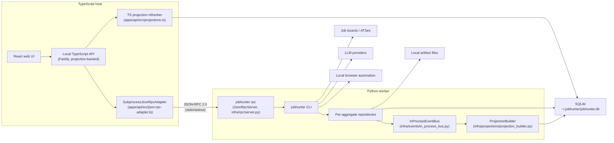

# Architecture

This document is the canonical architecture reference for JobHunter. The
target-state model that this implementation realises is defined in
[`docs/ddd-target.md`](ddd-target.md); the migration phases that took the
codebase here are summarised in
`docs/plans/implemented/2026-05-06-ddd-migration.md`. Detailed proposal and
delivery history lives under `docs/plans/`.

## System Shape

JobHunter is a local-first job-search automation system. The product surface is
a local web UI and API; the automation engine remains Python because the
existing discovery, enrichment, scoring, tailoring, PDF generation, and apply
flows live there. The supported runtime shape has three components: local
TypeScript API, local TypeScript UI, and Python automation worker.

The codebase is organised around the **eight bounded contexts** defined in
`docs/ddd-target.md` §3:

| Bounded context             | Aggregate root                | Where it lives                                                    |
|-----------------------------|-------------------------------|-------------------------------------------------------------------|
| Job Discovery               | `Job`                         | `workers/automation/src/jobhunter/domain/discovery/`              |
| Job Enrichment              | `JobEnrichment`               | `workers/automation/src/jobhunter/domain/enrichment/`             |
| Candidate Profile           | `Profile`                     | `workers/automation/src/jobhunter/domain/profile/`                |
| Scoring                     | `JobScore`                    | `workers/automation/src/jobhunter/domain/scoring/`                |
| Materials Generation        | `MaterialsSet`                | `workers/automation/src/jobhunter/domain/materials/`              |
| Apply Automation            | `ApplyRun`                    | `workers/automation/src/jobhunter/domain/apply/`                  |
| Pipeline Orchestration      | `JobPipelineState`            | `workers/automation/src/jobhunter/domain/pipeline/`               |
| Operations / Read-Side      | _(no aggregate — projections)_| `workers/automation/src/jobhunter/domain/operations/`             |

Repository ownership mirrors the runtime boundaries:

- `apps/web`: runnable React/Vite frontend.
- `apps/api`: runnable local Fastify API.
- `packages/contracts`: shared schemas, DTOs, enums, and JSON-RPC envelopes.
- `packages/domain-types`: pure TypeScript mirror of the Python domain model.
- `packages/api-client`: typed transport client used by the frontend and tests.
- `workers/automation`: uv-managed Python automation worker and CLI package.
- `packages/tsconfig`: shared TypeScript compiler presets.



## Bounded Context Composition

Each context exposes its **driving ports** (use cases) and depends on **driven
ports** (capabilities) for I/O. The local-mode adapters satisfy each driven
port via SQLite, the local filesystem, the local Chrome / Playwright stack, and
the local LLM clients. The hosted-mode adapters (Postgres, S3, SQS, Browserbase,
Temporal) are named in `docs/ddd-target.md` §5 but not implemented yet — they
are the next-evolution seam, not a parallel codepath today.

Cross-context integration rides the **`InProcessEventBus`** (Phase 3, S-08) for
domain events and the **`SubprocessJsonRpcAdapter`** (Phase 9, S-34) for the
TS↔Python integration protocol (§6.5 of `docs/ddd-target.md`). The pre-DDD
"call out via `uv run jobhunter action ...` per request" pattern is gone.

## Read-Model Projections (Phase 9)

The Operations / Read-Side context maintains five denormalised projection
tables that back every read-model endpoint:

| Table                        | What it stores                                                    |
|------------------------------|-------------------------------------------------------------------|
| `job_list_projections`       | One row per job — title, employer, current stage/state, fit score, materials presence, apply status. |
| `dashboard_projections`      | Singleton aggregates: counts, funnel per stage, source breakdown, score distribution. |
| `job_detail_projections`     | Per-job description preview, score reasoning, full stages array. |
| `artifact_list_projections`  | All generated artifacts (resume txt/pdf, cover txt/pdf) with provenance. |
| `apply_run_projections`      | Apply-run telemetry with denormalised job context and event timeline. |

The Python `ProjectionBuilder` (driven by `InProcessEventBus`) and the TS
`refreshProjections` helper both read new rows from `job_events` since the
shared `event_watermarks.operations_projections` watermark, recompute
projections from canonical aggregate state, and advance the watermark in the
same transaction. Both processes write to the same tables; SQLite handles the
concurrent advances. This kills the per-stage `LEFT JOIN ... COALESCE` soup
that the read-model used to assemble at request time.

## Runtime Boundaries

### Frontend

The React frontend under `apps/web` owns user interaction:

- dashboard summary
- jobs list and job detail
- artifacts list
- profile/style editor shell
- filtering, sorting, pagination, and drawer state
- UI action buttons

The frontend uses `@jobhunter/api-client` for API transport and
`@jobhunter/contracts` for shared schemas and DTOs. It should not know shell
command syntax.

### TypeScript Product API

The local TypeScript API under `apps/api` owns typed JSON read models and
local product endpoints. It is intentionally bound to loopback by default
because it exposes local job, profile, and artifact metadata.

Current responsibilities:

- health endpoint
- dashboard summary endpoint
- jobs list/detail endpoints
- artifacts list/detail endpoints
- artifact open endpoint with known-path validation
- profile/settings read and write endpoints
- resume PDF import draft endpoint (via JSON-RPC `profile_import`)
- structured job action endpoints for retry, material generation, dry-run apply,
  cancel, mark-applied, mark-skipped
- pagination, filtering, and global sorting
- read-model projection refresh on every request

Simple state-transition writes (`resetJobStage`, `markJobApplied`,
`markJobSkipped`, `cancelJobAction`, `softDeleteJob`, `restoreJob`) execute
inline in the TS process against shared `@jobhunter/domain-types` value
objects. Complex commands (`apply`, `profile_import`, batched stage runs)
travel through `SubprocessJsonRpcAdapter` to the long-lived
`jobhunter rpc` worker.

### Python Automation Engine

Python owns automation execution:

- discovery
- job detail enrichment
- scoring
- resume tailoring
- cover letters
- PDF generation
- profile import from resume PDF
- apply automation

The worker package lives under `workers/automation`. Each bounded context owns
its aggregate, repository (in `infrastructure/<context>/`), and ports (in
`domain/ports/`). The CLI is the human-facing driving adapter; the JSON-RPC
server (`jobhunter rpc`) is the API-facing driving adapter.

### SQLite And Files

SQLite in `~/.jobhunter/jobhunter.db` is the local source of truth for jobs,
stage states, events, artifacts, settings, and run visibility. The five
projection tables (above) are also stored here.

Generated resumes, cover letters, PDFs, logs, templates, and imported PDFs stay
on the local filesystem. They are registered in `job_artifacts` and
`job_materials_artifacts` and surfaced via `artifact_list_projections`.

## Core Data Flow

1. Discovery creates or updates jobs (via `JobRepository`).
2. Pipeline Orchestration creates `JobPipelineState` rows for the canonical
   stages.
3. Each domain operation publishes events through `InProcessEventBus`.
4. Workers record events in `job_events` and update per-aggregate tables
   (`job_scores`, `job_materials`, `job_enrichments`, `apply_runs`).
5. Generated files are registered in `job_artifacts` /
   `job_materials_artifacts`.
6. `ProjectionBuilder` (Python) and `refreshProjections` (TS) consume new
   `job_events` rows and rebuild affected projection rows from canonical
   aggregate state.
7. The UI reads from the projection tables via the TS read-model — no joins.
8. UI actions are routed through JSON-RPC for complex commands or executed
   inline for simple state transitions.

## Local Commands

Python CLI:

```bash
uv --project workers/automation run jobhunter doctor
uv --project workers/automation run jobhunter run
uv --project workers/automation run jobhunter action score --limit 5
uv --project workers/automation run jobhunter rpc      # long-lived JSON-RPC server
```

TypeScript API and web UI:

```bash
pnpm api:dev
pnpm web:dev
```

Verification:

```bash
pnpm -r check
pnpm -r test
uv --project workers/automation run --extra dev pytest -q
uv --project workers/automation run --extra dev ruff check .
uv --project workers/automation run python scripts/check-domain-type-parity.py
git diff --check
```

## Plan History

- `docs/plans/implemented/2026-05-01-ts-product-api-python-workers-architecture.md`
- `docs/plans/implemented/2026-05-02-local-ts-api.md`
- `docs/plans/implemented/2026-05-03-local-reliability-qa.md`
- `docs/plans/implemented/2026-05-03-remove-python-dashboard-compat.md`
- `docs/plans/implemented/2026-05-06-ddd-migration.md`
