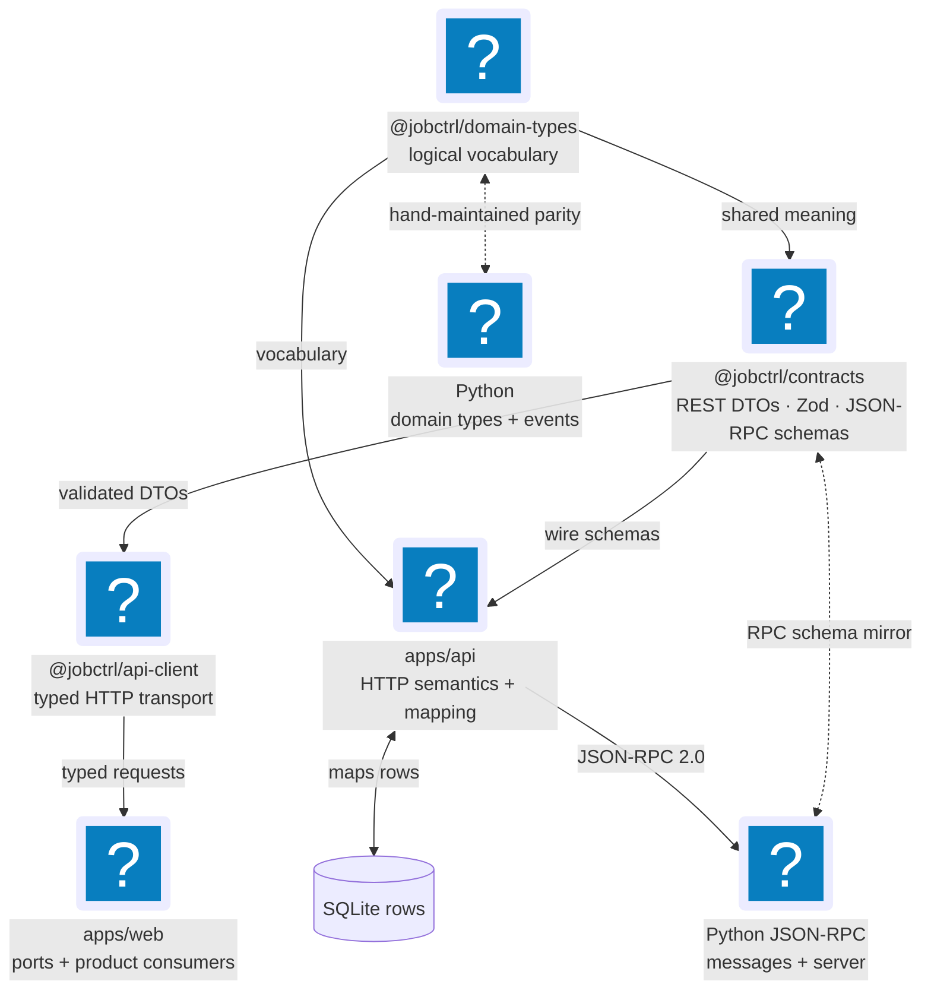

# Contracts, Types & API Boundaries

JobCtrl separates domain meaning, wire validation, transport behavior, and
runtime implementation. That separation lets the web app and TypeScript API
share precise types without turning HTTP DTOs, SQLite rows, or Python objects
into competing domain models.

**Read this if** you are adding a field, event, route, JSON-RPC method, or typed
client call and need to know which layer owns the contract.

## Dependency Direction

The important direction is domain vocabulary → wire contract → transport. The
API implements the wire contract, while the Python runtime mirrors only the
cross-language boundaries it consumes.

## Contract Owners

| Layer | Source owner | Contains | Must not contain |
| --- | --- | --- | --- |
| Python domain model | `workers/automation/src/jobctrl/domain/` | Aggregate behavior, invariants, value objects, use cases, and Python domain events | HTTP status codes, fetch behavior, or database/provider mechanics |
| Shared TypeScript domain vocabulary | `packages/domain-types/` | Branded identities, shared stage/state values, the TypeScript domain-event union, and projection shapes consumed across packages | Claiming authority over Python aggregate behavior, HTTP status codes, database access, or browser globals |
| REST and JSON-RPC wire contract | `packages/contracts/` | Zod request/response schemas, DTOs, wire enums, API query shapes, JSON-RPC envelopes, params, and result schemas | Route registration, persistence, fetch calls, or ownership of the domain-event union |
| Typed HTTP transport | `packages/api-client/` | URL/query encoding, HTTP methods, request timeout, typed return values, and transport errors | Business rules, server validation, or canonical state |
| HTTP implementation | `apps/api/` | Fastify routing, security gates, status codes, schema application, DTO mapping, projection reads, simple commands, JSON-RPC dispatch, and SSE framing | Provider/browser workflow execution or a second copy of shared DTOs |
| Frontend boundary | `apps/web/src/shared/ports/ApiClientPort.ts` plus adapters | The capability the web app consumes and the selected local/demo implementation | Direct transport calls from feature components |
| Python JSON-RPC mirror | `workers/automation/src/jobctrl/domain/rpc/messages.py` | Python validation/types for the methods crossing the TypeScript-to-Python boundary | Browser-facing REST contracts |
| Physical persistence | Owning SQLite repository/write module and schema initialization | Tables, columns, indexes, migration compatibility, and row serialization | Domain meaning merely because a column exists |

`packages/contracts` depends on `packages/domain-types` and re-exports selected
projection types. That is a dependency, not duplicate ownership: shared
TypeScript vocabulary stays in `domain-types`, while Python aggregates remain
authoritative for their behavior and invariants. The contract package exposes
only the wire-safe shapes API consumers need.

## Three API Boundaries

### Browser REST API

The web app uses product routes exposed by the loopback Fastify server.
Job/operations reads return DTOs built from projection rows; profile, settings,
credentials, compensation-policy, and resume-template reads use their canonical
SQLite, config, or secure-store owners directly. Simple commands can complete
synchronously; commands accepted for durable execution return workflow
identity after the Python runtime has started Temporal work.

The route documentation is intentionally layered:

1. [Local TypeScript API](../local-ts-api.md) explains route families and core
   semantics.
2. The focused [Profile & Settings](../api/profile-and-settings.md),
   [Jobs & Materials](../api/jobs-and-materials.md), and
   [Operations & Events](../api/operations-and-events.md) pages explain one
   product boundary at a time.
3. [Complete API Contract](../api/complete-contract.md) owns the exhaustive
   fields, status codes, precedence rules, and route variants.

Do not reproduce that exhaustive contract here. This page owns layer and source
responsibility, not a mutable route catalog.

### TypeScript-To-Python JSON-RPC

`packages/contracts/src/rpc.ts` owns the TypeScript JSON-RPC 2.0 envelope and
method schemas. `workers/automation/src/jobctrl/domain/rpc/messages.py` mirrors
the application contract; `apps/api/src/json-rpc-adapter.ts` supplies the local
transport; and `workers/automation/src/jobctrl/infrastructure/rpc/server.py`
dispatches it.

In the current runtime:

- the TypeScript API starts and reuses one `jobctrl rpc` subprocess;
- synchronous methods return their validated result through JSON-RPC;
- workflow methods return run/workflow identity after the Python side starts a
  Temporal workflow; and
- the TypeScript API does not enqueue Temporal work directly.

The browser does not call arbitrary JSON-RPC methods. Product routes validate
intent, enforce local security, and translate to the narrower worker command.
See [Runtime & Processes](runtime.md) and
[Operations & Events API](../api/operations-and-events.md) for dispatch and
health behavior.

### Domain Events Over SSE

Server-Sent Events (SSE) reuse the domain-event vocabulary, but the event union
does **not** live in `packages/contracts`. Its TypeScript authority is
`packages/domain-types/src/events/`, mirrored by
`workers/automation/src/jobctrl/domain/events/`.

`apps/api/src/event-stream.ts` frames durable `job_events` rows as SSE. The web
parser checks that the event type belongs to the known domain-event registry,
then the Operations invalidation router maps that event to query keys. An SSE
payload is an invalidation/change notification; it is not the full job or
projection response contract.

The exact framing, replay, tenant, and reconnect rules live in
[Local TypeScript API](../local-ts-api.md) and
[Frontend Realtime](frontend/realtime.md).

## Logical Types Are Not Rows Or DTOs

A single fact can have three representations without having three owners:

| Representation | Purpose | Example responsibility |
| --- | --- | --- |
| Domain value/event | Express meaning and valid states | A branded identity, stage-state union, or past-tense event |
| Persistence row | Store the fact efficiently and compatibly | Snake-case columns, indexes, nullable legacy fields |
| API DTO | Present a stable, privacy-safe client shape | Camel-case response, summarized evidence, pagination metadata |

Translation belongs at the boundary. Repositories translate rows to domain
values; API mapping translates projections/domain values to DTOs. A column
addition does not automatically become a public field, and a presentation-only
DTO field does not automatically become canonical storage.

## Cross-Language Parity

TypeScript and Python share concepts by explicit mirrors, not generated code.
The domain parity check compares the covered event names/payload fields and
pipeline stage/state vocabulary; focused tests and shared fixtures cover
additional projection and JSON-RPC shapes. The source anchors are:

- `packages/domain-types/src/events/` and
  `workers/automation/src/jobctrl/domain/events/`;
- `packages/domain-types/src/pipeline.ts` and
  `workers/automation/src/jobctrl/domain/pipeline_types.py`;
- `packages/contracts/src/rpc.ts` and
  `workers/automation/src/jobctrl/domain/rpc/messages.py`; and
- `scripts/check-domain-type-parity.py` plus the focused API/Python parity
  tests.

Do not assume one parity script proves every contract in both languages. When a
boundary grows, add a fixture or assertion at that boundary.

## Change Checklist

| Change | Required ownership pass |
| --- | --- |
| New or changed domain value/state | Update `packages/domain-types`, the matching Python domain type when cross-runtime, and parity coverage before consumers |
| New domain event | Update both event registries/factories, the producer, projection handling, frontend invalidation, and parity tests |
| REST request/response field | Update `packages/contracts`, API validation/mapping, API-client use, affected frontend port/consumer, and the owning API reference |
| JSON-RPC method/field | Update `packages/contracts/src/rpc.ts`, the Python message mirror and handler registration, adapter tests, and dispatch documentation |
| Projection field | Start from its canonical data owner, update every responsible projection builder, then the DTO/API/client/UI and shared parity fixture |
| SQLite-only migration field | Update the owning schema/repository and [Storage](storage.md); expose it through a contract only when a product consumer needs it |

## Future Architecture (Not Implemented)

The domain-model reference names hosted HTTP/service transports, hosted data
adapters, and authenticated tenant injection as evolution seams. The current
product uses a loopback Fastify API, a long-lived local JSON-RPC subprocess,
local Temporal, and SQLite. See the explicitly future sections in
[Cross-Context Integration](domain-model/integration.md) and
[Cloud Evolution](domain-model/cloud.md); do not describe those adapters as
available current contracts.
