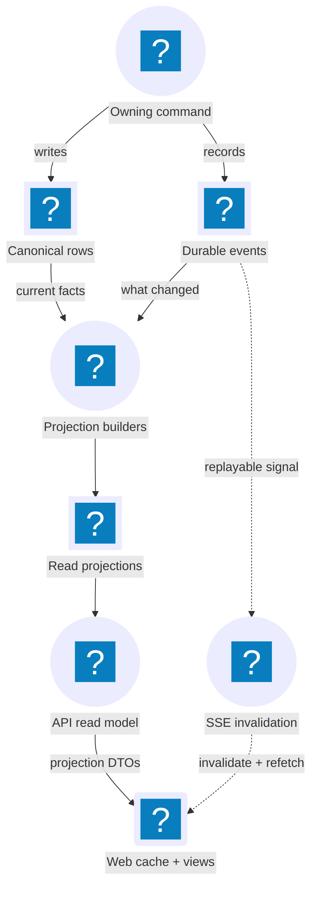

# Data, Events & Projections

JobCtrl keeps canonical business facts, durable domain events, denormalized
read projections, browser invalidations, and diagnostic telemetry as separate
concerns. They can share SQLite or describe the same workflow, but they have
different owners and different correctness guarantees.

**Read this if** you are adding a table, event, projection field, realtime
update, audit entry, or telemetry span and need to identify the source of truth.

## Current Data Flow

The event log marks what changed; projection builders read events plus canonical
rows to materialize client-friendly views. Solid arrows form the correctness
path. Dashed arrows carry invalidation signals; they never transfer canonical
state.

Telemetry observes execution but sits outside this product-state correctness
and recovery path.

The diagram is deliberately not an event-sourcing diagram: most aggregates are
loaded from canonical tables, not reconstructed by replaying `job_events` on
every command or request.

## Name The Layer Before Changing It

| Layer | Meaning | Authority and recovery |
| --- | --- | --- |
| Canonical domain/operational state | The current facts owned by an aggregate or explicit operational model: jobs, profile, scores, materials, stage state, reviews, outcomes, contacts, policies, and registered artifacts | Owning repository/write module and its SQLite/file transaction. See [Storage](storage.md). |
| Domain event | An immutable, past-tense fact that a meaningful change occurred | Typed event vocabulary plus its durable append in `job_events`. Events support audit, integration, dirty-entity detection, and selected event-folded lifecycles. |
| Read-model projection | A denormalized shape optimized for a list, detail, dashboard, artifact, workflow, contact, or other read | Derived and rebuildable. Never a command/write authority. See the [projection catalog](read-model.md#projection-catalog). |
| SSE frame | A tenant-scoped delivery of a durable event row to the browser | A replayable invalidation signal. The subsequent projection read is the UI correctness boundary. |
| Persisted operational metric | A bounded attempt/outcome row used by product operations and source-quality reads | SQLite application data such as `operational_attempt_metrics`, not an OpenTelemetry span. |
| Telemetry span | Diagnostic metadata about an LLM call, workflow/activity, stage, JSON-RPC dispatch, or adapter operation | Opt-in OpenTelemetry export. It is not product state and cannot repair a projection. See [Observability](observability.md). |

Logs are diagnostic artifacts, not domain events. Temporal history is durable
workflow-engine state, not the JobCtrl read model. Generated files are physical
artifacts whose registered metadata determines whether the product may serve
them.

## Canonical State And Physical Storage

`~/.jobctrl/jobctrl.db` contains canonical rows, the event log, and derived
projection tables in one local SQLite authority. Generated resumes, cover
letters, PDFs, and logs remain files; non-secret runtime settings live in
`config.json`; credentials and browser state have separate protected owners.

[Storage](storage.md) owns the path and schema inventory. This page owns the
semantic distinction between a canonical row, an event, and a projection; it
does not repeat the table catalog.

## Domain Event Contract

The TypeScript authority for event names and payload types is
`packages/domain-types/src/events/`. Python mirrors that vocabulary under
`workers/automation/src/jobctrl/domain/events/`. Every event carries a tenant,
timestamp, event type, and typed/contextual payload. The durable row additionally
records event identity and optional job/stage/entity references needed for
ordered replay and audit lookup.

`job_events` is the durable integration and audit spine, but it is not the sole
source of every business fact. Projection builders commonly use an event to
identify a dirty job or family, then read canonical aggregate tables to build
the current read shape. Apply-run and workflow-run projections fold their
lifecycle events more directly.

Safety-sensitive event and projection families keep private content at their
canonical owner and expose allow-listed identifiers, kinds, counts, state,
timestamps, and provenance metadata. This is not yet a universal guarantee for
all historical event families: pipeline failures can persist an exception
message. Treat exception text as potentially durable and sanitize it at the
producer rather than placing sensitive values in exceptions.

## Write And Publish Path Today

Python and TypeScript can both perform canonical local writes, but each write
still begins at the owning domain/application boundary.

### Python writes

1. The use case or repository validates the change and writes its canonical
   rows in an open SQLite transaction.
2. `record_job_event` inserts the `job_events` row that becomes durable when
   the caller commits, then publishes an in-memory `DomainEvent` through the
   process-wide `InProcessEventBus`.
3. That notification currently occurs before the caller commits. The wildcard
   `ProjectionBuilder` subscriber refreshes through the publishing thread's
   thread-local SQLite connection and defers its own commit when a transaction
   is already open.
4. A projection-handler error is logged and does not erase the canonical write
   or durable event. Because the watermark has not advanced successfully, a
   later explicit/bootstrap refresh can catch the read model up.

The in-process bus is therefore a low-latency notification mechanism, not the
durability guarantee. `job_events` plus projection watermarks provide recovery.

### TypeScript writes and reads

Simple commands hosted by the TypeScript API write canonical SQLite state and
events in their owning modules, then refresh the affected projections. Read
model functions call `refreshProjections` before selecting projection rows, so
the API can catch up after worker writes or process restarts.

JSON-RPC methods are either synchronous or workflow-starting. Workflow-starting
methods ask the Python side to start Temporal; synchronous provider-backed
methods return directly. Some TypeScript-owned flows persist canonical queued
intent or stage state before and after dispatch so the product can show pending
work. Those rows are product state, not a second workflow queue.

## Projection Ownership And Consistency

There are two materializers over the same SQLite read-model spine:

- Python `ProjectionBuilder` in
  `workers/automation/src/jobctrl/infrastructure/projections/` refreshes at
  bootstrap, from its event-bus subscription, and from explicit workflow/activity
  finalize paths.
- TypeScript `refreshProjections` in `apps/api/src/projections.ts` refreshes
  before reads and after TypeScript-owned writes.

They share the monotonic `event_watermarks.operations_projections` cursor and
derive overlapping projections from the same canonical state. Some families
have a narrower owner: apply-run and workflow-run projections are materialized
on the Python side and read by TypeScript. Shared fixtures and parity tests
guard the projection families written by both runtimes.

A projection refresh uses events newer than the watermark to mark dirty
entities/families, rebuilds their denormalized rows, and advances the watermark
only after the rebuild path reaches its successful end. First-run and
schema-recovery paths also detect missing/stale projection rows and rebuild from
canonical state even when old events are already watermarked.

SQLite serializes concurrent writers. Idempotent upserts, monotonic watermarks,
and missing-row backfills make repeated refreshes safe. For the exact current
projection responsibilities, use [Apply Feedback & Projections](read-model.md);
for workflow/event recovery, use
[Operations & Events](pipeline/operations.md#domain-events-projections-and-sse).

## SSE Is Invalidation, Not State Transfer

`apps/api/src/event-stream.ts` polls committed `job_events` rows, preserves
event order with event IDs, and supports reconnect replay. The web app parses
known event types and routes each one through
`apps/web/src/contexts/operations/invalidation-router.ts`.

Most handlers invalidate the smallest safe query-key scope. A bounded
high-frequency path may patch cached data directly, but projection refetch is
the correctness backstop. Missing an SSE frame may delay freshness; it must not
lose the canonical fact.

The framing and resume rules belong to
[Local TypeScript API](../local-ts-api.md); cache behavior belongs to
[Frontend Realtime](frontend/realtime.md).

## Operational Data Is Not Telemetry

`operational_attempt_metrics` persists bounded pipeline/source outcomes that
the product can aggregate into source-quality and operations views. Those rows
are application data and follow SQLite privacy rules.

OpenTelemetry spans are diagnostic exports. The LLM-generation path explicitly
limits attributes to safe metadata and omits raw prompts, completions, job text,
profiles, materials, credentials, and exception messages. Generic tracing can
still record exception text and status descriptions, so exceptions must not
contain sensitive values. Telemetry can explain an execution, but it never
becomes the source for job stage, score, materials, apply status, or projection
recovery.

## Change Checklist

| If you add or change… | Update the owning path |
| --- | --- |
| A canonical fact | Owning aggregate/use case, repository/write module, schema/migration, and [Storage](storage.md) |
| A domain event | TypeScript and Python event definitions, durable producer, affected projection logic, frontend invalidation, and parity coverage |
| A projection field | Canonical source first; every responsible builder/store; DTO/API mapping; shared fixture; consuming query/UI |
| A realtime reaction | Domain event owner plus the typed invalidation handler; do not invent a UI-only event bus |
| A persisted operational metric | The operation boundary that records it, its safe schema, aggregation/projection reader, and privacy tests |
| A diagnostic span | Instrumentation under the owning runtime and [Observability](observability.md); do not add a domain event unless the occurrence is product/audit truth |

## Future Architecture (Not Implemented)

The backend domain-model reference names a transactional outbox, queue-based
delivery, hosted databases, and hosted projection consumers as evolution
seams. The current product uses SQLite, an in-process Python event bus, two local
projection materializers, and a polling SSE endpoint. See the explicitly
future material in [Cross-Context Integration](domain-model/integration.md) and
[Cloud Evolution](domain-model/cloud.md); those components are not current
runtime dependencies.
