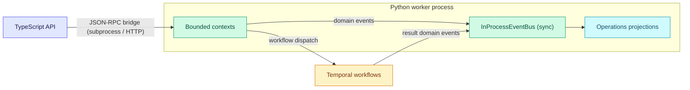
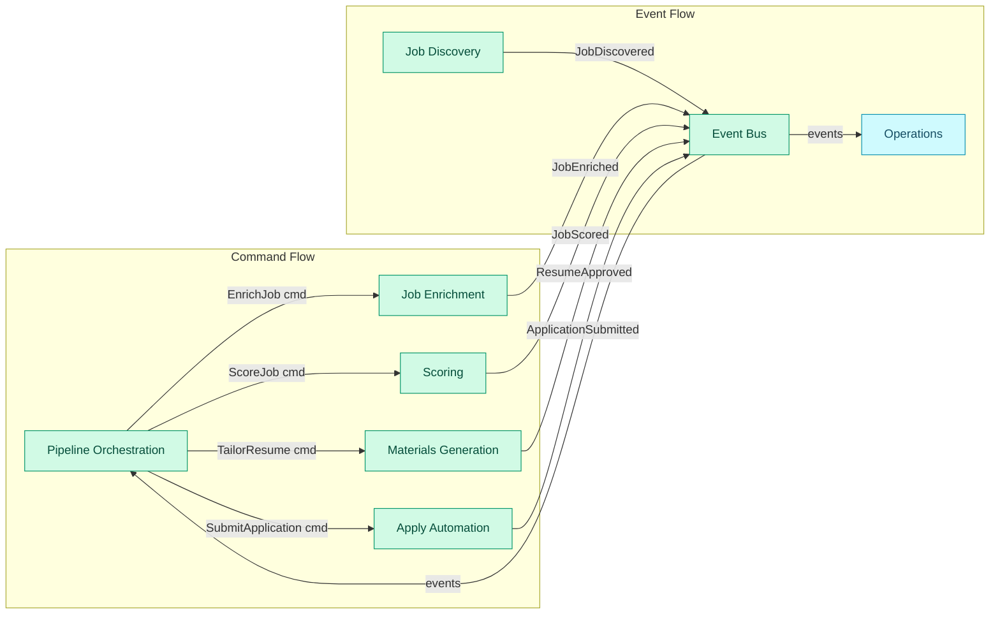

# 6. Cross-Context Integration

How contexts coordinate — domain events, the in-process publisher, and the
projection strategy. Part of the [Domain Model](index.md) reference.

Two mechanisms do all the coordinating. Inside the Python worker, contexts
publish **domain events** to a synchronous in-process event bus, and Operations
turns those events into read-model projections (§6.3, §6.6). Across the process
boundary, the TypeScript API reaches the worker through the **JSON-RPC bridge**
— a subprocess locally, HTTP in the cloud — and long-running commands start
Temporal workflows whose results come back as more domain events (§6.5).



The JSON-RPC bridge is the only cross-process hop; everything downstream of it —
events, projections, and workflow results — flows through the worker.

**Read this if** you are adding a domain event, wiring a projection, or changing
how the TypeScript API and Python worker talk.

### 6.1 Integration Backbone

The integration backbone uses **domain events** as the primary mechanism for
inter-context communication. Commands flow from Pipeline Orchestration to
processing contexts; events flow from processing contexts back to Orchestration
and Operations.



### 6.2 Event vs Command vs Request/Response

| Mechanism | When to use | Examples |
|---|---|---|
| **Domain Event** (async, fire-and-forget) | Notify that something happened. Producer doesn't know or care who consumes it. | `JobDiscovered`, `JobScored`, `ResumeApproved`, `ApplicationSubmitted` |
| **Command** (async, at-most-once) | Tell a specific context to do something. Orchestration dispatches to processing contexts. | `EnrichJob(jobId)`, `ScoreJob(jobId)`, `TailorResume(jobId)`, `SubmitApplication(jobId)` |
| **Request/Response** (sync) | Query for data needed to proceed. Used for read-model queries and profile snapshot access. | `GetProfileSnapshot()`, `GetJobDetail(jobId)`, `GetDashboardSummary()` |

### 6.3 Event Bus — Local and Cloud Implementations

#### Local-First: In-Process Synchronous Bus

In the local-first architecture, the event bus is **in-process and synchronous**.
Domain events are published within the same transaction that produces them:

```
// Pseudocode for local-first event flow
transaction {
    aggregate.applyCommand(cmd)
    events = aggregate.pendingEvents()
    repository.save(aggregate)
    eventStore.append(events)         // persisted to job_events table
}
// AFTER transaction commits — event dispatch is outside the transaction
for event in events:
    eventBus.publish(event)           // synchronous, same process
    // each handler runs its own transaction for its own aggregate
```

> **Why dispatch is outside the transaction:** If event handlers ran inside
> the producing transaction, a `ResumeApproved` handler that updates
> `JobPipelineState` would modify two aggregates in one transaction —
> violating the one-aggregate-per-transaction rule (Section 8.1). Dispatching
> after commit means each handler opens its own transaction.

**Trade-off:** This creates a small consistency gap: if the process crashes
after the producing transaction commits but before all handlers execute, the
event is persisted (in `job_events`) but downstream aggregates and projections
are stale. In local-first mode, this risk is low (single process, no network).
The startup reconciliation pass (below) is the safety net.

**Crash recovery:** If the process crashes after `eventStore.append()` but
before all projections update, the startup reconciliation pass replays
events from `job_events` whose `event_id` exceeds the last processed
watermark stored in each projection's metadata.

#### Cloud: Transactional Outbox + SQS FIFO

In the cloud deployment, events use the **transactional outbox pattern** to
guarantee exactly-once delivery without distributed transactions:

```
// Pseudocode for cloud event flow
postgres_transaction {
    aggregate.applyCommand(cmd)
    events = aggregate.pendingEvents()
    repository.save(aggregate)
    outbox.append(events)            // outbox table in same Postgres DB
}
// Async: outbox poller reads outbox, publishes to SQS FIFO, marks delivered
outboxPoller.publishToSqs(events)
// Async: SQS consumer reads events, updates projections
sqsConsumer.process(events)
```

**Crash-consistency guarantees:**
- **Aggregate + outbox** are in the same Postgres transaction — atomic.
- **Outbox → SQS** uses a poller with at-least-once semantics. SQS FIFO
  deduplication (by `eventId`) prevents duplicate delivery.
- **SQS → projection** consumer is idempotent (checks `eventId` watermark).
  Failed projections go to a dead-letter queue for manual inspection.
- **No event is lost** because the outbox is the durable source of truth.
  If SQS is temporarily unavailable, events queue in the outbox until the
  poller catches up.

**Same domain event shapes** are used in both local and cloud modes. The
`EventPublisher` port accepts domain events; the local adapter writes to
`job_events` + dispatches synchronously; the cloud adapter writes to the
Postgres outbox table. The domain is unaware of which mode is active.

### 6.4 `job_events` Table as Event Store

The existing `job_events` table evolves from a passive log into the canonical
event store:

- **Write path:** Processing contexts append domain events to `job_events` with
  structured `event_type`, `payload_json`, and `stage` fields.
- **Read path:** Operations context queries `job_events` to build projections.
  Pipeline Orchestration queries `job_events` to derive current state when
  needed.
- **Replay:** In the future, events can be replayed to rebuild projections or
  backfill new read models.

The `event_type` field becomes a discriminated union of all domain event types.
The `payload_json` field contains the event-specific data (typed per event).

### 6.5 TS API ↔ Python Worker Integration Protocol

**Chosen application protocol: JSON-RPC 2.0 request/response.**
**Transport: swappable — subprocess locally, HTTP/gRPC in cloud.**

The application protocol (message shape) is **transport-independent**. The
transport is an adapter concern behind the JSON-RPC transport adapter.

**Why JSON-RPC 2.0 as the application protocol:**

1. **Structured, typed, language-neutral.** JSON-RPC defines request/response
   envelopes with method names, typed params, and error codes. Both TypeScript
   and Python have mature libraries.
2. **Transport-agnostic by specification.** JSON-RPC is explicitly
   transport-independent (RFC 8259 + JSON-RPC 2.0 spec). The same message
   can travel over subprocess stdin/stdout, HTTP POST, WebSocket, or gRPC
   with a JSON-RPC payload.
3. **Cloud-ready without protocol change.** In hosted mode, the same JSON-RPC
   messages flow over HTTP between the TypeScript API service and the Python worker
   service. Only the transport adapter changes — the application protocol,
   message schemas, and handler logic are identical.

**Transport adapters:**

| Environment | Transport Adapter | How it works |
|---|---|---|
| **Local-first** | `SubprocessJsonRpcAdapter` | TypeScript API spawns `uv run jobhunter rpc` subprocess. Request written to stdin as JSON-RPC. Response read from stdout. Existing `local-actions.ts` pattern, formalized. |
| **Cloud** | `HttpJsonRpcAdapter` | TypeScript API sends HTTP POST to Python worker service endpoint (`POST /rpc`). Same JSON-RPC body. Worker service is a FastAPI/Starlette app exposing the same handlers. |
| **Cloud (async)** | `HttpJsonRpcAdapter` to Python workflow starter | For long-running stages, the TypeScript API sends the same JSON-RPC command to the Python worker service. The Python handler builds a workflow spec, starts Temporal behind its port, and returns the workflow handle. |

**Protocol shape (unchanged across transports):**

```
// Request (same whether sent via stdin or HTTP POST body)
{
  "jsonrpc": "2.0",
  "method": "executeStage",
  "params": {
    "tenantId": "tenant-xyz",
    "stage": "score",
    "jobId": "job-abc123",
    "options": { "minScore": 7, "limit": 10 }
  },
  "id": "req-001"
}

// Response (same whether returned via stdout or HTTP response body)
{
  "jsonrpc": "2.0",
  "result": {
    "ok": true,
    "stage": "score",
    "jobsProcessed": 10,
    "events": [
      { "type": "JobScored", "tenantId": "tenant-xyz", "jobId": "job-abc123", "fitScore": 8 }
    ]
  },
  "id": "req-001"
}
```

**Three dispatch modes** (`sync`, `workflow`, `streaming`):

| Mode | When | JSON-RPC pattern | Examples |
|---|---|---|---|
| **`sync`** | Result needed immediately, < 30s | Standard request → response | `analyze_job` (inline employer analysis), `cancel_run` |
| **`workflow`** | Long-running work | Request → `{ runId, workflowId, firstExecutionRunId }` immediately. The Python handler builds a `WorkflowStartSpec` and starts a Temporal workflow; results arrive as domain events in `job_events`. | `apply`, `discover`, `profile_import`, `refresh_compensation`, per-stage commands |
| **`streaming`** | Batch ops with incremental status | Request → newline-delimited JSON-RPC notifications, final response on completion | reserved; no registered method currently uses it |

The earlier `fire_and_forget` mode was deleted (see the JSON-RPC decision in
`docs/decisions.md`); `workflow` dispatch replaced it. The Python `JsonRpcServer`
starts the Temporal workflow through an injected `WorkflowStarter` and returns
the workflow handle; cooperative cancellation is a `cancel_run` method that
signals the in-flight workflow. The TypeScript API does not enqueue Temporal work
directly — Temporal stays behind the Python worker. (The CLI `--stream` flag is
now a no-op: Temporal owns scheduling.)

**Key design constraint:** The `params` object always carries `tenantId`. In
local mode, the subprocess adapter injects `tenantId: "local"`. In cloud mode,
the HTTP adapter injects the authenticated tenant from the request context.
The Python worker handler receives `tenantId` as a first-class parameter and
passes it to all repository and event publisher calls.

**Transport scope:** JSON-RPC over subprocess is the **local-mode transport**.
In cloud mode, calls use `HttpJsonRpcAdapter` (same JSON-RPC body over HTTP
POST) to reach the Python worker service. Temporal stays behind a Python port:
the Python handler builds and starts the workflow, then returns the workflow
handle through JSON-RPC. The TypeScript API does not enqueue Temporal work directly.
**Evolution trigger:** multi-process deployment requiring durable workflow
orchestration (see Section 9.4).

**Shared contract:** Both sides import the same domain event definitions. The
authority is a **plain TypeScript discriminated union** in
`packages/domain-types/src/events/index.ts` (`DomainEventUnion`, currently 68
event types enumerated in `DOMAIN_EVENT_TYPES`, guarded by a compile-time
exhaustiveness check), mirrored byte-for-byte by the Python registry in
`workers/automation/src/jobhunter/domain/events/__init__.py`. This is **not**
Zod and does **not** live in `packages/contracts`. At the SSE boundary the
frontend validates each frame by set-membership on the known event types plus
`JSON.parse` (`apps/web/src/shared/ports/lib/parseDomainEvent.ts`), not by
schema parsing. Keeping the two registries in lockstep is a release check.

### 6.6 Operations Read-Model Projection Strategy

The Operations context builds its projections by:

1. **Subscribing to domain events** from all processing contexts.
2. **Updating denormalized views** in the read-model store.
3. **Serving queries** through the TypeScript API's Fastify routes.

In the local-first architecture, "subscribing" means the projection builder
runs in-process with the event bus. The TypeScript API's `read-model.ts` queries
the denormalized tables directly.

**Key projection:** The `JobListProjection` is precomputed from domain events:

```
JobListProjection = {
    jobId, title, employer, source, location, salary,
    currentStage, currentState,
    fitScore, hasResume, hasCoverLetter, hasPdf, applyStatus,
    discoveredAt, lastUpdatedAt
}
```

### 6.7 Apply Automation Result Reporting

Apply Automation reports results through domain events, not by directly
mutating shared state:

1. `ApplyRunStarted` — Operations updates the telemetry dashboard.
2. `ApplyRunEventRecorded` — Operations appends to the live event feed.
3. `ApplicationSubmitted` or `ApplicationFailed` — Pipeline Orchestration
   transitions the `apply` stage state. Operations updates the job list.

Apply result reporting stays event-driven: Apply writes domain events, Pipeline
Orchestration owns stage transitions, and Operations updates read-side views.

### 6.8 TS API Write Operations — Domain Logic Hosting

The current TypeScript API (`write-model.ts`) performs several write operations
directly against SQLite. In the target, each operation maps to a driving port
on the appropriate bounded context. The question is: which runtime *hosts*
the domain logic?

**Principle:** Simple state-transition commands that require no LLM, browser,
or scraping infrastructure are hosted **in the TypeScript API process** directly,
using shared domain types from `packages/domain-types`. Complex processing
commands are dispatched to the Python worker via JSON-RPC.

| Current `write-model.ts` operation | Target driving port | Hosted in | Rationale |
|---|---|---|---|
| `resetJobStage` | `RetryStageUseCase` (Pipeline Orchestration) | **TypeScript API** | Pure state machine transition — `StageStateMachine` is a shared domain type. No Python needed. |
| `markJobApplied` | `MarkAppliedUseCase` (Pipeline Orchestration) | **TypeScript API** | Simple stage state update. No browser/LLM. |
| `markJobSkipped` | `SkipJobUseCase` (Pipeline Orchestration) | **TypeScript API** | Simple stage state update. |
| `softDeleteJob` | `DeleteJobUseCase` (Discovery) | **TypeScript API** | Tombstone write. No Python needed. |
| `restoreJob` | `RestoreJobUseCase` (Discovery) | **TypeScript API** | Tombstone removal. |
| `updateProfile` | `UpdateProfileUseCase` (Profile) | **TypeScript API** | Shared schema validation and normalized SQLite write. |
| pipeline run / discover / enrich / score / tailor / cover / apply | Stage commands that start Temporal workflows | **Python worker** (via JSON-RPC) | Requires LLM, browser, scraping infrastructure. |
| profile import from PDF | `ImportProfileUseCase` (Profile) | **Python worker** (via JSON-RPC) | Requires `pypdf` + LLM extraction. |

**Trade-off:** The TypeScript API hosting simple commands means the `StageStateMachine`
logic exists in both TypeScript (via `packages/domain-types`) and Python. This
is acceptable because: (a) the state machine is a small, pure function with
well-defined transitions; (b) both implementations derive from the same
hand-authored `packages/domain-types` definitions (mirrored in Python and kept
in lockstep by tests), not from divergent hand-copies; (c) the alternative —
routing every button click through a Python subprocess — adds unacceptable
latency for simple UI operations.

**Cloud evolution:** In cloud mode, both TS and Python import the same
`StageStateMachine` from a shared package. The TypeScript API continues to host simple
commands directly against Postgres via the repository adapter. Complex
commands go through Temporal instead of subprocess.

---
