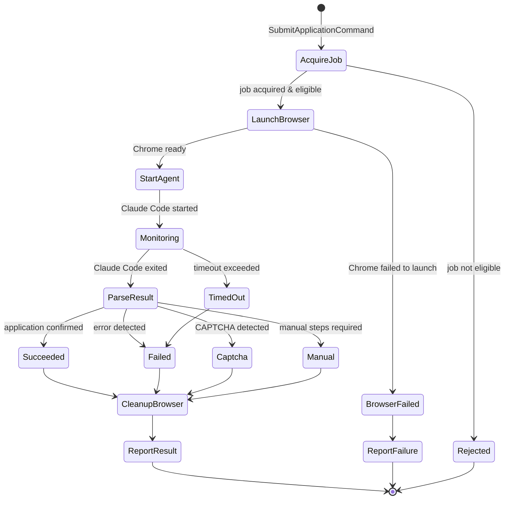
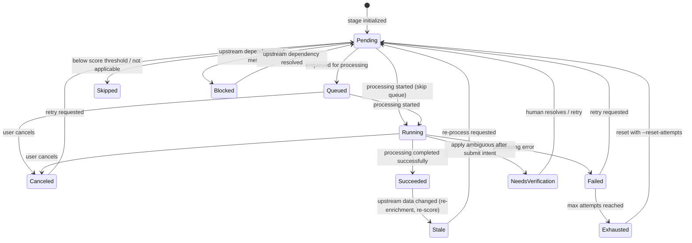

# 7–8. Persistence, Consistency & Failure Modes

The persistence boundary (§7) and the consistency, concurrency, and failure
rules (§8). Part of the [Domain Model](index.md) reference.

Two ideas hold this page together. First, **domain types are not database rows**:
each aggregate has one repository that translates between the in-memory domain
shape and the SQLite tables, so the schema can change without touching domain
logic (§7). Second, **one aggregate changes per transaction**, and everything
downstream — other aggregates, read-model projections — catches up through
domain events; idempotent handlers and crash-recovery rules keep that eventual
consistency safe when a step fails partway (§8).

**Read this if** you are adding a table or repository, changing a stage-state
transition, or reasoning about what the system does when a step crashes
mid-flight.

## 7. Persistence Boundary

### 7.1 Repositories Per Aggregate

| Aggregate | Repository Port | Tables (current) | Tables (target) |
|---|---|---|---|
| `Job` (Discovery) | `JobRepository` | `jobs` (discovery columns only) | `jobs` (narrowed: jobId, postingUrl, employer, source, title, salary, description, location, discoveredAt) |
| `JobEnrichment` | `EnrichmentRepository` | `jobs` (enrichment columns) | `job_enrichments` (new: jobId, fullDescription, applicationUrl, extractionTier, enrichedAt, error) |
| `Profile` | `ProfileRepository` | `candidate_profiles` + child `candidate_profile_*` tables | `profiles` + child profile tables (hosted) |
| `JobScore` | `ScoreRepository` | `jobs` (scoring columns) | `job_scores` (new: jobId, version, fitScore, breakdown, keywords, scoredAt, correction) |
| `MaterialsSet` | `MaterialsRepository` | `jobs` (tailor/cover columns) + `job_artifacts` | `job_materials` (new) + `job_artifacts` (existing, enriched) |
| `ApplyRun` | `ApplyRunRepository` / workflow-run projection | `job_events` + `apply_run_projections` | `job_events` + workflow-run projections keyed by Temporal workflow id |
| `JobPipelineState` | `PipelineStateRepository` | `job_stage_states` | `job_stage_states` (existing, largely correct) |
| `Contact` (Contact & Outreach) | `ContactRepository` | `contacts` + `contact_attributes` | `contacts` + `contact_attributes` (hosted: Postgres, tenant-scoped) |
| `ContactResearchTask` (Contact & Outreach) | `ContactResearchTaskRepository` | `contact_research_tasks` (+ `source_attempts_json`) + `contact_candidates` | same tables (hosted: Postgres, tenant-scoped) |
| `OutreachThread` (Contact & Outreach) | `OutreachThreadRepository` | `outreach_threads` + `outreach_drafts` | same tables (hosted: Postgres, tenant-scoped) |
| Read-model projections | `ReadModelStore` | Computed at read time from `jobs` + `job_stage_states` | `job_list_view` (materialized/denormalized), `dashboard_stats` (materialized) |

### 7.2 Decoupling Persistence Schema from Domain Types

The key principle: **domain types are not database rows.** Each repository
adapter translates between the two:

```
// Domain type (in the domain layer)
type JobScore = {
    jobId: JobId
    version: int
    fitScore: FitScore           // value object, constrained [1,10]
    breakdown: ScoreBreakdown    // nested value object
    keywords: MatchedKeywords    // list of strings
    scoredAt: Timestamp
    correction: ScoreCorrection? // optional nested value object
}

// Database row (in the adapter layer)
CREATE TABLE job_scores (
    job_id          TEXT NOT NULL,
    version         INTEGER NOT NULL,
    fit_score       INTEGER NOT NULL CHECK (fit_score BETWEEN 1 AND 10),
    breakdown_json  TEXT NOT NULL,
    keywords_json   TEXT NOT NULL,
    scored_at       TEXT NOT NULL,
    correction_json TEXT,
    PRIMARY KEY (job_id, version)
);
```

The `SqliteScoreRepository` adapter handles the translation:
- `fitScore: FitScore(8)` ↔ `fit_score: 8`
- `breakdown: ScoreBreakdown(...)` ↔ `breakdown_json: '{"technicalFit": ...}'`

This decoupling means:
- Domain types can evolve (add fields, change structure) without migration.
- Persistence schema can be optimized independently (indexes, denormalization).
- Switching from SQLite to Postgres changes only the adapter, not the domain.

### 7.3 Tables to Aggregates Mapping

- **`job_stage_states`** → `JobPipelineState` aggregate. Already well-structured.
  Target adds a `Queued` state and `Canceled` state to `STATE_VALUES`.
- **`job_artifacts`** → Part of `MaterialsSet` aggregate. Existing schema is
  adequate; target adds `generation` column for versioning.
- **`job_events`** → Domain event store. Existing schema is adequate; target
  standardizes `event_type` values to match domain event names.
- **`job_events` + `apply_run_projections`** → `ApplyRun` lifecycle and
  telemetry read model. The bespoke `apply_runs` / `apply_run_events` tables
  have been retired; workflow ids are the durable run handles.
- **`contacts` + `contact_attributes`** → `Contact` aggregate (Contact &
  Outreach). Attribute *values* live only in `contact_attributes.value_json`;
  `job_events` (keyed by the generic `entity_kind` / `entity_ref` columns added
  in schema v2) and the `contact_projections` read model carry only safe
  references — ids, kinds, and provenance metadata, never a value. The SQLite
  `user_version` is bumped to `2` (`SCHEMA_VERSION` in `database.py`,
  `SUPPORTED_SCHEMA_VERSION` in `apps/api/src/db.ts`).
- **`contact_research_tasks` + `contact_candidates`** → `ContactResearchTask`
  aggregate (Contact & Outreach, Phase 2). The task row carries the lifecycle
  plus a `source_attempts_json` column (the per-source `ResearchSourceAttempt`
  outcomes — provenance of the search); each candidate row keeps its proposed
  attribute *values* only in `contact_candidates.attributes_json`. Research
  events (`entity_kind = 'contact_research'` / `entity_ref = <taskId>`) and the
  `contact_research_task_projections` read model carry only ids, kinds,
  provenance metadata, and outcomes — never a candidate value.
- **`outreach_threads` + `outreach_drafts`** → `OutreachThread` aggregate (Contact
  & Outreach, Phase 3). Each draft row keeps the reviewable `body_text`, the
  persisted `gate_results_json` (the truthfulness-gate outcome approval is gated
  on — INV-5), and `provenance_json` (claim → fact bindings). Draft-lifecycle
  events (`entity_kind = 'outreach'` / `entity_ref = <threadId>`; application-linked
  threads also key on the job's `job_url`) and the `outreach_thread_projections`
  read model carry only ids, kinds, generation, and timestamps — never the draft
  body, gate text, or contact PII. There is no `sent` column and no send-log table
  (INV-1).

---

## 8. Consistency, Concurrency, and Failure Modes

### 8.1 Transactional Boundaries

**Rule: One aggregate per transaction.**

Each command modifies exactly one aggregate and persists it within a single
database transaction. Cross-aggregate consistency is achieved through domain
events (eventual consistency within the same process in local-first mode;
async events in hosted mode).

Example: When `TailorResumeUseCase` succeeds:
1. Transaction 1: `MaterialsSet` aggregate records the approved resume. Emits `ResumeApproved` event.
2. Transaction 2 (triggered by event): `JobPipelineState` aggregate transitions the `tailor` stage to `Succeeded`.
3. Transaction 3 (triggered by event): `ReadModelStore` updates the job list projection.

In local-first mode, these three transactions happen synchronously in sequence
within the same process. In hosted mode, transactions 2 and 3 happen
asynchronously via message queue.

### 8.2 Idempotency for Retries

Every command handler is idempotent:

- **Stage commands** include an `attemptNumber`. Re-processing the same attempt
  is a no-op (the repository checks if the attempt already exists).
- **Event handlers** use the event's `eventId` (auto-incrementing from
  `job_events.event_id`) as a deduplication key. Processing the same event
  twice produces the same result.
- **Apply runs** use `run_id` as an idempotency key. The
  `ApplyRunRepository.save()` uses `INSERT OR REPLACE` (upsert) semantics.

### 8.3 Saga / Process Manager: Apply Submission

The apply flow is a long-running process that spans multiple external interactions
(Chrome launch, page navigation, form filling, submission verification). This
is modeled as a **process manager** within the Apply Automation context:



**Compensation actions:**
- If Chrome fails to launch: clean up worker directory, report failure.
- If Claude Code times out: kill the subprocess, kill Chrome, clean up.
- If the process crashes mid-apply: on next startup, detect orphaned
  `in_progress` apply runs and transition them to `failed` with
  `error_code: ORPHANED`.

### 8.4 Multi-Stage Pipeline Run — Temporal Workflow

A pipeline run **is a Temporal workflow**, not an in-process process manager.
The earlier `PipelineRunManager` / `_StageTracker` design in `pipeline.py` has
been deleted; there is no in-process pipeline runner.

- **`JobPipelineWorkflow`** (starter-generated random id `run-{uuid4}`, with
  no overlap or dedup control) coordinates a run.
  Discovery is its own tenant-scoped `DiscoverWorkflow` (`discover-{tenantId}`),
  which plans source families, runs one activity per source family with real
  heartbeats, drains enrichment, then fans out per-job preparation as
  independent root workflows.
- **`JobPreparationWorkflow`** (`prep-{idempotency_key}`) is the per-job root
  workflow that sequences scoring → tailoring → cover letter → PDF rendering
  for a single job. It is started with `USE_EXISTING` rather than as a child
  workflow, so finishing discovery cannot terminate in-flight preparation.
- **Each stage is a Temporal activity** with its own retry policy, timeout, and
  heartbeat; `_run_stage_observed` remains the per-activity event/metric/span
  boundary. Non-retryable failures (e.g. `budget_exceeded`) fail fast.
- **Terminal state is durable.** Every workflow emits a `WorkflowStarted` marker
  and records exactly one terminal `Workflow*` event through a finalize activity
  (`infrastructure/temporal/finalize.py`); a describe-based reconciler in the
  worker heartbeat loop backstops finalize for cancelled or crashed executions.
- **Saga compensation** (e.g. browser-worker cleanup after apply failure) uses
  Temporal's activity/compensation mechanics rather than a hand-rolled manager.

For the full execution model, sequence diagrams, and failure behaviour see the
[System Architecture overview](../index.md) and the
[Job Pipeline section](../pipeline/index.md).

### 8.5 Stage State Machine



**Terminal states:** `Succeeded`, `Skipped`, `Exhausted` (until manually reset),
`Canceled` (until retried), `NeedsVerification` (until a human resolves it).

**Transition rules enforced by `StageStateMachine`:**

| From | To | Trigger | Guard |
|---|---|---|---|
| `Pending` | `Queued` | Enqueued for processing | Stage is eligible; worker queue is used |
| `Pending` | `Running` | Stage command dispatched (skip queue) | Upstream stages are `Succeeded` or `Skipped`; direct dispatch mode |
| `Pending` | `Blocked` | Upstream check | At least one upstream stage is not `Succeeded` or `Skipped` |
| `Pending` | `Skipped` | Score below threshold / not applicable | Score exists and below `minScore`, or user skips |
| `Queued` | `Running` | Processing started | Worker picks up from queue |
| `Queued` | `Canceled` | User cancels | User action via `CancelStageUseCase` |
| `Running` | `Succeeded` | Processing completes | Result is valid |
| `Running` | `Failed` | Processing errors | Error is captured |
| `Running` | `Canceled` | User cancels | For apply runs: kill Claude Code subprocess + Chrome cleanup. For other stages: set cancellation flag checked by stage runner between LLM calls. |
| `Running` | `NeedsVerification` | Apply ambiguous after submit intent | Live apply run cannot be safely auto-requeued; parks for human resolution (at-most-once apply) |
| `Failed` | `Pending` | Retry requested | `attemptCount < maxAttempts` or `resetAttempts` |
| `Failed` | `Exhausted` | Max attempts reached | `attemptCount >= maxAttempts` |
| `Blocked` | `Pending` | Upstream resolved | All upstream stages are `Succeeded` or `Skipped` |
| `Exhausted` | `Pending` | Manual reset | `resetAttempts = true` |
| `Canceled` | `Pending` | Retry requested | User action via `RetryStageUseCase` |
| `NeedsVerification` | `Pending` | Human resolves | User confirms the real outcome or requeues via `RetryStageUseCase` |
| `Succeeded` | `Stale` | Upstream data changed | Upstream stage re-ran (e.g., re-enrichment triggers stale score). Detected when Orchestration processes a `JobEnriched` event for a job that already has `score` in `Succeeded`. |
| `Stale` | `Pending` | Re-process requested | User or Orchestration initiates re-processing |

### 8.6 Concurrency Control

**SQLite WAL mode** provides read-write concurrency for the local-first
architecture. Specific controls:

- **Job acquisition for apply:** Use `SELECT ... WHERE ... LIMIT 1 FOR UPDATE`
  semantics (SQLite: `BEGIN IMMEDIATE` + read + update in same transaction)
  to prevent two apply workers from acquiring the same job.
- **Stage state updates:** The `ON CONFLICT DO UPDATE` pattern on
  `(job_url, stage)` prevents duplicate state rows.
- **Apply run creation:** The `run_id` primary key with `INSERT OR REPLACE`
  prevents duplicate runs.

---
