# 3. Strategic Design — Bounded Contexts

The eight bounded contexts, their ubiquitous language, and the relationships
between them. Part of the [Domain Model](index.md) reference.

A **bounded context** is a slice of the backend with its own vocabulary and its
own data, where a term like "Job" carries one precise meaning. Drawing these
boundaries explicitly is what stops one context's assumptions from leaking into
another. This page names the eight contexts, says what each owns (and does not
own), and maps how they hand work to one another.

### Context Map

```mermaid
graph TB
    subgraph "Core Domain"
        JD["Job Discovery"]
        JE["Job Enrichment"]
        SC["Scoring"]
        MG["Materials Generation"]
        AA["Apply Automation"]
    end

    subgraph "Supporting Domain"
        CP["Candidate Profile"]
        PO["Pipeline Orchestration"]
        PREP["Preparation (per-job)"]
        CMP["Compensation"]
    end

    subgraph "Generic Subdomain"
        OPS["Operations / Read-Side"]
    end

    subgraph "Platform Contexts (cloud)"
        IAM["Identity & Access"]
        BILL["Billing & Entitlements"]
        AUDIT["Audit Log"]
        SECRETS["Secret Management"]
    end

    JD -->|"JobDiscovered (Published Language)"| PO
    JE -->|"JobEnriched (Published Language)"| PO
    SC -->|"JobScored (Published Language)"| PO
    MG -->|"ResumeApproved / CoverLetterGenerated / PdfRendered (Published Language)"| PO
    AA -->|"ApplicationSubmitted / ApplicationFailed (Published Language)"| PO

    PO -->|"StageCompleted events"| OPS

    CP -->|"Conformist (Profile read)"| SC
    CP -->|"Conformist (Profile read)"| MG
    CP -->|"Conformist (Profile read)"| AA

    PO -->|"commands ▸"| JD
    PO -->|"commands ▸"| JE
    PO -->|"commands ▸"| SC
    PO -->|"commands ▸"| MG
    PO -->|"commands ▸"| AA

    PO -->|"starts JobPreparationWorkflow ▸"| PREP
    CMP -.->|"CompensationFactsUpdated"| OPS

    OPS -.->|"Projection queries"| JD
    OPS -.->|"Projection queries"| SC
    OPS -.->|"Projection queries"| MG
    OPS -.->|"Projection queries"| AA

    IAM -.->|"TenantContext (middleware)"| OPS
    IAM -.->|"TenantContext (middleware)"| PO
    BILL -.->|"Entitlement check"| PO
    BILL -.->|"Usage metering"| AA
    BILL -.->|"Usage metering"| SC
    AUDIT -.->|"Event sink"| OPS
    SECRETS -.->|"Credential fetch"| JD
    SECRETS -.->|"Credential fetch"| JE
    SECRETS -.->|"Credential fetch"| AA

    classDef py fill:#d1fae5,stroke:#059669,color:#064e3b
    classDef store fill:#cffafe,stroke:#0891b2,color:#164e63
    classDef ext fill:#f1f5f9,stroke:#94a3b8,color:#334155,stroke-dasharray:5 4
    class JD,JE,SC,MG,AA,CP,PO,PREP,CMP py
    class OPS store
    class IAM,BILL,AUDIT,SECRETS ext
```

Notice how the five **Core Domain** contexts each publish a Published-Language
event to Pipeline Orchestration, which in turn commands them and forwards
progress to Operations; the platform contexts at the bottom (Identity, Billing,
Audit, Secrets) are cloud-only seams that do not exist in local-first mode.

### 3.1 Job Discovery

**Purpose:** Find job postings from external sources and create canonical job
records with stable identity.

**Ubiquitous Language:**
- **JobPosting** — a raw job listing as scraped from an external source.
- **Source** — the origin board or career site (e.g., LinkedIn, Greenhouse, Workday).
- **Employer** — the hiring company, distinct from the source board.
- **SearchStrategy** — the extraction method used (jobspy, workday_api, smart_extract, manual).
- **PostingUrl** — the original URL where the job was found.
- **JobId** — a stable, system-generated identifier for a job.

**Upstream/Downstream:**
- **Downstream supplier** to Pipeline Orchestration (Customer-Supplier): Orchestration
  commands Discovery to run; Discovery publishes `JobDiscovered` events.
- **Anti-Corruption Layer** against external job boards: raw scraped data is
  translated into `JobPosting` value objects at the boundary. Board-specific
  quirks (Workday CXS JSON, Indeed's anti-scraping, Glassdoor blocking) stay
  in the ACL adapter, not the domain.

**Responsibilities:**
- Scrape job boards using configured search strategies
- Deduplicate by URL and (future) by content similarity
- Assign stable `JobId` and record `PostingUrl`
- Extract employer name separately from source board
- Emit `JobDiscovered` domain event

**What it does NOT own:**
- Job descriptions (that's Enrichment)
- Scoring or fit evaluation
- Application URLs (that's Enrichment)
- Any notion of pipeline stage state

**Boundary justification:** Discovery is the only context that touches external
job board APIs and scraping infrastructure. Its domain types (`JobPosting`,
`Source`, `SearchStrategy`) are meaningless outside this context. Separating it
isolates scraping complexity and rate-limiting concerns from downstream
processing.

---

### 3.2 Job Enrichment

**Purpose:** Enrich discovered jobs with full descriptions and direct
application URLs by scraping job detail pages.

**Ubiquitous Language:**
- **DetailPage** — the canonical URL for a job's full posting.
- **FullDescription** — the complete job description text extracted from the detail page.
- **ApplicationUrl** — the direct URL to apply (may differ from the posting URL).
- **ExtractionTier** — the method used: json_ld (Tier 1), css_selectors (Tier 2), llm_assisted (Tier 3).
- **EnrichmentAttempt** — a single try at extracting detail from a job's page.

**Upstream/Downstream:**
- **Downstream supplier** to Pipeline Orchestration (Customer-Supplier).
- Consumes `JobDiscovered` events to know which jobs need enrichment.
- **Anti-Corruption Layer** against detail page HTML: the three-tier extraction
  cascade (JSON-LD, CSS, LLM) is adapter logic, not domain logic.

**Responsibilities:**
- Navigate to job detail pages and extract full descriptions
- Extract or infer application URLs
- Record enrichment attempts and errors
- Emit `JobEnriched` or `EnrichmentFailed` domain events

**What it does NOT own:**
- Job identity or deduplication (that's Discovery)
- Scoring or candidate fit
- Browser lifecycle management (that's an infrastructure adapter)
- Deciding *which* jobs to enrich (that's Pipeline Orchestration)

**Boundary justification:** Enrichment is I/O-heavy (HTTP requests, Playwright
browser sessions, HTML parsing) with domain logic limited to URL resolution and
extraction strategy selection. Separating it from Discovery allows independent
retry policies and concurrency control. The hexagonal boundary keeps browser,
parser, and LLM I/O in adapters.

---

### 3.3 Candidate Profile

**Purpose:** Own the user's reusable career data, resume baseline, tailoring
policies, and writing style preferences.

**Ubiquitous Language:**
- **Profile** — the complete candidate data document.
- **ResumeBaseline** — the canonical master resume content (experience, education, skills).
- **ExperienceEntry** — one role in the candidate's work history.
- **AchievementEvidence** — source-backed proof for one experience achievement,
  including the source text, action, scope, tools, metrics, outcome, seniority
  signal, evidence strength, confidence, and user confirmation.
- **EducationEntry** — one degree or certification.
- **SkillCategory** — a named group of skills (e.g., "Programming Languages").
- **TailoringPolicy** — rules governing what the LLM may modify during tailoring.
- **WritingStyle** — tone, verbosity, bullet style, and other stylistic constraints.
- **ResumeTemplate** — the structured HTML/CSS print template for resume PDF rendering.
- **ApplicationDefaults** — default values for job application form fields.

**Upstream/Downstream:**
- **Conformist** relationship with Scoring, Materials Generation, and Apply
  Automation: those contexts consume the Profile as-is. They do not influence
  its shape.
- No upstream dependency. Profile is independently managed by the user.

**Responsibilities:**
- Validate and store the candidate profile document
- Provide a typed, immutable snapshot of profile data to consuming contexts
- Import profile data from resume PDFs
- Enforce structural invariants (required fields, valid entries)

**What it does NOT own:**
- Per-job tailored content (that's Materials Generation)
- Scoring logic
- Application submission

**Boundary justification:** Profile is a single-user, single-document aggregate
with its own lifecycle (user edits it independently of any job). Consuming
contexts need a stable read-only view with invariants enforced at the profile
boundary.

---

### 3.4 Scoring

**Purpose:** Evaluate candidate-job fit and produce structured, explainable
scores.

**Ubiquitous Language:**
- **FitScore** — a 1-10 integer rating of candidate-job match quality.
- **ScoreBreakdown** — structured explanation of why a job received its score.
- **MatchedKeywords** — ATS keywords from the job description that match the candidate.
- **ScoreCorrection** — a user-provided override with rationale.
- **ScoringCriteria** — the rubric used to evaluate fit (technical skills weight, experience level, etc.).

**Upstream/Downstream:**
- **Downstream supplier** to Pipeline Orchestration.
- Consumes `JobEnriched` events (needs full description to score).
- Consumes Profile data (Conformist).
- Publishes `JobScored` domain events.

**Responsibilities:**
- Score jobs against the candidate profile using LLM
- Parse and validate LLM scoring responses
- Record score breakdowns with matched keywords
- Accept and store user score corrections
- Emit `JobScored` domain events

**What it does NOT own:**
- Resume tailoring or cover letter generation (that's Materials Generation)
- The profile itself (that's Candidate Profile)
- Job descriptions (that's Enrichment)
- Deciding which jobs to score (that's Pipeline Orchestration)

**Boundary justification:** Scoring is a pure evaluation function:
`(JobDescription, Profile, ScoringCriteria) -> FitScore + ScoreBreakdown`. It
has no side effects on the job or profile. Separating it from Materials
Generation prevents the current coupling where `scoring/tailor.py` directly
imports `scoring/pdf.py` (briefing point 12). The backlog item for explanatory
score breakdowns and user-corrected scores further justifies an independent
context with its own persistence.

---

### 3.5 Materials Generation

**Purpose:** Produce tailored application materials (resumes, cover letters,
PDFs) for jobs that pass the scoring threshold.

**Ubiquitous Language:**
- **TailoredResume** — a resume customized for a specific job, derived from the master baseline.
- **CoverLetter** — a job-specific cover letter.
- **Artifact** — any generated file (resume, cover letter, PDF) with provenance metadata.
- **ArtifactStatus** — lifecycle of a generated artifact: `candidate` | `approved` | `rejected` | `superseded`.
- **ValidationResult** — output of structural and content validation (banned words, fabrication check).
- **JudgeVerdict** — LLM-as-judge evaluation of a tailored resume's quality.
- **TailoringPlan** — deterministic tailoring constraints derived from the
  profile evidence, tailoring policy, job text, and fit score.
- **AdversarialReview** — high-fit resume critique from separate reviewer
  personas that looks for fabrication, seniority mismatch, ATS weakness, and
  generic AI-sounding writing before approval.
- **RenderFormat** — the output format for a document: `latex_pdf` | `html_pdf` | `text`.

**Upstream/Downstream:**
- **Downstream supplier** to Pipeline Orchestration.
- Consumes `JobScored` events (needs fit score to decide eligibility).
- Consumes Profile data (Conformist).
- Publishes `ResumeApproved`, `CoverLetterGenerated`, `PdfRendered` domain events.

**Responsibilities:**
- Generate tailored resumes from profile + job description via LLM
- Validate tailored content (banned words, fabrication, structural integrity)
- Optionally run LLM-as-judge for quality assessment
- Run deterministic tailoring quality checks for unsupported metrics, keyword
  stuffing, stock-phrase warnings, weak seniority alignment, and missing evidence
- Run adversarial review for high-fit jobs after normal validation and judge pass
- Generate cover letters
- Render documents to PDF (resume via HTML/CSS + Playwright by default, with
  LaTeX available only as a compatibility renderer; cover letter via
  HTML/Playwright)
- Register generated artifacts with provenance metadata
- Emit domain events for each material lifecycle event

**What it does NOT own:**
- Scoring or fit evaluation (that's Scoring)
- The candidate profile (that's Candidate Profile)
- Application submission (that's Apply Automation)
- Pipeline scheduling or retry logic (that's Pipeline Orchestration)

**Boundary justification:** Materials Generation encompasses the two artifact
pipeline stages (tailor, cover) that share a tight invariant: cover letters
require a tailored resume, and each stage renders the PDFs it owns. Grouping them
in one context lets the aggregate enforce these dependencies directly rather
than through cross-aggregate eventual consistency. LLM calls, file I/O, and DB
writes remain adapter concerns.

---

### 3.6 Apply Automation

**Purpose:** Automate job application submission through browser-based
interaction with ATS portals.

**Ubiquitous Language:**
- **ApplyRun** — a single attempt to submit an application for one job.
- **BrowserWorker** — an isolated Chrome instance for one apply run.
- **SubmissionResult** — the outcome: `applied` | `failed` | `captcha` | `login_issue` | `expired` | `manual` | `dry_run`.
- **DryRun** — an apply attempt that navigates the ATS but does not submit.
- **ApplyPrompt** — the instructions sent to Claude Code for autonomous browser operation.
- **McpConfig** — Playwright MCP server configuration for a browser session.
- **ApplyRunEvent** — a telemetry event within an apply run (structured observability).
- **TokenUsage** — LLM token consumption and cost for an apply run.

**Upstream/Downstream:**
- **Downstream supplier** to Pipeline Orchestration.
- Consumes Profile data (Conformist) for application defaults.
- Requires materials from Materials Generation (tailored resume + cover letter PDFs).
- Publishes `ApplicationSubmitted`, `ApplicationFailed` domain events.
- **Anti-Corruption Layer** against ATS portals: ATS-specific behavior (Greenhouse
  forms, Lever redirects, Workday multi-step wizards) is adapter logic.

**Responsibilities:**
- Acquire eligible jobs and launch browser-based apply sessions
- Manage Chrome lifecycle (launch, CDP port allocation, cleanup)
- Build and dispatch Claude Code + Playwright MCP prompts
- Parse Claude Code output for submission results
- Record apply run telemetry (events, tokens, cost, duration)
- Handle dry-run mode (navigate but don't submit)
- Emit domain events for submission outcomes

**What it does NOT own:**
- Job discovery, enrichment, scoring, or materials generation
- Pipeline scheduling or job selection (that's Pipeline Orchestration)
- Chrome installation or system browser management (infrastructure concern)
- The candidate profile

**Boundary justification:** Apply is the most complex and most isolated context.
It manages subprocesses (Claude Code), browser processes (Chrome), MCP servers
(Playwright), and durable telemetry — none of which any other context touches.
Its `ApplyRun` aggregate has its own lifecycle and local persistence through
`job_events` plus the `apply_run_projections` read model keyed by the Temporal
workflow run id. Hexagonal ports separate subprocess spawning, browser
management, telemetry, persistence, and business rules.

---

### 3.7 Pipeline Orchestration

**Purpose:** Coordinate the flow of jobs through pipeline stages, manage stage
state machines, enforce ordering and retry policies, and dispatch commands to
the appropriate bounded contexts.

**Ubiquitous Language:**
- **Pipeline** — the canonical sequence of stages a job traverses.
- **Stage** — a named step in the pipeline: `discover | enrich | score | tailor | cover | pdf | apply`.
- **StageState** — the current status of a job within a stage (see state machine in Section 8).
- **Attempt** — a numbered try at completing a stage.
- **RetryPolicy** — max attempts and backoff rules per stage.
- **BlockedReason** — why a stage cannot proceed (upstream dependency not met).
- **NextAction** — the recommended CLI command or action to advance a blocked/failed stage.
- **PipelineRun** — a batch execution of one or more stages across multiple jobs.

**Upstream/Downstream:**
- **Customer** in Customer-Supplier relationships with all processing contexts
  (Discovery, Enrichment, Scoring, Materials, Apply): Orchestration decides
  *when* and *which* jobs to process; processing contexts decide *how*.
- Publishes `StageCompleted`, `StageFailed`, `StageExhausted` events to Operations.

**Responsibilities:**
- Maintain the stage state machine for every job
- Enforce stage ordering and upstream dependencies
- Track attempt counts and enforce retry limits
- Derive the next action for failed or blocked stages
- Dispatch commands to processing contexts
- Coordinate streaming (concurrent) and sequential pipeline modes
- Emit stage lifecycle events

**What it does NOT own:**
- The actual work of any stage (that belongs to the processing contexts)
- Job identity or metadata (that's Discovery)
- Read-model projections for the UI (that's Operations)
- User-facing API contracts (that's Operations)

**Boundary justification:** Orchestration is the "saga coordinator" — it knows
the pipeline shape but not the processing details. This separation keeps
stage-state coordination independent from Discovery, Scoring, Materials, and
Apply processing logic.

---

### 3.8 Operations / Read-Side

**Purpose:** Provide the user-facing read model — dashboards, job lists, job
detail views, artifact listings, and event logs — by projecting data from all
bounded contexts into queryable views.

**Ubiquitous Language:**
- **DashboardSummary** — aggregate counts and distributions for the pipeline.
- **JobListView** — a paginated, filterable list of jobs with current stage state.
- **JobDetailView** — complete job information including all stage states, events, and artifacts.
- **ArtifactListView** — generated materials with provenance and file metadata.
- **EventLog** — chronological record of domain events for a job.
- **ActionStatus** — the current state of a user-initiated action.

**Upstream/Downstream:**
- **Consumer** of domain events from all contexts.
- **Open Host Service** to the React frontend via the TypeScript API.
- Reads from projections built by domain events (not by querying processing
  contexts' internal state directly).

**Responsibilities:**
- Build and maintain read-model projections from domain events
- Serve dashboard summary, job list, job detail, artifact list queries
- Provide event stream or change notification to the frontend
- Translate domain types into API DTOs (via `packages/contracts`)

**What it does NOT own:**
- Pipeline state mutations (that's Pipeline Orchestration)
- Job processing logic
- Write operations on jobs or profiles (those go through the appropriate context's driving ports)

**Boundary justification:** CQRS separation. The read side has fundamentally
different optimization concerns (denormalized views, pagination, text search,
aggregate counts) than the write side (transactional consistency, invariant
enforcement). Operations consumes canonical stage states and projection rows
directly.

---

### 3.9 Compensation (Supporting Capability)

**Purpose:** Attach compensation evidence from licensed or configured sources
(Levels.fyi, Glassdoor) to jobs and employers, and expose it to Scoring, the
read model, and Apply Review.

**Actual shape:** Compensation is a lightweight supporting capability, **not a
full aggregate-bearing context**. It has no aggregate root or repository of its
own. It contributes:

- a `refresh_compensation` Temporal workflow with a shared core under
  `infrastructure/compensation/`;
- the `CompensationFactsUpdated` domain event (emitted inline and folded into
  the read model by Operations);
- source adapters gated by access-mode configuration (see
  `docs/user/configuration.md`, "Compensation Sources").

**What it does NOT own:** Job identity, scoring, or materials. It supplies
evidence that other contexts consume.

---

### 3.10 Preparation (Per-Job Orchestration)

**Purpose:** Drive a single discovered job through its per-job preparation
sequence — scoring, tailoring, cover letter, and PDF rendering (with artifact
suppression handled at fan-out time) — as one durable unit of work.

**Actual shape:** Preparation is a per-job orchestration capability layered on
Pipeline Orchestration, **not a full aggregate-bearing context**. It exposes a
driven port (`domain/ports/preparation.py`) and the `JobPreparationWorkflow`
(deterministic id `prep-{idempotency_key}`, keyed by tenant, job, work kind,
policy target version, and source event) that replaced the earlier in-process
preparation queue (see the 2026-07-03 decision in `docs/decisions.md`). It emits
`PreparationWorkItem*` lifecycle events. It has no aggregate root of its own;
per-job stage truth remains in `JobPipelineState`.

**What it does NOT own:** Stage-state invariants (owned by Pipeline
Orchestration) or the actual work of each stage (owned by the processing
contexts).

---
