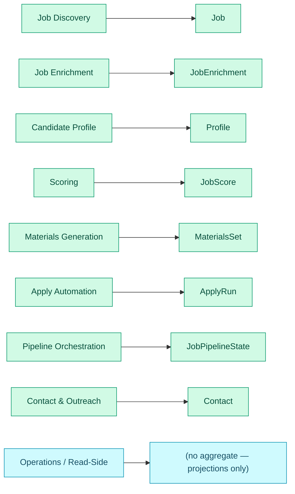
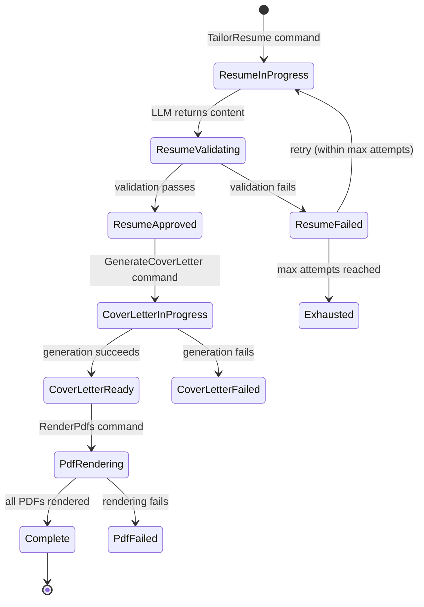
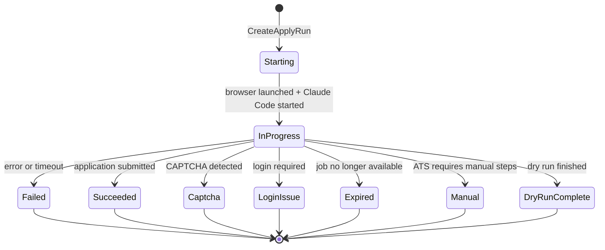

# 4. Tactical Design

Aggregates, entities, value objects, and domain events per context. Part of the
[Domain Model](index.md) reference.

An **aggregate** is a cluster of related data with one entity as its "root",
treated as a single unit for every change: one command modifies one aggregate,
and its rules (invariants) must hold when the change commits. Eight of the nine
contexts own exactly one aggregate root; Operations owns none — it only projects
read models from the events the others emit.



Each context below owns the one aggregate root named on the right; its section
then lists that root's invariants, entities, value objects, and the domain
events it emits.

### 4.1 Job Discovery Context

#### Aggregate: Job

```
Aggregate Root: Job
Identity: (TenantId, JobId)
  - TenantId: tenant scope (constant "local" in local-first mode)
  - JobId: system-generated UUID
```

**Invariants:**
- A Job must have exactly one `PostingUrl` and one `Source`.
- A Job must have an `Employer` (may be "Unknown" if not extractable at discovery time).
- `JobId` is immutable once assigned.
- Duplicate `PostingUrl` **globally within a `TenantId`** is rejected (matches current behavior where `url` is PK). Same URL from different boards is the same job; different boards provide different *metadata* but not different job identity.

**Lifecycle:**
1. Created when a job posting is scraped from an external source.
2. Updated if re-discovered with additional metadata (salary, location).
3. Soft-deleted when the user deletes it.

**Entities:** None (Job is the only entity; all other data is value objects).

**Value Objects:**
- `PostingUrl` — validated URL string.
- `Source(board: string)` — the platform where the job was found (e.g., "linkedin", "greenhouse", "workday"). This is the board only; employer is a separate value object.
- `Employer(name: string)` — the hiring company, separated from source board. Maps to current `jobs.company` (when extracted) vs `jobs.site` (which is `Source.board`).
- `SearchStrategy` — enum: `jobspy | workday_api | smart_extract | manual`.
- `JobMetadata(title, salary, description, location)` — discovery-time metadata.

**Domain Events** (all events carry `tenantId`):
- `JobDiscovered { tenantId, jobId, postingUrl, source, employer, metadata, discoveredAt }`
  — Consumed by: Pipeline Orchestration (to initialize stage states), Operations (to update job list).
- `JobUpdated { tenantId, jobId, changedFields }` — Consumed by: Operations.
- `JobDeleted { tenantId, jobId, reason, deletedAt }` — Consumed by: Operations.
- `JobRestored { tenantId, jobId, restoredAt }` — Consumed by: Operations.

**Domain Services:** None. Discovery logic (scraping, dedup) lives in adapters
behind ports; the aggregate is purely data.

---

### 4.2 Job Enrichment Context

#### Aggregate: JobEnrichment

```
Aggregate Root: JobEnrichment
Identity: (TenantId, JobId)
```

One aggregate instance per job. `EnrichmentAttempt` is a child entity within
the aggregate. This design ensures the invariant "at most one attempt Running
per JobId" is enforced within a single aggregate boundary — not across
multiple aggregate instances.

**Invariants:**
- At most one `EnrichmentAttempt` may be `Running` at a time (enforced within the aggregate).
- `ExtractionTier` is recorded for every attempt (provenance).
- Once any attempt succeeds, the aggregate is `Enriched` and further attempts are rejected unless explicitly reset.

**Lifecycle:**
1. Created when Orchestration commands enrichment for a job.
2. Accumulates `EnrichmentAttempt` child entities (one per try).
3. On success of any attempt, transitions to `Enriched`. Emits `JobEnriched`.
4. On failure, remains open for retry (new attempt) until exhausted.

**Entities (non-root):**
- `EnrichmentAttempt { attemptNumber, extractionTier, status: Running|Succeeded|Failed, startedAt, finishedAt, error? }`

**Value Objects:**
- `FullDescription(text: string)` — the extracted job description.
- `ApplicationUrl` — validated URL where the candidate can apply.
- `ExtractionTier` — enum: `json_ld | css_selectors | llm_assisted`.
- `EnrichmentError(code: string, message: string, retryable: bool)`.

**Domain Events** (all events carry `tenantId`):
- `JobEnriched { tenantId, jobId, fullDescription, applicationUrl, extractionTier, enrichedAt }`
  — Consumed by: Pipeline Orchestration, Scoring (knows it can now score), Operations.
- `EnrichmentFailed { tenantId, jobId, error, attemptNumber }`
  — Consumed by: Pipeline Orchestration (to update stage state), Operations.

**Domain Services:**
- `ExtractionStrategySelector` — given a job's source and URL, determines which
  extraction tier to attempt first. Pure function, no I/O.

---

### 4.3 Candidate Profile Context

#### Aggregate: Profile

```
Aggregate Root: Profile
Identity: (TenantId, ProfileId)
  - TenantId: tenant scope
  - ProfileId: user identity within a tenant (singleton "default" in local-first mode)
```

**Invariants:**
- Profile must have at least one `ExperienceEntry`.
- Every `ExperienceEntry` must have a non-empty `id`, `title`, and `company`.
- Every `SkillCategory` must have a non-empty `id` and `label`.
- `TailoringPolicy` fields are constrained to valid enum values.
- `WritingStyle` fields are constrained to valid enum values.

**Lifecycle:**
1. Created during first-time setup (wizard) or resume import.
2. Updated by user edits through the UI or CLI.
3. Never deleted (but can be reset).

**Entities (non-root):**
- `ExperienceEntry { id, dateRange, title, company, location, bullets[], achievementEvidence[] }`
- `EducationEntry { id, date, degree, institution, location }`
- `SkillCategory { id, label, items[] }`

**Value Objects:**
- `ExecutiveProfile(baselineText: string)`
- `AchievementEvidence { sourceText, scope, action, tools[], metrics[], outcome, senioritySignal, evidenceStrength, claimConfidence, userConfirmed }`
- `TailoringPolicy { mode, claimMode, autoApprovableClaimModes[], allowSummaryRewrite, allowTitleReframing, allowAchievementRewriting, allowSkillReordering, allowMinorInference, allowAdjacentAchievementDrafts }`
- `WritingStyle { tone, bulletStyle, verbosity, keywordDensity, avoidFirstPerson }`
- `ApplicationDefaults { ... }` — default form field values.
- `ResumeConstraints { realMetrics[], maxExperienceBullets, ... }`

**Domain Events** (all events carry `tenantId`):
- `ProfileUpdated { tenantId, changedSections[], updatedAt }` — Consumed by: Operations.
- `ProfileImported { tenantId, source, importedSections[], importedAt }` — Consumed by: Operations.

**Domain Services:**
- `ProfileSnapshot` — creates an immutable, validated snapshot of the Profile
  for consumption by other contexts. This is the anti-corruption boundary: other
  contexts receive a `ProfileSnapshot` value object, not a mutable reference.

**Published Language:** `ProfileSnapshot` is a **published type** — part of the
Profile context's Published Language. It lives in a shared types package
(`packages/domain-types`) alongside domain event schemas. Consuming contexts
(Scoring, Materials, Apply) import `ProfileSnapshot` as a read-only value
object. They have a compile-time dependency on the type definition, not on the
Profile context's internal modules.

---

### 4.4 Scoring Context

#### Aggregate: JobScore

```
Aggregate Root: JobScore
Identity: (TenantId, JobId, version: int)
```

**Invariants:**
- `FitScore` must be in range [1, 10].
- A `ScoreBreakdown` must accompany every score.
- `MatchedKeywords` is a non-empty list (if the LLM returns no keywords, the score is invalid).
- A `ScoreCorrection` supersedes the LLM score and must include a `reason`.

**Lifecycle:**
1. Created when Orchestration commands scoring for a job.
2. May be rescored (creates a new version).
3. May be corrected by the user (records correction alongside original).

**Value Objects:**
- `FitScore(value: int)` — constrained to [1, 10].
- `ScoreBreakdown { technicalFit, experienceFit, reasoning }` — structured explanation.
- `MatchedKeywords(keywords: string[])` — ATS-relevant keywords.
- `ScoreCorrection { correctedScore: FitScore, reason: string, correctedAt: Timestamp, correctedBy: UserId? }`.
- `ScoringCriteria { ... }` — the rubric configuration used.

**Domain Events** (all events carry `tenantId`):
- `JobScored { tenantId, jobId, fitScore, breakdown, keywords, version, scoredAt }`
  — Consumed by: Pipeline Orchestration, Materials Generation (eligibility check), Operations.
- `ScoreCorrected { tenantId, jobId, originalScore, correctedScore, reason, correctedAt }`
  — Consumed by: Pipeline Orchestration (may re-trigger downstream), Operations.

**Domain Services:**
- `ScoreParser` — validates and parses LLM scoring responses into `FitScore` +
  `ScoreBreakdown`. Pure function.
- `EligibilityChecker` — given a `FitScore` and a `minScore` threshold, determines
  if a job is eligible for materials generation. Pure function.

---

### 4.5 Materials Generation Context

#### Aggregate: MaterialsSet

```
Aggregate Root: MaterialsSet
Identity: (TenantId, JobId, generation: int)
```

The `MaterialsSet` groups the three related artifacts (tailored resume, cover
letter, PDF renderings) that must be internally consistent for one job
application.

**Invariants:**
- A `TailoredResume` must pass structural validation before being `approved`.
- A `TailoredResume` must pass deterministic tailoring quality checks before
  being eligible for `approved`.
- High-fit resumes (`fitScore >= 8`) must not be `approved` while adversarial
  review reports blocker findings.
- A `CoverLetter` can only be generated after a `TailoredResume` is `approved`.
- PDFs can only be rendered after their source documents exist.
- Banned words must not appear in any generated text.
- Generated content must not fabricate experience entries, companies, or credentials.
- Unsupported metrics and adjacent or draft achievements cannot be auto-approved
  unless profile evidence or the tailoring policy explicitly supports them.
- Every artifact must be registered with provenance (source job, generation params, timestamp).

**Lifecycle:**



**Entities (non-root):**
- `Artifact { artifactId, type, status, filePath, sizeBytes, metadata, createdAt }`

**Value Objects:**
- `TailoredResume { executiveProfile, experienceUpdates[], skillCategoryUpdates[] }`
- `CoverLetter { text: string }`
- `ValidationResult { valid: bool, errors: ValidationError[] }`
- `JudgeVerdict { approved: bool, feedback: string, confidence: float }`
- `TailoringPlan { claimMode, allowedMetrics[], allowedKeywordPhrases[], requiredEvidenceIds[], highFit, seniorityLevel }`
- `AdversarialReview { required: bool, approved: bool, blockers[], repairInstructions[], reviewerFindings[] }`
- `ArtifactType` — enum: `tailored_resume | cover_letter | resume_pdf | cover_letter_pdf`
- `ArtifactStatus` — enum: `candidate | approved | rejected | superseded`
- `RenderFormat` — enum: `latex_pdf | html_pdf | text`

**Domain Events** (all events carry `tenantId`):
- `ResumeApproved { tenantId, jobId, artifactId, generation, approvedAt }`
- `ResumeFailed { tenantId, jobId, validationErrors[], attemptNumber }`
- `CoverLetterGenerated { tenantId, jobId, artifactId, generatedAt }`
- `PdfRendered { tenantId, jobId, artifactType, artifactId, renderedAt }`
- `MaterialsExhausted { tenantId, jobId, stage, attemptCount, maxAttempts }`

> **Design note:** Domain events carry `artifactId`, not `filePath`. The
> artifact's storage location (local path or S3 key) is an infrastructure
> concern resolved at read time via `ArtifactStoragePort.resolve(artifactId)`.
> This ensures events stored in `job_events` remain meaningful across
> environments (local ↔ cloud) and can be replayed without path translation.
  — Consumed by: Pipeline Orchestration, Operations.

**Domain Services:**
- `ResumeAssembler` — given LLM output + profile baseline, assembles the final
  tailored resume text. Injects fixed structure (header, education) from the
  master resume. Pure function.
- `ContentValidator` — checks for banned words, fabrication, structural integrity.
  Pure function.
- `TailoringQualityEvaluator` — evaluates generated resumes against the
  `TailoringPlan` before judge approval. Pure function.
- `AdversarialResumeReviewer` — prompts reviewer personas for high-fit jobs and
  converts blocker findings into retry feedback.

**Generation lifecycle:** When the user re-tailors a job, a **new
`MaterialsSet`** is created with `generation` incremented. The earlier
`MaterialsSet` has its artifacts transitioned to `superseded` status and
becomes read-only. The aggregate factory (`MaterialsSetFactory`) reads the
current highest generation for the `(tenantId, jobId)` and creates
`generation + 1`. This means the aggregate does not grow unboundedly —
each generation is a fixed-size set of artifacts. Historical artifacts are
queryable through the Operations read model (artifact list projection).

---

### 4.6 Apply Automation Context

#### Aggregate: ApplyRun

```
Aggregate Root: ApplyRun
Identity: (TenantId, RunId: UUID)
```

**Invariants:**
- An `ApplyRun` must reference a valid `JobId`.
- A job must have an `ApplicationUrl`, `TailoredResume`, and `CoverLetter` before
  an `ApplyRun` can be created.
- At most one `ApplyRun` may be `in_progress` for a given `JobId` at a time.
- A `DryRun` must never mark the job as `applied`.
- `TokenUsage` and `CostUsd` are recorded on completion.

**Lifecycle:**



**Entities (non-root):**
- `ApplyRunEvent { eventId, eventType, level, message, payload, occurredAt }`

**Value Objects:**
- `SubmissionResult` — discriminated union:
  `Applied { appliedAt, verificationConfidence }`
  | `Failed { error, retryable }`
  | `Captcha { details }`
  | `LoginIssue { details }`
  | `Expired {}`
  | `Manual { reason }`
  | `DryRunComplete { navigatedTo }`
- `BrowserWorkerConfig { workerId, cdpPort, headless, userDataDir }`
- `ApplyPrompt { text, mcpConfig }`
- `TokenUsage { input, output, cacheRead, cacheCreate, costUsd }`

**Domain Events** (all events carry `tenantId`):
- `ApplicationSubmitted { tenantId, jobId, runId, appliedAt, verificationConfidence }`
  — Consumed by: Pipeline Orchestration, Operations.
- `ApplicationFailed { tenantId, jobId, runId, result: SubmissionResult, attemptNumber }`
  — Consumed by: Pipeline Orchestration, Operations.
- `ApplyRunStarted { tenantId, jobId, runId, workerId, model, dryRun, startedAt }`
  — Consumed by: Operations (telemetry dashboard).
- `ApplyRunEventRecorded { tenantId, runId, event: ApplyRunEvent }`
  — Consumed by: Operations (live telemetry feed).

**Domain Services:**
- `ApplyEligibilityChecker` — validates that a job has all prerequisites for
  apply (application URL, materials, not already applied, within attempt limits).
  Pure function.

---

### 4.7 Pipeline Orchestration Context

#### Aggregate: JobPipelineState

```
Aggregate Root: JobPipelineState
Identity: (TenantId, JobId)
```

**Invariants:**
- Every `JobId` has exactly one `StageState` per `Stage` (7 stages total).
- Stage state transitions must follow the state machine (Section 8).
- `attempt_count` monotonically increases (never decreases except on explicit reset).
- A stage in `Running` state cannot transition to `Pending` (must go through `Failed` or `Succeeded`).
- `blocked_by` is computed from upstream stage states; it cannot be set arbitrarily.

**Value Objects:**
- `Stage` — enum: `discover | enrich | score | tailor | cover | pdf | apply`
- `StageState` — discriminated union (see Section 8 for full state machine):

```
StageState =
  | Pending   { attemptCount, maxAttempts, nextAction? }
  | Queued    { queuedAt }
  | Running   { attemptCount, startedAt }
  | Succeeded { attemptCount, finishedAt, durationMs }
  | Failed    { attemptCount, maxAttempts, errorCode, errorMessage, retryable, nextAction? }
  | Blocked   { blockedBy: Stage[], errorCode, errorMessage }
  | Skipped   { reason: string }
  | Exhausted { attemptCount, maxAttempts, errorCode, errorMessage, nextAction? }
  | NeedsVerification { reason: string, nextAction? }
  | Stale     { reason: string }
  | Canceled  { canceledAt, reason? }
```

`NeedsVerification` is where an ambiguous live apply run parks after submit
intent (at-most-once apply): the run cannot be safely auto-requeued, so it waits
for human resolution rather than risking a duplicate employer submission (see
the 2026-07-03 "At-Most-Once Apply" decision in `docs/decisions.md`). The domain
model carries eleven stage-state variants in total.

- `RetryPolicy { maxAttempts: int, backoffMs?: int }`

**Domain Events** (all events carry `tenantId`):
- `StageStarted { tenantId, jobId, stage, attemptNumber, startedAt }`
- `StageCompleted { tenantId, jobId, stage, state: Succeeded, finishedAt, durationMs }`
- `StageFailed { tenantId, jobId, stage, errorCode, errorMessage, retryable, attemptNumber }`
- `StageExhausted { tenantId, jobId, stage, attemptCount, maxAttempts }`
- `StageReset { tenantId, jobId, stage, resetAttempts: bool, resetAt }`
- `StageBlocked { tenantId, jobId, stage, blockedBy: Stage[] }`
- `StageSkipped { tenantId, jobId, stage, reason }`
  — All consumed by: Operations.

**Domain Services:**
- `StageStateMachine` — enforces valid transitions. Given current state +
  transition event, produces new state or rejects the transition. Pure function.
- `PipelineScheduler` — given all job stage states and a pipeline run request,
  determines which jobs need processing at which stage. Pure function.

**Orchestration guard against premature processing:** Processing contexts
(Scoring, Materials, etc.) do not independently decide to process jobs. They
only act in response to commands dispatched by Orchestration. Orchestration
transitions the stage to `Running` *before* dispatching the command. If a
processing context receives a raw `JobEnriched` event, it does NOT
autonomously start scoring — it waits for Orchestration to evaluate the event,
check upstream dependencies, and dispatch a `ScoreJob` command with the stage
already in `Running` state. This single-dispatcher model eliminates the
race condition where a processing context emits results for a stage that
Orchestration hasn't acknowledged.

---

### 4.8 Operations / Read-Side Context

This context has no aggregates of its own. It maintains **projections** (read
models) built from domain events emitted by other contexts.

**Projections:** nine denormalised read-model tables
(`PROJECTION_TABLES` in
`infrastructure/projections/sqlite_projection_store.py`):

- `job_list_projections` — denormalized job rows with current stage state, score, artifact status.
- `dashboard_projections` — aggregate counts by stage, state, source, score distribution.
- `job_detail_projections` — full job view with all stage states, events, and artifacts.
- `artifact_list_projections` — all artifacts across jobs with provenance.
- `evidence_usage_projections` — career-evidence-map rows inverting profile achievement/skill evidence into resume-bullet, requirement-fit, and generation-time coverage usage, plus missing/blocked/transferable gaps.
- `apply_run_projections` — apply run telemetry with event timelines, keyed by the Temporal workflow run id.
- `workflow_run_projections` — unified list of all Temporal workflow runs and their terminal status. This projection is **Python-sole-writer** (folded from the `Workflow*` events); the TypeScript API mirrors it read-only.
- `source_quality_stats` — per-source discovery health (success/failure attribution, quarantine, circuit-breaker signals).
- `contact_projections` — one row per contact (Contact & Outreach): link, role, attribute and confirmed-fact counts, distinct source kinds, and per-attribute provenance metadata; no attribute values (sensitivity).

The retired `discovery_run_projections` write-only table no longer owns any
read-model behaviour; source health is projected through `source_quality_stats`.

**Domain Services:**
- `ProjectionBuilder` — subscribes to domain events and updates projections.
  In the local-first architecture, this is synchronous (direct DB writes after
  domain operations); both the Python worker and the TypeScript API
  (`apps/api/src/projections.ts`) maintain projections idempotently against the
  shared `event_watermarks.operations_projections` watermark. In the hosted
  future, this becomes an async event consumer.

---

### 4.9 Contact & Outreach Context

#### Aggregate: Contact

```
Aggregate Root: Contact
Identity: (TenantId, ContactId)
```

Phase 1 realises the `Contact` aggregate; Phase 2 adds the supervised
`ContactResearchTask` aggregate (below). (The outreach-thread aggregate is a
later phase and is not implemented yet.)

**Invariants:**
- Every `ContactAttribute` carries a non-null `ContactFactProvenance` (INV-2); constructing an attribute without provenance is impossible.
- A `Contact` links to at least one of `{employer, jobId}` (enforced by `ContactLink`).
- `ContactId` is immutable once assigned.

**Lifecycle:**
1. Created from user input or a CSV import row.
2. Updated by user edits (link, role, or attributes; `ContactId` and `createdAt` are immutable).
3. Soft-deleted when the user deletes it.

**Value Objects:**
- `ContactAttribute { attributeId, kind, value, provenance }` — one fact (name, title, email, phone, profile URL, note). `value` is sensitive.
- `ContactFactProvenance { sourceKind, sourceRef, captureMethod, capturedAt, confidence, userConfirmed }` — `sourceKind ∈ {user_entered, public_web_page, user_imported_list, derived}`; `captureMethod ∈ {manual, json_ld, css_selectors, llm_assisted}`. Modelled on `AchievementEvidence`.
- `ContactLink { employer?, jobId? }` — at least one required.
- `ContactRole` — enum: `recruiter | hiring_manager | referrer | warm_intro | other`.
- `WarmIntroSignal` — a value-object placeholder only in Phase 1 (no warm-intro inference; that is a later phase — INV-6).

**Domain Events** (all carry `tenantId`; payloads carry only ids, kinds, provenance metadata, and timestamps — never attribute values):
- `ContactCreated { tenantId, contactId, employer, jobId, role, createdAt }`
- `ContactUpdated { tenantId, contactId, changedFields, updatedAt }`
- `ContactAttributeRecorded { tenantId, contactId, attributeId, attributeKind, sourceKind, sourceRef, captureMethod, confidence, userConfirmed, recordedAt }`
- `ContactDeleted { tenantId, contactId, reason, deletedAt }`
  — All consumed by: Operations (the `contact_projections` read model).

**Domain Services:** None in Phase 1. (The pure `WarmIntroMatcher` lands with warm-intro identification in a later phase.)

**CSV import:** the import use case tags every imported fact with
`sourceKind = user_imported_list`, `sourceRef = <filename>`,
`captureMethod = manual`; a row that links to neither an employer nor an
application is skipped.

#### Aggregate: ContactResearchTask

```
Aggregate Root: ContactResearchTask
Identity: (TenantId, ResearchTaskId)
```

A supervised research run for a company/application, with its own lifecycle,
distinct from the durable `Contact` (mirrors how `ApplyRun` is separate from
`Job`). Research *proposes* candidates; the user *confirms* them.

**Status (discriminated union):** `queued | running | needs_review | completed | failed`.

**Invariants:**
- A task only fetches sources permitted by the source-access policy (INV-3); an
  attempt against a disallowed source is rejected before any fetch and recorded
  as a `ResearchSourceAttempt` outcome, never a scrape error.
- Proposed candidates land in `needs_review`; no candidate becomes a stored
  `Contact` fact without an explicit user confirmation command (INV-4). The only
  transition to `confirmed` is `confirm_candidate`.
- Every `ContactCandidate` attribute carries provenance (INV-2).

**Value Objects / Entities:**
- `ContactCandidate { candidateId, role, attributes, provenance, confidence, status, proposedAt, confirmedContactId?, confirmedAt? }` — a proposed contact; each attribute is a provenance-bearing `ContactAttribute`. `status ∈ {needs_review, confirmed, dismissed}`. Attribute values are sensitive.
- `ResearchSourceAttempt { sourceKind, sourceRef, outcome, attemptedAt, detail }` — provenance of the search itself; `outcome ∈ {allowed, no_candidates, robots_disallowed, rate_limited, budget_exhausted, manual_capture_required, rejected, extraction_failed}`.

**Source-access policy (`ContactResearchSourcePolicy`, INV-3):** exactly three
allowed source categories — `user_entered`, `public_web_page` (unauthenticated
GET, robots/rate-limited through the merged politeness gateway),
`user_imported_list`. It reuses the discovery `SourcePolicy` guardrails
(`third_party_control_bypass` hard-locked `false`, `authentication = none`) and a
`LocatorPolicy` with `allow_autonomous_broad_discovery = false`. No public source
is auto-fetched by default (per-source user opt-in); any login-walled /
paywalled / bot-protected URL routes to the manual-capture path, never
auto-fetched.

**Domain Services:** `ContactResearchService` (pure) — authorises each source,
fetches allowed public pages through the injected gateway-routed fetcher, and
extracts candidates via a schema-driven `LlmPort.chat_json`.

**Domain Events** (payloads carry only ids, kinds, provenance metadata,
outcomes, and timestamps — never candidate values):
- `ContactResearchTaskStarted { tenantId, taskId, employer, jobId, startedAt }`
- `ContactCandidateProposed { tenantId, taskId, candidateId, role, sourceKind, sourceRef, captureMethod, confidence, proposedAt }`
- `ContactResearchTaskNeedsReview { tenantId, taskId, candidateCount, needsReviewAt }`
- `ContactResearchTaskCompleted { tenantId, taskId, confirmedCount, completedAt }`
- `ContactResearchTaskFailed { tenantId, taskId, errorClass, retryable, failedAt }`
  — All consumed by: Operations (the `contact_research_task_projections` read model).

---
