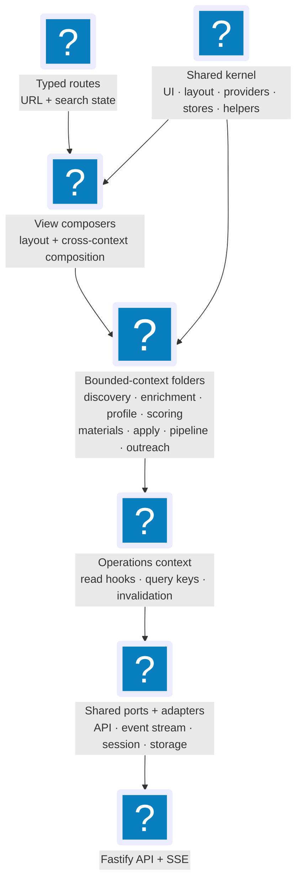

# 3. Strategic Design — Frontend Bounded Contexts

The nine frontend contexts mirroring the backend 1:1, and the view-vs-context
dichotomy. Part of the [Frontend Architecture](index.md) reference.

**Read this if** you need to know which context owns a given hook, component, or
mutation — or why a user-facing page is not itself a context.

A _bounded context_ is a self-contained slice of the domain with its own model
and vocabulary; the backend defines the nine this app mirrors in
[Strategic Design — Bounded Contexts](../domain-model/strategic.md). This page
does not redefine them — it shows how each maps to a folder under
`apps/web/src/contexts/` and how views compose them.

The frontend's contexts are a **conformist** projection of the backend's
contexts (in the DDD sense): the frontend consumes the backend's
ubiquitous language as-is and does not push back against the shape.
There is **one frontend context folder per backend context** — Discovery,
Enrichment, Profile, Scoring, Materials, Apply, Pipeline Orchestration,
Operations, and Contact & Outreach. Views (Dashboard, Jobs, Artifacts, Apply
Review, Runs, Pipelines, Discovery, Contacts, Debug) are **not** contexts; they
are composers that live under `views/` (§3.10, §11).

## 3.1 Frontend Context Map

The diagram reads top-down:

- **Routes** translate URL state into the inputs that views and hooks consume.
- **View composers** (`views/dashboard/`, `views/jobs/`, `views/artifacts/`)
  own cross-aggregate composition and layout. They may call public
  context-owned hooks, but never the API client or query client directly.
- **Frontend bounded contexts** (`contexts/<name>/`) are the canonical
  surface for each backend context; they own their own hooks,
  components, mutations, and (for Operations) read queries.
- **Operations** is the explicit shared read-side kernel: the query-key
  registry, projection-typed read hooks, SSE subscription, and invalidation
  router. Views and aggregate contexts may consume that public read surface;
  no other context owns projection queries, and aggregate contexts do not
  import one another's hooks or stores.
- **Shared kernel** holds primitives, layout, providers, stores,
  formatting helpers, and the **frontend ports** (§6) that abstract the
  API client and event stream.

## 3.2 Job Discovery (Frontend)

**Backend mirror:** Job Discovery (backend domain model [§3.1](../domain-model/strategic.md), [§4.1](../domain-model/tactical.md), [§5.1](../domain-model/ports.md)).

**Purpose:** Surface the user-facing affordances over the `Job` aggregate
and the discovery-source registry — deleting (soft-delete tombstone),
hiding, restoring, and permanently deleting jobs from any view; manually
importing a job by URL; and administering discovery sources, schedules,
quarantine, the manual-capture queue, and discovery feedback.

**Ubiquitous language** (matches backend):

- **Job** — the `Job` aggregate root identified by `(TenantId, JobId)`.
- **JobId** — the system-generated stable identifier (per
  backend domain model [§3.1](../domain-model/strategic.md) / [§4.1](../domain-model/tactical.md)).
- **PostingUrl** — the original source URL.
- **Source** — the board / employer site.
- **Employer** — the hiring company (distinct from `Source`).

**Responsibilities:**

- Wrap the discovery-context write-side endpoints in mutation hooks:
  `useDeleteJobMutation`, `useDeleteJobsBulkMutation`,
  `usePermanentlyDeleteJobsBulkMutation`, `useHideJobsBulkMutation`,
  `useUnhideJobsBulkMutation`, `useRestoreJobMutation`,
  `useRestoreJobsBulkMutation`, and `useImportJobMutation` (import-by-URL;
  a stub that throws `NotImplementedError` until the backend endpoint lands).
- Own discovery-source administration: `useDiscoverySettingsQuery` /
  `useUpdateDiscoverySettingsMutation`, and the product-control mutations
  (`useUpsertDiscoverySourceMutation`, `usePatchDiscoverySourceStateMutation`,
  promote/reject source-locator candidate, quarantine decision,
  manual-capture import/dismiss, discovery feedback, role-match feedback).
- Own the discovery UI panels `<DiscoveryProductControls>` and
  `<DiscoveryRuntimeSettingsPanel>` (composed by `views/discovery/`).
- Own the small inline UI affordances unique to discovery actions
  (delete-confirmation copy, restore toast).

**What it does NOT own:**

- Reading the jobs list (that is `operations/`).
- Stage state transitions beyond delete/restore (that is `pipeline/`).
- Score, materials, or apply concerns.

**Folder rationale.** The folder exists because the backend bounded
context exists and `DeleteJob` / `RestoreJob` / `ImportJob` and the
source-registry use cases are Discovery-context use cases per backend §5.1
— not Operations and not Pipeline. What began as a thin delete/restore
surface has since grown into the full discovery-administration surface
described above; the folder absorbed that growth without restructure.

## 3.3 Job Enrichment (Frontend)

**Backend mirror:** Job Enrichment (backend domain model [§3.2](../domain-model/strategic.md), [§4.2](../domain-model/tactical.md), [§5.2](../domain-model/ports.md)).

**Purpose:** Consume enrichment events into the invalidation router;
surface compensation evidence; and expose manual re-enrichment and
compensation-refresh actions.

**Ubiquitous language** (matches backend):

- **JobEnrichment** — the aggregate (one per Job).
- **EnrichmentAttempt** — child entity, one per try.
- **ExtractionTier** — `json_ld | css_selectors | llm_assisted`.
- **FullDescription**, **ApplicationUrl** — value objects.

**Responsibilities:**

- Register invalidation handlers (in `contexts/enrichment/handlers.ts`,
  wired through `operations/invalidation-router.ts`) for `JobEnriched`,
  `EnrichmentFailed`, `PostingContentSnapshotCaptured` /
  `PostingContentSnapshotFailed`, `JobActiveStateChanged`,
  `ContentDuplicateCandidateDetected`, and `CompensationFactsUpdated`.
- Wrap the compensation-refresh actions in `useRefreshCompensationMutation`
  / `useRefreshAllCompensationMutation`. The manual `EnrichJobUseCase` retry
  hook `useEnrichmentRetryMutation` exists as a **stub** (throws
  `NotImplementedError`) pending its backend endpoint.
- Own the compensation-evidence UI: `<CompensationSummaryCell>`,
  `<CompensationSummaryStrip>`, `<CompensationAuditSection>`, and
  `<RefreshAllCompensationButton>` (composed by the Jobs detail workspace and the
  Apply Review view).

**What it does NOT own:**

- Reading the jobs list / detail (that is `operations/`).
- Scoring, materials, or apply concerns.

**Folder rationale.** The backend context exists and `EnrichJobUseCase`
is a §5.2 use case; the enrichment folder now carries real compensation
UI and refresh mutations (with the manual re-enrichment retry hook still a
stub pending its backend endpoint), and remains the unambiguous home for any
further enrichment-triggered affordance.

## 3.4 Candidate Profile

**Purpose:** Read, edit, and import the candidate profile; manage
application preferences, settings, credentials, and resume template defaults;
preview the rendered resume PDF.

**Ubiquitous language** (matches Candidate Profile):

- **Profile** — the candidate document.
- **Preferences** — application defaults, target-role strategy, tailoring
  controls, and resume-rendering preferences that affect how JobCtrl acts
  for the candidate.
- **ExperienceEntry**, **EducationEntry**, **SkillCategory** — child
  entities.
- **TailoringPolicy**, **WritingStyle**, **ResumeConstraints** — value
  objects.
- **ResumeTemplate** — versioned style/layout configuration for resume PDF
  rendering. Template preview may use profile data for display, but saved
  template payloads contain style/layout only.
- **ResumeImportWizard** — the multi-step flow for importing a profile
  from a resume PDF (frontend-only presentation term; the underlying
  backend use case is `ImportProfileUseCase`).

**Backend mirror:** Candidate Profile (backend domain model [§3.3](../domain-model/strategic.md), [§4.3](../domain-model/tactical.md), [§5.3](../domain-model/ports.md)).

**Responsibilities:**

- Render the profile editor with TanStack Form.
- Drive the resume-import wizard as a **nested route**
  (`/profile/import/upload`, `/profile/import/preview`,
  `/profile/import/confirm`) so each step is bookmarkable and refresh-safe.
  (Resolves §6 question 8.)
- Render the top-level Preferences route (`/preferences`) for application
  defaults, target preferences, AI tailoring controls, and resume style. The
  route edits the same profile/style payloads but keeps those controls out of
  the Profile view, whose UI is reserved for who the candidate is.
- Render the resume-template editor in Preferences, backed by the same Plate
  HTML/CSS profile preview surface and Profile-owned query/mutation hooks for
  template list, version save, and default selection.
- Show the live baseline resume Plate editor by reading generated HTML from a
  `cacheKey`-versioned Profile preview URL derived from the profile mutation
  count (see §4.4.4 for the precise binding pattern).
- Host settings and credentials hooks. Settings and credentials are
  surfaced via peer routes (`/settings`, `/settings/credentials`); their
  hooks and forms live inside `contexts/profile/` because
  `apiClient.settings*` and `apiClient.credentials*` are part of the
  candidate-profile API surface area in `apps/api/`.

**What it does NOT own:**

- Per-job tailored content (that is `materials/`).
- Score breakdown or correction (that is `scoring/`).

## 3.5 Scoring

**Purpose:** Render fit scores, the score breakdown and reasoning, score
staleness, score correction, and rescore actions.

**Ubiquitous language** (matches Scoring):

- **FitScore** — 1–10 integer.
- **ScoreBreakdown** — structured `technicalFit`, `experienceFit`,
  `reasoning`.
- **MatchedKeywords** — ATS keywords matched.
- **ScoreCorrection** — user-provided override (`CorrectScoreUseCase`
  per backend §5.4; shipped via `useCorrectScoreMutation` +
  `<ScoreCorrectionControl>`).

**Backend mirror:** Scoring (backend domain model [§3.4](../domain-model/strategic.md), [§4.4](../domain-model/tactical.md), [§5.4](../domain-model/ports.md)).

**Responsibilities:**

- Provide the scoring render components — `<ScoreBadge>` (jobs table cell
  - detail workspace), `<ScoreReasoning>`, and `<ScoreStalenessBadge>`. `<ScoreBreakdown>`
    is built, tested, and storied but is **not yet composed by any view** (the
    Jobs detail workspace surfaces scoring through `<JobAuditTriage>` →
    `<ScoreCorrectionControl>`); it stays available for wiring.
- Own score-correction and rescore mutations: `useCorrectScoreMutation`
  (shipped) plus `useRescoreJobMutation`, `useRescoreCurrentPolicyMutation`,
  and `useResetStaleScoresForRescoreMutation`, surfaced through
  `<ScoreCorrectionControl>`, `<RescoreJobButton>`,
  `<RescoreCurrentPolicyButton>`, and `<ResetStaleScoresButton>`.
- Own `<CompensationSourcePolicyPanel>` (reads
  `useCompensationSourcePolicyQuery` from Operations).

**What it does NOT own:**

- The generic per-stage `score` retry (that is a `pipeline/` retry-stage
  action); scoring owns the domain-level rescore/correction actions above.
- The fit-score column header in the jobs table (that is `views/jobs/`;
  scoring contributes the cell renderer only).

## 3.6 Materials Generation

**Purpose:** Trigger generation / re-tailoring of resume + cover letter +
PDFs for a given job; observe progress; open generated artifacts in the
OS default app.

**Ubiquitous language** (matches Materials Generation context in
backend domain model [§4.5](../domain-model/tactical.md)):

- **MaterialsSet** — the generation set for one job, identified by
  `(TenantId, JobId, generation)`.
- **Generation** — the version counter on `MaterialsSet`.
- **TailoredResume**, **CoverLetter** — value objects.
- **Artifact** — child entity within `MaterialsSet`; identified by
  `artifactId`.
- **ArtifactStatus** — `candidate | approved | rejected | superseded`.
- **ArtifactType** — `tailored_resume | cover_letter | resume_pdf | cover_letter_pdf`.
- **ValidationResult** — banned-words / fabrication / structural check.
- **JudgeVerdict** — LLM-as-judge evaluation of the tailored resume.

**Backend mirror:** Materials Generation (backend domain model [§3.5](../domain-model/strategic.md), [§4.5](../domain-model/tactical.md), [§5.5](../domain-model/ports.md)).

**Responsibilities:**

- Wrap `apiClient.generateMaterials(jobId, ...)` in a mutation hook.
- Wrap `apiClient.openArtifact(artifactId)` in a mutation hook (artifacts
  are owned by `MaterialsSet`; the OS-open action is materials-context
  surface even though it surfaces in the Artifacts view).
- On `generate` success, do _not_ refetch eagerly — let the SSE stream
  (`ResumeApproved`, `CoverLetterGenerated`, `PdfRendered`,
  `MaterialsExhausted`) drive query-cache invalidation. The mutation
  resolves with `runId`; the UI shows "queued" until the corresponding
  events arrive (§7).

**What it does NOT own:**

- Reading the artifacts list (that is `operations/` —
  `useArtifactsListQuery`, `useArtifactDetailQuery`).
- Apply submission (that is `apply/`; apply consumes the latest
  `MaterialsSet` artifacts).

## 3.7 Apply Automation

**Purpose:** Trigger apply / dry-run for a job; cancel a running apply;
observe an apply run's live event timeline.

**Ubiquitous language** (matches Apply Automation / `ApplyRunProjection`):

- **ApplyRun** — one apply attempt, identified by `(TenantId, RunId)`.
- **DryRun** — apply attempt that does not submit.
- **SubmissionResult** — `applied | failed | captcha | login_issue | expired | manual | dry_run`.
- **ApplyRunEvent** — telemetry event within an apply run.

**Backend mirror:** Apply Automation (backend domain model [§3.6](../domain-model/strategic.md), [§4.6](../domain-model/tactical.md), [§5.6](../domain-model/ports.md)).

**Responsibilities:**

- Mutation hooks: `useApplyJobMutation`, `useDryRunApplyMutation`,
  `useCancelApplyMutation`.
- Render the apply timeline (events, tokens, cost) for a selected apply
  run via `<ApplyRunTimeline>`. Live-update the timeline by subscribing
  to `ApplyRunEventRecorded` events scoped to `runId`.

**What it does NOT own:**

- Reading the apply runs list (that is `operations/` —
  `useApplyRunsListQuery`, derived from the dashboard summary; there is no
  `useApplyRunQuery`). The high-frequency `setQueryData` patching for
  `ApplyRunEventRecorded` mutates `operations/`-owned cache, but the
  routing rule lives in the invalidation router.
- "Mark applied" / "mark skipped" — those are pipeline-state transitions
  per backend §5.7 and live in `pipeline/`.

## 3.8 Pipeline Orchestration

**Purpose:** Render stage state badges; expose stage-management mutations
(retry, cancel, mark-applied, mark-skipped); render the dashboard funnel
detail.

**Ubiquitous language** (matches Pipeline Orchestration):

- **Stage** — `discover | enrich | score | tailor | cover | pdf | apply`.
- **StageState** — discriminated union (Pending, Queued, Running,
  Succeeded, Failed, Blocked, Skipped, Exhausted, Stale, Canceled).
- **NextAction** — recommended action when blocked/failed.
- **AttemptCount** — current attempt index.

**Backend mirror:** Pipeline Orchestration (backend domain model [§3.7](../domain-model/strategic.md), [§4.7](../domain-model/tactical.md), [§5.7](../domain-model/ports.md)).

**Responsibilities:**

- Provide `<StageBadge state={...} />` (exhaustive `switch` on
  `state.kind`) and `<StageTimeline stages={...} />`.
- Provide `<JobActions jobId={...} />` toolbar composer assembling
  per-stage / per-action buttons across pipeline + materials + apply
  contexts.
- Mutations: `useRetryStageMutation`, `useCancelStageMutation`,
  `useMarkAppliedMutation` (`MarkAppliedUseCase` per backend §5.7),
  `useMarkSkippedMutation` (`SkipJobUseCase` per backend §5.7).
- Render the funnel widget on the dashboard (composed from
  `DashboardProjection.funnel`).
- Render the **copyable CLI command** for any stage's `nextAction` via
  `<CopyableCommand command={stage.nextAction} />` from `shared/ui/`.
  This preserves the affordance recorded in `docs/decisions.md` (2026-05-03):
  _"copyable commands stay; buttons use structured actions."_ Buttons
  call mutation hooks (structured); the copyable strip remains for
  transparency and manual debugging.

**What it does NOT own:**

- Apply submission (that is `apply/`; apply is a stage but its UI
  affordance is a domain action, not a stage transition button).
- Score correction (that is `scoring/`).

## 3.9 Operations / Read-Side

**Purpose:** Provide the read-side kernel to all other contexts and
views: the query client, query-key registry, projection-typed hooks, and
the SSE subscription that fans events out to invalidate query keys.

**Ubiquitous language** (matches Operations / Read-Side):

- **Projection** — denormalized read shape (`JobListProjection`,
  `JobDetailProjection`, `DashboardProjection`, `ArtifactListProjection`,
  `ApplyRunProjection`).
- **EventStream** — the SSE channel publishing `DomainEvent`s.
- **InvalidationRouter** — pure function that maps an incoming event to
  the set of query keys to invalidate.
- **QueryKeyRegistry** — the aggregation of every query-key factory,
  exported from `contexts/operations/queryKeys.ts`. Today it re-exports 17
  factories: the read-side ones owned locally by Operations (`jobsKeys`,
  `artifactsKeys`, `dashboardKeys`, `applyRunsKeys`, `applyReviewKeys`,
  `activityKeys`, `outcomesKeys`, `workflowRunsKeys`, `healthKeys`,
  `compensationKeys`) plus each aggregate context's own factory
  (`profileKeys`, `discoveryKeys`, `enrichmentKeys`, `scoringKeys`,
  `materialsKeys`, `applyKeys`, `pipelineKeys`).

**Backend mirror:** Operations / Read-Side (`apps/api/src/projections.ts`,
`workers/automation/.../infrastructure/projections/`).

**Responsibilities:**

- Configure the `QueryClient` (defaults: `staleTime`, `gcTime`, retry
  policy, error handler).
- Mount the `<EventStreamProvider />` that opens the SSE connection on
  application start, scoped by `TenantId`.
- Implement the **invalidation router** that consumes events and calls
  `queryClient.invalidateQueries({ queryKey })` (or `setQueryData(...)`
  for high-frequency events).
- Own _all_ projection-typed read hooks. The core set:
  `useDashboardSummaryQuery`, `useJobsListQuery`, `useJobDetailQuery`,
  `useArtifactsListQuery`, `useArtifactDetailQuery`, `useApplyRunsListQuery`,
  `useActivityListQuery` / `useActivityEventQuery`,
  `useWorkflowRunsListQuery` / `useWorkflowRunDetailQuery`,
  `useApplyReviewQueueQuery`, `useResumeReviewDraftQuery`,
  `useApplicationOutcomesQuery` / `useJobApplicationOutcomesQuery`,
  `useCompensationSourcePolicyQuery`, `useHealthQuery`, and the
  discovery-product-control read hooks in `useDiscoveryProductControlsQuery`
  (source registry, source-locator candidates, source preview, quarantine,
  manual-capture queue, role-match feedback). Note there is **no**
  standalone `useApplyRunQuery`: apply-run detail is not yet a dedicated
  endpoint, so `useApplyRunsListQuery` derives runs from the dashboard
  summary via `select`, and per-run live events are patched onto
  `applyRunsKeys.detail(...)` by the invalidation router (§7.5).
- Re-export projection and API response types (sourced from
  `@jobctrl/domain-types` via `@jobctrl/contracts`) through
  `contexts/operations/types.ts` so feature contexts and views can import
  them from one place. (This is the frontend Anti-Corruption Layer — §6.5.)

**What it does NOT own:**

- Any feature UI. Operations is pure infrastructure code: hooks, types,
  router.
- Any mutation. Mutations are owned by the aggregate context they
  correspond to (Discovery, Materials, Apply, Pipeline, Profile).

## 3.10 Views (Composition Layer — NOT Bounded Contexts)

The `views/` folder holds the sibling composers of `contexts/`, including
`dashboard/`, `jobs/`, `artifacts/`, `apply-review/`, `runs/`,
`pipelines/`, `discovery/`, `outreach/`, and `debug/`. They are _not_ bounded contexts;
they are presentation composers. The dichotomy is intentional and binding:

- A **context** owns a slice of the backend's domain language and the
  hooks/components that surface it. It maps 1:1 to a backend bounded
  context.
- A **view** owns layout, composition, and view-local ephemeral UI state
  (e.g., bulk-selection sets that intentionally do not survive
  navigation). It imports hooks from `contexts/operations/` and
  components/mutations from aggregate contexts.

**View → context dependency direction is one-way.** A view depends on
contexts; a context never depends on a view. A view never depends on
another view (cross-view navigation goes through the URL).

**The views:**

| View                  | Composition                                                                                                                                                                                                                                                                                                                                                                                                                                                                           |
| --------------------- | ------------------------------------------------------------------------------------------------------------------------------------------------------------------------------------------------------------------------------------------------------------------------------------------------------------------------------------------------------------------------------------------------------------------------------------------------------------------------------------- |
| `views/dashboard/`    | `<KpiGrid>`, `<ConversionPanel>`, `<Funnel>`, `<SourceHealthCard>`, `<ApplyRunsCard>` (operations: `useDashboardSummaryQuery`), plus an outcome-suggestions section (operations: `useApplicationOutcomesQuery`; apply: `<OutcomeSuggestionsPanel>`). Funnel/ApplyRunsCard compose pipeline `<StageBadge>` and apply `<ApplyRunBadge>`.                                                                                                                                                |
| `views/jobs/`         | `<JobsTable>` (operations: `useJobsListQuery`; column cells use `<ScoreBadge>`/`<StageBadge>`; product filters bind to URL state), `<JobBulkActions>` (discovery: delete / hide / restore / permanent-delete bulk mutations), legacy-named `<JobDetailDrawer>` rendered as a full `RouteWorkspace` (composes `<JobOverview>` + `<JobActions>` + `<StageTimeline>` + artifact status rows + `<EmployerAnalysisPanel>` + `<ApplyHistory>` + `<JobOutcomePanel>` + `<JobAuditHistory>`). |
| `views/artifacts/`    | `<ArtifactsTable>` (operations: `useArtifactsListQuery`), `<ArtifactFilterBar>` (URL-bound), `<ArtifactDetailPanel>` (operations: `useArtifactDetailQuery`; materials: `useOpenArtifactMutation`, `<TailoringExplanationSection>`).                                                                                                                                                                                                                                                   |
| `views/apply-review/` | `<ApplyReviewView>` — the human apply-approval workstation. Left pane is the review queue (operations: `useApplyReviewQueueQuery`); right pane composes the live Plate resume editor (`<ResumePlateEditor>` from materials, wired to the apply-context draft/comment/reply/render mutations via `useResumeReviewDraftQuery`), grounding-risk + requirement audit panels, `<ApplyReviewDecisionControls>`, and `<CancelApplyButton>`.                                                  |
| `views/runs/`         | `<RunsView>` — unified workflow-runs browser. `<RunsTable>` (operations: `useWorkflowRunsListQuery`), `<RunsFilterBar>` (URL-bound), per-row `<CancelWorkflowRunButton>` ("Stop") and a Temporal Web-UI deep link; legacy-named `<WorkflowRunDrawer>` renders a full detail workspace at `/runs/$runId`.                                                                                                                                                                              |
| `views/pipelines/`    | `<PipelinesView>` — reads `usePipelineOperationsQuery`, passes the typed snapshot into the pipeline context's `<PipelineOperationsWorkspace>`, and composes `<StageTriggerPanel>` (global/batch stage triggers + `<CancelWorkflowRunButton>`). The workspace renders summary, source/reconciliation progress, worker capacity, the scoped stage ledger, active work, and pipeline actions.                                                                                            |
| `views/discovery/`    | `<DiscoveryView>` — stacks `<TargetSearchSettingsPanel>` + `<DiscoveryAutomationSettingsPanel>` (profile), `<DiscoveryRuntimeSettingsPanel>` + `<DiscoveryProductControls>` (discovery).                                                                                                                                                                                                                                                                                              |
| `views/debug/`        | `<DebugActivityTable>` (operations: `useActivityListQuery`), `<DebugFilterBar>` (URL-bound), legacy-named `<ActivityDetailDrawer>` rendered as a full detail workspace at `/activity/$eventId`.                                                                                                                                                                                                                                                                                       |
| `views/outreach/`     | `<OutreachView>` — the Contacts page. `<OutreachTable>` (outreach reads; provenance-summary + role-status cells), legacy-named `<OutreachDetailDrawer>` rendered as a full detail workspace (renders provenance for every fact and composes the outreach context's `<OutreachThreadPanel>` for draft review) at `/outreach/$contactId`. The outreach context's `<JobContactsPanel>` also composes into the Jobs detail workspace.                                                     |

**The view's only owned components are layout and view-local affordances**
(filter bar, bulk-action toolbar). All cell renderers, status components, detail workspaces,
forms, and timelines are imported from the contexts that own them.

## 3.11 Contact & Outreach (Frontend)

**Backend mirror:** Contact & Outreach (backend domain model [§3.11](../domain-model/strategic.md), [§4.9](../domain-model/tactical.md), [§5.9](../domain-model/ports.md)).

**Purpose:** Surface the `Contact` aggregate — keep recruiter / hiring-manager /
referrer contact records per company or application, render every fact with its
provenance, and import contacts from a CSV file — plus supervised research
(Phase 2) and the truthful outreach draft **review** surface (Phase 3). There is
**no sending** in the UI: drafts terminate at an approved, copyable message, and
the product never sends.

**Ubiquitous language** (matches backend):

- **Contact** — the `Contact` aggregate identified by `(TenantId, ContactId)`.
- **ContactAttribute** — one fact (name, title, email, phone, profile URL, note) with mandatory provenance.
- **ContactFactProvenance** — `sourceKind` / `sourceRef` / `captureMethod` / `capturedAt` / `confidence` / `userConfirmed`.
- **ContactRole** — `recruiter | hiring_manager | referrer | warm_intro | other`.

**Responsibilities:**

- Contact read hooks, context-owned (mirroring how Profile owns `useProfileQuery`): `useContactsListQuery`, `useContactDetailQuery`.
- Contact mutation hooks via `createOptimisticMutation` with real patchers + settle sets: `useCreateContactMutation`, `useUpdateContactMutation`, `useDeleteContactMutation`, `useImportContactsMutation`.
- Query keys: `outreachKeys` (hierarchical, tenant-first), re-exported through `contexts/operations/queryKeys.ts`.
- Handlers: `contexts/outreach/handlers.ts`, registered in the invalidation router.
- Forms & store: TanStack Form + Zod `safeParse` (`contact-form`, `contact-import-wizard`); a Zustand `persist` store (`outreach-import-store`, key `jh:outreach-import`) for the multi-step CSV-import wizard.
- Components: `<ContactRoleBadge>` (legacy-named compact role status), `<ContactProvenanceList>` / `<ContactProvenanceSummary>` (render provenance for every fact — INV-2), the create / edit / delete / import buttons, and `<JobContactsPanel>` (composed into the Jobs detail workspace).
- Outreach draft read + mutation hooks (Phase 3): `useOutreachThreadQuery`; `useGenerateDraftMutation`, `useReviseDraftMutation`, `useApproveDraftMutation`, `useRejectDraftMutation` (via `createOptimisticMutation` with real patchers + settle sets).
- Draft review components (Phase 3): `<OutreachThreadPanel>` (the review surface), `<DraftGateResultsPanel>`, `<DraftClaimProvenanceList>`, `<DraftStatusBadge>`, the `<GenerateDraftButton>` / `<ApproveDraftButton>` / `<RejectDraftButton>` / `<CopyDraftButton>` actions, and the `revise-draft-form`.
- Send-log + follow-up hooks (Phase 4): `useDueFollowUpsQuery`; `useLogSendMutation`, `useScheduleFollowUpMutation`, `useCompleteFollowUpMutation`, `useDismissFollowUpMutation` (via `createOptimisticMutation` with real patchers — `markThreadSentInThread` / `setThreadFollowUpInThread` — + settle sets that include `dueFollowUps`).
- Send-log + follow-up components (Phase 4): the `send-log-form` (records a user-attested send — copy makes clear the user sends externally and this only records the fact), `<OutreachSendLogList>` (send history), `<FollowUpPanel>` (schedule / complete / dismiss), and `<DueFollowUpsPanel>` / `<DueFollowUpsBadge>` (the surfaced due-follow-ups list + count, composed into `<OutreachView>`). There is still no send affordance — logging records a fact (INV-1).

**What it does NOT own:**

- Job / dashboard / artifact / apply-run projections (those stay in `operations/`).
- Any send/transport affordance — none exists; a thread becomes "sent" only through a user-attested send log the user records (INV-1).

**Audit rendering:** the contact list and detail render provenance for every
stored fact (INV-2); attribute values reach the UI only through the read DTOs and
never leave the local machine.

**Outreach draft review (Phase 3):** `<OutreachThreadPanel>` (composed into the
full contact detail workspace by legacy-named `views/outreach/OutreachDetailDrawer.tsx`) is the draft
review surface. It shows the current **approved** draft prominently, the latest
**candidate** under review with its `<DraftGateResultsPanel>` (the persisted
truthfulness-gate outcome) and `<DraftClaimProvenanceList>` (claim → fact
bindings), and the full **generation history** so a re-draft never hides a prior
generation (INV-5). Approve stays disabled until the gates pass; editing opens the
`revise-draft-form`, which submits a new generation that re-runs the gates.
**Copy-to-send goes through the `ClipboardPort`** (`usePorts().clipboard`, via
`<CopyDraftButton>`, enabled only for an approved draft) — a user-initiated
clipboard write, never `navigator.clipboard` directly and never a network send.
There is no send action anywhere (INV-1).

---
