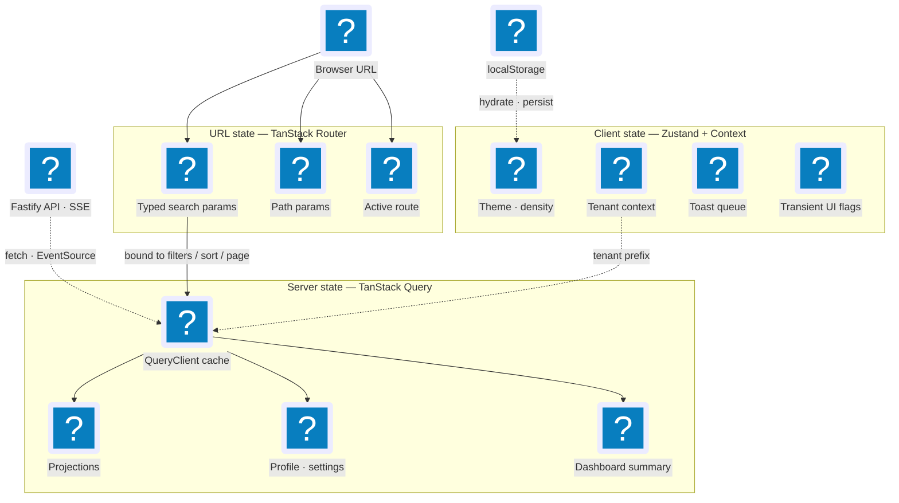

# Frontend Architecture

The canonical frontend architecture the `apps/web` implementation realises (see
`docs/plans/implemented/2026-05-06-frontend-tanstack-migration.md`). Section
numbering (§1–§15) is preserved across the subpages because conventions and
reviews cite it.

Three ideas carry the whole design:

- **Three layers of state.** Every value lives in exactly one home — the server
  cache, the URL, or a small client-side store — so there is never ambiguity
  about where a piece of state belongs (§2.1).
- **Nine contexts, mirrored from the backend.** The web app is divided into the
  same nine bounded contexts the backend uses, one-for-one, so a feature and
  the backend contract behind it share a single vocabulary (§2.2).
- **Views compose; contexts own.** The pages you see (the dashboard, the jobs
  table) are _views_ that only arrange the pieces; the _contexts_ own the data,
  hooks, and behaviour — and the two never blur (§3.10).

**Reading path.** Read top to bottom for the first pass; each page answers one
question:

1. **[Bounded Contexts](contexts.md)** (§3) — What are the nine contexts, and
   how do views compose them into pages?
2. **[Folder Structure](structure.md)** (§11) — Where does each file live under
   `apps/web/src`?
3. **[Context Patterns](patterns.md)** (§4) — How do I write a query, mutation,
   form, or table inside a context?
4. **[State & Ports](state-and-ports.md)** (§5–6) — Which layer owns a value,
   and how does feature code reach the network without touching it directly?
5. **[Realtime (SSE)](realtime.md)** (§7) — How do live backend events refresh
   the screen?
6. **[Integration & Evolution](integration.md)** (§8–9) — How does a change in
   one context fan out to the others, and what is the cloud-mode path?
7. **[Testing](testing.md)** (§10) — What do I test, and at which layer of the
   pyramid?
8. **[Risks & Glossary](reference.md)** (§12–15) — What can go wrong, and what
   does a given term mean?

## 1. Purpose & Non-Goals

### Purpose

This document defines the **canonical architecture** for the
JobCtrl web frontend (`apps/web`). It is the architectural twin of
[backend domain model](../domain-model/index.md) — where the backend models bounded
contexts, aggregates, ports, and adapters for the Python worker and the TS
API, this doc models the React/TypeScript single-page application that sits
in front of them.

The frontend is organized around TanStack Router, TanStack Query, TanStack
Table, TanStack Form, the shadcn Rhea preset over Base UI, context-owned hooks/components,
and an SSE-fed invalidation router. This document describes the implemented
architecture and the hosted-future extension points that must stay intact as the
web app evolves.

This doc is the authoritative reference for:

- The **three layers of state** (server, URL, client) and the rules that
  decide what goes where.
- **Frontend bounded contexts** that mirror the backend's nine contexts and
  share the same ubiquitous language end-to-end.
- **Frontend ports** — the hexagonal seams that decouple feature code from
  the API client, the event stream, persistence, and the host environment.
- **Query-key conventions, route shapes, hook conventions, form patterns,
  primitives** per bounded context.
- **Realtime architecture** — the SSE consumer pattern and the
  `GET /v1/events/stream` endpoint contract that `apps/api/` must expose for
  the frontend to consume.
- **Cross-context invalidation** — how a mutation in one context fans out to
  query-cache invalidations in others, and how SSE events drive the same fan-out.
- **Cloud evolution paths** with explicit **fitness functions** (TanStack
  Start for SSR, AuthProvider for hosted auth, multi-tenant query-key
  prefixing, audit-log streaming, RSC, CDN-cached projection reads).
- **The testing pyramid** — Vitest + React Testing Library + MSW for
  hooks/components, Playwright for end-to-end critical flows, Storybook for
  component-driven development.
- **The folder shape**, mirrored to backend bounded contexts.

Every choice includes rationale so a senior frontend engineer joining the
project can re-derive the decision independently.

**Cloud is the eventual target.** The frontend, like the backend, is built
local-first but designed for hosted multi-tenant deployment. `TenantId` is
first-class in the frontend domain language; local mode uses singleton
`LOCAL_TENANT`, and hosted mode will resolve it from auth context. Section 9
names every cloud adapter with a fitness function — it is not "compatibility,"
it is the target deployment model.

### Non-Goals

- **Project history.** This document does not prescribe delivery ordering, file
  moves, PR sequencing, or cutover scripts. Plan records live under
  `docs/plans/`.
- **Implementation listing.** Pseudocode and TypeScript signatures appear where
  they aid clarity; this document is not a generated inventory of production
  `.tsx`, tests, package scripts, or Vite configuration.
- **Delivery sequencing.** This document models the architecture, not branch
  order, rollout sequencing, or dual-mount compatibility paths.
- **Visual design / copy / iconography choices.** This doc constrains the
  _primitives_ (owned shadcn/Rhea wrappers over Base UI) and the _layout system_ (Tailwind), not
  the visual identity, design tokens, or copy.
- **Accessibility audits beyond primitive defaults.** Base UI supplies the
  low-level semantics, focus management, and keyboard behavior, while JobCtrl
  owns every copied wrapper and its composition tests. Broader audits remain out of scope
  in this doc — though the testing strategy (§10) names where accessibility
  assertions live when they are added.
- **Internationalization (i18n).** Single-user, English-only. The doc does
  not name a string-extraction library or a locale provider. The
  `@jobctrl/contracts` boundary is where translation would later wrap.
- **Native / mobile / desktop wrappers.** The architecture targets a browser
  SPA. A Tauri / Electron wrapper is _not_ an architectural decision this
  doc preempts: every I/O path goes through a port (§6), and `OpenInOsPort`
  already absorbs the OS-integration concern, so a future Tauri wrap is
  unblocked by construction. No fitness function is documented because the
  architecture's only "Tauri" obligation is "do not preempt it" — and that
  obligation is already discharged by the port discipline.
- **Deployment topology.** CDN choice, asset hosting, build pipeline — these
  are infrastructure concerns. The doc names what the frontend _needs_ from
  hosting (cache headers for chunks, presigned-URL access to artifacts) but
  does not specify the hosting platform.
- **Performance budgets.** Bundle-size targets, TTI thresholds, and
  Lighthouse scores live in QA gates, not here.

---

## 2. Modeling Principles

### 2.1 The Three Layers of State

Every piece of state in the application lives in **exactly one** of three
layers. Mixing layers is the single largest source of complexity in the
current `App.tsx`. The target architecture enforces strict separation.

| Layer            | Owner                                 | Lifetime                                                         | What lives here                                                                                                                                   |
| ---------------- | ------------------------------------- | ---------------------------------------------------------------- | ------------------------------------------------------------------------------------------------------------------------------------------------- |
| **Server state** | TanStack Query cache                  | Until invalidated or GC'd                                        | Anything fetched from `apps/api/` — projections, profile, settings, credentials, dashboard summary.                                               |
| **URL state**    | TanStack Router (typed search params) | The current URL                                                  | Anything bookmarkable / shareable / restorable on refresh — current view, filters, sort order, page index, page size, and selected detail record. |
| **Client state** | Zustand stores + React context        | Process lifetime (with `localStorage` persist where appropriate) | Theme, density, desktop navigation expansion, tenant context, transient UI like toast queue, ephemeral form drafts that do not survive navigation. |

**Rules:**

1. **No server data in `useState`.** If it came from the API, it lives in
   the Query cache. Period.
2. **No filter / pagination / sort / detail-route state in `useState`.** If
   refreshing the page should preserve it, it lives in a typed search param.
3. **No durable user preferences in component-local state.** Theme, density,
   desktop navigation expansion, and similar belong in Zustand with `persist`
   middleware.
4. **One source of truth per fact.** A field never lives in two layers
   simultaneously. URL state binds the fetch parameters; the cache owns the
   fetched result; the component reads both via hooks.
5. **Components consume state through hooks, never raw stores.** Every
   layer exposes domain hooks (`useJobsQuery(filters)`,
   `useJobsSearch()`, `useTheme()`). Components do not import the
   `QueryClient`, the router store, or a Zustand store directly.

The current `App.tsx` violates all five rules. The target eliminates these
violations by construction: the layer separation makes a violation
syntactically obvious in code review.

### 2.2 Bounded-Context Mirroring

The frontend folder structure, ubiquitous language, and query-key
factories **mirror the backend's nine bounded contexts** defined in
backend domain model [§3](../domain-model/strategic.md) — one frontend folder per backend context, no
substitutions, no inventions:

| Backend context        | Frontend folder        | Hooks / components owned by the context                                                                                                                                                                                                                                                                                                 | View surfaces (composers) where it appears                                                 |
| ---------------------- | ---------------------- | --------------------------------------------------------------------------------------------------------------------------------------------------------------------------------------------------------------------------------------------------------------------------------------------------------------------------------------- | ------------------------------------------------------------------------------------------ |
| Job Discovery          | `contexts/discovery/`  | Job lifecycle mutations (delete / hide / unhide / restore / permanent-delete, bulk), worker-backed immediate `useImportJobMutation`, discovery-settings + source-registry / quarantine / manual-capture / feedback mutations; `<DiscoveryProductControls>`                               | Jobs view (bulk controls + URL import), Discovery view (source + schedule admin)                        |
| Job Enrichment         | `contexts/enrichment/` | `useEnrichmentRetryMutation` (stub — throws `NotImplementedError` until the backend endpoint lands), `useRefreshCompensationMutation` / `useRefreshAllCompensationMutation`; compensation-evidence components; enrichment/compensation invalidation handlers                                                                            | Jobs view + Apply Review (compensation audit)                                              |
| Candidate Profile      | `contexts/profile/`    | `useProfileQuery`, `useUpdateProfileMutation`, `useImportResumeMutation`, settings + credentials hooks, profile-import wizard store                                                                                                                                                                                                     | `/profile`, `/settings` routes                                                             |
| Scoring                | `contexts/scoring/`    | `<ScoreBadge>`, `<ScoreStalenessBadge>` (plus `<ScoreBreakdown>`, built/tested but not yet composed by a view); `useCorrectScoreMutation` (shipped), `useRescoreJobMutation` / `useRescoreCurrentPolicyMutation`, `useResetStaleScoresForRescoreMutation`                                                                               | Jobs view (score column + audit-triage detail workspace + rescore/correct)                 |
| Materials Generation   | `contexts/materials/`  | `useGenerateMaterialsMutation`, `useOpenArtifactMutation` (artifacts are owned by `MaterialsSet`)                                                                                                                                                                                                                                       | Jobs view (Generate button), Artifacts view (open in OS)                                   |
| Apply Automation       | `contexts/apply/`      | `useApplyJobMutation`, `useDryRunApplyMutation`, `useCancelApplyMutation`, `<ApplyRunTimeline>`, `<ApplyButton>`, `<ApplyHistory>`                                                                                                                                                                                                      | Jobs view (per-row + run detail workspace), Dashboard view (continuous apply-runs section) |
| Pipeline Orchestration | `contexts/pipeline/`   | `useRetryStageMutation`, `useCancelStageMutation`, `useMarkAppliedMutation`, `useMarkSkippedMutation`; `<StageBadge>`, `<StageTimeline>`, `<JobActions>`                                                                                                                                                                                | Jobs view, Dashboard view (funnel)                                                         |
| Operations / Read-Side | `contexts/operations/` | All projection-typed read hooks (`useDashboardSummaryQuery`, `useJobsListQuery`, `useJobDetailQuery`, `useArtifactsListQuery`, `useArtifactDetailQuery`, `useApplyRunsListQuery`, `useWorkflowRunsListQuery`, `useApplyReviewQueueQuery`, activity/outcomes/health reads, …); query-key registry; SSE subscription; invalidation router | Every view (provider of all read data)                                                     |
| Contact & Outreach     | `contexts/outreach/`   | `useContactsListQuery`, `useContactDetailQuery`, create / update / delete / import-contact optimistic mutations, `outreachKeys`, contact provenance + role components, `<JobContactsPanel>`, contact event handlers                                                                                                                     | Contacts view (`/outreach`) + Job Detail workspace contacts section                        |

**Views are NOT bounded contexts.** The user-facing surfaces are _view
composers_ under `views/` (sibling of `contexts/`, see §11), including
`dashboard/`, `jobs/`, `artifacts/`, `apply-review/`, `runs/`, `pipelines/`,
`discovery/`, `outreach/`, and `debug/`. Each consumes read hooks
from `contexts/operations/` plus mutation hooks from the appropriate
aggregate contexts. Naming the list-and-route-workspace
surface "Jobs" matches user vocabulary; the _bounded contexts_ it spans
are Discovery, Enrichment, Scoring, Materials, Apply, Pipeline, and
Operations — every one of which already exists as its own folder. The
backend's `JobListView`, `JobDetailView`, `ArtifactListView`, and
`DashboardSummary` are **projections of the Operations context** per
backend domain model [§3.8](../domain-model/strategic.md) — they are read shapes that flow through
`contexts/operations/`; promoting them to "frontend bounded contexts"
would be an ontological category error.

**Why mirror.** When the backend says "JobScored" and the frontend says
"score updated," the team carries two glossaries. When both say
"JobScored" the team carries one. The cost of agreement is a few extra
folders (including `discovery/` and `enrichment/`, which expose minimal
surface today but are kept as folders to make their existence — and
their place in the integration map — discoverable). The benefit is
end-to-end ubiquitous language and a one-to-one mapping between every UI
feature and the backend contract that powers it.

**The frontend invents no new domain language.** A "tab" or "view" is a
_presentation_ concept; it never replaces a domain term. The Jobs tab
_displays_ `JobListProjection` rows produced by the Operations context
on top of the canonical aggregates owned by Discovery, Enrichment,
Scoring, Materials, Apply, and Pipeline. The view file lives at
`views/jobs/JobsView.tsx`; its data hook is
`useJobsListQuery()` from `contexts/operations/`; its delete-button
mutation is `useDeleteJobMutation()` from `contexts/discovery/`; its
score badge is `<ScoreBadge>` from `contexts/scoring/`; its stage badge
is `<StageBadge>` from `contexts/pipeline/`. The composition is in the
view; the language stays domain.

**View composition pattern.** A view file imports public _components_ and
_hooks_ from contexts and assembles them. It does not own query keys, mutations,
or state stores beyond ephemeral UI (bulk-selection set, etc.), and it never
calls the API client or query client directly. Operations is the explicit
read-side kernel exception: aggregate contexts may consume its projection
types, keys, and read hooks for context-owned presentation. They do not import
another aggregate context's hooks or stores. Cross-aggregate coordination
happens in either (a) the view that composes them or (b) the invalidation router
(§7.4) for cache fan-out.

### 2.3 Evolutionary Architecture (Frontend Edition)

The same meta-principle that governs the backend (see the backend domain model [§2](../domain-model/index.md))
governs the frontend: **cloud-mode adapters are named-not-built; local-mode
stays simple but every choice has a clear seam.**

> Evolutionary architecture means the next adapter is _named_ (so the team
> knows what swap is coming and the seam is shaped for it), not _built_
> (so the codebase carries no speculative complexity). Adapter swaps keep one
> active implementation per seam unless an explicit compatibility path is part
> of the product contract.

| Principle                                   | How the frontend applies it                                                                                                                                                                                                                                                      |
| ------------------------------------------- | -------------------------------------------------------------------------------------------------------------------------------------------------------------------------------------------------------------------------------------------------------------------------------- |
| **Name the evolution, do not pre-build it** | Every frontend port (§6) names a hosted adapter with concrete technology (e.g., `EventStreamPort` → `SseEventStreamAdapter` today, `WebSocketEventStreamAdapter` if SSE proves limiting). The hosted adapter is documented but not implemented until its fitness function fires. |
| **Local-mode adapters stay simple**         | The local `ApiClientAdapter` does not carry tenant-resolution-from-JWT logic, retry-with-backoff with circuit breaking, or distributed tracing. It accepts `TenantId` as input, calls fetch, and returns the parsed body. Cloud machinery is absent until needed.                |
| **Fitness functions trigger evolution**     | Every cloud claim in §9 has a concrete, testable trigger ("when the dashboard load latency exceeds 200 ms p50 with cold cache" → SSR / TanStack Start; "when more than one user can sign in" → AuthProvider). Calendar dates do not trigger evolution.                           |
| **Independent context evolution**           | Each frontend context can swap its query-cache strategy, its primitives, or its event subscription without touching the others. A spike on virtualized tables in `views/jobs/` does not affect `contexts/profile/`.                                                              |

### 2.4 Data-Orientation (Hickey / Wlaschin)

The Python and TypeScript domain layers already follow data-orientation:
immutable values, discriminated unions for state, pure functions for
transforms (backend domain model [§2](../domain-model/index.md)). The frontend extends the same
discipline:

- **Immutable values over mutable objects.** Every projection type
  (`JobListProjection`, `DashboardProjection`, etc.) is `readonly` end to
  end. Component state derived from a projection is also `readonly`. No
  mutating array methods on cached data.
- **Make illegal states unrepresentable.** `StageState` is already a
  discriminated union in `@jobctrl/domain-types/pipeline.ts`. The
  frontend uses **exhaustive `switch`** on `state.kind` to render stage
  badges; an unhandled state is a TypeScript error at compile time, not a
  runtime fallback.
- **Pure functions transform data.** Selectors that derive
  presentation-shaped data from projections (e.g., grouping artifacts by
  job) are **pure functions** in `selectors.ts` files. They are unit-tested
  in isolation; they have no React dependency; they compose.
- **No data-binding via mutation.** Forms (TanStack Form) accept the
  current value and emit a new value; they never mutate a `useState` array
  in place. The Materials Generation flow does not "mark the job as
  re-tailored" by patching a cached row — it fires a mutation that the SSE
  stream invalidates.

### 2.5 Strict TypeScript

The repo already uses TypeScript ^6 with strict mode (`apps/web/tsconfig.json`
extends the workspace base). The target frontend goes further:

- **`exactOptionalPropertyTypes: true`.** Optional fields are not
  silently assignable to `undefined`; absence and presence are distinct.
- **`noUncheckedIndexedAccess: true`.** Every `arr[i]` is `T | undefined`
  in the type system; bug class eliminated.
- **No `any` in feature code.** Adapter boundaries (e.g., the response of
  `fetch` before parsing) are `unknown`; everything inside a context is
  fully typed.
- **Route-level Zod schemas.** Every route's typed search params are
  declared with a Zod schema; the search-param type is _inferred_ from the
  schema, never declared by hand. (Resolves §6 question 13.)
- **`@jobctrl/domain-types` is the source of truth.** No domain shape is
  re-declared in `apps/web/`. If `JobListProjection` changes, the frontend
  rebuilds against the new type and the compiler points at every mismatch.

---
