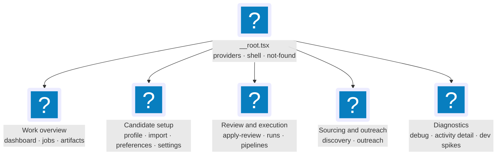

# 4. Tactical Design — Per-Context Patterns

Query keys, mutation/invalidation patterns, forms, tables, and stores per
context. Part of the [Frontend Architecture](index.md) reference.

**Read this if** you are writing code inside a context and need the house style
for a query, mutation, route, form, table, or store.

This section defines the common patterns each context follows: query
keys, route shapes, hook conventions, primitives, forms.

**The patterns at a glance:**

- [§4.1 Query-Key Convention](#_4-1-query-key-convention) — one tenant-first key factory per context.
- [§4.2 Hook Conventions](#_4-2-hook-conventions) — components call context hooks, never the API client or `QueryClient` directly.
- [§4.3 Route Shapes](#_4-3-route-shapes-tanstack-router-file-based) — file-based TanStack Router with Zod-typed search params.
- [§4.4 Per-Context Tactical Spec](#_4-4-per-context-tactical-spec) — the routes / queries / mutations / components table for each backend context.
- [§4.5 View Composition](#_4-5-view-composition) — how views assemble context pieces and bind the shared data grid.
- [§4.6 Forms Convention](#_4-6-forms-convention-tanstack-form) — TanStack Form + Zod, one schema for both the form and the request body.
- [§4.7 Component Primitives](#_4-7-component-primitives-shadcn-ui) — shadcn's Rhea/Base preset (Base UI + Tailwind), copied into `shared/ui/` and owned.
- [§4.8 Styling](#_4-8-styling-—-tailwind-css) — Tailwind CSS 4, CSS-first tokens, `data-theme` dark mode.
- [§4.9 Cross-Cutting Client State](#_4-9-cross-cutting-client-state-zustand-vs-context) — React context for stable identities, Zustand for everything mutable.
- [§4.10 Theme & Density](#_4-10-theme-density-resolved-§6-question-6) — a single persisted Zustand store as the source of truth.
- [§4.11 Error Handling](#_4-11-error-handling-resolves-§6-question-11) — global toast, per-mutation `onError`, and route error boundaries.

## 4.1 Query-Key Convention

**Decision (resolves §6 question 4):** Use the **factory pattern**, one
factory per context, with **`TenantId` as the first segment** of every
query key (resolves §6 question 10).

```ts
// contexts/operations/jobsKeys.ts — Operations owns read-side keys
export const jobsKeys = {
  all: (tenantId: TenantId) => ["tenant", tenantId, "jobs"] as const,
  lists: (tenantId: TenantId) =>
    [...jobsKeys.all(tenantId), "list"] as const,
  list: (tenantId: TenantId, filters: JobsListInput) =>
    [...jobsKeys.lists(tenantId), filters] as const,
  details: (tenantId: TenantId) =>
    [...jobsKeys.all(tenantId), "detail"] as const,
  detail: (tenantId: TenantId, jobId: JobId) =>
    [...jobsKeys.details(tenantId), jobId] as const,
};
```

**Why factory.** The flat-string approach (`['jobs', 'list', filters]`) is
the textbook QueryClient idiom for trivial apps and breaks down at the
first cross-context invalidation. With factories:

- **Type-safe.** `jobsKeys.list(tenantId, filters)` cannot be called with
  `filters` of the wrong shape; refactoring `JobsListInput` propagates
  through every callsite.
- **Hierarchical invalidation by construction.** Invalidating
  `jobsKeys.lists(tenantId)` invalidates *every* list with any filter —
  exactly what a `JobScored` event needs. Invalidating
  `jobsKeys.detail(tenantId, jobId)` invalidates one row's detail.
  Invalidating `jobsKeys.all(tenantId)` nukes the context.
- **Tenant-scoped.** Once tenant becomes user-controlled, every key is
  *already* prefixed correctly; the cache for tenant A is invisible to
  tenant B without any code change.
- **Discoverable.** `jobsKeys.*` is grep-able; "where is the jobs query
  key built?" is one search.

**Tenant-first query keys.** `tenantId` is always the first query-key segment.
This keeps cache entries scoped consistently in local mode and lets hosted mode
change the tenant source without rewriting query factories, invalidation call
sites, persistence adapters, or tests.

**Tenant resolution.** Today: `useTenantId()` returns `LOCAL_TENANT` from
`@jobctrl/domain-types`. Tomorrow: `useTenantId()` returns the active
tenant from `TenantProvider`, which reads from `SessionProvider`, which
reads from the JWT (§9). The hook signature does not change.

**Query-key registry.** `contexts/operations/queryKeys.ts` is the single
registry. Read-side factories are owned **locally** by Operations (each in
its own file, e.g. `operations/jobsKeys.ts`), because their projections are
Operations-owned reads; the seven aggregate contexts own their own factory
and Operations re-exports it. There are no `contexts/jobs/`,
`contexts/artifacts/`, or `contexts/dashboard/` folders — those are read
concerns, not bounded contexts.

```ts
// contexts/operations/queryKeys.ts
// Read-side keys owned locally by Operations:
export { jobsKeys } from "./jobsKeys.js";
export { artifactsKeys } from "./artifactsKeys.js";
export { dashboardKeys } from "./dashboardKeys.js";
export { applyRunsKeys } from "./applyRunsKeys.js";
export { applyReviewKeys } from "./applyReviewKeys.js";
export { activityKeys } from "./activityKeys.js";
export { outcomesKeys } from "./outcomesKeys.js";
export { workflowRunsKeys } from "./workflowRunsKeys.js";
export { healthKeys } from "./healthKeys.js";
export { compensationKeys } from "./compensationKeys.js";
// Aggregate-context factories, re-exported from their owning context:
export { profileKeys } from "../profile/queryKeys.js";
export { discoveryKeys } from "../discovery/queryKeys.js";
export { enrichmentKeys } from "../enrichment/queryKeys.js";
export { scoringKeys } from "../scoring/queryKeys.js";
export { materialsKeys } from "../materials/queryKeys.js";
export { applyKeys } from "../apply/queryKeys.js";
export { pipelineKeys } from "../pipeline/queryKeys.js";
```

The invalidation router (§7.4) imports from this registry; nothing else
imports cross-context query-key factories.

**Full vs stub factories today.** The read-side factories owned by
Operations (`jobsKeys`, `artifactsKeys`, `dashboardKeys`, `applyRunsKeys`,
`applyReviewKeys`, `activityKeys`, `outcomesKeys`, `workflowRunsKeys`,
`healthKeys`) plus the write-side `discoveryKeys` and `profileKeys` carry
full hierarchical scopes (`all` / `lists` / `list` / `details` / `detail`,
or context-specific subsets such as `profileKeys.resumeTemplates` and
`discoveryKeys.sourceRegistry`). The remaining aggregate factories —
`applyKeys`, `scoringKeys`, `enrichmentKeys`,
`materialsKeys` — are today `all(tenantId)`-only stubs: those contexts own
mutations and components but no cached reads of their own yet, so the
factory exists for registry symmetry and grows scopes when a context gains
its first query. `pipelineKeys` now has
`operations(tenantId) = ["tenant", tenantId, "pipeline", "operations"]`;
Operations owns the read hook while Pipeline owns and exports the key factory.
One nuance: `compensationKeys` nests under an extra
`"operations"` segment (`["tenant", tenantId, "operations", "compensation",
…]`) because compensation reads are an Operations concern.

## 4.2 Hook Conventions

Every context exposes its operations through hooks. Hook naming:

| Hook | Returns | Notes |
|---|---|---|
| `useFooQuery(input)` | `UseQueryResult<T>` | Wraps a `useQuery` with the context's `queryKey` and `queryFn`. |
| `useFooDetailQuery(id)` | `UseQueryResult<T>` | Detail variant. |
| `useFooMutation()` | `UseMutationResult<...>` | Wraps a `useMutation`; declares its own `onSuccess` invalidations (see §8). |
| `useFooSearchParams()` | `[input, setInput]` | Reads/writes the URL-bound input shape (typed via the route's Zod schema). |
| `useFooSelector(state)` | `T` | Pure selector, used when a Zustand store is involved (rare; mostly for UI state stores). |

**Constraint:** A component never imports the `QueryClient`, never calls
`useQuery` directly, never calls `apiClient.*` directly. It calls a hook
from its context, which calls a hook from `operations/`, which calls a
port. This keeps the component tree free of fetch-and-cache plumbing.

## 4.3 Route Shapes (TanStack Router, file-based)

**Decision (resolves §6 question 1):** **TanStack Router with the Vite
file-based plugin.** Rationale:

- **Generated route tree is fully typed.** `Link`, `useNavigate`,
  `useSearch`, and `useParams` are typed against the route definition.
  The whole point of TanStack Router over React Router is type safety;
  file-based generation makes the type-safety contract visible and
  unavoidable.
- **Per-route code-splitting for free.** Each route file becomes its own
  chunk; bundle size scales with usage, not with feature count. (Resolves
  §6 question 12.)
- **Route loaders give a clean prefetch seam.** A route can declare
  `loader: ({ context }) => context.queryClient.ensureQueryData(...)`,
  prefetching the first paint's data before the component mounts.
- **The "import convention shift" objection is small.** Route files import
  `createFileRoute(...)`. This is a one-time learning cost paid once;
  the alternative (code-based) loses generated type safety.

**Final route tree:**

The router uses TanStack Router's flat-file convention (`.` nests, `$`
marks a path param, a `-` prefix excludes a file from generation — the
per-route `-*.search.ts` Zod search schemas use that). The not-found case
is a `notFoundComponent` declared on `__root.tsx`; there is no `404.tsx`
route file. `routeTree.gen.ts` is generated by `@tanstack/router-plugin`
and **committed** (not gitignored).



Each family expands into the flat-file routes named in the surrounding text and
in `apps/web/src/routes/`. Nested files preserve URL-owned list state while
opening full detail workspaces, run timelines, activity inspectors, or
import-wizard steps.

**Search-param conventions per route** (typed via Zod, resolves §6 question
13):

```ts
// routes/jobs.tsx (layout) declares the shape consumed by both the
// index (table) and the $jobId (detail-workspace) child routes — the layout owns
// the *list* search params, the child owns the *detail* path param.
const jobsSearchSchema = z.object({
  q: z.string().default(""),
  stage: z.enum([...STAGES, "all"]).default("all"),
  state: z.enum([...STAGE_STATE_KINDS, "all"]).default("all"),
  deleted: z.enum(["active", "deleted"]).default("active"),
  sort: z.enum([...JOB_SORT_FIELDS]).default("discovered_at"),
  dir: z.enum(["asc", "desc"]).default("desc"),
  page: z.number().int().min(1).default(1),
  pageSize: z.number().int().min(1).max(200).default(50),
});
```

The detail workspace is a **route child**, not a `useState` toggle: navigating
to `/jobs/$jobId?q=foo&stage=apply` opens the full route workspace while the
list's URL-owned filter state remains preserved. Its back action navigates to
`/jobs`; refresh restores both the filter and selected detail route.

## 4.4 Per-Context Tactical Spec

The subsections below cover the backend bounded contexts; the Contact & Outreach
context follows the same conventions (see [Bounded Contexts](contexts.md) §3.11).
View composition (Dashboard, Jobs, Artifacts) is treated separately in §4.5.

### 4.4.1 Operations / Read-Side

| Aspect | Pattern |
|---|---|
| Routes | None directly; read hooks consumed by all routes. |
| Queries | Core: `useDashboardSummaryQuery()` → `dashboardKeys.summary(tenantId)`; `useJobsListQuery(input)` → `jobsKeys.list(tenantId, input)`; `useJobDetailQuery(jobId)` → `jobsKeys.detail(tenantId, jobId)`; `useArtifactsListQuery(input)` → `artifactsKeys.list(tenantId, input)`; `useArtifactDetailQuery(artifactId)` → `artifactsKeys.detail(tenantId, artifactId)`. Apply runs: `useApplyRunsListQuery()` keys on `dashboardKeys.summary(tenantId)` and derives the run list via `select` (there is no dedicated apply-runs endpoint yet, and no `useApplyRunQuery`; `applyRunsKeys.detail(tenantId, runId)` exists only as the `setQueryData` patch target in §7.5). Also: `useActivityListQuery` / `useActivityEventQuery`, `useWorkflowRunsListQuery` / `useWorkflowRunDetailQuery`, `useApplyReviewQueueQuery`, `useResumeReviewDraftQuery`, `useApplicationOutcomesQuery` / `useJobApplicationOutcomesQuery`, `useCompensationSourcePolicyQuery`, `useHealthQuery`, and the `useDiscoveryProductControlsQuery` read hooks. |
| Mutations | None — Operations is read-only. |
| SSE keys consumed | All — Operations *owns* the invalidation router. |
| Components | None directly. Owns the `<EventStreamProvider />` and the configured `QueryClient`. |
| Provides | The `queryKeys` registry; the `invalidationRouter`; projection types via the ACL re-export (§6.5). |

### 4.4.2 Job Discovery

| Aspect | Pattern |
|---|---|
| Routes | `routes/discovery.tsx` (`/discovery`) mounts `views/discovery/`; job delete/restore/hide mutations also fire from `views/jobs/` (bulk actions). |
| Queries | `useDiscoverySettingsQuery()` (context-owned, → `discoveryKeys.settings(tenantId)`). Source-registry / locator / quarantine / manual-capture / role-match reads are Operations hooks (`useDiscoveryProductControlsQuery`). |
| Mutations | Job lifecycle: `useDeleteJobMutation`, `useDeleteJobsBulkMutation`, `usePermanentlyDeleteJobsBulkMutation`, `useHideJobsBulkMutation`, `useUnhideJobsBulkMutation`, `useRestoreJobMutation`, `useRestoreJobsBulkMutation`, `useImportJobMutation` (immediate worker-backed public-URL import; invalidates Jobs/dashboard on a canonical result or Manual Capture on fallback). Source administration: `useUpdateDiscoverySettingsMutation` and `useDiscoveryProductControlMutations` (upsert source, patch source state, promote/reject source-locator candidate, quarantine decision, manual-capture import/dismiss, discovery feedback, role-match feedback decision). Job mutations invalidate `jobsKeys.lists(tenantId)` + `jobsKeys.detail(tenantId, jobId)` + `dashboardKeys.summary(tenantId)` with an optimistic list-page patch rolled back on error. |
| SSE keys consumed | `JobDiscovered`, `JobUpdated`, `JobDeleted`, `JobRestored`, `JobSourceObserved`, `DiscoveryRunStarted` / `Completed` / `Failed`, `CanonicalJobIdentityResolved`, `DuplicateJobLinked` / `DuplicateJobLinkRejected`, `DiscoveryFeedbackRecorded`, `SourceLocationCandidateDiscovered` / `Promoted`, `SourceRegistryEntryCreated` / `Updated`, `SourceStateChanged`. |
| Components | `<DiscoveryProductControls>`, `<DiscoveryRuntimeSettingsPanel>` (composed by `views/discovery/`); job bulk actions surface through `<JobBulkActions>` in `views/jobs/`. |
| Notes | Discovery's hooks live here even though some affordances surface in the Jobs view, because backend §5.1 puts `DeleteJob` / `RestoreJob` / `ImportJob` and source-registry administration in the Discovery context. |

### 4.4.3 Job Enrichment

| Aspect | Pattern |
|---|---|
| Routes | None. |
| Queries | None (compensation reads ride on `JobDetailProjection` / job list). |
| Mutations | `useEnrichmentRetryMutation({ jobId })` (manual re-enrichment — **stub**, throws `NotImplementedError` until the backend endpoint lands), `useRefreshCompensationMutation`, `useRefreshAllCompensationMutation`. |
| SSE keys consumed | `JobEnriched`, `EnrichmentFailed`, `PostingContentSnapshotCaptured` / `PostingContentSnapshotFailed`, `JobActiveStateChanged`, `ContentDuplicateCandidateDetected`, `CompensationFactsUpdated`. |
| Components | `<CompensationSummaryCell>`, `<CompensationSummaryStrip>`, `<CompensationAuditSection>`, `<RefreshAllCompensationButton>`. |
| Notes | Handler functions live in `contexts/enrichment/handlers.ts` and are registered centrally via `contexts/operations/invalidation-router.ts` (§7.4). |

### 4.4.4 Candidate Profile

| Aspect | Pattern |
|---|---|
| Routes | `routes/profile.tsx` (layout), `routes/profile.index.tsx` (editor), `routes/preferences.tsx` (application preferences), `routes/profile.import.{upload,preview,confirm}.tsx` (wizard steps); `routes/settings.tsx` (layout), `routes/settings.index.tsx` (general), `routes/settings.credentials.tsx` (credentials). |
| Queries | `useProfileQuery()` → `profileKeys.profile(tenantId)`; `useSettingsQuery()` → `profileKeys.settings(tenantId)`; `useCredentialsQuery()` → `profileKeys.credentials(tenantId)`; `useResumeTemplatesQuery()` → `profileKeys.resumeTemplates(tenantId)`. |
| Mutations | `useUpdateProfileMutation()`, `useUpdateSettingsMutation()`, `useUpdateCredentialMutation()`, `useDeleteCredentialMutation()`, `useImportResumeMutation()` (the wizard's confirm step), `useSaveResumeTemplateMutation()`, and `useSetDefaultResumeTemplateMutation()`. All invalidate the corresponding query key. |
| Forms | TanStack Form with Zod resolvers (§4.6). |
| Baseline resume editor | `useProfileHtmlPreviewUrl()` returns `apiClient.profilePreviewHtmlUrl(cacheKey)` where `cacheKey = useProfileMutationCount()` (a derived value from the React Query mutation observer). The Profile editor fetches that generated HTML into the Plate editor whenever the cache key changes. (Resolves §6 question 7.) |
| Notes | The wizard is **a nested route**, not a `useState` step counter. Each step is its own component / route; navigation uses `Link` so steps are bookmarkable, browser-back works, and refresh recovers. Step state (uploaded file metadata, draft profile) lives in a Zustand `profileImportStore` with `persist` middleware so a refresh does not lose the upload. (Resolves §6 question 8.) Settings and credentials hooks are co-located here because their backend endpoints are part of the Profile context's API surface. The settings/preferences forms include the daily LLM budget (`dailyBudgetUsd` — the spend ceiling; `0` means unlimited) and an apply-approval-gate control (`applyApprovalRequired`) whose off state renders an explicit `role="alert"` warning that claims can skip review while final browser submit remains manual and owned email sends retain exact approval. |

### 4.4.5 Scoring

| Aspect | Pattern |
|---|---|
| Routes | None (score data rides on job projections; compensation-source policy read via Operations). |
| Queries | None for scores — `JobListProjection` and `JobDetailProjection` carry `fitScore` and `scoreReasoning`; scoring components consume them as props. `<CompensationSourcePolicyPanel>` reads `useCompensationSourcePolicyQuery` (Operations). |
| Mutations | `useCorrectScoreMutation({ jobId, correctedScore, reason })` (shipped), `useRescoreJobMutation`, `useRescoreCurrentPolicyMutation`, `useResetStaleScoresForRescoreMutation`. Score-write mutations invalidate `jobsKeys.detail(tenantId, jobId)` and `jobsKeys.lists(tenantId)`; rescore actions return 202 and reconcile via SSE. |
| SSE keys consumed | `JobScored`, `ScoreCorrected`, `ScoreRescoreRequested`. |
| Components | `<ScoreBadge>`, `<ScoreBreakdown>` (built; not yet view-wired), `<ScoreReasoning>`, `<ScoreStalenessBadge>`, `<ScoreCorrectionControl>`, `<RescoreJobButton>`, `<RescoreCurrentPolicyButton>`, `<ResetStaleScoresButton>`, `<CompensationSourcePolicyPanel>`. |

### 4.4.6 Materials Generation

| Aspect | Pattern |
|---|---|
| Routes | None (mutation-only context; affordances surface in `views/jobs/` and `views/artifacts/`). |
| Queries | None. |
| Mutations | `useGenerateMaterialsMutation({ jobId })` — calls `POST /v1/jobs/:jobKey/actions/generate-materials`, which dispatches a `run_stage` command over the canonical material stages (tailor → cover) and returns 202 (queued) once the worker is ready. Per the §8.2 async-mutation pattern it applies an optimistic queued patch (marks the first material stage `running` on the cached job detail, with rollback on request failure) plus a small immediate invalidation on settle; the real terminal result arrives via the SSE stream when `ResumeApproved` / `CoverLetterGenerated` / `PdfRendered` invalidations fan out. It never removes the last accepted artifact; the worker supersedes that artifact only when a replacement is approved. `useSetJobResumeTemplateMutation({ jobKey, body })` sets/clears the per-job template override; `useEnsureCurrentResumeMaterialsMutation({ jobKey })` performs lazy render-only refresh when a selected/default template makes accepted resume materials stale. `useOpenArtifactMutation({ artifactId })` calls the local `OpenInOsPort`; the API may first refresh stale resume-template materials and open the newest same-type artifact. |
| SSE keys consumed | `ResumeApproved`, `ResumeFailed`, `CoverLetterGenerated`, `PdfRendered`, `MaterialsExhausted`, `JobResumeTemplateAssigned`, `ResumeTemplateRefreshCompleted`, `ResumeTemplateRefreshFailed`. |
| Components | `<GenerateMaterialsButton jobId={...} />`, `<OpenArtifactButton artifactId={...} />`, the shared Plate resume surfaces (`<ResumeStandalonePlateEditor>` and `<ResumePlateEditor>`), and the tailoring inspector: `<EmployerAnalysisPanel analysis={...} />` (requirements + reasoned keywords with quoted JD evidence spans), `<BulletProvenanceList provenance={...} annotatedChanges={...} />` (per-bullet evidence × requirement × transform × control × rationale + original→tailored diff), `<TailoringExplanationSection explanation={...} />` (rationale, coverage, voice pass, composes `<BulletProvenanceList>`), and `<ArtifactTailoringInspector artifactId={...} />` (fetches artifact detail via the Operations read hook and renders the explanation; composed by the legacy-named `views/jobs/JobDetailDrawer` route workspace and `views/apply-review`). Each Plate surface exports its currently mounted document through `PdfExportPort`; this is a browser download, not a query, mutation, or artifact transition. All audit components render explicit missing/empty/covered/unmet states — never a blank or a fabricated value. |
| Notes | This is the canonical example of the **mutation invalidation strategy** decision (§6 question 5, resolved in §8.3): for *async* actions returning 202, apply the optimistic "queued" patch + a small immediate settle invalidation, then let the event stream invalidate again when the work is actually complete (the authoritative terminal refresh). The artifact-open mutation is materials-context surface (artifacts are owned by `MaterialsSet`) even though it's surfaced from the Artifacts view. |

### 4.4.7 Apply Automation

| Aspect | Pattern |
|---|---|
| Routes | `routes/apply-review.tsx` (`/apply-review`) mounts `views/apply-review/`; a sub-route under jobs (`routes/jobs.$jobId.run.$runId.tsx`) renders the full apply-run timeline workspace. |
| Queries | None directly — apply-run reads are owned by Operations (`useApplyRunsListQuery`, derived from the dashboard summary; there is no `useApplyRunQuery`). Apply Review reads (`useApplyReviewQueueQuery`, `useResumeReviewDraftQuery`, `useApplicationOutcomesQuery`) are also Operations hooks. |
| Mutations | `useApplyJobMutation({ jobId })` (returns `runId`, 202), `useDryRunApplyMutation({ jobId })`, `useCancelApplyMutation({ jobId, runId })`, plus Apply Review mutations for `useCreateResumeReviewDraftMutation`, `useSaveResumeReviewDraftRevisionMutation`, `useSeedResumeReviewCommentThreadsMutation`, `useReplyToResumeReviewCommentMutation`, and `useRenderResumeReviewDraftMutation`. Draft save/reply/render mutations invalidate the Apply Review queue, draft, feedback, job detail, and outcome surfaces; render promotion also allows the queue to refresh to the replacement artifacts. |
| SSE keys consumed | `ApplyRunStarted`, `ApplySubmitIntended`, `ApplyRunEventRecorded`, `ApplicationEmailFeedbackIngested`, `ApplicationSubmitted`, `ApplicationFailed`. |
| Components | `<ApplyButton jobId={...} />`, `<DryRunButton jobId={...} />`, `<CancelApplyButton jobId={...} runId={...} />`, `<ApplyRunBadge result={...} />`, `<RunStatusBadge />`, `<ApplyRunTimeline runId={...} />`, `<ApplyHistory jobId={...} />`, `<ApplyReviewDecisionControls>`, and the `<ApplicationOutcomes>` family (`<JobOutcomePanel>`, `<ManualOutcomeForm>`, `<OutcomeTimeline>`, `<OutcomeSuggestionsPanel>`). Apply Review decision controls compose with the Materials-owned `<ResumePlateEditor>` for the live resume draft surface. Its direct PDF export includes unsaved editor state but does not save the draft or affect replacement-artifact and approval gates. Approval buttons are disabled when the selected draft is dirty, invalid, or not rendered into replacement artifacts; defer/decline/reset remain available. |
| Notes | There is no `useApplyRunQuery`; the timeline reads from the derived apply-runs list, and the invalidation router (§7.5) calls `setQueryData` on `applyRunsKeys.detail(tenantId, runId)` for each `ApplyRunEventRecorded` rather than `invalidateQueries`, because event volume during a run is high (one event every few seconds for several minutes). |

### 4.4.8 Pipeline Orchestration

| Aspect | Pattern |
|---|---|
| Routes | None (component + mutation context). |
| Queries | `usePipelineOperationsQuery()` is owned by Operations and keyed by Pipeline's `pipelineKeys.operations(tenantId)`. It reads the current `PipelineOperationsSnapshot`; per-job stage data remains in `JobDetailProjection.stages`. The query has a 10-second stale time, polls every 15 seconds while phase is `discovering`/`draining` and every 60 seconds otherwise, and never polls in the background. |
| Mutations | `useRunPipelineStagesMutation({ stages, limit, workers, minScore, validationMode, dryRun, ... })` for global/batch stage starts, `useRetryStageMutation({ jobId, stage, resetAttempts?, runAfter? })`, `useCancelStageMutation({ jobId, stage })`, `useMarkAppliedMutation({ jobId })` (`MarkAppliedUseCase` per backend §5.7), `useMarkSkippedMutation({ jobId })` (`SkipJobUseCase` per backend §5.7). Per-job stage mutations optimistically patch the `JobDetailProjection.stages` array; SSE event reconciles. `useRetryStageMutation` with `runAfter: true` follows the async (202) pattern; the job-detail action toolbar uses it for failed preparation stages so a retry resumes the selected job through the remaining preparation pipeline. Global/batch stage starts are hybrid: non-apply-only requests return synchronously with worker action results, while requests that queue apply return 202 and finish through SSE-driven invalidation. |
| SSE keys consumed | All `Stage*`, `PreparationWorkItem*`, `PipelineStep*`, and `Workflow*` lifecycle events invalidate `pipelineKeys.operations`; the owning handlers also retain their existing jobs/dashboard/workflow-run targets. Runtime heartbeat and task-queue changes have no domain event, so polling is the correctness complement. |
| Components | `<StageTriggerPanel />` for global starts with per-stage persisted tab config, stage-specific controls, the user-facing **Internal concurrency** label, and immediate start feedback (`starting`, `queued`, `succeeded`, `dry_run`, `failed`; run/action id when returned), `<StageBadge state={...} />` (exhaustive `switch` on `state.kind` per §2.4 data-orientation; covered by the `STAGE_STATE_KINDS` parity test in §10.2), `<StageTimeline stages={...} />`, `<RetryStageButton jobId={...} stage={...} />`, `<CancelStageButton jobId={...} stage={...} />`, `<MarkAppliedButton jobId={...} />`, `<MarkSkippedButton jobId={...} />`, `<JobActions jobId={...} />` (toolbar composer). `PipelinesView` itself renders the operations ledger because it composes an Operations read hook with Pipeline's control component. |

## 4.5 View Composition

Views compose hooks and components from the contexts above. They
do not own queries, mutations, or persistent stores. They own:

- **Layout** — list/detail route-workspace composition, ruled rows, continuous
  panels, inspectors, disclosures, and filter-bar positioning.
- **URL binding** — the route's typed search-param schema (`zod`-validated
  `useSearch`); each view's filter bar reads/writes this surface.
- **Ephemeral view-local state** — bulk-selection sets, "show advanced
  filters" toggles, intentionally lost on navigation.

**Table layer.** The shared table primitive is the custom
`<FilterableDataGrid>` (`shared/ui/filterable-data-grid.tsx`); each table
view supplies a `DataGridColumn<T>[]` column model (`views/<view>/columns.tsx`,
and `activity-columns.tsx` for Debug). It implements sort, per-column
filter, pagination, row selection, and row activation directly. A view that
sets `mobileLayout="cards"` keeps the semantic table in the DOM but, at 900px
and below, turns each record into a two-column labelled card (one column below
560px) and exposes sort/filter controls above the records. Jobs, Artifacts,
Contacts, Discovery source data, and Settings compensation-source data use this
contract instead of page-level horizontal scrolling. The grid also supports a
focus-only activation control so an actionable row does not need a permanently
visible duplicate **Open** button. `@tanstack/react-table` is a **types-only**
dependency here (the views
import just `RowSelectionState` / `SortingState`). An earlier shadcn
`data-table.tsx` (which wraps `@tanstack/react-table` at runtime) still
lives under `shared/ui/` but is imported by no view.

| View | Owned files | Composes from |
|---|---|---|
| `views/dashboard/` | `DashboardView.tsx`, `KpiGrid.tsx`, `ConversionPanel.tsx`, `Funnel.tsx`, `SourceHealthCard.tsx`, `ApplyRunsCard.tsx`, `apply-run-dot-state.ts` | operations (`useDashboardSummaryQuery`, `useApplicationOutcomesQuery`); pipeline (`<StageBadge>`); apply (`<ApplyRunBadge>`, `<OutcomeSuggestionsPanel>`) |
| `views/jobs/` | `JobsView.tsx`, `JobsTable.tsx`, `JobBulkActions.tsx`, `JobDetailDrawer.tsx`, `JobOverview.tsx`, `JobDescription.tsx`, `JobAuditTriage.tsx`, `columns.tsx`, `jobStageFilters.ts`, `selectors/jobsSelectors.ts` | operations (`useJobsListQuery`, `useJobDetailQuery`, `<JobAuditHistory>`); discovery (the user-facing Active / Deleted / Hidden Tabs plus bulk delete / hide / unhide / restore / permanent-delete); scoring (`<ScoreBadge>`, `<ScoreCorrectionControl>`, `<RescoreJobButton>`); pipeline (`<StageBadge>`, `<StageTimeline>`, `<JobActions>`); materials (`<RetailorCurrentPolicyButton>`, `<EmployerAnalysisPanel>`, artifact badges + `<OpenArtifactButton>`); apply (`<ApplyHistory>`, `<JobOutcomePanel>`); enrichment (`<CompensationAuditSection>`) |
| `views/artifacts/` | `ArtifactsView.tsx`, `ArtifactsTable.tsx`, `ArtifactFilterBar.tsx`, `ArtifactDetailPanel.tsx`, `columns.tsx` | operations (`useArtifactsListQuery`, `useArtifactDetailQuery`); materials (`<OpenArtifactButton>`, artifact badges, `<TailoringExplanationSection>`) |
| `views/apply-review/` | `ApplyReviewView.tsx` | operations (`useApplyReviewQueueQuery`, `useResumeReviewDraftQuery`); apply (review mutations, `<ApplyReviewDecisionControls>`, `<CancelApplyButton>`); materials (`<ResumePlateEditor>`, `<ArtifactGroundingRiskPanel>`, `<JobResumeTemplateSelect>`); enrichment (`<CompensationSummaryStrip>`); profile (`useResumeTemplatesQuery`) |
| `views/runs/` | `RunsView.tsx`, `RunsTable.tsx`, `RunsFilterBar.tsx`, `WorkflowRunDrawer.tsx`, `columns.tsx`, `temporal-web-ui.ts` | operations (`useWorkflowRunsListQuery`, `useWorkflowRunDetailQuery`); apply (`<RunStatusBadge>`); pipeline (`<CancelWorkflowRunButton>`) |
| `views/pipelines/` | `PipelinesView.tsx`, fixtures, stories, and tests | operations (`usePipelineOperationsQuery`); pipeline (`<StageTriggerPanel>`); shared redesign primitives (`<RouteWorkspace>`, `<PageHead>`, `<DisclosureSection>`, `<InspectorLedger>`, `<Empty>`, `<ToolRow>`) |
| `views/discovery/` | `DiscoveryView.tsx` | discovery (`<DiscoveryProductControls>`, `<DiscoveryRuntimeSettingsPanel>`); profile (`<TargetSearchSettingsPanel>`, `<DiscoveryAutomationSettingsPanel>`) |
| `views/debug/` | `DebugView.tsx`, `DebugActivityTable.tsx`, `DebugFilterBar.tsx`, `ActivityDetailDrawer.tsx`, `activity-columns.tsx`, `activity-tone.ts` | operations (`useActivityListQuery`, `useActivityEventQuery`); URL-bound event search, sorting, pagination |

Jobs presents its queues as the Active, Deleted, and Hidden Tabs. `closed`
remains a compatible URL/read-model filter for old links, not a normal
user-facing queue. The default saved-table presentation keeps Sources and
Warnings available but hidden, and active posting rows omit redundant
`open`/`active` lifecycle copy. Delete and permanent-delete controls use the
destructive primitive; restore and unhide remain ordinary recovery actions.

Apply Review keeps the queue as a left rail while the surface can support it;
the selected application then reads as full-width decision, evidence, and
materials sections in sequence. At narrow widths the queue moves above the
review and decision controls wrap in reading order. Artifact Detail likewise
uses a single audit flow: summary, technical disclosure, evidence, and
comparison precede the full-width PDF preview instead of competing with it in a
permanent split pane. Profile's editor/preview and Evidence Map's three panes
stack when their working width can no longer preserve readable content.

The Pipelines composer presents the current execution as a visual stage flow
with waiting, processing, terminal, and attention totals. Exact outcome counts
remain in **All stage outcomes**; execution-sweep and unrelated global backlog
stay separate under **Backlog and diagnostics** rather than being folded into
downstream completion. Its compact phase/cohort/source/ETA/snapshot header is
the single `aria-live="polite"` region, so polling does not cause every detail
cell to re-announce. The execution/capacity/active-work inspector is ordinary
inspectable content. Eligible active Discover runs expose an explicit stop
mutation. Failed-run replacement setup requires an exact zero active-work
inventory and only focuses the launch controls; it never dispatches work. The
Pipeline-owned `StageTriggerPanel` remains available in the shared `ToolRow`
while the snapshot is loading or unavailable, and a fetch failure is surfaced
as an alert rather than silently replacing the controls.

## 4.6 Forms Convention (TanStack Form)

**Decision:** TanStack Form with Zod resolvers. Rationale:

- **Field-level subscriptions.** Re-renders are scoped to the field that
  changed; large profile editors stay smooth.
- **Headless / unstyled.** Composes with shadcn/ui inputs (§4.7).
- **Same-family ergonomics as Query / Router.** One mental model.
- **Schema-driven.** The same Zod schema validates the form *and* the
  request body; no duplication.
- **Async validation.** First-class. Handy for the resume-import wizard's
  per-step validation.

**Convention:** every form lives in `<context>/forms/<formName>.tsx`. The
schema lives next to the form. The submit handler calls a mutation hook
from the same context.

```ts
// contexts/profile/forms/profile-form.tsx
const profileFormSchema = ProfileSchema; // imported from @jobctrl/contracts
type ProfileFormValues = z.infer<typeof profileFormSchema>;

export function ProfileForm({ initial }: { initial: ProfileFormValues }) {
  const updateProfile = useUpdateProfileMutation();
  const form = useForm({
    defaultValues: initial,
    onSubmit: async ({ value }) => updateProfile.mutateAsync(value),
    validators: { onSubmit: profileFormSchema },
  });
  // ...
}
```

**No "draft vs original" tracking by hand.** TanStack Form provides
`form.state.isDirty`, `form.reset(initial)`, and per-field dirty
tracking out of the box. Settings forms should use TanStack Form state rather
than hand-managed `useState` snapshots and manual diffs.

## 4.7 Component Primitives (shadcn/ui)

**Decision (resolves §6 question 2):** use the **shadcn Rhea/Base preset**
(`components.json` style `base-rhea`) with **Base UI** primitives and Tailwind
utility classes for the primitive layer. Components are copied into
`shared/ui/`, where JobCtrl owns their public props, behavior, styling, and
tests. Feature and view code imports these wrappers, never `@base-ui/react/*`
directly.

**Considered alternatives:**

| Option | Verdict | Reasoning |
|---|---|---|
| **Direct Base UI in feature code** | Rejected | It bypasses the owned wrapper contract and spreads primitive-specific APIs through bounded contexts. Base UI belongs behind `shared/ui/`. |
| **Radix UI** | Rejected | The implemented Rhea preset is Base UI-based. Mixing primitive families creates incompatible composition, portal, and event semantics. Direct `@radix-ui/*` imports are forbidden. |
| **Headless UI** | Rejected | A second headless primitive family would duplicate the same boundary and weaken wrapper consistency. |
| **MUI / Mantine / Chakra** | Rejected | Heavy CSS-in-JS or CSS bundle; opinionated visual baseline that would clash with the existing brand-light, terminal-feel UI. Not aligned with utility-first styling. |
| **Unowned generated components** | Rejected | shadcn is an acquisition mechanism, not a runtime owner. Once copied, wrappers are maintained and regression-tested as JobCtrl code. |

**Why the shadcn Rhea/Base boundary:**

- **We own the components.** shadcn copies into `shared/ui/`. No version
  upgrade risk; we modify them locally as needed.
- **Base UI supplies the headless mechanics.** Owned Dialog, Sheet, Select,
  Menu, Tooltip, and related wrappers preserve ARIA, focus, keyboard, portal,
  and controlled-state behavior while presenting one JobCtrl API.
- **Tailwind is already the de facto styling system** for shadcn —
  consistent with the utility-first decision (§4.8).
- **Rich ecosystem of recipes.** Combo boxes, command palettes, toast
  systems, data tables — all exist as shadcn recipes that drop in.

**Migration boundary and fitness tests.** `base-ui-migration-boundary.test.ts`
AST-scans all frontend TypeScript for static, type-only, re-exported,
`import =`, and dynamic `@radix-ui/*` imports; the allowlist is empty. The same
test forbids raw `<select>` elements so features use the shared Select wrapper,
and verifies the isolated root stacking context required by Base UI portals.
Each owned wrapper also keeps focused interaction/accessibility tests for the
behavior JobCtrl exposes. A future primitive migration changes wrappers and
their tests first; it does not leak a second primitive API into features.

**Components used (from shadcn):** Dialog, Drawer, Sheet, DropdownMenu,
Select, Combobox, Command, Tabs, Toast, Toaster, Tooltip, Skeleton,
Button, Input, Textarea, Checkbox, Switch, Badge, Card, Form (TanStack
Form bindings), Table primitives.

**Shared product-layout primitives.** The redesign also owns thin semantic
primitives in `shared/ui/`: `RouteWorkspace` for content/inspector composition,
`PageHead` for route identity, `DisclosureSection` for progressive detail,
`InspectorLedger` / `InspectorLedgerItem` for label-value audit facts, `Empty`
for explicit empty/loading absence, and `ToolRow` for actions. They are shared
layout vocabulary, not bounded-context components. `PipelinesView` composes
these directly around Operations data and the Pipeline-owned
`StageTriggerPanel`.

`PageHead` supplies one compact route hierarchy: the sidebar section and current
page render as a breadcrumb, a short subtitle or count stays inline when space
allows, and a visually hidden level-1 heading preserves the document outline.
Actions align to the right at working desktop widths and stack below the
identity at narrow widths; route composers do not reintroduce promotional hero
headings.

**Visual grammar.** Status components — including legacy-named `*Badge` and
`ConnectionStatusPill` identifiers — render a small dot or glyph plus text, not
rounded colored pills. Section tabs use a neutral active underline. Dense facts
live in ruled rows, ledgers, disclosures, and inspectors rather than one card
per datum or nested card grids.

**Icons:** `components.json` targets Tabler for newly copied shadcn output.
Visible product icons use `@tabler/icons-react`; do not add new
`lucide-react` imports.

## 4.8 Styling — Tailwind CSS

**Tailwind utility-first.** Co-located with components; no CSS-in-JS
runtime. Tailwind CSS 4 is configured CSS-first: `globals.css` imports
`tailwindcss`, `tw-animate-css`, `shadcn/tailwind.css`, Fontsource's
Geist and JetBrains Mono variable fonts, and `tokens.css`; the same file
uses `@theme inline` to map CSS variables into standard shadcn utilities
such as `bg-background`, `text-foreground`, `bg-card`, `border-border`,
`ring-ring`, `bg-primary`, and `bg-popover`.

`tokens.css` is the source of the app's token values. It defines the
light `:root` and dark `:root[data-theme="dark"]` shadcn semantic
variables, chart tokens, sidebar/menu tokens, radius scale inputs,
Fontsource-backed font stacks, and JobCtrl status extensions
(`success`, `warning`, `status-info`). The Tailwind config bridge
is not part of the active contract; generated utilities come from `@theme inline`
plus the active CSS variables.

The theme toggle (§4.10) flips a `data-theme="dark"` attribute on
`<html>`; the app keeps that selector rather than switching to Tailwind's
default class strategy. `color-scheme` is set at the root for native
controls. Density is scoped to the app shell: `.app-shell` owns
`--jh-row-height`, with compact, regular, and comfy modes computing to
44px, 52px, and 60px. The body role remains 14px/20px in every density; density
changes geometry, not typography.

## 4.9 Cross-Cutting Client State (Zustand vs Context)

**Decision (resolves §6 question 3 and 6):** A small split rule:

| Use case | Choice |
|---|---|
| Static, identity-shaped providers (theme, density, tenant, query client, router) | **React Context** |
| Anything mutable, anything with persistence, anything cross-cutting that components dispatch into | **Zustand** |

**React Context** for:
- `<ThemeProvider />` / `<DensityProvider />` — these *read* from a
  Zustand store under the hood (because of the `persist` requirement)
  but expose a context to make `useTheme()` ergonomic and tree-shakeable
  per-component. The store is the source of truth; the context is the
  hook surface.
- `<TenantProvider />` — exposes `useTenantId()`. Today returns
  `LOCAL_TENANT`; future returns the JWT-derived tenant.
- `<QueryClientProvider />`, `<RouterProvider />` — the standard
  TanStack provider patterns.

**Zustand** for:
- **UI preferences** — a single `useUiPreferencesStore` (`persist`
  middleware → the one `jh:ui-preferences` `localStorage` key holds theme,
  density, and desktop navigation expansion). Replaces the earlier
  `useState<Theme>` + manual
  `localStorage.getItem`/`setItem` ceremony. The provider context (above)
  reads from this store via a slim selector.
- **Toast queue** — `useToastStore()` exposes `toast({ ... })` callable
  from anywhere (mutation `onError` handlers, hook callbacks); the
  `<Toaster />` (shadcn) subscribes.
- **Resume-import wizard draft** — see §4.4.4 (Profile context); persisted
  to `jh:profile-import`.
- **Pipeline stage-trigger config** — per-stage run parameters for the
  dashboard / Pipelines `<StageTriggerPanel>` (limit, workers, minScore,
  validationMode, `dryRun` defaulting to **true**, model, …); persisted to
  `jh:stage-trigger-config`.
- **Saved table views** — table-scoped view templates and presentation state
  for high-density operational tables; persisted to `jh:saved-table-views`.
  Active Jobs filters/sort remain URL state, and applying a view writes the URL
  rather than creating a second live copy of those facts.
- **Anything cross-cutting that we discover later** that fits the pattern
  "I want to dispatch from a deep tree without prop drilling, and the
  state is not server-derived." Examples we anticipate: a `commandPalette`
  open/close (cmd-k UX), a `confirmDialog` queue.

Six Zustand stores exist today: `ui-preferences`, `toasts`, and
`command-palette` (transient), plus `profile-import` and
`stage-trigger-config` and `saved-table-views` (persisted). Four carry
`persist` middleware — `jh:ui-preferences`, `jh:profile-import`,
`jh:stage-trigger-config`, and `jh:saved-table-views`.

**Why this split (not "all Zustand" or "all context"):**

- **All-context** suffers from re-render cascades (every consumer
  re-renders on any value change unless we manually split contexts and
  memoize), and gives no native persistence story.
- **All-Zustand** loses the readable provider tree at the root —
  `<ThemeProvider>` reads better than "the theme exists somewhere in a
  store."
- **The split.** Stable identities (a single `QueryClient`, a single
  router) belong in providers; dynamic value buckets belong in Zustand.

## 4.10 Theme & Density (resolved §6 question 6)

**Source of truth:** `useUiPreferencesStore` (Zustand + `persist`).

```ts
// shared/stores/ui-preferences.ts
type UiPreferences = {
  theme: "light" | "dark";
  density: "compact" | "regular" | "comfy";
  setTheme: (t: "light" | "dark") => void;
  setDensity: (d: "compact" | "regular" | "comfy") => void;
};
```

**Hook surfaces:** `useTheme()` and `useDensity()` are thin selectors
from the store (or thin context wrappers if a context proves ergonomic).
A `<ThemeEffect />` component subscribes to the store and writes the
`data-theme` attribute on `<html>` and the `data-density` attribute on
the AppShell root.

Saved table views can provide a table-scoped density override. `null` inherits
the global `jh:ui-preferences` density; a concrete `compact` / `regular` /
`comfy` value applies only to the mounted table through the grid's
`data-density` attribute.

**Why Zustand, not raw `useState` + context:** persistence is built in;
no "save on every change" useEffect; SSR-safe later; no cascade
re-renders on density change because Zustand selectors are subscribed at
the leaf, not the root.

## 4.11 Error Handling (resolves §6 question 11)

**Three-layer policy:**

1. **Global query-client defaults.** `QueryCache.onError` calls
   `useToastStore.getState().toast({ variant: "error", message })`. Default
   `retry`: 1 attempt with exponential backoff for queries; mutations
   default to `retry: false`.
2. **Per-mutation `onError`.** When a mutation needs context-specific
   handling (e.g., a 409 conflict on profile update should open a "your
   profile changed elsewhere — reload?" dialog), the mutation hook supplies
   `onError`; the global toast is suppressed for that mutation by passing
   `meta: { suppressGlobalErrorToast: true }` and re-checked in the global
   handler.
3. **Route-level error boundaries.** Every route declares
   `errorComponent: ({ error, reset }) => <RouteError error={error} reset={reset} />`.
   The boundary renders a friendly "this view failed to load" panel and a
   retry button that invokes `queryClient.invalidateQueries({ queryKey: route.key })`.

**Retry policy lives in the query client config** (`shared/providers/query-client.ts`).
Network-class errors retry; 4xx do not. Mutation retries are explicit
(none by default; surface failure to the user).

---
