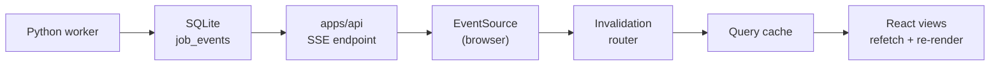
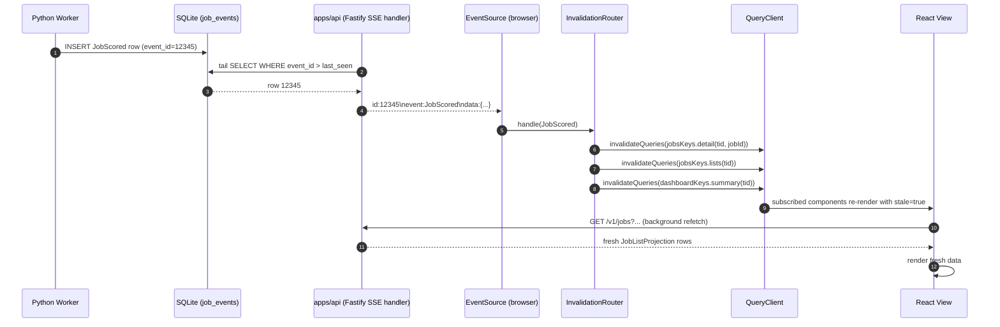

# 7. Realtime — SSE Consumer Architecture

The Server-Sent Events (SSE) event stream, the invalidation router, and how
realtime cache fan-out works. Part of the [Frontend Architecture](index.md)
reference.

**Read this if** you need to understand how a backend change reaches the screen
without a manual refresh — or you are adding a new event type.

**SSE** is a one-way channel: the browser opens a long-lived HTTP connection and
the server pushes named events down it. The web app never sends messages back on
this channel — it only listens, then refreshes the affected parts of the query
cache. At a glance:



The worker records an event, the endpoint streams it, the router turns it into
the right cache invalidations, and the views re-fetch. §7.6 shows this same path
as a detailed sequence diagram.

The backend records `JobEvent` rows in `job_events`
(`workers/automation`'s `EventPublisher` + `apps/api/src/projections.ts`)
and streams them over `GET /v1/events/stream`. The frontend consumer is
**implemented**: `SseEventStreamAdapter` (behind `EventStreamPort`) opens
the connection, `EventStreamProvider` (in `contexts/operations/providers/`)
manages the subscription lifecycle, and the invalidation router fans each
event out to the query cache. `<ConnectionStatusPill>` in the Topbar shows
liveness.

This section defines that realtime architecture, including the
`apps/api/` SSE endpoint contract it depends on.

### 7.1 The Endpoint — `GET /v1/events/stream`

**Decision (resolves §6 question 9 transport):** Server-Sent Events (SSE)
on a new dedicated endpoint.

**Why SSE, not WebSocket / polling:**

- **Unidirectional fits the use case.** The frontend only consumes events;
  it does not need to send messages on the channel. SSE is exactly this.
- **Native `EventSource` API.** No library, automatic reconnect with
  `Last-Event-ID`, plays nicely with HTTP/2 multiplexing, no
  framing-protocol custom handling.
- **Fastify SSE support.** Fastify can stream `text/event-stream`
  responses with backpressure; no extra runtime.
- **CDN / proxy friendliness.** Plain HTTP; one long-lived response;
  tracable; debuggable in the network panel.
- **Auth simplicity.** `EventSource` sends cookies (or `Authorization`
  via a small `eventsource` polyfill) — same auth path as REST.
- **Polling rejected:** wasteful (event arrival is sparse but bursty), poor
  latency for "apply run completed."
- **WebSocket rejected for now:** bidirectional, framing overhead, harder
  to cache-debug, harder to terminate at edge proxies. Named as evolution
  path (§9) if event volume or duplex requirements emerge.

**Endpoint contract:**

```
GET /v1/events/stream?tenantId=<tenantId>&since=<lastEventId>
Accept: text/event-stream
Cache-Control: no-cache
Connection: keep-alive
Last-Event-ID: <lastEventId>      # set by EventSource auto-reconnect

(server)
HTTP/1.1 200 OK
Content-Type: text/event-stream
X-Accel-Buffering: no

retry: 5000

id: 12345
event: JobScored
data: {"tenantId":"local","jobId":"job-...","fitScore":8,"version":1,"scoredAt":"..."}

id: 12346
event: ResumeApproved
data: {"tenantId":"local","jobId":"job-...","artifactId":"...","generation":2,"approvedAt":"..."}

: keepalive (every 15s)
```

**Resume-position precedence:** the server prefers the `Last-Event-ID`
**header** when present (this is what the browser's native `EventSource`
auto-reconnect sends — the application code does not populate it). The
`?since=<lastEventId>` **query string** is the *first-connect* fallback
for cases where the client wants to resume from a known watermark
without relying on header-based reconnect — primarily the IndexedDB
cache-hydration evolution path (§9.7), where the client knows the
watermark of its persisted cache before opening the connection. If both
are present, `Last-Event-ID` wins. If neither is present, the server
streams from the current tail (no backfill).

**Server-side responsibilities:**

- Tail `job_events` for new rows where `tenant_id = :tenantId AND
  event_id > :resumeFrom`, where `resumeFrom` is taken from
  `Last-Event-ID` (preferred) or `?since` (fallback) or `current_max(event_id)`
  (default if neither is supplied).
- Map `event_type` to the SSE `event:` field; serialize `payload_json` as
  `data:` (already JSON; pass through).
- Set `id:` to `event_id` (so `EventSource` automatically reconnects with
  `Last-Event-ID`).
- Send a comment line `: keepalive` every 15s (overridable) to keep
  intermediaries from idling the connection out.
- Set `retry: 5000` (5s reconnect baseline).
- Tenant scope is **mandatory**: the server enforces that returned events
  match `:tenantId`. In local mode, this is `LOCAL_TENANT`; in hosted
  mode, the server resolves `tenantId` from the JWT and rejects mismatched
  query-string values.
- Heartbeat with current watermark id every 30s in a separate
  `event: heartbeat` so the client can verify liveness even when no
  domain events fire.

**Client-side responsibilities:**

- Open `new EventSource("/v1/events/stream?tenantId=" + tenantId)` once
  per tab when the application mounts (after `<TenantProvider />` resolves).
  Do not pass `?since` on first connect; the server defaults to
  current tail.
- The browser's auto-reconnect sends `Last-Event-ID` automatically; no
  application code needed for the common case.
- For IndexedDB-hydrated cold start (§9.7), the application explicitly
  passes `?since=<persistedWatermark>` on first connect.
- Parse each `event` + `data` frame with `parseDomainEvent` — it validates
  the `eventType` against the runtime `DOMAIN_EVENT_TYPES` set, `JSON.parse`s
  the payload, and object-checks it (no Zod, no payload-shape schema; see
  §7.2).
- Dispatch to the **invalidation router** (§7.4).
- Expose a status indicator (`connecting | open | closed`) consumed by
  the AppShell to render a small "live"/"reconnecting" badge.

### 7.2 Typed Event Schemas

The event taxonomy lives in `@jobhunter/domain-types` at
`packages/domain-types/src/events/`. It is a **plain TypeScript
discriminated union** — there is no Zod. `DomainEvent<T, P>` is the generic
base interface (its `eventType` field is the discriminant); the union of
all 68 concrete events is `DomainEventUnion`, with
`DomainEventType = DomainEventUnion["eventType"]` and a runtime companion
array `DOMAIN_EVENT_TYPES` (kept exhaustive against `DomainEventType` by a
compile-time assertion). `@jobhunter/domain-types` has no `zod` dependency.

The frontend's `parseDomainEvent(rawFrame)` (in
`shared/ports/lib/parseDomainEvent.ts`) validates only that the SSE frame's
`eventType` is a member of `DOMAIN_EVENT_TYPES`, then `JSON.parse`s the
`data` payload and object-checks it — it does **not** schema-validate the
payload shape. An unknown `event:` type is dropped (forward-compat: the
backend can introduce `SomethingNew` events without breaking the client;
the client routes them once the union and a handler are added).

### 7.3 The `EventStreamProvider`

```ts
// contexts/operations/providers/EventStreamProvider.tsx
export function EventStreamProvider({ children }: { children: ReactNode }) {
  const tenantId = useTenantId();
  const { eventStream } = usePorts();
  const router = useInvalidationRouter();

  useEffect(() => {
    const sub = eventStream.subscribe({ tenantId });
    const off = sub.on((event) => router(event));
    return () => { off(); sub.close(); };
  }, [tenantId, eventStream, router]);

  return <>{children}</>;
}
```

It lives in `contexts/operations/providers/` (not `shared/providers/`) and
is mounted in the `main.tsx` provider stack below `<QueryClientProvider />`
and above the theme/density providers. It also exposes `useEventStreamStatus`
(consumed by `<ConnectionStatusPill>`). It renders no UI of its own — it
manages the subscription lifecycle.

### 7.4 The Invalidation Router

A pure function that maps `DomainEvent → Set<QueryKey>`. The router lives
in `contexts/operations/invalidation-router.ts`. Each backend event type
has a registered handler:

```ts
const handlers: Record<DomainEventType, InvalidationHandler> = {
  JobDiscovered: ({ tenantId }) => [
    jobsKeys.lists(tenantId),
    dashboardKeys.summary(tenantId),
  ],
  JobScored: ({ tenantId, jobId }) => [
    jobsKeys.detail(tenantId, jobId),
    jobsKeys.lists(tenantId),
    dashboardKeys.summary(tenantId),
  ],
  ResumeApproved: ({ tenantId, jobId }) => [
    jobsKeys.detail(tenantId, jobId),
    jobsKeys.lists(tenantId),
    artifactsKeys.lists(tenantId),
    dashboardKeys.summary(tenantId),
  ],
  ApplyRunEventRecorded: ({ tenantId, runId, event }) => {
    // Specialized: append to in-memory list rather than invalidate.
    return [{ kind: "apply-run-event", tenantId, runId, event }];
  },
  // ... one entry per DomainEventUnion variant
};

export function handleEvent(event: DomainEvent, qc: QueryClient): void {
  const out = handlers[event.eventType](event.payload);
  for (const item of out) {
    if ("kind" in item && item.kind === "apply-run-event") {
      qc.setQueryData(applyRunsKeys.detail(item.tenantId, item.runId), (old) =>
        appendApplyRunEvent(old, item.event),
      );
    } else {
      qc.invalidateQueries({ queryKey: item });
    }
  }
}
```

In practice the per-event handler functions are authored in each aggregate
context's `handlers.ts` (seven files: `discovery`, `enrichment`, `profile`,
`scoring`, `materials`, `apply`, `pipeline`) and registered centrally in
`invalidation-router.ts`, which exports `invalidate`, `patchApplyRunEvent`,
and `useInvalidationRouter`. The illustration above inlines them for
clarity; Operations itself has no `handlers.ts`.

**Why a router and not per-context subscriptions:**

- **Single point to reason about cross-context invalidation.** A new
  event type means one PR touching one file (the router) plus the schema.
- **Testable in isolation.** The router is a pure function; tests assert
  that a specific event triggers the expected invalidation set without
  touching the network or React.
- **The handlers can use the registry of keys (§4.1)** so contexts do not
  need to know about each other.

**Fitness function — every backend `DomainEvent` has a router handler.**
Two layers, both required:

1. **Compile-time:** the `handlers` map is typed
   `Record<DomainEventType, InvalidationHandler>`. Adding a new
   variant to the discriminated union in
   `@jobhunter/domain-types/events/` (mirroring a new backend event type)
   is a TypeScript compile error in `apps/web` until a handler is wired.
   This is the *primary* guard.
2. **Runtime parity test:**
   `contexts/operations/every-event-has-handler.test.ts` iterates the
   runtime `DOMAIN_EVENT_TYPES` array (from `@jobhunter/domain-types`; there
   is no Zod schema to read `.options` from) and asserts a handler is
   registered for each. This is the *backstop* that catches the case where a
   developer adds a stub handler `() => []` (TS-passing, behaviorally wrong).
   It runs in the web Vitest suite, which is **not yet CI-gated** (tracked in
   `docs/backlog.md`); the compile-time check in (1) — run in CI via
   `pnpm -r check` — is the CI-enforced guard, and this parity test is its
   local runtime backstop.

The pattern mirrors the backend's `scripts/check-domain-type-parity.py`
(per `architecture.md`'s verification-commands section). A new event on
the backend triggers a TypeScript compile error (in CI, via `pnpm -r
check`) AND a runtime parity-test failure (locally) on the frontend —
silent invalidation gaps are prevented by construction.

### 7.5 Strategy: `invalidate` vs `setQueryData` (resolves §6 question 9)

Two patterns exist; both have a place:

| Pattern | When to use | Example event |
|---|---|---|
| `queryClient.invalidateQueries({ queryKey })` | **Default.** Use whenever the event indicates "the projection changed; the next render should re-fetch." | `JobScored` → invalidate `jobsKeys.detail` and `jobsKeys.lists`. |
| `queryClient.setQueryData(queryKey, updater)` | **Optimization for high-frequency events** where re-fetching would be wasteful. Use when the event payload contains exactly the data needed to patch the cache. | `ApplyRunEventRecorded` → append to the in-memory event list of the active apply-run query. |

**Why default to `invalidate`:**

- **Single source of truth.** The projection on the server is canonical;
  the cache always reconciles to it.
- **No hand-rolled merge bugs.** Patching cache shape by hand introduces
  mismatch between the patched value and what a fresh fetch would return.
- **Simple, mechanical.** Each new event type is a one-line handler.

**Why `setQueryData` for `ApplyRunEventRecorded` specifically:**

- **Volume.** During an apply run, several events per second arrive over
  the course of minutes. Re-fetching the apply-run detail per event
  saturates the API for no benefit.
- **Append-only semantics.** The event payload is exactly the new event to
  append. Patching is trivially correct.
- **Reconciliation backstop.** When the apply-run drawer is closed and
  re-opened, it re-fetches, naturally reconciling with any drift.

### 7.6 Realtime Data Flow



### 7.7 Reconnect / Backoff

`EventSource`'s built-in reconnect is sufficient for the MVP:

- Server sends `retry: 5000` (5s baseline).
- On disconnect, browser auto-reconnects, sending `Last-Event-ID`
  header so the server resumes from the last delivered event.

The `EventStreamProvider` exposes `status` to the AppShell. When
`status === "closed"` for more than 30s, the shell renders a banner
"Connection lost — events paused; data will refresh when reconnected."
On reconnection, the provider triggers a one-shot
`queryClient.invalidateQueries()` (full cache invalidation) to recover
from any events lost during the gap. (`Last-Event-ID` covers the common
case; the full invalidation is a backstop.)

### 7.8 Tenant Scoping in Realtime

The connection is parameterized by `tenantId`. In local mode, the value
is `LOCAL_TENANT`. In hosted mode:

- The server validates `:tenantId` against the JWT. Mismatch → 403.
- The connection is per-tenant; if a user switches tenants (cloud-only
  feature), the `EventStreamProvider` closes the old connection and opens
  a new one (the `useEffect` dependency on `tenantId` does this naturally).
- Invalidation routing already includes `tenantId` in every query key, so
  there is zero cross-tenant cache leak even if events were
  mis-delivered.

### 7.9 What If SSE Is Not Enough Later

Named-not-built evolution paths (also see §9):

- **WebSocket adapter** — if duplex (e.g., the frontend driving an
  interactive worker session) becomes a requirement, swap to
  `WebSocketEventStreamAdapter` behind the same `EventStreamPort`.
- **Push notifications** — for "your apply run completed" while the tab
  is closed, integrate Web Push via a `NotificationsPort`.
- **Per-resource subscriptions** — today, every event reaches every
  client. If event volume grows so large that per-tenant filtering at the
  server is insufficient, introduce `subscribe(resource: "job", id)`
  semantics in the port, with the SSE endpoint accepting filter params.

---
