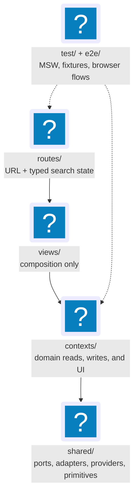

# 11. Folder Structure

The full `apps/web/src` folder contract. Part of the
[Frontend Architecture](index.md) reference.

**Read this if** you are looking for where a file lives, or deciding where a new
one should go.

`apps/web/src` has five primary directories; almost everything is a variation on
one of them:

| Directory | Holds | Rule of thumb |
|---|---|---|
| `routes/` | File-based route tree (URL → screen) | Mirrors the URL; routes only mount views and declare typed search-param schemas. |
| `contexts/` | The nine bounded contexts | 1:1 with the backend; owns hooks, mutations, components, and event handlers. |
| `views/` | The page composers | Arrange context pieces into a layout; never own queries, mutations, or stores. |
| `shared/` | UI primitives, layout, providers, ports, stores, helpers | Only things genuinely shared across contexts and views. |
| `test/` | MSW handlers, fixtures, setup | Cross-cutting test scaffolding. |

The exhaustive tree below is the full contract; the **folder principles** after
it state the rules.

```
apps/web/
├── package.json
├── tsconfig.json
├── vite.config.ts                        # @tanstack/router-plugin (/vite) enabled
├── index.html
├── public/
│   └── favicon.svg
├── src/
│   ├── main.tsx                          # createRoot + adapter wiring + <App />
│   ├── App.tsx                           # NEW App.tsx: providers + RouterProvider
│   ├── routeTree.gen.ts                  # generated by @tanstack/router-plugin (committed, NOT gitignored)
│   ├── styles/
│   │   ├── globals.css                   # Tailwind CSS 4 imports + @theme inline mappings
│   │   └── tokens.css                    # shadcn semantic CSS variables + app token values
│   ├── routes/
│   │   ├── __root.tsx                    # <AppShell>, devtools, notFoundComponent (providers live in main.tsx; RouterProvider in App.tsx)
│   │   ├── index.tsx                     # / → redirect to /dashboard
│   │   ├── dashboard.tsx                 # mounts <DashboardView />
│   │   ├── jobs.tsx                      # layout: search-param schema + <JobsView /> + detail Outlet
│   │   ├── jobs.index.tsx
│   │   ├── jobs.$jobId.tsx               # full detail route — mounts legacy-named <JobDetailDrawer /> workspace
│   │   ├── jobs.$jobId.run.$runId.tsx    # full apply-run timeline workspace (nested under jobs)
│   │   ├── artifacts.tsx                 # mounts <ArtifactsView />
│   │   ├── artifacts.index.tsx
│   │   ├── artifacts.$artifactId.tsx
│   │   ├── profile.tsx                   # layout
│   │   ├── profile.index.tsx             # editor
│   │   ├── profile.import.tsx            # wizard layout
│   │   ├── profile.import.upload.tsx
│   │   ├── profile.import.preview.tsx
│   │   ├── profile.import.confirm.tsx
│   │   ├── preferences.tsx               # application preferences
│   │   ├── settings.tsx                  # layout
│   │   ├── settings.index.tsx
│   │   ├── settings.credentials.tsx
│   │   ├── runs.tsx                      # layout: workflow-runs table + detail Outlet
│   │   ├── runs.index.tsx
│   │   ├── runs.$runId.tsx               # full workflow-run detail workspace
│   │   ├── apply-review.tsx              # mounts <ApplyReviewView />
│   │   ├── pipelines.tsx                 # mounts <PipelinesView /> (operations ledger + StageTriggerPanel)
│   │   ├── discovery.tsx                 # mounts <DiscoveryView />
│   │   ├── outreach.tsx                  # layout: search-param schema + <OutreachView /> + detail Outlet
│   │   ├── outreach.index.tsx
│   │   ├── outreach.$contactId.tsx       # full contact detail workspace
│   │   ├── debug.tsx                     # mounts <DebugView /> + activity-detail Outlet
│   │   ├── activity.$eventId.tsx         # full activity-detail workspace
│   │   ├── spikes.table-filters.tsx      # dev spike
│   │   └── -*.search.ts                  # per-route Zod search schemas (excluded from generation)
│   │   # not-found is a notFoundComponent on __root.tsx — there is no 404.tsx
│   ├── contexts/                         # 1:1 with backend bounded contexts
│   │   ├── operations/                   # Operations / Read-Side
│   │   │   ├── queryKeys.ts              # registry: re-exports local + per-context factories, including pipelineKeys.operations
│   │   │   ├── jobsKeys.ts / artifactsKeys.ts / dashboardKeys.ts / digestKeys.ts / applyRunsKeys.ts / applyReviewKeys.ts / activityKeys.ts / outcomesKeys.ts / workflowRunsKeys.ts / healthKeys.ts / compensationKeys.ts
│   │   │   ├── invalidation-router.ts    # event → invalidations (invalidate, patchApplyRunEvent, useInvalidationRouter)
│   │   │   ├── types.ts                  # ACL re-exports (domain-types projections via @jobctrl/contracts)
│   │   │   ├── providers/EventStreamProvider.tsx   # SSE subscription lifecycle + useEventStreamStatus
│   │   │   ├── components/JobAuditHistory.tsx
│   │   │   ├── hooks/                    # ~19 read hooks: dashboard, digest, jobs (list/detail), artifacts (list/detail),
│   │   │   │                            #   applyRuns (derived), activity (list/event), workflowRuns (list/detail),
│   │   │   │                            #   applyReviewQueue, resumeReviewDraft, application outcomes, health,
│   │   │   │                            #   discovery product controls, pipeline operations, useInvalidationRouter
│   │   │   └── index.ts
│   │   ├── discovery/                    # Job Discovery
│   │   │   ├── queryKeys.ts              # discoveryKeys (settings, source registry, locator, quarantine, …)
│   │   │   ├── hooks/                    # delete/hide/unhide/restore/permanent-delete (bulk) + worker-backed useImportJobMutation
│   │   │   │                            #   + useDiscoverySettingsQuery / useUpdateDiscoverySettingsMutation
│   │   │   │                            #   + useDiscoveryProductControlMutations (source registry, quarantine, manual capture, feedback)
│   │   │   ├── components/               # DiscoveryProductControls, DiscoveryRuntimeSettingsPanel
│   │   │   ├── lib/jobListPatches.ts
│   │   │   ├── handlers.ts               # 17 discovery-event handlers (registered via operations/invalidation-router.ts)
│   │   │   └── index.ts
│   │   ├── enrichment/                   # Job Enrichment
│   │   │   ├── queryKeys.ts              # enrichmentKeys
│   │   │   ├── hooks/                    # useEnrichmentRetryMutation (shipped), useRefreshCompensationMutation, useRefreshAllCompensationMutation
│   │   │   ├── components/               # CompensationEvidence (summary cell/strip, audit section), RefreshAllCompensationButton
│   │   │   ├── handlers.ts               # 8 enrichment/compensation/snapshot handlers
│   │   │   └── index.ts
│   │   ├── profile/                      # Candidate Profile
│   │   │   ├── queryKeys.ts              # profileKeys factory; re-exported from operations/queryKeys.ts
│   │   │   ├── hooks/
│   │   │   │   ├── useProfileQuery.ts
│   │   │   │   ├── useUpdateProfileMutation.ts
│   │   │   │   ├── useImportResumeMutation.ts
│   │   │   │   ├── useProfileHtmlPreviewUrl.ts
│   │   │   │   ├── useSettingsQuery.ts
│   │   │   │   ├── useUpdateSettingsMutation.ts
│   │   │   │   ├── useCredentialsQuery.ts
│   │   │   │   ├── useUpdateCredentialMutation.ts
│   │   │   │   ├── useDeleteCredentialMutation.ts
│   │   │   │   ├── useResumeTemplatesQuery.ts
│   │   │   │   ├── useResumeTemplateMutations.ts   # save version + set default
│   │   │   │   └── useProfileMutationCount.ts      # derives the preview cacheKey
│   │   │   ├── forms/                    # profile-form, settings-form (+ discovery-automation), credential-form, import-{upload,preview,confirm}-form, autosave-undo-controller
│   │   │   ├── components/               # ProfileEditor, StructuredProfileEditor, ResumeImportWizard, SettingsPanel, CredentialsPanel, ResumeTemplatePanel, TargetSearchSettingsPanel, DiscoveryAutomationSettingsPanel, GoogleAddressSearchField, Editor
│   │   │   ├── stores/
│   │   │   │   └── profile-import-store.ts   # Zustand+persist for wizard draft
│   │   │   ├── lib/                      # json-record, profile-date-fields, profile-patches
│   │   │   ├── handlers.ts               # ProfileUpdated / ProfileImported / TailoringPolicyUpdated handlers
│   │   │   └── index.ts
│   │   ├── scoring/                      # Scoring
│   │   │   ├── queryKeys.ts              # scoringKeys
│   │   │   ├── hooks/                    # useCorrectScoreMutation (shipped), useRescoreJobMutation, useRescoreCurrentPolicyMutation, useResetStaleScoresForRescoreMutation
│   │   │   ├── components/               # ScoreBadge, ScoreBreakdown, ScoreReasoning, ScoreStalenessBadge, ScoreCorrectionControl, RescoreJobButton, RescoreCurrentPolicyButton, ResetStaleScoresButton, CompensationSourcePolicyPanel
│   │   │   ├── lib/                      # parse-reasoning, score-tier
│   │   │   ├── handlers.ts               # JobScored / ScoreCorrected / ScoreRescoreRequested handlers
│   │   │   └── index.ts
│   │   ├── materials/                    # Materials Generation
│   │   │   ├── queryKeys.ts              # materialsKeys
│   │   │   ├── hooks/                    # useGenerateMaterialsMutation, useOpenArtifactMutation, useSetJobResumeTemplateMutation, useEnsureCurrentResumeMaterialsMutation, useTailorJobMutation, useRetailorJobMutation, useRetailorCurrentPolicyMutation
│   │   │   ├── components/               # GenerateMaterialsButton, OpenArtifactButton, ArtifactStatusBadge, ArtifactTypeBadge, ResumeTemplateStatusBadge, JobResumeTemplateSelect, EmployerAnalysisPanel, BulletProvenanceList, TailoringExplanationSection, ArtifactTailoringInspector, RetailorCurrentPolicyButton, ResumeAuditPins (ResumePlateEditor, ResumeStandalonePlateEditor, ArtifactGroundingRiskPanel)
│   │   │   ├── lib/                      # artifact-status/-type format + tone, audit-format, materialsJobDetailPatches
│   │   │   ├── handlers.ts               # 14 materials/template handlers
│   │   │   └── index.ts
│   │   ├── apply/                        # Apply Automation
│   │   │   ├── queryKeys.ts              # applyKeys
│   │   │   ├── hooks/                    # useApplyJobMutation, useDryRunApplyMutation, useCancelApplyMutation, useApplyReviewMutations (decision + manual-outcome + suggestion + resume-review draft/save/seed/reply/render)
│   │   │   ├── components/               # ApplyButton, DryRunButton, CancelApplyButton, ApplyRunBadge, RunStatusBadge, ApplyRunTimeline, ApplyHistory, ApplyReviewDecisionControls, ApplicationOutcomes (JobOutcomePanel, ManualOutcomeForm, OutcomeTimeline, OutcomeSuggestionsPanel)
│   │   │   ├── lib/                      # apply-run-status, apply-run-tone
│   │   │   ├── selectors/applyRunSelectors.ts
│   │   │   ├── handlers.ts               # ApplyRunStarted / ApplySubmitIntended / ApplyRunEventRecorded / ApplicationEmailFeedbackIngested / ApplicationSubmitted / ApplicationFailed handlers
│   │   │   └── index.ts
│   │   ├── outreach/                     # Contact & Outreach
│   │   │   ├── queryKeys.ts              # outreachKeys (re-exported from operations/queryKeys.ts)
│   │   │   ├── hooks/                    # useContactsListQuery, useContactDetailQuery, useCreate/Update/Delete/ImportContactsMutation
│   │   │   ├── components/               # ContactRoleBadge, ContactProvenanceList/Summary, Contact{Create,Edit,Delete,Import}Button, JobContactsPanel
│   │   │   ├── forms/                    # contact-form, contact-import-wizard (TanStack Form + Zod safeParse)
│   │   │   ├── stores/outreach-import-store.ts   # Zustand+persist (jh:outreach-import) for the CSV-import wizard
│   │   │   ├── lib/                      # contact-copy, contact-patches
│   │   │   ├── handlers.ts               # contact/outreach event handlers (registered via operations/invalidation-router.ts)
│   │   │   └── index.ts
│   │   └── pipeline/                     # Pipeline Orchestration
│   │       ├── queryKeys.ts              # pipelineKeys.all + pipelineKeys.operations
│   │       ├── hooks/                    # useRunPipelineStagesMutation, useRunJobStageMutation, useRunPendingPreparationMutation, useRetryStageMutation, useRetryFailedJobsMutation, useCancelStageMutation, useCancelWorkflowRunMutation, useMarkAppliedMutation, useMarkSkippedMutation
│   │       ├── components/               # StageBadge (exhaustive switch), UserFacingStageBadge, StageTimeline, StageTriggerPanel, RetryStageButton, CancelStageButton, CancelWorkflowRunButton, MarkAppliedButton, MarkSkippedButton, JobActions
│   │       ├── stores/stage-trigger-store.ts   # Zustand+persist (jh:stage-trigger-config)
│   │       ├── lib/                      # jobDetailPatches, stage/state tones
│   │       ├── handlers.ts               # Stage* + PreparationWorkItem* + PipelineStep* + Workflow* handlers
│   │       └── index.ts
│   ├── views/                            # NOT bounded contexts — composers only
│   │   ├── dashboard/                    # DashboardView, KpiGrid, DigestPanel, ConversionPanel, Funnel, SourceHealthCard, ApplyRunsCard, apply-run-dot-state
│   │   ├── jobs/                         # JobsView, JobsTable, JobBulkActions, JobDetailDrawer, JobOverview, JobDescription, JobAuditTriage, columns, jobStageFilters, selectors/jobsSelectors
│   │   ├── artifacts/                    # ArtifactsView, ArtifactsTable, ArtifactFilterBar, ArtifactDetailPanel, columns
│   │   ├── apply-review/                 # ApplyReviewView (queue + Plate resume editor + decision controls)
│   │   ├── runs/                         # RunsView, RunsTable, RunsFilterBar, WorkflowRunDrawer, columns, temporal-web-ui
│   │   ├── pipelines/                    # PipelinesView (Operations snapshot ledger/inspector + StageTriggerPanel)
│   │   ├── discovery/                    # DiscoveryView (sources + schedule settings panels)
│   │   ├── outreach/                     # OutreachView, OutreachTable, OutreachDetailDrawer, columns
│   │   └── debug/                        # DebugView, DebugActivityTable, DebugFilterBar, ActivityDetailDrawer, activity-columns, activity-tone
│   ├── shared/
│   │   ├── ui/                             # owned shadcn copies + shared product-layout primitives
│   │   │   ├── button.tsx
│   │   │   ├── dialog.tsx
│   │   │   ├── drawer.tsx
│   │   │   ├── sheet.tsx
│   │   │   ├── dropdown-menu.tsx
│   │   │   ├── select.tsx
│   │   │   ├── command.tsx
│   │   │   ├── tabs.tsx
│   │   │   ├── toast.tsx
│   │   │   ├── toaster.tsx
│   │   │   ├── tooltip.tsx
│   │   │   ├── skeleton.tsx
│   │   │   ├── input.tsx
│   │   │   ├── textarea.tsx
│   │   │   ├── checkbox.tsx
│   │   │   ├── switch.tsx
│   │   │   ├── badge.tsx
│   │   │   ├── card.tsx
│   │   │   ├── form.tsx                    # TanStack Form bindings
│   │   │   ├── table.tsx                   # native table primitives
│   │   │   ├── filterable-data-grid.tsx     # custom FilterableDataGrid — the table engine (DataGridColumn<T>)
│   │   │   ├── saved-table-views-control.tsx # shared table-view switcher + save/rename/delete/columns UI
│   │   │   ├── data-table.tsx               # shadcn wrapper over @tanstack/react-table — unused by any view
│   │   │   ├── route-workspace.tsx          # shared content + optional inspector shell
│   │   │   ├── page-head.tsx                # route breadcrumb/subtitle/action identity + semantic h1
│   │   │   ├── disclosure-section.tsx       # progressive detail section
│   │   │   ├── inspector-ledger.tsx         # audit-friendly label/value facts
│   │   │   ├── empty.tsx                    # explicit empty/loading absence
│   │   │   ├── tool-row.tsx                 # shared action/control row
│   │   │   └── copyable-command.tsx        # `<CopyableCommand command={...} />` — preserves the "copyable CLI commands" affordance per docs/decisions.md (2026-05-03)
│   │   ├── layout/
│   │   │   ├── AppShell.tsx
│   │   │   ├── Topbar.tsx                  # slim bar: global job search → /jobs?q, density/theme, inline connection status
│   │   │   ├── SideRail.tsx                 # 14 nav destinations in 5 rail groups (icons ≤1180px; sheet ≤820px)
│   │   │   ├── BrandMark.tsx                # JobCtrl logo mark
│   │   │   ├── ConnectionStatusPill.tsx     # legacy-named dot/glyph + text for SSE, pause state, and LLM spend
│   │   │   └── ThemeToggle.tsx
│   │   ├── providers/                      # EventStreamProvider is NOT here — it lives in contexts/operations/providers/
│   │   │   ├── PortsProvider.tsx           # + usePorts()
│   │   │   ├── QueryClientProvider.tsx     # wraps TanStack QueryClientProvider with config
│   │   │   ├── TenantProvider.tsx          # + useTenantId()
│   │   │   ├── ThemeProvider.tsx
│   │   │   ├── DensityProvider.tsx
│   │   │   └── ToasterProvider.tsx
│   │   ├── ports/                          # port interfaces only
│   │   │   ├── ApiClientPort.ts
│   │   │   ├── EventStreamPort.ts
│   │   │   ├── StoragePort.ts
│   │   │   ├── SessionPort.ts
│   │   │   ├── ClipboardPort.ts
│   │   │   ├── OpenInOsPort.ts
│   │   │   ├── TelemetryPort.ts
│   │   │   ├── FeatureFlagPort.ts
│   │   │   ├── lib/parseDomainEvent.ts     # SSE frame → DomainEventEnvelope (DOMAIN_EVENT_TYPES membership check)
│   │   │   └── index.ts
│   │   ├── adapters/                        # concrete adapters — sibling of ports/, NOT ports/adapters/
│   │   │   └── local/
│   │   │       ├── FetchApiClientAdapter.ts
│   │   │       ├── SseEventStreamAdapter.ts
│   │   │       ├── LocalStorageAdapter.ts
│   │   │       ├── LocalSessionAdapter.ts
│   │   │       ├── NavigatorClipboardAdapter.ts
│   │   │       ├── OpenArtifactAdapter.ts     # OpenInOsPort impl
│   │   │       ├── ConsoleTelemetryAdapter.ts
│   │   │       └── StaticFeatureFlagAdapter.ts
│   │   ├── stores/
│   │   │   ├── ui-preferences.ts           # Zustand+persist → jh:ui-preferences (theme, density, sidebar expansion)
│   │   │   ├── saved-table-views.ts        # Zustand+persist → jh:saved-table-views (table templates + presentation)
│   │   │   ├── toasts.ts                   # Zustand
│   │   │   └── command-palette.ts          # Zustand (open/close + search)
│   │   ├── hooks/
│   │   │   ├── useTenantId.ts              # re-export of TenantProvider's useTenantId
│   │   │   ├── useTheme.ts
│   │   │   ├── useDensity.ts
│   │   │   ├── useToast.ts
│   │   │   └── useEscapeKey.ts
│   │   ├── lib/
│   │   │   ├── cn.ts                       # tailwind-merge helper
│   │   │   ├── createOptimisticMutation.ts # snapshot → patch → rollback → invalidate helper
│   │   │   ├── formatters.ts               # date / size / score formatters
│   │   │   ├── exhaustive.ts               # assertNever helper
│   │   │   ├── queryClient.ts              # QueryClient config + defaults
│   │   │   ├── errors.ts / type-guards.ts / file.ts / relative-time.ts / job-description-blocks.ts
│   │   └── types/
│   │       └── ambient.d.ts                # vite env types
│   ├── test/
│   │   ├── msw/
│   │   │   ├── handlers.ts                 # one handler per apps/api route
│   │   │   ├── sse-handlers.ts             # SSE mocks
│   │   │   └── server.ts                   # setupServer for Vitest
│   │   ├── fixtures/
│   │   │   ├── projections.ts              # canonical sample projection rows
│   │   │   └── events.ts                   # canonical DomainEvent samples
│   │   └── setup.ts                        # vitest global setup
│   └── stories/                            # Storybook stories (or co-located *.stories.tsx)
└── e2e/
    ├── playwright.config.ts
    ├── fixtures/                           # seed SQLite + JSON fixtures
    └── tests/                          # 12 specs
        ├── dashboard.spec.ts
        ├── jobs-drawer.spec.ts
        ├── jobs-bulk.spec.ts
        ├── dry-run.spec.ts
        ├── materials.spec.ts
        ├── profile-edit.spec.ts
        ├── wizard.spec.ts
        ├── runs.spec.ts
        ├── settings.spec.ts
        ├── route-visual-qa.spec.ts
        ├── token-foundation.spec.ts
        └── docs-screenshots.spec.ts
```



The file tree above is the exact inventory. This smaller map captures the
dependency direction: routes mount views, views compose contexts, and contexts
consume shared ports and primitives. Tests exercise each layer without becoming
a production dependency.

**Folder principles:**

1. **`routes/` mirrors the URL.** File-based routing makes the URL
   structure greppable from the file tree. Routes do little — they mount
   views, declare typed search-param schemas, and (sometimes) declare
   loaders.
2. **`contexts/` mirrors the backend bounded contexts 1:1.** Nine
   folders, no inventions, no omissions. Even contexts with thin or zero
   UI (Discovery, Enrichment) have folders so their hooks and event
   handlers have unambiguous homes.
3. **`views/` is the composition layer; views are NOT contexts.** A view
   imports hooks from `contexts/operations/` and components / mutations
   from aggregate contexts. A view never owns query keys, mutations, or
   stores. Views never depend on other views (cross-view navigation goes
   through the URL).
4. **`shared/` is *only* truly shared.** If a thing belongs to a single
   context or view, it lives there. Avoid `shared/components/` becoming
   a junk drawer.
5. **`shared/ui/` is the owned shadcn/Rhea wrapper boundary.** Wrappers use
   Base UI internally and are editable, tested JobCtrl code; feature and view
   modules do not import Base UI directly. Direct `@radix-ui/*` imports and raw
   native selects are prohibited by the migration-boundary test. Semantic
   utilities are backed by `globals.css` `@theme inline` mappings and
   `tokens.css` values.
6. **`shared/ports/` + `shared/ports/adapters/`** is the hexagonal seam.
7. **No top-level `hooks/` or `utils/` folders outside contexts.** All
   feature hooks belong to a context. Only generic helpers
   (`shared/hooks/useTheme`) live outside.
8. **No barrel files re-exporting half the codebase.** Each folder's
   `index.ts` re-exports only the *public surface* of that folder.
   Tree-shaking and grep-ability win over import-line brevity.

---
