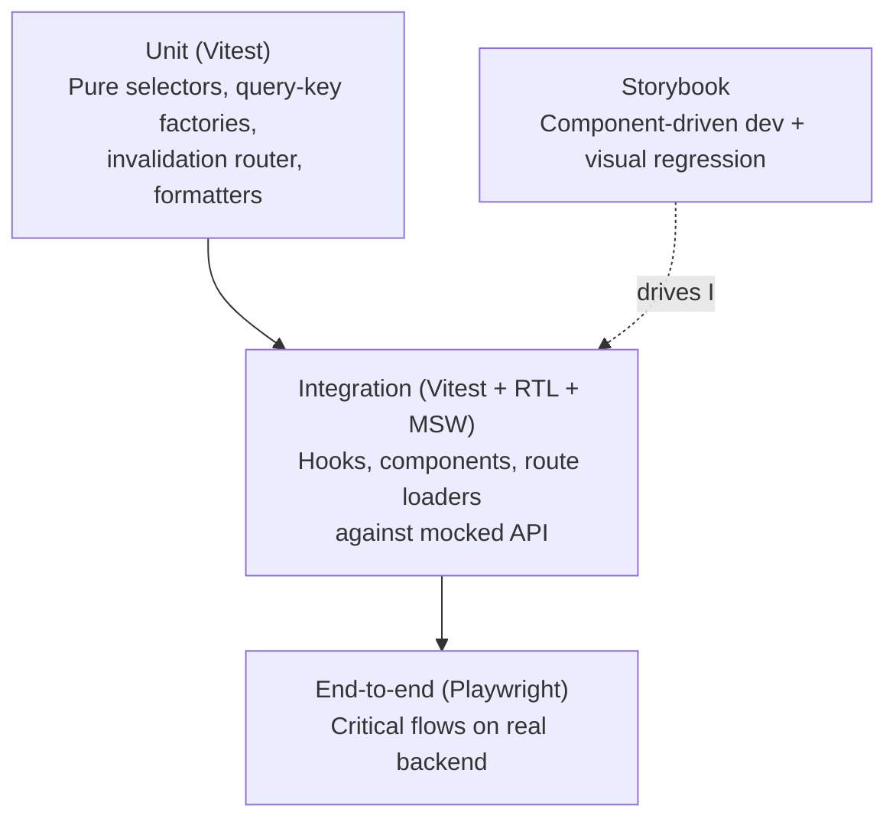

# 10. Testing Strategy

The frontend test pyramid — unit / hook / component, type-level, Storybook +
accessibility (a11y), and Playwright end-to-end (E2E). Part of the
[Frontend Architecture](index.md) reference.

**Read this if** you are adding a test and need to know which layer it belongs
in, or which checks run in CI versus locally.

The frontend ships a pyramid that matches the architecture's seams. Today
it comprises **220 colocated `*.test.ts(x)`** under `apps/web/src`
(100 `.test.ts` + 120 `.test.tsx`, of which **29** are colocated
`*.a11y.test.tsx`), **11 type-level `*.test-d.ts`** under `apps/web/test/types`,
**18 Playwright `*.spec.ts`** under `apps/web/e2e/tests`, and **112
`*.stories.tsx`** Storybook story files.

### 10.1 The Pyramid

### 10.2 Unit Tests (Vitest)

**What is tested in isolation:**

- **Query-key factories** — assert structural equality of generated keys
  for representative inputs. Ensures factory shape changes are caught.
- **The invalidation router** — `handleEvent(event, mockQueryClient)` for
  each event type; assert exact set of `invalidateQueries` and
  `setQueryData` calls. **This is the most important unit test in the app**
  — it is the contract surface between the backend's events and the
  frontend's cache.
- **Event-handler parity**
  (`contexts/operations/every-event-has-handler.test.ts`) — iterates the
  runtime `DOMAIN_EVENT_TYPES` array and asserts a handler is registered for
  every variant; flags obvious empty stubs. Backstop to the
  `Record<DomainEventType, InvalidationHandler>` compile-time check (§7.4).
  Mirrors the backend's `scripts/check-domain-type-parity.py` pattern.
- **Stage-state parity**
  (`contexts/pipeline/components/every-stage-state-has-badge.test.tsx`) —
  iterates `STAGE_STATE_KINDS` and asserts `<StageBadge>` renders a
  non-default arm for every kind; backstop to the exhaustive `switch`
  on `state.kind`.
- **Selectors** — pure functions that derive presentation shape from
  projections (e.g., `groupArtifactsByJob`, `summarizeFunnel`).
- **Contracts Zod schemas** — round-trip the `@jobctrl/contracts`
  request / search-param schemas (parse → typed → serialize). The SSE
  `DomainEvent` union is plain TypeScript, not Zod, so it is not among
  these (§7.2).

These tests do not mount React components.

### 10.3 Component & Hook Tests (Vitest + React Testing Library + MSW)

**Decision (resolves §6 question 14):** **Both** domain hooks (with MSW)
*and* end-to-end Playwright. The line:

- **Hook tests with MSW:** domain hooks (`useJobsListQuery`,
  `useApplyJobMutation`, etc.) — assert that the hook calls the right
  API method, returns the typed shape, invalidates the right keys on
  success, and rolls back on error. Per-hook coverage is the standard,
  though not yet universal — many, not all, of the query / mutation hooks
  have a colocated test today. The digest hook pair is covered here: the
  query reads `GET /v1/digest`, while the acknowledge mutation verifies the
  explicit timestamp payload and digest-key invalidation.
- **Component tests with MSW:** for components with non-trivial
  interaction (filter bar binding to URL state, bulk select toolbar,
  apply timeline). Render with a router and a query client; drive via
  RTL `userEvent`; assert observable DOM state. `<DigestPanel />` follows
  this layer by asserting URL-owned deep links and the explicit
  "mark reviewed" acknowledge action.
- **Playwright E2E:** **smoke flows only** — navigate the dashboard,
  filter a jobs list, open a drawer, trigger a dry-run apply. Run against
  a real `apps/api` + a seeded SQLite DB.

**Why both:** hook tests with MSW are fast (sub-second) and run on every
PR; they catch ~90% of regressions and pin the hook contract. Playwright
is slow and brittle but catches real-browser issues (router navigation,
SSE connection, focus management) that MSW cannot. The split keeps
feedback fast for feature development and adds an "it actually works in a
browser" check on CI.

**MSW setup:** one handler per backend route (mirrors
`packages/api-client`). REST handlers live in
`apps/web/src/test/msw/handlers.ts` and SSE handlers in
`apps/web/src/test/msw/sse-handlers.ts`. Each test imports a base set and
overrides per-case; where MSW's SSE support is limiting, the fallback is a
custom `EventStreamPort` mock injected through `<PortsProvider />`.

### 10.4 End-to-End Tests (Playwright)

The suite has **18** spec files under `apps/web/e2e/tests/` today:
`analytics`, `artifact-comparison`, `dashboard`, `dry-run`, `evidence-map`,
`interview-prep`, `jobs-bulk`, `jobs-drawer`, `materials`,
`mobile-connection-banner`, `outreach`, `profile-edit`, `runs`, `settings`,
`token-foundation`, `wizard`, plus `route-visual-qa` and `docs-screenshots`
(the last drives the screenshots embedded in the docs). Representative
critical flows:

1. **Dashboard load** → KPIs render → click a KPI → navigate to filtered
   jobs view → row count matches.
2. **Job detail drawer** → click a row → drawer opens with score, stages,
   artifacts → close → drawer closes; URL preserves the filter.
3. **Soft-delete + restore** → bulk-select 3 jobs → delete → confirm
   removal from active list → switch to "deleted" tab → restore → confirm
   re-appearance.
4. **Profile edit + Plate baseline editor** → load profile → edit a field →
   save → baseline resume HTML is refetched with a new cache key and remains
   rendered in the Profile Plate editor.
5. **Resume import wizard** → upload a PDF → preview parsed draft → confirm
   → wizard exits to profile editor; profile reflects imported sections.
6. **Generate materials** → click "Generate" on a job → drawer shows
   "queued" → simulate `ResumeApproved` event in the seed → drawer shows
   approved status.
7. **Dry-run apply** → click "Dry run" → apply-run drawer opens with live
   timeline → simulated `DryRunComplete` event closes the run.
8. **Settings update** → change a setting → confirm persistence.

Playwright is configured with **per-test isolated SQLite databases**
seeded from fixture files; the `apps/api` boots against the test DB; the
test interacts with the rendered web app at `http://127.0.0.1:5173`.

### 10.5 Storybook (Component-Driven Development)

The frontend has **112** colocated `*.stories.tsx` files today. Stories serve
three audiences:

- **Developers** — visual playground while building.
- **Designers** — review surface without booting the full app.
- **Accessibility + interaction** — the Storybook test runner
  (`pnpm web:storybook:test`) drives the a11y addon (zero critical/serious
  axe violations, §10.7) and play functions.

Stories live next to components (`<Component>.stories.tsx`).
Domain-component stories use the **MSW addon** to mock API responses, so a
story for `<JobsTable />` can show loading, populated, and empty states
without booting the real backend. Snapshot-based visual regression
(Chromatic or open-source Loki) is a named-not-built addition on top of the
existing stories.

### 10.6 Type-Level Tests

Beyond the workspace typecheck, the frontend runs **11 `*.test-d.ts`** files
under `apps/web/test/types` via Vitest's `typecheck` mode (separate config
`vitest.types.config.ts`, invoked by `pnpm --filter @jobctrl/web test-d`).
There is no `tsd` dependency; assertions use Vitest `expectTypeOf`.

- **Type assertions on hook return shapes** catch accidental widening of the
  inferred types. (E.g., assert `useJobsListQuery(...)` returns
  `UseQueryResult<PaginatedResponse<JobSummary>>`, not
  `UseQueryResult<unknown>`.)
- **Typed search-param tests** assert the inferred type of
  `useSearch({ from: "/jobs" })` matches the Zod-derived type.

### 10.7 Accessibility Spot Checks

Accessibility is enforced on two surfaces. Colocated `*.a11y.test.tsx` files
under `apps/web/src/` run axe against input-bearing components and other
high-risk surfaces; the current source-derived inventory lives in
`docs/local-reliability-qa.md`. Storybook's a11y addon enforces **zero critical
and serious axe violations** across stories. A story that exercises a
pre-existing production defect may set `parameters.a11y.test = "off"` only
with a matching entry in the "Frontend Accessibility Backlog" in
`docs/backlog.md`, which owns the live deferral inventory.

### 10.8 What We Do NOT Test

- **shadcn/ui primitive internals** — those are upstream-tested.
- **TanStack library internals** — same.
- **Visual pixel-perfectness** beyond Storybook snapshots.
- **Performance** — bundle-size and runtime perf budgets are CI gates,
  not Vitest tests.

### 10.9 CI Pipeline (Cross-Reference)

The GitHub Actions TypeScript workflow (`.github/workflows/typescript.yml`)
runs, in order:

1. `pnpm -r check` (workspace typecheck, including `apps/web`). The
   compile-time guards (`Record<DomainEventType, InvalidationHandler>`
   exhaustiveness, etc.) fire here — this is the CI-enforced parity guard.
2. `pnpm --filter @jobctrl/api test` (the API Vitest suite; API only).
3. `pnpm --filter @jobctrl/web build` (Vite production build).
4. `pnpm --filter @jobctrl/web storybook:build` (static Storybook build).
5. `pnpm --filter @jobctrl/web storybook:test` (Storybook test runner —
   play functions + `@storybook/addon-a11y` axe checks — after installing
   Playwright Chromium).

Not yet gated in CI (run locally / pre-merge; tracked in `docs/backlog.md`):
the web Vitest unit + integration suite — including the event-handler and
stage-state parity tests (§10.2) — ESLint, and the Playwright e2e suite
(§10.4). Chromatic / Loki visual regression is named-not-built (§10.5). The
frontend's parity tests are the analogue of the backend's
`scripts/check-domain-type-parity.py`; today their CI-enforced half is the
`pnpm -r check` typecheck, with the runtime backstop running locally.

---
