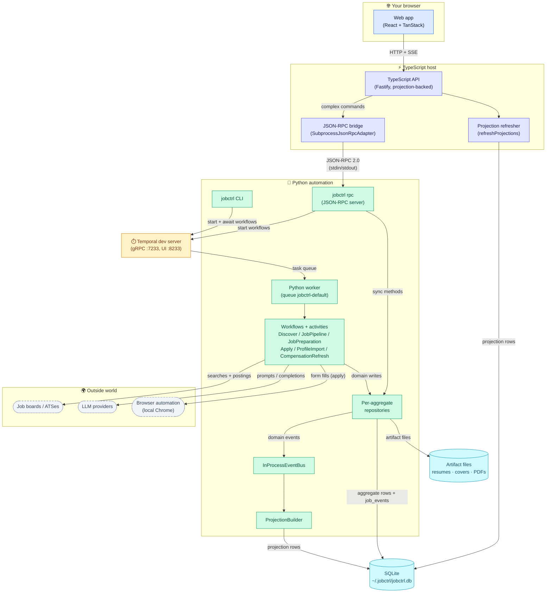

# System Architecture

JobCtrl is a local-first system: a TypeScript API and a web app (the web app
talks to the API) orchestrate a Python worker over Temporal (the workflow
engine). This is the whole machine on one map — every process, store, and
external dependency, with the data that flows between them:



What to notice: every durable fact converges on SQLite — workflows write
aggregates and `job_events` on the Python side, projection builders turn events
into read rows, and the web app reads only projections; commands travel the
other way, over JSON-RPC and Temporal. Click the map to zoom.

**Read this if** you want the whole-system picture before diving into a single
boundary, or you need to know which page answers a given question.

- [Runtime Boundaries](runtime.md) — What are the processes, and what does each own?
- [Job Pipeline](pipeline/index.md) — How does a job move through the stages, workflow by workflow?
- [Scoring](scoring.md) — How does a discovered job become a defensible fit score?
- [Materials & Tailoring Audit](materials.md) — How are tailored artifacts generated and every claim audited?
- [Tailoring Contract](tailoring.md) — What is the model asked, and which gates approve a resume?
- [Apply Feedback & Projections](read-model.md) — How do apply outcomes feed back, and how do events become the read model?
- [Storage](storage.md) — Where does data live on disk (SQLite tables and generated files)?
- [Observability](observability.md) — How are LLM, workflow, and JSON-RPC spans traced to Langfuse?
- [Backend Domain Model (DDD)](domain-model/index.md) — How is the domain designed (bounded contexts, aggregates, ports)?
- [Frontend](frontend/index.md) — How is the web app designed (state layers, contexts, ports, realtime)?

This page is the canonical architecture reference for JobCtrl. The domain
model this implementation realises is defined in the
[Backend Domain Model](domain-model/index.md) section; project history lives
under `docs/plans/`.

For a stage-by-stage execution view of the job pipeline — sequence diagrams,
component diagrams, call paths, persistence, events, and failure behavior — see
the [Job Pipeline](pipeline/index.md) section.

## System Shape

JobCtrl is a local-first job-search automation system. The product surface is
the web app and the TypeScript API; the automation engine remains Python because
the existing discovery, enrichment, scoring, tailoring, PDF generation, and apply
flows live there. The supported runtime shape has four long-lived local
processes — the Temporal dev server, the TypeScript API, the web app, and the
Python worker (`jobctrl worker`) — plus a `jobctrl rpc` subprocess the API
spawns on the first JSON-RPC call and reuses for dispatch. Work-starting
commands, from the CLI and the API alike, start Temporal workflows; the
long-lived worker executes them.

The codebase is organised around the **nine bounded contexts** defined in the
Backend Domain Model's [strategic design](domain-model/strategic.md) (§3):

| Bounded context             | Aggregate root                | Where it lives                                                    |
|-----------------------------|-------------------------------|-------------------------------------------------------------------|
| Job Discovery               | `Job`                         | `workers/automation/src/jobctrl/domain/discovery/`              |
| Job Enrichment              | `JobEnrichment`               | `workers/automation/src/jobctrl/domain/enrichment/`             |
| Candidate Profile           | `Profile`                     | `workers/automation/src/jobctrl/domain/profile/`                |
| Scoring                     | `JobScore`                    | `workers/automation/src/jobctrl/domain/scoring/`                |
| Materials Generation        | `MaterialsSet`                | `workers/automation/src/jobctrl/domain/materials/`              |
| Apply Automation            | `ApplyRun`                    | `workers/automation/src/jobctrl/domain/apply/`                  |
| Pipeline Orchestration      | `JobPipelineState`            | `workers/automation/src/jobctrl/domain/pipeline/`               |
| Operations / Read-Side      | _(no aggregate — projections)_| `workers/automation/src/jobctrl/domain/operations/`             |
| Contact & Outreach          | `Contact`                     | `workers/automation/src/jobctrl/domain/contact/`               |

Repository ownership mirrors the runtime boundaries:

- `apps/web`: runnable React/Vite frontend.
- `apps/api`: runnable local Fastify API.
- `packages/contracts`: shared schemas, DTOs, enums, and JSON-RPC envelopes.
- `packages/domain-types`: pure TypeScript mirror of the Python domain model.
- `packages/api-client`: typed transport client used by the frontend and tests.
- `workers/automation`: uv-managed Python worker and CLI package.
- `packages/tsconfig`: shared TypeScript compiler presets.

These boundaries are the subgraphs of the system map at the top of this page;
the source anchors are `apps/api/src/projections.ts`,
`apps/api/src/json-rpc-adapter.ts`, `infra/rpc/server.py`,
`infra/events/in_process_bus.py`, and
`infra/projections/projection_builder.py`. The rpc server's workflow-mode
methods start Temporal workflows, while `analyze_job` / `cancel_run` run
synchronously against the repositories.

## Bounded Context Composition

Each context exposes its **driving ports** (use cases) and depends on **driven
ports** (capabilities) for I/O. The local-mode adapters satisfy each driven
port via SQLite, the local filesystem, the local Chrome / Playwright stack, the
local Temporal dev server, and the local LLM clients. The hosted-mode adapters
(Postgres, S3, SQS, Browserbase, managed Temporal) are named in the Backend
Domain Model's [ports & adapters](domain-model/ports.md) (§5) but not implemented
yet — they are the next-evolution seam, not a parallel codepath today.

Cross-context integration uses the **`InProcessEventBus`** for domain events and
the **`SubprocessJsonRpcAdapter`** for the TS↔Python integration protocol (the
Backend Domain Model's [cross-context integration](domain-model/integration.md),
§6.5).

Discovery preparation is a cross-context workflow family, not a merged
aggregate. Discovery owns source and enrichment facts, then derives
deterministic per-job targets and starts `JobPreparationWorkflow` executions
for `score`, `tailor`, `cover`, `pdf`, or suppression work in the Scoring and
Materials contexts. The workflow ID is `prep-{idempotency_key}`, using the same
key material that previously backed durable queue de-duplication, so duplicate
triggers attach to the existing run instead of creating duplicate artifacts.
The user sees one preparation stage (`Discover`), while policy versions, score
rows, materials rows, and suppression state stay owned by their bounded
contexts. Operations list projections keep that product contract by exposing
only `discover` or `apply`; internal stage rows remain available in detail and
diagnostic surfaces.

The **enrichment quality gate** keeps low-confidence descriptions out of the
expensive, employer-facing steps without hiding the jobs. Each successful detail
capture records a `PostingContentSnapshot` whose `confidence` and
`quarantine_reason` are promoted onto `posting_snapshot_sets.latest_confidence` /
`latest_quarantine_reason`. A posting whose latest snapshot was quarantined as a
LOW-confidence extraction is excluded from the tailoring, cover-letter, and apply
prep selectors (`get_jobs_by_stage`, the pipeline runner's pending counters, and
the apply launcher), but stays scoreable (cheap triage) and visible with its
confidence/quarantine surfaced on the job read model and the
`PostingContentSnapshotCaptured` audit entry. A snapshot missing only its apply
URL keeps `latest_confidence` above LOW and is not gated, and an
operator-overridden LOW snapshot carries reason `none` and also passes — a
recoverable missing field never starves tailoring, and a quarantined job never
vanishes from the funnel.

## Core Data Flow

1. Discovery creates or updates jobs (via `JobRepository`).
2. Pipeline Orchestration creates `JobPipelineState` rows for the canonical
   stages.
3. Discovery preparation derives deterministic targets and starts per-job
   `JobPreparationWorkflow` runs for scoring, tailoring, cover-letter, PDF, and
   artifact suppression work when enriched jobs or live eligibility settings
   require internal preparation subwork.
4. Each domain operation publishes events through `InProcessEventBus`.
5. Workers record events in `job_events` and update per-aggregate tables
   (`job_scores`, `job_materials`, `job_enrichments`). The apply lifecycle is
   observable via `apply_run_projections`, sourced from `job_events` by the
   projection builder and keyed to Temporal workflow run history.
6. Generated files are registered in `job_artifacts` /
   `job_materials_artifacts`.
7. `ProjectionBuilder` (Python) and `refreshProjections` (TS) consume new
   `job_events` rows and rebuild affected projection rows from canonical
   aggregate state. The Python builder owns `apply_run_projections` and
   `workflow_run_projections`; the TypeScript API reads them directly.
8. The UI reads from the projection tables via the TypeScript read model — no joins.
   The Workflow Runs view at `/runs` reads the unified
   `workflow_run_projections` via `GET /v1/workflow-runs` (apply rows are
   enriched with job context from `apply_run_projections`) and deep-links each
   row to the local Temporal Web UI (`http://127.0.0.1:8233`).
9. UI actions are routed through JSON-RPC for complex commands or executed
   inline for simple state transitions. JSON-RPC worker subprocesses inherit
   the API runtime `JOBCTRL_DIR`, so action writes land in the same
   database the API and web app read.

## Local Commands

Python CLI:

```bash
uv --project workers/automation run jobctrl doctor
uv --project workers/automation run jobctrl worker   # long-lived Temporal worker
uv --project workers/automation run jobctrl run
uv --project workers/automation run jobctrl action score --limit 5
uv --project workers/automation run jobctrl backup
uv --project workers/automation run jobctrl rpc      # JSON-RPC server (spawned by the API)
```

TypeScript API and web app:

```bash
pnpm api:dev
pnpm web:dev
```

Verification:

```bash
pnpm check
pnpm test
uv --project workers/automation run --extra dev pytest -q
uv --project workers/automation run --extra dev ruff check .
uv --project workers/automation run python scripts/check-domain-type-parity.py
git diff --check
```
