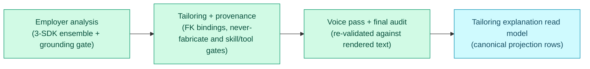

# Materials & Tailoring Audit

The materials pipeline turns canonical employer analysis into tailored,
provenance-backed artifacts, then audits every displayed claim against the
rendered text. The prompt/validation contract itself is documented in the
[Tailoring Contract](tailoring.md).

**Read this if** you need to know how tailored artifacts are generated and how
every displayed keyword, provenance, and truthfulness claim is audited.

The four Materials sub-steps run in order; each gate re-checks against the actual
rendered text, and per-bullet provenance, coverage, and voice are served from
canonical projection rows.

## Canonical Employer Analysis (Materials sub-step)

The Materials context owns a persisted, inspectable "ideal candidate" analysis
that is the source of truth for tailoring keyword selection. It is produced by a
**three-SDK agent ensemble** — Claude Agent SDK + Codex SDK + Google Antigravity
(Gemini) SDK — running in parallel and reconciled by a Claude synthesizer pass.
The ensemble orchestrator is N-leg and partial-failure safe
(`asyncio.gather(return_exceptions=True)`), so one SDK failure records a degraded
per-leg failure instead of cancelling the healthy legs. Employer analysis runs
through the analysis draft/synthesizer ports, not the generic LLM client.

- **Domain model** (`domain/materials/analysis.py`): `JobAnalysis` /
  `JobAnalysisDraft` (Pydantic) carry role framing, inferred seniority, an
  ideal-candidate narrative, requirements classified `must_have` vs
  `nice_to_have` with a 0–1 priority weight, and reasoned keywords each tied to a
  quoted job-description evidence span and linked to the requirement they
  support (orphans allowed but flagged). The `EmployerAnalysis` aggregate is
  generation-versioned (mirroring `MaterialsSet`) and retains the reconciled
  canonical record plus every per-model sub-analysis, the per-leg failures, and
  the cross-model agreement signal.
- **Grounding gate** (`domain/materials/analysis_grounding.py`): a deterministic
  **normalized substring + snap-to-source** validator (formatting-tolerant,
  content-exact). It locates each evidence span in the posting snapshot after
  folding formatting-insignificant variation (whitespace runs, Unicode
  hyphen/dash variants, smart quotes, case), then **snaps** the stored span to
  the JD's verbatim text at the match so persisted evidence is always
  copy-paste-findable. The match must align to whole-token boundaries (its outer
  edges border a non-alphanumeric or the string edge), so a short span cannot
  ground INSIDE a larger word (a fabricated `"Go"` against `"goals"`). A span
  whose WORDS are absent from the snapshot (a paraphrase, synonym, or
  hallucination) is still rejected — the cardinal correctness gate, run on every
  draft and on the synthesized canonical before persistence. JSON Schema cannot
  express this, so it is a separate hard check.
- **Ports + adapters** (`domain/ports/materials.py`,
  `infrastructure/analysis/`): the use case depends on `AnalysisDraftPort` /
  `AnalysisSynthesizerPort`, never on a concrete SDK. The ensemble runs the legs
  with `asyncio.gather(..., return_exceptions=True)` so one SDK failure never
  cancels the healthy legs; partial failures are persisted as degraded-ensemble
  audit data and the analysis records its `legs_succeeded / legs_attempted`
  completeness. A hard error surfaces only when *all* legs fail. There is **no
  wall-clock timeout** on the analysis path — the only stop is cooperative
  cancellation.
- **Reproducibility** is a cache contract, not determinism: the analysis is
  keyed on `snapshot_hash + prompt-version + SDK-set-version`. Re-tailoring the
  same posting reuses the cached canonical record instead of re-reasoning; an
  explicit `force` recompute supersedes (never destroys) the prior generation.
- **Lifecycle**: `AnalyzeJobUseCase` runs as the `_run_analyze` front-half
  sub-step of tailor (`TailorResumeUseCase` consumes the persisted analysis), and
  is also reachable standalone through the `analyze_job` JSON-RPC method.
  Persistence is canonical rows (`job_employer_analysis` + per-model
  sub-analysis and failure child tables), never `metadata_json`. The use case
  publishes `EmployerAnalyzed`, which lands a `job_events` row so the projection
  rebuilds and the Server-Sent Events (SSE) invalidation router refreshes the job
  detail.
- **Read path**: a single projection owner serves the analysis on the job-detail
  read model (`job_detail_projections.employer_analysis_json`), built identically
  by the Python projection builder and `apps/api/src/projections.ts` and served
  by `read-model.ts` as `JobDetail.employerAnalysis`. A cross-runtime projection
  parity test covers the table on both runtimes.
- **Requirement fit read path**: requirement-led scoring persists canonical
  `job_requirement_fit_reports` and ordered `job_requirement_fit_items` rows.
  The Operations projection publishes the latest report to
  `job_detail_projections.requirement_fit_report_json` and the API serves it as
  `JobDetail.requirementFitReport`. Compatibility score fields remain available
  for queue selectors and read models that need the compact score shape.

## Per-Bullet Provenance + Granular Controls (Materials sub-step)

Building on the persisted employer analysis, every generated resume bullet (and
the executive-profile / skills lines) carries a canonical provenance record so
the user can trust each line — what real profile fact it derives from, which job
requirement it serves, the transform that produced it, and the granular rule that
governed it. Like the analysis, this is canonical rows, not `metadata_json`.

- **Domain model** (`domain/materials/provenance.py`): `BulletProvenance` is one
  record per rendered line — `bullet_id` (stable within job/generation/section/
  index), `section`, `source_id`, `evidence_ids` (canonical profile evidence),
  `requirement_ids` (FK into `EmployerAnalysis` requirements), `matched_keywords`
  (verified against the generated text), `transform_type`, `control`, a human
  `rationale`, and `generated_text` (the rendered line — the coverage anchor).
  `BulletProvenanceSet` is generation-versioned and bound to the artifact it
  explains; a forced/failed re-tailor writes a higher generation and never
  destroys the prior one. `transform_type` and `control` are closed enums in
  `value_objects.py`: `TransformType` (verbatim / rephrase / reframe /
  synthesize_from_related / quantify_from_evidence) and `ControlRule` (rephrase
  always allowed; invent only for closely-related experience; never fabricate
  metrics/titles/dates/employers).
- **Provenance builder** (`domain/materials/provenance_builder.py`): computes one
  `BulletProvenance` per bullet **against the selected candidate's rendered text**
  (using the same `resume_profile` rendering helpers the assembler uses, so the
  text is identical), maps the existing change-type vocabulary to the closed
  `TransformType`, and binds `requirement_ids` as real foreign keys by matching
  the bullet against the analysis keywords. A fabricated evidence/requirement id
  is rejected before any row is built — provenance is FK bindings, not
  model-authored free text.
- **Deterministic never-fabricate detector** (`domain/materials/fabrication_detector.py`):
  a pure check that runs **independently of the prompt**. Every numeric, date,
  percentage, money, title, and company-suffixed employer token in a generated
  bullet must trace to recorded profile evidence; a token that does not is a
  fabrication and is **hard-rejected at generation time**. A metrics-hungry job
  paired with a numberless profile yields zero unsourced numerics in the output.
- **Deterministic prose skill/tool gate** (same module, sibling of the numeric
  detector): the numeric/date/title/employer arms have no concept of a skill or
  tool, so a fabricated in-demand technology (Kubernetes, Terraform, Kafka, …)
  woven into an experience bullet or the executive summary would ship on the LLM
  judge alone. `scan_prose_skill_fabrications` closes that leak with an
  **allowlist, not a denylist**, scoped to invented **named technologies** so it
  never punishes concept keywords. It flags a job-TARGET keyword (from the
  persisted `EmployerAnalysis` keywords) that is BOTH (1) a recognised named
  technology in the curated `KNOWN_TECHNOLOGY_LEXICON` (languages/frameworks/cloud/
  databases/tools) AND (2) grounds in NEITHER the candidate's profile-backed skill
  vocabulary (`build_skill_vocabulary` = skill-category items + evidence tools +
  evidence tags) NOR the evidence corpus. Grounding is **word-form tolerant**
  (`scaled`/`scalable`/`scalability` mutually ground), so a concept keyword the
  candidate demonstrated in a different word form is never a false positive; a
  pure concept/qualification keyword (scalability, observability, microservices)
  is never gated at all. A fabricated `Kubernetes` still has no stem variant in a
  k8s-free profile, so it is still caught. Tools whose name is a homograph of a
  common word (`HOMOGRAPH_TECHNOLOGY_TERMS` = react, spark, rust, …) are the
  exception and require **exact** grounding, so a fabricated React cannot borrow
  the verb `reacted`. Matching is word-boundary anchored, so ordinary English
  words never false-fire; the skills SECTION is out of scope (it is governed by
  the skills-section allowlist). A hit is **hard-rejected exactly like an invented
  metric** (`NEVER_FABRICATE_SKILLS`).
- **Lifecycle**: the gates (provenance FK bindings + never-fabricate numeric +
  prose skill/tool) run at **two points**. First, **per candidate inside
  `TailorResumeUseCase._run_attempts`**: a candidate that clears the LLM judge but
  trips a gate is stamped `failed_fabrication_gate`, dropped from selection, and
  its per-token findings are rendered as `avoid_notes` fed into the next attempt —
  the same retry channel the judge/adversarial rejections use — so the remaining
  retry budget is spent steering the generator off the exact fabricated token
  instead of failing the run outright. Second, **after the selected candidate is
  voiced** the same gate re-confirms against the rendered text (see the voice
  re-validation below). When the retry budget is exhausted with no clean candidate
  the tailor **fails closed**: validation is downgraded so the resume is **not
  approved** (the last accepted generation's artifact + provenance are preserved)
  and each rejected candidate's gate findings stay as repair-loop audit history.
  An accepted generation persists its rows through `BulletProvenanceRepository`
  transactionally with the artifact and publishes `BulletProvenanceRecorded` (a
  `job_events` row → projection rebuild → SSE invalidation). Persistence is
  canonical rows (`job_bullet_provenance`), never `metadata_json`.
- **Read path**: the single projection owner serves provenance on the artifact's
  tailoring explanation (`artifact_list_projections.bullet_provenance_json`),
  built identically by the Python projection builder and
  `apps/api/src/projections.ts` and served by `read-model.ts` as
  `ArtifactTailoringExplanation.bulletProvenance` (a PDF artifact resolves it from
  the sibling tailored-resume row). A cross-runtime projection parity test covers
  the table on both runtimes.
- **Cover-letter truthfulness gate** (`scan_cover_letter`, same module): the cover
  letter ships to the employer as a first-person claims document, so before it is
  accepted `GenerateCoverLetterUseCase` runs the SAME deterministic guards over the
  generated body — the never-fabricate detector (metrics/dates/titles/employers)
  plus the prose skill/tool gate (`build_skill_vocabulary` + the persisted
  `EmployerAnalysis` keywords as targets), so it inherits that gate's
  named-technology scope and word-form-tolerant grounding — a fabricated
  `Kubernetes` is rejected while JD concept keywords (scalability, reliability,
  observability) woven into a grounded letter are not. Two cover-letter allowances
  keep it precise, since a letter legitimately names the job it targets: the mandatory
  `Dear …` salutation is excluded from the scan (its addressee title is not a
  claim), the target role's title tokens ground the title arm, and an employer
  mention containing the target company is not a fabricated employer. The
  numeric/date arms stay strict (job-post text is never folded into the evidence
  corpus). A detected fabrication downgrades validation so the letter is
  **REJECTED, never shipped as approved** (the aggregate stays `resume_approved`,
  not `cover_letter_ready`), and the retry loop is told exactly what to drop. The
  generator runs at temperature 0.4 (lowered from 0.7). Every accepted or rejected
  letter carries a minimal truthfulness trail (`fabrication_audit`: the controls
  run, the target-keyword count, and each finding) on its artifact `metadata_json`,
  so a rejected letter's failure survives as inspectable audit history.

## Stored Interview Preparation

Interview prep is stored, pre-interview material for one job. It is generated by
`GenerateInterviewPrepUseCase` under `domain/interview/`, but it deliberately
imports the existing Materials gates rather than defining a parallel
truthfulness pipeline.

- **Inputs**: `InterviewPrepWorkflow` is user-triggered through the
  `generate_interview_prep` JSON-RPC method. The activity loads the selected job,
  the Candidate Profile snapshot, career evidence-map projections,
  requirement-fit rows, and latest accepted bullet provenance. It does not run as
  a discovery/tailoring side effect.
- **Truthfulness gates**: prep candidates run through
  `scan_resume_bullets`, `scan_prose_skill_fabrications`,
  `ground_claim_mappings`, and the same
  `ADVERSARIAL_REVIEW_RESPONSE_SCHEMA` judge contract used by Materials.
  Unsupported metrics, invented tools, unknown evidence IDs, dishonest gap
  drills, ungrounded requirement claims, and judge blockers fail closed before an
  accepted generation can be saved.
- **Persistence**: accepted and failed generations are canonical SQLite rows in
  `job_interview_prep` and `job_interview_prep_items`. A new accepted generation
  supersedes the prior accepted generation for that job; a failed generation
  remains audit history and never destroys the last accepted prep. Accepted and
  failed outcomes publish `InterviewPrepGenerated` /
  `InterviewPrepFailed` events for projection invalidation.
- **Read model and UI**: the Operations projection builders expose the latest
  accepted generation as `job_detail_projections.interview_prep_json`, served by
  the TypeScript API as `JobDetail.interviewPrep`. The Jobs detail drawer renders
  the stored prep panel with themes, STAR drafts, honest gap drills, company
  notes, evidence-map links, requirement IDs, source snippets, gate/judge status,
  and accepted-residual warnings. Re-generation is an explicit button action;
  failed generations never hide the last accepted prep.
- **Post-interview reflections**: the prep panel reuses the existing manual
  application outcome path. A reflection is an `application_outcomes` row with
  `kind = 'interview'` and nullable `interview_prep_generation` set to the
  accepted or superseded prep generation it references. Reflection notes remain
  local outcome notes and are not copied into `job_events.payload_json`.
- **Safety boundary**: prep is not live interview assistance. There is no
  in-session, transcript, microphone, streaming, websocket, or real-time answer
  surface on the domain model, workflow input, or JSON-RPC contract.

## Voice Pass + Final Audit Against Rendered Text (Materials sub-step)

An explicit voice pass runs **after** the selected candidate is chosen and
**before** the final audit, so the audited text — provenance and keyword coverage
— equals the rendered/PDF text the HTML renderer consumes. Grounding is the floor:
the voice pass rewords, it never invents, and the deterministic gates are re-run
against the voiced text.

- **Voice transform** (`VoicePort` + `infrastructure/materials/voice_adapter.py`):
  an AI transform implemented via the **Claude Agent SDK** with native
  structured output. It de-buzzwords and varies bullet structure on the selected
  candidate's prose (executive profile + experience bullets only; skill term
  lists are left untouched). The SDK boundary is mocked in tests.
- **Deterministic voice proxies** (`domain/materials/voice_metrics.py`): the
  measurable gate for adopting voice edits. Buzzword density uses a focused
  lexicon built from `BANNED_WORDS` plus the quality evaluator's stock-phrase
  markers; structural variety uses opening-token diversity and bullet-length
  variance. The voiced payload is adopted only when it **measurably reduces
  buzzword density OR raises structural variety** vs the input; a no-op or a
  regression keeps the pre-voice candidate.
- **Re-validation after voice**: `TailorResumeUseCase` re-runs the
  provenance builder + the deterministic never-fabricate detector against the
  voiced text. A voice edit that introduces an unsourced numeric/date/title/
  employer is **hard-rejected exactly like a generator fabrication**: the voiced
  payload is discarded, the clean pre-voice candidate ships, and the failed voice
  stays as audit history. A reworded bullet is recorded with `transform_type =
  voice` (the outermost transform) so the shipped wording is inspectable, not a
  hidden prompt tweak.
- **Final coverage audit** (`domain/materials/coverage_audit.py`):
  keyword coverage is computed at generation time against the actual rendered
  (voiced) bullet text — never inferred from the job description — and partitions the
  analysis keywords into three honestly-labeled buckets: **covered** (demonstrated),
  **declared** (rendered from the profile's canonical skills declaration but not
  demonstrated), and **missing** (rendered nowhere the employer reads). A keyword
  counts as **covered** only when it appears in a bullet backed by real profile
  evidence: the bullet carries a canonical evidence FK (`evidence_ids`), or the
  keyword itself traces (word-boundary) to the profile evidence corpus. A requirement
  FK does **not** credit coverage — the provenance builder binds a requirement
  whenever one of its keywords appears in the line, so counting that binding would let
  a keyword ground itself (circular), rewarding the stuffing the guard exists to
  catch. A keyword whose only home is a skills-section line that no evidence
  demonstrates is **declared**, not `missing` — reporting a shipped skill as absent
  would be the same lying audit surface in the other direction. Its profile grounding
  is not "by construction" (the skills line renders the LLM's reordered
  `tailored_skill_items`, not raw `skill_categories`): surfaced coverage is read only
  from the persisted `coverage_audit_json`, which is recorded only for an **approved**
  resume, and approval requires validation whose "Fabricated skill" check rejects any
  skills item outside the profile's declared category (the prose fabrication gate
  likewise treats declared skills as backed). `coverage_ratio` stays covered/planned
  (demonstrated ratio) and is never inflated by `declared`. Substring false positives
  do not count. The read model carries `covered`/`declared`/`missing` with
  `covered_by`/`declared_by` per-keyword bullet maps so all three are inspectable.
- **Final canonical text** is the single voiced payload: `TailorResumeUseCase`
  assembles the plain-text resume from it, the provenance rows anchor to it, and
  the active resume PDF renderer consumes `TailorOutcome.final_payload`. The
  renderer is `HtmlResumePdfAdapter` (HTML/CSS + Playwright). Historical
  `latex_pdf` rows are compatibility/migration metadata only.
  A round-trip fixture asserts the audited bullet text equals the rendered text.
- **Persistence + read path**: the generation-time coverage and the voice-pass
  audit ride on the `BulletProvenanceSet` (denormalised onto the
  `job_bullet_provenance` rows as `coverage_json` / `voice_json`). The single
  projection owner serves them on the artifact's tailoring explanation
  (`artifact_list_projections.coverage_audit_json` / `voice_pass_json`), built
  identically by the Python builder and `apps/api/src/projections.ts` and served by
  `read-model.ts` as `ArtifactTailoringExplanation.coverageAudit` /
  `.voicePass` (a PDF resolves them from the sibling tailored-resume row). A
  cross-runtime parity test covers both.

## Tailoring Explanation Read Model

The read model serves tailoring audit data from canonical projection rows.

- **Artifact explanation shape.** Each artifact's tailoring explanation is parsed
  from its own `metadata_json` projection column for non-coverage audit fields.
  Per-bullet provenance, coverage, and voice come from canonical projection
  columns. A PDF resolves those canonical audit fields from the sibling
  tailored-resume projection row because the PDF is a render of that same
  artifact.
- **Keyword summary.** The `keywords` summary block (`planned` / `covered` /
  `missing` + counts) is derived from the canonical coverage audit
  (`coverage_audit_json`, computed at generation time against the rendered voiced
  text). When a generation recorded no coverage the block is empty with
  `coverageRecorded: false`; coverage is never inferred from the job description
  at read time.
- **Artifact comparison.** Apply Review and Artifacts compose a Materials-owned
  comparison component over existing artifact detail reads. Its pure selector
  compares only stored `ArtifactTailoringExplanation.coverageAudit` buckets
  (`covered`, `declared`, and `missing`),
  template metadata, validation/judge fields, and recorded resume-review
  `riskLabel` values. If either side has no coverage audit, the read model stays
  `coverage not recorded`; it does not convert absent rows into zero coverage.
  Rendering a draft creates candidate artifacts for comparison, while the last
  accepted artifact remains visible until an approval replaces it.
- **Cross-runtime drift guard.** The Python builder test
  (`workers/automation/tests/test_audit_projection_parity.py`) and the TypeScript
  builder test (`apps/api/test/audit-projection-parity.test.ts`) both seed the
  canonical rows (scores, stage states, employer analysis, bullet provenance,
  materials artifacts) from the shared fixture
  `packages/domain-types/test/fixtures/audit_projection_parity.json`. Each runtime
  runs its own projection builder and asserts, key-for-key, both the audit read
  shapes (employer analysis + provenance/coverage/voice) AND the full dual-written
  column set for `job_list_projections`, `job_detail_projections`, and
  `dashboard_projections` (stage/score/compensation/apply/dashboard columns; the
  `*_json` columns are compared parsed, and the wall-clock `last_updated_at` /
  `generated_at` columns are asserted present but excluded from value comparison).
  A column-set guard makes each runtime's emitted columns equal the fixture's
  expected keys plus those wall-clock columns, so a one-sided column addition in
  either builder fails against the shared fixture — the drift class that let the
  Python builder ship without the score criteria/trace/correction audit columns.
