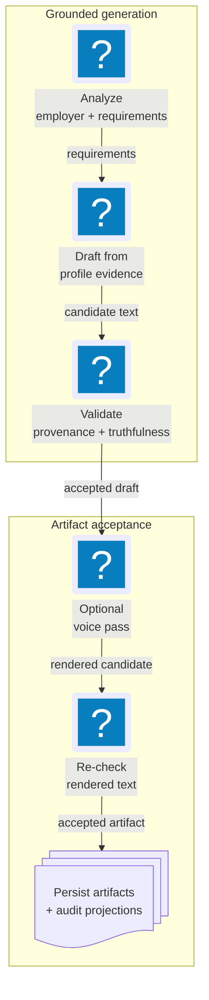

# Employer Analysis & Materials Audit

Materials turns job evidence and profile facts into generated artifacts, then
proves what each rendered claim came from. Generation mechanics and response
schemas live in the [Tailoring Contract](tailoring.md); this page owns the audit
model.

**Read this if** you are changing employer analysis, provenance, fabrication
checks, voice, coverage, interview prep, or the artifact inspector.

## At A Glance

The invariant is simple: the text audited for provenance and coverage is the
same text rendered into the accepted artifact.

## Canonical Employer Analysis

A parallel Claude, Codex, and Google analysis ensemble produces drafts; a
provider-neutral synthesizer reconciles healthy legs through any ready
provider. One failed optional leg records degraded audit data without cancelling
the others. A single ready provider is sufficient; all-provider failure is a
hard error.

The canonical, generation-versioned analysis stores:

- role framing, inferred seniority, and the ideal-candidate narrative;
- must-have/nice-to-have requirements with priority weights;
- reasoned keywords linked to requirements; and
- quoted posting evidence for every claim, plus per-leg output/failure and
  agreement metadata.

### Grounding Gate

Every evidence span must match the posting snapshot after formatting-only
normalization (whitespace, dash/quote variants, and case). A successful match is
snapped back to the posting's verbatim text and must align to token boundaries.
Paraphrases, synonyms, hallucinations, and substrings inside larger words fail.

This deterministic check runs on every draft and the synthesis. The result is
persisted in canonical `job_employer_analysis*` rows and projected identically by
Python and TypeScript.

### Reuse And Lifecycle

Analysis is cached by posting snapshot, prompt version, and SDK-set version.
Re-tailoring reuses that record; an explicit force recompute writes a superseding
generation instead of deleting history. `AnalyzeJobUseCase` can run as the first
tailoring step or through the standalone `analyze_job` method.

## Per-Line Provenance

Every rendered experience bullet, executive-profile line, and skill line gets a
stable provenance row. It records:

- section and rendered text;
- source profile fact and canonical evidence IDs;
- linked requirement IDs and verified matched keywords;
- a closed transform type and control rule; and
- a human-readable rationale.

The builder operates on the selected candidate's rendered text. Evidence and
requirement identifiers are real foreign keys, not model-authored labels. An
accepted generation writes provenance transactionally with its artifacts; a
failed or forced generation never destroys the previous accepted rows.

## Deterministic Truthfulness Gates

Prompt instructions are not the safety boundary. Independent checks run before
candidate selection and again after the optional voice pass.

### Facts, Metrics, And Named Technologies

Numeric values, dates, percentages, money, titles, and employer tokens must
trace to profile evidence. Named technologies mentioned in prose must ground in
the declared skill vocabulary or evidence corpus. Word-form variants may ground
concepts, while ambiguous technology names such as React require exact evidence.

Concept keywords such as scalability or observability are not mistaken for
named tools. The skills section has its own profile-backed allowlist.

A failing candidate is removed from selection and its exact findings become
repair guidance for the next attempt. If no candidate clears the gate, the run
fails closed and preserves the last accepted artifact.

### Cover Letters

Cover letters use the same fact and named-technology checks. The salutation is
excluded, and the target role/company may be named because they describe the
application—not the candidate's history. Numeric/date claims remain strict. An
unsafe letter is rejected and retains a minimal fabrication audit.

## Stored Interview Preparation

Interview prep is an explicit, pre-interview generation for one job. It loads
the profile snapshot, evidence map, requirement fit, and latest accepted bullet
provenance, then reuses Materials' grounding, fabrication, claim-mapping, and
adversarial-review gates.

Accepted and failed generations live in `job_interview_prep*`. A new accepted
generation supersedes the previous one; a failed attempt remains history and
does not hide the last accepted prep. The job-detail projection exposes themes,
STAR drafts, honest gap drills, evidence links, requirements, snippets, gate
status, and residual warnings.

Post-interview reflections reuse the normal local outcome path and can link to
the prep generation. Their note text does not enter events.

::: info Deliberately not live assistance
There is no transcript, microphone, streaming, websocket, in-session state, or
real-time answer surface in the domain, workflow, or JSON-RPC contracts.
:::

## Voice Pass And Final Audit

An optional Claude voice transform de-buzzwords and varies structure after a
candidate is selected. Skill lists are left untouched. The voiced version is
adopted only when deterministic proxies show lower buzzword density or greater
structural variety.

After voice, JobCtrl reruns provenance and fabrication checks against the final
rendered lines. If voice introduces an unsupported claim, the voiced payload is
discarded and the clean pre-voice candidate remains selected. The failed voice
attempt stays in audit history.

### Coverage Means Rendered And Grounded

Generation-time coverage partitions employer keywords into:

| State | Meaning |
| --- | --- |
| Covered | Appears in rendered text backed by canonical profile evidence. |
| Declared | Appears in a validated profile-backed skills line but has no demonstrated evidence. |
| Missing | Appears nowhere the employer will read. |

A requirement link alone cannot create coverage; that would let a keyword
ground itself. `coverage_ratio` counts demonstrated coverage only. The read
model uses the persisted coverage audit and never infers misses from the job
description at read time.

## Tailoring Explanation Read Model

Artifact projections expose validation/judge metadata plus canonical
provenance, coverage, and voice columns. A PDF resolves those audit fields from
its sibling tailored-resume row because both represent the same generation.

Apply Review and Artifacts compare only stored audit data: coverage buckets,
template metadata, validation/judge fields, and review risk labels. If either
artifact lacks coverage, the UI reports `coverage not recorded`; it does not
turn missing audit data into zero coverage.

Shared Python/TypeScript parity fixtures seed scores, stages, analysis,
provenance, and artifacts, then compare every dual-written projection column and
JSON shape. That is the drift guard for what the inspector displays.
