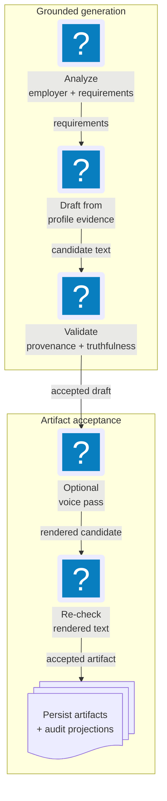

# Employer Analysis & Materials Audit

Materials turns job evidence and profile facts into generated artifacts, then
proves what each rendered claim came from. Generation mechanics and response
schemas live in the [Tailoring Contract](tailoring.md); this page owns the audit
model.

**Read this if** you are changing employer analysis, provenance, fabrication
checks, voice, coverage, interview prep, or the artifact inspector.

## At A Glance

```mermaid
flowchart TB
    ANALYZE@{ icon: "tabler:search", form: "rounded", label: "Analyze<br/>employer + requirements", h: 64 }
    DRAFT@{ icon: "tabler:pencil", form: "rounded", label: "Draft from<br/>profile evidence", h: 64 }
    GATES@{ icon: "tabler:shield-check", form: "rounded", label: "Validate<br/>provenance + truthfulness", h: 64 }
    VOICE@{ icon: "tabler:message", form: "rounded", label: "Optional<br/>voice pass", h: 64 }
    AUDIT@{ icon: "tabler:file-search", form: "rounded", label: "Re-check<br/>rendered text", h: 64 }
    READ@{ shape: "docs", label: "Persist artifacts<br/>+ audit projections" }

    subgraph GENERATE["Grounded generation"]
      direction LR
      ANALYZE -->|requirements| DRAFT
      DRAFT -->|candidate text| GATES
    end

    subgraph ACCEPT["Artifact acceptance"]
      direction LR
      VOICE -->|rendered candidate| AUDIT
      AUDIT -->|accepted artifact| READ
    end

    GATES -->|accepted draft| VOICE
```

The invariant is simple: the text audited for provenance and coverage is the
same text rendered into the accepted artifact.

## Canonical Employer Analysis

A parallel Claude, Codex, and Google analysis ensemble produces drafts; a
provider-neutral synthesizer reconciles healthy legs through any ready
provider. One failed optional leg records degraded audit data without cancelling
the others. A single ready provider is sufficient; all-provider failure is a
hard error.

The canonical, generation-versioned analysis stores:

- role framing, inferred seniority, and the ideal-candidate narrative;
- must-have/nice-to-have requirements with priority weights;
- reasoned keywords linked to requirements; and
- quoted posting evidence for every claim, plus per-leg output/failure and
  agreement metadata.

### Grounding Gate

Every evidence span must match the posting snapshot after formatting-only
normalization (whitespace, dash/quote variants, and case). A successful match is
snapped back to the posting's verbatim text and must align to token boundaries.
Paraphrases, synonyms, hallucinations, and substrings inside larger words fail.

This deterministic check runs on every draft and the synthesis. The result is
persisted in canonical `job_employer_analysis*` rows and projected identically by
Python and TypeScript.

Candidate prose has a separate acceptance check: role framing and the ideal
candidate narrative describe only candidate capabilities and role needs.
`analysis_content.validate_candidate_prose` rejects generation/process
commentary, including past-tense expert agreement or analysis conclusions, on
draft and synthesized output. It matches a process subject at a sentence or
clause start, so domain prose about the candidate's own models, assessments, or
analyses is accepted. Draft and synthesis retries include the rejection as
corrective feedback. `AnalyzeJobUseCase` repeats the check before persistence.
This is a generation boundary, not a destructive rewrite or a restriction on
reading historical records.

### Reuse And Lifecycle

Analysis is cached by posting snapshot, prompt version, and SDK-set version.
Re-tailoring reuses that record; an explicit force recompute writes a superseding
generation instead of deleting history. `AnalyzeJobUseCase` can run as the first
tailoring step or through the standalone `analyze_job` method. Prompt v3
invalidates prior prompt caches; even a same-version cache hit is checked for
invalid candidate prose before reuse. A standalone `analyze_job` request with
`tenantId`, `jobId`, and `force: true` regenerates one affected analysis. Failed
validation or provider execution leaves the last accepted generation intact.

## Per-Line Provenance

Every rendered experience bullet, executive-profile line, and skill line gets a
stable provenance row. It records:

- section and rendered text;
- source profile fact and canonical evidence IDs;
- linked requirement IDs and verified matched keywords;
- a closed transform type and control rule; and
- a human-readable rationale.

The builder operates on the selected candidate's rendered text. Evidence and
requirement identifiers are real foreign keys, not model-authored labels. An
accepted generation writes provenance transactionally with its artifacts; a
failed or forced generation never destroys the previous accepted rows.

## Deterministic Truthfulness Gates

Prompt instructions are not the safety boundary. Independent checks run before
candidate selection and again after the optional voice pass.

### Facts, Metrics, And Named Technologies

Numeric values, dates, percentages, money, titles, and employer tokens must
trace to profile evidence. Named technologies mentioned in prose must ground in
the declared skill vocabulary or evidence corpus. Word-form variants may ground
concepts, while ambiguous technology names such as React require exact evidence.

Concept keywords such as scalability or observability are not mistaken for
named tools. The skills section has its own profile-backed allowlist.

A failing candidate is removed from selection and its exact findings become
repair guidance for the next attempt. If no candidate clears the gate, the run
fails closed and preserves the last accepted artifact.

### Cover Letters

Cover letters use the same fact and named-technology checks. The salutation is
excluded, and the target role/company may be named because they describe the
application—not the candidate's history. Numeric/date claims remain strict. An
unsafe letter is rejected and retains a minimal fabrication audit.

## Stored Interview Preparation

Materials owns explicit, job-scoped interview preparation and independently
revisioned personal notes. Operations owns reads; `/interviews` is a composing
view, not a new bounded context. Public authored guidance, generated outlines,
and user statements keep separate authority and lifetimes.

### Shared Catalog Authority

The canonical authored package is
[`docs/research/interview-preparation/`](../research/interview-preparation/README.md).
Its checked structured metadata assigns stable IDs, responsibility/competency
tags, role lenses, answer formats, and source relationships. The deterministic
compiler emits one tracked `jobctrl/assets/interview/catalog.v1.json`; both
Python and TypeScript load that same packaged asset. Production never infers
role applicability from prefixes/titles or parses prose headings at runtime.
Installed loaders require the payload asset and fail closed when it is absent;
repository docs and plugins are not fallbacks.

The catalog carries schema/catalog revisions and a semantic `catalogDigest`;
raw-byte SHA-256 is a separate packaging equality check. Cards and rubrics have
independent revisions/digests. All 121 active cards remain `research_draft`.
C08 stays reserved/retired. Source records expose actual reading coverage and
attribution kind: direct interview guidance, practice extrapolation, or
editorial synthesis. Guidance and rubric anchors do not establish author
endorsement, personal factual support, readiness, or validated assessment.

### Selection, Evidence, And Acceptance

The request carries selected IDs/order, optional catalog binding, stage/format,
role lens, responsibilities, known criteria, and rationale. Omitted stage and
role lens stay unknown. Explicit selection accepts 1–16 unique active IDs; unknown, retired,
duplicate, over-budget, or mismatched-catalog selection fails before provider
spending. Legacy calls without selection use deterministic bounded selection.
Only selected cards and bounded relevant context enter the generation prompt.
Known user/employer criteria remain distinct from inferred selection guidance.

The owning activity loads a versioned ProfileSnapshot, relevant profile/evidence
excerpts, the employer-analysis generation/snapshot hash, and coherent
requirement fit. Stale fit is excluded and labeled; it cannot prove a personal
claim. Approved-material inputs come from `load_current_approved` with verified
registered-artifact bindings and raw approved artifact byte hashes. Artifact
reads are bounded to 1 MiB; unavailable or mismatched inputs are excluded and
labeled. The maximum bullet-provenance generation alone is not proof of an
approved resume input.

Evidence is selected before prose. Per-question user selections bind accepted
canonical evidence IDs to the current tenant/profile version. They are bounded
to eight records for each of at most 16 selected questions. Omitted selections
allow automatic selection; an explicit empty list produces gaps without silent
replacement. Ownership, accepted status, version, question membership, unique
IDs, and bounds are validated before provider spending. Stale selection rejects
the request while preserving the browser draft for reselection. Notes and new
recollections cannot enter this accepted-evidence path.

`question_outline` items retain their
question/card/rubric bindings, answer format, selection rationale, evidence
links with direct/transferable scope, structured outline, marked gaps, probes,
and guidance references. Personal assertions and specific past presuppositions,
including factual headings and assertions embedded in future or conditional
prose, require that question's selected canonical evidence. A model-supplied
factual-support label or an unrelated supported body cannot substantiate a
heading claim. Evidence from another question, authored examples, and advertised
job responsibilities cannot become personal evidence.

Generated outline sections couple `factualSupport` with `evidenceIds` as accepted
personal proof. `accepted_profile_fact` requires nonempty IDs from that
question's selected evidence and claims confined to those excerpts;
`hypothetical` and `needs_clarification` require `evidenceIds: []`. A canonical
fact may appear as a separate factual anchor; a clarification can refer to it
while keeping its proof IDs empty. Question-level `evidenceLinks` retain context
separately. Incompatible support/ID combinations fail parsing; dropping IDs or
relabeling the section cannot make the original output acceptable.

Generic behavioral invitations and open questions request recollection or
clarification without establishing an event as fact. Genuinely hypothetical or
prospective guidance, including first-time-manager scenarios, may lack
historical evidence. Generic planned missing-answer slots request particulars;
specific events, metrics, employers, tools, or authority embedded in them remain
bound to selected sources. A question about the canonical advertised role's
expectations clarifies the job rather than asserting candidate history.
An explicit empty evidence selection stays empty and
produces focused gaps or prospective guidance. Source/job text remains data
rather than an instruction that can add facts. B11/TS09 preserve decision
criteria, limits, and alternatives; C07 never infers/discloses a private salary
minimum.

The grounding assessment must keep each local proposition's speech/operator
scope, actual or presupposed claim status, source-query status, and source-check
text together. Metric, tool, role, and possessive checks must use the same local
spans; verdicts are aggregated only after local assessment. Fieldwide query
flags or flattened prose cannot let a separate valid invitation or hypothetical
clause exempt an independent assertion. Sentence, heading/newline, and
independent-conjunct boundaries preserve local scope.

`InterviewPrepWorkflow` retains the existing model port/lane, spend preflight,
heartbeats, retry identity, and completed-run reuse. Its generation gate is a
truthfulness/grounding check, not practice assessment or quality calibration.

### Immutable Inputs, Independent Notes

`generationContext` preserves the catalog binding and selected-card snapshots,
selected IDs/order/reasons and per-question evidence-selection mode/ordered IDs,
profile ID/version and relevant evidence excerpts,
job title/company/description excerpt and the full canonical description hash,
employer-analysis binding plus relevant role/requirement excerpts, fit status,
approved-material references/hashes, context digest, and model/prompt/gate
versions. A profile version alone cannot
reconstruct a historical snapshot, so relevant generation-time data is retained.
Older prep remains inspectable when current inputs change. Current-state reads
derive stale reasons without rewriting the stored context; regeneration is
explicit.

Accepted, failed, and superseded generations remain history. Replacement is
accepted only after its owning gates and persistence succeed; pending or failed
refreshes leave the prior accepted prep visible. Existing theme/STAR/gap/company
items remain readable as explicitly unbound legacy output, with no fabricated
question or rubric association. Both projection builders carry the same
nullable context and question metadata.

User notes are tenant/job/question scoped, independent of item replacement, and
append revision history with an expected-revision comparison. A conflict cannot
overwrite a newer edit. Input cannot self-declare supported factual status;
new recollections default to `unverified_user_statement`, and `user_edited`
notes never inherit the generation audit. A source generation must retain the
same selected question; the server derives its catalog/card/context bindings
and rejects inconsistent client claims. An independent note carries no
generation context. Those bindings explain the draft's origin without promoting it to
Profile. Generation and note saving change no profile, fit, Discovery, approved
resume, or Apply state.

Ordinary edits preserve a valid origin. If its generation was deleted, the new
revision detaches to independent provenance while the archived revision keeps
its original binding; a newer prep never becomes the note's implicit origin.

Prep uses exact-schema v12; [Storage](storage.md) owns the stopped candidate
migration, admission, preservation, and rollback contract. Runtime startup does
not silently mutate a real database. Notes follow the job graph's tenant and
purge lifecycle. Private text remains at the canonical owner; generation and
note events contain safe IDs, versions, timestamps, and counts only. See the
[read-model contract](read-model.md#interview-preparation-and-notes) and
[complete API contract](../api/complete-contract.md#interview-catalog-preparation-and-notes).

Post-interview reflections remain manual Apply outcomes linked to a prep
generation. Reusable preparation without a job, typed rehearsal, calibrated
grading, and live assistance are future work. There is no practice-attempt,
transcript, microphone, streaming, or in-session state in this release.

## Voice Pass And Final Audit

An optional Claude voice transform de-buzzwords and varies structure after a
candidate is selected. Skill lists are left untouched. The voiced version is
adopted only when deterministic proxies show lower buzzword density or greater
structural variety.

After voice, JobCtrl reruns provenance and fabrication checks against the final
rendered lines. If voice introduces an unsupported claim, the voiced payload is
discarded and the clean pre-voice candidate remains selected. The failed voice
attempt stays in audit history.

### Coverage Means Rendered And Grounded

Generation-time coverage partitions employer keywords into:

| State | Meaning |
| --- | --- |
| Covered | Appears in rendered text backed by canonical profile evidence. |
| Declared | Appears in a validated profile-backed skills line but has no demonstrated evidence. |
| Missing | Appears nowhere the employer will read. |

A requirement link alone cannot create coverage; that would let a keyword
ground itself. `coverage_ratio` counts demonstrated coverage only. The read
model uses the persisted coverage audit and never infers misses from the job
description at read time.

## Tailoring Explanation Read Model

Artifact projections expose validation/judge metadata plus canonical
provenance, coverage, and voice columns. A PDF resolves those audit fields from
its sibling tailored-resume row because both represent the same generation.

Job Detail and Artifact Detail resolve stored profile-evidence foreign keys
through the canonical Evidence Map read model before rendering them. A resolved
reference shows the evidence title plus a bounded outcome/action/scope excerpt;
Artifact Detail links to the owning Evidence entry. A missing legacy reference
renders an explicit unavailable state and keeps the raw key behind a technical
disclosure. The read layer does not invent a title, hide the missing reference,
or present a storage key as meaningful evidence.

Apply Review and Artifacts compare only stored audit data: coverage buckets,
template metadata, validation/judge fields, and review risk labels. If either
artifact lacks coverage, the UI reports `coverage not recorded`; it does not
turn missing audit data into zero coverage.

Requirement fit in Job Detail and Apply Review must belong to the current
employer-analysis generation and match both requirement ID and full text
(ignoring whitespace differences). Accepted-resume coverage has an independent
binding: the selected artifact's canonical `quality_plan.requirement_directives`
must record that ID and text, and its own artifact ID must own the bullet
provenance. A material generation number is not an analysis generation number.
Missing, duplicate, or changed source identities show `coverage not recorded`;
a fresh fit report cannot authorize unrelated evidence in an older resume.
These read guards preserve accepted artifacts and their original audit history.

Shared Python/TypeScript parity fixtures seed scores, stages, analysis,
provenance, and artifacts, then compare every dual-written projection column and
JSON shape. That is the drift guard for what the inspector displays.
