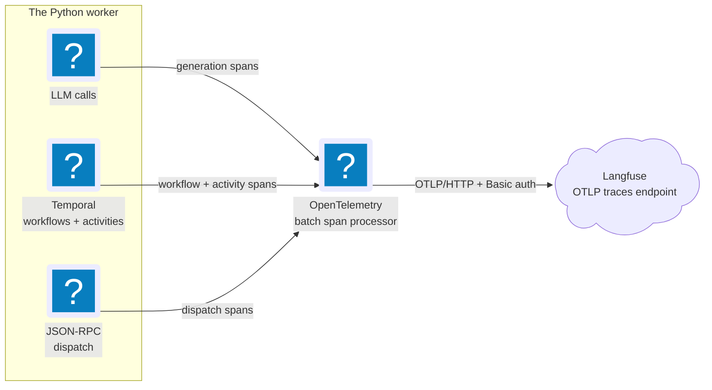

# Observability

JobCtrl exports OpenTelemetry spans for LLM calls, Temporal workflows, and the
TS↔Python JSON-RPC boundary to Langfuse — opt-in, off until configured.

**Read this if** you want to trace an LLM call, workflow, or JSON-RPC dispatch,
or wire the worker up to Langfuse.

Every OpenTelemetry span described on this page originates in the Python
worker; the TypeScript API and web app are not instrumented yet (see
[Out of Scope](#out-of-scope) below).

The Python worker exports OpenTelemetry spans over OTLP/HTTP to a
Langfuse instance for LLM tracing. The wiring lives under
`workers/automation/src/jobctrl/infrastructure/observability/`:

- `otel.py` — `init_otel()` configures a global `TracerProvider` with a
  `BatchSpanProcessor` feeding an `OTLPSpanExporter`. Endpoint:
  `${LANGFUSE_BASE_URL}/api/public/otel/v1/traces`. Authentication is HTTP
  Basic with `base64(LANGFUSE_PUBLIC_KEY:LANGFUSE_SECRET_KEY)`. If any of
  `LANGFUSE_PUBLIC_KEY` / `LANGFUSE_SECRET_KEY` / `LANGFUSE_BASE_URL` is
  unset, init logs a warning and the worker continues without exporting.
  `LANGFUSE_DISABLE=1` opts out even when credentials are present.
  `LANGFUSE_OTEL_TIMEOUT_SECONDS` bounds each OTLP export request and defaults
  to `5.0`.
- `llm_spans.py` — `llm_generation_span(...)` context manager that opens a
  `langfuse.observation.type=generation` span around each LLM call. It also
  sets the GenAI semantic-conventions attributes (`gen_ai.request.model`,
  `gen_ai.response.model`, `gen_ai.usage.input_tokens`,
  `gen_ai.usage.output_tokens`) so OTel-native dashboards work too. Exported
  LLM attributes are metadata-only: provider/model, operation/scope, outcome,
  token counts, and safe request/response sizes. Typed provider failures add
  bounded `jobctrl.llm.failure.*` dimensions for provider, model, operation,
  category, type, code, retryability, and an allowlisted provider code or HTTP
  status; structured calls also carry a schema fingerprint. Raw messages,
  parameters, completions, SDK objects, and exception messages are omitted.

## Span Sources

These sources emit spans:

| Source | Span name | `langfuse.observation.type` |
| --- | --- | --- |
| Every provider-routed `LlmPort` call | `llm.<model>` | `generation` |
| Each employer-analysis ensemble draft leg (scopes `jobctrl.analysis.claude` / `.codex` / `.antigravity`) | `llm.<model>` | `generation` |
| The employer-analysis synthesizer (scope `jobctrl.analysis.synthesizer`) | `llm.<model>` | `generation` |
| The resume voice pass (scope `jobctrl.materials.voice`) | `llm.<model>` | `generation` |
| Every Temporal workflow + activity (via `temporalio.contrib.opentelemetry.TracingInterceptor`) | workflow / activity name | `span` (default) |
| Every JSON-RPC dispatch (`jobctrl.infrastructure.rpc.server.JsonRpcServer.dispatch`) | `rpc.<method>` | `span` |
| Every pipeline stage (`jobctrl.pipeline.runner`) | `pipeline.stage.<stage>` | `span` |
| Every score use-case call (`ScoreJobUseCase`) | `scoring.score_job` | `span` |
| Discover source steps (`jobspy`, `workday`, `smartextract`) | `pipeline.source.discover.<source>` | `span` |
| Scheduled discovery runs | `discovery.run` | `span` |
| Source-quality projection rebuilds | `operations.source_quality.aggregate` | `span` |
| Discovery adapter fetches | `discovery.adapter.fetch` | `span` |
| Discovery canonical-identity resolution | `discovery.canonicalize` | `span` |
| Discovery duplicate matching | `discovery.dedupe` | `span` |
| Source locator validation | `discovery.source.validate` | `span` |
| Enrichment content acquisition | `enrichment.content.acquire` | `span` |
| Enrichment active-state verification | `enrichment.active.verify` | `span` |

Pipeline stages and Discover source steps also emit short
`langfuse.observation.type=event` observations for their
`StageStarted` / `StageCompleted` / `StageFailed` lifecycle records. The same
lifecycle records are persisted to `job_events`, which makes long-running or
stuck stages visible through SSE/recent activity even before the synchronous
JSON-RPC request returns. The stage runner forwards the caller's `limit` to
every stage. Discovery sources use that limit as a bounded debug crawl cap,
and skip remaining work after the cap is reached. Source families execute in
deterministic batches bounded by the planned `max_parallel_families` value
(default `1`, capped by policy and observed activity slots); the limit does not
create a separate concurrency model.

## Local Operations Telemetry

The Pipelines operations surface uses a second observability boundary that is
local SQLite state, not OpenTelemetry export:

- `PipelineStepQueued`, `PipelineStepStarted`, `PipelineStepCompleted`, and
  `PipelineStepFailed` are durable, privacy-bounded domain events projected into
  `pipeline_step_projections`. They carry the exact Discover workflow/run
  identity, bounded step/item codes, attempt, timing, counts, and retryability;
  they do not carry raw activity inputs or exception text.
- `worker_runtime_heartbeats` carries current capacity, exact active-slot count,
  bounded allowlisted active-work detail, completed-activity duration summaries,
  and a typed Temporal task-queue observation. This information feeds
  `GET /v1/pipeline/operations`; it is not sent to Langfuse by that path.

The Temporal activity interceptor never reads activity arguments. It retains
only allowlisted activity kinds, grammar-validated safe workflow/run references,
and non-reversible local opaque identifiers. URLs, job descriptions, candidate
profile data, prompts, provider responses, artifact paths, payloads,
credentials, and exception text are excluded. The oldest 20 allowlisted active
items are retained alongside an exact allowlisted total/truncation flag, while
the separate active-slot count includes every activity.

Heartbeat and task-queue sampling are best-effort observations. A telemetry
write or DescribeTaskQueue failure cannot fail the business activity. The API
keeps stale, unsupported, unavailable, and invalid states explicit rather than
turning missing data into zero. Approximate queue backlog/poller/rate units are
infrastructure observations and are never relabeled as domain jobs.

## Employer-Analysis Ensemble Spans

The employer-analysis ensemble uses the Claude Agent SDK, Codex SDK, and Google
SDK. Each backend supports plain and schema-constrained `LlmPort` calls. The
same ready backend that can draft can also synthesize, so no provider is a
universal dependency. Claude uses API/cloud-provider auth (not consumer CLI
OAuth), Codex uses the stable JobCtrl-owned CLI login, and Google uses a Gemini
key or verified Vertex ADC. The analysis run is visible through its
persisted `EmployerAnalyzed` `job_events` record and the read-model
`ensemble_completeness` field. Each parallel draft, the provider-neutral
synthesizer, and the optional post-selection resume voice pass wrap
their SDK model call in the same `llm_generation_span` the `LLMClient` uses, so
every frontier-model call reports its provider/model, stage, outcome, safe
content sizes, latency, and — when the SDK surfaces usage — input/output token
counts to Langfuse. Prompts and completions are not exported. Distinct
instrumentation scopes keep the drafts, synthesizer, and voice pass separable
even though they share the `llm.<model>` span name. Because the legs run inside
the enclosing pipeline-stage / JSON-RPC span (OTel context propagates through the
`asyncio.run` + `asyncio.gather` fan-out), Langfuse aggregates their token usage
and cost onto the surrounding analysis trace — the per-analysis cost rollup —
without extra plumbing. Instrumentation never changes control flow: an SDK error
is recorded on the span and re-raised into the existing per-leg
retry/partial-failure path, and missing SDK usage degrades to a span without
token counts rather than fabricating them.

## Trace Propagation And Startup

The `TracingInterceptor` is registered both client-side
(`infrastructure/temporal/client.py`) and worker-side
(`infrastructure/temporal/worker.py`) so trace context propagates from the
JSON-RPC handler that starts a workflow into the worker that runs it.

`init_otel()` is called from `jobctrl.cli._bootstrap()`, so every CLI
command (notably `jobctrl worker` and `jobctrl rpc`) configures
exporting on startup. The `worker` command calls `shutdown_otel()` on
exit so the `BatchSpanProcessor` flushes any in-flight spans.

`jobctrl doctor` includes a `Langfuse` row that probes the OTLP endpoint
with a `HEAD` request — `OK reachable`, `MISSING (set
LANGFUSE_PUBLIC_KEY/SECRET_KEY/BASE_URL)`, or `unreachable`.

## Public Demo Edge Logs

The deployment-gated public demo is a separate observability boundary. Static
assets come from Cloudflare Pages, a same-origin Worker handles only
`demo.jobctrl.dev/api/*`, and a scheduled Worker performs D1 retention.

Both Worker configs disable automatic invocation logs and traces. The Workers
emit only closed lifecycle fields and never log request bodies, cookies, IPs,
URLs, user agents, or referrers. Optional product measurement uses the typed,
consent-gated D1 event contract; non-linkable operational counters and
consented reports remain separate populations. After the versioned consent
service confirms acceptance, the demo also loads GA4 tag `G-6MJGD17JN0` with
Google Signals, advertising, and personalization disabled. The Google tag is a
separate third-party measurement boundary and is never loaded before consent.

## Out of Scope

Out of scope for this layer: TypeScript API / web instrumentation and
distributed-trace propagation across the TS↔Python JSON-RPC boundary
(would need TS to emit OTel context too).
