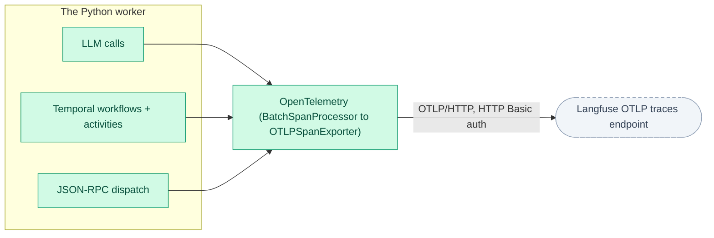

# Observability

JobHunter exports OpenTelemetry spans for LLM calls, Temporal workflows, and the
TS↔Python JSON-RPC boundary to Langfuse — opt-in, off until configured.

**Read this if** you want to trace an LLM call, workflow, or JSON-RPC dispatch,
or wire the worker up to Langfuse.

Every span originates in the Python worker; the TypeScript API and web app are
not instrumented yet (see [Out of Scope](#out-of-scope) below).

The Python worker exports OpenTelemetry spans over OTLP/HTTP to a
Langfuse instance for LLM tracing. The wiring lives under
`workers/automation/src/jobhunter/infrastructure/observability/`:

- `otel.py` — `init_otel()` configures a global `TracerProvider` with a
  `BatchSpanProcessor` feeding an `OTLPSpanExporter`. Endpoint:
  `${LANGFUSE_BASE_URL}/api/public/otel/v1/traces`. Authentication is HTTP
  Basic with `base64(LANGFUSE_PUBLIC_KEY:LANGFUSE_SECRET_KEY)`. If any of
  `LANGFUSE_PUBLIC_KEY` / `LANGFUSE_SECRET_KEY` / `LANGFUSE_BASE_URL` is
  unset, init logs a warning and the worker continues without exporting.
  `LANGFUSE_DISABLE=1` opts out even when credentials are present.
  `LANGFUSE_OTEL_TIMEOUT_SECONDS` bounds each OTLP export request and defaults
  to `5.0`.
- `llm_spans.py` — `llm_generation_span(...)` context manager that opens a
  `langfuse.observation.type=generation` span around each LLM call. It also
  sets the GenAI semantic-conventions attributes (`gen_ai.request.model`,
  `gen_ai.response.model`, `gen_ai.usage.input_tokens`,
  `gen_ai.usage.output_tokens`) so OTel-native dashboards work too.

## Span Sources

These sources emit spans:

| Source | Span name | `langfuse.observation.type` |
| --- | --- | --- |
| Every LLM call (`jobhunter.llm.LLMClient.chat`) | `llm.<model>` | `generation` |
| Each employer-analysis ensemble draft leg (scopes `jobhunter.analysis.claude` / `.codex` / `.antigravity`) | `llm.<model>` | `generation` |
| The employer-analysis synthesizer (scope `jobhunter.analysis.synthesizer`) | `llm.<model>` | `generation` |
| The resume voice pass (scope `jobhunter.materials.voice`) | `llm.<model>` | `generation` |
| Every Temporal workflow + activity (via `temporalio.contrib.opentelemetry.TracingInterceptor`) | workflow / activity name | `span` (default) |
| Every JSON-RPC dispatch (`jobhunter.infrastructure.rpc.server.JsonRpcServer.dispatch`) | `rpc.<method>` | `span` |
| Every pipeline stage (`jobhunter.pipeline.runner`) | `pipeline.stage.<stage>` | `span` |
| Every score use-case call (`ScoreJobUseCase`) | `scoring.score_job` | `span` |
| Discover source steps (`jobspy`, `workday`, `smartextract`) | `pipeline.source.discover.<source>` | `span` |
| Scheduled discovery runs | `discovery.run` | `span` |
| Source-quality projection rebuilds | `operations.source_quality.aggregate` | `span` |
| Discovery adapter fetches | `discovery.adapter.fetch` | `span` |
| Discovery canonical-identity resolution | `discovery.canonicalize` | `span` |
| Discovery duplicate matching | `discovery.dedupe` | `span` |
| Source locator validation | `discovery.source.validate` | `span` |
| Enrichment content acquisition | `enrichment.content.acquire` | `span` |
| Enrichment active-state verification | `enrichment.active.verify` | `span` |

Pipeline stages and Discover source steps also emit short
`langfuse.observation.type=event` observations for their
`StageStarted` / `StageCompleted` / `StageFailed` lifecycle records. The same
lifecycle records are persisted to `job_events`, which makes long-running or
stuck stages visible through SSE/recent activity even before the synchronous
JSON-RPC request returns. The stage runner forwards the caller's `limit` to
every stage. Discovery sources use that limit as a bounded debug crawl cap,
switch to sequential source execution when a cap is present, and skip remaining
sources after the cap is reached.

## Employer-Analysis Ensemble Spans

The employer-analysis ensemble is the first capability on the **agent-SDK**
standard (Claude Agent SDK + Codex SDK + Google Antigravity/Gemini SDK). The
legs currently run `claude-opus-4-8` (the Claude draft and synthesizer, and
also the resume voice pass), `gpt-5.5` (Codex), and `gemini-3.5-flash`
(Antigravity). Those
SDKs consume the existing local session credentials (Claude Code session, reused
Codex login, and `GEMINI_API_KEY`/`GOOGLE_API_KEY` for the Antigravity leg) —
they introduce no new key management. The analysis run is visible through its
persisted `EmployerAnalyzed` `job_events` record and the read-model
`ensemble_completeness` field. Each of the four ensemble legs (the three parallel
drafts + the Claude synthesizer) and the post-selection resume voice pass wrap
their SDK model call in the same `llm_generation_span` the `LLMClient` uses, so
every frontier-model call reports its model, prompt/completion, latency, and —
when the SDK surfaces usage — input/output token counts to Langfuse. Distinct
instrumentation scopes keep the drafts, synthesizer, and voice pass separable
even though they share the `llm.<model>` span name. Because the legs run inside
the enclosing pipeline-stage / JSON-RPC span (OTel context propagates through the
`asyncio.run` + `asyncio.gather` fan-out), Langfuse aggregates their token usage
and cost onto the surrounding analysis trace — the per-analysis cost rollup —
without extra plumbing. Instrumentation never changes control flow: an SDK error
is recorded on the span and re-raised into the existing per-leg
retry/partial-failure path, and missing SDK usage degrades to a span without
token counts rather than fabricating them.

## Trace Propagation And Startup

The `TracingInterceptor` is registered both client-side
(`infrastructure/temporal/client.py`) and worker-side
(`infrastructure/temporal/worker.py`) so trace context propagates from the
JSON-RPC handler that starts a workflow into the worker that runs it.

`init_otel()` is called from `jobhunter.cli._bootstrap()`, so every CLI
command (notably `jobhunter worker` and `jobhunter rpc`) configures
exporting on startup. The `worker` command calls `shutdown_otel()` on
exit so the `BatchSpanProcessor` flushes any in-flight spans.

`jobhunter doctor` includes a `Langfuse` row that probes the OTLP endpoint
with a `HEAD` request — `OK reachable`, `MISSING (set
LANGFUSE_PUBLIC_KEY/SECRET_KEY/BASE_URL)`, or `unreachable`.

## Out of Scope

Out of scope for this layer: TypeScript API / web instrumentation and
distributed-trace propagation across the TS↔Python JSON-RPC boundary
(would need TS to emit OTel context too).
