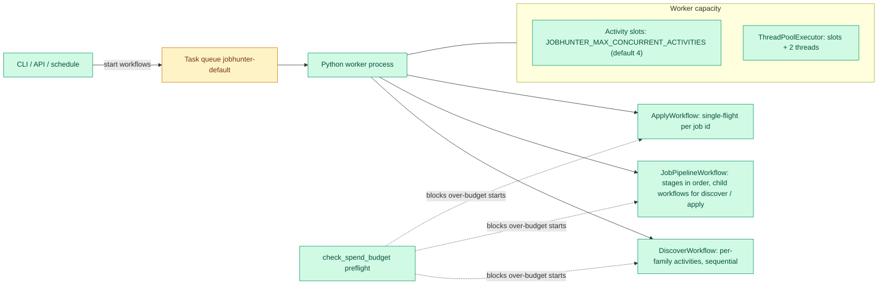

# Concurrency & Fan-out

Where parallelism actually lives in the pipeline, what bounds it, and which
knobs are real. The short version: a single Python worker executes every
activity, its slot count is the only Temporal (the workflow engine) concurrency
control, and workflows fan out for isolation rather than for parallel speed-up.

**Read this if** you are tuning worker capacity, wondering why two stages are not
running in parallel, or hunting a throughput bottleneck.

## The Worker's Capacity Model

A single long-lived worker process (`jobhunter worker`) polls the
`jobhunter-default` task queue and executes every activity. Two numbers define
its capacity, both fixed at worker startup in
`infrastructure/temporal/worker.py`:

- **Activity slots** — `JOBHUNTER_MAX_CONCURRENT_ACTIVITIES` (default `4`):
  the maximum number of Temporal activities running at once, across all
  workflows.
- **Executor threads** — a worker-owned `ThreadPoolExecutor` sized
  `slots + 2`, so blocking stage work never spills into the process default
  executor.

The worker heartbeat records both values, `GET /v1/health` returns them, and
the Settings page shows them, so the running capacity is always inspectable.
Changing capacity means setting the environment variable and restarting the
worker — it is process configuration, not a runtime setting.

Two knobs that look like Temporal concurrency but are not:

- The Pipelines page's **Workers** field flows into the discovery payload and
  controls per-source scraping parallelism inside a source activity (the
  JobSpy worker count), not Temporal activity slots.
- Search-combination execution inside one source family is sequential today
  (a plain loop in `jobspy.py`); parallelising it is a filed
  [backlog item](../../backlog.md), not current behavior.

## Where Fan-out Happens (And Why)

- **DiscoverWorkflow** plans sources once (`plan_discovery_sources`), then runs
  one `discovery_source_family` activity **per source family in a sequential
  loop**. This is deliberate isolation, not parallelism: each family gets its
  own activity-level timeout, heartbeat, and retry policy, and a family
  failure is recorded (`families_failed`) while the loop continues to the next
  family.
- **Score-as-you-discover streaming (R9 Phase 1).** After **each family
  completes**, the workflow immediately runs `discovery_enrichment` (drains that
  family's fresh jobs) and `discovery_preparation_fanout` (starts their per-job
  `JobPreparationWorkflow`s), instead of waiting for every family to finish. So a
  job discovered by the first family is scored while later families are still
  crawling. A **terminal reconcile** enrichment + fan-out still runs after the
  loop and remains authoritative for the tolerated-partial-failure folding and
  progress finalization; the per-family passes are additive and best-effort
  (any non-cancellation failure is left for the terminal pass to sweep up).
  These streaming passes are **progress-silent** (`progress_total=0`) so the
  Runs bar stays monotonic on the family + terminal spine — see
  [Operations & Events](operations.md#discovery-run-progress). Repeated fan-out
  is idempotent: the deterministic `prep-{idempotency_key}` id plus
  `USE_EXISTING` means N invocations start exactly one workflow per job. The
  first fan-out sweeps pre-existing `pending_tailor` stragglers once
  (`include_pending_tailor=True`); every later pass is score-only, so a fresh
  job crossing `pending_score` → `pending_tailor` mid-tailor is never
  double-fanned.
- **Per-job handoff (R9 Phase 2).** Streaming enrichment passes run with
  `per_job_handoff=True`: as each job is individually enriched (committed to
  `pending_score`), the enrichment worker starts that job's `SCORE_JOB`
  preparation workflow **immediately**, before its siblings in the same family
  are even scraped, tightening Time To First Score to per-job granularity. This
  is a side effect **inside** the enrichment activity (`on_job_enriched`
  callback threaded to `enrichment/detail.py`), so `DiscoverWorkflow`'s command
  history is unchanged (determinism/replay safe). Starts use the same
  deterministic `prep-{idempotency_key}` id as the fan-out, so the per-job
  handoff and the reconciling fan-outs converge on exactly one execution per job
  (`USE_EXISTING`). Per-job starts are serialized by a lock because
  `_run_detail_scraper` may enrich sites in parallel threads, and the handoff is
  best-effort (a start failure is logged and left for the fan-out backstop,
  never mistaken for an enrichment failure).
- **JobPipelineWorkflow** executes the selected stages in pipeline order and
  delegates `discover` and `apply` to child workflows, so the risky surfaces
  keep their own workflow identity, history, and retry policy.
- **ApplyWorkflow** is single-flight per job: the workflow id
  `apply-{tenant}-{jobKey}` plus `USE_EXISTING` and a one-attempt live retry
  policy make a duplicate submission structurally impossible rather than
  merely unlikely.
- Concurrent workflows (a discovery run, a scoring batch, an apply) share the
  worker's activity slots; Temporal queues whatever exceeds them.

## What Bounds Throughput

| Bound | Mechanism | Where |
| --- | --- | --- |
| Activity slots | `JOBHUNTER_MAX_CONCURRENT_ACTIVITIES`, executor `slots + 2` | `infrastructure/temporal/worker.py` |
| LLM spend | `check_spend_budget` preflight stops spendful workflows at the daily ceiling | [Spend Ceiling](operations.md#spend-ceiling) |
| Retries | per-activity retry policies from the error taxonomy | [Envelope & Activities](envelope.md) |
| Worker readiness | worker-backed API actions return 503 until a healthy heartbeat exists | [Runtime Boundaries](../runtime.md) |
| Apply single-flight | per-job workflow id + submit-intent checkpoint | [Stage Walkthrough](stages.md#apply) |

Data-flow context — where each stage persists and how results reach the UI —
lives in [Operations & Events](operations.md).
