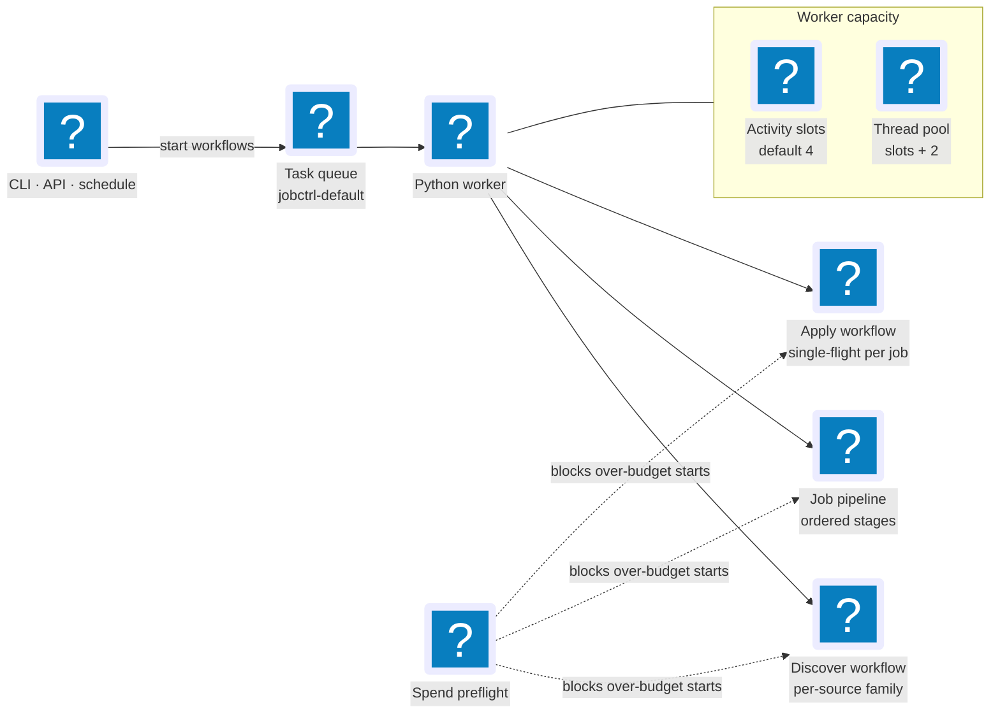

# Concurrency & Fan-out

Where parallelism actually lives in the pipeline, what bounds it, and which
knobs are real. The short version: the normal local stack starts one Python
worker, all matching workers share one Temporal (the workflow engine) task
queue, activity slots are the execution-capacity boundary, and workflows fan
out primarily for isolation.

**Read this if** you are tuning worker capacity, wondering why two stages are not
running in parallel, or hunting a throughput bottleneck.

## The Worker's Capacity Model

The normal local stack runs one long-lived worker process (`jobctrl worker`) on
the `jobctrl-default` task queue. If more matching workers are running, Temporal
may dispatch activities to any of them and the Operations read model aggregates
their fresh capacity. Two numbers define each worker's capacity, both fixed at
worker startup in
`infrastructure/temporal/worker.py`:

- **Activity slots** — the `worker_activity_slots` Setting in `config.json`
  (default `4`): the maximum number of Temporal activities running at once,
  across all workflows.
- **Executor threads** — a worker-owned `ThreadPoolExecutor` sized
  `slots + 2`, so blocking stage work never spills into the process default
  executor.

The worker heartbeat records both values. `GET /v1/health` exposes the health
boundary, while `GET /v1/pipeline/operations` derives the app directory from
its configured database path, filters heartbeats to that resolved
database/app-dir identity, selects the task queue named by the newest matching
heartbeat, and aggregates fresh schema-valid rows from that queue into
configured, active, and available slots. Changing `worker_activity_slots` in
Settings writes `config.json`; restart the worker to apply the new capacity.

Two knobs that look like Temporal concurrency but are not:

- The Pipelines page's **Internal concurrency** field flows into the discovery payload and
  controls the worker count for source adapters that expose internal scraping
  parallelism; it does not create Temporal activity slots.
- Resumable JobStreaming execution inside the broad-board source family is
  sequential by immutable query/location/board unit (a plain loop in the
  compatibility-named `jobspy.py`). JobStreaming owns each board adapter's
  internal transport/pagination and cancellation-aware waits. Parallelising
  durable units is a filed
  [backlog item](../../backlog.md), not current behavior.

## Where Fan-out Happens (And Why)

- **DiscoverWorkflow** plans sources once (`plan_discovery_sources`), then runs
  the `discovery_source_family` activities **one family at a time by default**
  (`max_parallel_families=1` in Discovery Runtime's SQLite-backed settings).
  This is deliberate isolation:
  each family gets its own activity-level timeout, heartbeat, and retry policy,
  and a family failure is recorded (`families_failed`) while the run continues to
  the next family. Raising the cap runs families concurrently (R9 Phase 3,
  below).
- **Score-as-you-discover streaming (R9 Phase 1, corrected 2026-08-03).** The
  workflow starts one execution-scoped `discovery_enrichment` activity before
  source crawling. It polls the durable current-execution membership while
  `discovery_source_family` activities are still committing jobs, so a broad
  JobStreaming family does not have to finish all of its search units before the
  first job can be enriched. After producers finish, the workflow cancels that
  live consumer and runs a **terminal reconcile** enrichment + fan-out, which
  remains authoritative for tolerated-partial-failure folding and progress
  finalization. Per-family preparation fan-outs remain as best-effort backstops.
  The live enrichment and backstop fan-outs are **progress-silent**
  (`progress_total=0`) so the Runs bar stays monotonic on the family + terminal
  spine — see
  [Operations & Events](operations.md#discovery-run-progress). Repeated fan-out
  is idempotent: the deterministic `prep-{idempotency_key}` id plus
  `USE_EXISTING` means N invocations start exactly one workflow per job. A
  one-time straggler sweep (`include_pending_tailor=True`) runs **before** the
  family loop — the only moment `pending_tailor` holds only pre-existing
  scored-but-not-tailored work and cannot race a fresh job's in-flight SCORE_JOB
  workflow. Every family + terminal fan-out is score-only, so a fresh job
  crossing `pending_score` -> `pending_tailor` mid-tailor is never double-fanned.
- **Per-job handoff (R9 Phase 2).** The live enrichment activity runs with
  `per_job_handoff=True`: as each job is individually enriched (committed to
  `pending_score`), the enrichment worker starts that job's `SCORE_JOB`
  preparation workflow **immediately**, before its siblings in the same family
  are even scraped, tightening Time To First Score to per-job granularity. This
  is a side effect **inside** the enrichment activity (`on_job_enriched`
  callback threaded to `enrichment/detail.py`), so `DiscoverWorkflow`'s command
  history is unchanged (determinism/replay safe). Starts use the same
  deterministic `prep-{idempotency_key}` id as the fan-out, so the per-job
  handoff and the reconciling fan-outs converge on exactly one execution per job
  (`USE_EXISTING`). Per-job starts are serialized by a lock because
  `_run_detail_scraper` may enrich sites in parallel threads, and the handoff is
  best-effort (a start failure is logged and left for the fan-out backstop,
  never mistaken for an enrichment failure).
- **Parallel source families (R9 Phase 3, gated, default off).** Families are
  processed in batches of the Discovery Runtime `max_parallel_families` value
  (default `1` = sequential = today's behavior). With a value > 1, that many families'
  **source crawls** run concurrently (`asyncio.gather` over the batch) while the
  single execution-scoped enrichment activity consumes committed jobs. The
  batch's score-only fan-out then runs once afterward. The cap is resolved at
  planning time (in `plan_discovery_sources`) and threaded through the plan, so
  the workflow stays deterministic; results are folded in submission order, and a
  canceled source in any batch cooperatively cancels the whole run. See the
  worker-capacity analysis below before raising the cap.
- **JobPipelineWorkflow** executes the selected stages in pipeline order and
  delegates `discover` and `apply` to child workflows, so the risky surfaces
  keep their own workflow identity, history, and retry policy.
- **ApplyWorkflow** is single-flight per job: the workflow id
  `apply-{tenant}-{jobKey}` plus `USE_EXISTING` and a one-attempt live retry
  policy make a duplicate submission structurally impossible rather than
  merely unlikely.
- Concurrent workflows (a discovery run, a scoring batch, an apply) share the
  worker's activity slots; Temporal queues whatever exceeds them.

## What Bounds Throughput

| Bound | Mechanism | Where |
| --- | --- | --- |
| Activity slots | Settings `worker_activity_slots`, executor `slots + 2` | `config.json`, `infrastructure/temporal/worker.py` |
| Parallel discovery families | Discovery Runtime `max_parallel_families` (default `1`) | SQLite, `infrastructure/temporal/concurrency.py`, `discovery/workflow.py` |
| LLM spend | `check_spend_budget` preflight stops spendful workflows at the daily ceiling | [Spend Ceiling](operations.md#spend-ceiling) |
| Retries | per-activity retry policies from the error taxonomy | [Envelope & Activities](envelope.md) |
| Worker readiness | worker-backed API actions return 503 until a healthy heartbeat exists | [Runtime & Processes](../runtime.md) |
| Observed capacity | fresh matching heartbeat rows; exact slots include every activity even when safe detail is omitted | [Operations & Events](operations.md#pipeline-operations-snapshot) |
| Task-queue pressure | approximate workflow/activity backlog and poller observations; unavailable/unsupported are not zero | `GET /v1/pipeline/operations` |
| Apply single-flight | per-job workflow id + submit-intent checkpoint | [Stage Walkthrough](stages.md#apply) |

### Worker-Capacity Analysis (Parallel Families)

Discovery Runtime `max_parallel_families` is off by default (`1`) because
browser/resource contention is the first-class risk of running families
concurrently: there is operational history of uncontrolled browser concurrency
destroying long runs. For a chosen cap `M`:

- **Peak activity slots.** Up to `M` `discovery_source_family` activities plus
  one live `discovery_enrichment` activity run at once, competing with fan-out + per-job
  `JobPreparationWorkflow`s from Phases 1–2 for the same
  `worker_activity_slots` setting (default 4). Temporal queues the
  excess, so `M` at or above the slot count starves enrichment. **Keep
  `M + 1` below the activity-slot ceiling** and leave headroom for preparation.
- **Peak concurrent browsers.** The single enrichment consumer can overlap the
  batch's source crawls: roughly `M` browser-launching families plus one
  enrichment browser group, each with its configured internal workers. Each
  headless Chromium is ~300–600 MB. **Size `M` against available memory** — on a
  typical 16 GB developer machine, `M = 2–3` is a safe starting point; measure
  before going higher.
- **No new failure surface.** Parallel families keep each family's own
  activity timeout / heartbeat / retry isolation and the exact partial-failure
  folding; a canceled source cancels the whole run. Long-run soak on a real
  workload remains an owner responsibility given the historical browser-GC
  incident.

Data-flow context — where each stage persists and how results reach the UI —
lives in [Operations & Events](operations.md).

## What The Operations Snapshot Can Prove

Runtime activity interception counts every active activity slot. It separately
keeps an oldest-first, allowlisted detail list capped at 20 and an exact
allowlisted-detail total, so `activeSlots` may legitimately exceed the number of
rendered active items. The interceptor never reads activity arguments; unsafe
identifiers are replaced with local opaque hashes, while only grammar-validated
workflow/run references may remain readable.

Task-queue statistics are not another capacity total. They are approximate
Temporal observations for the workflow and activity queue: pollers, backlog
count/age, and add/dispatch rates. The capacity response preserves
`unsupported`, `unavailable`, and `stale` states. The ETA estimator therefore
refuses to divide domain work by nominal slots when runtime telemetry is stale
or shared queue contention cannot be bounded.
