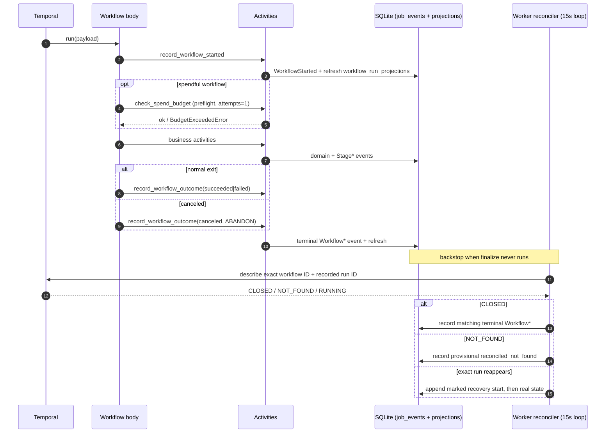

# Envelope & Activities

The **envelope** is the contract every workflow obeys: one shared
start / heartbeat / completion shape, the same activity conventions, and a single
error taxonomy mapped onto Temporal (the workflow engine) retry policies. This
page covers that envelope, the registered activities the workflows call, and how
the error taxonomy drives retries.

**Read this if** you need to know how a workflow starts, heartbeats, and
terminalizes, what activities exist, or why a given failure retried or stopped.

## The Universal Workflow Envelope

Every workflow — all six — wraps its business logic in the same envelope so a
run is always visible in the read model and always terminalizes, even on crash.
The helpers live in
`workers/automation/src/jobctrl/infrastructure/temporal/finalize.py`.

1. **`record_workflow_started`** emits a `WorkflowStarted` marker at the top of
   `run`, with a compact camelCase input summary.
2. **`check_spend_budget`** runs as a preflight for spendful workflows (see
   [Spend Ceiling](operations.md#spend-ceiling)). It runs with `maximum_attempts=1`, so a
   depleted budget fails the run before any paid work.
3. **Business activities** run (stages, per-job steps, apply, import, refresh).
4. **`record_workflow_outcome`** emits exactly one terminal event on every exit
   path — `WorkflowCompleted`, `WorkflowFailed`, `WorkflowCanceled`,
   `WorkflowTimedOut`, or `WorkflowTerminated`. On the cancel path the finalize
   activity uses `ActivityCancellationType.ABANDON` so the tiny SQLite write can
   finish while the workflow unwinds.

Both finalize activities are small local writes: they append to the append-only
`job_events` log (with `job_url = NULL`, since a run is a batch, not a job) and
then explicitly call `ProjectionBuilder.refresh()` so `workflow_run_projections`
updates even in a process with no bus-subscribed builder. Workflow bodies stay
deterministic: all clock/uuid/SQLite IO happens inside activities; the bodies
only read `workflow.info()` / `workflow.now()`.

Notice that every path ends in exactly one terminal `Workflow*` event: finalize
writes it on the normal and cancel paths, and the reconciler backstops the crash
path.

### Deterministic Workflow IDs

Deterministic IDs plus `WorkflowIDConflictPolicy.USE_EXISTING` are how JobCtrl
gets idempotent starts: re-requesting the same work attaches to the in-flight
execution instead of spawning a duplicate.

| Workflow | ID scheme | Conflict policy |
| --- | --- | --- |
| `DiscoverWorkflow` (standalone / schedule) | `discover-{tenant}` | one live discovery per tenant |
| `DiscoverWorkflow` (child of pipeline) | `{parent}-discover` | scoped to the parent |
| `ApplyWorkflow` (per-job) | `apply-{tenant}-{jobKey}` | one live apply per job |
| `ApplyWorkflow` (child of pipeline) | `{parent}-apply` | scoped to the parent |
| `JobPreparationWorkflow` | `prep-{idempotency_key}` | `USE_EXISTING` |
| `ManualCaptureImportWorkflow` | `manual-capture-import-{sha256(tenant)}-{sha256(itemId)}` | one live import per tenant queue item; raw capture ids never enter Temporal ids |
| `JobPipelineWorkflow`, `ProfileImportWorkflow`, `CompensationRefreshWorkflow` | server-generated | — |

The preparation idempotency key
(`make_preparation_idempotency_key`, in `domain/preparation`) is derived from
tenant, job id, work-item kind, **target version**, and **source event id**:

- `target_version` is the scoring-policy version for `score` targets and the
  tailoring-policy version for `tailor`/`cover`/`pdf` targets.
- `source_event_id` is the latest of `JobDiscovered`, `JobUpdated`,
  `JobEnriched`, `PostingContentSnapshotCaptured`, or `StageCompleted` for that
  job. A new source fact yields a new key, so genuinely new work gets a new
workflow while reruns of unchanged work dedupe onto the existing one.

### Discover Execution Identity And Membership

Workflow IDs provide idempotent starts, but they are not sufficient lineage:
the deterministic `discover-local` ID can name more than one Temporal run over
time. `DiscoverWorkflow.run()` therefore reads `workflow.info()` once and
creates an immutable `DiscoveryExecutionRef` containing tenant, workflow ID,
and Temporal run ID. Source-run IDs are deliberately excluded.

That exact reference is carried through planning, source families,
reconciliation, preparation fan-out, child `JobPreparationWorkflow` input, and
PDF rendering. `discovery_execution_jobs` stores one membership per execution
and stable JobId. Its cohort is `observed_this_run` or
`existing_backlog`; a later source observation may promote a swept membership
to current, but cannot duplicate or demote it. A work plan remains explicitly
`pending` until it becomes `planned`, `not_eligible`, or `failed`; a missing
required-step list is never interpreted as proof of no work.

### Broad-Board Search Unit Envelope

The `jobspy` source family name remains a compatibility key, but its provider is
JobStreaming 0.0.2. At activity start, JobCtrl compiles or verifies an immutable
ordered plan of query/location/board units under the exact
`DiscoveryExecutionRef`. Changing the live target-search configuration cannot
rewrite a retrying execution's persisted plan.

Each claimed unit carries the Temporal activity attempt, an owner token, and a
monotonic lease epoch. A later attempt may reclaim a `running` unit and
increments the epoch; every accepted-job write and provider-checkpoint
compare-and-swap verifies the current fence. This prevents a delayed old worker
from advancing or canceling work after replacement.

The event order is store, then acknowledge:

1. project and filter the JobStreaming event;
2. atomically persist accepted job/source/event facts and the unit receipt, or
   a hashed filtered-result receipt when caller policy rejects the posting;
3. acknowledge the exact event, which advances the provider checkpoint; and
4. derive accepted/filtered progress and the global new-job limit from durable
   receipts.

Stopping before step 3 causes at-least-once replay, not lost work. Stable
provider keys and idempotent receipts make that replay harmless. A cursor reset
is durable intent tied to the acknowledgement revision of its `ErrorEvent`; it
cannot clear the checkpoint early. Request-fingerprint or cursor-schema
incompatibility is terminal and explicit. Cooperative cancellation interrupts
the provider and terminalizes unfinished units; it is never treated as a
resumable crash.

### Pipeline-Step Lifecycle Envelope

Execution-owned orchestration uses a narrower lifecycle envelope alongside the
universal workflow envelope:

1. `PipelineStepQueued` establishes the step and attempt.
2. `PipelineStepStarted` records the actual start.
3. `PipelineStepCompleted` records bounded detail code/count and duration, or
   `PipelineStepFailed` records bounded error code and retryability.

The allowed step kinds are `source_planning`, `source_family`,
`enrichment_pass`, `preparation_fanout`, `existing_backlog_sweep`, and
`pdf_render`. Item keys use a bounded grammar. Payloads never carry raw
activity arguments, URLs, provider output, or exception text. The projection
fold is attempt-aware: a higher attempt replaces an older attempt, late lower
attempts are ignored, and the first terminal result wins within one attempt.
This lifecycle fills orchestration gaps; canonical per-job stage state remains
authoritative for `enrich`, `score`, `tailor`, and `cover`.

### Finalize + The Describe-Based Reconciler

When the Python worker is killed mid-run, an activity times out, or the Temporal
service is temporarily connected to the wrong history store, finalize may never
run. The **reconciler** is the backstop. It is not a trigger-coupled reaper; it
is a describe loop inside the worker's 15-second heartbeat loop (`cli.py`,
`_reconcile_workflow_runs`):

- For each non-terminal row, and each provisional
  `reconciled_not_found` row, it calls `describe()` with both the workflow ID
  and the recorded Temporal run ID.
- A **CLOSED** execution records the matching terminal `Workflow*` event
  (COMPLETED→succeeded, FAILED→failed, CANCELED→canceled,
  TERMINATED→terminated, TIMED_OUT→timed_out).
- A **NOT_FOUND** execution records a provisional `WorkflowTerminated` so the
  run stops showing as forever-running while its authority is unavailable.
- A **RUNNING / CONTINUED_AS_NEW** execution is left alone.
- If that exact Temporal run later reappears, the reconciler appends an
  explicitly marked recovery `WorkflowStarted`. The fold accepts this
  compensation only for the same run ID after `reconciled_not_found`; ordinary
  duplicate starts still cannot reopen terminal truth. A recovered closed run
  receives its actual terminal outcome in the same pass.

The reconciler never deletes or overwrites terminal audit events. Both
`JobPipelineWorkflow` and
`ApplyWorkflow` encode stage/apply failure in their *return value*, so a failing
run still closes COMPLETED on the Temporal side even though finalize already
wrote `WorkflowFailed`. Before writing, the reconciler takes `BEGIN IMMEDIATE`
and re-reads the row; if a real terminal outcome landed since the snapshot, it
leaves it. A first-terminal-wins fold in the projection builder backstops
anything that slips past.

## Activities

Twenty-two activities are registered in `registry.py` (`ACTIVITIES`).

| Activity (callable) | Module | Purpose | Timeout · retry |
| --- | --- | --- | --- |
| `plan_discovery_sources` | `discovery/activities.py` | Plan which source families to run | 30 min · ×3 |
| `discovery_source_family_activity` | `discovery/activities.py` | Run one source family (crawl/enumerate) | 6 h · ×3 |
| `discovery_enrichment_activity` | `discovery/activities.py` | Drain detail enrichment + post-hygiene | 6 h · ×3 |
| `discovery_preparation_fanout_activity` | `discovery/activities.py` | Derive targets, start prep root workflows (batches of 25) | 30 min · ×3 |
| `enrich_activity` | `enrichment/activities.py` | Standalone/maintenance enrich stage | 30 min · ×3 |
| `score_activity` | `scoring/activities.py` | Batch score stage | 30 min · ×3 |
| `score_job_activity` | `scoring/activities.py` | Score one job (prep step) | 30 min · ×3 |
| `tailor_activity` | `materials/activities.py` | Batch tailor stage | 30 min · ×3 |
| `tailor_job_activity` | `materials/activities.py` | Tailor one job (prep step) | 30 min · ×3 |
| `cover_activity` | `materials/activities.py` | Batch cover stage | 30 min · ×3 |
| `cover_letter_activity` | `materials/activities.py` | Cover letter for one job (prep step) | 30 min · ×3 |
| `render_pdf_activity` | `materials/activities.py` | Render missing PDFs (prep step) | 30 min · ×3 |
| `derive_preparation_targets` | `pipeline/preparation.py` | Deterministic per-job target list (sync) | invoked within fan-out |
| `apply_activity` | `apply/activities.py` | Drive the apply launcher (browser/agent) | 2 h / 1 h · live 1, dry 2 |
| `manual_capture_import_activity` | `discovery/manual_capture_workflow.py` | Import a queued capture; validate and reconstruct an identical committed retry | 10 min · ×2 |
| `profile_import_activity` | `profile/activities.py` | Import resume PDF → profile draft | 10 min · ×2 |
| `refresh_compensation_activity` | `infrastructure/compensation/workflow.py` | Refresh posted comp + market estimate | 20 min · ×2 |
| `generate_interview_prep_activity` | `interview/activities.py` | Generate stored interview preparation | 20 min · ×2 |
| `run_contact_research_activity` | `contact/activities.py` | Fetch approved sources and extract review candidates | 30 min · ×3 |
| `check_spend_budget` | `llm.py` | Preflight daily-spend gate | 30 s · 1 |
| `record_workflow_started` | `infrastructure/temporal/finalize.py` | Emit `WorkflowStarted` | 30 s · ×5 |
| `record_workflow_outcome` | `infrastructure/temporal/finalize.py` | Emit terminal `Workflow*` | 30 s · ×5 (ABANDON on cancel) |

### run_blocking_with_heartbeat

Most business activities call synchronous domain runners. Calling them directly
inside an `async def` activity would block the worker's event loop for the whole
stage — defeating heartbeats and starving every other activity on the worker.
`infrastructure/temporal/run_in_activity.py` solves this with
`run_blocking_with_heartbeat`, which every long-running activity uses:

- It offloads the synchronous function to a **bounded, worker-owned
  `ThreadPoolExecutor`** and emits a heartbeat every `poll_interval` (default
  **15 s**) while waiting.
- On `asyncio.CancelledError` (a Temporal cancel) it invokes the supplied
  cooperative `on_cancel` hook, waits up to `cancel_wait_seconds` (default
  **30 s**) for the thread to stop, and re-raises.
- If the thread ignores cancellation past that grace window, it logs
  `abandoned_thread` and records an `operational_attempt_metric`
  (`stage="operations"`, `attempt_kind="temporal_activity_thread"`,
  `error_class="abandoned_thread"`) so a wedged thread is observable.

This is why the discovery source-family and enrichment activities (and the apply
activity) accept a `threading.Event` cancel token: the workflow-level cancel
propagates into the running crawl/launcher cooperatively rather than being
severed mid-write. The tiny marker activities (`plan_discovery_sources`,
`derive_preparation_targets`, `check_spend_budget`,
`record_workflow_started/outcome`) run inline without the thread offload.

### The Runtime Guard

Because multiple JobCtrl checkouts can point at different app dirs and DBs,
every activity that writes calls `assert_activity_runtime`
(`infrastructure/temporal/runtime_guard.py`) with the expected app dir and DB
path carried in its input. A mismatch raises a **non-retryable**
`ApplicationError(type="RuntimeIdentityMismatch")`, so an activity that landed on
the wrong worker fails fast instead of writing to the wrong database.

### Runtime Telemetry Boundary

Every Temporal activity also passes through a worker interceptor that records
an exact active-slot count without changing activity behavior. The interceptor
does not read activity arguments. Only allowlisted activity kinds can appear in
detail, and unsafe identifiers are replaced by non-reversible local `op_...`
hashes; only grammar-validated safe workflow/run references remain readable.
The heartbeat retains at most 20 oldest active details plus an exact allowlisted
total and truncation flag. URLs, job descriptions, profiles, prompts, provider
responses, artifact paths, payloads, credentials, and exception text are outside
the telemetry contract.

Heartbeat or task-queue sampling failure is observational only: the interceptor
catches it and continues the business activity. The operations API derives the
expected app directory from its configured database path, filters rows to that
resolved database/app-dir identity, selects the queue named by the newest
matching heartbeat, validates heartbeat schema/capacity invariants, and
aggregates fresh valid rows from that queue.

## Error Taxonomy → Temporal Retry

Retry behavior is driven by a small error taxonomy in
`workers/automation/src/jobctrl/domain/errors.py`. `JobCtrlError` carries a
`code` and a `retryable` flag; `to_application_error` converts it to a Temporal
`ApplicationError(type=code, non_retryable=not retryable)`.

| Error | Code | Retryable? |
| --- | --- | --- |
| `ConfigurationError` | `configuration` | no |
| `AuthenticationError` | `authentication` | no |
| `MissingInputError` | `missing_input` | no |
| `BudgetExceededError` | `budget_exceeded` | no |
| `TransientNetworkError` | `transient_network` | yes |
| `BrowserTransientError` | `browser_transient` | yes |
| `LlmTransientError` | `llm_transient` | yes |
| `SourceUnavailableError` | `source_unavailable` | yes |
| unclassified exception | `unclassified` | yes |

Every retrying workflow lists
`non_retryable_error_types = ["configuration", "authentication",
"missing_input", "budget_exceeded"]` in its `RetryPolicy`. So the four
configuration/precondition errors stop immediately, while transient failures
retry up to the policy's attempt cap and then surface as a stage/workflow
failure. `RuntimeIdentityMismatch` is also non-retryable.
