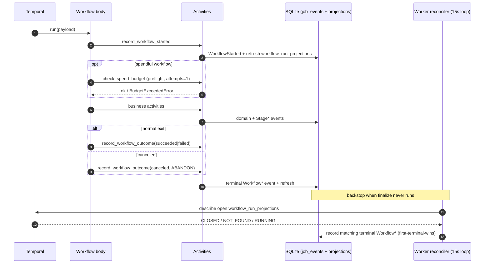

# Workflow Envelope, Activities & Retries

Every workflow shares one envelope: the same start/heartbeat/completion shape,
the same activity conventions, and one error taxonomy mapped onto Temporal retry
policies.

## The Universal Workflow Envelope

Every workflow — all six — wraps its business logic in the same envelope so a
run is always visible in the read model and always terminalizes, even on crash.
The helpers live in
`workers/automation/src/jobhunter/infrastructure/temporal/finalize.py`.

1. **`record_workflow_started`** emits a `WorkflowStarted` marker at the top of
   `run`, with a compact camelCase input summary.
2. **`check_spend_budget`** runs as a preflight for spendful workflows (see
   [Spend Ceiling](operations.md#spend-ceiling)). It runs with `maximum_attempts=1`, so a
   depleted budget fails the run before any paid work.
3. **Business activities** run (stages, per-job steps, apply, import, refresh).
4. **`record_workflow_outcome`** emits exactly one terminal event on every exit
   path — `WorkflowCompleted`, `WorkflowFailed`, `WorkflowCanceled`,
   `WorkflowTimedOut`, or `WorkflowTerminated`. On the cancel path the finalize
   activity uses `ActivityCancellationType.ABANDON` so the tiny SQLite write can
   finish while the workflow unwinds.

Both finalize activities are small local writes: they append to the append-only
`job_events` log (with `job_url = NULL`, since a run is a batch, not a job) and
then explicitly call `ProjectionBuilder.refresh()` so `workflow_run_projections`
updates even in a process with no bus-subscribed builder. Workflow bodies stay
deterministic: all clock/uuid/SQLite IO happens inside activities; the bodies
only read `workflow.info()` / `workflow.now()`.

### Deterministic Workflow IDs

Deterministic IDs plus `WorkflowIDConflictPolicy.USE_EXISTING` are how JobHunter
gets idempotent starts: re-requesting the same work attaches to the in-flight
execution instead of spawning a duplicate.

| Workflow | ID scheme | Conflict policy |
| --- | --- | --- |
| `DiscoverWorkflow` (standalone / schedule) | `discover-{tenant}` | one live discovery per tenant |
| `DiscoverWorkflow` (child of pipeline) | `{parent}-discover` | scoped to the parent |
| `ApplyWorkflow` (per-job) | `apply-{tenant}-{jobKey}` | one live apply per job |
| `ApplyWorkflow` (child of pipeline) | `{parent}-apply` | scoped to the parent |
| `JobPreparationWorkflow` | `prep-{idempotency_key}` | `USE_EXISTING` |
| `JobPipelineWorkflow`, `ProfileImportWorkflow`, `CompensationRefreshWorkflow` | server-generated | — |

The preparation idempotency key
(`make_preparation_idempotency_key`, in `domain/preparation`) is derived from
tenant, job id, work-item kind, **target version**, and **source event id**:

- `target_version` is the scoring-policy version for `score` targets and the
  tailoring-policy version for `tailor`/`cover`/`pdf` targets.
- `source_event_id` is the latest of `JobDiscovered`, `JobUpdated`,
  `JobEnriched`, `PostingContentSnapshotCaptured`, or `StageCompleted` for that
  job. A new source fact yields a new key, so genuinely new work gets a new
  workflow while reruns of unchanged work dedupe onto the existing one.

### Finalize + The Describe-Based Reconciler

When a worker is killed mid-run, an activity times out, or the Temporal dev
server loses history on restart, finalize may never run. The **reconciler** is
the backstop. It is not a trigger-coupled reaper; it is a describe loop inside
the worker's 15-second heartbeat loop (`cli.py`, `_reconcile_workflow_runs`):

- For each non-terminal `workflow_run_projections` row it calls
  `describe()` on the workflow handle.
- A **CLOSED** execution records the matching terminal `Workflow*` event
  (COMPLETED→succeeded, FAILED→failed, CANCELED→canceled,
  TERMINATED→terminated, TIMED_OUT→timed_out).
- A **NOT_FOUND** execution (dev-server history loss) records
  `WorkflowTerminated` so the run stops showing as forever-running.
- A **RUNNING / CONTINUED_AS_NEW** execution is left alone.

The reconciler never overwrites terminal truth. Both `JobPipelineWorkflow` and
`ApplyWorkflow` encode stage/apply failure in their *return value*, so a failing
run still closes COMPLETED on the Temporal side even though finalize already
wrote `WorkflowFailed`. Before writing, the reconciler takes `BEGIN IMMEDIATE`
and re-reads the row; if a real terminal outcome landed since the snapshot, it
leaves it. A first-terminal-wins fold in the projection builder backstops
anything that slips past.

## Activities

Nineteen activities are registered in `registry.py` (`ACTIVITIES`).

| Activity (callable) | Module | Purpose | Timeout · retry |
| --- | --- | --- | --- |
| `plan_discovery_sources` | `discovery/activities.py` | Plan which source families to run | 30 min · ×3 |
| `discovery_source_family_activity` | `discovery/activities.py` | Run one source family (crawl/enumerate) | 6 h · ×3 |
| `discovery_enrichment_activity` | `discovery/activities.py` | Drain detail enrichment + post-hygiene | 6 h · ×3 |
| `discovery_preparation_fanout_activity` | `discovery/activities.py` | Derive targets, start prep root workflows (batches of 25) | 30 min · ×3 |
| `enrich_activity` | `enrichment/activities.py` | Standalone/maintenance enrich stage | 30 min · ×3 |
| `score_activity` | `scoring/activities.py` | Batch score stage | 30 min · ×3 |
| `score_job_activity` | `scoring/activities.py` | Score one job (prep step) | 30 min · ×3 |
| `tailor_activity` | `materials/activities.py` | Batch tailor stage | 30 min · ×3 |
| `tailor_job_activity` | `materials/activities.py` | Tailor one job (prep step) | 30 min · ×3 |
| `cover_activity` | `materials/activities.py` | Batch cover stage | 30 min · ×3 |
| `cover_letter_activity` | `materials/activities.py` | Cover letter for one job (prep step) | 30 min · ×3 |
| `render_pdf_activity` | `materials/activities.py` | Render missing PDFs (prep step) | 30 min · ×3 |
| `derive_preparation_targets` | `pipeline/preparation.py` | Deterministic per-job target list (sync) | invoked within fan-out |
| `apply_activity` | `apply/activities.py` | Drive the apply launcher (browser/agent) | 2 h / 1 h · live 1, dry 2 |
| `profile_import_activity` | `profile/activities.py` | Import resume PDF → profile draft | 10 min · ×2 |
| `refresh_compensation_activity` | `infrastructure/compensation/workflow.py` | Refresh posted comp + market estimate | 20 min · ×2 |
| `check_spend_budget` | `llm.py` | Preflight daily-spend gate | 30 s · 1 |
| `record_workflow_started` | `infrastructure/temporal/finalize.py` | Emit `WorkflowStarted` | 30 s · ×5 |
| `record_workflow_outcome` | `infrastructure/temporal/finalize.py` | Emit terminal `Workflow*` | 30 s · ×5 (ABANDON on cancel) |

### run_blocking_with_heartbeat

Most business activities call synchronous domain runners. Calling them directly
inside an `async def` activity would block the worker's event loop for the whole
stage — defeating heartbeats and starving every other activity on the worker.
`infrastructure/temporal/run_in_activity.py` solves this with
`run_blocking_with_heartbeat`, which every long-running activity uses:

- It offloads the synchronous function to a **bounded, worker-owned
  `ThreadPoolExecutor`** and emits a heartbeat every `poll_interval` (default
  **15 s**) while waiting.
- On `asyncio.CancelledError` (a Temporal cancel) it invokes the supplied
  cooperative `on_cancel` hook, waits up to `cancel_wait_seconds` (default
  **30 s**) for the thread to stop, and re-raises.
- If the thread ignores cancellation past that grace window, it logs
  `abandoned_thread` and records an `operational_attempt_metric`
  (`stage="operations"`, `attempt_kind="temporal_activity_thread"`,
  `error_class="abandoned_thread"`) so a wedged thread is observable.

This is why the discovery source-family and enrichment activities (and the apply
activity) accept a `threading.Event` cancel token: the workflow-level cancel
propagates into the running crawl/launcher cooperatively rather than being
severed mid-write. The tiny marker activities (`plan_discovery_sources`,
`derive_preparation_targets`, `check_spend_budget`,
`record_workflow_started/outcome`) run inline without the thread offload.

### The Runtime Guard

Because multiple JobHunter checkouts can point at different app dirs and DBs,
every activity that writes calls `assert_activity_runtime`
(`infrastructure/temporal/runtime_guard.py`) with the expected app dir and DB
path carried in its input. A mismatch raises a **non-retryable**
`ApplicationError(type="RuntimeIdentityMismatch")`, so an activity that landed on
the wrong worker fails fast instead of writing to the wrong database.

## Error Taxonomy → Temporal Retry

Retry behavior is driven by a small error taxonomy in
`workers/automation/src/jobhunter/domain/errors.py`. `JobHunterError` carries a
`code` and a `retryable` flag; `to_application_error` converts it to a Temporal
`ApplicationError(type=code, non_retryable=not retryable)`.

| Error | Code | Retryable? |
| --- | --- | --- |
| `ConfigurationError` | `configuration` | no |
| `AuthenticationError` | `authentication` | no |
| `MissingInputError` | `missing_input` | no |
| `BudgetExceededError` | `budget_exceeded` | no |
| `TransientNetworkError` | `transient_network` | yes |
| `BrowserTransientError` | `browser_transient` | yes |
| `LlmTransientError` | `llm_transient` | yes |
| `SourceUnavailableError` | `source_unavailable` | yes |
| unclassified exception | `unclassified` | yes |

Every retrying workflow lists
`non_retryable_error_types = ["configuration", "authentication",
"missing_input", "budget_exceeded"]` in its `RetryPolicy`. So the four
configuration/precondition errors stop immediately, while transient failures
retry up to the policy's attempt cap and then surface as a stage/workflow
failure. `RuntimeIdentityMismatch` is also non-retryable.
