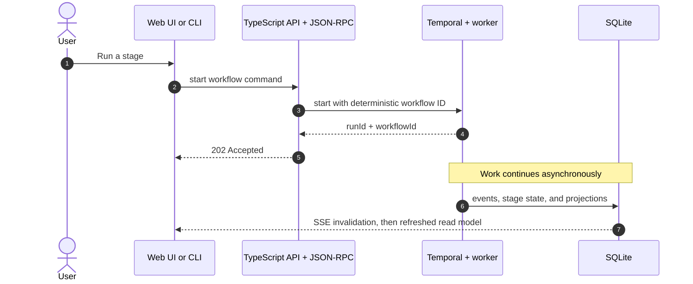

# Job Pipeline

"The pipeline" is the life of one job posting inside JobCtrl: from the moment
discovery finds a posting, through enrichment, scoring, and tailored resume and
cover-letter generation, to a supervised apply and the feedback that comes back.
This overview page holds the product stage shape, the execution surfaces that
start work, and the full workflow catalog; the pages below drill into how that
work runs, each answering the next question a newcomer asks:

- [Stage Walkthrough](stages.md) — what does each stage do, from Discover to
  Apply, and what does it persist?
- [Envelope & Activities](envelope.md) — what contract does every workflow obey,
  and how do activities, retries, and the error taxonomy work?
- [Concurrency & Fan-out](concurrency.md) — how much runs at once, and what
  bounds throughput?
- [Operations & Events](operations.md) — how do spend, the discovery schedule,
  persistence, events, and failures behave day to day?

Under the hood, every long-running unit of work is a **Temporal (the workflow
engine) workflow** — one durable workflow per stage family, with activities for
each side effect. There is no in-process pipeline engine and no flag that falls
back to one: the old sequential/threaded runner was deleted. If work takes
longer than an HTTP request, it runs on the Python worker under Temporal.

This section is the deep-dive companion to the
[System Overview](../index.md): that page names the runtime
boundaries and system topology — the web app, the TypeScript API, the Python
worker, Temporal, SQLite, and the Server-Sent Events (SSE) stream — while these
pages follow the work through them, from a button click or CLI command, across
the JSON-RPC boundary, into workflows and Python activities, and back out through
persistence, events, and projections to the web app. The canonical domain model
is the [Domain Model (DDD)](../domain-model/index.md) section; resume tailoring
has its own deep-dive in [Resume Tailoring Logic](../tailoring.md), and this
section summarizes the Tailor stage and points there for gate depth.

**Read this if** you are changing pipeline behavior, debugging a stuck or
duplicated run, or need to know exactly where a stage persists and how the web
app learns a stage finished.

## Product Shape: Discover → Apply

The user-facing stage order is deliberately small:

```text
discover -> apply
```

`Discover` is the single preparation stage. It finds jobs, enriches usable
postings, and then fans out durable per-job preparation (scoring, tailoring,
cover letters, PDFs) plus artifact suppression for jobs that no longer qualify.
`Apply` is separate because it can submit real applications and carries its own
safety controls.

Internally, preparation still uses a finer stage vocabulary that appears in
stage rows, low-level contracts, CLI maintenance commands, and diagnostics:

```text
discover -> enrich -> score -> tailor -> cover -> apply
```

The product UI folds `enrich`, `score`, `tailor`, and `cover` back under
`Discover` (job timelines and operational views still expose the detail). The
one exception is `cover`: when a tailored resume already exists and `cover` is
the first actionable row, the list projection advances the product stage to
`apply` while keeping `current_substage='cover'` visible for repair.

## Execution Surfaces

Every surface builds the same kind of workflow start spec and starts a workflow
on the JobCtrl task queue. They differ only in which entry point is used and
which workflow is selected.

| Surface | Entry point | What it starts |
| --- | --- | --- |
| Pipelines UI | `POST /v1/pipeline/actions/run-stage` | The TypeScript API dispatches JSON-RPC `run_stage`. A `discover`-only request starts `DiscoverWorkflow`; anything else starts `JobPipelineWorkflow` (which delegates `discover` and `apply` to child workflows). |
| Jobs URL import | `POST /v1/jobs/import-url` | Starts `JobUrlImportWorkflow`; an active, policy-admitted posting records completed intake/enrichment and starts a root `JobPreparationWorkflow` for score → tailor → cover → PDF. It never starts Apply. |
| Jobs view pending pickup | `POST /v1/jobs/:jobKey/actions/run-stage` | Starts a job-scoped `JobPipelineWorkflow` for one visible `pending` internal substage (`enrich`/`score`/`tailor`/`cover`), gated by the API on observable eligibility. |
| Jobs bulk pending prep | `POST /v1/jobs/bulk-run-pending-preparation` | Groups selected job URLs by their first eligible pending substage and dispatches bounded `run_stage` workflows. |
| Jobs bulk failed retry | `POST /v1/jobs/bulk-retry-failed` | Resets retryable failed stages and, with `runAfter: true`, dispatches batch `run_stage` workflows for the reset job URLs. |
| CLI | `jobctrl <command>` | Builds the same spec, starts Temporal, waits for the handle, and exits non-zero on workflow failure. `jobctrl discover` / `run discover` is the normal path; `score`/`tailor`/`cover` are maintenance commands. |
| Temporal schedule | `jobctrl-discovery-local` | Optional cron schedule that starts `DiscoverWorkflow`. Off by default (see [Discovery Schedule](operations.md#discovery-schedule)). |

### Entry Points → JSON-RPC → Workflow Selection

The TypeScript API never runs pipeline logic itself. It maps UI/CLI intent to a JSON-RPC
method over a long-lived `jobctrl rpc` subprocess (stdin/stdout, one JSON
envelope per line). The method registry in
`workers/automation/src/jobctrl/infrastructure/rpc/handlers.py` marks each
method as either `mode="workflow"` (start a workflow, return its ids) or
`mode="sync"` (run inline, return the result). The server also supports a
`streaming` generator mode; no default method currently uses it.

| JSON-RPC method | Mode | Workflow selected |
| --- | --- | --- |
| `run_stage` | workflow | `DiscoverWorkflow` if stages are exactly `["discover"]`, else `JobPipelineWorkflow` |
| `apply` | workflow | `ApplyWorkflow` (per-job, `apply-{tenant}-{jobKey}`) |
| `rescore_job`, `rescore_jobs_not_on_current_scoring_policy` | workflow | `JobPreparationWorkflow` / `JobPipelineWorkflow` (score) |
| `tailor_job`, `retailor_job`, `retailor_current_policy` | workflow | `JobPreparationWorkflow` (`tailor`,`cover`,`pdf`) |
| `refresh_compensation` | workflow | `CompensationRefreshWorkflow` |
| `profile_import` | workflow | `ProfileImportWorkflow` |
| `manual_capture_import` | workflow | `ManualCaptureImportWorkflow` (awaited by the API route) |
| `generate_interview_prep` | workflow | `InterviewPrepWorkflow` |
| `run_contact_research` | workflow | `ContactResearchWorkflow` (per-task, `contact-research-{taskId}`) |
| `analyze_job` | sync | none (inline read) |
| `generate_outreach_draft` | sync | none (inline generation + persistence) |
| `cancel_run` | sync | none (issues a Temporal cancel to a running handle) |

Workflow selection for `run_stage` lives in
`workers/automation/src/jobctrl/workflow_specs.py`
(`build_run_stage_workflow_spec`, `build_apply_workflow_spec`, and
`build_manual_capture_import_workflow_spec`).

### Async vs Sync (202 vs 200)

The distinction matters for anyone reading the API or the UI:

- **Workflow-mode methods are asynchronous by default.** The method returns
  `{ runId, workflowId }` the moment Temporal accepts the start, and the HTTP
  route answers **202 Accepted**. The outcome is *not* in that response — it
  arrives later in the read model and is pushed to the UI via SSE invalidation.
  A failure to *start* (bad input, worker unreachable) returns an error status,
  not a 202; a request the API resolves **without** starting a workflow — an
  ineligible stage or a pure stage reset — answers **200 OK**, not 202.
- **Awaited workflow methods preserve synchronous HTTP contracts without
  bypassing Temporal.** `profile_import` and `manual_capture_import` pass
  `awaitResult`; JSON-RPC starts the registered workflow, waits for its result,
  and the HTTP route answers **200 OK** only after the worker-owned activity
  completes. Manual-capture retries reconstruct that response from the
  canonical imported queue row after validating capture identity and content.
- **Sync-mode methods block for their result** and answer **200 OK** with the
  payload inline. `analyze_job`, `generate_outreach_draft`, and `cancel_run`
  are synchronous.

So a green "Run stage" click that returns 202 means "queued and running", not
"done". This is why the UI reconciles later through projections and SSE.

### End-to-End Call Path



## Workflow Catalog

The workflow catalog is registered in
`workers/automation/src/jobctrl/infrastructure/temporal/registry.py`
(`WORKFLOWS`). All timeouts and retry policies below are set at the workflow's
activity call sites.

| Workflow | Business activities | Key timeouts | Retry |
| --- | --- | --- | --- |
| `DiscoverWorkflow` | `plan_discovery_sources`, then one execution-scoped live `discovery_enrichment` alongside `discovery_source_family` producers, per-family preparation backstops, terminal reconcile enrichment, `automatic_compensation_refresh`, and terminal fan-out | source/enrichment 6 h; plan/fanout/compensation 30 min; live-enrich heartbeat 5 s; other heartbeats 2 min | source, enrich, and automatic compensation: 5 s→60 s ×3 |
| `JobPipelineWorkflow` | serial stage dispatch; `discover`→child `DiscoverWorkflow`, `enrich`/`score`/`tailor`/`cover`→activities, `apply`→child `ApplyWorkflow` | stage activities 30 min; heartbeat 2 min | enrich/score 5 s→60 s ×3; tailor/cover 10 s→120 s ×3 |
| `JobPreparationWorkflow` | `score_job`, `tailor_job`, `cover_letter`, `render_pdf` in fixed order | each 30 min; heartbeat 2 min | score ×3; tailor ×3; cover/pdf ×3 |
| `ApplyWorkflow` | `apply_activity` | 2 h batch / 1 h continuous batch; heartbeat 60 s | live: 1 attempt; dry-run: 2 attempts |
| `ManualCaptureImportWorkflow` | `manual_capture_import_activity` | 10 min | 2 s→10 s ×2; identity/input/replay mismatches are non-retryable |
| `ProfileImportWorkflow` | `profile_import_activity` | 10 min | 2 attempts |
| `CompensationRefreshWorkflow` | `refresh_compensation_activity` | 20 min | 2 attempts |
| `InterviewPrepWorkflow` | `generate_interview_prep_activity` | 20 min | 2 attempts |
| `ContactResearchWorkflow` | `check_spend_budget` preflight, then `run_contact_research` (one source-family activity: gateway-guarded fetch + LLM candidate extraction, proposing candidates in `needs_review`) | activity 30 min; heartbeat 2 min | 10 s→120 s ×3 |
| `DurabilityProbeWorkflow` | durable timer only (diagnostic; no business activity) | caller-selected timer | Temporal timer recovery |

A few catalog details worth calling out:

- **`DiscoverWorkflow` streams scoring as it discovers (R9 Phase 1–2).** One
  execution-scoped enrichment activity consumes durable job memberships while
  source activities are still crawling. Phase 2 hands off per job: the live
  enrichment pass runs with `per_job_handoff=True`, so a
  job starts its `SCORE_JOB` preparation the moment it is individually enriched
  (a side effect inside the enrichment activity — the workflow command history is
  unchanged). Per-family score-only fan-outs catch already-enriched jobs and
  missed handoffs. A terminal reconcile enrichment + fan-out runs last and stays
  authoritative for the tolerated-partial-failure folding (succeed if ≥1 family
  completed; fail as `discovery_source_failed` only if every family failed) and
  progress finalization. Repeated starts are deduped by the deterministic
  `prep-{idempotency_key}` id + `USE_EXISTING`; a one-time straggler sweep runs
  before the family loop and every family/terminal fan-out is score-only. See
  [Concurrency & Fan-out](concurrency.md#where-fan-out-happens-and-why).
- **Automatic compensation refresh is due-slice work, not a second crawl.**
  After terminal enrichment, the workflow's replay-patched compensation
  activity derives versioned role-family/seniority/country slices from active
  jobs. It lease-claims only missing or stale slices, refreshes direct evidence
  under the saved source policy, derives a country range from official
  price-level and matched-company evidence when needed, and materializes the
  latest direct or extrapolated fact before terminal preparation fan-out.
  Successful and insufficient slices are due again after seven days; source
  failures retry after one day and preserve the last good projection. A source
  or activity failure becomes a bounded compensation warning and does not fail
  otherwise healthy Discovery. Levels.fyi remains disabled until the user opts
  in through the same source-policy contract used by explicit refresh.
- **`JobPipelineWorkflow` is the serial batch driver.** It runs the requested
  stages in canonical order as activities, but hands `discover` and `apply` to
  child workflows so a mixed request like `score → tailor → apply` still
  preserves order while every unit runs under Temporal. After a batch `tailor`
  succeeds it derives the approved job URLs and scopes the following `cover`
  stage to exactly those jobs.
- **`JobPreparationWorkflow` reorders and validates steps.** Requested steps are
  intersected with the canonical order `("score","tailor","cover","pdf")`; an
  unknown step is a non-retryable error. Only `score`/`tailor`/`cover` trigger
  the spend preflight (`pdf` is deterministic rendering).
- **`ApplyWorkflow` continuous mode uses `continue_as_new`.** In continuous mode
  each iteration runs the launcher with an activity limit of 25; when a batch
  applies to zero jobs it sleeps 30 s before continuing-as-new, giving a
  run-forever poller with bounded history.

## Source Files

Primary implementation files (repo-relative):

- `apps/api/src/server.ts` — `/v1/pipeline/actions/run-stage`, the bulk job
  routes, and `GET /v1/events/stream`.
- `apps/api/src/local-actions.ts` — maps UI commands to JSON-RPC methods.
- `apps/api/src/json-rpc-adapter.ts` — long-lived subprocess JSON-RPC adapter.
- `apps/api/src/projections.ts` — TS projection builder (`refreshProjections`).
- `packages/domain-types/src/events/` — the canonical `DomainEventType` union
  and runtime registry; parity tests, not prose counts, enforce membership.
- `workers/automation/src/jobctrl/infrastructure/rpc/handlers.py` — JSON-RPC
  method registry (workflow vs sync modes).
- `workers/automation/src/jobctrl/workflow_specs.py` — `run_stage` / `apply`
  workflow selection and deterministic IDs.
- `workers/automation/src/jobctrl/infrastructure/temporal/registry.py` — the
  six workflows and nineteen activities.
- `workers/automation/src/jobctrl/infrastructure/temporal/finalize.py` — the
  workflow envelope (`record_workflow_started` / `record_workflow_outcome`).
- `workers/automation/src/jobctrl/infrastructure/temporal/run_in_activity.py`
  — `run_blocking_with_heartbeat`.
- `workers/automation/src/jobctrl/infrastructure/temporal/runtime_guard.py` —
  `assert_activity_runtime`.
- `workers/automation/src/jobctrl/discovery/workflow.py`,
  `.../discovery/activities.py` — `DiscoverWorkflow` and its four activities.
- `workers/automation/src/jobctrl/pipeline/workflow.py` — `JobPipelineWorkflow`.
- `workers/automation/src/jobctrl/pipeline/preparation.py` — target derivation
  and root preparation fan-out.
- `workers/automation/src/jobctrl/preparation/workflow.py` —
  `JobPreparationWorkflow`.
- `workers/automation/src/jobctrl/apply/workflow.py`,
  `.../apply/activities.py`, `.../apply/launcher.py` — apply workflow, activity,
  and browser/agent launcher (safety invariants).
- `workers/automation/src/jobctrl/contact/workflow.py`,
  `.../contact/activities.py` — `ContactResearchWorkflow` and its single
  source-family research activity (Contact & Outreach, supervised research).
- `workers/automation/src/jobctrl/scoring/` and `.../domain/scoring/` — scoring
  runner, employer-analysis ensemble, BM25 retrieval, `chat_json` scoring.
- `workers/automation/src/jobctrl/llm.py` — httpx `LLMClient`,
  `check_spend_budget`, and the `llm_spend` ledger.
- `workers/automation/src/jobctrl/domain/errors.py` — the error taxonomy.
- `workers/automation/src/jobctrl/cli.py` — `worker`, `rpc`, the worker
  heartbeat/reconciler loop, and `_reconcile_discovery_schedule`.
- `workers/automation/src/jobctrl/infrastructure/projections/` — Python
  projection builders.
