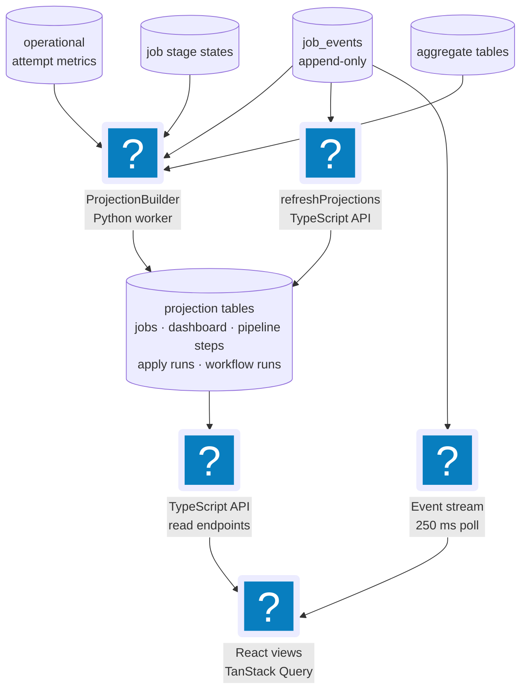

# Operations & Events

The cross-cutting mechanics that keep the pipeline running day to day under
Temporal (the workflow engine): the daily spend ceiling, the (off-by-default)
discovery schedule, where every stage persists, how domain events reach the web
app over Server-Sent Events (SSE), how read-model projections recover after a
crash, and how the pipeline behaves when things fail.

**Read this if** you are setting a budget, scheduling discovery, tracing where a
stage's data lands, or working out how the system recovers from a failure.

## Spend Ceiling

A daily spend ceiling backstops LLM cost. The `check_spend_budget` activity
(`llm.py`) is the preflight in every spendful workflow. It reads the budget
status (`read_spend_budget_status`): `daily_budget_usd` defaults to **$25**
(`read_daily_budget_usd(default=25.0)`), and a value of **0 means unlimited**. If
today's `llm_spend` ledger already meets the ceiling, it raises
`BudgetExceededError` (`budget_exceeded`, non-retryable), failing the run before
any paid work. Because the preflight runs with `maximum_attempts=1`, a depleted
budget is a clean fast failure, not a retry storm.

Per-call cost is written to the `llm_spend` UPSERT ledger, keyed by day, using
per-model-family rates (`estimate_llm_cost_usd` in `llm.py`); the rates are
coarse family buckets, and models without a listed family fall back to a
generic rate, so the ledger is an estimate, not billing truth. The ceiling is a *preflight gate* per workflow, not a
mid-call interrupt: a single expensive run already in flight is not aborted, but
the next spendful workflow will not start once the day's ledger is at the cap.

Supervised contact research (`ContactResearchWorkflow`, Contact & Outreach) is a
spendful workflow and reuses this **same** preflight — the `check_spend_budget`
activity + the `dailyBudgetUsd` ledger — before its LLM candidate extraction.
There is no second spend table or preflight.

## Standing Auto-Apply Loop

Auto apply is a settings-reconciled continuous Apply workflow, not a hidden UI
shortcut. The `auto_apply` setting defaults to **false**. When it is **true**,
the Python worker ensures one deterministic workflow id,
`apply-auto-local`, is running on the worker task queue with
`ApplyWorkflowInput(continuous=True, auto_apply_loop=True)`. When it is
**false**, the worker cancels that deterministic workflow if it exists. The
reconciler runs at worker startup and from the worker heartbeat loop, so
turning the setting on or off takes effect without restarting the worker.

The loop intentionally reuses the existing continuous poll mode in
`ApplyWorkflow` and `apply.launcher.worker_loop`:

- `apply_approval_required` is re-read by the apply activity at claim time. With
  the default **true** value, the loop claims only jobs already approved in
  Apply Review and parks unapproved jobs as awaiting approval. With **false**,
  it may claim eligible prepared jobs without that wait, but it still cannot
  perform final browser submission. Browser forms stop for manual completion;
  the owned Gmail sender still requires an exact recipient/attachment approval.
- `min_fit_score` and `apply_concurrency` are re-read by auto-apply activities,
  so threshold and fan-out changes affect later polls without recreating the
  workflow.
- The spend ceiling still runs as the workflow preflight. A depleted budget
  fails the standing loop before browser apply work starts, instead of retrying
  into a spend storm. The reconciler treats that failed projection as a budget
  halt and does not restart the loop while today's spend remains at or above the
  configured ceiling.
- The existing apply boundaries remain the source of truth: dry-run paths never
  submit, model-driven browser sessions are transport-locked, submit-intent
  tracking protects owned email sends, and CAPTCHA or third-party challenge
  handling fails closed.

Because the loop is a normal workflow run, it is projected into
`workflow_run_projections` and appears in the Runs / Operations surface as
**Standing apply loop**. Automation is therefore visible and cancelable from the
same place as manually-started runs.

## Discovery Schedule

Scheduled discovery is **off by default**. A single Temporal Schedule,
`jobctrl-discovery-local`, can run `DiscoverWorkflow` on a cron expression, but
it is reconciled from settings only at **worker startup**
(`_reconcile_discovery_schedule` in `cli.py`, before `worker.run()`):

- It reads `load_discovery_schedule_settings()` → `(enabled, cron)`.
- If **disabled**, it deletes the schedule handle (idempotent) and returns.
- If **enabled**, it creates (or updates) the schedule to start
  `DiscoverWorkflow` (`discover-local`) on the given cron, with
  `ScheduleOverlapPolicy.SKIP` so a slow run never overlaps the next tick.

**The gotcha:** because reconciliation happens once at startup, toggling the
schedule setting has no effect until the worker is restarted. Turning the
schedule on or off, or changing its cron, requires bouncing the worker.

Supervised contact research has **no schedule at all** — `ContactResearchWorkflow`
runs only when the user explicitly starts a run (there is no automation, and no
public source is auto-fetched by default; see the source-access policy in the
[domain model](../domain-model/tactical.md)).

## Discovery Run Progress

The Runs view progress bar is driven by the `progress` payload
(`_discovery_progress_payload` in `pipeline/runner.py`) that discovery
activities emit onto the `discovery_runs` aggregate. The denominator is fixed at
plan time: `progress_total = len(families) + 2` — one step per source family
plus a terminal enrichment and a terminal preparation step. The counter is
monotonic: family source activities advance it `0 … N-1`, then the terminal
reconcile enrichment (`N`) and preparation (`N+1 → N+2`, i.e. 100%) finalize it.

Under **score-as-you-discover streaming (R9 Phase 1)** the execution-scoped live
enrichment activity and per-family preparation backstops are
**progress-silent**: they pass `progress_total=0`, which suppresses progress emission
(`emit_progress = progress_total > 0`), so the bar advances only on the family +
terminal spine and can never oscillate or shrink. Scores still appear
incrementally in the Jobs view because that path is independent of the progress
bar: `JobScored` events → projection builders → `GET /v1/events/stream`. Under
R9 Phase 2 (per-job handoff) those scores arrive at per-job granularity — a job
is scored the moment it is individually enriched — while the outer progress
spine stays unchanged. No new `discovery_runs` progress columns are added, so
both projection builders stay in parity.

Broad-board progress uses `search units` as its source-level unit. Its
`newJobs` and `existingJobs` values come from durable acceptance receipts,
`filteredJobs` comes from hashed filtered-result receipts, and `recoveredUnits`
counts units reclaimed by a newer Temporal activity attempt.
The TypeScript read model preserves that optional field and Pipelines renders
it as `N resumed`. Raw provider output, checkpoints, owner tokens, and error
messages are not projected into this broad progress payload.

## Pipeline Operations Snapshot

The legacy Runs progress bar answers one narrow question: how far the source
family plus terminal-reconciliation spine has advanced. It is not whole-pipeline
progress. `GET /v1/pipeline/operations` is the separate operational read model
for answering which execution owns work, what remains in each scope, what the
worker can currently execute, and whether an ETA can be defended.

### Immutable execution lineage

At the beginning of `DiscoverWorkflow.run`, the workflow reads its Temporal
identity once and creates an immutable `DiscoveryExecutionRef`:

```text
(tenant_id, discover_workflow_id, discover_run_id)
```

The run ID is required because the deterministic workflow ID can be started
again. Source-run IDs are observation details, not execution identity. Every
linked job is persisted in `discovery_execution_jobs`, keyed by that exact
execution plus stable JobId, with one of two cohorts:

- `observed_this_run` — a source in this execution observed the job;
- `existing_backlog` — the execution deliberately swept pre-existing eligible
  work. A later observation promotes this one row to `observed_this_run`; it
  cannot create a second membership or demote a current one.

Planning is explicit. `pending` and `failed` plan states do not mean that a job
needs no work. `planned` records the immutable required-step list and child
preparation workflow ID; `not_eligible` records a bounded safe reason. The
terminal `preparation_fanout` step closes membership for operational phase and
overall-ETA purposes.

### Scoped work, not one denominator

The response keeps three scopes distinct:

| Scope | Ownership |
| --- | --- |
| `current_execution` | This run's observed-job cohort and execution-owned orchestration. |
| `execution_sweep` | This run's explicit pre-existing-backlog cohort. Only separately attributable per-job queues are counted. |
| `global_outside_execution` | Canonical per-job backlog outside both selected-execution cohorts. |

Source-family progress and reconciliation are also separate. The former counts
planned family crawls; the latter counts enrichment passes and preparation
fan-out. Source completion therefore never implies that downstream scoring,
materials, or PDF work is complete.

The API prefers an active or draining Discover execution and otherwise shows
the latest terminal execution. The phase vocabulary is `discovering`,
`draining`, `completed`, `completed_with_issues`, `failed`, and `canceled`.
Both execution cohorts participate in the delivered phase calculation:
unresolved observed jobs or swept backlog can keep an otherwise successful
workflow in `draining`.

### Operator stop and failure recovery

The Pipelines workspace exposes cancellation only when the selected Discover
execution has `workflowStatus=in_progress` and phase `discovering` or
`draining`. The action cancels the deterministic Discover workflow ID, then
invalidates the workflow-run, dashboard, and pipeline-operations queries so the
stop request cannot leave the live workspace stale. A closed workflow whose
durable phase still says `draining` is not cancelable.

A failed execution is never treated as proof that the runtime is idle. The UI
uses `activeItemsTotal` as a three-state recovery gate: a positive value reports
remaining work, `null` reports that the inventory is unavailable, and exactly
zero permits **Set up a new Discover run**. That action only selects and focuses
the Discover launch controls; it never dispatches work implicitly.

`reconciled_not_found` is a provisional verdict: the worker could not find the
exact recorded Temporal run in the history store it could currently reach. The
reconciler keeps probing that exact run. When the authoritative history is
available again, a marked recovery event automatically restores the run to
`in_progress` or replaces the provisional verdict with its real closed outcome;
the false terminal remains visible in the audit history. Starting a replacement
run is appropriate only when the exact execution is genuinely absent and the
runtime inventory confirms that no work remains. Workflow IDs, Temporal run
IDs, and the raw reason code stay in a collapsed technical disclosure.

Condition-driven preparation is resumed by the mutation that resolves the
condition. A candidate-profile or preference update dispatches current-input
scoring followed by Tailor and Cover; an authenticated-LinkedIn browser
transition to fully ready maps the resolved browser condition to canonical
`enrich` rows blocked with `ENRICH_ROBOTS_DISALLOWED`, selects only LinkedIn
jobs carrying that typed condition (with a source-identity fallback for legacy
rows), and dispatches those JobIds through Enrich, Score, Tailor, and Cover.
Unrelated robots blocks and ordinary pending Enrich rows are not swept into the
recovery. These continuations use the normal idempotent workflow path and do
not rerun Discover.
A low-confidence posting keeps Tailor explicitly `blocked` by Enrich rather
than leaving it as unexplained `pending`; when authenticated apply-URL recovery
produces a trustworthy snapshot, Enrich resets that exact condition-blocked
Tailor row to `pending` before the continuation reaches it.

### Two durable progress authorities

Canonical `job_stage_states` remains the source of truth for per-job `enrich`,
`score`, `tailor`, and `cover` work. Orchestration gaps use the four
`PipelineStep*` lifecycle events, folded into `pipeline_step_projections` for
`source_planning`, `source_family`, `enrichment_pass`,
`preparation_fanout`, `existing_backlog_sweep`, and `pdf_render`.

The fold is keyed by execution, step kind, and bounded item key. A higher
attempt replaces an older attempt; a late lower attempt is ignored; within one
attempt, the first terminal result wins. Details contain only allowlisted codes
and counts, and failures persist bounded error codes rather than exception text.
The Python and TypeScript projection builders fold the same events and share the
normal operations-projection watermark/rebuild path.

A current-execution membership with `work_plan_state='pending'` and no enrich
stage row is an expected pre-dispatch state and is projected as **waiting**.
Missing stage state after work-plan resolution remains **unknown** and therefore
actionable; the read model does not hide a genuine projection gap.
The producer-lifetime live enrichment activity is runtime telemetry, not a
durable `enrichment_pass` projection: it ends by intentional cancellation and
the lifecycle schema has no canceled terminal state. Per-job stage rows record
its durable work; terminal reconciliation owns the persisted enrichment-pass
boundary.

### Durable projection recovery and runtime-only visibility

`projectionCoverage` is the selected execution's durable recovery checkpoint;
it does not restate telemetry freshness. Its states are:

- `ready`: the worker decoded one exact Temporal workflow/run history, refreshed
  its projections, and verified equality of the expected and persisted
  membership-key and pipeline-step-key sets at the recorded history-event
  watermark;
- `recovering`: startup or heartbeat reconciliation is rebuilding those exact
  sets;
- `retrying`: the latest safe reconciliation attempt refused an ambiguous input
  or met a transient dependency failure and will retry automatically; and
- `incomplete`: an immutable legacy history ended before it could identify every
  originally targeted job. JobCtrl preserves every exact recovered member and
  step, records the bounded terminal reason, and does not retry or invent the
  missing lineage.

The checkpoint is stored in `discovery_execution_recoveries`, keyed by tenant,
Discover workflow ID, and Temporal run ID. It records the decoder version,
native/reconstructed mode, history-event watermark, expected and persisted
counts, a digest of both canonical key sets, and a bounded error code. A
`ready` row is valid only while its counts and digest still match the current
durable rows. Row counts alone, workflow terminal state, and runtime telemetry
can never promote an execution to `ready`.

The worker runs reconciliation before accepting activities and again on every
heartbeat. Legacy activity history is decoded into queued, running, completed,
and failed step events. Exact source observations and preparation-workflow roots
restore execution membership and work plans. Existing partial rows are merged
idempotently, so a process kill during repair resumes without duplicate events
or jobs. Native activities retain ownership of their normal events; mixed
legacy/native histories merge the two key sets without replaying native work.
Ambiguous provenance is refused rather than guessed.

Reconstructed decoder v2 does not treat `workflow_run_projections` as causal
evidence because repeated generic workflow-start events can legitimately fold a
full preparation input down to a job-only summary. For each succeeded legacy
preparation-fanout attempt, it selects the exact job-only
`JobPreparationWorkflow` starts inside that activity's recorded time interval
and requires their distinct workflow count to equal the fanout's declared
target count. It unions overlapping targets from repeated passes, then resolves
each exact workflow/run against its append-only full `WorkflowStarted` summary
and validates the job URL, required steps, and `prep-{idempotencyKey}` identity.
Any count, run, identity, or plan conflict keeps the checkpoint in automatic
retry; a successful repair records the bounded reason code
`legacy_history_recovery` and verifies the complete membership and step-key
digest before publishing `ready`.

Temporal retry attempts remain distinct causal attempts. A successful retry can
be recovered from its exact start and completion events even when legacy history
has no separate queue event for that attempt; the decoder leaves `queuedAt`
unknown rather than fabricating a timestamp. If a fanout is terminally failed
with no retry remaining, the decoder publishes `incomplete` from the exact
partial dispatch set and failed-step evidence instead of retrying forever.

`activeStageCounts` is a separate aggregation of allowlisted activity types
from fresh worker heartbeats. It is `null` when that runtime inventory is stale
or unavailable. These counts expose what the shared worker pool is executing
now; they never fabricate selected-execution membership, pipeline-step rows, or
a durable stage denominator.

While coverage is `recovering` or `retrying`, the Pipelines surface keeps worker,
slot, queue, and active-activity facts visible, labels selected-run history as
being restored, and hides selected-run counts, percentages, and ETAs. Recovery
is an automatic transition state, not an accepted tracking mode. For selected
scopes, `no_work` is valid only after coverage is `ready`, execution membership
is closed, and projected demand is exactly zero.

`incomplete` is a terminal audit state, not a degraded operating mode. Pipelines
shows the exact partial evidence and bounded reason, withholds claims about the
unknown remainder, and offers a new Discover setup only when fresh runtime
inventory proves there is no active work.

### Runtime capacity and conservative ETA

Worker heartbeats add runtime facts that cannot be reconstructed from durable
events: exact activity slots in use, configured capacity, bounded allowlisted
active-work detail, completed-activity duration summaries, and approximate
Temporal task-queue observations. The operations reader derives the expected
app directory from the configured database path, filters heartbeats to that
resolved database/app-dir identity, selects the task queue named by the newest
matching heartbeat, and aggregates fresh schema-valid workers from that queue.
Active slots count every activity; active-item detail is a separate
oldest-first list capped at 20 with an exact allowlisted total and truncation
marker.

This boundary is deliberately privacy-safe. The interceptor never reads
activity arguments. It retains only allowlisted activity kinds, validated safe
workflow/run references, and non-reversible local opaque identifiers. URLs,
descriptions, profiles, prompts, provider responses, artifact paths, payloads,
credentials, and exception text cannot enter heartbeat detail. Task-queue
pollers, backlog count/age, and add/dispatch rates are separately labeled as
approximate infrastructure observations, never as job counts.

`pipeline-eta-v1` uses successful canonical stage or pipeline-step durations
(operational-attempt metrics are fallback evidence only), a 14-day window, at
most 50 recent samples, and a minimum of five samples for every remaining
stage. The overall numeric range is withheld while membership is open;
per-stage and source-family ranges can price their already-known scoped backlog
before closure. Every estimate still withholds a number when telemetry is stale,
a worker is unavailable, work is budget-blocked, or shared contention is
unbounded. Non-numeric `calibrating`, `paused`, `stale`, and `unavailable`
states are part of the contract. An available low/high range is a current
projection estimate, not a completion promise.

## Persistence Map

The Python worker writes to a single local SQLite database. Tables group by context;
the append-only `job_events` log plus the projection tables are the read-model
spine.

| Group | Representative tables |
| --- | --- |
| Discovery | `jobs`, source observations, `source_registry_entries`, source locator / manual-capture / review queue, quarantine, `discovery_runs`, `discovery_execution_jobs`, `discovery_settings`, plus target search overlaid from `candidate_profiles` |
| Enrichment | enrichment fields / rows on jobs, posting content snapshots |
| Scoring | `job_scores`, `scoring_policies`, `job_score_staleness`, employer analysis |
| Materials | materials sets / tailored resumes, cover letters, rendered PDFs, `tailoring_policies` |
| Apply | apply stage state + apply lifecycle in `job_events` (see note) |
| Contact & Outreach | `contacts`, `contact_attributes`, `contact_research_tasks` (+ `source_attempts_json`), `contact_candidates`; projected into `contact_projections` + `contact_research_task_projections` |
| Orchestration / read model | `job_events` (append-only), `operational_attempt_metrics`, `job_stage_states`, `pipeline_step_projections`, `workflow_run_projections`, `job_list_projections`, `job_detail_projections`, `dashboard_projections`, artifact projections, `apply_run_projections` |
| Spend | `llm_spend` |
| Runtime | `worker_runtime_heartbeats` with runtime identity, exact slot totals, bounded safe activity detail, duration summaries, and task-queue observation |

Note: the legacy `apply_runs` / `apply_run_events` tables were dropped at boot.
Apply lifecycle now lives entirely in `job_events` and is projected into
`apply_run_projections`.

Operational metrics are append-only rows written at pipeline boundaries (stage,
source id, source role, adapter, attempt kind, outcome, counts, durations,
`error_class`, `error_message`, `run_id`, `job_url` when known) rather than
inferred from labels — so `discovery_runs.status='failed'` no longer has to carry
unrelated failure causes.

## Domain Events, Projections, and SSE

Retry-and-run preserves the same audit boundary: the API verifies worker
readiness before resetting a stage or appending the reset event. A
`503 worker_runtime_unavailable` leaves the durable failed/blocked stage and
its events unchanged. The reset happens first only after dispatch prerequisites
are satisfied; a reset-only command remains a deliberate local transition.

The authoritative TypeScript runtime registry lives in
`packages/domain-types/src/events/`. The
frontend's `every-event-has-handler` test requires an invalidation handler for
every member, and `test_domain_event_parity.py` requires the Python registry to
match the same ordered tuple exactly. Both projection builders fold the same
camelCase payloads, including the `Workflow*` and `PipelineStep*`
lifecycle events.

Three catalog corrections, because the old doc drifted:

- **There is no `CoverLetterFailed` event.** Cover success is
  `CoverLetterGenerated`; cover failure surfaces as `StageFailed` +
  `WorkflowFailed`.
- **`StageQueued` is not a typed domain event.** It is not in the canonical registry.
  The TS bulk routes tag reset/queued rows with a `StageQueued` marker string
  (`source: "bulk_retry_failed"` / `"bulk_run_pending_preparation"`), but it is
  not folded like a domain event.
- **`DiscoveryRunProgress` is not a domain event.** It is the heartbeat progress
  payload persisted onto the `discovery_runs` aggregate; the typed discovery-run
  events are `DiscoveryRunStarted` / `Completed` / `Failed`.
- **Pipeline-step lifecycle is typed and execution-scoped.**
  `PipelineStepQueued`, `PipelineStepStarted`, `PipelineStepCompleted`, and
  `PipelineStepFailed` carry the exact Discover workflow/run identity plus
  bounded step kind, item key, codes, counts, and timing; raw activity payloads
  and exception text are excluded.

The read path is projection-backed, and there are **two projection builders**:
the Python `ProjectionBuilder` (in the worker, bus-subscribed and also refreshed
explicitly by finalize/reconciler) and the TypeScript `refreshProjections` (in
the API). Both rebuild the same projection tables from the same events.



`job_list_projections.current_stage` is a *product-stage* field: builders write
only `discover` or `apply` there (the full internal stage list stays in
`job_detail_projections.stages_json`), with the `cover`→`apply` advance described
earlier. Note that `GET /v1/events/stream` is a **250 ms poller** over new
`job_events` rows, not a push stream — which is why a stage can complete a beat
before the UI card visibly changes: durable facts are recorded first, then
projections refresh and the next SSE tick invalidates the query cache. The SSE
contract is specified in [Local TypeScript API](../../local-ts-api.md).

### Projection Recovery

Read-model projections are rebuildable state; two recovery paths plus a
defensive dashboard read keep them truthful on existing databases:

- Both initialization paths — the Python worker and the TypeScript API —
  migrate legacy `workflow_run_projections` schemas before use, so older local
  databases cannot fail projection upserts mid-workflow.
- When workflow events were already watermarked but the Python-owned
  workflow-run projection table is missing rows, the projection is rebuilt
  from the event log instead of staying silently empty.
- Dashboard pipeline progress consults terminal workflow-run state, so a stale
  `StageStarted` row can no longer present a dead workflow as running.
- `pipeline_step_projections` uses the shared operations watermark and can be
  rebuilt from the append-only lifecycle events; projection refresh is
  attempt-aware and idempotent in both languages.

## Failure Behavior Summary

- **Transient failures retry; preconditions fail fast.** Retryable errors retry
  up to each activity's attempt cap; `configuration`/`authentication`/
  `missing_input`/`budget_exceeded` never retry.
- **Discovery isolates sources.** One failed source family yields a partial
  result; the workflow fails only if a family fails after retries, and it fails
  with the source error, not a swallowed one.
- **Broad-board retries isolate search units.** JobStreaming query/location/board
  units persist accepted results before acknowledgement, fence old activity
  attempts, and resume only unfinished work. Cancellation terminalizes units;
  incompatible checkpoints fail rather than reset silently.
- **Preparation isolates jobs.** A failed step fails only that job's workflow and
  resumes at the failed step; other jobs are unaffected.
- **Apply fails safe.** At-most-once + one live attempt + the CDP dry-run guard
  mean a failed or canceled apply never double-submits; cancellation is
  cooperative and terminalizes as `WorkflowCanceled`.
- **Nothing stays "running" forever.** Finalize records the terminal outcome on
  every normal/cancel path; the describe-based reconciler backstops killed
  workers, timeouts, and dev-server history loss.
