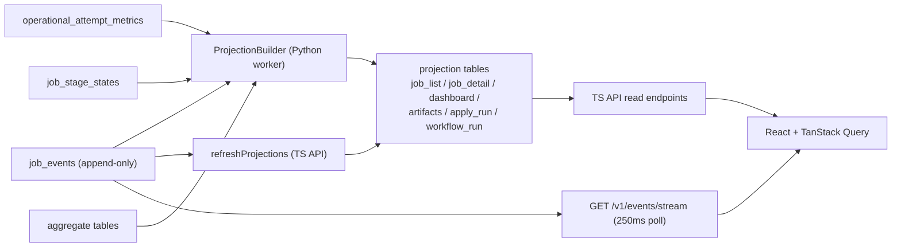

# Operations, Persistence & Events

Cross-cutting pipeline mechanics: the daily spend ceiling, the (off-by-default)
discovery schedule, where every stage persists, and how domain events reach the
UI over SSE.

## Spend Ceiling

A daily spend ceiling backstops LLM cost. The `check_spend_budget` activity
(`llm.py`) is the preflight in every spendful workflow. It reads the budget
status (`read_spend_budget_status`): `daily_budget_usd` defaults to **$25**
(`read_daily_budget_usd(default=25.0)`), and a value of **0 means unlimited**. If
today's `llm_spend` ledger already meets the ceiling, it raises
`BudgetExceededError` (`budget_exceeded`, non-retryable), failing the run before
any paid work. Because the preflight runs with `maximum_attempts=1`, a depleted
budget is a clean fast failure, not a retry storm.

Per-call cost is written to the `llm_spend` UPSERT ledger, keyed by day, using
per-model-family rates (`estimate_llm_cost_usd` in `llm.py`); the rates are
coarse family buckets, and models without a listed family fall back to a
generic rate, so the ledger is an estimate, not billing truth. The ceiling is a *preflight gate* per workflow, not a
mid-call interrupt: a single expensive run already in flight is not aborted, but
the next spendful workflow will not start once the day's ledger is at the cap.

## Discovery Schedule

Scheduled discovery is **off by default**. A single Temporal Schedule,
`jobhunter-discovery-local`, can run `DiscoverWorkflow` on a cron expression, but
it is reconciled from settings only at **worker startup**
(`_reconcile_discovery_schedule` in `cli.py`, before `worker.run()`):

- It reads `load_discovery_schedule_settings()` → `(enabled, cron)`.
- If **disabled**, it deletes the schedule handle (idempotent) and returns.
- If **enabled**, it creates (or updates) the schedule to start
  `DiscoverWorkflow` (`discover-local`) on the given cron, with
  `ScheduleOverlapPolicy.SKIP` so a slow run never overlaps the next tick.

**The gotcha:** because reconciliation happens once at startup, toggling the
schedule setting has no effect until the worker is restarted. Turning the
schedule on or off, or changing its cron, requires bouncing the worker.

## Persistence Map

The worker writes to a single local SQLite database. Tables group by context;
the append-only `job_events` log plus the projection tables are the read-model
spine.

| Group | Representative tables |
| --- | --- |
| Discovery | `jobs`, source observations, `source_registry_entries`, source locator / manual-capture / review queue, quarantine, `discovery_runs`, `discovery_settings`, plus target search overlaid from `candidate_profiles` |
| Enrichment | enrichment fields / rows on jobs, posting content snapshots |
| Scoring | `job_scores`, `scoring_policies`, `job_score_staleness`, employer analysis |
| Materials | materials sets / tailored resumes, cover letters, rendered PDFs, `tailoring_policies` |
| Apply | apply stage state + apply lifecycle in `job_events` (see note) |
| Orchestration / read model | `job_events` (append-only), `operational_attempt_metrics`, `job_stage_states`, `workflow_run_projections`, `job_list_projections`, `job_detail_projections`, `dashboard_projections`, artifact projections, `apply_run_projections` |
| Spend | `llm_spend` |
| Runtime | worker heartbeat / runtime identity |

Note: the legacy `apply_runs` / `apply_run_events` tables were dropped at boot.
Apply lifecycle now lives entirely in `job_events` and is projected into
`apply_run_projections`.

Operational metrics are append-only rows written at pipeline boundaries (stage,
source id, source role, adapter, attempt kind, outcome, counts, durations,
`error_class`, `error_message`, `run_id`, `job_url` when known) rather than
inferred from labels — so `discovery_runs.status='failed'` no longer has to carry
unrelated failure causes.

## Domain Events, Projections, and SSE

The authoritative event catalog is the TypeScript `DomainEventType` union in
`packages/domain-types/src/events/` — **68 event types**, guarded by an
exhaustiveness assertion and by the frontend's `every-event-has-handler` parity
test. The Python worker emits 55 of them through `create_domain_event` factories
in `workers/automation/src/jobhunter/domain/events/`; the remaining types
(preparation work-item, resume-template, `TailorRetailorRequested`,
`TailoredArtifactsSuppressed`, `TailoringPolicyUpdated`,
`CompensationFactsUpdated`) originate on other code paths. Both sides fold the
same camelCase payloads, including the six `Workflow*` lifecycle events.

Three catalog corrections, because the old doc drifted:

- **There is no `CoverLetterFailed` event.** Cover success is
  `CoverLetterGenerated`; cover failure surfaces as `StageFailed` +
  `WorkflowFailed`.
- **`StageQueued` is not a typed domain event.** It is not in the 68-type union.
  The TS bulk routes tag reset/queued rows with a `StageQueued` marker string
  (`source: "bulk_retry_failed"` / `"bulk_run_pending_preparation"`), but it is
  not folded like a domain event.
- **`DiscoveryRunProgress` is not a domain event.** It is the heartbeat progress
  payload persisted onto the `discovery_runs` aggregate; the typed discovery-run
  events are `DiscoveryRunStarted` / `Completed` / `Failed`.

The read path is projection-backed, and there are **two projection builders**:
the Python `ProjectionBuilder` (in the worker, bus-subscribed and also refreshed
explicitly by finalize/reconciler) and the TypeScript `refreshProjections` (in
the API). Both rebuild the same projection tables from the same events.

`job_list_projections.current_stage` is a *product-stage* field: builders write
only `discover` or `apply` there (the full internal stage list stays in
`job_detail_projections.stages_json`), with the `cover`→`apply` advance described
earlier. Note that `GET /v1/events/stream` is a **250 ms poller** over new
`job_events` rows, not a push stream — which is why a stage can complete a beat
before the UI card visibly changes: durable facts are recorded first, then
projections refresh and the next SSE tick invalidates the query cache. The SSE
contract is specified in [`local-ts-api.md`](../../local-ts-api.md).

## Failure Behavior Summary

- **Transient failures retry; preconditions fail fast.** Retryable errors retry
  up to each activity's attempt cap; `configuration`/`authentication`/
  `missing_input`/`budget_exceeded` never retry.
- **Discovery isolates sources.** One failed source family yields a partial
  result; the workflow fails only if a family fails after retries, and it fails
  with the source error, not a swallowed one.
- **Preparation isolates jobs.** A failed step fails only that job's workflow and
  resumes at the failed step; other jobs are unaffected.
- **Apply fails safe.** At-most-once + one live attempt + the CDP dry-run guard
  mean a failed or canceled apply never double-submits; cancellation is
  cooperative and terminalizes as `WorkflowCanceled`.
- **Nothing stays "running" forever.** Finalize records the terminal outcome on
  every normal/cancel path; the describe-based reconciler backstops killed
  workers, timeouts, and dev-server history loss.
