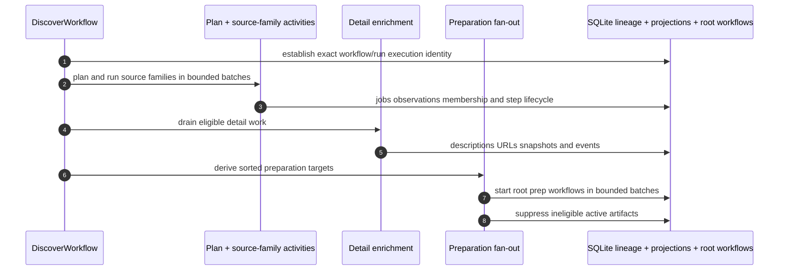
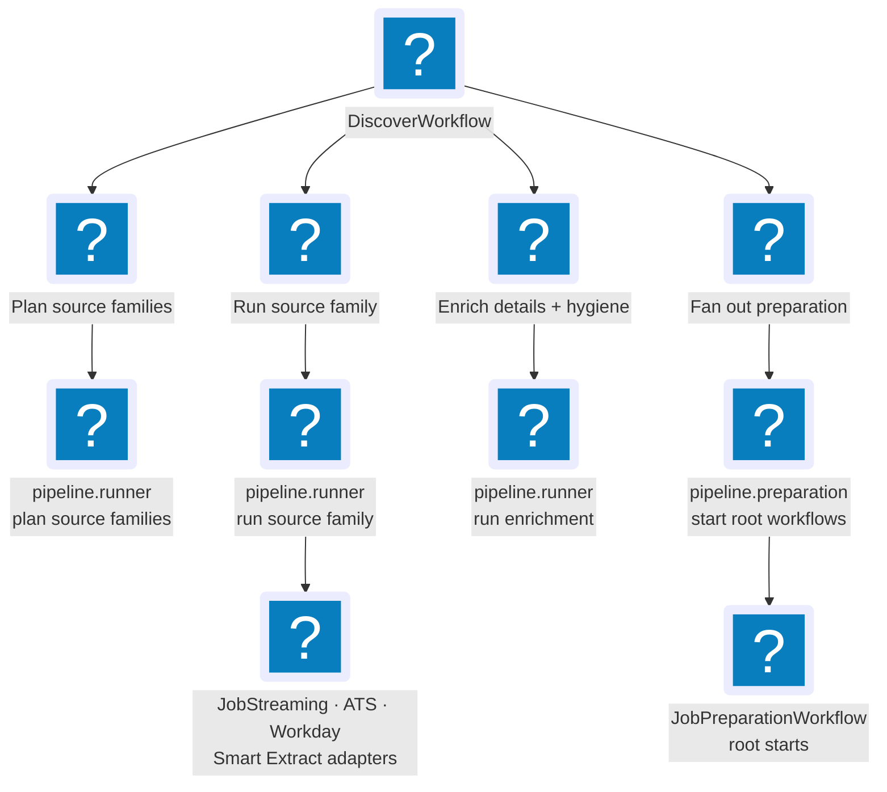
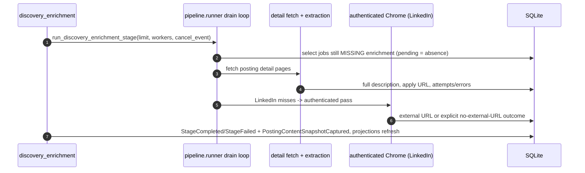
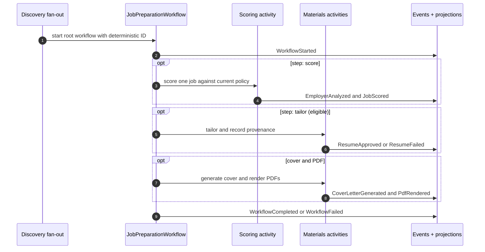
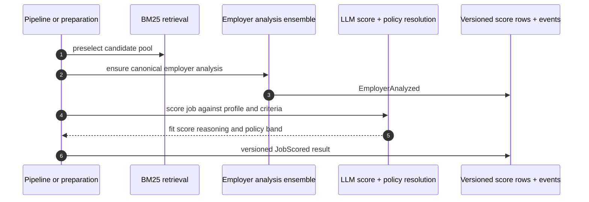
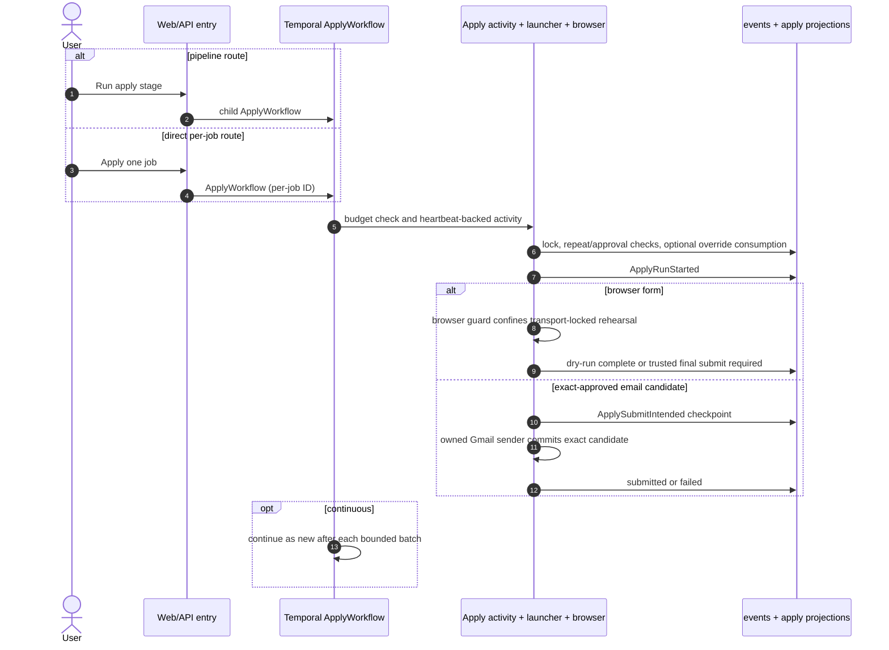
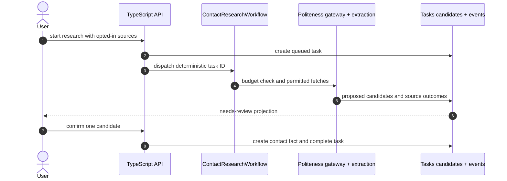

# Stage Walkthrough

This page follows a job posting through every pipeline stage in order — Discover,
Detail Enrichment, Preparation, Score, Tailor, Cover, PDF, and Apply — as it runs
on the Python worker under Temporal (the workflow engine). For each stage it
covers what the stage accomplishes, its call path and sequence diagram, the
events it writes, and how it fails.

**Read this if** you need to know exactly what a stage does, what it persists, or
why a run failed at that stage.

## Discover

Discover finds postings from configured sources, creates canonical job records
and source observations, drains detail enrichment for jobs that pass the initial
title/location filter, and then fans out per-job preparation. It owns source
scheduling, source-quality feedback, canonical identity, dedupe, protected-source
manual-capture queue entries, and posting hygiene. Scoring and Materials still
own their own writes.

At workflow start, Discover creates one immutable execution reference from its
tenant, deterministic workflow ID, and Temporal run ID. That exact identity is
threaded through every stage below. Source-run IDs describe observations; they
do not identify the Discover execution.

`DiscoverWorkflow` decomposes into **four activities**, not one monolithic run:

Component shape (`DiscoverWorkflow` orchestrates activities; the activities call
runner functions in `pipeline/runner.py`, which drive the source adapters):

Key facts about the four activities:

- **`plan_discovery_sources`** compiles the plan (which source families to run,
  progress totals, and the starting job count) from the source registry, source
  quality, and the global limit. Target roles from the profile become two query
  kinds — exact queries (from saved role text) and recall queries (generated from
  target-role intent, enforcing track and seniority before scoring).
- **`discovery_source_family`** runs *one* source family under
  `run_blocking_with_heartbeat` with a cooperative `cancel_event` and a 6-hour
  window (crawls legitimately run long). Each family is isolated: a broad-board, ATS,
  Workday, or Smart Extract failure records failure info and lets the workflow
  see a partial result rather than failing the whole batch. If only some source
  families fail, `DiscoverWorkflow` still proceeds through detail enrichment and
  preparation for jobs returned by surviving sources; it fails the workflow only
  when every planned source family fails. Source-family failures propagate
  Temporal `ApplicationError` values with the real error class, message, and
  details, so terminal workflow state names the actual cause instead of a
  placeholder like `failed: failed`. With `limit > 0` the cap is a **new-job
  budget** — rediscoveries record observations but do not consume the budget, so
  exact-query duplicates never starve later recall queries or sources.

  The broad-board family further decomposes the immutable search plan into one
  query/location/board unit per JobStreaming stream. Each posting is durably
  accepted before explicit provider acknowledgement. Provider search captures
  listing metadata only; in particular, LinkedIn full-description requests are
  deferred until the accepted job reaches Detail Enrichment, so rejected and
  duplicate listings do not pay the detail-fetch cost. The unit checkpoint,
  accepted-job receipts, result-limit count, typed board failure, and current
  Temporal activity-attempt fence live in SQLite. A hard worker loss leaves the
  unit `running` for the next activity attempt to reclaim; replay is idempotent.
  Cooperative cancellation instead marks all unfinished units `canceled` and
  they are not resumed. The internal `jobspy` family/source-ID name remains a
  compatibility key only.
- **`discovery_enrichment`** drains detail enrichment (below) and then runs
  post-discovery hygiene.
- **`discovery_preparation_fanout`** derives targets and starts per-job
  preparation. This is the correction most worth internalizing: **preparation
  workflows are started as independent ROOT workflows**, in batches of 25, via
  the Temporal client with `USE_EXISTING`. They are deliberately *not* children
  of `DiscoverWorkflow` — child workflows default to
  `ParentClosePolicy.TERMINATE`, which would kill preparation the instant
  discovery finished. Before fan-out, the same activity suppresses now-ineligible
  active artifacts via `SuppressTailoredArtifactsUseCase`.

Every linked job has one `discovery_execution_jobs` membership in either
`observed_this_run` or `existing_backlog`. A swept job later observed by a
source is promoted to the current cohort without double-counting. Planning
records `pending`, `planned`, `not_eligible`, or `failed`; a pending/failed plan
with no required-step list is unresolved work, not an empty plan.

The orchestration steps also emit `PipelineStepQueued`,
`PipelineStepStarted`, `PipelineStepCompleted`, or `PipelineStepFailed` for
source planning, each source family, enrichment passes, preparation fan-out,
the pre-existing-backlog sweep, and PDF rendering. Their attempt-aware
projection is the Operations authority for execution-owned work. It complements
rather than replaces canonical per-job stage state.

Source steps additionally emit `DiscoveryRunStarted` / `DiscoveryRunCompleted` /
`DiscoveryRunFailed` for source-quality aggregation, and heartbeat a
**`DiscoveryRunProgress` payload** (completed search units, current
query/location, raw/accepted/duplicate/filtered counts, source errors, and
recovered-unit count). That
progress is a heartbeat payload persisted onto the `discovery_runs` aggregate —
it is not a domain event. Discovery uses a no-overlap Temporal policy and
preserves source order so global-limit and source-budget semantics stay stable.
Beyond source-level progress, the Temporal Discover path emits coarse
stage-progress events for Detail enrichment and Preparation so the Runs and
dashboard read models advance past the last source-family percentage. If the
workflow fails, terminal workflow state finalizes the progress row instead of
leaving a stale `running` card.

## Detail Enrichment

Detail enrichment turns discovered jobs into usable records by fetching full
descriptions, application URLs, and detail-page metadata. It is not a top-level
user stage — `DiscoverWorkflow` runs it via `discovery_enrichment`, and
`JobPipelineWorkflow` exposes a maintenance `enrich` activity for retries.

Two truths correct the old diagram:

- **"Pending" is the absence of an enrichment row, not a queued row.** Discovery
  does not insert placeholder `JobEnrichment` rows. The drain loop selects jobs
  that still lack enrichment and processes up to `limit` of them; `workers` sets
  concurrency. The activity output reports a `pending` count (how many remain).
- **The clean-port enrichment path is not the live path.** The live drain is the
  inline cascade in `pipeline/runner.py` plus the detail fetchers. The hexagonal
  `EnrichJobUseCase` / `DetailPageFetcherPort` / `LlmPort` wiring exists in the
  domain but is not what discovery calls, so it is not drawn here. The drain
  records `Stage*` and `PostingContentSnapshot*` events, never `JobEnriched` /
  `EnrichmentFailed` — those come from that unused use case and from the separate
  protected-source manual-capture snapshot path.

For LinkedIn rows that are failed or enriched without an application URL, a
bounded authenticated Chrome pass may click the LinkedIn apply control to
capture an external company URL **only when the separately enabled, explicitly
consented authenticated-LinkedIn browser capability is ready** — and it **stops
before any form or submission**. A LinkedIn on-site application control is a
terminal, non-retryable result: the application flow exists, but there is no
external ATS URL to capture. Missing controls, missing external targets,
navigation failures, and unsafe targets retain separate auditable codes and
retry policies. These application-target outcomes do not determine description
confidence and cannot quarantine otherwise trustworthy posting content.
Detail enrichment isolates faults at two levels. A crash while processing one
site's batch is recorded in `site_errors`, healthy sites keep running, and the
enrichment run ends `partial` rather than `failed`. Within a site, a single
job's enrichment crash marks only that job failed with `ENRICH_INTERNAL_ERROR`
and the batch continues. If the enrichment activity itself must fail, it
propagates a Temporal `ApplicationError` with the real error class and message
rather than a `failed: failed` placeholder.

## Preparation

Preparation is where a discovered, enriched job becomes an apply-ready candidate:
it scores the job and, for eligible high-fit matches, tailors a resume, writes a
cover letter, and renders the PDF. `JobPreparationWorkflow` is the durable bridge
from Discover into the Scoring and Materials contexts. Discovery derives a deterministic, sorted target list after
enrichment, then starts one preparation workflow per job with ID
`prep-{idempotency_key}` and `USE_EXISTING`. Temporal — not a local claim loop —
owns retry, recovery, and duplicate suppression.

Each current-path preparation workflow also receives its Discover execution
reference and membership cohort. Once fan-out has made the immutable planning
decision, the membership stores the required steps and preparation workflow ID;
the terminal fan-out step closes execution membership for phase and overall ETA
calculation. Existing-backlog work remains visibly separate from jobs observed
by this run even though both use the same preparation workflow implementation.

Targets are derived in `pipeline/preparation.py` from stage state:

- Jobs at `pending_score` get steps `["score","tailor","cover","pdf"]` keyed to
  the current **scoring-policy** version.
- Jobs at `pending_tailor` (meeting `min_score`) get steps
  `["tailor","cover","pdf"]` keyed to the current **tailoring-policy** version.

Behavior notes:

- Steps run in order; each retries its *current* failing step under Temporal
  without regenerating already-durable earlier steps. A failed score does not
  block other jobs' preparation. A skipped or not-eligible step stops its
  dependent steps, so Tailor cannot fall through into Cover or PDF without an
  approved material input.
- Threshold changes are **live eligibility changes**, not scoring changes:
  lowering the threshold can derive new `tailor`/`cover`/`pdf` work from
  persisted scores; raising it suppresses active artifacts. Neither path invokes
  the scoring LLM. Scoring-policy and tailoring-policy changes never silently
  rescore or regenerate — that is what the explicit `rescore_*` / `retailor_*`
  actions are for.
- A current score below the live threshold transitions Tailor, Cover, and Apply
  to terminal `skipped` rows owned by `MIN_SCORE`, with the score and threshold
  persisted in diagnostic metadata. This is a policy exclusion, not a blocked
  dependency and not pending work. Reconciliation is idempotent and clears only
  `MIN_SCORE` skips when the threshold or score later permits work; accepted or
  in-flight stages, unrelated failures/blocks, and skips owned by another reason
  are preserved. A score hard blocker takes precedence and remains `blocked`.
- There is no local preparation reaper. Rows already claimed by a fast worker are
  not moved backward; Temporal owns in-flight recovery.
- A failed or exhausted Tailor is also canonical dependency state, not pending
  downstream work. Unstarted Cover and Apply rows become non-retryable
  `blocked` rows owned by `tailor`, with `UPSTREAM_TAILOR_FAILED` or
  `UPSTREAM_TAILOR_EXHAUSTED` and the required retry/reset action. The guarded
  reconciliation never overwrites queued, running, succeeded, skipped,
  or canceled dependents while establishing the block. Tailor success resets
  only Tailor-owned blocks; after a new resume is accepted it may also reset a
  completed, failed, or exhausted Cover tied to the superseded material
  generation, but never a queued/running claim or a skipped/canceled decision.

## Score

Score assigns applicant-side fit scores and structured reasoning to enriched
jobs. It owns retrieval preselection, scoring criteria, LLM parsing, score
versioning, and user-corrected score history. In the product flow it is Discover
subwork; explicit rescore actions are maintenance controls.

The scoring path has three distinct parts, and it is worth being precise about
which model machinery each uses:

1. **Retrieval preselection is BM25-only.** `domain/scoring/retrieval.py`
   implements BM25 lexical ranking with *optional* semantic reciprocal-rank
   fusion, but the local build's default semantic adapter is a no-op (no hosted
   embedding service), so ranking is lexical. `limit` applies after preselection.
2. **Employer analysis is the mandatory front-half.** Before the fit score,
   scoring ensures a canonical employer analysis via
   `scoring/employer_analysis.py` / `scoring/scorer.py`. This is produced by the
   provider ensemble (Claude Agent SDK + Codex SDK + Google SDK) and emits
   `EmployerAnalyzed`. Healthy optional legs run in parallel; synthesis uses a
   ready provider, so Claude is not mandatory. The same analysis is reused by
   tailoring, so it is not recomputed per stage.
3. **The fit score uses the same provider-neutral port.** The scoring use-case
   calls `LlmPort.chat_json`; the selected Claude, Codex, or Google SDK backend
   returns a structured fit score, band, criteria, and trace.
   Deterministic policy resolution (rubric weights, thresholds, calibration
   anchors) is applied *separately* from the raw LLM output.

Score writes versioned `job_scores` rows (criteria + trace), can write a new
`scoring_policies` version when user corrections create calibration anchors, and
marks comparable uncorrected scores stale in `job_score_staleness` when a new
policy version lands. Parser warnings and failed LLM calls are recorded so a
failure never masquerades as a successful low-fit result. Scoring prompt/model/
schema/rubric/policy changes must run the local scoring eval gate documented in
[Local Reliability QA](../../local-reliability-qa.md).

## Tailor

Tailor creates job-specific resume materials for eligible high-fit jobs. It owns
resume generation, validation mode, retry/re-tailor decisions, and artifact
registration; it never submits applications. In the product flow it is Discover
subwork, with first-time manual tailoring exposed on the job detail page.

The mechanism, in brief: one or more configured provider/model specs draft
structured resume candidates; each candidate is validated independently against
the profile contract, the rendered-text contract, and the tailoring quality
plan; then `normal`/`strict` modes require a separate structured judge to return
`PASS` at or above the configured threshold before approval (`lenient` skips the
judge for low-cost local runs). Approved artifacts carry the selected generator,
candidate summaries, judge model, judge score/verdict, prompt/schema versions,
quality checks, and retry feedback as audit metadata; provider URLs and API keys
are never persisted.

Tailoring is where the fabrication gate and per-bullet claim grounding live.
**For gate depth — the fabrication detector, claim-grounding, judge and
adversarial personas, and repair loop — see [Resume Tailoring Logic](../tailoring.md).**
The Tailor stage emits `EmployerAnalyzed` (shared with scoring), `ResumeApproved`
/ `ResumeFailed`, and `BulletProvenanceRecorded`; successful tailoring proceeds
into the Cover step. A terminal Tailor failure instead blocks unstarted Cover
and Apply rows with the exact upstream state; they cannot remain ownerless
`pending`.

## Cover

Cover generates the job-scoped cover letter for a job that already has sufficient
score/material context, and renders its PDF, so it outputs the artifacts Apply
needs without a separate PDF-only stage. It reads score/job/profile/materials
context, writes the cover-letter row plus local text and PDF files, and emits
`CoverLetterGenerated` and `PdfRendered`. There is **no `CoverLetterFailed`
event**: a failed cover surfaces as `StageFailed` plus the workflow's
`WorkflowFailed` outcome. Failures are per job, so a retry continues from the
remaining pending cover letters.

## PDF

`render_pdf` renders missing PDFs for the current approved materials. It is the
deterministic tail of preparation (no LLM, no spend preflight) and emits
`PdfRendered`. When it belongs to a Discover execution it also emits the
attempt-aware `PipelineStep*` lifecycle under `pdf_render`, keyed to that exact
workflow/run identity. As a prep step it retries under the Cover retry policy.
An error result is a failed preparation step and workflow outcome; it is never
counted as a completed PDF step merely because the activity returned a typed
error payload.

## Apply

Apply drives transport-locked browser rehearsals and exact-approved email
applications. It is the riskiest, longest-running stage, so it is isolated in
its own workflow with a tighter retry policy and explicit safety controls. It
owns apply-run lifecycle, browser execution, dry-run safety, the manual
final-browser-submit boundary, owned email sending, cancellation, and apply
artifacts/logs.

There are **two entry paths** into `ApplyWorkflow`:

- **Pipeline route:** `run_stage(["apply"])` starts `JobPipelineWorkflow`, which
  delegates to a child `ApplyWorkflow` (`{parent}-apply`).
- **Direct per-job route:** the JSON-RPC `apply` method starts `ApplyWorkflow`
  directly with the per-job ID `apply-{tenant}-{jobKey}`.

The launcher **orchestrates**; it does not fill or submit forms itself. A local
**Claude apply runtime** (system `claude`, the pinned SDK-bundled binary, or
`JOBCTRL_CLAUDE_BIN`) drives the CDP-controlled Chrome through **Playwright
MCP** for transport-locked rehearsal. Its prompt contains only the reviewed
application URL; profile, job-description, resume, cover-letter, other generated
prose, local artifact paths, and artifact-upload authority remain outside the
model instruction plane. Reviewed materials stay local for manual completion.
Its tool surface is inspection-only: generic form entry, keypresses, credential
typing, Gmail verification values, and artifact upload are excluded and
explicitly denied. It never receives final browser-submit authority. Live
browser-form claims stop before prompt/browser work with
`trusted_final_submit_required`; the user performs the final browser action.
The separate owned Gmail sender may commit only an exact-approved
recipient/attachment candidate. Terminal apply outcomes are
`ApplicationSubmitted` (owned email send), `DryRunCompleted` (rehearsal),
`ApplicationFailed` (including the manual final-submit boundary), or
`ApplyManualSkip` (manual-ATS skip).

**Seven safety invariants, and the mechanisms that enforce them:**

1. **No model-owned final browser commit.** The use case stops ordinary live
   browser forms before prompt rendering and browser launch. The saga rejects
   any direct unlocked live browser configuration before launch, and the agent
   adapter rejects `dry_run=False` before file writes or subprocess creation.
   A trusted canonical final-form manifest plus a one-shot mediator is required
   before this manual boundary can be removed.
2. **At-most-once owned submission.** The launcher takes a `BEGIN IMMEDIATE`
   stage lock and guards on stage state. For an exact-approved email candidate,
   the saga rechecks the active capability and writes `ApplySubmitIntended`
   immediately before the owned Gmail sender commits, then marks the result
   idempotently. Combined with the per-job workflow ID
   (`apply-{tenant}-{jobKey}` + `USE_EXISTING`, one live apply per job) and the
   **live retry policy of exactly one attempt**, an owned send is never silently
   retried into a duplicate. A crash or provider exception after intent parks
   the stage in `needs_verification`. Dry-runs, which submit nothing, get two
   attempts.
3. **Repeat-application protection.** Every live claim recomputes relationships
   from canonical job identity, accepted duplicate links, and confirmed
   application facts. Exact identity blocks by default; same employer plus a
   materially equivalent role requires an explicit reasoned confirmation. The
   evidence-bound confirmation is consumed once inside the same claim
   transaction, before `ApplyRunStarted`. Dry runs cannot submit and are
   excluded. Distinct roles remain eligible.
4. **Binding approval gate.** `approval_required` defaults to `True`. The
   launcher requires an explicit `approve_submit` decision before a live claim;
   without approval it stops at the review/dry-run boundary. The gate is
   configurable but binding while enabled. Disabling it does not grant browser
   final-submit authority or bypass the owned email sender's exact
   recipient/attachment approval.
5. **Browser-layer dry-run guard (CDP).** In dry-run the browser adapter
   overrides the form-submit action and uses the CDP Fetch domain to grant one
   exact initial `GET` to the reviewed application URL. The grant is consumed
   once and recorded with a sanitized URL plus fingerprint; `HEAD`, replays,
   path/query changes, redirects, later document navigation, and every other
   request are blocked. Full coverage requires the recorded grant, so a
   misbehaving agent cannot manufacture a qualifying rehearsal by narration.
6. **Approval-origin confinement.** The reviewed application URL is carried
   through `BrowserWorkerConfig` into the browser-level CDP guard. Every page,
   popup, redirect, subresource, and form request must remain on that canonical
   HTTP(S) origin in addition to passing the public-destination check. Worker
   targets are closed before execution because they lack Chrome's required
   interception domain. Cross-origin ATS transitions stop and require a new
   reviewed destination.
7. **Independent credential-origin enrollment.** The application URL cannot
   authorize disclosure of the saved job-site password. The current canonical
   application origin must exactly match an operator-configured entry in
   `JOBCTRL_TRUSTED_JOB_SITE_CREDENTIAL_ORIGINS`; otherwise the credential tool
   is omitted from both the MCP tool surface and the agent allowlist.

**Timeouts and retries.** The apply activity runs with a 2-hour window for a
normal batch and a 1-hour window per batch in continuous mode; heartbeat timeout
is 60 s. Retry is one attempt live, two attempts dry-run.

**Cancellation.** `cancel_run` (sync JSON-RPC) issues a Temporal cancel to the
workflow handle (`handle.cancel()` via the default canceler) — this is a Temporal
cancellation, not an application signal. The cancel propagates through
`run_blocking_with_heartbeat`'s `on_cancel` hook so the launcher stops
cooperatively; the terminal state is recorded as `WorkflowCanceled` (by finalize
on the cancel path, or by the reconciler). `WorkflowCancellationRequested`
separately preserves who requested the cancel and through which boundary. Batch
Enrich persists its exact selected cohort before navigation, marks every
unfinished owned row `canceled`, and lets a restarted worker reconcile the same
ownership if cooperative cleanup was interrupted. Its terminal cancellation
lease supersedes every producer attempt, while conditional workflow/run metadata
prevents an old cleanup from canceling or overwriting a successor's row. A
trustworthy posting snapshot, quarantine resolution, Tailor release, and their
audit events commit atomically. The post-hoc SQLite stage-canceled write is the
API's `cancelJobAction`.

## Contact Research (supervised, off-pipeline)

`ContactResearchWorkflow` (Contact & Outreach) is not a pipeline stage — it is a
user-started, supervised run that *proposes* contacts for review. The API mints a
`taskId`, pre-creates a `queued` task so the UI can read it immediately, then
dispatches `run_contact_research`. The workflow runs the shared spend preflight,
then one source-family activity that fetches only policy-permitted, opted-in
public pages through the merged politeness gateway and extracts candidates with a
schema-driven LLM call. Candidates land `needs_review`; the user confirms them
one at a time (a TypeScript-API state transition), which promotes a candidate
into a stored `Contact` fact (INV-4).

Robots-denial, rate-limit, and budget-exhaustion are recorded as first-class
`ResearchSourceAttempt` outcomes (the provenance of the search), never scrape
errors. No candidate value ever enters an event or projection — only
`contact_candidates.attributes_json` holds the proposed names/emails.
