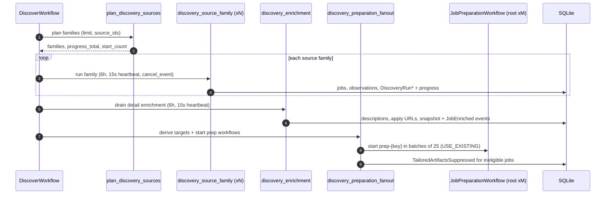
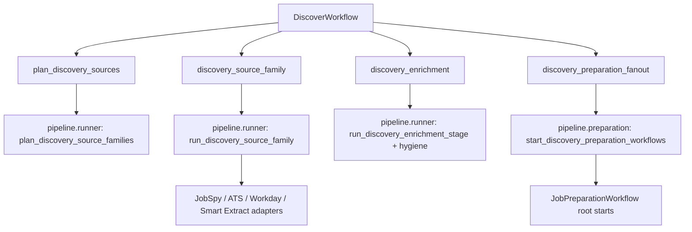
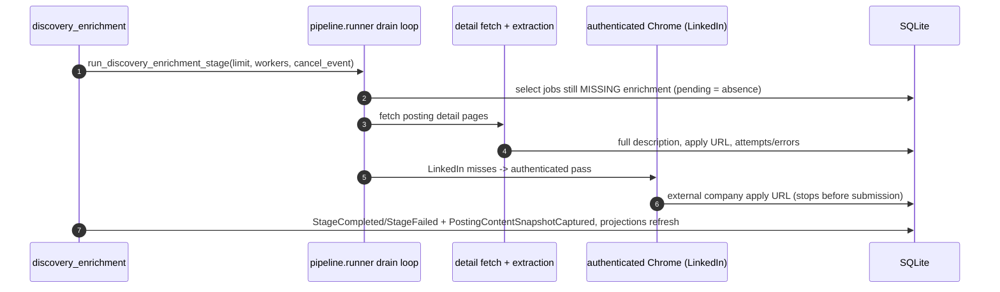
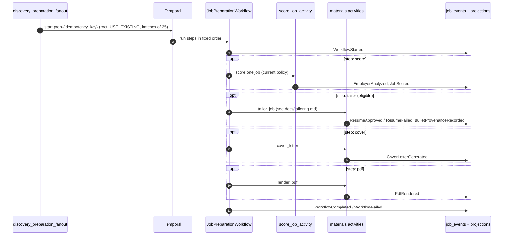
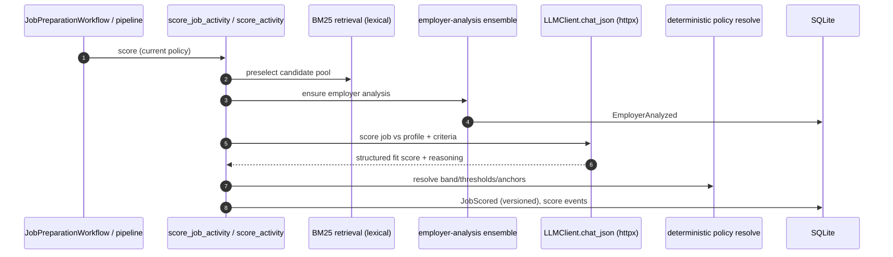
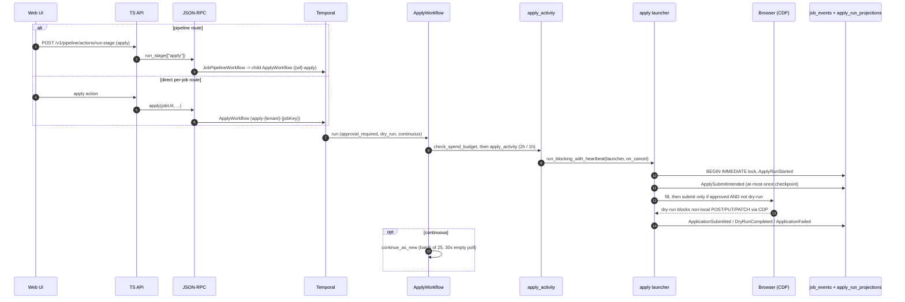

# Stage Walkthrough

Workflow-by-workflow execution detail — call paths, sequence diagrams, and
failure behavior for each stage from discovery to apply.

Each stage below covers purpose, sequence, data/events, and failure behavior.

### Discover

Discover finds postings from configured sources, creates canonical job records
and source observations, drains detail enrichment for jobs that pass the initial
title/location filter, and then fans out per-job preparation. It owns source
scheduling, source-quality feedback, canonical identity, dedupe, protected-source
manual-capture queue entries, and posting hygiene. Scoring and Materials still
own their own writes.

`DiscoverWorkflow` decomposes into **four activities**, not one monolithic run:

Component shape (`DiscoverWorkflow` orchestrates activities; the activities call
runner functions in `pipeline/runner.py`, which drive the source adapters):

Key facts about the four activities:

- **`plan_discovery_sources`** compiles the plan (which source families to run,
  progress totals, and the starting job count) from the source registry, source
  quality, and the global limit. Target roles from the profile become two query
  kinds — exact queries (from saved role text) and recall queries (generated from
  target-role intent, enforcing track and seniority before scoring).
- **`discovery_source_family`** runs *one* source family under
  `run_blocking_with_heartbeat` with a cooperative `cancel_event` and a 6-hour
  window (crawls legitimately run long). Each family is isolated: a JobSpy, ATS,
  Workday, or Smart Extract failure records failure info and lets the workflow
  see a partial result rather than failing the whole batch. With `limit > 0` the
  cap is a **new-job budget** — rediscoveries record observations but do not
  consume the budget, so exact-query duplicates never starve later recall queries
  or sources.
- **`discovery_enrichment`** drains detail enrichment (below) and then runs
  post-discovery hygiene.
- **`discovery_preparation_fanout`** derives targets and starts per-job
  preparation. This is the correction most worth internalizing: **preparation
  workflows are started as independent ROOT workflows**, in batches of 25, via
  the Temporal client with `USE_EXISTING`. They are deliberately *not* children
  of `DiscoverWorkflow` — child workflows default to
  `ParentClosePolicy.TERMINATE`, which would kill preparation the instant
  discovery finished. Before fan-out, the same activity suppresses now-ineligible
  active artifacts via `SuppressTailoredArtifactsUseCase`.

Source steps additionally emit `DiscoveryRunStarted` / `DiscoveryRunCompleted` /
`DiscoveryRunFailed` for source-quality aggregation, and heartbeat a
**`DiscoveryRunProgress` payload** (completed combinations, current
query/location, raw/accepted/duplicate/filtered counts, source errors). That
progress is a heartbeat payload persisted onto the `discovery_runs` aggregate —
it is not a domain event. Discovery uses a no-overlap Temporal policy and
preserves source order so global-limit and source-budget semantics stay stable.

### Detail Enrichment

Detail enrichment turns discovered jobs into usable records by fetching full
descriptions, application URLs, and detail-page metadata. It is not a top-level
user stage — `DiscoverWorkflow` runs it via `discovery_enrichment`, and
`JobPipelineWorkflow` exposes a maintenance `enrich` activity for retries.

Two truths correct the old diagram:

- **"Pending" is the absence of an enrichment row, not a queued row.** Discovery
  does not insert placeholder `JobEnrichment` rows. The drain loop selects jobs
  that still lack enrichment and processes up to `limit` of them; `workers` sets
  concurrency. The activity output reports a `pending` count (how many remain).
- **The clean-port enrichment path is not the live path.** The live drain is the
  inline cascade in `pipeline/runner.py` plus the detail fetchers. The hexagonal
  `EnrichJobUseCase` / `DetailPageFetcherPort` / `LlmPort` wiring exists in the
  domain but is not what discovery calls, so it is not drawn here. The drain
  records `Stage*` and `PostingContentSnapshot*` events, never `JobEnriched` /
  `EnrichmentFailed` — those come from that unused use case and from the separate
  protected-source manual-capture snapshot path.

For LinkedIn rows that are failed or enriched without an application URL, a
bounded authenticated Chrome pass may click the LinkedIn apply control to
capture an external company URL — but it **stops before any form or submission**.
Individual detail failures are recorded per job so later runs retry without
crashing unrelated jobs.

### Preparation

`JobPreparationWorkflow` is the durable bridge from Discover into the Scoring and
Materials contexts. Discovery derives a deterministic, sorted target list after
enrichment, then starts one preparation workflow per job with ID
`prep-{idempotency_key}` and `USE_EXISTING`. Temporal — not a local claim loop —
owns retry, recovery, and duplicate suppression.

Targets are derived in `pipeline/preparation.py` from stage state:

- Jobs at `pending_score` get steps `["score","tailor","cover","pdf"]` keyed to
  the current **scoring-policy** version.
- Jobs at `pending_tailor` (meeting `min_score`) get steps
  `["tailor","cover","pdf"]` keyed to the current **tailoring-policy** version.

Behavior notes:

- Steps run in order; each retries its *current* failing step under Temporal
  without regenerating already-durable earlier steps. A failed score does not
  block other jobs' preparation, and a failed tailor can resume at cover/pdf.
- Threshold changes are **live eligibility changes**, not scoring changes:
  lowering the threshold can derive new `tailor`/`cover`/`pdf` work from
  persisted scores; raising it suppresses active artifacts. Neither path invokes
  the scoring LLM. Scoring-policy and tailoring-policy changes never silently
  rescore or regenerate — that is what the explicit `rescore_*` / `retailor_*`
  actions are for.
- There is no local preparation reaper. Rows already claimed by a fast worker are
  not moved backward; Temporal owns in-flight recovery.

### Score

Score assigns applicant-side fit scores and structured reasoning to enriched
jobs. It owns retrieval preselection, scoring criteria, LLM parsing, score
versioning, and user-corrected score history. In the product flow it is Discover
subwork; explicit rescore actions are maintenance controls.

The scoring path has three distinct parts, and it is worth being precise about
which model machinery each uses:

1. **Retrieval preselection is BM25-only.** `domain/scoring/retrieval.py`
   implements BM25 lexical ranking with *optional* semantic reciprocal-rank
   fusion, but the local build's default semantic adapter is a no-op (no hosted
   embedding service), so ranking is lexical. `limit` applies after preselection.
2. **Employer analysis is the mandatory front-half.** Before the fit score,
   scoring ensures a canonical employer analysis via
   `scoring/employer_analysis.py` / `scoring/scorer.py`. This is produced by the
   three-SDK agent ensemble (Claude Agent SDK + Codex SDK + Antigravity/Gemini,
   synthesized by Claude) and emits `EmployerAnalyzed`. The same analysis is
   reused by tailoring, so it is not recomputed per stage.
3. **The fit score itself comes from the httpx LLM client.** The scoring
   use-case calls `LlmPort.chat_json` (the httpx `LLMClient` behind the
   adapter), which returns a structured fit score, band, criteria, and trace.
   Deterministic policy resolution (rubric weights, thresholds, calibration
   anchors) is applied *separately* from the raw LLM output.

Score writes versioned `job_scores` rows (criteria + trace), can write a new
`scoring_policies` version when user corrections create calibration anchors, and
marks comparable uncorrected scores stale in `job_score_staleness` when a new
policy version lands. Parser warnings and failed LLM calls are recorded so a
failure never masquerades as a successful low-fit result. Scoring prompt/model/
schema/rubric/policy changes must run the local scoring eval gate documented in
[`local-reliability-qa.md`](../../local-reliability-qa.md).

### Tailor

Tailor creates job-specific resume materials for eligible high-fit jobs. It owns
resume generation, validation mode, retry/re-tailor decisions, and artifact
registration; it never submits applications. In the product flow it is Discover
subwork, with first-time manual tailoring exposed on the job detail page.

The mechanism, in brief: one or more configured provider/model specs draft
structured resume candidates; each candidate is validated independently against
the profile contract, the rendered-text contract, and the tailoring quality
plan; then `normal`/`strict` modes require a separate structured judge to return
`PASS` at or above the configured threshold before approval (`lenient` skips the
judge for low-cost local runs). Approved artifacts carry the selected generator,
candidate summaries, judge model, judge score/verdict, prompt/schema versions,
quality checks, and retry feedback as audit metadata; provider URLs and API keys
are never persisted.

Tailoring is where the fabrication gate and per-bullet claim grounding live.
**For gate depth — the fabrication detector, claim-grounding, judge and
adversarial personas, and repair loop — see [`tailoring.md`](../tailoring.md).**
The tailor stage emits `EmployerAnalyzed` (shared with scoring), `ResumeApproved`
/ `ResumeFailed`, and `BulletProvenanceRecorded`; successful tailoring proceeds
into the cover step.

### Cover

Cover generates the job-scoped cover letter for a job that already has sufficient
score/material context, and renders its PDF, so it outputs the artifacts Apply
needs without a separate PDF-only stage. It reads score/job/profile/materials
context, writes the cover-letter row plus local text and PDF files, and emits
`CoverLetterGenerated` and `PdfRendered`. There is **no `CoverLetterFailed`
event**: a failed cover surfaces as `StageFailed` plus the workflow's
`WorkflowFailed` outcome. Failures are per job, so a retry continues from the
remaining pending cover letters.

### PDF

`render_pdf` renders missing PDFs for the current approved materials. It is the
deterministic tail of preparation (no LLM, no spend preflight) and emits
`PdfRendered`. As a prep step it retries under the cover retry policy.

### Apply

Apply drives browser/agent automation to submit or dry-run applications. It is
the riskiest, longest-running stage, so it is isolated in its own workflow with a
tighter retry policy and explicit safety controls. It owns apply-run lifecycle,
browser execution, dry-run safety, cancellation, and apply artifacts/logs.

There are **two entry paths** into `ApplyWorkflow`:

- **Pipeline route:** `run_stage(["apply"])` starts `JobPipelineWorkflow`, which
  delegates to a child `ApplyWorkflow` (`{parent}-apply`).
- **Direct per-job route:** the JSON-RPC `apply` method starts `ApplyWorkflow`
  directly with the per-job ID `apply-{tenant}-{jobKey}`.

The launcher **orchestrates**; it does not fill or submit forms itself. A local
**Claude Code CLI agent** drives the CDP-controlled Chrome through **Playwright
MCP** and performs any form interaction. Terminal apply outcomes are
`ApplicationSubmitted` (live submit), `DryRunCompleted` (dry-run),
`ApplicationFailed`, or `ApplyManualSkip` (manual-ATS skip).

**Three safety invariants, and the mechanisms that enforce them:**

1. **At-most-once submission.** The launcher takes a `BEGIN IMMEDIATE` stage
   lock, guards on stage state, and writes an `ApplySubmitIntended` checkpoint
   before the actual submit, marking the result idempotently afterward. Combined
   with the per-job workflow ID (`apply-{tenant}-{jobKey}` + `USE_EXISTING`,
   one live apply per job) and the **live retry policy of exactly one attempt**,
   a submit is never silently retried into a double application. Dry-runs, which
   submit nothing, get two attempts.
2. **Binding approval gate.** `approval_required` defaults to `True`. The
   launcher requires an explicit `approve_submit` decision before it will
   submit; without approval it stops at the review/dry-run boundary. The gate is
   configurable but binding — it is enforced in the launcher, not merely surfaced
   in the UI.
3. **Browser-layer dry-run guard (CDP).** In dry-run the browser adapter
   overrides the form-submit action and uses the CDP Fetch domain to block
   non-local `POST`/`PUT`/`PATCH` requests. So dry-run safety does not rely on
   the agent choosing not to click submit — even a misbehaving agent cannot
   submit through the browser.

**Timeouts and retries.** The apply activity runs with a 2-hour window for a
normal batch and a 1-hour window per batch in continuous mode; heartbeat timeout
is 60 s. Retry is one attempt live, two attempts dry-run.

**Cancellation.** `cancel_run` (sync JSON-RPC) issues a Temporal cancel to the
workflow handle (`handle.cancel()` via the default canceler) — this is a Temporal
cancellation, not an application signal. The cancel propagates through
`run_blocking_with_heartbeat`'s `on_cancel` hook so the launcher stops
cooperatively; the terminal state is recorded as `WorkflowCanceled` (by finalize
on the cancel path, or by the reconciler). The post-hoc SQLite stage-canceled
write is the API's `cancelJobAction`.
