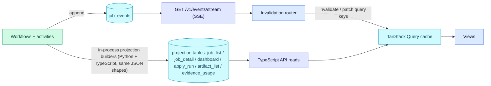
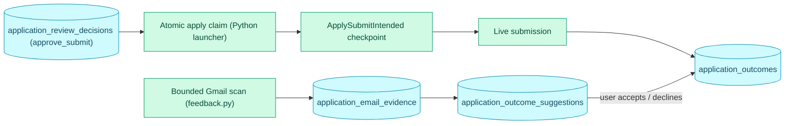

# Apply Feedback & Projections

How submitted applications feed outcomes back into the product, and how domain
events project into the read model the API and web app serve.

**Read this if** you need to know how apply outcomes are captured and reviewed,
or how domain events become the read model behind every list and detail view.

Every write appends to `job_events` and refreshes projections; the Server-Sent
Events (SSE) stream then tells the web app's cache which queries to refetch.

The apply path is gated and checkpointed: an approved review decision precedes
the atomic claim, a durable submit-intent checkpoint precedes live submission,
and Gmail evidence later suggests outcomes for the user to accept or decline.

## Apply Review And Outcome Feedback

The Apply Automation context has a local feedback foundation in the TypeScript
API. `apps/api/src/application-feedback.ts` owns idempotent SQLite table
creation and read/write helpers for:

- `application_review_decisions`: append-only user decisions for apply review.
- `application_outcomes`: reviewed manual or suggestion-derived outcomes. Manual
  interview reflections may carry a nullable `interview_prep_generation` link to
  the stored prep generation they followed.
- `application_email_evidence`: linked Gmail evidence, including body storage
  and body hash columns for confidently linked messages.
- `application_outcome_suggestions`: pending and decided classifier
  suggestions.

Apply-review approval is modeled as a recorded decision, not as an automatic
worker dispatch. Live apply claims require the latest decision for the job to
be `approve_submit` by default (`applyApprovalRequired: true`); the check runs
inside the Python launcher's atomic claim transaction, so while the gate is
on, no API or RPC dispatch path can submit without a committed
`approve_submit` decision. The gate itself is a runtime setting
(`applyApprovalRequired`, default on); a caller-supplied override can disable
it for a run, which is why the Preferences form shows a persistent warning
when it is off. Dry-run claims bypass this approval gate. Manual
outcome notes are stored only in the local outcome table; job events store
presence flags and nullable prep-generation links, not the note text.

::: warning Live submission requires an explicit approval
Live apply is blocked until an `approve_submit` decision exists for the job
(`applyApprovalRequired`, default on). Disabling the gate lets a run submit real
applications without human approval; dry-run claims always bypass it.
:::

Apply has an at-most-once checkpoint before autonomous submission:
`ApplySubmitIntended` is durably recorded immediately before the agent may
submit in a live run. If a live run dies after that checkpoint and no terminal
submit result exists, recovery parks the apply stage in `needs_verification`
instead of blindly re-queueing it. Runs without submit intent can be safely
rewound to `pending`.

Apply Review resume edits are modeled as a local feedback/draft layer in the
TypeScript API, not as direct writes to the Materials aggregate. The generated
HTML/CSS resume is loaded into a Plate editor; saved revisions, line edit
deltas, JobCtrl comment threads, user replies, and feedback signals are
persisted in `resume_review_*` / `tailoring_feedback_signals` tables. A render
promotion validates the saved draft, creates a new `job_materials` generation
with replacement `tailored_resume` and `resume_pdf` artifacts plus layout boxes,
then marks unresolved comments as residual after acceptance. Existing approved
artifacts remain visible until that replacement generation is written, so failed
validation or render attempts do not destroy reviewable materials.

Gmail outcome feedback is implemented in
`workers/automation/src/jobctrl/infrastructure/gmail/feedback.py`, separate
from the verification-only Gmail MCP server. The scanner reuses the readonly
Gmail OAuth/client support but searches only bounded post-application windows
for known SQLite application anchors. Candidate queries combine the recipient
email with employer/ATS hints, job title/company terms, application URL/domain
tokens, and application timing. The worker reads a full Gmail body only after
metadata reaches the link-confidence threshold, then stores body text,
`body_sha256`, `linked_at`, confidence, safe link signals, and a unique provider
message ID in `application_email_evidence`. Deterministic v1 classification
writes pending `application_outcome_suggestions` for confirmations, recruiter
replies, interviews, assessments, rejections, offers, bounces, and unknowns.

`job_events.payload_json` receives safe summaries with identifiers, kinds,
sources, timestamps, confidence values, link signals, and presence flags; raw
notes and raw email bodies are not copied into domain events, projections,
logs, telemetry, or Gmail scan API responses.

## Read-Model Projections

The Operations / Read-Side context maintains denormalised projection
tables that back every read-model endpoint:

| Table                        | What it stores                                                    |
|------------------------------|-------------------------------------------------------------------|
| `job_list_projections`       | One row per job — title, employer, current stage/state, fit score, canonical fit band when recorded, materials presence, apply status, apply mode, accepted resume template, and tailoring policy version. |
| `dashboard_projections`      | Singleton aggregates: counts, funnel per stage, source breakdown, score distribution, and the outcome-conversion funnel (`outcome_conversion_json`: applied/reply/interview/offer/rejection counts by source, score band, fit band, apply mode, accepted resume template, and tailoring policy, plus response-minute samples and suggestion decision counts from canonical rows). |
| `job_detail_projections`     | Per-job description preview, score reasoning, full stages array, employer/requirement audit JSON, latest accepted interview prep, and curated audit history assembled from job events plus append-only apply feedback records. |
| `artifact_list_projections`  | All generated artifacts (resume txt/pdf, cover txt/pdf) with provenance. |
| `evidence_usage_projections` | Career evidence map rows that invert profile achievement/skill evidence into resume-bullet usage, requirement-fit usage, generation-time skill coverage, and missing/blocked/transferable gaps. |
| `apply_run_projections`      | Apply-run telemetry with denormalised job context and event timeline. |
| `workflow_run_projections`   | One row per Temporal workflow run across all workflow types — status (12-state), input summary, failure cause, and a timeline folded from the `Workflow*` lifecycle events. The Python builder is the sole writer; the TypeScript API creates/reads it. |
| `source_quality_stats`       | Rolling per-source health rates used by the dashboard and discovery scheduler. |
| `contact_projections`        | One row per contact (Contact & Outreach): link, role, attribute and confirmed-fact counts, distinct source kinds, and per-attribute provenance metadata. No attribute values (sensitivity). |
| `contact_research_task_projections` | One row per supervised research task (Contact & Outreach): status, candidate/needs-review/confirmed counts, the source-attempt outcomes (provenance of the search), and per-candidate provenance metadata + attribute kinds. No candidate attribute values (sensitivity). |
| `outreach_thread_projections` | One row per outreach thread (Contact & Outreach): draft count, latest generation and status, whether an approved draft exists, and per-draft metadata (draft id, generation, kind, status, and the persisted `gatePassed` outcome). No draft body, gate internals, or claim provenance — those stay in canonical `outreach_drafts` and are joined at detail-read time (sensitivity). |
| `due_follow_up_projections` | One row per outreach thread with a **scheduled** follow-up (Contact & Outreach): the thread/contact/job ids, the suggested `due_at`, and the basis label. Completed/dismissed/unscheduled threads are not projected. Whether a follow-up is *due* is computed at read time over `due_at` + the clock (a derived signal, never stored and never an action — INV-1). Carries safe references only; never a contact name/email. |
| `operational_attempt_metrics` | Append-only stage/source/apply attempt facts with outcome, source role, failure class, retryability, scrape/operational flags, counts, and durations. |

The Python `ProjectionBuilder` (driven by `InProcessEventBus`) and the TS
`refreshProjections` helper both read new rows from `job_events` since the
shared `event_watermarks.operations_projections` watermark, recompute
projections from canonical aggregate state, and advance the watermark in the
same transaction. Both processes write to the same tables; SQLite handles the
concurrent advances. Request paths read precomputed projections instead of
assembling stage state with per-request joins.

Contact & Outreach projections follow the same dual-runtime pattern. The Python
`ProjectionBuilder._rebuild_contacts` and the TypeScript
`rebuildContactProjections` both rematerialise `contact_projections` from the
canonical `contacts` / `contact_attributes` rows, and a cross-runtime parity
fixture (`test_contact_projection_parity.py` /
`apps/api/test/contact-projection-parity.test.ts`) guards drift. Contact events
(`ContactCreated`, `ContactUpdated`, `ContactAttributeRecorded`,
`ContactDeleted`) reach SSE and the projection watermark through `job_events`,
written by `record_job_event` with `entity_kind = 'contact'` /
`entity_ref = <contactId>` (the generic event-log columns added in schema v2); a
contact event that also concerns an application keys on that job's `job_url` too.
Both the events and the projection carry only safe references — attribute values
(names, emails, notes) stay in `contact_attributes.value_json` and never appear
in `job_events`, `contact_projections`, logs, or telemetry (INV-2 provenance is
projected; the value is not).

Supervised research adds `contact_research_task_projections` under the same
dual-runtime pattern. The Python `ProjectionBuilder._rebuild_contact_research`
and the TypeScript `rebuildContactResearchProjections` both rematerialise it from
the canonical `contact_research_tasks` / `contact_candidates` rows, gated on the
research event set (`ContactResearchTaskStarted`, `ContactCandidateProposed`,
`ContactResearchTaskNeedsReview`, `ContactResearchTaskCompleted`,
`ContactResearchTaskFailed`), and a cross-runtime parity fixture
(`test_contact_research_projection_parity.py` /
`apps/api/test/contact-research-projection-parity.test.ts`) guards drift. The
projection carries the task lifecycle, counts, the per-source
`ResearchSourceAttempt` outcomes (allowed / robots_disallowed / rate_limited /
budget_exhausted / manual_capture_required / rejected — the provenance of the
search itself), and per-candidate provenance metadata + attribute *kinds*.
Candidate attribute *values* (proposed names, emails) live only in
`contact_candidates.attributes_json` and reach the client solely through the
research-task detail read; they never enter events, the projection, logs, or
telemetry.

Outreach drafting adds `outreach_thread_projections` under the same dual-runtime
pattern. The Python `ProjectionBuilder._rebuild_outreach` and the TypeScript
`rebuildOutreachProjections` both rematerialise it from the canonical
`outreach_threads` / `outreach_drafts` rows, gated on the outreach draft event set
(`OutreachDraftGenerated`, `OutreachDraftRevised`, `OutreachDraftApproved`,
`OutreachDraftRejected`), and a cross-runtime parity fixture
(`test_outreach_projection_parity.py` /
`apps/api/test/outreach-projection-parity.test.ts`) guards drift. The projection
surfaces the draft lifecycle (generation, status, whether an approved draft
exists) and the per-draft `gatePassed` metadata (the persisted truthfulness-gate
outcome — INV-5); the review UI joins the canonical `outreach_drafts` rows for the
full gate results and the claim → fact provenance. The draft `body_text`,
`gate_results_json`, and `provenance_json` live only in `outreach_drafts` (the
canonical write side) and are surfaced solely through the thread detail read model;
the draft-lifecycle events (written by `record_job_event` with
`entity_kind = 'outreach'` / `entity_ref = <threadId>`; application-linked threads
also key on the job's `job_url`) and the projection carry only ids, kinds,
generation, and timestamps. Contact PII and fetched page bodies never enter
`job_events` payloads, the projection, logs, or telemetry. There is no send
transport on any outreach read or write path (INV-1).

Send logging and follow-ups (Phase 4) extend the same dual-runtime pattern. A
**user-attested** `OutreachSendLog` — the only way a thread reaches a "sent" state
(INV-1) — is recorded over an approved draft and emits `OutreachSendLogged`;
scheduling/completing/dismissing a follow-up emits
`FollowUpScheduled`/`FollowUpCompleted`/`FollowUpDismissed`. All four are added to
the outreach event set, so the Python `ProjectionBuilder._rebuild_due_follow_ups`
and the TypeScript `rebuildDueFollowUpProjections` rematerialise
`due_follow_up_projections` from the canonical `outreach_threads` follow-up columns
whenever any outreach event fires; a cross-runtime parity fixture
(`test_due_follow_up_projection_parity.py` /
`apps/api/test/due-follow-up-projection-parity.test.ts`) guards drift.
`GET /v1/outreach/follow-ups/due` reads that projection and computes the derived
`isDue` flag over the clock at read time — it never sends and never auto-acts. The
send-log and follow-up events carry only ids, a channel *label*, and timestamps;
no contact name/email ever enters an event, the projection, logs, or telemetry.

The evidence-usage projection is read-only and derives from existing canonical
profile, requirement-fit, bullet-provenance, and artifact coverage rows. It does
not create a new generation pipeline: resume usage still comes from the
Materials provenance/audit tables, and requirement gaps still come from the
Scoring requirement-fit rows. Older local databases that lack newer optional
profile metadata columns project conservative defaults instead of failing
unrelated read paths.

The outcome-conversion projection materialises integer funnel counts only (both
builders must agree — the cross-runtime parity fixture asserts the
`outcome_conversion_json` column). The dashboard read model derives the
conversion rates (reply/interview/offer/rejection over applied) from those
counts so there is no cross-runtime float drift; `costPerInterview` stays `null`
until per-run apply cost is projected. `GET /v1/analytics/outcomes` reads the
same integer-count projection and exposes an analytics-specific contract with
`n`, `minSample`, `bySource`, `byScoreBand`, `byFitBand`, `byApplyMode`,
`byTemplate`, `byPolicy`, `timeToResponse`, and `suggestionAccuracy`.
`byScoreBand` keeps the existing parity-guarded score vocabulary
(`perfect/strong/moderate/weak/poor/unscored`); `byFitBand` is a separate
canonical requirement-fit vocabulary
(`excellent/strong/plausible/stretch/poor/unreported`). Template and policy
groups come from the accepted material artifact metadata projected onto
`job_list_projections`. `timeToResponse.medianMinutes` is read-time derived from
`applied_at` to the earliest response-kind `application_outcomes.occurred_at`;
`suggestionAccuracy` counts decided `application_outcome_suggestions` rows. The
read model uses the single `MIN_CONVERSION_SAMPLE` threshold for every rate and
median, so sub-threshold buckets keep counts but return `null` rates or medians.
This surface is read-only — it stays outside scoring, ranking, thresholds, and
apply eligibility.

Job detail audit history is assembled at read time from allow-listed lifecycle
events and append-only apply review/outcome records. It is a user-facing audit
timeline, not a debug log: raw event payloads, debug messages, local paths, raw
outcome notes, and email body text stay out of the response.
Posted-compensation facts are persisted in `job_posted_compensation_facts`
before inspection. They are exposed through both the narrow read-only
inspection API and projection-backed job list/detail compensation summaries.
Company-role market compensation estimates are persisted in
`job_market_compensation_estimates` before inspection. Estimates are
deterministic local facts derived from configured reported compensation feeds for
Euro Top Tech, Levels.fyi, Glassdoor, or manual imports, or from employer-posted
salary facts already captured by JobCtrl.
Euro Top Tech rows are treated as public community-reported EUR/year total
compensation observations. Levels.fyi and Glassdoor rows are loaded only when
the user-enabled source preference, permitted access basis, and feed path or URL
are configured; Levels.fyi also requires explicit Europe coverage confirmation.
The API and worker read the same file-backed preference. Once present, that
preference overrides the legacy environment gate, including when the user has
explicitly disabled the source.
Employer-posted market rows are labeled as job posting salary text and remain
low confidence when they are based on a single posting or extrapolated fallback
tier. These rows store explicit estimate
states, normalized company and role, match scope, trimodal company tier,
confidence factors, confidence interval bounds, safe source snapshots, warnings,
and reasons. They do not store raw benchmark pages, provider payloads,
credentials, local paths, private account state, user compensation preferences,
or U.S. salary baselines.
Compensation writes emit `CompensationFactsUpdated` rows into `job_events`.
Those payloads carry only job id, changed section, state markers, and timestamp;
the Operations/SSE invalidation path refreshes job list/detail queries from the
projection tables.
