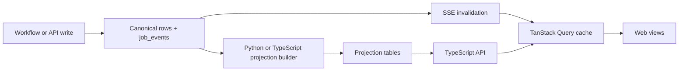
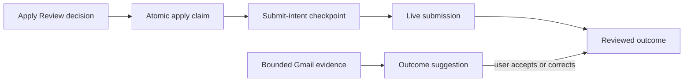

# Apply Feedback & Projections

Domain writes become durable events and canonical rows; projection builders turn
them into stable reads for the API and web app. Apply decisions and outcomes use
the same pattern, with extra safeguards around approval, submission, and private
feedback.

**Read this if** you are changing Apply Review, outcomes, analytics, contacts,
outreach, or any projection-backed list/detail view.

## At A Glance

The read path never reconstructs domain state from raw events during a request.
It reads precomputed projections; SSE only tells the client which projection to
refetch or safely patch.

## Apply Review And Outcome Feedback

### Approval And At-Most-Once Submission

With `applyApprovalRequired` enabled (the default), the Python launcher checks
the latest `approve_submit` decision inside the atomic claim transaction. A UI,
API, or RPC caller cannot bypass that committed decision. Dry-run claims do not
need approval because browser-layer guards block submission.

Immediately before a live submit, the launcher records
`ApplySubmitIntended`. If the run dies after that checkpoint without a terminal
result, recovery parks it in `needs_verification` instead of retrying. A run that
never reached submit intent can return safely to `pending`.

::: warning Live submission is an explicit trust boundary
Turning off `applyApprovalRequired` allows a claimed live run to submit without
per-job approval. The Preferences UI keeps that state visibly warned.
:::

### Resume Review Drafts

Apply Review edits are a feedback layer, not in-place mutations of an accepted
Materials generation. The API stores revisions, line deltas, comment threads,
replies, and feedback signals in `resume_review_*` and
`tailoring_feedback_signals` tables.

Promotion follows three steps:

1. validate and render the saved draft;
2. write a new `job_materials` generation with replacement HTML/PDF artifacts
   and layout boxes;
3. mark unresolved comments as residual after acceptance.

The previous accepted artifact stays visible until step 2 succeeds. A failed
validation or render therefore cannot destroy reviewable materials.

### Outcomes And Gmail Suggestions

`application_outcomes` stores reviewed manual or suggestion-derived outcomes.
Interview reflections may link to the prep generation they followed. Notes stay
in that local table; events carry presence flags and safe references, not note
text.

The Gmail feedback scanner searches bounded post-application windows using
known application anchors. It reads a body only after metadata reaches the
link-confidence threshold, then stores evidence locally and proposes a
classification. The user accepts, corrects, or declines the suggestion.

Raw mail bodies never enter events, broad projections, logs, telemetry, or the
scan API response.

## Projection Catalog

| Projection | Main read responsibility |
| --- | --- |
| `job_list_projections` | One compact row per job: stage, score, materials, apply state, template, and policy metadata. |
| `job_detail_projections` | Description, stage timeline, employer/requirement audit, compensation, accepted interview prep, and curated history. |
| `dashboard_projections` | Counts, funnel, source/score distribution, and outcome-conversion counts. |
| `artifact_list_projections` | Registered artifacts and their tailoring explanation. |
| `evidence_usage_projections` | Profile evidence inverted into resume, requirement, and coverage usage/gaps. |
| `apply_run_projections` | Apply-run context and event timeline. |
| `workflow_run_projections` | Status, input summary, failure cause, and lifecycle timeline for every Temporal workflow type. |
| `source_quality_stats` | Rolling source-health facts used by discovery and the dashboard. |
| `contact_projections` | Contact references, counts, and provenance metadata—never attribute values. |
| `contact_research_task_projections` | Research status, counts, source outcomes, and candidate provenance/kinds—never candidate values. |
| `outreach_thread_projections` | Draft lifecycle, generation, status, and persisted gate outcome—never draft bodies. |
| `due_follow_up_projections` | Scheduled follow-up references and due time; `isDue` is derived at read time. |
| `operational_attempt_metrics` | Append-only attempt outcomes, failure class, retryability, counts, and duration. |

## Cross-Runtime Consistency

Python's `ProjectionBuilder` and TypeScript's `refreshProjections` consume new
`job_events` rows after the shared
`event_watermarks.operations_projections` watermark. Each rebuilds from
canonical aggregate state and advances the watermark in the same transaction.
SQLite serializes concurrent advances.

Both runtimes emit the same JSON shapes. Shared parity fixtures guard the
dual-written job, contact, research, outreach, follow-up, compensation, and
audit projections. That makes a one-sided column or shape change a test failure
instead of a client surprise.

## Sensitive Projection Families

### Contacts, Research, And Outreach

Events and broad projections carry IDs, controlled kinds, counts, timestamps,
and provenance metadata. Contact names, emails, notes, candidate values, fetched
page bodies, draft bodies, gate internals, and claim provenance stay in their
canonical tables and are joined only for authorized detail reads.

Research outcomes such as `robots_disallowed`, `rate_limited`, and
`budget_exhausted` are first-class provenance. A proposed candidate becomes a
contact only after confirmation. Outreach has no send transport: an approved
draft can be copied/exported, and a later send log is an explicit user
attestation.

Follow-up projections contain reminders only. `GET
/v1/outreach/follow-ups/due` computes `isDue` from the stored due time and the
clock; it never sends or acts.

### Evidence, Analytics, And Compensation

The evidence map derives from canonical profile evidence, requirement-fit,
bullet-provenance, and coverage rows. It creates no second generation pipeline
and uses conservative defaults for older databases missing optional metadata.

Outcome conversion stores integer counts. The API derives rates and medians at
read time using one minimum-sample threshold, so small groups keep counts but
return `null` rates/medians. Analytics remain read-only and cannot alter scoring,
ranking, thresholds, or apply eligibility.

Posted compensation and deterministic market estimates are persisted before
they are projected. Projection/API reads do not parse salary text or fetch a
provider. Events carry only the affected job/section/state markers; raw feeds,
credentials, private account state, and local paths stay out.

## User-Facing Audit History

Job detail assembles an allow-listed timeline from lifecycle events and
append-only review/outcome records. It is an audit explanation, not a debug log:
raw event payloads, debug messages, local paths, raw notes, email bodies, and
contact values are excluded.
