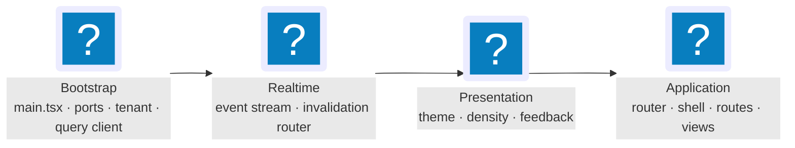
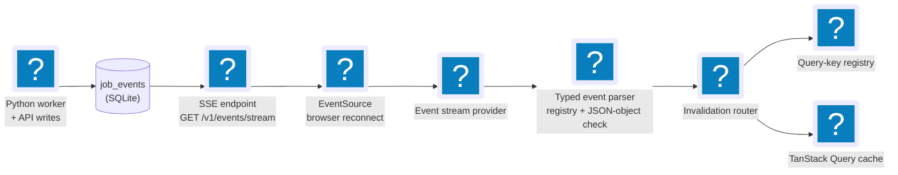

# Runtime & Processes

JobCtrl runs as four long-lived local processes, plus a `jobctrl rpc`
subprocess the TypeScript API spawns on demand. This page walks each runtime
boundary — what it owns, what it must never do, and how the pieces talk.

For a focused explanation of the workflow-engine choice, read
[Temporal Workflows In A Desktop App](../guides/temporal-workflows-desktop-app.md).

**Read this if** you need to know which process is responsible for a behavior,
or where a change belongs.

| Process | What it is | Owns |
| --- | --- | --- |
| The web app | React/Vite single-page app (`apps/web`) | user interaction and view state |
| The TypeScript API | Fastify server (`apps/api`), loopback-bound | typed read models and local product endpoints; spawns the `jobctrl rpc` subprocess |
| The Python worker | `jobctrl worker`, a Temporal worker | executes workflows and activities (discovery, scoring, tailoring, apply, …) |
| Temporal dev server | the workflow engine (gRPC `:7233`, Web UI `:8233`) | durable workflow execution and history |
| `jobctrl rpc` subprocess | spawned by the TypeScript API on the first JSON-RPC call and reused | JSON-RPC dispatch for complex commands |

You start the first four; the API spawns and reuses the `jobctrl rpc`
subprocess itself.

## Source and bundled runtime boundaries

The table above describes the source-development topology. The bundled
production boundary packages the same application without carrying the
checkout or asking the user for a language/runtime toolchain:

- the Vite output is static and is served by the loopback Fastify API, so an
  installed runtime has no Vite process;
- the API is compiled for the embedded Node runtime and its native SQLite
  module is pinned for that exact Node ABI;
- the worker and CLI run under an embedded CPython with only the core runtime
  closure; fixed relative system-site entries expose the separately owned
  worker and Python Playwright component roots;
- Temporal, one Python Playwright Chromium headless-shell revision, and
  Playwright MCP are
  addressed through absolute payload paths and never through user `PATH`,
  `npx`, `uv`, or a package registry at execution time; and
- PDF page previews are rendered by PDF.js in the web client. The installed
  runtime has no Poppler component or `pdftoppm` route.

`JOBCTRL_RUNTIME_MODE=bundled` makes this boundary fail closed. The launcher
must supply an absolute `JOBCTRL_PAYLOAD_DIR`; the API realpaths its Python,
web, and Chromium roots and rejects paths outside that payload. Python isolated
mode ignores ambient `PYTHONHOME`, `PYTHONPATH`, user-site, and virtualenv
state. Bundled dotenv discovery is limited to the JobCtrl-owned state file and
never searches the current directory or a checkout.

Provider runtimes that JobCtrl cannot redistribute are a separate mutable
boundary under the JobCtrl state directory. The signed payload owns the exact
provider-pack lock; installation accepts only that lock, verifies every wheel's
official HTTPS source, size, and SHA-256, rejects unsafe or overlapping wheel
members, and retains the locked wheels. Every activation revalidates those
wheels, deterministically re-extracts their expected tree, and compares it with
live site-packages, so mutable activation metadata cannot authorize code. Pack
paths are appended after the core runtime; core overlap is rejected and
provider-to-provider overlap requires signed-identical wheel records. In
bundled mode Claude accepts API/cloud authentication only, launches with
`--bare`, and does not probe or reuse consumer Claude Code OAuth or Keychain
credentials. Codex uses persisted CLI authentication in the stable
`$JOBCTRL_DIR/codex_home`; raw OpenAI keys are accepted only as stdin enrollment
input to `codex login --with-api-key`, never as a direct runtime credential.
When isolated auth is absent, setup and generation retain one-time reuse
of a regular Codex CLI `auth.json`; the explicit Codex provider verify action
uses the same copy-once behavior before checking the isolated login. Existing
JobCtrl-owned auth is not overwritten, and the normal Codex home is unchanged.
The auth file stays outside `codex_home/workspace/`; the permissions profile
denies root reads and grants prompt-driven reads only to that workspace subtree,
minimal runtime paths, and the one canonical Codex executable required to start
the app server. It never grants the executable's parent directory, its
site-packages tree, or sibling files.
Structured Claude analysis/voice calls expose no built-in tools.
Codex analysis disables its shell, denies approvals, and gives any command
child an empty inherited environment, so provider API keys authenticate the SDK
transport without becoming model-readable tool input.

Bundled doctor validates the payload-owned executable Playwright MCP wrapper
instead of requiring system `npx`. Nested Python setup/doctor and MCP processes
run with isolated mode plus bytecode suppression (`-I -B`) so they cannot write
`__pycache__` into the launcher-verified payload.

The installed payload uses a native `jobctrl` supervisor.
It verifies the manifest envelope/tree before dispatch, starts fixed loopback
Temporal (gRPC `7233`, Web UI `8233`) → worker → API (`8766`) in that order,
and waits for Temporal plus API worker-heartbeat health. Each canonical
`JOBCTRL_DIR` gets one `flock`-protected registry at
`~/Library/Application Support/JobCtrl/instances/<sha256>` (or
`JOBCTRL_RUNTIME_HOME`); records bind PID, PGID, start identity, executable,
build ID, manifest digest, and ports so lifecycle cleanup cannot target a
reused PID. The P6 workflow now makes Developer ID signing, notarization, and
authenticated publication mandatory for promotion. Public artifacts pass those
gates before the stable release pointer or Homebrew formula can reference them.

The P5 lifecycle store is user-owned (`JOBCTRL_RUNTIME_HOME`), not a package
manager Cellar. `active.json` atomically records the selected payload, the
compatible immutable selector build, and the current acquisition adapter;
immutable release receipts never contain acquisition ownership. A durable
transition journal records selector handoff, database-pair backup, pending and
finalized channel policy, and promotion. Acquisition, update, rollback,
backup, retention, and uninstall serialize through transition then selection
locking; selector resolution holds a shared selection lock through supervisor
readiness. Before a candidate is promoted, the old process tree is quiesced
with the registry's PID/PGID identity checks and both `JOBCTRL_DIR/jobctrl.db`
and `JOBCTRL_DIR/temporal.db` receive online, hash-verified paired backups.
The current runtime admits only exact schema v9. A stopped v6 database uses the
existing Temporal quiescence proof and private v7/v8 intermediates before v9;
a stopped exact-v7 database starts with the private v8 step; and an exact-v8
database receives only the additive optional position-summary column. An
exact-v9 database needs no schema transition. Neither Python nor the TypeScript
API runs against an intermediate schema, and recovery removes staged candidates
before restoring the retained pair.
Policy finalization happens only after the candidate has passed readiness and
the paired backup is durable, so a failed health gate cannot revoke the only
runnable release. A pre-finalization failure restores the full pair and
restarts the still-permitted prior release. An interruption after a healthy
candidate finalizes a revocation fails closed to that authenticated candidate
instead of executing revoked code. Published builds have passed signing,
notarization, authenticated publication, and clean-machine acquisition gates
before this lifecycle boundary can promote them.

## Frontend

The web app under `apps/web` owns user interaction:

- dashboard summary
- jobs list and job detail
- artifacts list
- profile/style editor shell
- filtering, sorting, pagination, and selected-detail workspace state
- UI action buttons

The frontend uses `@jobctrl/api-client` for API transport and
`@jobctrl/contracts` for shared schemas and DTOs. It should not know shell
command syntax.

The frontend follows its own DDD + hexagonal target documented in the
[Frontend](frontend/index.md) section — three-layer state separation,
nine bounded contexts that mirror the backend 1:1, view-vs-context dichotomy,
hexagonal frontend ports, Server-Sent Events (SSE) realtime via the invalidation
router, and a projection-typed Operations read-side. The summary below
cross-links to those pages; the Frontend section is the canonical detail.

### Stack

| Concern | Choice | Target ref |
|---|---|---|
| Bundler / dev server | Vite (SPA today; TanStack Start named-not-built for SSR) | §4.1, §9.1 |
| UI library | React 19 | §4.7 |
| Styling | Tailwind CSS 4 with design tokens in `tokens.css`; `darkMode: ["selector", "[data-theme='dark']"]` | §4.8 |
| Component primitives | shadcn Rhea/Base preset over Base UI; copied + owned wrappers in `shared/ui/` | §4.7 |
| Router | TanStack Router (file-based via `@tanstack/router-vite-plugin`) with route-level Zod search-param schemas | §4.3 |
| Server state | TanStack Query v5 with per-context query-key factories, `tenant`-first keys, central registry in `contexts/operations/queryKeys.ts` | §4.1, §4.4.1 |
| Tables | Shared filterable data grid (`shared/ui/filterable-data-grid.tsx`); column models (`DataGridColumn<T>[]`) live with the consuming view; cell renderers are imported from contexts; `@tanstack/react-table` supplies selection/sorting types only | §3.10, §11 |
| Forms | TanStack Form + Zod `safeParse` | §4.6 |
| Client state | Zustand (`shared/stores/`) — UI prefs, toast queue, command palette, profile-import wizard draft (`persist` middleware where durability matters) | §4.9, §4.10 |
| Test runner | Vitest + React Testing Library + MSW for unit / hook / component | §10.2, §10.3 |
| End-to-end | Playwright against a seeded local TypeScript API + SQLite fixture | §10.4 |
| Component-driven dev | Storybook with `addon-msw` and `addon-a11y` (critical+serious axe violations fail CI) | §10.5, §10.7 |
| Type-level tests | Vitest `typecheck` mode via `vitest.types.config.ts`; `*.test-d.ts` files live under `apps/web/test/types/`; invoked as `pnpm --filter @jobctrl/web test-d` | §10.6 |

### Three Layers of State

Every piece of state lives in exactly one layer (Frontend §2.1):

| Layer | Owner | What lives here |
|---|---|---|
| Server state | TanStack Query cache | API-derived projections, profile, settings, dashboard summary — anything fetched from `apps/api`. |
| URL state | TanStack Router (typed search params via Zod) | Anything bookmarkable: view, filters, sort, page, page size, selected entity, detail-workspace/inspector state. |
| Client state | Zustand (with `persist` where appropriate) + React context | Theme, density, tenant context, transient UI like toast queue, ephemeral form drafts that do not survive navigation. |

No server data in `useState`; no filter / pagination / sort / detail-route state in
`useState`; no durable user preferences in component-local state; one source of
truth per fact; components consume state through hooks (never raw stores or the
`QueryClient` directly).

### Frontend Bounded Contexts

`apps/web/src/contexts/<name>/` mirrors the backend's nine bounded contexts
1:1 (Frontend §3, §11):

| Frontend folder | Owns | Backend mirror |
|---|---|---|
| `discovery/` | `useDeleteJobMutation`, `useDeleteJobsBulkMutation`, `useRestoreJobMutation`, `useRestoreJobsBulkMutation`, `useHideJobsBulkMutation`, `useUnhideJobsBulkMutation`, `usePermanentlyDeleteJobsBulkMutation`; future `useImportJobMutation`. | Job Discovery |
| `enrichment/` | `JobEnriched` / `EnrichmentFailed` invalidation handlers; future `useEnrichmentRetryMutation`. The enrichment aggregate is internal to Discovery's detail queue drain. | Job Enrichment |
| `profile/` | `useProfileQuery`, `useUpdateProfileMutation`, `useImportResumeMutation`, settings + credentials hooks, profile-import wizard store, profile editor + resume preview components. | Candidate Profile |
| `scoring/` | `<ScoreBadge>`, `<ScoreBreakdown>`; future `useCorrectScoreMutation`. | Scoring |
| `materials/` | `useGenerateMaterialsMutation`, `useOpenArtifactMutation`, generate / open buttons. | Materials Generation |
| `apply/` | `useApplyJobMutation`, `useDryRunApplyMutation`, `useCancelApplyMutation`, `<ApplyButton>`, `<DryRunButton>`, `<ApplyRunBadge>`, `<ApplyRunTimeline>`, `<ApplyHistory>`. | Apply Automation |
| `pipeline/` | `useRunPipelineStagesMutation`, `useRetryStageMutation`, `useCancelStageMutation`, `useMarkAppliedMutation`, `useMarkSkippedMutation`, `<StageTriggerPanel>`, `<StageBadge>`, `<StageTimeline>`, `<JobActions>`. | Pipeline Orchestration |
| `operations/` | Projection/runtime read hooks (`useDashboardSummaryQuery`, `useJobsListQuery`, `useJobDetailQuery`, `useArtifactsListQuery`, `useArtifactDetailQuery`, `useApplyRunsListQuery`, `useApplyRunQuery`, `usePipelineOperationsQuery`); query-key registry; SSE subscription; invalidation router. | Operations / Read-Side |
| `outreach/` | Contact records with provenance: `useContactsListQuery` / `useContactDetailQuery`, create / update / delete / import-contact mutations, contact provenance + role components, the Contacts view + Jobs-detail panel, and contact event handlers. | Contact & Outreach |

The view folders under `views/` (`views/dashboard/`, `views/jobs/`,
`views/artifacts/`, `views/apply-review/`, `views/pipelines/`, `views/runs/`,
`views/discovery/`, `views/outreach/` (Contacts), and `views/debug/`) are
**composers, not contexts**
(Frontend §3.10). They import hooks from
`contexts/operations/` and components / mutations from aggregate contexts;
they own layout and view-local ephemeral UI (e.g., bulk-selection sets) and
nothing else. View → context dependency is one-way; views never depend on
other views.

### Hexagonal Frontend Ports

Components and feature hooks depend only on **ports**; concrete adapters bind
to the ports in `shared/providers/PortsProvider.tsx`
(Frontend §6):

| Port | Local-mode adapter | Hosted-mode adapter (named, not built) |
|---|---|---|
| `ApiClientPort` | `FetchApiClientAdapter` (wraps `@jobctrl/api-client`) | Same adapter; baseUrl from env, `Authorization: Bearer <jwt>` injected by hosted `AuthInterceptor`. |
| `EventStreamPort` | `SseEventStreamAdapter` (`new EventSource(...)`) | `WebSocketEventStreamAdapter` if SSE proves limiting. |
| `StoragePort` | `LocalStorageAdapter` | `IndexedDbAdapter` when client-side cache exceeds 5 MB. |
| `SessionPort` | `LocalSessionAdapter` (returns `LOCAL_TENANT`) | `JwtSessionAdapter` (Auth0 / Cognito). |
| `ClipboardPort` | `NavigatorClipboardAdapter` | Same adapter. |
| `OpenInOsPort` | `OpenArtifactAdapter` (POSTs to `/v1/artifacts/:id/open`) | Disabled in hosted mode; UI surfaces a presigned-URL download instead. |
| `TelemetryPort` | `ConsoleTelemetryAdapter` (no-op) | `OpenTelemetryWebAdapter` → OTLP collector. |
| `FeatureFlagPort` | `StaticFeatureFlagAdapter` (always default) | Backend-served via `apiClient.featureFlags()`; cached in Query. |

The "frontend driving ports" (use cases) are the per-context hooks themselves
(`useApplyJobMutation`, `useDeleteJobMutation`, …) — React conventions are the
de-facto driving-port representation; no `UseCase` interface is formalised
(Frontend §6.7).

### Provider Stack

The provider stack as wired in `apps/web/src/main.tsx` (top-down):

Providers within each layer keep their source order from `main.tsx`.
`EventStreamProvider` lives in `contexts/operations/providers/` because the
Operations context owns the SSE subscription and the invalidation-router
dispatch (Frontend §3.9, §7.3); every other provider lives
in `shared/providers/`.

### Realtime — SSE → Invalidation Router → Cache

The invalidation router is **the** integration contract between the backend's
`DomainEvent` taxonomy and the frontend cache — a pure function tested in
isolation. Every backend event has a handler; the
`Record<DomainEvent["eventType"], InvalidationHandler>` typing makes a missing
handler a TypeScript compile error, and the
`every-event-has-handler.test.ts` parity test catches obvious empty-stub
implementations (Frontend §7.4).

### Test Pyramid

Frontend §10. Vitest + React Testing Library + MSW for unit /
hook / component tests; Playwright for end-to-end critical flows; Storybook
with the a11y addon for component-driven development. Two parity tests guard
the cross-language seams:

- `every-event-has-handler.test.ts` — every `DomainEvent["eventType"]` has a
  registered invalidation handler.
- `every-stage-state-has-badge.test.tsx` — every `STAGE_STATE_KINDS` value
  has a `<StageBadge>` arm.

Detailed coverage and the a11y bar live in
[`docs/local-reliability-qa.md`](../local-reliability-qa.md).

## TypeScript API

The TypeScript API under `apps/api` owns typed JSON read models and
local product endpoints. It is intentionally bound to loopback by default
because it exposes local job, profile, and artifact metadata.

Current responsibilities:

- health endpoint
- dashboard summary endpoint
- jobs list/detail endpoints
- immediate public job-URL import (via JSON-RPC `job_url_import`, which starts
  `JobUrlImportWorkflow`, awaits either a canonical job or Manual Capture, and
  hands each newly usable import to an idempotent root
  `JobPreparationWorkflow`; Apply remains separate)
- artifacts list/detail endpoints
- artifact open endpoint with known-path validation
- profile/settings read and write endpoints
- sanitized provider-model catalog reads and preferred-model validation
- resume PDF import draft endpoint (via JSON-RPC `profile_import`, which starts
  `ProfileImportWorkflow`)
- manual-capture import endpoints (via JSON-RPC `manual_capture_import`, which
  starts `ManualCaptureImportWorkflow` and awaits its persisted result)
- structured job action endpoints for retry, material generation, dry-run apply,
  cancel, mark-applied, mark-skipped
- current-policy preparation maintenance endpoints for per-job/bulk rescore and
  per-job/bulk re-tailor
- global/batch pipeline stage actions via `POST /v1/pipeline/actions/run-stage`
- the current operations snapshot via `GET /v1/pipeline/operations`, combining
  exact Discover execution lineage, durable stage/step projections, and fresh
  privacy-safe runtime telemetry
- pagination, filtering, and global sorting
- read-model projection refresh on every request

Simple state-transition writes (`resetJobStage`, `retryFailedJobs`,
`markJobApplied`, `markJobSkipped`, `cancelJobAction`, `correctScore`,
soft delete/restore, hide/unhide, permanent delete, and settings writes)
execute inline in the TS process against shared `@jobctrl/domain-types`
value objects; the full cancel action additionally fires `cancel_run` over
JSON-RPC to signal the Temporal workflow. Complex commands and provider reads
travel through `SubprocessJsonRpcAdapter` to the long-lived `jobctrl rpc`
subprocess. Workflow-mode handlers return a workflow spec that the RPC server
starts on Temporal (`run_stage`,
`rescore_job`, `rescore_jobs_not_on_current_scoring_policy`, `tailor_job`,
`retailor_job`, `retailor_current_policy`, `refresh_compensation`, `apply`,
`profile_import`, `job_url_import`, `manual_capture_import`, `generate_interview_prep`,
`run_contact_research`). Synchronous handlers include `analyze_job` (inline
three-SDK employer analysis), `generate_outreach_draft`, `provider_status`,
`provider_models`, `provider_verify`, and `cancel_run` (cooperative Temporal
cancellation). The
per-job maintenance methods `rescore_job`, `tailor_job`, and `retailor_job`
start `JobPreparationWorkflow` runs directly. Workflow-mode dispatch returns
`{runId, workflowId, firstExecutionRunId}`; callers can pass `awaitResult`
to block on the workflow result (profile, job-URL, and manual-capture imports use this).

Worker-backed action routes are gated by worker readiness: `GET /v1/health`
reports the worker heartbeat (`healthy` / `missing` / `stale` after 45 s /
`mismatched` app dir or database) plus LLM spend health (`ok` /
`over_budget` against the configured `dailyBudgetUsd`), and mutation routes
return `503 worker_runtime_unavailable` until a healthy heartbeat exists.
For retry-stage with `runAfter: true`, this gate executes before the inline
stage reset. A failed readiness check therefore appends no reset event and
preserves the prior stage row, attempts, blockers, and error evidence. A plain
`runAfter: false` reset remains an explicit local state transition.
The operations route applies a stricter capacity read: it derives the expected
app directory from the configured database path, filters heartbeats to that
resolved database/app-dir identity, selects the Temporal task queue named by
the newest matching heartbeat, and aggregates fresh schema-valid workers from
that queue. Unavailable/stale/invalid states remain explicit. Runtime inventory
is diagnostic only and does not authorize a mutation.

Browser capability listing follows the same authority separation. The worker
may detect supported system installations, but serializes only bounded
candidate IDs and labels; executable paths never cross the JSON-RPC or HTTP
read boundary and detection performs no adoption. Enablement accepts exactly
one detected ID or one write-only path. A detected ID is resolved afresh in the
worker and fails closed when stale, so read-time detection cannot become an
implicit or cached grant.

Request hardening beyond the loopback bind: a Host-header allowlist rejects
non-loopback hosts with `403 forbidden_host` (DNS-rebinding defense), and
mutating requests require a first-party local web `Origin`/`Referer` or a local
capability token on a request without browser origin/fetch metadata; arbitrary
loopback web origins and no-token headerless callers are rejected with `403
cross_site_request`. Browser-extension routes are additive: authenticated
`/v1/extension/*` routes still require a loopback Host and a local capability
token, then allow a trusted `chrome-extension://` origin through route-scoped
CORS and mutation-origin checks. The browser-extension capture route seeds
`manual_capture_queue` with extension provenance and then delegates to the
same worker-backed manual-capture importer used by the web app, so discovery
dedupe, snapshots, quarantine, and projections remain owned by the existing
Job Discovery pipeline. Both routes start `ManualCaptureImportWorkflow` with a
bounded SHA-256 workflow id derived from tenant plus queue-item identity. If an
activity commits before Temporal observes its completion, the retry validates
the persisted URL, content hash, capture metadata, and provenance before
reconstructing the same result; a different replay fails non-retryably instead
of returning an unrelated prior import. Deterministic browser-extension
autofill reads a separate sanitized profile DTO from the Candidate Profile read
path; it does not expose profile passwords, resume content, generated
artifacts, or apply submission authority.

### Provider Credential Boundary

Provider credential storage crosses the TypeScript/Python process boundary; it
is not a runtime secret read performed by the API:

- On macOS, the web Settings form uses `PATCH /v1/credentials/batch` to replace
  one provider configuration. The fixed allowlist covers the Anthropic/Gemini
  keys, Claude/Google cloud activation flags and non-secret identifiers, and a
  legacy `OPENAI_API_KEY` deletion path. AWS, Google, and Azure credential files
  stay in their vendor stores. A batch either applies completely or restores
  its pre-change Keychain state; a recovery failure is explicit and sanitized.
  `GET /v1/credentials` and post-mutation responses return presence only; each
  `configured` state is `true`, `false`, or `null`. An inspection failure is
  `configured=null` with `unavailableReason=inspection_failed`, not an absent
  credential. An operational credential-store failure is sanitized as `503
  credential_store_unavailable`. Secret values used internally for rollback are
  never returned, logged, persisted in SQLite, or passed to Python by the API.
- `GET /v1/providers/status` asks the long-lived JSON-RPC process for sanitized
  Codex/Claude/Google configuration and readiness. It is read-only and never
  copies ambient Codex auth. `POST /v1/providers/codex/verify` is the explicit
  Settings action that invokes the same copy-once behavior used by setup
  and generation, then runs `codex login status` without generating model
  output. It never overwrites isolated auth or changes the normal Codex home.
  Because Python environment/Keychain loading is process-start scoped, Settings
  combines fresh presence with the last runtime status and requires a JobCtrl
  restart before new values become ready.
- `GET /v1/providers/models` uses the same JSON-RPC boundary. It is read-only
  and never copies ambient Codex auth. Ready Codex uses the isolated
  JobCtrl-owned Codex App Server SDK's live `model/list` without shelling out
  or returning account data. Ready Google
  uses the authenticated `google-genai` live model list for Gemini-key or
  Vertex/ADC configuration. Ready Claude reads the `models` catalog returned by
  the same Claude Agent SDK runtime initialization used for its configured API
  or cloud route. All three use `source=live`; unready providers return no models.
- A `preferredModels` settings patch is validated against that current ready
  catalog before `writeSettingsConfig` merges the canonical `preferred_models`
  object into `config.json`. Clears do not require readiness. Persistence
  stores provider/model IDs only and remains separate from credentials.
- Provider-consuming Python CLI, RPC, and worker startup paths call
  `config.load_env()`. After env files are loaded, it considers the same fixed
  provider allowlist and performs a non-interactive Keychain lookup only for a
  missing or empty value. Each lookup uses the fixed `/usr/bin/security` binary with a
  two-second timeout and no stdin. A successful value is copied only into that
  process's environment; a non-empty environment value always wins.
- Keychain resolution is cached for the life of the Python process. There is no
  hot reload, so a long-lived worker or RPC subprocess must restart after a
  Settings edit. Non-macOS processes do not probe Keychain and use env files or
  their inherited environment today; native Windows and Linux stores are
  planned, not shipped.

### Configuration Resolution And Activation

Launch controls are resolved at their owning boundary rather than through one
global configuration object. SQLite owns every durable value composed on the
Discovery page, including target search, runtime, scheduling, and Apply gates.
`config.json` owns non-secret values under Settings, including cross-process
controls, provider configuration, model IDs, AI execution policy, browser
adoption metadata, and apply limits. Keychain owns actual secrets, while the
copied browser profile and extension token remain protected separate artifacts.

Normal settings resolve from the saved owner and then the built-in default;
explicit per-workflow model input may override a saved provider preference.
API responses expose source and activation timing so the frontend can
distinguish live, next-poll/run/workflow, and restart-required changes. The health heartbeat is
the source of truth for active worker activity slots; `config.json` holds the
desired value until restart. Browser capability mutations and extension-token
rotation are live, while Python Keychain consumers load secrets at process start.

## Python Automation Engine

Python owns automation execution:

- discovery
- job detail enrichment
- Discovery preparation workflow fan-out
- scoring
- resume tailoring
- cover letters
- PDF generation
- profile import from resume PDF
- compensation refresh
- apply automation

The worker package lives under `workers/automation`. Each bounded context owns
its aggregate, repository (in `infrastructure/<context>/`), and ports (in
`domain/ports/`). The CLI is the human-facing driving adapter; the JSON-RPC
server (`jobctrl rpc`) is the API-facing driving adapter.

New `LlmAdapter` instances resolve a model without changing the established
ready-provider order (Claude, Codex, Google): explicit non-default workflow
model, then `preferred_models[selected_ready_provider]` from `config.json`, then
the selected provider's SDK default. A saved ID cannot select another provider.
Each `get_llm_adapter()` acquisition compares that effective `(provider, model)`
selection under the singleton lock, reusing the process-stable selected provider
instead of repeating SDK/readiness probes. A changed saved preference can
replace the singleton for newly started work; provider auth and
readiness changes require restart/reset. Previously returned adapters remain
untouched for in-flight work. Employer-analysis wiring passes its leg-backed
provider separately from model selection, so explicit and saved-model
precedence is preserved while the actual synthesizer provider always has a
draft leg.

### Broad-Board Provider Boundary

JobStreaming 0.0.5 is the provider boundary for Indeed, LinkedIn, Glassdoor,
and ZipRecruiter. The infrastructure gateway translates JobCtrl-owned immutable
search specifications into provider requests and projects typed provider events
back into the existing discovery ingestion shape. Provider types do not enter
the Discovery domain model.

The responsibility split is deliberate:

- JobCtrl owns the exact Discover execution, one immutable
  query/location/board unit per provider stream, title/location admission,
  durable accepted counts, run-wide limits, lifecycle state, Temporal-attempt
  fencing, checkpoint storage, selective detail decisions for content identity,
  and product-visible recovery.
- JobStreaming owns the board adapter and transport, cursor/resume state,
  stable job keys, typed error classification, cancellation-aware waits, and
  explicit event acknowledgement. Its optional targeted-detail operation
  fetches one already-known listing without changing search checkpoints.

The consumer stores an accepted posting and its idempotent unit receipt before
acknowledging the event. A newer activity attempt increments the unit lease
epoch and fences the older process. Hard interruption therefore leaves a
running unit available for Temporal reclaim; cooperative cancellation marks the
execution's unfinished units canceled and terminal.

### Crawl Politeness Gateway (R10)

Every outbound discovery/enrichment fetch — the `urllib` client
(`infrastructure/network/http_client.py`), the JobStreaming invocation
boundary, and every Playwright navigation — routes through one process-shared
choke point in `infrastructure/network/`:

- `PolitenessGateway.check` is a side-effect-free pre-fetch verdict (browser
  callers peek before `page.goto`); `guard` additionally consumes one run-budget
  unit and holds the per-host rate/concurrency slot for the fetch's duration.
- `HostRateLimiter` is a process-lifetime singleton (a `BoundedSemaphore` +
  monotonic min-interval per host) so `ThreadPoolExecutor` fan-out cannot bypass
  pacing. A server `Retry-After` is honored but clamped at the sink, so a
  hostile header cannot freeze a pooled worker.
- The UA is one honest identity resolved from `resolve_honest_user_agent()`
  (built-in default `JobCtrl/<version> (+repo)`, owner-overridable via env);
  it never impersonates a browser on a controlled surface.
- Robots-deny / rate-limit / budget-exhaustion are recorded as first-class
  **outcomes** in `operational_attempt_metrics` (`is_scrape_failure=0`,
  `is_operational_failure=0`) via `record_politeness_outcome`, and projected to
  the source-quality read model the discovery UI reads
  (`SourceHealthCard` / `SourcePolitenessBadges`). Documented (undocumented-API)
  boards fetched by JobStreaming are policed only at the invocation boundary
  (budget + pacing), since that library owns its internal transport.

The plan and phase-by-phase surface inventory live in
`docs/plans/implemented/2026-07-05-crawl-politeness-plan.md`; the ADR is in
[`docs/decisions.md`](../decisions.md).

## Workflow Orchestration (Local Temporal)

A local Temporal dev server (`temporal server start-dev --db-filename
"$JOBCTRL_TEMPORAL_DB"`) is the workflow engine for the Python worker. The dev
launcher defaults `JOBCTRL_TEMPORAL_DB` to
`$JOBCTRL_DIR/temporal/temporal.db`. The JobCtrl event/projection database and
Temporal history are one runtime identity, so both remain stable when the same
local app is relaunched from another source worktree. An isolated development
stack uses a distinct `JOBCTRL_DIR`, rather than combining the shared
`jobctrl.db` with a worktree-local history store. The infrastructure split
lives under `workers/automation/src/jobctrl/infrastructure/temporal/`:

- `client.py` — `get_temporal_client()` connects to `TEMPORAL_ADDRESS`
  (default `localhost:7233`) and `TEMPORAL_NAMESPACE` (default `default`).
- `worker.py` — `build_worker(client, *, workflows, activities)` returns a
  `temporalio.worker.Worker` bound to `JOBCTRL_TASK_QUEUE`. The worker
  uses a `SandboxedWorkflowRunner` with `with_passthrough_modules("jobctrl")`
  so workflow code can construct activity-input dataclasses at the workflow
  boundary (the sandbox proxy mechanism otherwise refuses to instantiate
  frozen dataclasses imported through `imports_passed_through()`). Activity
  execution is bounded by the `worker_activity_slots` value saved in
  `config.json` (default `4`) and two worker-owned
  `ThreadPoolExecutor(max_workers = slots + 2)` pools: one for Temporal's
  synchronous activities and one for blocking stage helpers. Cancellation
  retires the affected blocking-pool generation before its grace wait, so an
  immediate retry uses fresh bounded capacity without affecting Temporal's
  synchronous pool. The worker heartbeat records the activity slots and
  configured executor width, exact all-activity slot use, bounded active detail,
  completed-activity duration summaries, and an approximate task-queue
  observation for `GET /v1/health` and `GET /v1/pipeline/operations` (see
  [Concurrency & Fan-out](pipeline/concurrency.md)).
- `run_in_activity.py` — shared helper for running synchronous domain work from
  async Temporal activities while heartbeating. Cancellation sets a cooperative
  `threading.Event`, retires that blocking executor generation before waiting up
  to the activity's cancel deadline, and records an `abandoned_thread`
  operational metric if the old thread ignores cancellation.
- `task_queues.py` — single `JOBCTRL_TASK_QUEUE = "jobctrl-default"`.
- `registry.py` — single source of truth for `WORKFLOWS` and `ACTIVITIES`.
  The CLI imports both lists and passes them to `build_worker`; new
  workflows / activities are added by appending here.

The user-facing `discover` stage starts `DiscoverWorkflow` directly. That
workflow plans source families, runs one source-family activity per planned
family, drains detail enrichment in one activity, then fans out per-job
`JobPreparationWorkflow` runs as independent **root** workflows (batches of 25,
`USE_EXISTING`) — deliberately not children, so finishing discovery cannot
terminate in-flight preparation. Other internal preparation stages (`enrich`,
`score`, `tailor`, `cover`) still ship as Temporal **Activities** under the
owning bounded context's package — e.g. `jobctrl/scoring/activities.py`,
`jobctrl/materials/activities.py`. Activities are thin adapters: they defer
heavy imports inside the activity body and forward to the relevant domain
function. The product-facing stage order is narrower: `discover -> apply`.

`DiscoverWorkflow.run()` captures the immutable `(tenant, workflow ID,
Temporal run ID)` execution identity before planning and carries it through
source, reconciliation, preparation, and PDF work. The
`discovery_execution_jobs` table owns the run's `observed_this_run` and
`existing_backlog` memberships and explicit work-plan decisions. The four
`PipelineStep*` events project attempt-aware orchestration lifecycle for source
planning/families, reconciliation/fan-out, backlog sweep, and PDF. Per-job
`job_stage_states` remains authoritative for enrich/score/tailor/cover.

The activity telemetry interceptor never reads activity arguments. It counts
every active slot, but retains details only for allowlisted activity kinds;
unsafe identifiers become non-reversible local opaque hashes and only validated
safe workflow/run references remain readable. URLs, job/profile content,
prompts, provider output, artifact paths, payloads, credentials, and exception
text are excluded. Telemetry failure is caught so it cannot change business
activity execution.

Pipeline activities translate Python exceptions into typed Temporal
`ApplicationError`s via `domain/errors.py`. Retry policies use the `type` value
as the durable error code:

| Error type | Code | Retryable |
| --- | --- | --- |
| `ConfigurationError` | `configuration` | no |
| `AuthenticationError` | `authentication` | no |
| `MissingInputError` | `missing_input` | no |
| `TransientNetworkError` | `transient_network` | yes |
| `BrowserTransientError` | `browser_transient` | yes |
| `LlmTransientError` | `llm_transient` | yes |
| `SourceUnavailableError` | `source_unavailable` | yes |
| `BudgetExceededError` | `budget_exceeded` | no |

Workflow and activity retry policies are stage-specific:

| Unit | Attempts | Initial interval | Maximum interval | Non-retryable codes |
| --- | --- | --- | --- | --- |
| `DiscoverWorkflow` source-family activities | 3 | 5s | 60s | `configuration`, `authentication`, `missing_input`, `budget_exceeded` |
| `DiscoverWorkflow` enrichment activity | 3 | 5s | 60s | `configuration`, `authentication`, `missing_input`, `budget_exceeded` |
| `enrich` | 3 | 5s | 60s | `configuration`, `authentication`, `missing_input`, `budget_exceeded` |
| `score` | 3 | 5s | 60s | `configuration`, `authentication`, `missing_input`, `budget_exceeded` |
| `tailor` | 3 | 10s | 120s | `configuration`, `authentication`, `missing_input`, `budget_exceeded` |
| `cover` | 3 | 10s | 120s | `configuration`, `authentication`, `missing_input`, `budget_exceeded` |
| `ApplyWorkflow` | 1 live / 2 dry-run | 1s | 60s | _none set_ — apply safety comes from the at-most-once claim and submit-intent parking, not error-type filtering |
| `ManualCaptureImportWorkflow` | 2 | 2s | 10s | `not_found`, `capture_replay_mismatch`, `invalid_capture_input`, `RuntimeIdentityMismatch` |
| `JobUrlImportWorkflow` | 2 | 2s | 10s | `invalid_url`, `RuntimeIdentityMismatch` |
| `ProfileImportWorkflow` | 2 | 5s | 60s | `configuration`, `authentication`, `missing_input`, `budget_exceeded` |
| `CompensationRefreshWorkflow` | 2 | 5s | 60s | `configuration`, `authentication`, `missing_input`, `budget_exceeded` |

`JobPreparationWorkflow` reuses the `score`, `tailor`, and `cover` policies
above for its per-job steps; its `pdf` step uses the cover policy (3 attempts,
10s → 120s). The `check_spend_budget` preflight activity runs with a single
attempt so a budget stop is immediate.

The runner still records `StageStarted`, `StageCompleted`, `StageFailed`,
operational metrics, and OTel spans through `_run_stage_observed`; the change
is that whole-stage failures propagate into Temporal instead of being converted
to normal `{"status": "error: ..."}` results. Per-item failures inside a batch
remain per-item facts when the owning context already records them that way.

Production workflows live alongside the activities:

- `JobPipelineWorkflow` (`jobctrl/pipeline/workflow.py`) — drives the
  configured stage list serially in **batch mode** against eligible jobs in
  the local DB. Stage eligibility is owned by the underlying runner via
  `state.set_stage_state`, not by the workflow. Passing `"discover"` delegates
  to child `DiscoverWorkflow`; passing `"apply"` delegates to child
  `ApplyWorkflow`.
- `DiscoverWorkflow` (`jobctrl/discovery/workflow.py`) — deterministic
  tenant workflow with id `discover-{tenantId}`. It plans JobStreaming-backed
  broad-board, canonical ATS, Workday, and Smart Extract source-family
  activities, preserves the legacy
  source ordering for limit/budget semantics, emits real activity heartbeats
  from `DiscoveryRunProgress`, then runs discovery enrichment and starts
  preparation root workflows in batches of 25. Source-family failures are attributed
  to concrete source ids for source-quality quarantine and fail the workflow
  after the remaining planned source families complete.
- `ApplyWorkflow` (`jobctrl/apply/workflow.py`) — single-activity,
  **per-job** workflow with live retry capped at one attempt and dry-run retry
  capped at two attempts. `apply_activity` re-raises transient failures so the
  retry policy fires; `LookupError` is wrapped in a non-retryable
  `ApplicationError` so operator errors fail fast. Continuous apply runs are
  bounded to batches of 25 and continue-as-new rather than growing one workflow
  forever.
- `JobPreparationWorkflow` (`jobctrl/preparation/workflow.py`) — durable
  **per-job** workflow that runs the requested subset of `score`, `tailor`,
  `cover`, and `pdf` in canonical order. Each step is an idempotent activity;
  already-complete steps return `already_done`, and Temporal resumes at the
  failed step after a worker interruption.
- `ProfileImportWorkflow` (`jobctrl/profile/workflow.py`) — starts profile
  PDF import through the same workflow visibility/finalize path as other heavy
  work, then calls the existing profile-import activity.
- `ManualCaptureImportWorkflow`
  (`jobctrl/discovery/manual_capture_workflow.py`) — runs the canonical
  Discovery manual-capture importer on the long-lived worker and returns only
  persisted queue/provenance fields, allowing exact recovery after a
  commit-before-ack retry.
- `JobUrlImportWorkflow`
  (`jobctrl/discovery/job_url_import_workflow.py`) — validates and fetches one
  user-supplied public posting URL, deterministically ingests readable posting
  evidence, and otherwise opens the existing Manual Capture path without
  creating a placeholder Job.
- `CompensationRefreshWorkflow`
  (`jobctrl/infrastructure/compensation/workflow.py`) — wraps the extracted
  compensation refresh core so posted facts and market estimates no longer run
  inside the JSON-RPC request thread.

One non-pipeline workflow is also registered: `DurabilityProbeWorkflow`
(`jobctrl/infrastructure/temporal/durability_probe.py`) is a diagnostic
self-test whose only in-flight state is a durable `workflow.sleep` timer — no
network, no LLM, no browser, and never any apply. It is inert until explicitly
started and exists so an operator can prove durable-execution recovery (TR-008 /
CL-050) hermetically; `scripts/reliability-demo.sh` drives it.

The pipeline package (`jobctrl/pipeline/`) is split into `runner.py`
(stage-core functions and `_run_stage_observed`) and `workflow.py` (the
Temporal batch orchestrator). The deleted in-process `run_pipeline` engine is
not re-exported; every CLI, API, and local-action entry point starts a workflow.

All workflows that can spend LLM tokens run `check_spend_budget` before their
heavy activity. Usage is recorded in `llm_spend` from existing LLM usage capture
points, `dailyBudgetUsd` defaults to `25`, and `0` means unlimited. When the
current day is at or above the configured budget, the preflight raises
non-retryable `budget_exceeded`; finalize still records the workflow outcome.

`jobctrl worker` is the long-lived process that runs the worker loop. At
startup it reconciles the local discovery Temporal Schedule:
`scheduling_enabled=false` deletes any existing `jobctrl-discovery-local`
schedule, while `scheduling_enabled=true` creates or updates a cron schedule
with `ScheduleOverlapPolicy.SKIP` that starts `DiscoverWorkflow`. The default is
off, so fresh installs do not run background discovery.
Live workflow state — running workflows, history, signals, retries — is
visible at `http://127.0.0.1:8233` in the Temporal Web UI.

### Loop Closure — Visibility, Finalize, Reconciler

Workflow execution is made durable and visible in the read-model without a
TypeScript Temporal SDK and without trigger-coupled reapers:

- **`Workflow*` event family (6 types)** — `WorkflowStarted`,
  `WorkflowCompleted`, `WorkflowFailed`, `WorkflowCanceled`,
  `WorkflowTimedOut`, `WorkflowTerminated` — mirrored 1:1 across the Python and
  TS event registries and the web invalidation router. Each carries
  `workflowId`, `workflowType`, an input summary, and a terminal status within
  the 12-state `WORKFLOW_RUN_STATUSES` contract.
- **`PipelineStep*` event family (4 types)** — `PipelineStepQueued`,
  `PipelineStepStarted`, `PipelineStepCompleted`, and `PipelineStepFailed`
  identify one bounded orchestration step by exact Discover workflow/run pair,
  step kind, item key, and attempt. They fold into
  `pipeline_step_projections` under the same operations watermark.
- **Finalize activities** (`infrastructure/temporal/finalize.py`) —
  each workflow emits a `WorkflowStarted` marker at the top of `run` and records
  exactly one terminal event on exit
  (`WorkflowCompleted` on success, `WorkflowFailed` on a stage/exception
  failure, `WorkflowCanceled` on cooperative cancellation) via
  `record_workflow_started` / `record_workflow_outcome`. Those
  activities reuse `record_job_event` + a projection refresh; workflow bodies
  stay deterministic (all SQLite/clock IO is inside the activities).
- **Describe-based reconciler** — `_reconcile_workflow_runs` runs in the worker
  heartbeat loop (15s). It pins each lookup to the exact recorded Temporal run
  ID. CLOSED executions map to their matching terminal event and RUNNING
  executions stay open. NOT_FOUND creates a provisional
  `reconciled_not_found` terminal so the UI does not show a run as live while
  its authority is unavailable, but that row remains in the reconciliation
  set. If the exact run reappears after reconnecting to the authoritative
  history store, a marked compensating `WorkflowStarted` event reopens it (or
  immediately precedes its actual terminal outcome). The false terminal remains
  in the audit stream. This is what lets a `kill -9`'d or restarted worker heal
  itself without confusing a later execution that reuses the deterministic
  workflow ID.
- **Dispatch-time open row** — the default starter writes a `WorkflowStarted`
  event immediately after a workflow start returns from Temporal. The in-workflow
  start marker remains as a duplicate-safe upsert, but a workflow killed or
  canceled before its first activity is now visible in `/runs` and can be
  terminalized by the reconciler.
- **Deterministic workflow IDs** — `WorkflowStartSpec` carries
  `id_conflict_policy` / `id_reuse_policy`; the default starter passes
  `USE_EXISTING` + `ALLOW_DUPLICATE`, so a double-start of a deterministic id
  returns the running handle instead of duplicating execution. `discover`
  derives `discover-{tenantId}`, `apply` derives a stable
  `apply-{tenantId}-{jobKey}` id for single-job applies, and the pipeline
  orchestrator keeps `run-{uuid}`.

The read side is `workflow_run_projections` (Python-sole-writer, folded from the
`Workflow*` events under the shared `operations_projections` watermark, mirrored
read-only in `apps/api/src/projections.ts`) — the unified list source for all
workflow types. See `docs/local-ts-api.md` for the `GET /v1/workflow-runs` and
`GET /v1/workflow-runs/:runId` read model.

The complementary current-operations read side selects a workflow projection,
joins its exact run-scoped membership and pipeline-step rows, then overlays fresh
worker/task-queue telemetry at request time. Because heartbeat state is
ephemeral and no point-in-time lineage reconstruction is implemented,
`GET /v1/pipeline/operations` is explicitly a current snapshot rather than a
historical execution API.
