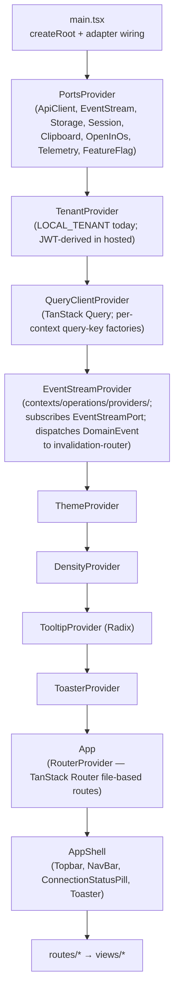
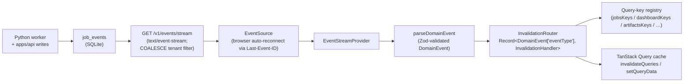

# Runtime Boundaries

Four cooperating local processes make up JobHunter. This page walks each runtime
boundary — what it owns, what it must never do, and how the pieces talk.

### Frontend

The React frontend under `apps/web` owns user interaction:

- dashboard summary
- jobs list and job detail
- artifacts list
- profile/style editor shell
- filtering, sorting, pagination, and drawer state
- UI action buttons

The frontend uses `@jobhunter/api-client` for API transport and
`@jobhunter/contracts` for shared schemas and DTOs. It should not know shell
command syntax.

The frontend follows its own DDD + hexagonal target documented in
[`docs/frontend-target.md`](frontend/index.md) — three-layer state separation,
eight bounded contexts that mirror the backend 1:1, view-vs-context dichotomy,
hexagonal frontend ports, SSE realtime via the invalidation router, and a
projection-typed Operations read-side. The summary below cross-links to the
target sections; the target doc is the canonical detail.

#### Stack

| Concern | Choice | Target ref |
|---|---|---|
| Bundler / dev server | Vite (SPA today; TanStack Start named-not-built for SSR) | §4.1, §9.1 |
| UI library | React 19 | §4.7 |
| Styling | Tailwind CSS 4 with design tokens in `tokens.css`; `darkMode: ["selector", "[data-theme='dark']"]` | §4.8 |
| Component primitives | shadcn/ui (Radix-based, copied + owned in `shared/ui/`) | §4.7 |
| Router | TanStack Router (file-based via `@tanstack/router-vite-plugin`) with route-level Zod search-param schemas | §4.3 |
| Server state | TanStack Query v5 with per-context query-key factories, `tenant`-first keys, central registry in `contexts/operations/queryKeys.ts` | §4.1, §4.4.1 |
| Tables | Shared filterable data grid (`shared/ui/filterable-data-grid.tsx`); column models (`DataGridColumn<T>[]`) live with the consuming view; cell renderers are imported from contexts; `@tanstack/react-table` supplies selection/sorting types only | §3.10, §11 |
| Forms | TanStack Form + Zod `safeParse` | §4.6 |
| Client state | Zustand (`shared/stores/`) — UI prefs, toast queue, command palette, profile-import wizard draft (`persist` middleware where durability matters) | §4.9, §4.10 |
| Test runner | Vitest + React Testing Library + MSW for unit / hook / component | §10.2, §10.3 |
| End-to-end | Playwright against a seeded local API + SQLite fixture | §10.4 |
| Component-driven dev | Storybook with `addon-msw` and `addon-a11y` (critical+serious axe violations fail CI) | §10.5, §10.7 |
| Type-level tests | Vitest `typecheck` mode via `vitest.types.config.ts`; `*.test-d.ts` files live under `apps/web/test/types/`; invoked as `pnpm --filter @jobhunter/web test-d` | §10.6 |

#### Three Layers of State

Every piece of state lives in exactly one layer (`docs/frontend-target.md` §2.1):

| Layer | Owner | What lives here |
|---|---|---|
| Server state | TanStack Query cache | API-derived projections, profile, settings, dashboard summary — anything fetched from `apps/api`. |
| URL state | TanStack Router (typed search params via Zod) | Anything bookmarkable: view, filters, sort, page, page size, selected job, drawer open/close. |
| Client state | Zustand (with `persist` where appropriate) + React context | Theme, density, tenant context, transient UI like toast queue, ephemeral form drafts that do not survive navigation. |

No server data in `useState`; no filter / pagination / sort / drawer state in
`useState`; no durable user preferences in component-local state; one source of
truth per fact; components consume state through hooks (never raw stores or the
`QueryClient` directly).

#### Frontend Bounded Contexts

`apps/web/src/contexts/<name>/` mirrors the backend's eight bounded contexts
1:1 (`docs/frontend-target.md` §3, §11):

| Frontend folder | Owns | Backend mirror |
|---|---|---|
| `discovery/` | `useDeleteJobMutation`, `useDeleteJobsBulkMutation`, `useRestoreJobMutation`, `useRestoreJobsBulkMutation`, `useHideJobsBulkMutation`, `useUnhideJobsBulkMutation`, `usePermanentlyDeleteJobsBulkMutation`; future `useImportJobMutation`. | Job Discovery |
| `enrichment/` | `JobEnriched` / `EnrichmentFailed` invalidation handlers; future `useEnrichmentRetryMutation`. The enrichment aggregate is internal to Discovery's detail queue drain. | Job Enrichment |
| `profile/` | `useProfileQuery`, `useUpdateProfileMutation`, `useImportResumeMutation`, settings + credentials hooks, profile-import wizard store, profile editor + resume preview components. | Candidate Profile |
| `scoring/` | `<ScoreBadge>`, `<ScoreBreakdown>`; future `useCorrectScoreMutation`. | Scoring |
| `materials/` | `useGenerateMaterialsMutation`, `useOpenArtifactMutation`, generate / open buttons. | Materials Generation |
| `apply/` | `useApplyJobMutation`, `useDryRunApplyMutation`, `useCancelApplyMutation`, `<ApplyButton>`, `<DryRunButton>`, `<ApplyRunBadge>`, `<ApplyRunTimeline>`, `<ApplyHistory>`. | Apply Automation |
| `pipeline/` | `useRunPipelineStagesMutation`, `useRetryStageMutation`, `useCancelStageMutation`, `useMarkAppliedMutation`, `useMarkSkippedMutation`, `<StageTriggerPanel>`, `<StageBadge>`, `<StageTimeline>`, `<JobActions>`. | Pipeline Orchestration |
| `operations/` | All projection-typed read hooks (`useDashboardSummaryQuery`, `useJobsListQuery`, `useJobDetailQuery`, `useArtifactsListQuery`, `useArtifactDetailQuery`, `useApplyRunsListQuery`, `useApplyRunQuery`); query-key registry; SSE subscription; invalidation router. | Operations / Read-Side |

The eight view folders (`views/dashboard/`, `views/jobs/`, `views/artifacts/`,
`views/apply-review/`, `views/pipelines/`, `views/runs/`, `views/discovery/`,
and `views/debug/`) are **composers, not contexts**
(`docs/frontend-target.md` §3.10). They import hooks from
`contexts/operations/` and components / mutations from aggregate contexts;
they own layout and view-local ephemeral UI (e.g., bulk-selection sets) and
nothing else. View → context dependency is one-way; views never depend on
other views.

#### Hexagonal Frontend Ports

Components and feature hooks depend only on **ports**; concrete adapters bind
to the ports in `shared/providers/PortsProvider.tsx`
(`docs/frontend-target.md` §6):

| Port | Local-mode adapter | Hosted-mode adapter (named, not built) |
|---|---|---|
| `ApiClientPort` | `FetchApiClientAdapter` (wraps `@jobhunter/api-client`) | Same adapter; baseUrl from env, `Authorization: Bearer <jwt>` injected by hosted `AuthInterceptor`. |
| `EventStreamPort` | `SseEventStreamAdapter` (`new EventSource(...)`) | `WebSocketEventStreamAdapter` if SSE proves limiting. |
| `StoragePort` | `LocalStorageAdapter` | `IndexedDbAdapter` when client-side cache exceeds 5 MB. |
| `SessionPort` | `LocalSessionAdapter` (returns `LOCAL_TENANT`) | `JwtSessionAdapter` (Auth0 / Cognito). |
| `ClipboardPort` | `NavigatorClipboardAdapter` | Same adapter. |
| `OpenInOsPort` | `OpenArtifactAdapter` (POSTs to `/v1/artifacts/:id/open`) | Disabled in hosted mode; UI surfaces a presigned-URL download instead. |
| `TelemetryPort` | `ConsoleTelemetryAdapter` (no-op) | `OpenTelemetryWebAdapter` → OTLP collector. |
| `FeatureFlagPort` | `StaticFeatureFlagAdapter` (always default) | Backend-served via `apiClient.featureFlags()`; cached in Query. |

The "frontend driving ports" (use cases) are the per-context hooks themselves
(`useApplyJobMutation`, `useDeleteJobMutation`, …) — React conventions are the
de-facto driving-port representation; no `UseCase` interface is formalised
(`docs/frontend-target.md` §6.7).

#### Provider Stack

The provider stack as wired in `apps/web/src/main.tsx` (top-down):

`EventStreamProvider` lives in `contexts/operations/providers/` because the
Operations context owns the SSE subscription and the invalidation-router
dispatch (`docs/frontend-target.md` §3.9, §7.3); every other provider lives
in `shared/providers/`.

#### Realtime — SSE → Invalidation Router → Cache

The invalidation router is **the** integration contract between the backend's
`DomainEvent` taxonomy and the frontend cache — a pure function tested in
isolation. Every backend event has a handler; the
`Record<DomainEvent["eventType"], InvalidationHandler>` typing makes a missing
handler a TypeScript compile error, and the
`every-event-has-handler.test.ts` parity test catches obvious empty-stub
implementations (`docs/frontend-target.md` §7.4).

#### Test Pyramid

`docs/frontend-target.md` §10. Vitest + React Testing Library + MSW for unit /
hook / component tests; Playwright for end-to-end critical flows; Storybook
with the a11y addon for component-driven development. Two parity tests guard
the cross-language seams:

- `every-event-has-handler.test.ts` — every `DomainEvent["eventType"]` has a
  registered invalidation handler.
- `every-stage-state-has-badge.test.tsx` — every `STAGE_STATE_KINDS` value
  has a `<StageBadge>` arm.

Detailed coverage and the a11y bar live in
[`docs/local-reliability-qa.md`](../local-reliability-qa.md).

### TypeScript Product API

The local TypeScript API under `apps/api` owns typed JSON read models and
local product endpoints. It is intentionally bound to loopback by default
because it exposes local job, profile, and artifact metadata.

Current responsibilities:

- health endpoint
- dashboard summary endpoint
- jobs list/detail endpoints
- artifacts list/detail endpoints
- artifact open endpoint with known-path validation
- profile/settings read and write endpoints
- resume PDF import draft endpoint (via JSON-RPC `profile_import`, which starts
  `ProfileImportWorkflow`)
- structured job action endpoints for retry, material generation, dry-run apply,
  cancel, mark-applied, mark-skipped
- current-policy preparation maintenance endpoints for per-job/bulk rescore and
  per-job/bulk re-tailor
- global/batch pipeline stage actions via `POST /v1/pipeline/actions/run-stage`
- pagination, filtering, and global sorting
- read-model projection refresh on every request

Simple state-transition writes (`resetJobStage`, `retryFailedJobs`,
`markJobApplied`, `markJobSkipped`, `cancelJobAction`, `correctScore`,
soft delete/restore, hide/unhide, permanent delete, and settings writes)
execute inline in the TS process against shared `@jobhunter/domain-types`
value objects; the full cancel action additionally fires `cancel_run` over
JSON-RPC to signal the Temporal workflow. Complex commands travel through
`SubprocessJsonRpcAdapter` to the long-lived `jobhunter rpc` worker. The
JSON-RPC surface is eleven methods: nine workflow-mode methods whose handlers
return a workflow spec that the RPC server starts on Temporal (`run_stage`,
`rescore_job`, `rescore_jobs_not_on_current_scoring_policy`, `tailor_job`,
`retailor_job`, `retailor_current_policy`, `refresh_compensation`, `apply`,
`profile_import`), plus the synchronous `analyze_job` (inline three-SDK
employer analysis) and `cancel_run` (cooperative Temporal cancellation). The
per-job maintenance methods `rescore_job`, `tailor_job`, and `retailor_job`
start `JobPreparationWorkflow` runs directly. Workflow-mode dispatch returns
`{runId, workflowId, firstExecutionRunId}`; callers can pass `awaitResult`
to block on the workflow result (profile import uses this).

Worker-backed action routes are gated by worker readiness: `GET /v1/health`
reports the worker heartbeat (`healthy` / `missing` / `stale` after 45 s /
`mismatched` app dir or database) plus LLM spend health (`ok` /
`over_budget` against the configured `dailyBudgetUsd`), and mutation routes
return `503 worker_runtime_unavailable` until a healthy heartbeat exists.
Request hardening beyond the loopback bind: a Host-header allowlist rejects
non-loopback hosts with `403 forbidden_host` (DNS-rebinding defense), and
mutating requests with a non-loopback `Origin`/`Referer` are rejected with
`403 cross_site_request`.

### Python Automation Engine

Python owns automation execution:

- discovery
- job detail enrichment
- Discovery preparation workflow fan-out
- scoring
- resume tailoring
- cover letters
- PDF generation
- profile import from resume PDF
- compensation refresh
- apply automation

The worker package lives under `workers/automation`. Each bounded context owns
its aggregate, repository (in `infrastructure/<context>/`), and ports (in
`domain/ports/`). The CLI is the human-facing driving adapter; the JSON-RPC
server (`jobhunter rpc`) is the API-facing driving adapter.

### Workflow Orchestration (Local Temporal)

A local Temporal dev server (`temporal server start-dev --db-filename
"$JOBHUNTER_TEMPORAL_DB"`) is the workflow engine for the Python worker. The dev
launcher defaults `JOBHUNTER_TEMPORAL_DB` to `.dev/temporal/temporal.db` so
workflow execution history persists across local restarts. The infrastructure
split lives under `workers/automation/src/jobhunter/infrastructure/temporal/`:

- `client.py` — `get_temporal_client()` connects to `TEMPORAL_ADDRESS`
  (default `localhost:7233`) and `TEMPORAL_NAMESPACE` (default `default`).
- `worker.py` — `build_worker(client, *, workflows, activities)` returns a
  `temporalio.worker.Worker` bound to `JOBHUNTER_TASK_QUEUE`. The worker
  uses a `SandboxedWorkflowRunner` with `with_passthrough_modules("jobhunter")`
  so workflow code can construct activity-input dataclasses at the workflow
  boundary (the sandbox proxy mechanism otherwise refuses to instantiate
  frozen dataclasses imported through `imports_passed_through()`). Activity
  execution is bounded by `JOBHUNTER_MAX_CONCURRENT_ACTIVITIES` (default `4`)
  and a worker-owned `ThreadPoolExecutor(max_workers = concurrency + 2)`, so
  blocking stage work no longer spills into the process default executor.
- `run_in_activity.py` — shared helper for running synchronous domain work from
  async Temporal activities while heartbeating. Cancellation sets a cooperative
  `threading.Event`, waits up to the activity's cancel deadline for the worker
  thread to exit, and records an `abandoned_thread` operational metric if the
  thread ignores cancellation.
- `task_queues.py` — single `JOBHUNTER_TASK_QUEUE = "jobhunter-default"`.
- `registry.py` — single source of truth for `WORKFLOWS` and `ACTIVITIES`.
  The CLI imports both lists and passes them to `build_worker`; new
  workflows / activities are added by appending here.

The user-facing `discover` stage starts `DiscoverWorkflow` directly. That
workflow plans source families, runs one source-family activity per planned
family, drains detail enrichment in one activity, then fans out per-job
`JobPreparationWorkflow` runs as independent **root** workflows (batches of 25,
`USE_EXISTING`) — deliberately not children, so finishing discovery cannot
terminate in-flight preparation. Other internal preparation stages (`enrich`,
`score`, `tailor`, `cover`) still ship as Temporal **Activities** under the
owning bounded context's package — e.g. `jobhunter/scoring/activities.py`,
`jobhunter/materials/activities.py`. Activities are thin adapters: they defer
heavy imports inside the activity body and forward to the relevant domain
function. The product-facing stage order is narrower: `discover -> apply`.

Pipeline activities translate Python exceptions into typed Temporal
`ApplicationError`s via `domain/errors.py`. Retry policies use the `type` value
as the durable error code:

| Error type | Code | Retryable |
| --- | --- | --- |
| `ConfigurationError` | `configuration` | no |
| `AuthenticationError` | `authentication` | no |
| `MissingInputError` | `missing_input` | no |
| `TransientNetworkError` | `transient_network` | yes |
| `BrowserTransientError` | `browser_transient` | yes |
| `LlmTransientError` | `llm_transient` | yes |
| `SourceUnavailableError` | `source_unavailable` | yes |
| `BudgetExceededError` | `budget_exceeded` | no |

Workflow and activity retry policies are stage-specific:

| Unit | Attempts | Initial interval | Maximum interval | Non-retryable codes |
| --- | --- | --- | --- | --- |
| `DiscoverWorkflow` source-family activities | 3 | 5s | 60s | `configuration`, `authentication`, `missing_input`, `budget_exceeded` |
| `DiscoverWorkflow` enrichment activity | 3 | 5s | 60s | `configuration`, `authentication`, `missing_input`, `budget_exceeded` |
| `enrich` | 3 | 5s | 60s | `configuration`, `authentication`, `missing_input`, `budget_exceeded` |
| `score` | 3 | 5s | 60s | `configuration`, `authentication`, `missing_input`, `budget_exceeded` |
| `tailor` | 3 | 10s | 120s | `configuration`, `authentication`, `missing_input`, `budget_exceeded` |
| `cover` | 3 | 10s | 120s | `configuration`, `authentication`, `missing_input`, `budget_exceeded` |
| `ApplyWorkflow` | 1 live / 2 dry-run | 1s | 60s | _none set_ — apply safety comes from the at-most-once claim and submit-intent parking, not error-type filtering |
| `ProfileImportWorkflow` | 2 | 5s | 60s | `configuration`, `authentication`, `missing_input`, `budget_exceeded` |
| `CompensationRefreshWorkflow` | 2 | 5s | 60s | `configuration`, `authentication`, `missing_input`, `budget_exceeded` |

`JobPreparationWorkflow` reuses the `score`, `tailor`, and `cover` policies
above for its per-job steps; its `pdf` step uses the cover policy (3 attempts,
10s → 120s). The `check_spend_budget` preflight activity runs with a single
attempt so a budget stop is immediate.

The runner still records `StageStarted`, `StageCompleted`, `StageFailed`,
operational metrics, and OTel spans through `_run_stage_observed`; the change
is that whole-stage failures propagate into Temporal instead of being converted
to normal `{"status": "error: ..."}` results. Per-item failures inside a batch
remain per-item facts when the owning context already records them that way.

Production workflows live alongside the activities:

- `JobPipelineWorkflow` (`jobhunter/pipeline/workflow.py`) — drives the
  configured stage list serially in **batch mode** against eligible jobs in
  the local DB. Stage eligibility is owned by the underlying runner via
  `state.set_stage_state`, not by the workflow. Passing `"discover"` delegates
  to child `DiscoverWorkflow`; passing `"apply"` delegates to child
  `ApplyWorkflow`.
- `DiscoverWorkflow` (`jobhunter/discovery/workflow.py`) — deterministic
  tenant workflow with id `discover-{tenantId}`. It plans JobSpy, canonical ATS,
  Workday, and Smart Extract source-family activities, preserves the legacy
  source ordering for limit/budget semantics, emits real activity heartbeats
  from `DiscoveryRunProgress`, then runs discovery enrichment and starts
  preparation root workflows in batches of 25. Source-family failures are attributed
  to concrete source ids for source-quality quarantine and fail the workflow
  after the remaining planned source families complete.
- `ApplyWorkflow` (`jobhunter/apply/workflow.py`) — single-activity,
  **per-job** workflow with live retry capped at one attempt and dry-run retry
  capped at two attempts. `apply_activity` re-raises transient failures so the
  retry policy fires; `LookupError` is wrapped in a non-retryable
  `ApplicationError` so operator errors fail fast. Continuous apply runs are
  bounded to batches of 25 and continue-as-new rather than growing one workflow
  forever.
- `JobPreparationWorkflow` (`jobhunter/preparation/workflow.py`) — durable
  **per-job** workflow that runs the requested subset of `score`, `tailor`,
  `cover`, and `pdf` in canonical order. Each step is an idempotent activity;
  already-complete steps return `already_done`, and Temporal resumes at the
  failed step after a worker interruption.
- `ProfileImportWorkflow` (`jobhunter/profile/workflow.py`) — starts profile
  PDF import through the same workflow visibility/finalize path as other heavy
  work, then calls the existing profile-import activity.
- `CompensationRefreshWorkflow`
  (`jobhunter/infrastructure/compensation/workflow.py`) — wraps the extracted
  compensation refresh core so posted facts and market estimates no longer run
  inside the JSON-RPC request thread.

The pipeline package (`jobhunter/pipeline/`) is split into `runner.py`
(stage-core functions and `_run_stage_observed`) and `workflow.py` (the
Temporal batch orchestrator). The deleted in-process `run_pipeline` engine is
not re-exported; every CLI, API, and local-action entry point starts a workflow.

All workflows that can spend LLM tokens run `check_spend_budget` before their
heavy activity. Usage is recorded in `llm_spend` from existing LLM usage capture
points, `dailyBudgetUsd` defaults to `25`, and `0` means unlimited. When the
current day is at or above the configured budget, the preflight raises
non-retryable `budget_exceeded`; finalize still records the workflow outcome.

`jobhunter worker` is the long-lived process that runs the worker loop. At
startup it reconciles the local discovery Temporal Schedule:
`scheduling_enabled=false` deletes any existing `jobhunter-discovery-local`
schedule, while `scheduling_enabled=true` creates or updates a cron schedule
with `ScheduleOverlapPolicy.SKIP` that starts `DiscoverWorkflow`. The default is
off, so fresh installs do not run background discovery.
Live workflow state — running workflows, history, signals, retries — is
visible at `http://127.0.0.1:8233` in the Temporal Web UI.

#### Loop Closure — Visibility, Finalize, Reconciler

Workflow execution is made durable and visible in the read-model without a
TypeScript Temporal SDK and without trigger-coupled reapers:

- **`Workflow*` event family (6 types)** — `WorkflowStarted`,
  `WorkflowCompleted`, `WorkflowFailed`, `WorkflowCanceled`,
  `WorkflowTimedOut`, `WorkflowTerminated` — mirrored 1:1 across the Python and
  TS event registries and the web invalidation router. Each carries
  `workflowId`, `workflowType`, an input summary, and a terminal status within
  the 12-state `WORKFLOW_RUN_STATUSES` contract.
- **Finalize activities** (`infrastructure/temporal/finalize.py`) —
  each workflow emits a `WorkflowStarted` marker at the top of `run` and records
  exactly one terminal event on exit
  (`WorkflowCompleted` on success, `WorkflowFailed` on a stage/exception
  failure, `WorkflowCanceled` on cooperative cancellation) via
  `record_workflow_started` / `record_workflow_outcome`. Those
  activities reuse `record_job_event` + a projection refresh; workflow bodies
  stay deterministic (all SQLite/clock IO is inside the activities).
- **Describe-based reconciler** — `_reconcile_workflow_runs` runs in the worker
  heartbeat loop (15s). It `describe`s each open `workflow_run_projections` row
  and terminalizes CLOSED executions (mapped to the matching terminal event) or
  NOT_FOUND executions (dev-server history loss → `WorkflowTerminated`), leaving
  RUNNING rows alone. This is what makes a `kill -9`'d, timed-out, or cancelled
  worker's runs terminalize on their own — replacing the trigger-coupled
  reapers. A backstop-closed run carries no app-level error detail, so the
  reconciler stamps its own reason — a `reconciled_*` `errorCode`
  (`reconciled_terminated` / `reconciled_not_found` / `reconciled_closed_<status>`)
  plus a human-readable message quoting the Temporal execution status — so the
  `/runs` UI never shows a reconciler-terminalized run with no explanation.
- **Dispatch-time open row** — the default starter writes a `WorkflowStarted`
  event immediately after a workflow start returns from Temporal. The in-workflow
  start marker remains as a duplicate-safe upsert, but a workflow killed or
  canceled before its first activity is now visible in `/runs` and can be
  terminalized by the reconciler.
- **Deterministic workflow IDs** — `WorkflowStartSpec` carries
  `id_conflict_policy` / `id_reuse_policy`; the default starter passes
  `USE_EXISTING` + `ALLOW_DUPLICATE`, so a double-start of a deterministic id
  returns the running handle instead of duplicating execution. `discover`
  derives `discover-{tenantId}`, `apply` derives a stable
  `apply-{tenantId}-{jobKey}` id for single-job applies, and the pipeline
  orchestrator keeps `run-{uuid}`.

The read side is `workflow_run_projections` (Python-sole-writer, folded from the
`Workflow*` events under the shared `operations_projections` watermark, mirrored
read-only in `apps/api/src/projections.ts`) — the unified list source for all
workflow types. See `docs/local-ts-api.md` for the `GET /v1/workflow-runs` and
`GET /v1/workflow-runs/:runId` read model.
