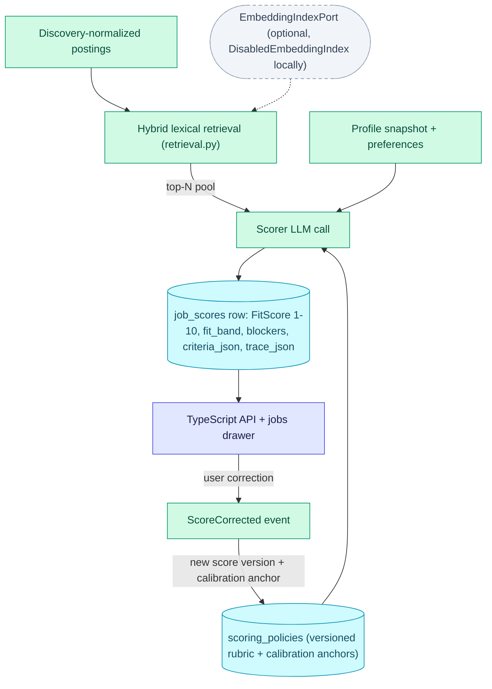

# Scoring

How a discovered job becomes a defensible fit score: profile retrieval feeds a
deterministic, versioned scoring policy over structured evidence. Execution-level
detail lives in the [Stage Walkthrough](pipeline/stages.md); the domain model is in
[Tactical Design](domain-model/tactical.md).

**Read this if** you need to know how the fit score is produced, what it is based
on, and what it must not be used for.

Retrieval narrows the candidate pool before any LLM call; a user correction feeds
back as a new score version and a calibration anchor on the scoring policy.

## Retrieval Before Scoring

The Scoring context owns a local hybrid retrieval service under
`workers/automation/src/jobctl/domain/scoring/retrieval.py`. It builds an
in-memory lexical index over normalized posting fields already produced by
Discovery, including Discovery's internal detail-enrichment queue drain, then
ranks candidate jobs before the scorer spends LLM calls. When
`jobctl run score --limit N` or equivalent pipeline calls cap scoring, the
runner fetches a broader pending/enriched pool and lets hybrid retrieval choose
the top N.

Semantic search is optional. The `EmbeddingIndexPort` in
`workers/automation/src/jobctl/domain/ports/retrieval.py` is the adapter seam
for a hosted or local embedding index; local mode defaults to
`DisabledEmbeddingIndex`, so lexical retrieval and scoring continue to work
without any external embedding service.

## Scoring Fit Assessment

The Scoring context keeps `FitScore` as a 1..10 applicant-side triage signal,
but each persisted `job_scores` row also stores the criteria snapshot and trace
used to produce it. `criteria_json` records the saved score criteria, target
criteria, minimum score, and structured profile preference fields used for the
prompt. `trace_json` records non-sensitive audit metadata: prompt/schema
versions, model name, criteria version, profile snapshot version, parser
warnings, and correction history.

The score breakdown separates soft fit from hard eligibility. `fit_band`,
`confidence`, matched/missing/transferable signals, warnings, and hard blockers
are exposed through the TypeScript API and jobs drawer. User corrections create a new
score version, preserve the correction rationale, publish `ScoreCorrected`, and
can be read back as transparent feedback signals alongside existing job actions.
They also create a non-sensitive correction signal that is persisted as a
calibration anchor on the next `scoring_policies` version. The current policy
keeps rubric weights and fit-band thresholds stable; subsequent scores load the
latest policy version and include the active anchor IDs in `trace_json`.

::: warning Applicant-side triage only — not an employer hiring system
This is not an employer-side candidate selection system. If JobCtl is ever
used to rank people for hiring decisions, the architecture needs a separate
governance layer for validation, bias audits, notices, adverse-impact review,
and human-review procedures before production use.
:::
