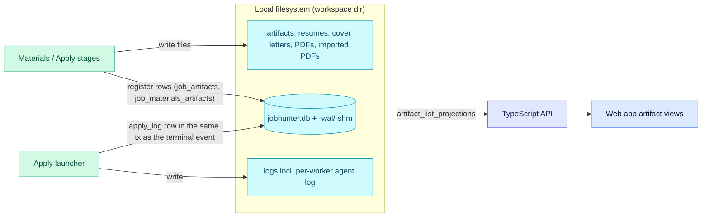

# Storage

Everything durable lives on the user's machine: one SQLite database plus
generated files under the local workspace directory.

**Read this if** you need to know which table or file owns a piece of data, or
where generated artifacts land on disk.

## Schema At A Glance

The job pipeline core — one row in `jobs` (keyed by posting URL) accumulates
per-stage state, events, evidence, generations, and feedback:

```mermaid
erDiagram
    jobs {
        text url PK
        text title
        text company
        text salary
        text location
        text site
        text discovered_at
    }
    jobs ||--o{ job_stage_states : "per-stage durable state"
    jobs ||--o{ job_events : "append-only event log"
    jobs ||--o| job_enrichments : "detail enrichment"
    jobs ||--o{ job_source_observations : "provenance"
    jobs ||--o| job_canonical_identities : "content identity"
    jobs ||--o{ job_duplicate_links : "dedup evidence"
    jobs ||--o{ job_scores : "versioned scores"
    scoring_policies ||--o{ job_scores : "policy version"
    jobs ||--o{ job_requirement_fit_reports : "requirement ledger"
    job_requirement_fit_reports ||--o{ job_requirement_fit_items : "per-requirement fit"
    jobs ||--o{ job_employer_analysis : "canonical analysis"
    job_employer_analysis ||--o{ job_employer_analysis_sub_analyses : "ensemble parts"
    jobs ||--o{ job_materials : "tailoring generations"
    job_materials ||--o{ job_materials_artifacts : "generated files"
    job_materials ||--o{ job_bullet_provenance : "per-bullet provenance"
    job_materials ||--o{ job_material_layout_boxes : "render layout"
    jobs ||--o{ job_artifacts : "registered artifacts"
    jobs ||--o{ application_review_decisions : "apply approvals"
    jobs ||--o{ application_outcomes : "reviewed outcomes"
    jobs ||--o{ application_email_evidence : "linked Gmail evidence"
    application_email_evidence ||--o{ application_outcome_suggestions : "classifier suggestions"
```

One `jobs` row (keyed by posting URL) is the hub: per-stage state, events,
scores, analysis, tailoring generations, artifacts, and apply records all hang
off it.

The remaining tables group by owner:

| Owner | Tables |
| --- | --- |
| Candidate Profile | `candidate_profiles` plus 12 `candidate_profile_*` child tables (experience, bullets, skills, education, achievement evidence, required-content sets, resume constraint metrics) |
| Resume templates | `resume_templates`, `resume_template_versions`, `resume_template_defaults`, `resume_template_refresh_attempts`, `job_resume_template_assignments` |
| Compensation | `job_posted_compensation_facts`, `job_market_compensation_estimates` |
| Read-model projections | `job_list_projections`, `job_detail_projections`, `dashboard_projections`, `apply_run_projections`, `artifact_list_projections`, `event_watermarks`, `digest_state` |
| Discovery & preparation | `discovery_runs`, `discovery_settings`, `discovery_feedback`, `discovery_quarantine_entries`, `preparation_work_items`, `manual_capture_queue`, `posting_snapshot_sets`, `source_registry_entries`, `source_locator_candidates` |
| Policies & operations | `tailoring_policies`, `llm_spend`, `job_score_staleness`, `jobhunter_deleted_jobs` |

SQLite in `~/.jobhunter/jobhunter.db` is the local source of truth for jobs,
stage states, events, artifacts, normalized Candidate Profile data, profile
rendering settings/template text, run visibility, apply-review decisions,
application outcomes, linked email evidence, and outcome suggestions. The
projection tables (above) are also stored here. Dashboard settings remain
file-backed until their own storage migration.
Posted compensation facts live in the canonical
`job_posted_compensation_facts` table. The parser consumes only bounded salary
source text such as `jobs.salary`, records explicit parse states and warnings,
and keeps `jobs.salary` unchanged as a compatibility/raw fallback. It does not
store full descriptions, provider raw payloads, credentials, local paths, or
licensed-source salary data.
Market compensation estimates live in the canonical
`job_market_compensation_estimates` table. The estimator consumes deterministic
local compensation observations keyed by company, role, location, and trimodal
company tier, including imported reported-compensation observations and
employer-posted salary facts captured by JobHunter. It records explicit non-range
states only when required inputs or usable sources are missing. When sparse real
evidence exists, it emits the best available estimate by falling back from exact
company-role evidence to same-location role evidence, same-company adjacent
roles, trimodal company-tier evidence, and finally a broad market baseline. Each
estimated range also stores confidence interval bounds that widen as the fallback
tier weakens, sample support drops, locations mismatch, or source agreement gets
weaker. Estimates persist sanitized selected evidence rows for the observations
that drove the range, including row-level company, role, location, level,
component, EUR/year range, sample count, release year, safe source URL when
available, and match scores.
Employer-posted salary observations can emit low-confidence ranges with
low-sample warnings. High-value posted base-salary text with an omitted period
can be treated as annual evidence for market estimation, but bonus-only and
one-sided rows are rejected. The `jobhunter compensation-refresh` command
reparses existing posted salary text, imports explicit local
observations, configured licensed Levels.fyi and Glassdoor feeds, and public
Euro Top Tech observations additively, writes estimates for existing jobs, and
refreshes projections without running the job pipeline. It
does not alter raw `jobs.salary`, scoring, ranking, filtering, apply readiness,
or apply dispatch behavior.
Operations projections materialize compensation read data from those canonical
tables into `job_list_projections.compensation_summary_json`,
`job_detail_projections.compensation_summary_json`, and
`job_detail_projections.compensation_audit_json`. Both Python and TypeScript
projection builders own the same JSON shape. The list/detail API deserializes
those projection columns only; it does not parse raw salary text on read.
`JobSummary.salary` remains the compatibility raw string.

## Files And Registration Flow

A file and its database registration are written together; the read model serves
the `job_artifacts` / `job_materials_artifacts` rows, never the raw files.

Generated resumes, cover letters, PDFs, logs, and imported PDFs stay on the
local filesystem. They are registered in `job_artifacts` and
`job_materials_artifacts` and surfaced via `artifact_list_projections`. Profile
data and rendering settings live in SQLite after explicit profile saves or
resume imports. Resume templates are Profile-owned style/layout configuration
with versioned rows and default selection, while per-job template overrides and
render-only refresh attempts are Materials-owned because they affect generated
artifact generations. Template edits use profile data only for preview styling;
they do not persist candidate facts into template payloads.
The apply launcher records each per-worker agent log
(`LOG_DIR/worker-{worker_id}.log`, written by `ClaudeCodeCliAdapter`) as a
`job_artifacts` row of kind `apply_log` in the same transaction as the
terminal `ApplicationSubmitted` / `ApplicationFailed` / `DryRunCompleted`
event.
Every run also persists the agent's raw output as `apply_agent_output`, and
successful live results persist confirmation evidence as `apply_confirmation`.
Verification confidence is derived from the evidence: `1.0` only when a
structured applied result and confirmation evidence are present, `0.6` for the
structured result alone, and `0.2` for inferred/unstructured outcomes.

Dry-run Chrome launches install a CDP guard in addition to the prompt
instruction. The guard attaches to page targets, blocks non-local
POST/PUT/PATCH requests with `Fetch.failRequest`, and injects a form-submit
interceptor that marks `window.__jobhunter_dryrun_blocked` when a hostile page
tries to submit.
