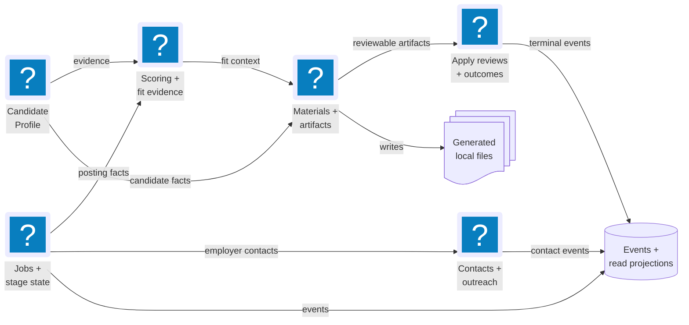
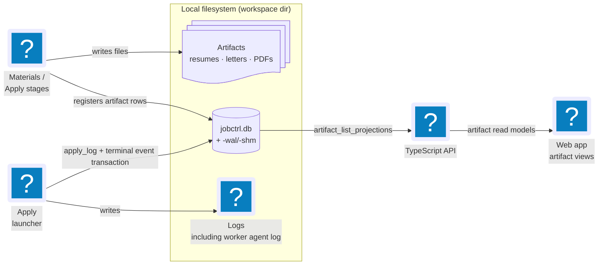

# Storage

Everything durable lives on the user's machine in local SQLite stores and
files under the workspace directory.

**Read this if** you need to know which table or file owns a piece of data, or
where generated artifacts land on disk.

## Local Authority Inventory

Unless overridden by `JOBCTRL_DIR`, the local authority root is
`~/.jobctrl/`:

| Path | Authority |
| --- | --- |
| `jobctrl.db` plus WAL/SHM | Canonical profile, jobs, discovery settings, events, projections, materials metadata, reviews, contacts, outcomes, and workflow rows. |
| `temporal.db` plus WAL/SHM | Bundled Temporal history; native lifecycle treats it and `jobctrl.db` as one restore pair. |
| `config.json` | Non-secret Settings values including spend/capacity, scoring guidance, provider metadata, provider-scoped model IDs, AI execution policy, compensation source policy, and explicitly adopted browser metadata. Transient detected-browser candidates are not persisted. |
| `.env`, `gmail/` | Plaintext environment credentials and Gmail OAuth client/token state. |
| `codex_home/` | Stable JobCtrl-owned Codex state; auth is outside the prompt-readable `workspace/` subtree. |
| `claude_home/`, `provider-packs/`, `provider-runtime/` | Isolated and separately acquired provider runtime state. |
| `tailored_resumes/`, `cover_letters/`, `logs/` | Generated material and logs registered by SQLite metadata where applicable. |
| `browser-profiles/`, `extension-capability-token`, `chrome-workers/`, `apply-workers/` | Consented copied profiles, extension pairing, and browser/apply execution state. Browser-adoption metadata is in `config.json`. |
| `backups/` and legacy `resume.*` / style files | User-created database snapshots and pre-migration resume inputs. |

Developer supervisors additionally use checkout-local `.dev/` process, log,
and Temporal files; those are not installed-user authorities but remain
sensitive.

## Schema At A Glance

The database is easier to understand as a set of ownership families. The
diagram shows the main relationships; the table below names the exact tables.

Within the job-owned families, one `jobs` row keyed by `(tenant_id, job_id)` is
the hub: stage state, events, scores, analysis, materials, and Apply records
hang off the stable tenant-scoped `JobId`. A posting URL is an external locator
with a tenant-scoped uniqueness constraint, not an internal primary or foreign
key. Employer and Source observations are stored as independent facts.

The remaining tables group by owner:

| Owner | Tables |
| --- | --- |
| Candidate Profile | `candidate_profiles` plus 12 `candidate_profile_*` child tables (experience, bullets, skills, education, achievement evidence, required-content sets, resume constraint metrics) |
| Resume templates | `resume_templates`, `resume_template_versions`, `resume_template_defaults`, `resume_template_refresh_attempts`, `job_resume_template_assignments` |
| Compensation | `job_posted_compensation_facts`, `job_market_compensation_estimates` |
| Scoring | `job_scores`, versioned/indexed `job_score_keywords`, `scoring_policies`, `job_score_staleness` |
| Read-model projections | `job_list_projections`, `job_detail_projections`, `dashboard_projections`, `apply_run_projections`, `workflow_run_projections`, `pipeline_step_projections`, `artifact_list_projections`, `event_watermarks`, `digest_state` |
| Discovery & preparation | `discovery_runs`, `discovery_execution_jobs`, `discovery_search_units`, `discovery_search_unit_jobs`, `discovery_search_unit_filtered_events`, `discovery_settings`, `discovery_feedback`, `discovery_quarantine_entries`, `job_canonical_identities`, `job_source_observations`, `job_duplicate_links`, legacy `preparation_work_items`, `manual_capture_queue`, `posting_snapshot_sets`, `source_registry_entries`, `source_locator_candidates` |
| Apply review, repeat protection, and outcomes | `application_review_decisions`, `application_repeat_overrides`, `application_repeat_override_consumptions`, `application_repeat_audit`, `application_outcomes`, `application_email_evidence`, `application_outcome_suggestions` |
| Explicit-feedback learning | `tailoring_feedback_signals`, `tailoring_feedback_signal_reviews`, `tailoring_feedback_signal_contradictions`, `learning_recommendations`, `learning_recommendation_evidence`, `learning_recommendation_evidence_jobs`, `learning_recommendation_jobs`, `learning_recommendation_reviews`, `learning_recommendation_tombstones` |
| Policies & operations | `tailoring_policies`, `llm_spend`, `worker_runtime_heartbeats`, `jobctrl_deleted_jobs` |

SQLite in `~/.jobctrl/jobctrl.db` is the local source of truth for jobs,
stage states, events, artifacts, normalized Candidate Profile data, profile
rendering settings/template text, run visibility, apply-review decisions,
application outcomes, linked email evidence, and outcome suggestions. The
projection tables (above) are also stored here. Discovery-page controls remain
SQLite-backed. `config.json` owns non-secret Settings values: the daily
budget, capacity controls, scoring guidance, provider configuration, AI execution policy,
preferred model IDs, and Levels.fyi/Glassdoor enablement, access-basis, and
licensed-feed coverage policy. Public Levels.fyi Markdown needs no credential.
Credentials, feed paths/URLs, feed contents, and provider payloads do not belong
in the settings file.

### Exact v7 identity cutover

Schema v7 is an exact runtime contract. The native lifecycle upgrades an
admitted v6 installation only while the application is stopped: it quiesces
the local runtime, creates a paired backup of `jobctrl.db` and Temporal state,
builds an isolated candidate, and runs the v6-to-v7 rewrite in one SQLite
transaction. URL-rooted job rows and foreign references are mapped to stable
tenant-scoped JobIds; immutable historical events are upcast only as part of
that migration.

Activation happens only after schema, row/reference, projection, and paired
state verification succeeds. The verified candidate replaces the live pair
atomically. Any failed build, verification, or activation restores the paired
backup and leaves the previous version runnable. There is no mixed-version
runtime, rolling deployment, dual-write path, or permanent compatibility
layer: the TypeScript API and Python worker accept exact v7 and reject direct
v6 operation. Runtime projections read registered persisted artifacts only and
do not reconstruct legacy URL-shaped fallback rows.

### Repeat-application authority retained in v7

Historical application facts remain owned by the existing job events, reviewed
outcomes, and compatible applied status. The three repeat-decision/audit tables
introduced in schema v6 are retained in v7 without reinterpreting those facts:

- `application_repeat_overrides` stores the target, selected prior job,
  relationship, immutable evidence snapshot and SHA-256 fingerprint, reason,
  actor, and confirmation time.
- `application_repeat_override_consumptions` binds one override to one apply run
  and consumption time. Primary and unique constraints prevent reuse by either
  override or run during concurrent claims.
- `application_repeat_audit` stores idempotent warning/block assessments plus
  override-recorded and override-consumed actions with the bounded evidence
  snapshot that justified each decision.

The evaluator reads canonical job/source identity and accepted
`job_duplicate_links`, then joins only confirmed application facts. Pending
suggestions, notes, dry runs, failed attempts, and intent checkpoints are not
promoted into history. The v6-to-v7 migration copies these exact application
facts into the JobId-keyed schema and verifies their references before
activation.

For a live run, the Python launcher opens `BEGIN IMMEDIATE`, recomputes the
current evidence, performs the existing active-run and approval checks, and
consumes a matching one-attempt override before transitioning Apply to running.
The consumption and stage claim commit together. A stale approval does not
consume the override; a competing claim cannot consume it twice. The later
submit-intent and `needs_verification` checkpoints retain their existing
ownership and semantics.
The `digest_state` projection table stores the local daily digest review
watermark; passive Dashboard and CLI reads do not update it, and only explicit
acknowledge actions advance it.
Posted compensation facts live in the canonical
`job_posted_compensation_facts` table. The parser consumes only bounded salary
source text such as `jobs.salary`, records explicit parse states and warnings,
and keeps `jobs.salary` unchanged as a compatibility/raw fallback. It does not
store full descriptions, provider raw payloads, credentials, local paths, or
licensed-source salary data.
Market compensation estimates live in the canonical
`job_market_compensation_estimates` table. The estimator consumes deterministic
local compensation observations keyed by company, role, location, and trimodal
company tier, including imported reported-compensation observations and
employer-posted salary facts captured by JobCtrl. It records explicit non-range
states only when required inputs or usable sources are missing. When sparse real
evidence exists, it emits the best available estimate by falling back from exact
company-role evidence to same-location role evidence, same-company adjacent
roles, trimodal company-tier evidence, and finally a broad market baseline. Each
estimated range also stores confidence interval bounds that widen as the fallback
tier weakens, sample support drops, locations mismatch, or source agreement gets
weaker. Estimates persist sanitized selected evidence rows for the observations
that drove the range, including row-level company, role, location, level,
component, EUR/year range, sample count, release year, safe source URL when
available, and match scores.
Employer-posted salary observations can emit low-confidence ranges with
low-sample warnings. High-value posted base-salary text with an omitted period
can be treated as annual evidence for market estimation, but bonus-only and
one-sided rows are rejected. The `jobctrl compensation-refresh` command
reparses existing posted salary text, imports explicit local
observations, tokenless public Levels.fyi salary pages, configured licensed
Levels.fyi and Glassdoor feeds, and public Euro Top Tech observations
additively, writes estimates for existing jobs, and
refreshes projections without running the job pipeline. It
does not alter raw `jobs.salary`, scoring, ranking, filtering, apply readiness,
or apply dispatch behavior.
Operations projections materialize compensation read data from those canonical
tables into `job_list_projections.compensation_summary_json`,
`job_detail_projections.compensation_summary_json`, and
`job_detail_projections.compensation_audit_json`. Both Python and TypeScript
projection builders own the same JSON shape. The list/detail API deserializes
those projection columns only; it does not parse raw salary text on read.
`JobSummary.salary` remains the compatibility raw string.

### Discovery lineage and operations state

`discovery_execution_jobs` is the durable execution-membership authority. Its
primary identity is tenant + Discover workflow ID + Temporal run ID + stable
JobId. It stores `observed_this_run` or `existing_backlog`, the first safe
source metadata, explicit work-plan state, immutable required steps when
planned, a bounded reason for not-eligible/failed plans, and the preparation
workflow ID. Link writes are idempotent; a swept job can be promoted when this
run later observes it, but cannot be duplicated or demoted.

`discovery_search_units` is the caller-owned authority for resumable
JobStreaming work. Each row belongs to one exact Discover execution and stores
an immutable query/location/board request plus its fingerprint, ordered
lifecycle state, current activity owner/attempt, monotonic lease epoch,
recovery count, opaque provider checkpoint and revision, bounded typed failure
fields, and cursor-reset intent. A reset also records the checkpoint revision
that must be reached by acknowledging the provider error; reclaim cannot clear
the cursor before that revision is durable.

`discovery_search_unit_jobs` is the idempotent acceptance-receipt set keyed by
execution, unit, and stable JobId. The job/source/event writes and receipt
commit before provider acknowledgement. Durable new/existing counts and the
run-wide result limit are derived from these receipts, so replay cannot count a
posting twice. A newer activity attempt reclaims only `running`/`pending` units
and increments the lease epoch; every checkpoint or accepted-job write fences
on that epoch. `completed`, `failed`, `skipped`, and `canceled` units are
terminal.

`discovery_search_unit_filtered_events` is the matching fenced receipt set for
provider results rejected by JobCtrl's title/location policy. It stores only a
SHA-256 digest of the provider event key. Filtered-result progress is aggregated
from these receipts, so an acknowledged result remains counted after recovery
without exposing provider payloads or counting replay twice.

`pipeline_step_projections` is rebuildable read state keyed by that exact
execution, bounded step kind, and item key. It folds the four `PipelineStep*`
events into attempt, state, queue/start/finish timestamps, duration, safe
detail/error code, retryability, and last-event metadata. The attempt-aware fold
ignores late lower attempts and preserves the first terminal result within an
attempt. Canonical `job_stage_states`, not this projection, remains the owner of
per-job enrich/score/tailor/cover lifecycle.

`worker_runtime_heartbeats` is current runtime telemetry rather than durable
domain history. A row identifies the worker/runtime boundary, configured and
active slots, executor threads, bounded allowlisted active detail and duration
summaries, and one typed Temporal task-queue observation. The operations reader
derives the expected application directory from the configured database path,
filters rows to that resolved database/app-dir identity, selects the queue from
the newest matching heartbeat, and aggregates fresh schema-valid rows on that
queue. It never treats stale/invalid rows as zero capacity.

The heartbeat interceptor does not read activity arguments. Detail is capped,
unsafe identifiers are stored only as non-reversible local opaque references,
and raw URLs, descriptions, profile data, prompts, provider output, artifact
paths, payloads, credentials, and exception text are excluded. Runtime rows are
still local operational metadata and belong inside the same sensitive
`jobctrl.db` backup boundary.

## Files And Registration Flow

A file and its database registration are written together; the read model serves
the `job_artifacts` / `job_materials_artifacts` rows, never the raw files.

Generated resumes, cover letters, PDFs, logs, and imported PDFs stay on the
local filesystem. They are registered in `job_artifacts` and
`job_materials_artifacts` and surfaced via `artifact_list_projections`. Profile
data and rendering settings live in SQLite after explicit profile saves or
resume imports. Resume templates are Profile-owned style/layout configuration
with versioned rows and default selection, while per-job template overrides and
render-only refresh attempts are Materials-owned because they affect generated
artifact generations. Template edits use profile data only for preview styling;
they do not persist candidate facts into template payloads.
The apply launcher records each per-worker agent log
(`LOG_DIR/worker-{worker_id}.log`, written by `ClaudeCodeCliAdapter`) as a
`job_artifacts` row of kind `apply_log` in the same transaction as the
terminal `ApplicationSubmitted` / `ApplicationFailed` / `DryRunCompleted`
event.
Every run also persists the agent's raw output as `apply_agent_output`, and
successful live results persist confirmation evidence as `apply_confirmation`.
Verification confidence is derived from the evidence: `1.0` only when a
structured applied result and confirmation evidence are present, `0.6` for the
structured result alone, and `0.2` for inferred/unstructured outcomes.

Dry-run Chrome launches install a CDP guard in addition to the prompt
instruction. The guard attaches to page targets, blocks non-local
POST/PUT/PATCH requests with `Fetch.failRequest`, and injects a form-submit
interceptor that marks `window.__jobctrl_dryrun_blocked` when a hostile page
tries to submit.
