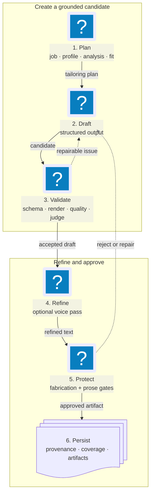

# Tailoring Contract

This page explains how JobCtrl generates a tailored resume for one job,
what question it asks the model, what the model is allowed to change, and which
checks decide whether the result becomes an approved artifact.

**Read this if** you need to know what tailoring guarantees, what the model may
and may not change, or why a resume was rejected.

## The Contract At A Glance

Tailoring is a constrained rewrite of the candidate's own profile toward one job,
behind a stack of gates. What it guarantees:

- Every candidate fact comes only from the profile; the target job is context,
  never candidate evidence.
- Required experience and skill-category IDs and required bullets are preserved;
  the model cannot add sections, experiences, skill categories, or education.
- Optional achievements are selected, not copied wholesale. The planner keeps
  one strongest grounded achievement edge per requirement, and the generator
  emits the smallest sufficient set. A per-role maximum is a ceiling, never a
  fill target.
- Every experience bullet maps to one achievement. Each numeric claim must be
  present in that same achievement's evidence; a global metric inventory is not
  claim authority.
- No fabricated metric, date, title, employer, or ungrounded named technology
  survives into an approved artifact.
- Keyword coverage is computed against the rendered resume text, never inferred
  from the job description.
- A failed re-tailor never destroys the last accepted generation's artifact or
  provenance.

Approval must clear every gate below (each detailed under
[Validation Layers](#validation-layers)):

| Gate | What it enforces | Kind |
| --- | --- | --- |
| Schema + field validation | JSON shape, required IDs, allowed skills, title safety, max bullets | deterministic |
| Rendered-text + quality | required anchors present, evidence/metrics verified, prohibited claims absent, keyword stuffing bounded | deterministic |
| Post-generation fit | fit score and must-have coverage against the target profile | LLM + deterministic |
| Structured judge | independent pass/fail safety, selection focus, semantic fidelity, and professional register; re-run on accepted post-voice text (skipped only in lenient mode) | LLM |
| Adversarial review | six-persona challenge for high-fit jobs | LLM |
| Fabrication gate | never-fabricate token scan + prose skill/tool allowlist; re-run after the voice pass; fails closed | deterministic |

Tailoring is owned by the Materials bounded context. The main implementation is
in `workers/automation/src/jobctrl/domain/materials/use_cases.py`, supported
by deterministic quality checks in `quality.py`, content validation and assembly
in `services.py`, profile helpers in `resume_profile.py`, provenance
construction in `provenance_builder.py`, the requirement coverage graph in
`requirement_coverage.py`, the fabrication detectors in
`fabrication_detector.py`, claim grounding in `claim_grounding.py`, and the
rendered-text keyword coverage audit in `coverage_audit.py`.

## Short Version

Requirement coverage is planned before writing. The model is not asked to write
one resume section per job requirement.

The model is asked:

```text
Here is the candidate's canonical master resume, the target job, the tailoring
policy, target profile, requirement-achievement coverage graph, required
profile evidence, allowed skills, achievement-owned metrics, and the quality
plan.

Rewrite only these mutable resume fields and return JSON plus generated claim
mapping:
- executive_profile
- executive_profile_sentences (ordered explicit sentence boundaries whose
  one-space join exactly equals executive_profile)
- experience_updates for existing profile experience IDs
- skill_category_updates for existing profile skill category IDs
- generated_claim_mappings that link each generated claim to coverage edges,
  requirement IDs, evidence IDs, or a non-requirement reason such as pinned or
  positioning content; exactly one bound mapping is required for every summary
  sentence, generated experience bullet, and complete rendered skill group;
  executive_profile is valid only when executive_profile_sentences contains one
  item, while multi-sentence summaries use executive_profile.sentence[N] for every
  explicit item
```

The target job and employer analysis decide what to emphasize. The existing
profile structure decides where generated text can go.

## End-to-End Flow



The loop is deliberate: a candidate is persisted as approved only after the
structured, rendered, quality, and fabrication checks agree. The sections below
spell out each input, gate, and persisted audit field.

## Inputs To Tailoring

Tailoring combines several inputs. Each input has a different authority.

| Input | Source | What It Controls |
| --- | --- | --- |
| Candidate master resume | `ProfileSnapshot` / profile aggregate | The only source of candidate facts: summary, experience, education, skill categories, required bullets, and achievement-owned metrics. The flat `real_metrics` field is a non-authoritative compatibility projection; unmatched legacy values are preserved but remain unassigned. |
| Tailoring policy | Profile tailoring rules | Claim policy, generation permissions, required content pins, max bullets, and advanced auto-approval |
| Writing style | Profile writing preferences | Tone, bullet standards, verbosity, advisory keyword emphasis, first-person preference |
| Target job | Job record | The target role, description, responsibilities, skills, and company context |
| Employer analysis | `EmployerAnalysis` aggregate | Grounded role framing, inferred seniority, requirements, and reasoned keywords |
| Requirement fit report | Scoring context | Pre-tailoring fit by requirement, allowed evidence IDs, target keywords, prohibited claims, tailoring directives; its employer-analysis generation must match the current posting analysis |
| Requirement-led coverage graph | Deterministic target-profile adapter plus constrained planner | Which profile achievements can cover resume-scoped target requirements, which resume requirements are uncovered, which achievements are unused, and what claim policy each edge requires. Logistics, eligibility, and employer conditions remain context-only outside the resume denominator. |
| Previous attempt outcome | Tailoring retry loop | Typed, code-owned retry reason only; free-form validator, judge, adversarial, and prior-output text remains audit data |

The rollbackable tailoring-policy revision contains only tenant-wide generation
controls: the complete tailoring-relevant `ProfileSnapshot` projection,
profile/custom policy, learned rules, prompt/schema versions, generator and
judge settings, and validation mode. The projection covers rendered contact
fields, experience metadata, resume facts and evidence, constraints, and
tailoring rules. It deliberately excludes application-only sections such as
compensation, work authorization, availability, EEO answers, application
preferences, and the stored application password. The target-job plan is not a
global policy revision. Every artifact records its own job-prompt fingerprint
separately from the global
policy fingerprint and version. That artifact fingerprint hashes the exact
role/content message set sent for the selected candidate, including its target
job and any typed retry guidance; it is not a digest of only the reusable
system-prompt base. Parallel jobs with identical generation controls therefore
reuse one global policy version while retaining distinct job-prompt audit facts.
A tailoring-relevant profile or control change advances the global version;
an application-only edit does not. Immediately before artifact persistence,
the same SQLite write transaction derives the current canonical
tailoring-relevant projection and compares its fingerprint plus the policy
against the generation inputs, so a concurrent resume-evidence or policy change
rejects the stale artifact rather than committing it after the user's change.

The target job is context, not candidate evidence. The prompt explicitly tells
the model not to copy target-job tools, systems, responsibilities, or business
claims into the candidate resume unless the same fact appears in the candidate's
master evidence.

## The Actual Model Prompt

`build_master_tailor_prompt()` builds the generator system prompt. The user
message then appends:

```text
ORIGINAL RESUME:
[baseline executive profile]

---

TARGET JOB:
[job blob]

Return the JSON:
```

That text is prompt-level guidance, not the main schema contract. The generator
call uses `LlmPort.chat_json(..., response_schema=TAILORED_RESUME_RESPONSE_SCHEMA)`,
so providers that support structured output receive the schema at the LLM
gateway boundary. If an adapter lacks `chat_json()`, `_chat_json_payload()` falls
back to `chat(..., response_schema=schema)` and parses the returned text. The
deterministic validators still run after the gateway returns a parsed payload.
On retries, the system message may add only fixed guidance selected from
code-owned reason codes such as `validation_failed`, `judge_rejected`, or
`fabrication_detected`. Free-form prior model or reviewer text is never copied
into a later generator message.

The system prompt contains these sections:

- Mutable content boundary: executive profile, experience bullets, title field
  only where policy allows it, and skill category items.
- Fixed structure boundary: contact header, experience metadata, education, and
  section order are injected by code.
- Source-of-truth rules: profile data and required bullets are the only candidate
  evidence; metrics are extracted from and remain scoped to their owning
  achievement.
- Hard rules: return every required profile ID exactly once, preserve required
  bullets, include the pruned strongest requirement-covered achievements, do not
  add/remove experience, education, or skill categories, do not invent skills
  or metrics, cite one achievement per bullet, and treat max bullet count as a
  ceiling rather than a quota.
- Writing method: retain explicit pins, select the smallest sufficient
  achievement set, order it strongest-to-weakest, express precise action and
  outcome without changing agency or causality, order existing skills by
  truthful target overlap, and write a concise grounded summary.
- Master resume payloads: existing experience rows, education rows, and skill
  categories.
- Tailoring policy and writing style.
- Tailoring quality plan.
- Required experience IDs, required skill category IDs, and required bullets.
- Required output JSON shape.

## Output Schema

The generator must return JSON matching `TAILORED_RESUME_RESPONSE_SCHEMA`:

```json
{
  "executive_profile": "Grounded executive profile.",
  "executive_profile_sentences": ["Grounded executive profile."],
  "experience_updates": [
    {
      "id": "existing_profile_experience_id",
      "title": "",
      "bullets": ["Generated bullet text."]
    }
  ],
  "skill_category_updates": [
    {
      "id": "existing_profile_skill_category_id",
      "items": ["existing skill 1", "existing skill 2"]
    }
  ],
  "generated_claim_mappings": [
    {
      "claim_id": "claim_summary_1",
      "location": "executive_profile.sentence[0]",
      "text": "Grounded executive profile.",
      "claim_label": "positioning",
      "coverage_edge_ids": [],
      "requirement_ids": [],
      "evidence_ids": [],
      "non_requirement_reason": "positioning",
      "review_required": false
    },
    {
      "claim_id": "claim_1",
      "location": "experience.existing_profile_experience_id.bullets[0]",
      "text": "Generated bullet text.",
      "claim_label": "evidence_reframed",
      "coverage_edge_ids": ["edge_req_1_ev_1_direct"],
      "requirement_ids": ["req_1"],
      "evidence_ids": ["ev_1"],
      "non_requirement_reason": "positioning",
      "review_required": false
    },
    {
      "claim_id": "claim_skills_1",
      "location": "skills.existing_profile_skill_category_id",
      "text": "existing skill 1, existing skill 2",
      "claim_label": "structure",
      "coverage_edge_ids": [],
      "requirement_ids": [],
      "evidence_ids": [],
      "non_requirement_reason": "structure",
      "review_required": false
    }
  ]
}
```

The model cannot return contact info, education rows, new sections, comments,
warnings, or PDFs. The claim map is a sidecar audit contract; code still owns
assembly, provenance rows, final artifact metadata, and read models. Mapping
locations are range-checked, complete rendered skill groups bind by exact text,
and the schema-valid raw response is retained unchanged in attempt audit.

## What "Profile-Row Based" Means

The generated JSON is keyed by existing profile object IDs.

| Generated Field | Key | Based On | What The Model Can Do |
| --- | --- | --- | --- |
| `executive_profile` | No row ID | Baseline executive profile plus target role and quality plan | Rewrite the summary when policy allows it |
| `experience_updates[]` | Existing experience entry ID | One existing profile experience entry | Rewrite/order bullets for that entry, within max bullet count and evidence rules |
| `skill_category_updates[]` | Existing skill category ID | One existing profile skill category | Select/order exact existing skills from that category |
| Education | No model field | Existing profile education entries | Nothing; code injects it unchanged |
| Contact/header | No model field | Existing profile personal data | Nothing; code injects it |

Requirement directives influence which evidence and terms should be emphasized
inside those profile rows. They do not create one generated row per requirement.

For example, if the job has requirements for AI SDLC, developer platforms, and
security, the model does not return three requirement rows. It returns updated
bullets for the candidate's existing experience rows and selected existing
skills that best cover those requirements.

## Tailoring Plan

`build_tailoring_plan()` converts analysis and profile data into a compact plan
that both the generator and validators can use.

The plan includes:

- `target_seniority`: inferred from the job title/responsibilities.
- `job_keywords`: grounded keywords from `EmployerAnalysis` and requirement
  directives.
- `requirement_directives`: requirement-level instructions derived from the
  requirement fit report when it matches the same job and analysis generation.
- `required_evidence_ids`: only evidence explicitly pinned by a required
  baseline bullet; relevance or seniority never silently creates a hard pin.
- `seniority_evidence_ids`: profile evidence that supports senior/staff/director
  positioning.
- `verified_metrics`: a compatibility index derived from achievement evidence
  and baseline bullets. Claim validation still checks each number against the
  specific evidence ID mapped to that claim.
- `prohibited_claims`: claims that must not appear because the requirement fit
  says they are missing/blocked or explicitly avoidable.
- `requirement_led_controls`: claim policy, generation permissions, required
  pins, writing style, revision gates, and advanced auto-approval policy after
  migrating legacy Preferences values.
- `target_profile`: every must-have and nice-to-have requirement with a safe
  excerpt and explicit `resume`, `logistics`, `eligibility`, or
  `employer_condition` scope, plus weights, keywords, and profile achievement
  IDs. Only `resume` requirements enter the generation/coverage lists; the
  others remain inspectable as context-only requirements. Employer-analysis
  prompt v2 asks every leg and the synthesizer to declare this scope. The
  target-profile adapter uses that reconciled declaration for ambiguous wording
  and applies deterministic non-resume safety rules plus an old-analysis
  fallback, so an obvious office/work-authorization/employer condition cannot
  be promoted to resume coverage by one bad declaration.
- `coverage_graph`: requirement nodes, achievement nodes, coverage edges,
  uncovered requirements, and unused achievements. Existing
  `RequirementFitReport.fit.evidence_ids` seed direct/transferable candidates;
  deterministic ranking retains one strongest achievement per requirement while
  allowing one achievement to cover several requirements.
- `deterministic_checks`: a prompt-visible summary of important hard checks.

Requirement directives are sorted by priority, weight, and requirement ID. They
can say, for example:

- double down on a matched requirement,
- bridge a transferable gap using specific evidence,
- avoid claiming a missing or blocked requirement,
- retain logistics, eligibility, and employer conditions as context-only facts
  for review rather than résumé claims,
- target specific grounded keywords.

## Attempt Loop And Candidate Selection

Before `_run_attempts()` builds or sends any generator message, the domain
computes the distinct mandatory achievement set for each experience role. User
pins and requirement-coverage edges share one slot when they reference the same
canonical evidence. If that union exceeds `max_experience_bullets`, Tailor
blocks with `ARTIFACT_BUDGET_INFEASIBLE`, records the role, required count, and
ceiling, preserves the durable attempt count, and asks the user to reduce pins
or raise the ceiling. An impossible profile configuration never consumes model
or retry budget. Selected payloads receive an internal artifact-budget version;
render-only refreshes preserve mandatory overflow on older accepted mapped
payloads that predate that marker instead of silently changing reviewed text.

`_run_attempts()` owns the generator retry loop.

For each attempt:

1. Start with the base tailor prompt.
2. Map earlier parse, validation, judge, adversarial, fabrication, or warning
   outcomes to a bounded code-owned retry reason and append only its fixed
   guidance to the system prompt. Keep original free-form findings in attempt
   history for audit, never in a later generator message.
3. Build two LLM messages:
   - system: the tailor prompt,
   - user: original resume baseline, target job blob, and JSON-only reminder.
4. Run each configured candidate model through `chat_json()` with
   `TAILORED_RESUME_RESPONSE_SCHEMA`.
5. Validate each candidate independently.
6. Judge each valid candidate unless `validation_mode` is `lenient`.
7. Optionally run adversarial review for high-fit jobs.
8. Select the best clean approved candidate by judge score.
9. Run the deterministic fabrication gate (never-fabricate detector + prose
   skill/tool gate) on the selected candidate; a hard finding re-enters the
   loop as an `avoid_note` while retry budget remains and fails closed
   otherwise.
10. If only warning-bearing approved candidates exist, retry while retry budget
    remains, then accept the best residual warning candidate only when allowed
    by the loop logic.

The retry loop is separate from the durable preparation work-item retry budget.
The inner loop improves one tailoring run. The durable work item controls how
many failed runs the background preparation queue auto-requeues.

## Validation Layers

Tailoring has multiple gates. Some are deterministic, some are LLM-judged.

### 1. Structured Output Schema

The LLM gateway is called with `TAILORED_RESUME_RESPONSE_SCHEMA` through
`chat_json()`. Provider adapters pass that schema as structured-output metadata
where supported and return a parsed dict. The prompt's "Return the JSON" wording
is redundant guardrail text, not the primary enforcement mechanism.

This catches malformed JSON and many shape errors before the tailoring
validators run.

### 2. JSON Field Validation

`ContentValidator.validate_json_fields()` checks the returned JSON against the
profile contract:

- `executive_profile` must exist and be non-empty.
- `experience_updates` must exist and be non-empty.
- `skill_category_updates` must exist and be non-empty.
- Each required experience ID must appear exactly once.
- Unknown or duplicate experience IDs are rejected.
- Experience bullet count cannot exceed the profile max. Requirement coverage
  and explicit pins do not bypass this hard ceiling.
- Every experience bullet must have exactly one bound claim mapping and exactly
  one primary achievement evidence ID; the same achievement cannot produce
  several bullets.
- A covered or explicitly pinned role cannot carry positioning-only filler. A
  required role with neither receives exactly one evidence-backed positioning
  bullet; an optional unsupported role is omitted.
- Generated title must be empty or exactly match the source title.
- Each required skill category ID must appear exactly once.
- Unknown or duplicate skill category IDs are rejected.
- Skill items must exactly match skills already present in that profile
  category.
- LLM self-talk phrases are rejected.
- Watchlisted fabricated skills are rejected unless they are present in the
  allowed profile skills (the later fabrication gate additionally scans ALL
  prose skills/tools against the profile vocabulary and evidence corpus).
- Banned words are warnings in normal mode, errors in strict mode, and ignored
  in lenient mode.

### 3. Resume Assembly

`ResumeAssembler` turns the approved JSON payload into plain text.

It injects:

- name and contact,
- `EXECUTIVE PROFILE`,
- `EXPERIENCE` rows with source title/company/location/date metadata,
- `EDUCATION` from the profile,
- `SKILLS` with profile skill category labels.

It applies profile policy helpers:

- If summary rewrite is disabled, the baseline summary ships instead of the
  model's proposed summary.
- If achievement rewriting is disabled, source bullets ship instead of generated
  bullets.
- Required baseline bullets are appended if the model omitted them.
- If skill reordering is disabled, source skill order ships instead of generated
  order.

### 4. Rendered Resume Validation

`validate_tailored_resume()` checks the assembled text, not only the JSON:

- required section headings are present,
- required companies are still present,
- required education entries are still present,
- required skill category labels are still present.

### 5. Deterministic Tailoring Quality

`evaluate_tailoring_quality()` checks the payload and rendered text against the
`TailoringPlan`:

- standard resume sections exist,
- required evidence IDs are represented,
- all metrics are recognized from achievement-owned evidence,
- every summary or experience metric is supported by that claim's mapped
  achievement rather than merely appearing elsewhere in the profile,
- prohibited claims do not appear,
- target keyword coverage is not extremely low,
- keyword repetition stays below stuffing thresholds,
- consecutive repeated words are warned,
- senior/staff/director jobs include supported ownership/scope/influence
  language when seniority evidence exists,
- executive phrasing on non-senior jobs is warned,
- stock phrase markers are warnings only.

Quality errors fail the candidate. Quality warnings can trigger a retry unless
they are label-only low-quality signals such as stock phrase markers.

### 6. Post-Generation Fit Gate

After assembly, requirement-led candidates are scored against the target
profile. The scorer records:

- final fit score,
- must-have coverage ratio,
- covered and uncovered requirement IDs,
- prioritized fixes,
- review blockers from adjacent or draft claims.

The versioned default gates are minimum fit score 8/10, must-have coverage
0.85, and one revision/enhancement attempt. If thresholds fail and claim policy
allows adjacent translation or draft confirmation, the retry loop receives the
prioritized fixes and uncovered requirements. Deterministic validators still
own fact safety: scoring can request revision, but it cannot approve unsupported
claims. The resulting revision decision has one disposition: `passed`,
`revise`, `review_required`, or `accept_with_residual_gap`. Once the bounded
revision budget is exhausted—or when canonical profile evidence cannot support
an enhancement—an otherwise-safe candidate continues through judge,
adversarial, and fabrication gates with a persisted residual warning. It does
not fail Tailor or spend more retries trying to manufacture missing experience;
Scoring remains the owner of fit and eligibility.

Coverage-bearing claims are grounded against the shipped rendered text before
they count: a claim binds to a shipped line (location + text binding, honoring
the same bullet's pre-voice text for voice-reworded lines), claimed-only
requirements with no shipped line fail the gate with explicit shipped-resume
fixes feeding the revision loop, and the shipped artifact persists a
lifecycle-labeled post-voice grounded fit record
(`post_generation_fit_final`). Apply Review labels the gate's coverage basis
(`grounded_shipped_text_v1` vs `judge_claimed_legacy`) instead of hiding it.

### 7. Structured Judge

`build_judge_prompt()` asks a separate judge model whether the exact candidate is
safe to show the user. The judge receives canonical profile evidence, allowed
skills, achievement-owned metrics, the tailoring quality plan, the target job,
the tailored JSON, and the rendered resume.

The judge returns `TAILORING_JUDGE_RESPONSE_SCHEMA`:

- `verdict`: `PASS` or `FAIL`,
- `score`: 0-1,
- `criterion_scores`,
- `issues`,
- `unsupported_claims`,
- `fabrications`,
- `missing_required_evidence`,
- `repair_instructions`.

Approval requires:

- `verdict == PASS`,
- score at or above `tailorJudgeMinScore`,
- every required criterion score, including `semantic_fidelity`,
  `bullet_selection_focus`, and `professional_register`,
- no unsupported claims, fabrications, or missing required evidence.

In `lenient` mode, the structured judge is skipped.

### 8. Adversarial Review

High-fit jobs (fit at or above the adversarial threshold of 0.8, i.e. 8/10)
run an additional adversarial review after the judge approves. Six personas
challenge the resume — `ats_parser`, `skeptical_recruiter`,
`hiring_manager_domain_expert`, `evidence_auditor`, `anti_ai_voice_critic`,
and `interview_defensibility_critic` — each with its own rubric.
If it finds blockers, the candidate becomes rejected. Its blockers and repair
instructions remain inspectable audit data; only the code-owned
`adversarial_rejected` reason can influence the next generator prompt.

### 9. Optional Voice Pass

If a `VoicePort` is injected, it may rewrite only lines that contain a configured
buzzword. Clean lines must remain byte-for-byte unchanged. A rewrite is eligible
only when it reduces buzzword density; opening-verb or length variety is audit
diagnostic data, not an optimization target. Before the voiced payload can ship,
claim text is rebound to the final prose and JobCtrl re-runs mapping validation,
rendered quality, provenance, fabrication, final fit, the structured judge, and
the high-fit adversarial review when applicable. Any scope, semantic, grounding,
or judge regression keeps the already accepted pre-voice candidate.

### 10. Deterministic Fabrication Gate

A final deterministic gate runs on validation- and judge-approved candidates
and is re-confirmed after the voice pass, immediately before provenance and
persistence:

- The never-fabricate detector scans numeric/date/title/employer tokens in the
  shipped prose against the profile evidence corpus. SKILLS section rows are
  grounded against the declared skill items themselves, so a declared
  versioned skill (`Java 17`, `OAuth 2.0`) is not flagged as a fabricated
  number, while a skills numeric absent from every declared item still fails.
- The prose skill/tool gate hard-rejects any job-target skill/tool keyword
  woven into experience bullets or the executive summary that grounds in
  neither the profile skill vocabulary nor the evidence corpus. The gate is
  scoped to named technologies with word-form-tolerant grounding, so
  profile-backed tools, corpus-grounded concept terms, and ordinary English
  words never false-fire.

A hard finding with retry budget remaining records its per-candidate
`failed_fabrication_gate` repair-loop history and triggers the fixed
`fabrication_detected` retry guidance. The finding's free-form text never enters
the later system or user message. When every candidate trips the gate, the
resume is NOT approved and the prior accepted generation is preserved. The
cover-letter body runs the same never-fabricate and prose skill/tool gates
before acceptance. Job-post numbers and dates never enter the candidate evidence
corpus. The Cover generator must describe posting-only timelines, team sizes,
goals, and requirements qualitatively; a numeric/date grounding failure adds only
bounded code-owned retry guidance to remove posting-derived values, never the
free-form finding or prior output. A failed first attempt remains a rejected
artifact while the aggregate stays `resume_approved`. A failed refresh is written
to a distinct rejected audit path and appended to `cover_letter_attempts`; the
approved cover letter bytes, artifact slot, lifecycle state, and projection remain
authoritative until a replacement passes validation and its versioned path is
durably saved.
Successful refresh candidates also use new immutable paths, so a repository
failure cannot mutate the bytes referenced by the prior approved artifact. When
new cover-letter text is approved, any prior cover-letter PDF is persisted as
`superseded` and the aggregate returns to `cover_letter_ready`; a failed PDF
render therefore remains pending instead of projecting stale PDF bytes as
approved.

## Persistence And Audit Data

After a parseable payload exists, the use case writes a text artifact for
inspection even when the final status is not approved. The artifact metadata is
the main audit surface for tailoring.

Approved resume metadata includes:

- validation mode and attempt count,
- tailoring policy ID/version,
- prompt/schema/judge schema versions,
- candidate models and selected model,
- selected candidate ID,
- judge model and judge threshold,
- quality plan,
- quality checks,
- post-generation fit score and revision decision,
- bullet-limit violations on rejected candidates or legacy artifacts,
- adversarial review,
- retry/review feedback,
- change annotations,
- candidate summaries,
- judge result,
- voice pass result,
- keyword coverage read model (computed by the coverage audit against the
  actual rendered resume text; a keyword counts as covered only when a
  provenance-backed grounded bullet demonstrates it).

Requirement-led audit data exposed to Apply Review is bounded and safe. It can
show covered requirements, uncovered requirements, unused achievement IDs,
evidence-backed generated claims, pinned claims, adjacent/draft claim labels,
legacy bullet-limit violations, revision decisions, and review blockers. It
must not expose raw prompts, full profile payloads, full job descriptions, local
paths, PDFs, logs, browser data, or SQLite contents.

For accepted generations, `build_bullet_provenance()` records canonical
provenance rows. These rows are computed against the same final payload that
ships to the user, so `generated_text` matches the rendered resume text.

Provenance rows exist for:

- the executive profile line,
- each rendered experience bullet,
- each rendered skill category line.

Each provenance row records:

- section and source profile ID,
- profile evidence IDs,
- employer requirement IDs served by generated text,
- matched keywords present in generated text,
- transform type,
- governing control rule,
- rationale,
- generated text.

Failed re-tailor attempts do not destroy the last accepted generation's
artifact or provenance rows.

## Deterministic Versus LLM-Owned Work

| Area | Type | Notes |
| --- | --- | --- |
| Employer analysis drafting/synthesis | LLM/agentic | Produces grounded requirements and keywords before tailoring |
| Requirement fit scoring | LLM plus parser/domain model | Can provide requirement directives to tailor |
| Tailoring prompt assembly | Deterministic | Built from profile, job, analysis, fit report, policy, and style |
| Resume JSON generation | LLM | Constrained by strict output schema |
| JSON schema validation | Deterministic | Gateway/schema-level |
| Profile contract validation | Deterministic | Required IDs, allowed skills, title safety, max bullets |
| Text assembly | Deterministic | Code injects fixed sections and profile metadata |
| Rendered text validation | Deterministic | Checks final text has required structure/profile anchors |
| Tailoring quality checks | Deterministic | Evidence-scoped metrics, prohibited claims, keyword coverage/repetition, seniority signals, stock phrases, and smallest-set bullet curation |
| Structured judge | LLM | Independent pass/fail quality, semantic-fidelity, selection-focus, and register gate; repeated on accepted post-voice text |
| Adversarial review | LLM | Optional high-fit challenge review |
| Voice pass | LLM plus deterministic gates | Optional buzzword-only edit; clean lines are immutable and final text must reduce buzzwords and pass all final gates |
| Fabrication + skill gate | Deterministic | Never-fabricate token scan plus prose skill/tool allowlist gate; hard reject with repair-loop feedback |
| Claim grounding | Deterministic | Binds coverage-bearing claims to shipped rendered lines before they count |
| Provenance and coverage rows | Deterministic | Built from final generated text, profile evidence, and employer analysis |

## Current Constraints

The current schema is intentionally narrow. It does not let the model return:

- `has_metric`,
- `dropped`,
- `warnings`,
- requirement-row output,
- new experience entries,
- new skill categories,
- education changes.

Those concepts can be added only by changing the schema and every owning layer:
prompt, validator, assembler, provenance builder, artifact metadata, tests, API
read models, and UI inspection surfaces.

The current implementation can safely:

- rewrite the executive profile when policy allows it,
- rewrite and order bullets inside existing experience entries,
- select and order existing skill strings inside existing skill categories,
- preserve required bullets,
- choose the smallest sufficient set from the pruned strongest
  requirement-achievement edges while treating the max bullet budget as a
  ceiling,
- bind one achievement to each experience bullet and keep its metrics scoped to
  that achievement,
- label generated claims with requirement/evidence coverage or pinned/
  positioning reasons,
- score generated output against the target profile and route one gated
  revision/enhancement pass,
- keep non-resume requirements visible without counting them in grounded resume
  coverage or its retry gate,
- compute post-generation provenance and requirement coverage.

The current implementation cannot safely:

- add a new job requirement as a new resume row,
- invent a new skill because the job asks for it,
- rewrite source work-history titles with job keywords,
- reorder experience entries independently of the profile order,
- remove education or required experience,
- treat a keyword as covered unless it appears in the generated resume text or
  generation-time provenance.
- treat office attendance, remote/hybrid arrangements, work authorization, or
  employer compensation/benefits as achievements the resume must cover.

## Common Failure Reasons

`failed_validation` usually means a deterministic gate failed. Common examples:

- missing `executive_profile`, `experience_updates`, or `skill_category_updates`,
- missing required experience or skill category IDs,
- unknown extra IDs,
- duplicate IDs,
- too many optional bullets for the profile max,
- non-empty generated title that does not exactly match the source title,
- fabricated skill,
- LLM self-talk,
- required company/education/category missing after rendering,
- required evidence missing,
- unknown metric,
- prohibited claim,
- severe keyword stuffing,
- seniority mismatch for senior/staff/director jobs.

`failed_judge` means deterministic validation passed, but the structured judge
did not approve or scored below the configured threshold.

`failed_adversarial_review` means the structured judge approved, but the
adversarial review found blockers.

`failed_fabrication_gate` means the deterministic fabrication gate rejected the
candidate — a fabricated numeric/date/title/employer token or an ungrounded
job-target skill/tool in the prose. The finding is kept as per-candidate
repair-loop history.

`exhausted_retries` means the inner tailoring loop could not produce an
acceptable candidate within its retry budget. The durable preparation queue has
its own retry budget outside this inner loop. The stage `attempt_count` advances
once per durable Tailor execution, not once per candidate-repair call; inner
attempts remain in an append-only generation audit keyed by workflow execution,
durable attempt, and recorded time, so a later retry or a rerun of the same
durable attempt cannot overwrite earlier prompts, candidates, validation, or
judge evidence. A fifth failed durable execution retains the compatibility
`exhausted` marker until an explicit attempt reset; product read models expose
it as a retryable failure with `attempt_budget_exhausted` as the reason.

Tailoring does not silently discard a missing, cross-job, or stale-generation
requirement-fit report. That condition blocks Tailor on Score before candidate
generation, preserves the durable Tailor attempt count, records both generation
identities, and asks for a fresh score. Scoring resolves employer analysis
through its complete cache identity first, so the replacement fit report and
the Tailoring coverage graph describe the same posting snapshot.

Tailoring also does not retry an impossible artifact budget. The stage is
blocked non-retryably before candidate generation, with bounded per-role
violation facts and no synthetic judge result. Once the profile constraint is
changed, a new Tailor execution can proceed normally.

## How To Change Tailoring Safely

When changing tailoring behavior, update the owning layer rather than masking
the symptom in the UI.

| Desired Change | Owning Layer |
| --- | --- |
| Change what the generator is asked to do | `build_master_tailor_prompt()`, prompt version, prompt tests |
| Change allowed output fields | `TAILORED_RESUME_RESPONSE_SCHEMA`, validator, assembler, provenance, tests, API/UI read models |
| Change deterministic validation | `ContentValidator` or `evaluate_tailoring_quality()` plus focused tests |
| Change keyword source | `EmployerAnalysis` / `build_tailoring_plan()` |
| Change requirement-level tailoring directives | requirement fit report/domain scoring layer and `_requirement_directive_items()` |
| Change approval semantics | judge schema/prompt, `_judge_resume()`, retry loop tests |
| Change displayed audit trail | persist the missing audit data first, then update projections/API/UI |
| Change final rendered content | assembler/render pipeline plus provenance and coverage tests |

At minimum, prompt or validator changes should update the focused materials
tests under `workers/automation/tests/test_materials_use_cases.py` and
`workers/automation/tests/test_materials_quality.py`. User-facing inspection
changes should also exercise the API/web path that displays the audit data.

## Key Code Pointers

- `TailorResumeUseCase.execute()`: overall transaction, generation, voice/audit,
  artifact write, metadata, persistence.
- `_run_analyze()`: resolves or produces canonical employer analysis.
- `_run_attempts()`: retry loop, candidate fan-out, warning retry, candidate
  selection.
- `build_master_tailor_prompt()`: generator prompt and output contract.
- `TAILORED_RESUME_RESPONSE_SCHEMA`: strict generator output schema.
- `_run_candidate()`: LLM call, validation, assembly, quality checks, judge,
  adversarial review.
- `build_judge_prompt()` and `_judge_resume()`: independent structured judge.
- `build_tailoring_plan()`: analysis/fit/profile to quality plan.
- `evaluate_tailoring_quality()`: deterministic quality gate.
- `ContentValidator`: JSON and rendered resume validation.
- `ResumeAssembler`: JSON payload to final resume text.
- `build_bullet_provenance()`: final text to provenance rows.

## Outreach Draft Gates (Reused Materials Stack)

Outreach messages (Contact & Outreach, Phase 3) are first-person, claims-bearing
documents sent to a real person, so they reuse the same truthfulness stack this
page documents for resumes — exactly as the **cover-letter path** already does
(`scan_cover_letter` runs the resume never-fabricate and prose skill/tool gates
verbatim over first-person prose). Outreach adds no parallel gate machinery; it
wraps the materials gates in
`workers/automation/src/jobctrl/domain/contact/outreach_gates.py`.

Every gate runs against the **actual draft text** (`OutreachDraft.body_text`),
never inferred from the recipient or the target company. The recipient's own facts
(name, title, employer) come from the **confirmed contact record** and are passed
as the legitimately-named `target_company` / role context — mirroring how a cover
letter names the job it targets — so referencing them is not a fabrication, while a
fabricated relationship ("we worked together at X") is caught by the judge.

The stack, in order:

1. **Deterministic never-fabricate detector** (`scan_outreach_draft`, delegating to
   the materials `scan_cover_letter`). A draft may reference only facts grounded in
   the candidate profile evidence corpus, the confirmed contact record, and the
   application — no invented metric, date, title, employer, or named technology.
   Any finding is a hard block.
2. **Content validator** (`validate_outreach_draft`). Reuses the materials
   `BANNED_WORDS` + `LLM_LEAK_PHRASES` lists (stock phrases downgrade quality;
   model self-talk is fatal) plus outreach-appropriate structure: a greeting, a
   short sign-off, and a length ceiling (an outreach message is short, not a cover
   letter).
3. **LLM-as-judge** (`build_outreach_judge_prompt` +
   `OUTREACH_JUDGE_RESPONSE_SCHEMA` + `parse_outreach_judge_response`). An
   outreach-specific rubric (`relevance_to_recipient`, `evidence_support`,
   `fabrication_safety`, `relationship_accuracy`, `tone_professionalism`) that
   PASSes only with an explicit PASS verdict, a score at or above the floor, and no
   blockers — any unsupported claim or fabricated relationship is an automatic
   FAIL. A judge error is treated as a FAIL, never a crash.
4. **Claim → fact provenance** (`compute_outreach_claim_provenance`). Each claim
   (paragraph) binds to the confirmed contact attribute ids and the profile
   evidence it rests on, computed against the rendered draft text — the same
   "computed against rendered text" discipline as `build_bullet_provenance()`.

Gates 1–3 aggregate into a persisted `DraftGateResults` whose `passed` is the
**single authority draft approval is gated on** (INV-5): a draft passes only when
the deterministic detector found no fabrications, the validator passed, and the
judge approved. `passed` is stored in `outreach_drafts.gate_results_json`; both the
Python aggregate (`OutreachDraft.approve`) and the TypeScript approve transition
(`approveOutreachDraft` in `apps/api/src/outreach.ts`) refuse to approve a draft
whose persisted record does not confirm `passed`. The gate results and claim
provenance are surfaced in the review UI, labelled by lifecycle, per the
root-cause / auditability discipline.

**Lifecycle and generation versioning.** A draft reuses the materials
`ArtifactStatus` semantics — `candidate | approved | rejected | superseded`
(`suppressed` is materials-only and never used for a draft). Generating or editing
a draft mints a **new generation** (`OutreachThread.next_generation`) and
supersedes prior *candidate* generations, but the last **approved** draft stays
readable until a replacement is itself approved — the same "never destroy the last
accepted artifact" rule that governs re-tailoring. A user edit is not an in-place
mutation: `ReviseOutreachDraftUseCase` accepts the edited body as a new generation
and **re-runs the identical gate stack**, exactly as an Apply Review resume edit
creates a validated replacement generation. Rejecting a candidate never touches the
approved draft.

**No send (INV-1).** The gate stack terminates at an `approved`, copyable draft.
There is no send transport anywhere on the outreach path, and the aggregate cannot
represent a "sent" state.
- `fabrication_detector.py`: never-fabricate token scan and the prose
  skill/tool allowlist gate.
- `claim_grounding.py`: grounds coverage-bearing claims in shipped rendered
  lines for the post-generation fit gate.
- `coverage_audit.py` (`compute_keyword_coverage`): honest keyword coverage
  against the rendered resume text.
- `requirement_coverage.py`: requirement-achievement coverage graph and the
  constrained planner.
