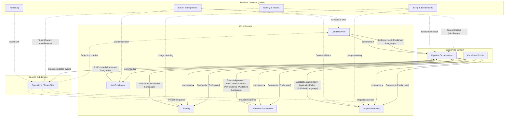
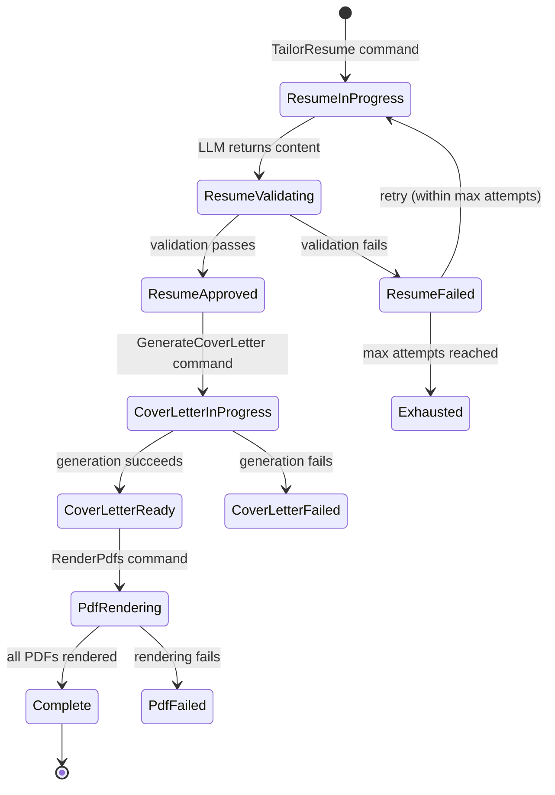
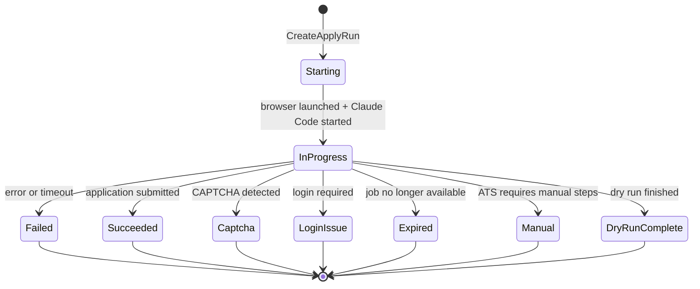
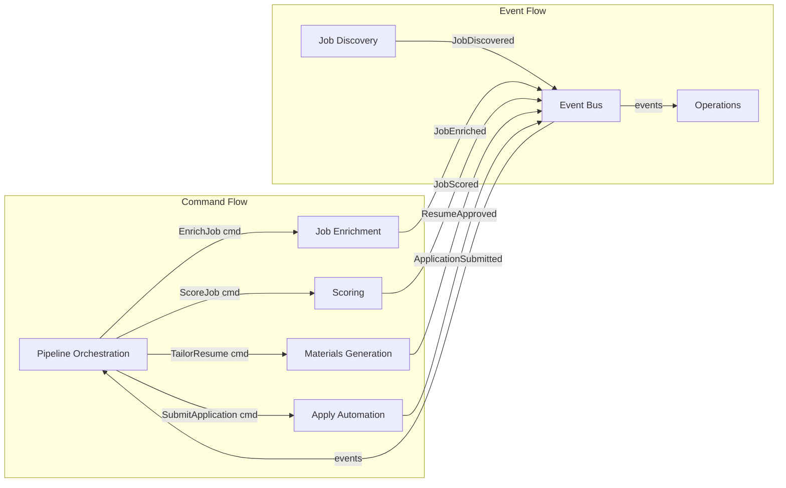
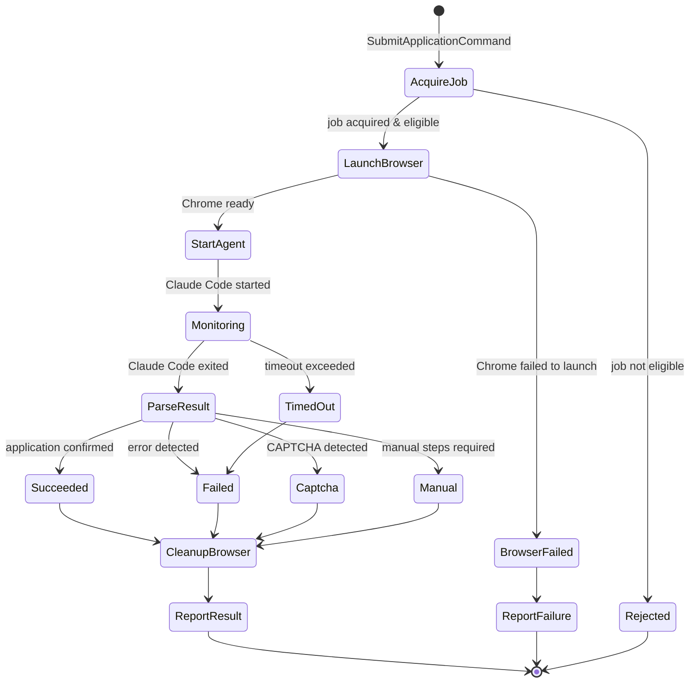
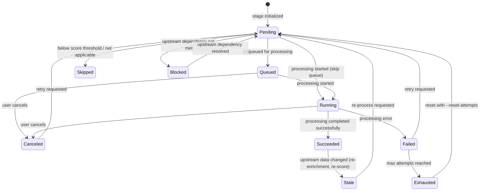

# DDD Target-State Architecture

## 1. Purpose & Non-Goals

### Purpose

This document defines the **canonical target-state architecture** for JobHunter,
modeled with Domain-Driven Design (DDD) and Hexagonal Architecture (Ports &
Adapters). It is the authoritative reference for:

- Bounded context boundaries and their relationships
- Aggregate design with invariants and lifecycle rules
- Domain events and cross-context integration contracts
- Port interfaces and adapter seams for all I/O
- The typed integration protocol between the TypeScript API and Python worker
- Persistence boundary design that decouples domain types from storage schema

Every modeling choice includes rationale so a senior engineer joining the team
can re-derive the decision independently.

**Cloud deployment is a hard requirement.** The local-first phase is a
validation gate, not the end state. Every decision in this document is designed
to ship to a hosted multi-tenant cloud deployment. Section 9 is not
"compatibility" — it is the target deployment model.

### Non-Goals

- **Migration plan.** This document does not prescribe file moves, PR sequences,
  or rollout phases. That is the migration-planning team's scope.
- **Implementation code.** Pseudocode sketches appear where they aid clarity; no
  production code is included.
- **Deployment topology.** Kubernetes manifests, Terraform modules, CI/CD
  pipelines, and region selection are infrastructure engineering, not domain
  modeling. Section 9 names the concrete services and seams but does not design
  the deployment.
- **UI/frontend architecture.** React component structure, state management
  libraries, and routing are not modeled. The Operations context covers
  read-model projections that feed the UI.
- **LLM prompt engineering.** Prompt content for scoring, tailoring, and cover
  letter generation is domain knowledge but not architectural modeling.

---

## 2. Modeling Principles

### DDD Principles Applied

| Principle | How we apply it |
|---|---|
| **Ubiquitous Language** | Every bounded context defines its own glossary. The same term (e.g., "Job") means different things in Discovery vs. Scoring. Code, docs, and UI use identical terminology within each context. |
| **Aggregates chosen by transactional consistency** | An aggregate boundary encloses exactly the data that must be consistent within a single transaction. Cross-aggregate consistency uses domain events and eventual consistency. |
| **Entities have identity; Value Objects have equality-by-value** | `Job` is an entity (identity by `JobId`). `FitScore` is a value object (a score of 8 is the same regardless of where it was computed). |
| **Domain Events are immutable facts** | Named in past tense (`JobDiscovered`, `ResumeApproved`). They record *what happened*, not *what to do*. They are the primary integration mechanism between bounded contexts. |
| **Domain depends on nothing** | Domain types and logic have zero imports from infrastructure (no SQLite, no HTTP, no filesystem). All I/O crosses a port boundary. |
| **Repositories abstract persistence** | Each aggregate root has a repository port. The domain sees an in-memory collection illusion; the adapter translates to SQLite/Postgres/filesystem. |
| **Tenant identity is a first-class domain concept** | Every aggregate identity is scoped by `TenantId`. Every domain event carries `tenantId`. Every repository query, every event publication, every projection is tenant-scoped. In local-first mode, `TenantId` is a singleton constant (`local`); in hosted mode it is the authenticated user's tenant. The domain carries `TenantId`; adapters enforce isolation. |

### Hexagonal Architecture Principles Applied

| Principle | How we apply it |
|---|---|
| **Ports own protocol semantics** | A port defines *what* the application needs (e.g., `LlmPort.complete(prompt, schema) -> Result`) — not *how* it's implemented (Gemini, OpenAI, local). |
| **Adapters are replaceable** | Every driven port has at least two plausible adapters: a local-first adapter (today) and a hosted adapter (SaaS future). The domain is untouched when swapping. |
| **Driving ports are use cases** | Application services expose use cases (`ScoreJob`, `TailorResume`, `SubmitApplication`). External callers (CLI, API, test harness) drive through these ports. |
| **Anti-Corruption Layers guard context boundaries** | When integrating with external systems (job boards, LLM APIs, ATS portals), an ACL translates external models into domain types at the boundary. |

### Evolutionary Architecture

This architecture follows **evolutionary architecture** as the meta-principle.
The cloud target is non-negotiable, but the architecture lets us walk there one
well-defined step at a time — it does not arrive on day one.

> Evolutionary architecture means cloud adapters are named-not-built; it does
> NOT mean preserving legacy code paths. Migrations within the codebase are
> clean replacements: the new implementation lands in the same change that
> deletes the old one.

| Principle | How we apply it |
|---|---|
| **Name the evolution, do not pre-build it** | Every driven port names its cloud adapter and technology. No cloud adapter is implemented until the evolution trigger fires. Local adapters stay minimal. |
| **Local-mode adapters stay simple** | Local adapters do not carry hosted concerns (auth context propagation, distributed tracing, tenant enforcement). They accept `TenantId` as a parameter but ignore it. Cloud machinery is absent from local code. |
| **Fitness functions trigger evolution** | Every major design choice has a concrete, testable trigger (Section 9.4). "When concurrent users > 1" is a fitness function; "when we go to the cloud" is not. |
| **Independent context evolution** | Each bounded context's adapters can be swapped independently. Discovery can migrate to Postgres while Scoring remains on SQLite. Section 9.5 describes context-by-context cloud migration order. |
| **Deliberate trade-offs** | Where we choose local simplicity over cloud-ready flexibility, we name it as a **Trade-off** with the upgrade path documented. We do not pretend the local choice IS the cloud choice. |

### Data-Orientation (Hickey / Wlaschin)

- **Immutable values over mutable objects.** Domain events, value objects, and
  command results are immutable data. Aggregates are the only mutable concept,
  and their mutations are expressed as event emissions.
- **Make illegal states unrepresentable.** Stage state transitions are modeled as
  a sum type / discriminated union — not nullable columns. A job cannot
  simultaneously be `Running` and `Succeeded`.
- **Functions transform data.** Scoring, tailoring, and cover letter generation
  are pure functions `(Input, Profile, Config) -> Result` with I/O pushed to
  the edges via ports.

---

## 3. Strategic Design — Bounded Contexts

### Context Map



### 3.1 Job Discovery

**Purpose:** Find job postings from external sources and create canonical job
records with stable identity.

**Ubiquitous Language:**
- **JobPosting** — a raw job listing as scraped from an external source.
- **Source** — the origin board or career site (e.g., LinkedIn, Greenhouse, Workday).
- **Employer** — the hiring company, distinct from the source board.
- **SearchStrategy** — the extraction method used (jobspy, workday_api, smart_extract, manual).
- **PostingUrl** — the original URL where the job was found.
- **JobId** — a stable, system-generated identifier for a job (replaces URL-as-PK).

**Upstream/Downstream:**
- **Downstream supplier** to Pipeline Orchestration (Customer-Supplier): Orchestration
  commands Discovery to run; Discovery publishes `JobDiscovered` events.
- **Anti-Corruption Layer** against external job boards: raw scraped data is
  translated into `JobPosting` value objects at the boundary. Board-specific
  quirks (Workday CXS JSON, Indeed's anti-scraping, Glassdoor blocking) stay
  in the ACL adapter, not the domain.

**Responsibilities:**
- Scrape job boards using configured search strategies
- Deduplicate by URL and (future) by content similarity
- Assign stable `JobId` and record `PostingUrl`
- Extract employer name separately from source board
- Emit `JobDiscovered` domain event

**What it does NOT own:**
- Job descriptions (that's Enrichment)
- Scoring or fit evaluation
- Application URLs (that's Enrichment)
- Any notion of pipeline stage state

**Boundary justification:** Discovery is the only context that touches external
job board APIs and scraping infrastructure. Its domain types (`JobPosting`,
`Source`, `SearchStrategy`) are meaningless outside this context. Separating
it isolates scraping complexity and rate-limiting concerns from downstream
processing. *Current pain point addressed:* `enrichment/detail.py` imports
`discovery/smartextract.extract_json` and `discovery/jobspy.parse_proxy` —
cross-context coupling that this boundary eliminates.

---

### 3.2 Job Enrichment

**Purpose:** Enrich discovered jobs with full descriptions and direct
application URLs by scraping job detail pages.

**Ubiquitous Language:**
- **DetailPage** — the canonical URL for a job's full posting.
- **FullDescription** — the complete job description text extracted from the detail page.
- **ApplicationUrl** — the direct URL to apply (may differ from the posting URL).
- **ExtractionTier** — the method used: json_ld (Tier 1), css_selectors (Tier 2), llm_assisted (Tier 3).
- **EnrichmentAttempt** — a single try at extracting detail from a job's page.

**Upstream/Downstream:**
- **Downstream supplier** to Pipeline Orchestration (Customer-Supplier).
- Consumes `JobDiscovered` events to know which jobs need enrichment.
- **Anti-Corruption Layer** against detail page HTML: the three-tier extraction
  cascade (JSON-LD, CSS, LLM) is adapter logic, not domain logic.

**Responsibilities:**
- Navigate to job detail pages and extract full descriptions
- Extract or infer application URLs
- Record enrichment attempts and errors
- Emit `JobEnriched` or `EnrichmentFailed` domain events

**What it does NOT own:**
- Job identity or deduplication (that's Discovery)
- Scoring or candidate fit
- Browser lifecycle management (that's an infrastructure adapter)
- Deciding *which* jobs to enrich (that's Pipeline Orchestration)

**Boundary justification:** Enrichment is I/O-heavy (HTTP requests, Playwright
browser sessions, HTML parsing) with domain logic limited to URL resolution and
extraction strategy selection. Separating it from Discovery allows independent
retry policies and concurrency control. *Current pain point addressed:*
`enrichment/detail.py` is 950 LOC mixing Playwright, BeautifulSoup, LLM calls,
and state writes — the hexagonal boundary extracts all of this I/O into adapters.

---

### 3.3 Candidate Profile

**Purpose:** Own the user's reusable career data, resume baseline, tailoring
policies, and writing style preferences.

**Ubiquitous Language:**
- **Profile** — the complete candidate data document.
- **ResumeBaseline** — the canonical master resume content (experience, education, skills).
- **ExperienceEntry** — one role in the candidate's work history.
- **AchievementEvidence** — source-backed proof for one experience achievement,
  including the source text, action, scope, tools, metrics, outcome, seniority
  signal, evidence strength, confidence, and user confirmation.
- **EducationEntry** — one degree or certification.
- **SkillCategory** — a named group of skills (e.g., "Programming Languages").
- **TailoringPolicy** — rules governing what the LLM may modify during tailoring.
- **WritingStyle** — tone, verbosity, bullet style, and other stylistic constraints.
- **ResumeTemplate** — the LaTeX (or future alternative) template for PDF rendering.
- **ApplicationDefaults** — default values for job application form fields.

**Upstream/Downstream:**
- **Conformist** relationship with Scoring, Materials Generation, and Apply
  Automation: those contexts consume the Profile as-is. They do not influence
  its shape.
- No upstream dependency. Profile is independently managed by the user.

**Responsibilities:**
- Validate and store the candidate profile document
- Provide a typed, immutable snapshot of profile data to consuming contexts
- Import profile data from resume PDFs
- Enforce structural invariants (required fields, valid entries)

**What it does NOT own:**
- Per-job tailored content (that's Materials Generation)
- Scoring logic
- Application submission

**Boundary justification:** Profile is a single-user, single-document aggregate
with its own lifecycle (user edits it independently of any job). Consuming
contexts need a stable read-only view. *Historical pain point addressed:*
legacy `profile.json` was loaded as a raw dict and threaded through tailor,
cover, apply, wizard, and profile_import with no invariants enforced (briefing
point 8).

---

### 3.4 Scoring

**Purpose:** Evaluate candidate-job fit and produce structured, explainable
scores.

**Ubiquitous Language:**
- **FitScore** — a 1-10 integer rating of candidate-job match quality.
- **ScoreBreakdown** — structured explanation of why a job received its score (replaces raw reasoning strings).
- **MatchedKeywords** — ATS keywords from the job description that match the candidate.
- **ScoreCorrection** — a user-provided override with rationale.
- **ScoringCriteria** — the rubric used to evaluate fit (technical skills weight, experience level, etc.).

**Upstream/Downstream:**
- **Downstream supplier** to Pipeline Orchestration.
- Consumes `JobEnriched` events (needs full description to score).
- Consumes Profile data (Conformist).
- Publishes `JobScored` domain events.

**Responsibilities:**
- Score jobs against the candidate profile using LLM
- Parse and validate LLM scoring responses
- Record score breakdowns with matched keywords
- Accept and store user score corrections
- Emit `JobScored` domain events

**What it does NOT own:**
- Resume tailoring or cover letter generation (that's Materials Generation)
- The profile itself (that's Candidate Profile)
- Job descriptions (that's Enrichment)
- Deciding which jobs to score (that's Pipeline Orchestration)

**Boundary justification:** Scoring is a pure evaluation function:
`(JobDescription, Profile, ScoringCriteria) -> FitScore + ScoreBreakdown`. It
has no side effects on the job or profile. Separating it from Materials
Generation prevents the current coupling where `scoring/tailor.py` directly
imports `scoring/pdf.py` (briefing point 12). The backlog item for explanatory
score breakdowns and user-corrected scores further justifies an independent
context with its own persistence.

---

### 3.5 Materials Generation

**Purpose:** Produce tailored application materials (resumes, cover letters,
PDFs) for jobs that pass the scoring threshold.

**Ubiquitous Language:**
- **TailoredResume** — a resume customized for a specific job, derived from the master baseline.
- **CoverLetter** — a job-specific cover letter.
- **Artifact** — any generated file (resume, cover letter, PDF) with provenance metadata.
- **ArtifactStatus** — lifecycle of a generated artifact: `candidate` | `approved` | `rejected` | `superseded`.
- **ValidationResult** — output of structural and content validation (banned words, fabrication check).
- **JudgeVerdict** — LLM-as-judge evaluation of a tailored resume's quality.
- **TailoringPlan** — deterministic tailoring constraints derived from the
  profile evidence, tailoring policy, job text, and fit score.
- **AdversarialReview** — high-fit resume critique from separate reviewer
  personas that looks for fabrication, seniority mismatch, ATS weakness, and
  generic AI-sounding writing before approval.
- **RenderFormat** — the output format for a document: `latex_pdf` | `html_pdf` | `text`.

**Upstream/Downstream:**
- **Downstream supplier** to Pipeline Orchestration.
- Consumes `JobScored` events (needs fit score to decide eligibility).
- Consumes Profile data (Conformist).
- Publishes `ResumeApproved`, `CoverLetterGenerated`, `PdfRendered` domain events.

**Responsibilities:**
- Generate tailored resumes from profile + job description via LLM
- Validate tailored content (banned words, fabrication, structural integrity)
- Optionally run LLM-as-judge for quality assessment
- Run deterministic tailoring quality checks for unsupported metrics, keyword
  stuffing, AI-sounding phrasing, weak seniority alignment, and missing evidence
- Run adversarial review for high-fit jobs after normal validation and judge pass
- Generate cover letters
- Render documents to PDF (resume via LaTeX, cover letter via HTML/Playwright)
- Register generated artifacts with provenance metadata
- Emit domain events for each material milestone

**What it does NOT own:**
- Scoring or fit evaluation (that's Scoring)
- The candidate profile (that's Candidate Profile)
- Application submission (that's Apply Automation)
- Pipeline scheduling or retry logic (that's Pipeline Orchestration)

**Boundary justification:** Materials Generation encompasses the two artifact
pipeline stages (tailor, cover) that share a tight invariant: cover
letters require a tailored resume, and each stage renders the PDFs it owns. Grouping them in one
context lets the aggregate enforce these dependencies directly rather than
through cross-aggregate eventual consistency. *Current pain point addressed:*
`scoring/tailor.py` (820 LOC) mixes LLM prompts, validation, judge logic, PDF
generation, state writes, DB writes, and file writes — all of which get
separated into domain logic (validation, assembly) and adapter concerns (LLM
calls, file I/O, DB writes).

---

### 3.6 Apply Automation

**Purpose:** Automate job application submission through browser-based
interaction with ATS portals.

**Ubiquitous Language:**
- **ApplyRun** — a single attempt to submit an application for one job.
- **BrowserWorker** — an isolated Chrome instance for one apply run.
- **SubmissionResult** — the outcome: `applied` | `failed` | `captcha` | `login_issue` | `expired` | `manual` | `dry_run`.
- **DryRun** — an apply attempt that navigates the ATS but does not submit.
- **ApplyPrompt** — the instructions sent to Claude Code for autonomous browser operation.
- **McpConfig** — Playwright MCP server configuration for a browser session.
- **ApplyRunEvent** — a telemetry event within an apply run (structured observability).
- **TokenUsage** — LLM token consumption and cost for an apply run.

**Upstream/Downstream:**
- **Downstream supplier** to Pipeline Orchestration.
- Consumes Profile data (Conformist) for application defaults.
- Requires materials from Materials Generation (tailored resume + cover letter PDFs).
- Publishes `ApplicationSubmitted`, `ApplicationFailed` domain events.
- **Anti-Corruption Layer** against ATS portals: ATS-specific behavior (Greenhouse
  forms, Lever redirects, Workday multi-step wizards) is adapter logic.

**Responsibilities:**
- Acquire eligible jobs and launch browser-based apply sessions
- Manage Chrome lifecycle (launch, CDP port allocation, cleanup)
- Build and dispatch Claude Code + Playwright MCP prompts
- Parse Claude Code output for submission results
- Record apply run telemetry (events, tokens, cost, duration)
- Handle dry-run mode (navigate but don't submit)
- Emit domain events for submission outcomes

**What it does NOT own:**
- Job discovery, enrichment, scoring, or materials generation
- Pipeline scheduling or job selection (that's Pipeline Orchestration)
- Chrome installation or system browser management (infrastructure concern)
- The candidate profile

**Boundary justification:** Apply is the most complex and most isolated context.
It manages subprocesses (Claude Code), browser processes (Chrome), MCP servers
(Playwright), and durable telemetry — none of which any other context touches.
Its `ApplyRun` aggregate has its own lifecycle and local persistence through
`job_events` plus the `apply_run_projections` read model keyed by the Temporal
workflow run id. *Current pain point addressed:* `apply/launcher.py`
(1300 LOC) tangles subprocess spawning, Chrome management, telemetry, DB writes,
dashboard updates, and business rules — hexagonal ports separate each concern.

---

### 3.7 Pipeline Orchestration

**Purpose:** Coordinate the flow of jobs through pipeline stages, manage stage
state machines, enforce ordering and retry policies, and dispatch commands to
the appropriate bounded contexts.

**Ubiquitous Language:**
- **Pipeline** — the canonical sequence of stages a job traverses.
- **Stage** — a named step in the pipeline: `discover | enrich | score | tailor | cover | pdf | apply`.
- **StageState** — the current status of a job within a stage (see state machine in Section 8).
- **Attempt** — a numbered try at completing a stage.
- **RetryPolicy** — max attempts and backoff rules per stage.
- **BlockedReason** — why a stage cannot proceed (upstream dependency not met).
- **NextAction** — the recommended CLI command or action to advance a blocked/failed stage.
- **PipelineRun** — a batch execution of one or more stages across multiple jobs.

**Upstream/Downstream:**
- **Customer** in Customer-Supplier relationships with all processing contexts
  (Discovery, Enrichment, Scoring, Materials, Apply): Orchestration decides
  *when* and *which* jobs to process; processing contexts decide *how*.
- Publishes `StageCompleted`, `StageFailed`, `StageExhausted` events to Operations.

**Responsibilities:**
- Maintain the stage state machine for every job
- Enforce stage ordering and upstream dependencies
- Track attempt counts and enforce retry limits
- Derive the next action for failed or blocked stages
- Dispatch commands to processing contexts
- Coordinate streaming (concurrent) and sequential pipeline modes
- Emit stage lifecycle events

**What it does NOT own:**
- The actual work of any stage (that belongs to the processing contexts)
- Job identity or metadata (that's Discovery)
- Read-model projections for the UI (that's Operations)
- User-facing API contracts (that's Operations)

**Boundary justification:** Orchestration is the "saga coordinator" — it knows
the pipeline shape but not the processing details. This separation lets us
replace the current `pipeline.py` procedural orchestrator with a
state-machine-driven coordinator without touching Discovery, Scoring, or Apply
logic. *Current pain point addressed:* `pipeline.py` (1100 LOC) is tightly
coupled to specific stage modules and `dashboard.py` rendering (briefing point 3).
The new boundary makes `pipeline.py` a thin adapter that reads the stage state
machine and dispatches commands.

---

### 3.8 Operations / Read-Side

**Purpose:** Provide the user-facing read model — dashboards, job lists, job
detail views, artifact listings, and event logs — by projecting data from all
bounded contexts into queryable views.

**Ubiquitous Language:**
- **DashboardSummary** — aggregate counts and distributions for the pipeline.
- **JobListView** — a paginated, filterable list of jobs with current stage state.
- **JobDetailView** — complete job information including all stage states, events, and artifacts.
- **ArtifactListView** — generated materials with provenance and file metadata.
- **EventLog** — chronological record of domain events for a job.
- **ActionStatus** — the current state of a user-initiated action.

**Upstream/Downstream:**
- **Consumer** of domain events from all contexts.
- **Open Host Service** to the React frontend via the TypeScript API.
- Reads from projections built by domain events (not by querying processing
  contexts' internal state directly).

**Responsibilities:**
- Build and maintain read-model projections from domain events
- Serve dashboard summary, job list, job detail, artifact list queries
- Provide event stream or change notification to the frontend
- Translate domain types into API DTOs (via `packages/contracts`)

**What it does NOT own:**
- Pipeline state mutations (that's Pipeline Orchestration)
- Job processing logic
- Write operations on jobs or profiles (those go through the appropriate context's driving ports)

**Boundary justification:** CQRS separation. The read side has fundamentally
different optimization concerns (denormalized views, pagination, text search,
aggregate counts) than the write side (transactional consistency, invariant
enforcement). The existing `read-model.ts` already embodies this separation
but re-derives legacy stage states at read time (briefing point 11) — the
target eliminates this by having Orchestration write canonical stage states that
the read model consumes directly.

---

## 4. Tactical Design

### 4.1 Job Discovery Context

#### Aggregate: Job

```
Aggregate Root: Job
Identity: (TenantId, JobId)
  - TenantId: tenant scope (constant "local" in local-first mode)
  - JobId: system-generated UUID (replaces url-as-PK)
```

**Invariants:**
- A Job must have exactly one `PostingUrl` and one `Source`.
- A Job must have an `Employer` (may be "Unknown" if not extractable at discovery time).
- `JobId` is immutable once assigned.
- Duplicate `PostingUrl` **globally within a `TenantId`** is rejected (matches current behavior where `url` is PK). Same URL from different boards is the same job; different boards provide different *metadata* but not different job identity.

**Lifecycle:**
1. Created when a job posting is scraped from an external source.
2. Updated if re-discovered with additional metadata (salary, location).
3. Soft-deleted when the user deletes it.

**Entities:** None (Job is the only entity; all other data is value objects).

**Value Objects:**
- `PostingUrl` — validated URL string.
- `Source(board: string)` — the platform where the job was found (e.g., "linkedin", "greenhouse", "workday"). This is the board only; employer is a separate value object.
- `Employer(name: string)` — the hiring company, separated from source board. Maps to current `jobs.company` (when extracted) vs `jobs.site` (which is `Source.board`).
- `SearchStrategy` — enum: `jobspy | workday_api | smart_extract | manual`.
- `JobMetadata(title, salary, description, location)` — discovery-time metadata.

**Domain Events** (all events carry `tenantId`):
- `JobDiscovered { tenantId, jobId, postingUrl, source, employer, metadata, discoveredAt }`
  — Consumed by: Pipeline Orchestration (to initialize stage states), Operations (to update job list).
- `JobUpdated { tenantId, jobId, changedFields }` — Consumed by: Operations.
- `JobDeleted { tenantId, jobId, reason, deletedAt }` — Consumed by: Operations.
- `JobRestored { tenantId, jobId, restoredAt }` — Consumed by: Operations.

**Domain Services:** None. Discovery logic (scraping, dedup) lives in adapters
behind ports; the aggregate is purely data.

---

### 4.2 Job Enrichment Context

#### Aggregate: JobEnrichment

```
Aggregate Root: JobEnrichment
Identity: (TenantId, JobId)
```

One aggregate instance per job. `EnrichmentAttempt` is a child entity within
the aggregate. This design ensures the invariant "at most one attempt Running
per JobId" is enforced within a single aggregate boundary — not across
multiple aggregate instances.

**Invariants:**
- At most one `EnrichmentAttempt` may be `Running` at a time (enforced within the aggregate).
- `ExtractionTier` is recorded for every attempt (provenance).
- Once any attempt succeeds, the aggregate is `Enriched` and further attempts are rejected unless explicitly reset.

**Lifecycle:**
1. Created when Orchestration commands enrichment for a job.
2. Accumulates `EnrichmentAttempt` child entities (one per try).
3. On success of any attempt, transitions to `Enriched`. Emits `JobEnriched`.
4. On failure, remains open for retry (new attempt) until exhausted.

**Entities (non-root):**
- `EnrichmentAttempt { attemptNumber, extractionTier, status: Running|Succeeded|Failed, startedAt, finishedAt, error? }`

**Value Objects:**
- `FullDescription(text: string)` — the extracted job description.
- `ApplicationUrl` — validated URL where the candidate can apply.
- `ExtractionTier` — enum: `json_ld | css_selectors | llm_assisted`.
- `EnrichmentError(code: string, message: string, retryable: bool)`.

**Domain Events** (all events carry `tenantId`):
- `JobEnriched { tenantId, jobId, fullDescription, applicationUrl, extractionTier, enrichedAt }`
  — Consumed by: Pipeline Orchestration, Scoring (knows it can now score), Operations.
- `EnrichmentFailed { tenantId, jobId, error, attemptNumber }`
  — Consumed by: Pipeline Orchestration (to update stage state), Operations.

**Domain Services:**
- `ExtractionStrategySelector` — given a job's source and URL, determines which
  extraction tier to attempt first. Pure function, no I/O.

---

### 4.3 Candidate Profile Context

#### Aggregate: Profile

```
Aggregate Root: Profile
Identity: (TenantId, ProfileId)
  - TenantId: tenant scope
  - ProfileId: user identity within a tenant (singleton "default" in local-first mode)
```

**Invariants:**
- Profile must have at least one `ExperienceEntry`.
- Every `ExperienceEntry` must have a non-empty `id`, `title`, and `company`.
- Every `SkillCategory` must have a non-empty `id` and `label`.
- `TailoringPolicy` fields are constrained to valid enum values.
- `WritingStyle` fields are constrained to valid enum values.

**Lifecycle:**
1. Created during first-time setup (wizard) or resume import.
2. Updated by user edits through the UI or CLI.
3. Never deleted (but can be reset).

**Entities (non-root):**
- `ExperienceEntry { id, dateRange, title, company, location, bullets[], achievementEvidence[] }`
- `EducationEntry { id, date, degree, institution, location }`
- `SkillCategory { id, label, items[] }`

**Value Objects:**
- `ExecutiveProfile(baselineText: string)`
- `AchievementEvidence { sourceText, scope, action, tools[], metrics[], outcome, senioritySignal, evidenceStrength, claimConfidence, userConfirmed }`
- `TailoringPolicy { mode, claimMode, autoApprovableClaimModes[], allowSummaryRewrite, allowTitleReframing, allowAchievementRewriting, allowSkillReordering, allowMinorInference, allowAdjacentAchievementDrafts }`
- `WritingStyle { tone, bulletStyle, verbosity, keywordDensity, avoidFirstPerson }`
- `ApplicationDefaults { ... }` — default form field values.
- `ResumeConstraints { realMetrics[], maxExperienceBullets, ... }`

**Domain Events** (all events carry `tenantId`):
- `ProfileUpdated { tenantId, changedSections[], updatedAt }` — Consumed by: Operations.
- `ProfileImported { tenantId, source, importedSections[], importedAt }` — Consumed by: Operations.

**Domain Services:**
- `ProfileSnapshot` — creates an immutable, validated snapshot of the Profile
  for consumption by other contexts. This is the anti-corruption boundary: other
  contexts receive a `ProfileSnapshot` value object, not a mutable reference.

**Published Language:** `ProfileSnapshot` is a **published type** — part of the
Profile context's Published Language. It lives in a shared types package
(`packages/domain-types`) alongside domain event schemas. Consuming contexts
(Scoring, Materials, Apply) import `ProfileSnapshot` as a read-only value
object. They have a compile-time dependency on the type definition, not on the
Profile context's internal modules.

---

### 4.4 Scoring Context

#### Aggregate: JobScore

```
Aggregate Root: JobScore
Identity: (TenantId, JobId, version: int)
```

**Invariants:**
- `FitScore` must be in range [1, 10].
- A `ScoreBreakdown` must accompany every score.
- `MatchedKeywords` is a non-empty list (if the LLM returns no keywords, the score is invalid).
- A `ScoreCorrection` supersedes the LLM score and must include a `reason`.

**Lifecycle:**
1. Created when Orchestration commands scoring for a job.
2. May be rescored (creates a new version).
3. May be corrected by the user (records correction alongside original).

**Value Objects:**
- `FitScore(value: int)` — constrained to [1, 10].
- `ScoreBreakdown { technicalFit, experienceFit, reasoning }` — structured explanation.
- `MatchedKeywords(keywords: string[])` — ATS-relevant keywords.
- `ScoreCorrection { correctedScore: FitScore, reason: string, correctedAt: Timestamp, correctedBy: UserId? }`.
- `ScoringCriteria { ... }` — the rubric configuration used.

**Domain Events** (all events carry `tenantId`):
- `JobScored { tenantId, jobId, fitScore, breakdown, keywords, version, scoredAt }`
  — Consumed by: Pipeline Orchestration, Materials Generation (eligibility check), Operations.
- `ScoreCorrected { tenantId, jobId, originalScore, correctedScore, reason, correctedAt }`
  — Consumed by: Pipeline Orchestration (may re-trigger downstream), Operations.

**Domain Services:**
- `ScoreParser` — validates and parses LLM scoring responses into `FitScore` +
  `ScoreBreakdown`. Pure function.
- `EligibilityChecker` — given a `FitScore` and a `minScore` threshold, determines
  if a job is eligible for materials generation. Pure function.

---

### 4.5 Materials Generation Context

#### Aggregate: MaterialsSet

```
Aggregate Root: MaterialsSet
Identity: (TenantId, JobId, generation: int)
```

The `MaterialsSet` groups the three related artifacts (tailored resume, cover
letter, PDF renderings) that must be internally consistent for one job
application.

**Invariants:**
- A `TailoredResume` must pass structural validation before being `approved`.
- A `TailoredResume` must pass deterministic tailoring quality checks before
  being eligible for `approved`.
- High-fit resumes (`fitScore >= 8`) must not be `approved` while adversarial
  review reports blocker findings.
- A `CoverLetter` can only be generated after a `TailoredResume` is `approved`.
- PDFs can only be rendered after their source documents exist.
- Banned words must not appear in any generated text.
- Generated content must not fabricate experience entries, companies, or credentials.
- Unsupported metrics and adjacent or draft achievements cannot be auto-approved
  unless profile evidence or the tailoring policy explicitly supports them.
- Every artifact must be registered with provenance (source job, generation params, timestamp).

**Lifecycle:**



**Entities (non-root):**
- `Artifact { artifactId, type, status, filePath, sizeBytes, metadata, createdAt }`

**Value Objects:**
- `TailoredResume { executiveProfile, experienceUpdates[], skillCategoryUpdates[] }`
- `CoverLetter { text: string }`
- `ValidationResult { valid: bool, errors: ValidationError[] }`
- `JudgeVerdict { approved: bool, feedback: string, confidence: float }`
- `TailoringPlan { claimMode, allowedMetrics[], allowedKeywordPhrases[], requiredEvidenceIds[], highFit, seniorityLevel }`
- `AdversarialReview { required: bool, approved: bool, blockers[], repairInstructions[], reviewerFindings[] }`
- `ArtifactType` — enum: `tailored_resume | cover_letter | resume_pdf | cover_letter_pdf`
- `ArtifactStatus` — enum: `candidate | approved | rejected | superseded`
- `RenderFormat` — enum: `latex_pdf | html_pdf | text`

**Domain Events** (all events carry `tenantId`):
- `ResumeApproved { tenantId, jobId, artifactId, generation, approvedAt }`
- `ResumeFailed { tenantId, jobId, validationErrors[], attemptNumber }`
- `CoverLetterGenerated { tenantId, jobId, artifactId, generatedAt }`
- `PdfRendered { tenantId, jobId, artifactType, artifactId, renderedAt }`
- `MaterialsExhausted { tenantId, jobId, stage, attemptCount, maxAttempts }`

> **Design note:** Domain events carry `artifactId`, not `filePath`. The
> artifact's storage location (local path or S3 key) is an infrastructure
> concern resolved at read time via `ArtifactStoragePort.resolve(artifactId)`.
> This ensures events stored in `job_events` remain meaningful across
> environments (local ↔ cloud) and can be replayed without path translation.
  — Consumed by: Pipeline Orchestration, Operations.

**Domain Services:**
- `ResumeAssembler` — given LLM output + profile baseline, assembles the final
  tailored resume text. Injects fixed structure (header, education) from the
  master resume. Pure function.
- `ContentValidator` — checks for banned words, fabrication, structural integrity.
  Pure function.
- `TailoringQualityEvaluator` — evaluates generated resumes against the
  `TailoringPlan` before judge approval. Pure function.
- `AdversarialResumeReviewer` — prompts reviewer personas for high-fit jobs and
  converts blocker findings into retry feedback.

**Generation lifecycle:** When the user re-tailors a job, a **new
`MaterialsSet`** is created with `generation` incremented. The previous
`MaterialsSet` has its artifacts transitioned to `superseded` status and
becomes read-only. The aggregate factory (`MaterialsSetFactory`) reads the
current highest generation for the `(tenantId, jobId)` and creates
`generation + 1`. This means the aggregate does not grow unboundedly —
each generation is a fixed-size set of artifacts. Historical artifacts are
queryable through the Operations read model (artifact list projection).

---

### 4.6 Apply Automation Context

#### Aggregate: ApplyRun

```
Aggregate Root: ApplyRun
Identity: (TenantId, RunId: UUID)
```

**Invariants:**
- An `ApplyRun` must reference a valid `JobId`.
- A job must have an `ApplicationUrl`, `TailoredResume`, and `CoverLetter` before
  an `ApplyRun` can be created.
- At most one `ApplyRun` may be `in_progress` for a given `JobId` at a time.
- A `DryRun` must never mark the job as `applied`.
- `TokenUsage` and `CostUsd` are recorded on completion.

**Lifecycle:**



**Entities (non-root):**
- `ApplyRunEvent { eventId, eventType, level, message, payload, occurredAt }`

**Value Objects:**
- `SubmissionResult` — discriminated union:
  `Applied { appliedAt, verificationConfidence }`
  | `Failed { error, retryable }`
  | `Captcha { details }`
  | `LoginIssue { details }`
  | `Expired {}`
  | `Manual { reason }`
  | `DryRunComplete { navigatedTo }`
- `BrowserWorkerConfig { workerId, cdpPort, headless, userDataDir }`
- `ApplyPrompt { text, mcpConfig }`
- `TokenUsage { input, output, cacheRead, cacheCreate, costUsd }`

**Domain Events** (all events carry `tenantId`):
- `ApplicationSubmitted { tenantId, jobId, runId, appliedAt, verificationConfidence }`
  — Consumed by: Pipeline Orchestration, Operations.
- `ApplicationFailed { tenantId, jobId, runId, result: SubmissionResult, attemptNumber }`
  — Consumed by: Pipeline Orchestration, Operations.
- `ApplyRunStarted { tenantId, jobId, runId, workerId, model, dryRun, startedAt }`
  — Consumed by: Operations (telemetry dashboard).
- `ApplyRunEventRecorded { tenantId, runId, event: ApplyRunEvent }`
  — Consumed by: Operations (live telemetry feed).

**Domain Services:**
- `ApplyEligibilityChecker` — validates that a job has all prerequisites for
  apply (application URL, materials, not already applied, within attempt limits).
  Pure function.

---

### 4.7 Pipeline Orchestration Context

#### Aggregate: JobPipelineState

```
Aggregate Root: JobPipelineState
Identity: (TenantId, JobId)
```

**Invariants:**
- Every `JobId` has exactly one `StageState` per `Stage` (7 stages total).
- Stage state transitions must follow the state machine (Section 8).
- `attempt_count` monotonically increases (never decreases except on explicit reset).
- A stage in `Running` state cannot transition to `Pending` (must go through `Failed` or `Succeeded`).
- `blocked_by` is computed from upstream stage states; it cannot be set arbitrarily.

**Value Objects:**
- `Stage` — enum: `discover | enrich | score | tailor | cover | pdf | apply`
- `StageState` — discriminated union (see Section 8 for full state machine):

```
StageState =
  | Pending   { attemptCount, maxAttempts, nextAction? }
  | Queued    { queuedAt }
  | Running   { attemptCount, startedAt }
  | Succeeded { attemptCount, finishedAt, durationMs }
  | Failed    { attemptCount, maxAttempts, errorCode, errorMessage, retryable, nextAction? }
  | Blocked   { blockedBy: Stage[], errorCode, errorMessage }
  | Skipped   { reason: string }
  | Exhausted { attemptCount, maxAttempts, errorCode, errorMessage, nextAction? }
  | Stale     { reason: string }
  | Canceled  { canceledAt, reason? }
```

- `RetryPolicy { maxAttempts: int, backoffMs?: int }`

**Domain Events** (all events carry `tenantId`):
- `StageStarted { tenantId, jobId, stage, attemptNumber, startedAt }`
- `StageCompleted { tenantId, jobId, stage, state: Succeeded, finishedAt, durationMs }`
- `StageFailed { tenantId, jobId, stage, errorCode, errorMessage, retryable, attemptNumber }`
- `StageExhausted { tenantId, jobId, stage, attemptCount, maxAttempts }`
- `StageReset { tenantId, jobId, stage, resetAttempts: bool, resetAt }`
- `StageBlocked { tenantId, jobId, stage, blockedBy: Stage[] }`
- `StageSkipped { tenantId, jobId, stage, reason }`
  — All consumed by: Operations.

**Domain Services:**
- `StageStateMachine` — enforces valid transitions. Given current state +
  transition event, produces new state or rejects the transition. Pure function.
- `PipelineScheduler` — given all job stage states and a pipeline run request,
  determines which jobs need processing at which stage. Pure function.

**Orchestration guard against premature processing:** Processing contexts
(Scoring, Materials, etc.) do not independently decide to process jobs. They
only act in response to commands dispatched by Orchestration. Orchestration
transitions the stage to `Running` *before* dispatching the command. If a
processing context receives a raw `JobEnriched` event, it does NOT
autonomously start scoring — it waits for Orchestration to evaluate the event,
check upstream dependencies, and dispatch a `ScoreJob` command with the stage
already in `Running` state. This single-dispatcher model eliminates the
race condition where a processing context emits results for a stage that
Orchestration hasn't acknowledged.

---

### 4.8 Operations / Read-Side Context

This context has no aggregates of its own. It maintains **projections** (read
models) built from domain events emitted by other contexts.

**Projections:**
- `DashboardProjection` — aggregate counts by stage, state, source, score distribution.
- `JobListProjection` — denormalized job rows with current stage state, score, artifact status.
- `JobDetailProjection` — full job view with all stage states, events, and artifacts.
- `ArtifactListProjection` — all artifacts across jobs with provenance.
- `ApplyRunProjection` — apply run telemetry with event timelines.

**Domain Services:**
- `ProjectionBuilder` — subscribes to domain events and updates projections.
  In the local-first architecture, this is synchronous (direct DB writes after
  domain operations). In the hosted future, this becomes an async event consumer.

---

## 5. Hexagonal Architecture — Ports & Adapters

### Port Naming Convention

- **Driving ports** (inbound): named as use cases — `ScoreJobUseCase`, `TailorResumeUseCase`.
- **Driven ports** (outbound): named as capabilities — `JobRepository`, `LlmPort`, `BrowserPort`.

### 5.1 Job Discovery Context

| Port Type | Port | Description |
|---|---|---|
| **Driving** | `DiscoverJobsUseCase` | Trigger discovery for configured search strategies |
| **Driving** | `ImportJobUseCase` | Manually add a single job by URL |
| **Driving** | `DeleteJobUseCase` | Soft-delete a job (tombstone record). Emits `JobDeleted`. |
| **Driving** | `RestoreJobUseCase` | Restore a soft-deleted job. Emits `JobRestored`. |
| **Driven** | `JobBoardScraperPort` | Scrape job postings from external boards |
| **Driven** | `JobRepository` | Persist and retrieve Job aggregates |
| **Driven** | `EventPublisher` | Publish domain events |

| Driven Port | Local Adapter (today) | Hosted Adapter (cloud) |
|---|---|---|
| `JobBoardScraperPort` | `JobSpyAdapter`, `WorkdayApiAdapter`, `SmartExtractAdapter` (Playwright + LLM) | Same adapters, deployed as Kubernetes Jobs behind **AWS SQS** task queue with per-tenant rate limiting |
| `JobRepository` | `SqliteJobRepository` | `PostgresJobRepository` (**AWS RDS Postgres 16** with pgbouncer connection pooling, tenant-scoped via `tenant_id` column + RLS) |
| `EventPublisher` | `InProcessEventBus` (synchronous) | `SqsEventPublisher` (**AWS SQS FIFO** queues, one per bounded context, with message group = tenantId for ordered per-tenant delivery) |

**Seam justification:** Job board scraping is the most brittle integration point
(anti-scraping measures, API changes, rate limits). The port lets us swap
scrapers without touching domain logic. The repository port lets us migrate
from SQLite to Postgres without changing Discovery logic.

### 5.2 Job Enrichment Context

| Port Type | Port | Description |
|---|---|---|
| **Driving** | `EnrichJobUseCase` | Enrich a specific job's detail page |
| **Driving** | `EnrichBatchUseCase` | Enrich a batch of jobs |
| **Driven** | `DetailPageFetcherPort` | Navigate to and extract content from job detail pages |
| **Driven** | `LlmPort` | LLM-assisted extraction (Tier 3) |
| **Driven** | `EnrichmentRepository` | Persist enrichment results |
| **Driven** | `EventPublisher` | Publish domain events |

| Driven Port | Local Adapter (today) | Hosted Adapter (cloud) |
|---|---|---|
| `DetailPageFetcherPort` | `PlaywrightBrowserAdapter` (local Playwright instance) | `BrowserbaseAdapter` (**Browserbase** managed browser fleet; sessions allocated per-tenant with concurrency cap; fallback: headless Chromium in **Kubernetes pods** with Playwright) |
| `LlmPort` | `GeminiAdapter`, `OpenAiAdapter`, `LocalLlmAdapter` | `CloudLlmGatewayAdapter` (internal gateway service fronting Anthropic Claude / Google Gemini / OpenAI APIs with per-tenant token metering, rate limiting, and cost attribution via **Billing** context) |
| `EnrichmentRepository` | `SqliteEnrichmentRepository` | `PostgresEnrichmentRepository` (RDS Postgres, tenant-scoped) |

**Seam justification:** Enrichment's Playwright dependency is the primary
obstacle to horizontal scaling. The `DetailPageFetcherPort` lets us swap local
Playwright for a hosted browser fleet without changing extraction logic.

### 5.3 Candidate Profile Context

| Port Type | Port | Description |
|---|---|---|
| **Driving** | `GetProfileUseCase` | Retrieve the current profile snapshot |
| **Driving** | `UpdateProfileUseCase` | Update profile sections |
| **Driving** | `ImportProfileUseCase` | Import profile from a resume PDF |
| **Driven** | `ProfileRepository` | Persist and retrieve the Profile aggregate |
| **Driven** | `PdfParserPort` | Extract text and structure from resume PDFs |
| **Driven** | `EventPublisher` | Publish domain events |

| Driven Port | Local Adapter (today) | Hosted Adapter (cloud) |
|---|---|---|
| `ProfileRepository` | `SqliteProfileRepository` (normalized `candidate_profile*` tables; legacy profile/rendering files can seed empty tables once) | `PostgresProfileRepository` (RDS Postgres, keyed by `(tenant_id, profile_id)`) |
| `PdfParserPort` | `PyPdfAdapter` | `PyPdfAdapter` (same library, runs in worker pod; no cloud service needed) |

**Seam justification:** Profile storage is isolated behind the repository port:
local SQLite and hosted Postgres adapters expose the same aggregate contract.

### 5.4 Scoring Context

| Port Type | Port | Description |
|---|---|---|
| **Driving** | `ScoreJobUseCase` | Score one job against the candidate profile |
| **Driving** | `ScoreBatchUseCase` | Score a batch of jobs |
| **Driving** | `CorrectScoreUseCase` | User overrides a score |
| **Driven** | `LlmPort` | LLM scoring (prompt + response parsing) |
| **Driven** | `ScoreRepository` | Persist JobScore aggregates |
| **Driven** | `ProfileSnapshotPort` | Read-only access to the current profile |
| **Driven** | `EventPublisher` | Publish domain events |

| Driven Port | Local Adapter (today) | Hosted Adapter (cloud) |
|---|---|---|
| `LlmPort` | `GeminiAdapter`, `OpenAiAdapter`, `LocalLlmAdapter` | `CloudLlmGatewayAdapter` (see Enrichment; shared gateway service) |
| `ScoreRepository` | `SqliteScoreRepository` | `PostgresScoreRepository` (RDS Postgres, tenant-scoped) |
| `ProfileSnapshotPort` | `LocalProfileSnapshotAdapter` (reads the SQLite-backed Profile repository) | `ProfileServiceGrpcClient` (internal **gRPC** call to Profile service; tenant context propagated via gRPC metadata) |

### 5.5 Materials Generation Context

| Port Type | Port | Description |
|---|---|---|
| **Driving** | `TailorResumeUseCase` | Generate a tailored resume for one job |
| **Driving** | `GenerateCoverLetterUseCase` | Generate a cover letter for one job |
| **Driving** | `RenderPdfUseCase` | Render documents to PDF |
| **Driving** | `TailorBatchUseCase` | Batch tailor + cover + PDF for multiple jobs |
| **Driven** | `LlmPort` | LLM for tailoring and cover letter generation |
| **Driven** | `PdfRendererPort` | Render LaTeX or HTML to PDF |
| **Driven** | `ArtifactStoragePort` | Write and register generated files |
| **Driven** | `MaterialsRepository` | Persist MaterialsSet aggregates |
| **Driven** | `ProfileSnapshotPort` | Read-only access to the current profile |
| **Driven** | `EventPublisher` | Publish domain events |

| Driven Port | Local Adapter (today) | Hosted Adapter (cloud) |
|---|---|---|
| `LlmPort` | `GeminiAdapter`, `OpenAiAdapter` | `CloudLlmGatewayAdapter` (shared gateway; see Enrichment) |
| `PdfRendererPort` | `LatexPdfAdapter` (pdflatex subprocess), `PlaywrightHtmlPdfAdapter` (cover letters) | `TectonicPdfAdapter` (**Tectonic** LaTeX engine in container; no TeX Live install required) or `TypstPdfAdapter` (if rendering spike favors Typst). Cover letters: `WeasyPrintAdapter` (pure-Python HTML→PDF, no browser needed in cloud) |
| `ArtifactStoragePort` | `LocalFilesystemAdapter` (writes to `~/.jobhunter/tailored_resumes/`, etc.) | `S3ArtifactAdapter` (**AWS S3** with tenant-prefixed keys: `s3://jobhunter-artifacts/{tenantId}/{jobId}/`; presigned URLs for browser download; lifecycle policy for cost control) |
| `MaterialsRepository` | `SqliteMaterialsRepository` | `PostgresMaterialsRepository` (RDS Postgres, tenant-scoped) |

**Seam justification:** The `PdfRendererPort` is critical because the backlog
explicitly calls for a resume rendering spike (LaTeX vs Tectonic vs Typst vs
HTML/CSS). The port means the spike can evaluate multiple adapters without
touching materials domain logic. The `ArtifactStoragePort` absorbs the
local-to-cloud transition for generated files.

### 5.6 Apply Automation Context

| Port Type | Port | Description |
|---|---|---|
| **Driving** | `SubmitApplicationUseCase` | Launch an apply run for one job |
| **Driving** | `SubmitBatchUseCase` | Batch apply for multiple jobs |
| **Driven** | `BrowserPort` | Manage Chrome lifecycle (launch, CDP, cleanup) |
| **Driven** | `AutonomousAgentPort` | Spawn and manage Claude Code subprocess with MCP |
| **Driven** | `ApplyRunRepository` | Persist ApplyRun aggregates |
| **Driven** | `ArtifactStoragePort` | Read materials (resume PDF, cover letter PDF) |
| **Driven** | `ProfileSnapshotPort` | Read candidate application defaults |
| **Driven** | `EventPublisher` | Publish domain events |

| Driven Port | Local Adapter (today) | Hosted Adapter (cloud) |
|---|---|---|
| `BrowserPort` | `LocalChromeAdapter` (launch Chrome on isolated CDP ports) | `BrowserbaseAdapter` (**Browserbase** managed sessions; per-tenant session pool with concurrency limits enforced by Billing entitlements; alternative: headless Chromium sidecars in **Kubernetes pods** with CDP exposed via localhost) |
| `AutonomousAgentPort` | `ClaudeCodeCliAdapter` (subprocess + Playwright MCP) | `ClaudeApiAgentAdapter` (**Anthropic Claude API** with tool use / computer use; MCP replaced by direct Playwright API calls from a managed agent container; apply prompt unchanged, transport switches from CLI subprocess to API request) |
| `ApplyRunRepository` | `SqliteApplyRunRepository` | `PostgresApplyRunRepository` (RDS Postgres, tenant-scoped) |

**Seam justification:** Apply Automation is the most infrastructure-heavy context.
The `BrowserPort` and `AutonomousAgentPort` isolate the two most complex
infrastructure dependencies (Chrome lifecycle and Claude Code subprocess) behind
clean interfaces. This is essential for the hosted future where browsers and
agents are managed fleet resources.

### 5.7 Pipeline Orchestration Context

| Port Type | Port | Description |
|---|---|---|
| **Driving** | `RunPipelineUseCase` | Execute pipeline stages for a batch of jobs |
| **Driving** | `RetryStageUseCase` | Reset and retry a specific stage for a job |
| **Driving** | `CancelStageUseCase` | Cancel a running stage |
| **Driving** | `MarkAppliedUseCase` | Manually mark a job as applied (no apply run). Transitions apply stage to `Succeeded`. |
| **Driving** | `SkipJobUseCase` | Skip a job at relevant stages (e.g., below score threshold, not interested). Transitions specified stages to `Skipped`. |
| **Driven** | `PipelineStateRepository` | Persist JobPipelineState aggregates |
| **Driven** | `StageCommandDispatcher` | Dispatch commands to processing contexts |
| **Driven** | `EventPublisher` | Publish domain events |

| Driven Port | Local Adapter (today) | Hosted Adapter (cloud) |
|---|---|---|
| `PipelineStateRepository` | `SqlitePipelineStateRepository` | `PostgresPipelineStateRepository` (RDS Postgres, tenant-scoped) |
| `StageCommandDispatcher` | `InProcessDispatcher` (direct function calls) | `TemporalWorkflowAdapter` (**Temporal** durable workflow engine; each pipeline run is a Temporal workflow, each stage dispatch is a Temporal activity; provides retry, timeout, visibility, and saga compensation out of the box; tenant context propagated via workflow metadata) |

### 5.8 Operations / Read-Side Context

| Port Type | Port | Description |
|---|---|---|
| **Driving** | `GetDashboardUseCase` | Dashboard summary query |
| **Driving** | `ListJobsUseCase` | Paginated, filtered job list |
| **Driving** | `GetJobDetailUseCase` | Full job detail with stages and artifacts |
| **Driving** | `ListArtifactsUseCase` | Artifact listing with provenance |
| **Driving** | `GetApplyRunsUseCase` | Apply run telemetry queries |
| **Driven** | `ReadModelStore` | Query read-model projections |
| **Driven** | `EventSubscriber` | Subscribe to domain events for projection updates |

| Driven Port | Local Adapter (today) | Hosted Adapter (cloud) |
|---|---|---|
| `ReadModelStore` | `SqliteReadModelStore` (same DB, denormalized views) | `PostgresReadModelStore` (**AWS RDS Postgres read replica**; tenant-scoped queries via RLS; optional **ElastiCache Redis** for dashboard aggregation caching) |
| `EventSubscriber` | `InProcessEventBus` | `SqsEventConsumer` (**AWS SQS FIFO** consumer; reads from per-context queues; processes events in tenant-ordered batches; dead-letter queue for failed projections) |

---

## 6. Cross-Context Integration

### 6.1 Integration Backbone

The integration backbone uses **domain events** as the primary mechanism for
inter-context communication. Commands flow from Pipeline Orchestration to
processing contexts; events flow from processing contexts back to Orchestration
and Operations.



### 6.2 Event vs Command vs Request/Response

| Mechanism | When to use | Examples |
|---|---|---|
| **Domain Event** (async, fire-and-forget) | Notify that something happened. Producer doesn't know or care who consumes it. | `JobDiscovered`, `JobScored`, `ResumeApproved`, `ApplicationSubmitted` |
| **Command** (async, at-most-once) | Tell a specific context to do something. Orchestration dispatches to processing contexts. | `EnrichJob(jobId)`, `ScoreJob(jobId)`, `TailorResume(jobId)`, `SubmitApplication(jobId)` |
| **Request/Response** (sync) | Query for data needed to proceed. Used for read-model queries and profile snapshot access. | `GetProfileSnapshot()`, `GetJobDetail(jobId)`, `GetDashboardSummary()` |

### 6.3 Event Bus — Local and Cloud Implementations

#### Local-First: In-Process Synchronous Bus

In the local-first architecture, the event bus is **in-process and synchronous**.
Domain events are published within the same transaction that produces them:

```
// Pseudocode for local-first event flow
transaction {
    aggregate.applyCommand(cmd)
    events = aggregate.pendingEvents()
    repository.save(aggregate)
    eventStore.append(events)         // persisted to job_events table
}
// AFTER transaction commits — event dispatch is outside the transaction
for event in events:
    eventBus.publish(event)           // synchronous, same process
    // each handler runs its own transaction for its own aggregate
```

> **Why dispatch is outside the transaction:** If event handlers ran inside
> the producing transaction, a `ResumeApproved` handler that updates
> `JobPipelineState` would modify two aggregates in one transaction —
> violating the one-aggregate-per-transaction rule (Section 8.1). Dispatching
> after commit means each handler opens its own transaction.

**Trade-off:** This creates a small consistency gap: if the process crashes
after the producing transaction commits but before all handlers execute, the
event is persisted (in `job_events`) but downstream aggregates and projections
are stale. In local-first mode, this risk is low (single process, no network).
The startup reconciliation pass (below) is the safety net.

**Crash recovery:** If the process crashes after `eventStore.append()` but
before all projections update, the startup reconciliation pass replays
events from `job_events` whose `event_id` exceeds the last processed
watermark stored in each projection's metadata.

#### Cloud: Transactional Outbox + SQS FIFO

In the cloud deployment, events use the **transactional outbox pattern** to
guarantee exactly-once delivery without distributed transactions:

```
// Pseudocode for cloud event flow
postgres_transaction {
    aggregate.applyCommand(cmd)
    events = aggregate.pendingEvents()
    repository.save(aggregate)
    outbox.append(events)            // outbox table in same Postgres DB
}
// Async: outbox poller reads outbox, publishes to SQS FIFO, marks delivered
outboxPoller.publishToSqs(events)
// Async: SQS consumer reads events, updates projections
sqsConsumer.process(events)
```

**Crash-consistency guarantees:**
- **Aggregate + outbox** are in the same Postgres transaction — atomic.
- **Outbox → SQS** uses a poller with at-least-once semantics. SQS FIFO
  deduplication (by `eventId`) prevents duplicate delivery.
- **SQS → projection** consumer is idempotent (checks `eventId` watermark).
  Failed projections go to a dead-letter queue for manual inspection.
- **No event is lost** because the outbox is the durable source of truth.
  If SQS is temporarily unavailable, events queue in the outbox until the
  poller catches up.

**Same domain event shapes** are used in both local and cloud modes. The
`EventPublisher` port accepts domain events; the local adapter writes to
`job_events` + dispatches synchronously; the cloud adapter writes to the
Postgres outbox table. The domain is unaware of which mode is active.

### 6.4 `job_events` Table as Event Store

The existing `job_events` table evolves from a passive log into the canonical
event store:

- **Write path:** Processing contexts append domain events to `job_events` with
  structured `event_type`, `payload_json`, and `stage` fields.
- **Read path:** Operations context queries `job_events` to build projections.
  Pipeline Orchestration queries `job_events` to derive current state when
  needed.
- **Replay:** In the future, events can be replayed to rebuild projections or
  backfill new read models.

The `event_type` field becomes a discriminated union of all domain event types.
The `payload_json` field contains the event-specific data (typed per event).

### 6.5 TS API ↔ Python Worker Integration Protocol

**Chosen application protocol: JSON-RPC 2.0 request/response.**
**Transport: swappable — subprocess locally, HTTP/gRPC in cloud.**

The application protocol (message shape) is **transport-independent**. The
transport is an adapter concern behind the `StageCommandDispatcher` port.

**Why JSON-RPC 2.0 as the application protocol:**

1. **Structured, typed, language-neutral.** JSON-RPC defines request/response
   envelopes with method names, typed params, and error codes. Both TypeScript
   and Python have mature libraries.
2. **Transport-agnostic by specification.** JSON-RPC is explicitly
   transport-independent (RFC 8259 + JSON-RPC 2.0 spec). The same message
   can travel over subprocess stdin/stdout, HTTP POST, WebSocket, or gRPC
   with a JSON-RPC payload.
3. **Cloud-ready without protocol change.** In hosted mode, the same JSON-RPC
   messages flow over HTTP between the TS API service and the Python worker
   service. Only the transport adapter changes — the application protocol,
   message schemas, and handler logic are identical.

**Transport adapters:**

| Environment | Transport Adapter | How it works |
|---|---|---|
| **Local-first** | `SubprocessJsonRpcAdapter` | TS API spawns `uv run jobhunter rpc` subprocess. Request written to stdin as JSON-RPC. Response read from stdout. Existing `local-actions.ts` pattern, formalized. |
| **Cloud** | `HttpJsonRpcAdapter` | TS API sends HTTP POST to Python worker service endpoint (`POST /rpc`). Same JSON-RPC body. Worker service is a FastAPI/Starlette app exposing the same handlers. |
| **Cloud (async)** | `TemporalActivityAdapter` | For long-running stages (apply, discover), the TS API enqueues a Temporal activity. The activity worker deserializes the JSON-RPC params, runs the handler, and returns the JSON-RPC result. |

**Protocol shape (unchanged across transports):**

```
// Request (same whether sent via stdin or HTTP POST body)
{
  "jsonrpc": "2.0",
  "method": "executeStage",
  "params": {
    "tenantId": "tenant-xyz",
    "stage": "score",
    "jobId": "job-abc123",
    "options": { "minScore": 7, "limit": 10 }
  },
  "id": "req-001"
}

// Response (same whether returned via stdout or HTTP response body)
{
  "jsonrpc": "2.0",
  "result": {
    "ok": true,
    "stage": "score",
    "jobsProcessed": 10,
    "events": [
      { "type": "JobScored", "tenantId": "tenant-xyz", "jobId": "job-abc123", "fitScore": 8 }
    ]
  },
  "id": "req-001"
}
```

**Three dispatch modes** (matching current behavior, formalized):

| Mode | When | JSON-RPC pattern | Examples |
|---|---|---|---|
| **Synchronous** | Result needed immediately, < 30s | Standard request → response | `profile_import`, `score` (single job) |
| **Fire-and-forget with handle** | Long-running, > 30s | Request → `{ "runId": "..." }` immediately. Results arrive as domain events in `job_events`. | `apply`, `retry-stage`, `discover` |
| **Streaming with progress** | Batch ops with incremental status | Request → newline-delimited JSON-RPC notifications on stdout, final response on completion | `run --stream` (pipeline), `score --batch` |

For fire-and-forget mode, the `SubprocessJsonRpcAdapter` spawns the process
detached (matching current `defaultActionDispatcher` behavior). The caller
receives a `runId` and polls via the Operations read model or subscribes to
domain events. In cloud mode, the `TemporalActivityAdapter` provides the same
pattern natively — the Temporal workflow ID serves as the `runId`.

**Key design constraint:** The `params` object always carries `tenantId`. In
local mode, the subprocess adapter injects `tenantId: "local"`. In cloud mode,
the HTTP adapter injects the authenticated tenant from the request context.
The Python worker handler receives `tenantId` as a first-class parameter and
passes it to all repository and event publisher calls.

**Transport scope:** JSON-RPC over subprocess is the **local-mode transport**.
In cloud mode, synchronous calls use `HttpJsonRpcAdapter` (same JSON-RPC body
over HTTP POST). For long-running stages, the `StageCommandDispatcher` port
switches to `TemporalWorkflowAdapter`, where each stage dispatch becomes a
Temporal activity call over gRPC. The JSON-RPC envelope is not used in cloud
async mode — the Temporal SDK provides typed request/response semantics
natively. **Evolution trigger:** multi-process deployment requiring durable
workflow orchestration (see Section 9.4).

**Shared contract:** Both sides import the event type definitions from a shared
schema. Today this is `packages/contracts` (Zod schemas) and mirrored Python
dataclasses. The target adds a `packages/events` package that defines all
domain event schemas in a language-neutral format (**TypeSpec** as the IDL,
generating JSON Schema, TypeScript types, and Python dataclasses). TypeSpec is
chosen over raw JSON Schema because it supports discriminated unions, which
map directly to the domain event and StageState sum types.

### 6.6 Operations Read-Model Projection Strategy

The Operations context builds its projections by:

1. **Subscribing to domain events** from all processing contexts.
2. **Updating denormalized views** in the read-model store.
3. **Serving queries** through the TS API's Fastify routes.

In the local-first architecture, "subscribing" means the projection builder
runs in-process with the event bus. The TS API's `read-model.ts` queries
the denormalized tables directly.

**Key projection:** The `JobListProjection` replaces the current pattern of
reading raw `jobs` rows + deriving stage states + re-computing from legacy
columns. Instead, the projection is pre-computed from domain events:

```
JobListProjection = {
    jobId, title, employer, source, location, salary,
    currentStage, currentState,
    fitScore, hasResume, hasCoverLetter, hasPdf, applyStatus,
    discoveredAt, lastUpdatedAt
}
```

### 6.7 Apply Automation Result Reporting

Apply Automation reports results through domain events, not by directly
mutating shared state:

1. `ApplyRunStarted` — Operations updates the telemetry dashboard.
2. `ApplyRunEventRecorded` — Operations appends to the live event feed.
3. `ApplicationSubmitted` or `ApplicationFailed` — Pipeline Orchestration
   transitions the `apply` stage state. Operations updates the job list.

This eliminates the former coupling where `launcher.py` directly wrote to
the `jobs` table, bespoke apply-run tables, `job_events`, and
`job_stage_states` while also updating the in-memory Rich dashboard — all in
the same function.

### 6.8 TS API Write Operations — Domain Logic Hosting

The current TS API (`write-model.ts`) performs several write operations
directly against SQLite. In the target, each operation maps to a driving port
on the appropriate bounded context. The question is: which runtime *hosts*
the domain logic?

**Principle:** Simple state-transition commands that require no LLM, browser,
or scraping infrastructure are hosted **in the TS API process** directly,
using shared domain types from `packages/domain-types`. Complex processing
commands are dispatched to the Python worker via JSON-RPC.

| Current `write-model.ts` operation | Target driving port | Hosted in | Rationale |
|---|---|---|---|
| `resetJobStage` | `RetryStageUseCase` (Pipeline Orchestration) | **TS API** | Pure state machine transition — `StageStateMachine` is a shared domain type. No Python needed. |
| `markJobApplied` | `MarkAppliedUseCase` (Pipeline Orchestration) | **TS API** | Simple stage state update. No browser/LLM. |
| `markJobSkipped` | `SkipJobUseCase` (Pipeline Orchestration) | **TS API** | Simple stage state update. |
| `softDeleteJob` | `DeleteJobUseCase` (Discovery) | **TS API** | Tombstone write. No Python needed. |
| `restoreJob` | `RestoreJobUseCase` (Discovery) | **TS API** | Tombstone removal. |
| `updateProfile` | `UpdateProfileUseCase` (Profile) | **TS API** | Shared schema validation and normalized SQLite write. |
| pipeline run / discover / enrich / score / tailor / cover / apply | Stage commands via `StageCommandDispatcher` | **Python worker** (via JSON-RPC) | Requires LLM, browser, scraping infrastructure. |
| profile import from PDF | `ImportProfileUseCase` (Profile) | **Python worker** (via JSON-RPC) | Requires `pypdf` + LLM extraction. |

**Trade-off:** The TS API hosting simple commands means the `StageStateMachine`
logic exists in both TypeScript (via `packages/domain-types`) and Python. This
is acceptable because: (a) the state machine is a small, pure function with
well-defined transitions; (b) it is generated from the shared TypeSpec IDL, so
both implementations are derived from one source; (c) the alternative —
routing every button click through a Python subprocess — adds unacceptable
latency for simple UI operations.

**Cloud evolution:** In cloud mode, both TS and Python import the same
`StageStateMachine` from a shared package. The TS API continues to host simple
commands directly (now against Postgres via the repository adapter). Complex
commands go through Temporal instead of subprocess.

---

## 7. Persistence Boundary

### 7.1 Repositories Per Aggregate

| Aggregate | Repository Port | Tables (current) | Tables (target) |
|---|---|---|---|
| `Job` (Discovery) | `JobRepository` | `jobs` (discovery columns only) | `jobs` (narrowed: jobId, postingUrl, employer, source, title, salary, description, location, discoveredAt) |
| `JobEnrichment` | `EnrichmentRepository` | `jobs` (enrichment columns) | `job_enrichments` (new: jobId, fullDescription, applicationUrl, extractionTier, enrichedAt, error) |
| `Profile` | `ProfileRepository` | `candidate_profiles` + child `candidate_profile_*` tables | `profiles` + child profile tables (hosted) |
| `JobScore` | `ScoreRepository` | `jobs` (scoring columns) | `job_scores` (new: jobId, version, fitScore, breakdown, keywords, scoredAt, correction) |
| `MaterialsSet` | `MaterialsRepository` | `jobs` (tailor/cover columns) + `job_artifacts` | `job_materials` (new) + `job_artifacts` (existing, enriched) |
| `ApplyRun` | `ApplyRunRepository` / workflow-run projection | `job_events` + `apply_run_projections` | `job_events` + workflow-run projections keyed by Temporal workflow id |
| `JobPipelineState` | `PipelineStateRepository` | `job_stage_states` | `job_stage_states` (existing, largely correct) |
| Read-model projections | `ReadModelStore` | Computed at read time from `jobs` + `job_stage_states` | `job_list_view` (materialized/denormalized), `dashboard_stats` (materialized) |

### 7.2 Decoupling Persistence Schema from Domain Types

The key principle: **domain types are not database rows.** Each repository
adapter translates between the two:

```
// Domain type (in the domain layer)
type JobScore = {
    jobId: JobId
    version: int
    fitScore: FitScore           // value object, constrained [1,10]
    breakdown: ScoreBreakdown    // nested value object
    keywords: MatchedKeywords    // list of strings
    scoredAt: Timestamp
    correction: ScoreCorrection? // optional nested value object
}

// Database row (in the adapter layer)
CREATE TABLE job_scores (
    job_id          TEXT NOT NULL,
    version         INTEGER NOT NULL,
    fit_score       INTEGER NOT NULL CHECK (fit_score BETWEEN 1 AND 10),
    breakdown_json  TEXT NOT NULL,
    keywords_json   TEXT NOT NULL,
    scored_at       TEXT NOT NULL,
    correction_json TEXT,
    PRIMARY KEY (job_id, version)
);
```

The `SqliteScoreRepository` adapter handles the translation:
- `fitScore: FitScore(8)` ↔ `fit_score: 8`
- `breakdown: ScoreBreakdown(...)` ↔ `breakdown_json: '{"technicalFit": ...}'`

This decoupling means:
- Domain types can evolve (add fields, change structure) without migration.
- Persistence schema can be optimized independently (indexes, denormalization).
- Switching from SQLite to Postgres changes only the adapter, not the domain.

### 7.3 Migration Shape

The current wide `jobs` table is narrowed in the target:

| Current `jobs` columns | Target owner | Target table |
|---|---|---|
| `url`, `title`, `salary`, `description`, `location`, `site`, `strategy`, `discovered_at` | Job Discovery | `jobs` (narrowed) |
| `full_description`, `application_url`, `detail_scraped_at`, `detail_error` | Job Enrichment | `job_enrichments` |
| `fit_score`, `score_reasoning`, `scored_at` | Scoring | `job_scores` |
| `tailored_resume_path`, `tailored_at`, `tailor_attempts` | Materials Generation | `job_materials` + `job_artifacts` |
| `cover_letter_path`, `cover_letter_at`, `cover_attempts` | Materials Generation | `job_materials` + `job_artifacts` |
| `applied_at`, `apply_status`, `apply_error`, `apply_attempts`, `agent_id`, etc. | Apply Automation | `job_events` + `apply_run_projections` |

The migration creates new tables, backfills them from the wide `jobs` table in
the same change, and drops the legacy columns. Each context's extraction PR
migrates its data and removes the corresponding `jobs` columns in one step.

### 7.4 Current Tables to Aggregates Mapping

- **`job_stage_states`** → `JobPipelineState` aggregate. Already well-structured.
  Target adds a `Queued` state and `Canceled` state to `STATE_VALUES`.
- **`job_artifacts`** → Part of `MaterialsSet` aggregate. Existing schema is
  adequate; target adds `generation` column for versioning.
- **`job_events`** → Domain event store. Existing schema is adequate; target
  standardizes `event_type` values to match domain event names.
- **`job_events` + `apply_run_projections`** → `ApplyRun` lifecycle and
  telemetry read model. The bespoke `apply_runs` / `apply_run_events` tables
  have been retired; workflow ids are the durable run handles.

---

## 8. Consistency, Concurrency, and Failure Modes

### 8.1 Transactional Boundaries

**Rule: One aggregate per transaction.**

Each command modifies exactly one aggregate and persists it within a single
database transaction. Cross-aggregate consistency is achieved through domain
events (eventual consistency within the same process in local-first mode;
async events in hosted mode).

Example: When `TailorResumeUseCase` succeeds:
1. Transaction 1: `MaterialsSet` aggregate records the approved resume. Emits `ResumeApproved` event.
2. Transaction 2 (triggered by event): `JobPipelineState` aggregate transitions the `tailor` stage to `Succeeded`.
3. Transaction 3 (triggered by event): `ReadModelStore` updates the job list projection.

In local-first mode, these three transactions happen synchronously in sequence
within the same process. In hosted mode, transactions 2 and 3 happen
asynchronously via message queue.

### 8.2 Idempotency for Retries

Every command handler is idempotent:

- **Stage commands** include an `attemptNumber`. Re-processing the same attempt
  is a no-op (the repository checks if the attempt already exists).
- **Event handlers** use the event's `eventId` (auto-incrementing from
  `job_events.event_id`) as a deduplication key. Processing the same event
  twice produces the same result.
- **Apply runs** use `run_id` as an idempotency key. The
  `ApplyRunRepository.save()` uses `INSERT OR REPLACE` (upsert) semantics.

### 8.3 Saga / Process Manager: Apply Submission

The apply flow is a long-running process that spans multiple external interactions
(Chrome launch, page navigation, form filling, submission verification). This
is modeled as a **process manager** within the Apply Automation context:



**Compensation actions:**
- If Chrome fails to launch: clean up worker directory, report failure.
- If Claude Code times out: kill the subprocess, kill Chrome, clean up.
- If the process crashes mid-apply: on next startup, detect orphaned
  `in_progress` apply runs and transition them to `failed` with
  `error_code: ORPHANED`.

### 8.4 Saga / Process Manager: Multi-Stage Pipeline Run

A pipeline run (e.g., `jobhunter run --stream`) is a process manager that
coordinates multiple stages:

```
PipelineRunManager:
  for each stage in requested_stages:
    wait for upstream stages to complete
    for each eligible job:
      dispatch StageCommand to processing context
      on StageCompleted: update JobPipelineState, check next stage
      on StageFailed: update JobPipelineState, check retry eligibility
      on StageExhausted: update JobPipelineState, mark exhausted
```

In streaming mode, stages run concurrently. The process manager uses the
`_StageTracker` pattern (already in `pipeline.py`) to coordinate: each stage
polls for pending work, processes a batch, and signals completion when upstream
is done and no work remains.

**Cloud mode:** The `PipelineRunManager` is implemented as a **Temporal
workflow**. Each stage dispatch is a Temporal activity with configurable
retries, timeouts, and heartbeats. Saga compensation (e.g., cleaning up
browser workers after apply failure) uses Temporal's built-in compensation
mechanism. The `_StageTracker` pattern maps to Temporal's workflow state,
which is durable across process restarts. Streaming mode maps to parallel
Temporal activities with a `ContinueAsNew` pattern for long-running pipelines.
**Evolution trigger:** multi-machine worker deployment or need for durable
pipeline recovery across process restarts (see Section 9.4).

### 8.5 Stage State Machine



**Terminal states:** `Succeeded`, `Skipped`, `Exhausted` (until manually reset),
`Canceled` (until retried).

**Transition rules enforced by `StageStateMachine`:**

| From | To | Trigger | Guard |
|---|---|---|---|
| `Pending` | `Queued` | Enqueued for processing | Stage is eligible; worker queue is used |
| `Pending` | `Running` | Stage command dispatched (skip queue) | Upstream stages are `Succeeded` or `Skipped`; direct dispatch mode |
| `Pending` | `Blocked` | Upstream check | At least one upstream stage is not `Succeeded` or `Skipped` |
| `Pending` | `Skipped` | Score below threshold / not applicable | Score exists and below `minScore`, or user skips |
| `Queued` | `Running` | Processing started | Worker picks up from queue |
| `Queued` | `Canceled` | User cancels | User action via `CancelStageUseCase` |
| `Running` | `Succeeded` | Processing completes | Result is valid |
| `Running` | `Failed` | Processing errors | Error is captured |
| `Running` | `Canceled` | User cancels | For apply runs: kill Claude Code subprocess + Chrome cleanup. For other stages: set cancellation flag checked by stage runner between LLM calls. |
| `Failed` | `Pending` | Retry requested | `attemptCount < maxAttempts` or `resetAttempts` |
| `Failed` | `Exhausted` | Max attempts reached | `attemptCount >= maxAttempts` |
| `Blocked` | `Pending` | Upstream resolved | All upstream stages are `Succeeded` or `Skipped` |
| `Exhausted` | `Pending` | Manual reset | `resetAttempts = true` |
| `Canceled` | `Pending` | Retry requested | User action via `RetryStageUseCase` |
| `Succeeded` | `Stale` | Upstream data changed | Upstream stage re-ran (e.g., re-enrichment triggers stale score). Detected when Orchestration processes a `JobEnriched` event for a job that already has `score` in `Succeeded`. |
| `Stale` | `Pending` | Re-process requested | User or Orchestration initiates re-processing |

### 8.6 Concurrency Control

**SQLite WAL mode** provides read-write concurrency for the local-first
architecture. Specific controls:

- **Job acquisition for apply:** Use `SELECT ... WHERE ... LIMIT 1 FOR UPDATE`
  semantics (SQLite: `BEGIN IMMEDIATE` + read + update in same transaction)
  to prevent two apply workers from acquiring the same job.
- **Stage state updates:** The `ON CONFLICT DO UPDATE` pattern on
  `(job_url, stage)` prevents duplicate state rows.
- **Apply run creation:** The `run_id` primary key with `INSERT OR REPLACE`
  prevents duplicate runs.

---

## 9. Cloud Deployment Architecture

Cloud deployment is a **hard requirement**, not a future aspiration. The
local-first phase validates the product; this section defines the target
deployment model that ships to production.

### What Changes

| Concern | Local-First (validation) | Cloud (target) | Concrete Technology |
|---|---|---|---|
| **Database** | SQLite with WAL mode | Postgres with connection pooling | **AWS RDS Postgres 16** + **pgbouncer**. Tenant isolation via Row-Level Security (RLS) with `tenant_id` column on every table. Schema migrations via **Flyway**. |
| **File storage** | Local filesystem (`~/.jobhunter/`) | Object storage with tenant-prefixed keys | **AWS S3** with bucket `jobhunter-artifacts`. Key pattern: `{tenantId}/{jobId}/{artifactType}/{filename}`. Presigned URLs for browser download (1-hour TTL). Lifecycle policy: move to Glacier after 90 days. |
| **Event bus** | In-process synchronous dispatcher | Durable message queue with transactional outbox | **AWS SQS FIFO** queues (one per bounded context). Transactional outbox in Postgres (same DB as aggregate). Outbox poller runs as a sidecar process. Message group ID = `tenantId` for per-tenant ordering. Dead-letter queue for failed events. |
| **Browser automation** | Local Chrome on CDP ports | Managed browser fleet | **Browserbase** managed sessions (primary). Fallback: headless Chromium in **Kubernetes pods** with Playwright, one pod per apply run, auto-scaled. Per-tenant concurrency cap enforced by Billing entitlements. |
| **LLM calls** | Direct API calls (Gemini, OpenAI) | Managed LLM gateway | Internal **LLM Gateway Service** (FastAPI). Fronts Anthropic Claude API, Google Gemini, OpenAI. Per-tenant token metering, rate limiting, cost attribution. Gateway publishes `LlmUsageRecorded` events to Billing context. |
| **Worker execution** | Subprocess (`uv run jobhunter ...`) | Durable workflow engine | **Temporal** (self-hosted on Kubernetes). Each pipeline run = Temporal workflow. Each stage = Temporal activity. Temporal provides retry, timeout, visibility, and saga compensation. Worker fleet auto-scales via **KEDA** based on queue depth. |
| **Identity & auth** | Single user, no auth | Multi-tenant JWT/OAuth | **Auth0** (or AWS Cognito) for authentication. JWT tokens with `tenant_id` and `user_id` claims. API gateway validates JWT and injects `TenantContext` into every request. |
| **Secrets** | macOS Keychain / `.env` | Encrypted vault | **AWS Secrets Manager**. Credentials for LLM APIs, job board accounts, and ATS login stored per-tenant. `SecretPort` adapter fetches at runtime; secrets never persisted in application state. |
| **API binding** | Loopback (127.0.0.1) | Public endpoint with TLS + auth | **AWS ALB** → **Kubernetes Ingress** → Fastify API pods. TLS termination at ALB. Rate limiting via **AWS WAF**. |
| **Audit log** | None (local trust model) | Append-only audit trail | **AWS CloudWatch Logs** structured JSON + dedicated `audit_events` Postgres table. Every write operation (command) is logged with `tenantId`, `userId`, `action`, `resourceId`, `timestamp`, `ipAddress`. Immutable; no DELETE access. |
| **Billing** | None | Usage-based billing | **Stripe** for subscription and usage-based billing. Billing context tracks: LLM token usage, apply run count, browser session minutes, storage bytes. Entitlement checks gate pipeline execution (e.g., max apply runs per month). |
| **Data residency** | Local disk (user controls) | Multi-region with tenant-level residency | Tenant metadata includes `data_region` (e.g., `us-east-1`, `eu-west-1`). Repository adapters route to region-specific RDS instances. S3 bucket replication configured per region. Cross-region queries prohibited at the adapter level. |

### What Does NOT Change

| Concern | Why it survives the transition | Verified? |
|---|---|---|
| **Domain types and logic** | Zero infrastructure imports. All I/O goes through ports. | Yes — every aggregate, value object, and domain service in Sections 4.1–4.8 has no infrastructure dependency. |
| **Aggregate boundaries and invariants** | Transactional consistency rules are infrastructure-agnostic. Tenant scoping is already in the aggregate identity. | Yes — `TenantId` is threaded through all aggregate identities in this doc. |
| **Domain events and their schemas** | Event shapes are domain facts. `tenantId` is already a first-class field. Only the transport changes (in-process dispatch → SQS FIFO). | Yes — every event definition includes `tenantId`. |
| **Driven port interfaces** | `JobRepository.save(tenantId, job)` is the same contract for SQLite and Postgres. | Yes — the port interface is parameterized by `TenantId`; only the adapter implementation changes. |
| **Stage state machine** | State transitions are pure logic, no infrastructure dependency. | Yes — `StageStateMachine` is a pure function. |
| **Content validation** | Banned words, fabrication checks, structural validation are pure functions. | Yes — `ContentValidator`, `ScoreParser`, `ResumeAssembler` have no I/O. |
| **Ubiquitous language** | Domain terminology is infrastructure-independent. | Yes — glossary terms are identical across environments. |
| **JSON-RPC application protocol** | Same message shapes over different transports. | Yes — Section 6.5 defines transport-independent JSON-RPC messages. |

**Moved from "does not change" to "changes":**
- **Use case interfaces (driving ports):** Use case signatures *mostly* survive,
  but the `tenantId` parameter is now explicit in every use case call. In local
  mode it was implicit (singleton). This is a signature change, not a logic
  change. The domain logic inside the use case is unchanged.

### Platform Bounded Contexts (Cloud-Only)

These contexts do not exist in local-first mode. They are **cross-cutting
platform services** that interact with the core domain through well-defined
seams.

#### Identity & Access Context

**Purpose:** Authenticate users, issue JWT tokens, manage tenant membership,
enforce authorization policies.

**Integration pattern:** Middleware / API gateway filter. The Fastify API (or
its cloud successor) validates the JWT on every request and injects a
`TenantContext { tenantId, userId, roles }` into the request context. All
downstream use case calls receive `TenantContext` as their first parameter.

**Technology:** Auth0 (managed) or AWS Cognito. RBAC with roles:
`owner | admin | member | viewer`.

**What it does NOT own:** Domain authorization (e.g., "can this user retry this
stage?"). That is the domain's responsibility via entitlement checks. Identity
& Access only answers "who is this user and what tenant are they in?"

#### Billing & Entitlements Context

**Purpose:** Track usage, enforce subscription limits, meter costs, manage
Stripe subscriptions.

**Integration pattern:** The Billing context exposes an `EntitlementPort` driven
port that processing contexts call before executing expensive operations:

```
EntitlementPort.check(tenantId, operation: "apply_run") -> Allowed | Denied(reason)
EntitlementPort.check(tenantId, operation: "llm_call", tokens: 50000) -> Allowed | Denied(reason)
```

Usage is metered asynchronously via domain events: `LlmUsageRecorded`,
`ApplyRunCompleted`, `ArtifactStored`. The Billing context subscribes to these
events and updates usage counters.

**Technology:** Stripe Billing with usage-based pricing. Internal usage ledger
in Postgres.

#### Audit Log Context

**Purpose:** Provide an immutable, append-only record of all write operations
for compliance, debugging, and support.

**Integration pattern:** Event sink. The Audit context subscribes to **all**
domain events (fan-out from SQS) and writes structured audit records. It also
receives HTTP request metadata (IP, user agent, etc.) from the API gateway
middleware.

**Technology:** Postgres `audit_events` table (immutable, no UPDATE/DELETE
grants) + AWS CloudWatch Logs for real-time streaming + optional S3 export for
long-term retention.

#### Secret Management Context

**Purpose:** Store and retrieve per-tenant credentials (LLM API keys, job board
accounts, ATS login credentials) securely.

**Integration pattern:** Driven port `SecretPort` consumed by Discovery,
Enrichment, and Apply Automation:

```
SecretPort.get(tenantId, secretName: "openai_api_key") -> SecretValue
SecretPort.get(tenantId, secretName: "greenhouse_login") -> SecretValue
```

Local adapter reads from `.env` / macOS Keychain. Cloud adapter reads from
AWS Secrets Manager with tenant-scoped paths
(`/jobhunter/{tenantId}/{secretName}`).

**Technology:** AWS Secrets Manager with IAM-based access control. Secrets
cached in-memory for 5 minutes (configurable TTL). Never logged or persisted
outside Secrets Manager.

### How the Seams Absorb the Change

1. **Database migration:** Swap `SqliteJobRepository` for `PostgresJobRepository`.
   The repository port interface is unchanged. Postgres adapter adds: connection
   pooling (pgbouncer), RLS for tenant isolation, Flyway migrations, and
   `tenant_id` column on every table.

2. **File storage migration:** Swap `LocalFilesystemAdapter` for `S3ArtifactAdapter`.
   The `ArtifactStoragePort` interface is unchanged. S3 adapter adds: presigned
   URLs, tenant-prefixed keys, lifecycle policies, and cross-region replication.

3. **Event bus migration:** Swap `InProcessEventBus` for transactional outbox +
   SQS FIFO. The `EventPublisher` and `EventSubscriber` port interfaces are
   unchanged. Outbox guarantees no events are lost between aggregate commit and
   queue delivery.

4. **Browser fleet migration:** Swap `LocalChromeAdapter` for `BrowserbaseAdapter`.
   The `BrowserPort` interface is unchanged. Hosted adapter adds: session pool
   management, per-tenant concurrency limits, and automatic cleanup on timeout.

5. **Worker fleet migration:** Swap `InProcessDispatcher` for
   `TemporalWorkflowAdapter`. The `StageCommandDispatcher` port interface is
   unchanged. Temporal adds: durable retry, timeout, visibility dashboards, and
   saga compensation without changing the domain's command/event contracts.

6. **Multi-tenancy:** `TenantId` is already a first-class domain concept in
   every aggregate identity, every domain event, and every port call (see
   Sections 4 and 6). Repository adapters enforce isolation via Postgres RLS.
   S3 adapters enforce isolation via tenant-prefixed keys. SQS enforces
   per-tenant ordering via message group IDs.

7. **Auth, billing, audit, secrets:** These are new platform contexts with their
   own bounded context boundaries, not modifications to existing domain
   contexts. They interact through well-defined ports (`EntitlementPort`,
   `SecretPort`, `AuditSink`) and middleware (`TenantContext` injection).

### 9.4 Evolution Triggers (Fitness Functions)

Each local-mode design choice has a **concrete, testable trigger** that
initiates the evolution to its cloud variant. These triggers are the fitness
functions that tell the team *when* to swap adapters — not "when we go to the
cloud" (circular), but measurable conditions.

| Local design choice | Cloud equivalent | Evolution trigger | Notes |
|---|---|---|---|
| SQLite with WAL mode | AWS RDS Postgres 16 + pgbouncer | Concurrent active users > 1 **OR** DB size > 10 GB **OR** multi-process writes required | SQLite's single-writer lock is the hard limit. 10 GB is a practical performance ceiling for WAL mode with full-text queries. |
| In-process synchronous event bus | Transactional outbox + SQS FIFO | Multi-process deployment (> 1 API instance **OR** > 1 worker instance) | In-process dispatch cannot cross process boundaries. The outbox pattern is the minimum viable distributed event bus. |
| Subprocess JSON-RPC (`uv run jobhunter rpc`) | HTTP JSON-RPC / Temporal activities | Worker fleet > 1 machine **OR** apply queue depth consistently > 10 pending jobs **OR** pipeline run > 30 min (exceeds saga recovery window of subprocess) | Subprocess can't survive host restarts. Temporal provides durable retry. |
| Local Chrome on CDP ports | Browserbase managed sessions | **Any** cloud deployment | Chrome requires elevated container privileges or `--no-sandbox` (security risk). Browserbase eliminates this entirely. This is a day-1 cloud blocker, not a gradual migration. |
| SQLite Candidate Profile tables | Postgres `profiles` + child profile tables | Multi-tenant deployment **OR** concurrent profile editors | Local SQLite has a single-writer limit; hosted profile editing needs tenant-scoped concurrency control. |
| `LocalFilesystemAdapter` (tailored resumes, PDFs) | S3 with tenant-prefixed keys | Multi-node deployment (no shared filesystem) **OR** artifact size > 1 GB per tenant | Local filesystem doesn't span nodes. |
| macOS Keychain / `.env` | AWS Secrets Manager | Non-macOS deployment **OR** multi-tenant **OR** credential rotation requirement | Keychain is macOS-only. `.env` is unencrypted. |
| `TenantId = "local"` (constant) | `TenantId` from JWT claims | Multi-tenant deployment | Domain types already carry `TenantId`. Only the source of the value changes (constant → JWT). Mechanical change. |
| No auth | Auth0 / Cognito JWT | Any public-facing deployment | Local loopback assumption breaks when API is remotely accessible. |
| No billing / entitlements | Stripe + `EntitlementPort` | First paying customer | Until then, all entitlements return `Allowed`. The `EntitlementPort` exists as a no-op adapter locally. |
| No audit log | Postgres `audit_events` + CloudWatch | First compliance requirement (SOC2, GDPR data access log) | The `AuditSink` port is a no-op locally. |
| `pdflatex` subprocess | Tectonic / Typst in container | Rendering spike conclusion **OR** cloud deployment (TeX Live is 4 GB, too large for containers) | `PdfRendererPort` absorbs any engine. |

### 9.5 Cloud Migration Order

When the cloud trigger fires (per §9.4), bounded contexts migrate to their
cloud adapters in a defined order. Migration is **incremental for
reviewability**, not for parallel-path safety: JobHunter is a single-user
product, so each context cutover is "stop the worker, migrate data, restart
on the new adapter." There is no parallel old/new traffic.

**Migration order (recommended):**

1. **Pipeline Orchestration** — First: the `job_stage_states` table is already
   well-structured and maps cleanly to a standalone repository. Migrate this
   context to Postgres first to establish the RDS infrastructure.

2. **Scoring** — Second: move `job_scores` data into Postgres. Scoring context
   reads and writes Postgres exclusively after the cutover.

3. **Materials Generation** — Third: move `job_materials` and `job_artifacts`
   into Postgres. Artifact storage swaps from local filesystem to S3 in the
   same change.

4. **Job Enrichment** — Fourth: move `job_enrichments` into Postgres. Detail
   fetcher port swaps to Browserbase.

5. **Job Discovery** — Fifth: move the narrowed `jobs` table into Postgres.

6. **Apply Automation** — Sixth: move `job_events` and workflow-run
   projections for apply telemetry into Postgres. Browser port and agent port
   swap to cloud adapters.

7. **Operations** — Last: switches from SQLite read model to Postgres read
   replica once all write-side contexts are on Postgres.

**Per-context cutover:** Each context migration is a single deployment that
stops the worker process, migrates data with a one-shot script, and restarts
on the new adapter. The repository port interface is unchanged; only the
adapter binding changes. There is no dual-publish or dual-write — this is a
single-user system.

---

## 10. Risk & Open Questions

### Risks

1. **Event schema evolution.** As domain events become the integration backbone,
   backward-compatible event schema evolution becomes critical. Breaking changes
   to event payloads could corrupt read-model projections. **Mitigation:**
   Adopt event versioning (e.g., `JobScored.v1`, `JobScored.v2`) and use
   upcasters to transform old events to new schemas.

2. **SQLite single-writer bottleneck.** The local-first architecture relies on
   SQLite's WAL mode for concurrent reads, but writes are still serialized.
   Under heavy apply workloads (multiple parallel workers), write contention
   could degrade performance. **Mitigation:** Keep transactions short (one
   aggregate per transaction). Use `PRAGMA busy_timeout=10000` (already in place).
   Monitor for `SQLITE_BUSY` errors.

3. **Legacy data migration complexity.** The wide `jobs` table has ~800+ days of
   data. Backfilling new tables from legacy columns will require careful
   handling of NULL semantics, inconsistent timestamps, and partial state.
   **Mitigation:** Each context's extraction PR ships a one-shot, idempotent
   backfill script that runs against a staging database first; the same script
   then runs in the cutover PR before the legacy columns are dropped.

4. **In-process event bus reliability.** The synchronous in-process event bus
   means a crash between "command succeeded" and "projection updated" leaves
   the read model stale. **Mitigation:** On startup, run a reconciliation pass
   that replays unprocessed events. Keep the event store (`job_events`) as the
   source of truth for rebuilding projections.

5. **Two-language domain model drift.** TypeScript contracts and Python domain
   types can drift if not kept in sync. **Mitigation:** The shared event schema
   package (`packages/events`) with code generation for both languages. CI
   validates that Python dataclasses and TypeScript types are structurally
   compatible.

6. **Over-engineering risk.** DDD + hexagonal architecture adds indirection. For
   a local-first single-user product, this indirection must pay for itself in
   testability and maintainability. **Mitigation:** Start with the contexts
   that have the most pain (Materials Generation, Apply Automation, Pipeline
   Orchestration). Leave simpler contexts (Discovery, Profile) with lightweight
   port/adapter structure.

7. **Materials Generation aggregate size.** Grouping tailor + cover + pdf in one
   aggregate could make it too large if many artifact versions accumulate.
   **Mitigation:** The aggregate tracks only the *current generation*; historical
   artifacts are owned by the `ArtifactStoragePort` and queryable through the
   Operations read model.

8. **Temporal operational complexity.** Self-hosting Temporal on Kubernetes adds
   significant operational surface: Cassandra/Postgres persistence backend,
   history service sizing, worker fleet tuning, visibility store queries.
   **Mitigation:** Start with Temporal Cloud (managed) to defer ops burden.
   Migrate to self-hosted only if cost or compliance requires it. Keep workflow
   definitions simple (sequential activities, not deeply nested child workflows).

9. **Row-Level Security (RLS) performance.** Postgres RLS policies add a
   predicate to every query. On tables with millions of rows across hundreds
   of tenants, poorly indexed `tenant_id` columns or complex RLS policies can
   degrade query performance significantly. **Mitigation:** Ensure `tenant_id`
   is the leading column in all composite indexes. Use partition-by-tenant for
   the `jobs` and `job_stage_states` tables if a single tenant exceeds 1M rows.
   Benchmark RLS overhead in staging before production.

10. **Outbox poller lag and ordering.** The transactional outbox pattern
    introduces latency between aggregate commit and event delivery (poller
    interval). Under high write throughput, the poller can fall behind.
    **Mitigation:** Configure poller interval at 100ms with adaptive batching
    (up to 100 events per poll). SQS FIFO's message group ID (`tenantId`)
    guarantees per-tenant ordering; cross-tenant ordering is not required.
    Monitor outbox table size; alert if unprocessed rows exceed 1000.

11. **Cross-region data residency.** Tenant-level data residency
    (e.g., EU tenants in `eu-west-1`) complicates deployment: region-specific
    RDS instances, S3 buckets, and Temporal namespaces. Cross-region queries
    are prohibited, but global features (admin dashboards, aggregate billing)
    need data from all regions. **Mitigation:** Global-only data (billing
    summaries, tenant metadata) lives in a single "control plane" region.
    Domain data stays in the tenant's home region. Fan-out events publish to
    a global SQS queue for billing/audit aggregation.

12. **Secret rotation disruption.** Per-tenant secrets in AWS Secrets Manager
    must be rotated without disrupting active pipeline runs. A rotation during
    an apply run that uses ATS credentials could cause mid-flow login failure.
    **Mitigation:** SecretPort adapter caches secrets with a TTL (5 min).
    Rotation uses a staged approach: new version becomes `AWSCURRENT` while
    old version remains as `AWSPREVIOUS`. Adapters fall back to `AWSPREVIOUS`
    on auth failure before surfacing errors.

13. **Entitlement check latency.** Every expensive operation (LLM call, apply
    run, artifact store) must check entitlements before proceeding. Synchronous
    calls to the Billing context add latency to the hot path. **Mitigation:**
    Cache entitlement state per-tenant with 60-second TTL. Billing publishes
    `EntitlementChanged` events; the cache invalidates on receipt. The
    entitlement check is a fast in-memory lookup in the common case.

### Open Questions

1. **JobId format.** Should `JobId` be a UUID, a content-hash of
   `(source, employer, title, postingUrl)`, or a sequential ID? UUIDs are
   simplest but lose deduplication-by-content. Content hashes enable
   cross-source dedup but are brittle to title changes. *Needs product input.*

2. **Score correction feedback loop.** The backlog mentions using score
   corrections to "personalize scoring for remaining jobs." How should this
   work? Options: (a) fine-tune the scoring prompt with correction examples,
   (b) adjust scoring rubric weights, (c) use corrections as few-shot examples.
   *Needs product input.*

3. **Resume rendering engine.** The backlog spike (LaTeX vs Tectonic vs Typst vs
   HTML/CSS) is unresolved. The `PdfRendererPort` is designed to absorb any
   choice, but the adapter implementation depends on the spike outcome. *Blocked
   on spike results.*

4. **Event streaming to the frontend.** The backlog calls for "event streaming or
   targeted row patching so lists do not reload wholesale." Should this be SSE,
   WebSocket, or polling with ETags? The Operations context's `EventSubscriber`
   port supports all three; the choice is a UX/infrastructure decision. *Needs
   product input.*

5. **Apply telemetry granularity.** How much of the Claude Code conversation
   should be captured in `ApplyRunEvent`s? Full transcript? Summary events only?
   Token/cost totals? Current code captures cost totals; more granularity adds
   observability but increases storage. *Needs product input.*

---

## 11. Glossary

| Term | Context | Definition |
|---|---|---|
| **Aggregate** | DDD | A cluster of entities and value objects treated as a unit for data changes, with a single root entity. |
| **AntiCorruptionLayer** | DDD | A translation layer that prevents external models from corrupting the internal domain model. Used at bounded context boundaries. |
| **ApplicationUrl** | Enrichment | The direct URL where a candidate submits their application; may differ from the posting URL. |
| **ApplyRun** | Apply Automation | A single attempt to submit a job application through browser automation. |
| **AuditSink** | Platform (Audit Log) | A driven port that receives structured audit records for every write operation. Cloud adapter writes to Postgres `audit_events` + CloudWatch Logs. |
| **Artifact** | Materials Generation | Any generated file (resume, cover letter, PDF) with provenance metadata. |
| **ArtifactStatus** | Materials Generation | Lifecycle of an artifact: `candidate`, `approved`, `rejected`, `superseded`. |
| **Attempt** | Pipeline Orchestration | A numbered try at completing a pipeline stage for a job. |
| **BlockedReason** | Pipeline Orchestration | Why a stage cannot proceed (upstream dependency not met). |
| **BrowserWorker** | Apply Automation | An isolated Chrome instance allocated for one apply run. |
| **CoverLetter** | Materials Generation | A job-specific cover letter generated from the profile and tailored resume. |
| **DataRegion** | Platform (Identity) | The AWS region where a tenant's data resides (e.g., `us-east-1`, `eu-west-1`). Determines which RDS instance, S3 bucket, and Temporal namespace serve the tenant. |
| **DomainEvent** | DDD | An immutable record of something important that happened in the domain, named in past tense. |
| **DryRun** | Apply Automation | An apply attempt that navigates the ATS but does not submit the application. |
| **Employer** | Discovery | The hiring company, distinct from the source board where the job was found. |
| **Entitlement** | Platform (Billing) | A tenant's right to perform a specific operation (e.g., apply run, LLM call) based on their subscription plan and current usage. |
| **EntitlementPort** | Platform (Billing) | A driven port that processing contexts call to check whether a tenant is allowed to perform an expensive operation before executing it. |
| **EnrichmentAttempt** | Enrichment | A child entity within `JobEnrichment`; records one try at extracting full description and application URL from a job's detail page. |
| **EvolutionTrigger** | Evolutionary Architecture | A concrete, testable condition that initiates migration from a local-mode adapter to its cloud equivalent. See Section 9.4. |
| **ExtractionTier** | Enrichment | The method used to extract job details: JSON-LD (Tier 1), CSS selectors (Tier 2), LLM-assisted (Tier 3). |
| **FitScore** | Scoring | A 1-10 integer rating of candidate-job match quality. |
| **FullDescription** | Enrichment | The complete job posting text extracted from the detail page. |
| **Job** | Discovery | A job posting discovered from an external source, identified by a stable `JobId`. |
| **JobEnrichment** | Enrichment | The aggregate root for enrichment of a single job. Contains multiple `EnrichmentAttempt` child entities. Identity: `(TenantId, JobId)`. |
| **JobId** | Discovery | A system-generated stable identifier for a job (replaces URL-as-primary-key). |
| **JobPipelineState** | Pipeline Orchestration | The collection of stage states for one job across all pipeline stages. |
| **JudgeVerdict** | Materials Generation | LLM-as-judge evaluation of a tailored resume's quality and faithfulness. |
| **MaterialsSet** | Materials Generation | The grouped artifacts (tailored resume, cover letter, PDFs) for one job application, tracked as a single aggregate. |
| **MatchedKeywords** | Scoring | ATS keywords from the job description that match the candidate's profile. |
| **McpConfig** | Apply Automation | Playwright MCP server configuration for a browser automation session. |
| **MessageGroupId** | Platform (Events) | SQS FIFO message group ID, set to `tenantId` to guarantee per-tenant event ordering in the cloud event bus. |
| **NextAction** | Pipeline Orchestration | The recommended CLI command or UI action to advance a blocked or failed stage. |
| **Pipeline** | Pipeline Orchestration | The canonical sequence of stages: discover → enrich → score → tailor → cover → apply. |
| **OutboxPoller** | Platform (Events) | A sidecar process that reads uncommitted domain events from the Postgres `outbox` table and publishes them to SQS FIFO. Guarantees at-least-once delivery with crash-consistency. |
| **Port** | Hexagonal Architecture | An interface through which the application communicates with the outside world. Driving ports are use cases; driven ports are infrastructure dependencies. |
| **PostingUrl** | Discovery | The original URL where a job was found on an external board. Dedup is global within a tenant (not per-source). |
| **PublishedLanguage** | DDD | Types and schemas that a bounded context exports for consumption by other contexts. `ProfileSnapshot` and domain event schemas are examples. |
| **Profile** | Candidate Profile | The complete candidate data document: resume baseline, experience, education, skills, tailoring policy, writing style. |
| **ProfileSnapshot** | Candidate Profile | An immutable, validated copy of the Profile provided to consuming contexts. |
| **Repository** | DDD | A port that provides the illusion of an in-memory collection of aggregates, abstracting persistence. |
| **RetryPolicy** | Pipeline Orchestration | Configuration for max attempts and backoff rules per pipeline stage. |
| **ScoreBreakdown** | Scoring | Structured explanation of why a job received its fit score (replaces raw reasoning strings). |
| **ScoreCorrection** | Scoring | A user-provided override of an LLM-generated score, with rationale. |
| **SecretPort** | Platform (Secrets) | A driven port for retrieving per-tenant credentials. Local adapter reads `.env`/Keychain; cloud adapter reads AWS Secrets Manager. |
| **SearchStrategy** | Discovery | The extraction method used to find jobs: `jobspy`, `workday_api`, `smart_extract`, `manual`. |
| **Source** | Discovery | The origin board or career site where a job was found (e.g., LinkedIn, Greenhouse). |
| **Stage** | Pipeline Orchestration | A named step in the pipeline: `discover`, `enrich`, `score`, `tailor`, `cover`, `pdf`, `apply`. |
| **StageState** | Pipeline Orchestration | The current status of a job within a stage. The domain model represents each variant as a typed value (PascalCase: `Pending`, `Queued`, `Running`, `Succeeded`, `Failed`, `Blocked`, `Skipped`, `Exhausted`, `Stale`, `Canceled` — see §4.7). The lowercase forms (`pending`, `queued`, `running`, `succeeded`, `failed`, `blocked`, `skipped`, `exhausted`, `stale`, `canceled`) are the serialized representation written to `job_stage_states.state`, emitted in event payloads, and exposed through the API DTOs. |
| **SubmissionResult** | Apply Automation | The outcome of an apply attempt: `applied`, `failed`, `captcha`, `login_issue`, `expired`, `manual`, `dry_run`. |
| **TailoredResume** | Materials Generation | A resume customized for a specific job, derived from the master baseline via LLM. |
| **TailoringPlan** | Materials Generation | Deterministic constraints derived from profile evidence, tailoring policy, job text, and fit score before resume generation and validation. |
| **TenantContext** | Platform (Identity) | A request-scoped value object containing `tenantId`, `userId`, and `roles`, injected by the API gateway / auth middleware into every use case call. |
| **TenantId** | Platform (Identity) | A globally unique identifier for a tenant (organization or individual account). First-class domain concept threaded through all aggregates, events, and port calls. In local mode, a singleton constant. |
| **TailoringPolicy** | Candidate Profile | Rules governing what the LLM may modify during resume tailoring, including claim mode, auto-approval boundaries, adjacent achievement drafts, rewrite permissions, and writing controls. |
| **TokenUsage** | Apply Automation | LLM token consumption and cost tracking for an apply run. |
| **TransactionalOutbox** | Platform (Events) | A Postgres table (`outbox`) where domain events are written in the same transaction as the aggregate mutation, guaranteeing crash-consistent event delivery. |
| **ValidationResult** | Materials Generation | Output of content validation: banned words check, fabrication check, structural integrity check. |
| **WritingStyle** | Candidate Profile | Stylistic constraints for generated content: tone, verbosity, bullet style, keyword density. |
