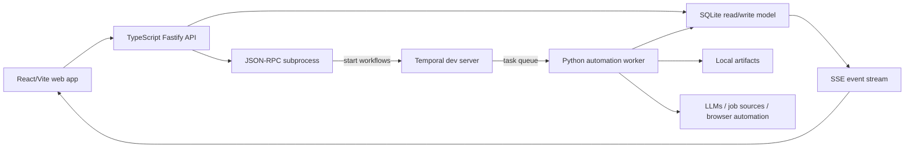

# Developer Guide

This guide points contributors through the current architecture and QA surfaces.
The top-level [README.md](../../README.md) is the public product overview; this
directory is for contributors who need to change behavior safely.

## Start Here

1. [Getting started](../user/getting-started.md) for the local stack.
2. [Configuration](../user/configuration.md) for runtime variables and local
   data boundaries.
3. [Architecture](../architecture.md) for the current runtime shape.
4. [Job pipeline architecture](../job-pipeline-architecture.md) for the
   workflow-by-workflow execution view with sequence and component diagrams.
5. [Local reliability QA](../local-reliability-qa.md) for regression ownership.

## Current Runtime Shape



The domain is organized around eight bounded contexts:

- Discovery
- Enrichment
- Profile
- Scoring
- Materials
- Apply
- Pipeline
- Operations / Read-Side

The React app mirrors those contexts under `apps/web/src/contexts/`. Views under
`apps/web/src/views/` compose context-owned hooks and components.

## Current Vs Historical Docs

- `docs/architecture.md` and `docs/job-pipeline-architecture.md` describe the
  implemented local architecture.
- `docs/ddd-target.md` and `docs/frontend-target.md` are canonical architecture
  references plus hosted-future seams.
- `docs/plans/implemented/` contains plan records and QA notes. Treat those as
  project history; current product behavior belongs in the canonical docs and
  live code.
- `openspec/` contains current and archived OpenSpec-style requirements. When a
  feature ships, sync the public docs so the archive is not the only
  discoverable source.

## Validation

Use focused checks while editing:

```bash
pnpm api:check
pnpm api:test
pnpm web:check
pnpm web:test
uv --project workers/automation run --extra dev pytest -q
```

Before publishing a broad change:

```bash
pnpm check
pnpm test
uv --project workers/automation run --extra dev python -m build workers/automation
git diff --check
```

For UI/product behavior, add a product-path QA step. For screenshot or
destructive QA, use a disposable seeded workspace.

## Documentation Changes

Update the owning doc when behavior changes:

- public behavior, setup, commands, config, or safety: README and `docs/user/`;
- API/SSE behavior: `docs/local-ts-api.md`;
- architecture or runtime ownership: `docs/architecture.md`;
- frontend architecture: `docs/frontend-target.md`;
- QA expectations: `docs/local-reliability-qa.md`;
- roadmap/backlog: `ROADMAP.md` for public direction, `docs/backlog.md` for
  detailed engineering tasks.
