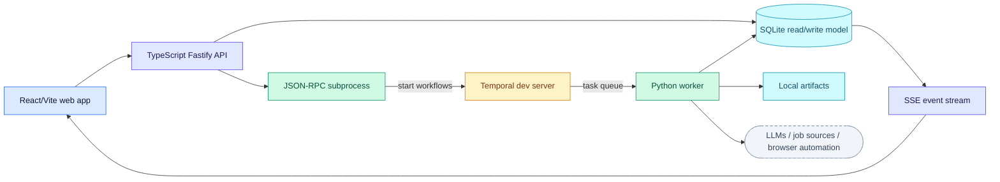

# Developer Guide

This guide points contributors through the current architecture and QA surfaces.
The top-level [README.md](../../README.md) is the public product overview; this
directory is for contributors who need to change behavior safely.

## Start Here

You are reading the overview of the sidebar's **Developer Guide** group. Start
with the repository's `CONTRIBUTING.md`, then work through the rest of the
group in order:

1. [Contributing](../../CONTRIBUTING.md) for the pull-request workflow, commit
   conventions, and the privacy rules every change must respect.
2. [Local development](../local-development.md) to install, run, and verify the
   full local stack.
3. [Reliability & QA](../local-reliability-qa.md) for the regression matrix and
   the local workflows that must stay covered.
4. [Security](security.md) for the trust boundary, apply-path containment, and
   secret/data hygiene rules.

Then the [System Architecture](../architecture/index.md) sidebar section takes
you from the runtime shape down through the pipeline, stage by stage.

::: tip Here to use JobHunter, not change it?
Start with the [User Guide](../user/getting-started.md) instead: it covers
setup, everyday flows, configuration, and exactly what data stays on your
machine — no contributor tooling required.
:::

## Current Runtime Shape



The domain is organized around eight bounded contexts:

- Discovery
- Enrichment
- Profile
- Scoring
- Materials
- Apply
- Pipeline
- Operations / Read-Side

The web app mirrors those contexts under `apps/web/src/contexts/`. Views under
`apps/web/src/views/` compose context-owned hooks and components.

## Current Vs Historical Docs

- `docs/architecture/` (with `pipeline/`) describes the
  implemented local architecture.
- `docs/architecture/domain-model/` and `docs/architecture/frontend/` are canonical architecture
  references plus hosted-future seams.
- `docs/plans/implemented/` contains plan records and QA notes. Treat those as
  project history; current product behavior belongs in the canonical docs and
  live code.
- `openspec/` contains current and archived OpenSpec-style requirements. When a
  feature ships, sync the public docs so the archive is not the only
  discoverable source.

## Validation

Use focused checks while editing:

```bash
pnpm api:check
pnpm api:test
pnpm web:check
pnpm web:test
uv --project workers/automation run --extra dev pytest -q
```

Before publishing a broad change:

```bash
pnpm check
pnpm test
uv --project workers/automation run --extra dev python -m build workers/automation
git diff --check
```

For UI/product behavior, add a product-path QA step. For screenshot or
destructive QA, use a disposable seeded workspace.

## Documentation Changes

Update the owning doc when behavior changes:

- public behavior, setup, commands, config, or safety: README and `docs/user/`;
- API/SSE behavior: `docs/local-ts-api.md`;
- architecture or runtime ownership: `docs/architecture/` (`runtime.md`, `index.md`);
- frontend architecture: `docs/architecture/frontend/`;
- QA expectations: `docs/local-reliability-qa.md`;
- roadmap/backlog: `ROADMAP.md` for public direction, `docs/backlog.md` for
  detailed engineering tasks.

## Documentation Standards

Every published page follows these rules. They exist so the site reads as one
document, stays approachable for non-engineers wherever it can, and never
breaks the links and § citations that code comments depend on.

### Audiences And Tiers

| Tier | Pages | Bar |
| --- | --- | --- |
| 1 — Everyone | Homepage, `docs/user/**` | No unexplained jargon. Every terminal command is followed by one plain sentence saying what it does. Screenshots and diagrams carry the page; text supports them. A reader who has never opened a terminal can still understand what the product does, what each stage means, and what data stays local. |
| 2 — Contributors | `docs/developer/**`, `docs/local-*.md`, and the section overview pages (`architecture/index.md` plus the three group `index.md` pages) | Technical but self-contained: expand acronyms on first use, open with a plain-language summary, link down to Tier 3 for depth. |
| 3 — Deep dives | The remaining `architecture/**` pages, `requirements.md`, `decisions.md` | Precision over simplicity — but still template-conformant: summary first, diagram for structural topics, stable § headings. |

The primary audience is technical. The plain-language bar exists to remove
*unnecessary* jargon and unexplained shorthand, not to dilute precision:
Tier 2–3 pages should read like engineering documents written by someone who
wanted them understood.

### Page Template

Every page opens with:

1. An H1 title that matches its sidebar label (a group's `index.md` uses the
   group name — "Job Pipeline", not "Overview").
2. A 1–3 sentence plain-language summary of what the page covers.
3. On Tier 2–3 pages where the audience is not obvious, a one-line
   "**Read this if**" naming the question the page answers.

Structural topics (process shapes, data flow, schemas, module layouts) show a
diagram before long prose. Reference detail — exhaustive tables and lists —
goes last.

### Content Ordering

Sections, section `index.md` reading paths, and the sidebar in
`docs/.vitepress/config.ts` all follow **reader-journey order**: the sequence
of questions a newcomer asks — what is it → how do I use or run it → what does
it do → how does each part work → where does data live → how do I operate it →
how is it designed → reference lookup. Keep the three surfaces in sync when
adding a page. User-guide pages show only the user navigation; developer and
reference sections remain available elsewhere and default to collapsed until
opened or active.

### Terminology

Use the canonical term everywhere; introduce it once per page with its long
form when the tier calls for it.

| Canonical | Avoid | First use (Tier 1–2 pages) |
| --- | --- | --- |
| the TypeScript API | TS API, local API, product API | "the local TypeScript API (the process the web app talks to)" |
| the Python worker | automation worker, JobHunter worker | "the Python worker (a Temporal worker process that executes workflows)"; "Temporal worker" is reserved for that parenthetical |
| the web app | web UI, React app, frontend app | "frontend" stays correct for the architecture layer ("frontend architecture") |
| Temporal | — | "Temporal (the workflow engine)" |
| the JSON-RPC bridge | — | the TS↔Python protocol; bare "JSON-RPC" is fine after first use |
| Server-Sent Events (SSE) | — | expand on first use per page, then "SSE" |
| read model (noun), read-model (adjective) | — | "the read model"; "read-model projections" |
| Discover, Enrich, Score, Materials, Apply | — | capitalized when naming pipeline stages; lowercase as ordinary verbs |
| a dry run (noun), dry-run (adjective) | "Dry-Run Apply" as a standalone name | "rehearse with a dry run"; a recommended rehearsal, never described as an enforced prerequisite |
| approval gates; approve a submission | consent gates, sign-off | the user-facing name for the apply gate model; the recorded decision is `approve_submit` |
| a live submission | live apply (as a noun) | the real, non-dry-run application submit |
| the apply agent | apply bot, apply worker | the Claude apply-runtime subprocess that drives the browser ("apply-worker state" remains the on-disk directory name) |

### Diagrams

- Mermaid only. Every diagram is preceded or followed by one sentence saying
  what to notice in it.
- `flowchart LR` for pipelines and data flow, `flowchart TD` for layered
  stacks, `sequenceDiagram` for call flows, `erDiagram` for schemas. Prefer
  `TD` once a flowchart passes ~8 nodes: the text column is narrow, and wide
  LR ribbons scale down to unreadable.
- Global colors, typography, and spacing come from the theme layer —
  `docs/.vitepress/theme/mermaid-theme.ts` owns curated light **and** dark
  palettes and `MermaidRenderer.vue` applies them per color mode. Never
  hard-code page-level mermaid init or `%%init%%` blocks.
- Structural flowcharts color nodes with the shared semantic classes, exactly
  as the system map on `architecture/index.md` (the reference implementation)
  defines them: `ui` (blue — browser/user surfaces), `ts` (indigo —
  TypeScript services), `py` (emerald — Python side), `infra` (amber —
  Temporal), `store` (cyan — SQLite, files, caches), `ext` (slate, dashed —
  outside services). Persistent stores render as cylinders `[( )]`, external
  services as stadiums `([ ])`. Include only the classes a diagram uses, and
  class every node.
- Never put `;` inside sequence-diagram message text — it is a statement
  separator and silently blanks the diagram. Mermaid renders client-side, so a
  broken diagram still builds; check edited diagrams in `pnpm docs:dev`.
- Diagrams state only facts already verified on the page or in code. No
  aspirational boxes.

### Callouts

- `::: tip` for guidance and shortcuts.
- `::: warning` for safety boundaries, destructive actions, and spend.
- `::: info` for context and history.
- At most about two callouts per screen of text; a page of callouts is a page
  of noise.

### Frozen Surfaces

- **URLs never change.** Published paths are cited by code comments, PRs, and
  external links. Improve titles and sidebar labels instead.
- **§-numbered headings stay** in `architecture/domain-model/**` (§1–§11) and
  `architecture/frontend/**` (§1–§15): `packages/domain-types` comments and
  AGENTS.md cite them.
- Historical records (`docs/plans/implemented/**`, `docs/incidents/**`,
  `openspec/**`) keep their original wording, including stale link titles.

### Verification

`pnpm docs:build` runs VitePress's strict dead-link check plus the
emitted-href gate (`scripts/check-docs-site-links.mjs`). Both must pass before
review. `pnpm docs:check:runtime` then boots a fresh preview of the dist and
asserts in a real browser that pages hydrate: no failed asset requests, every
diagram page renders a mermaid SVG, aria-current is set, and screenshots load.

::: warning Rebuilds invalidate running previews
`vitepress preview` (sirv) snapshots the dist's file list at boot. Rebuilding
while a preview is running leaves it serving HTML whose hashed chunks 404 —
pages then render with zero JavaScript (blank diagrams, no console errors).
Always restart the preview after a rebuild, and never rebuild under a preview
someone is relying on.
:::
