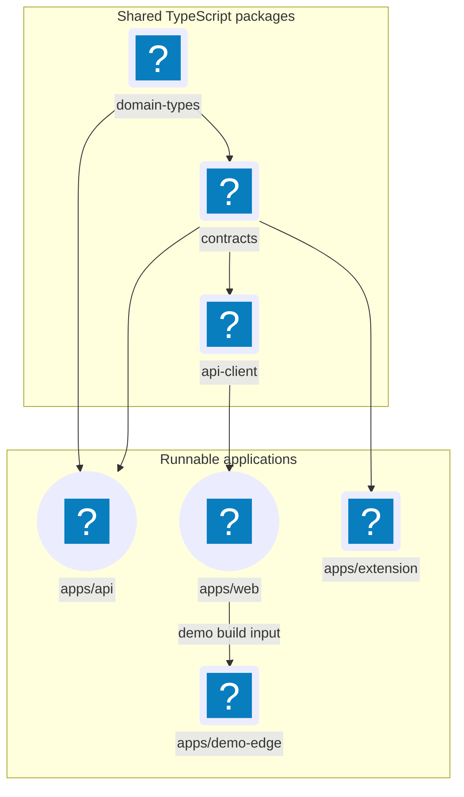

# Repository & Ownership Map

JobCtrl is a TypeScript workspace beside a separately packaged Python
automation runtime, plus native distribution and browser surfaces. This page
maps each production concern to one source owner so contributors can start at
the deciding boundary instead of following a screen name across the tree.

**Read this if** you know what behavior should change but not which directory
or layer owns it.

## Source Shape

Solid arrows point from a shared package to the code that imports it. Runtime
traffic is intentionally absent; it belongs to the
[System Overview](../architecture/index.md) and
[Runtime & Processes](../architecture/runtime.md).

## Top-Level Owners

| Path | Owns | Does not own |
| --- | --- | --- |
| `apps/web/` | React/Vite product UI, routes, view composition, frontend contexts, ports, adapters, cache invalidation, stories, and browser tests | Server truth, SQLite writes, raw `fetch` policy in feature code, or workflow execution |
| `apps/api/` | Fastify routes, loopback and mutation security, REST semantics, read/write mapping, projection refresh, SSE framing, and the TypeScript side of JSON-RPC | LLM/browser automation or direct Temporal workflow definitions |
| `apps/extension/` | The Manifest V3 capture and assisted-autofill client, its loopback API client, local queue, and extension-specific privacy tests | Arbitrary remote API access or application submission authority |
| `apps/demo-edge/` | The deployment-gated demo edge API, consented measurement contract, and retention worker | Local product data, production automation, or the local API contract |
| `workers/automation/` | The `jobctrl` Python package: CLI, JSON-RPC server, domain model, SQLite adapters, Temporal workflows/activities, provider calls, discovery, materials, and apply execution | Browser-facing HTTP routes or web state |
| `packages/domain-types/` | Selected TypeScript domain vocabulary: identifiers, shared states, the TypeScript domain-event union, and projection shapes consumed across packages | Python aggregate behavior and invariants, I/O, REST transport, or SQLite rows |
| `packages/contracts/` | Shared REST request/response schemas and DTOs, enums used on the wire, and TypeScript JSON-RPC envelopes/method schemas | Fetch behavior, route registration, or domain-event ownership |
| `packages/api-client/` | Typed HTTP calls, URL/query encoding, request timeouts, and API error behavior | Business validation or server-side routing |
| `packages/tsconfig/` | Shared TypeScript compiler presets | Product behavior |
| `launcher/` | Native `jobctrl` supervisor/installer, instance identity, release selection, update, rollback, and installed lifecycle | Source-development supervision or domain commands themselves |
| `packaging/distribution/` | Machine-readable payload, component, capability, provider-pack, signing, and redistribution contracts | Runtime business behavior |
| `scripts/` | Source-stack supervision and repository-level build, release, documentation, privacy, and contract checks | A second home for domain logic |
| `.github/workflows/` | CI, publication, deployment, and protected release orchestration | Locally reproducible product behavior |
| `docs/` | Canonical user, contributor, architecture, API, requirement, decision, QA, and delivery records | Implementation authority when documentation and current code diverge |

## Inside The Runnable Boundaries

### The TypeScript API

| Surface | Owner |
| --- | --- |
| Route registration and HTTP status/security behavior | `apps/api/src/server.ts` plus focused route modules |
| API DTO/schema import surface | `apps/api/src/contracts.ts`, re-exporting `@jobctrl/contracts` |
| Projection-backed query mapping | `apps/api/src/read-model.ts` |
| Simple local state transitions and canonical TS writes | `apps/api/src/write-model.ts` and the owning focused modules |
| TypeScript projection materialization | `apps/api/src/projections.ts` |
| TS-to-Python dispatch | `apps/api/src/json-rpc-adapter.ts` |
| Server-Sent Events (SSE) framing and replay | `apps/api/src/event-stream.ts` |

The API may host pure, low-latency state transitions. JSON-RPC methods divide
into synchronous provider-backed calls and workflow-start calls; only the latter
ask the Python side to start Temporal. Some TypeScript use cases also persist
canonical queued intent or stage state around that dispatch. Those rows record
product intent and visibility—they are not a second Temporal queue.

### The Web App

| Surface | Owner |
| --- | --- |
| Domain-owned UI behavior | `apps/web/src/contexts/<context>/` |
| Page composition and view-local ephemeral state | `apps/web/src/views/<view>/` |
| Routes and URL composition | `apps/web/src/routes/` |
| Browser capability abstractions | `apps/web/src/shared/ports/` |
| Local implementations of those ports | `apps/web/src/shared/adapters/local/` |
| Cross-context event invalidation | `apps/web/src/contexts/operations/invalidation-router.ts` |
| Deployment-gated demo client behavior | `apps/web/src/demo/` |

Views compose contexts. A context does not import a view, and feature code goes
through ports instead of calling browser globals or the API client directly.
The full rules live in [Frontend Architecture](../architecture/frontend/index.md).

### The Python Runtime

| Surface | Owner |
| --- | --- |
| Aggregates, value objects, use cases, and domain events | `workers/automation/src/jobctrl/domain/<context>/` and `domain/events/` |
| Driven capability interfaces | `workers/automation/src/jobctrl/domain/ports/` |
| SQLite, provider, browser, network, projection, and Temporal adapters | `workers/automation/src/jobctrl/infrastructure/` |
| Registered workflows and activities | `workers/automation/src/jobctrl/infrastructure/temporal/registry.py` plus context workflow/activity modules |
| Human-facing driving adapter | `workers/automation/src/jobctrl/cli.py` |
| API-facing driving adapter | `workers/automation/src/jobctrl/infrastructure/rpc/` |

Domain modules do not own database or provider mechanics. Repositories and
other adapters translate between domain values and physical storage or
external capabilities.

## Start A Change At Its Owner

| Change | Start here | Then check |
| --- | --- | --- |
| Python aggregate state or invariant | Owning module under `workers/automation/src/jobctrl/domain/` | TypeScript mirror when the concept crosses runtimes, persistence adapters, and every consumer |
| Shared TypeScript identity, state, projection, or event vocabulary | `packages/domain-types/` | Matching Python mirror where applicable, parity coverage, and every consumer |
| REST request/response shape | `packages/contracts/src/schemas.ts` | API route, API client, web consumer, focused API docs |
| JSON-RPC method or envelope | `packages/contracts/src/rpc.ts` | Python `domain/rpc/messages.py`, dispatcher, adapter, tests |
| HTTP status, auth/origin rule, or route behavior | `apps/api/` | Contract schema and API reference |
| Heavy or durable command | Owning Python use case/workflow | JSON-RPC registration, workflow visibility, projections |
| Canonical database fact | Owning repository/write module and schema initialization | Event emission, projections, storage docs, migration compatibility |
| Projection field | Canonical source first, then Python/TS projection owners | DTO, API mapping, parity fixture, web invalidation |
| UI mutation or rendering | Owning `apps/web/src/contexts/` module | Operations read hook, composing view, story/a11y/product-path QA |
| Extension capture/autofill | `apps/extension/` | Loopback API capability route and privacy boundary |
| Installed lifecycle or payload | `launcher/`, `packaging/distribution/`, and matching `scripts/distribution-*` | Release workflow and distribution contract |
| Documentation | The canonical owner in [Documentation Standards](documentation-standards.md) | Index/sidebar/link consistency and docs verification |

## Boundary Rules

- Do not copy a domain type into a route, component, or database helper. Import
  the logical type and translate only at a real boundary.
- Do not put fetch behavior in `packages/contracts` or business validation in
  `packages/api-client`.
- Do not treat a projection row as a write model. Change the canonical owner,
  emit the event when appropriate, then rebuild the projection.
- Do not make the TypeScript API enqueue Temporal work directly. The local API
  dispatches JSON-RPC; the Python runtime owns workflow startup.
- Keep test ownership next to the surface where practical: API tests under
  `apps/api/test`, frontend tests colocated or under `apps/web/e2e`, package
  tests inside the package, and Python tests under `workers/automation/tests`.

## Future Architecture (Not Implemented)

Hosted Postgres, object storage, queue/outbox, managed Temporal, and hosted API
adapters are evolution seams documented under the
[Backend Domain Model](../architecture/domain-model/index.md) and its
[cloud evolution](../architecture/domain-model/cloud.md). They are not a second
production tree today. This map describes the current local and bundled source
owners only.
