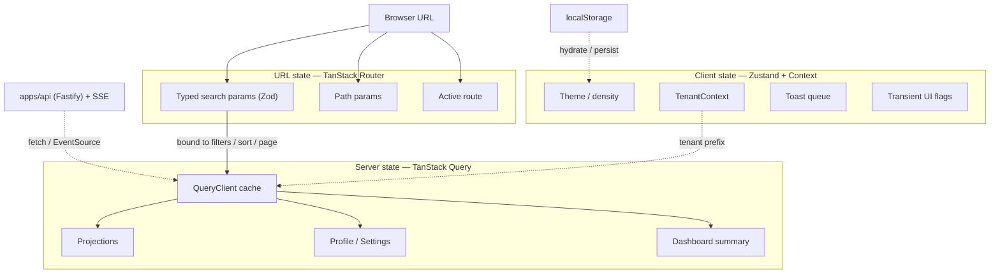
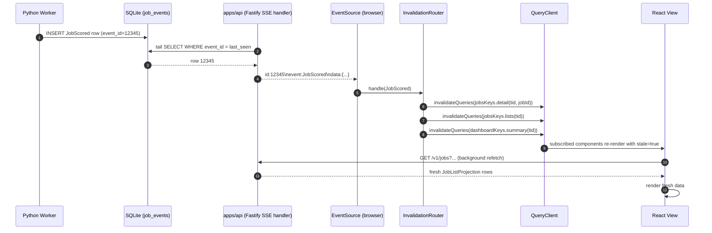
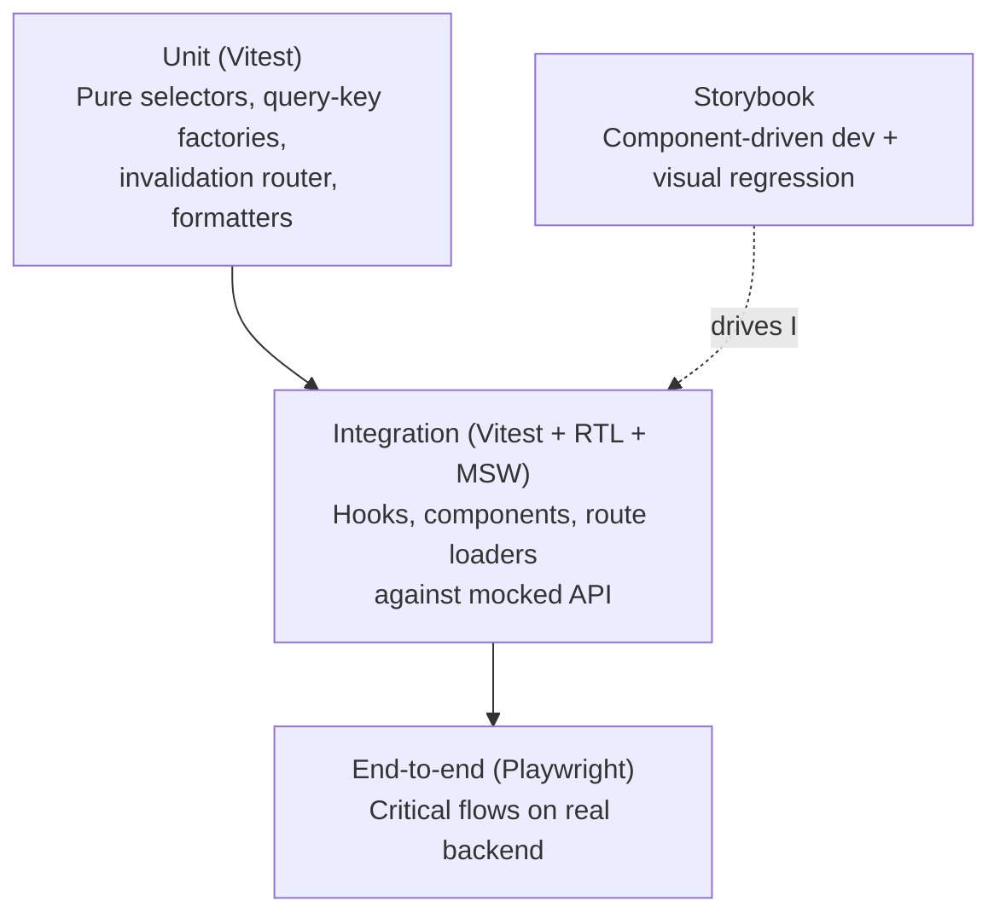
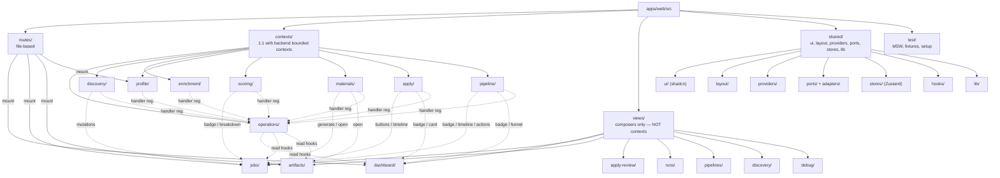

# Frontend Architecture

## 1. Purpose & Non-Goals

### Purpose

This document defines the **canonical architecture** for the
JobHunter web frontend (`apps/web`). It is the architectural twin of
[`docs/ddd-target.md`](ddd-target.md) — where the backend doc models bounded
contexts, aggregates, ports, and adapters for the Python worker and the TS
API, this doc models the React/TypeScript single-page application that sits
in front of them.

The frontend is organized around TanStack Router, TanStack Query, TanStack
Table, TanStack Form, shadcn/Radix primitives, context-owned hooks/components,
and an SSE-fed invalidation router. This document describes the implemented
architecture and the hosted-future extension points that must stay intact as the
web app evolves.

This doc is the authoritative reference for:

- The **three layers of state** (server, URL, client) and the rules that
  decide what goes where.
- **Frontend bounded contexts** that mirror the backend's eight contexts and
  share the same ubiquitous language end-to-end.
- **Frontend ports** — the hexagonal seams that decouple feature code from
  the API client, the event stream, persistence, and the host environment.
- **Query-key conventions, route shapes, hook conventions, form patterns,
  primitives** per bounded context.
- **Realtime architecture** — the SSE consumer pattern and the
  `GET /v1/events/stream` endpoint contract that `apps/api/` must expose for
  the frontend to consume.
- **Cross-context invalidation** — how a mutation in one context fans out to
  query-cache invalidations in others, and how SSE events drive the same fan-out.
- **Cloud evolution paths** with explicit **fitness functions** (TanStack
  Start for SSR, AuthProvider for hosted auth, multi-tenant query-key
  prefixing, audit-log streaming, RSC, CDN-cached projection reads).
- **The testing pyramid** — Vitest + React Testing Library + MSW for
  hooks/components, Playwright for end-to-end critical flows, Storybook for
  component-driven development.
- **The folder shape**, mirrored to backend bounded contexts.

Every choice includes rationale so a senior frontend engineer joining the
project can re-derive the decision independently.

**Cloud is the eventual target.** The frontend, like the backend, is built
local-first but designed for hosted multi-tenant deployment. `TenantId` is
first-class in the frontend domain language; local mode uses singleton
`LOCAL_TENANT`, and hosted mode will resolve it from auth context. Section 9
names every cloud adapter with a fitness function — it is not "compatibility,"
it is the target deployment model.

### Non-Goals

- **Project history.** This document does not prescribe delivery ordering, file
  moves, PR sequencing, or cutover scripts. Plan records live under
  `docs/plans/`.
- **Implementation listing.** Pseudocode and TypeScript signatures appear where
  they aid clarity; this document is not a generated inventory of production
  `.tsx`, tests, package scripts, or Vite configuration.
- **Delivery sequencing.** This document models the architecture, not branch
  order, rollout sequencing, or dual-mount compatibility paths.
- **Visual design / copy / iconography choices.** This doc constrains the
  *primitives* (shadcn/ui + Radix) and the *layout system* (Tailwind), not
  the visual identity, design tokens, or copy.
- **Accessibility audits beyond Radix defaults.** shadcn/ui copies Radix
  primitives that ship with WAI-ARIA semantics, focus management, and
  keyboard navigation. Beyond that, accessibility is an explicit out-of-scope
  in this doc — though the testing strategy (§10) names where accessibility
  assertions live when they are added.
- **Internationalization (i18n).** Single-user, English-only. The doc does
  not name a string-extraction library or a locale provider. The
  `@jobhunter/contracts` boundary is where translation would later wrap.
- **Native / mobile / desktop wrappers.** The architecture targets a browser
  SPA. A Tauri / Electron wrapper is *not* an architectural decision this
  doc preempts: every I/O path goes through a port (§6), and `OpenInOsPort`
  already absorbs the OS-integration concern, so a future Tauri wrap is
  unblocked by construction. No fitness function is documented because the
  architecture's only "Tauri" obligation is "do not preempt it" — and that
  obligation is already discharged by the port discipline.
- **Deployment topology.** CDN choice, asset hosting, build pipeline — these
  are infrastructure concerns. The doc names what the frontend *needs* from
  hosting (cache headers for chunks, presigned-URL access to artifacts) but
  does not specify the hosting platform.
- **Performance budgets.** Bundle-size targets, TTI thresholds, and
  Lighthouse scores live in QA gates, not here.

---

## 2. Modeling Principles

### 2.1 The Three Layers of State

Every piece of state in the application lives in **exactly one** of three
layers. Mixing layers is the single largest source of complexity in the
current `App.tsx`. The target architecture enforces strict separation.

| Layer | Owner | Lifetime | What lives here |
|---|---|---|---|
| **Server state** | TanStack Query cache | Until invalidated or GC'd | Anything fetched from `apps/api/` — projections, profile, settings, credentials, dashboard summary. |
| **URL state** | TanStack Router (typed search params) | The current URL | Anything bookmarkable / shareable / restorable on refresh — current view, filters, sort order, page index, page size, selected job key, drawer open/close. |
| **Client state** | Zustand stores + React context | Process lifetime (with `localStorage` persist where appropriate) | Theme, density, tenant context, transient UI like toast queue, ephemeral form drafts that do not survive navigation. |



**Rules:**

1. **No server data in `useState`.** If it came from the API, it lives in
   the Query cache. Period.
2. **No filter / pagination / sort / drawer state in `useState`.** If
   refreshing the page should preserve it, it lives in a typed search param.
3. **No durable user preferences in component-local state.** Theme, density,
   and similar belong in Zustand with `persist` middleware.
4. **One source of truth per fact.** A field never lives in two layers
   simultaneously. URL state binds the fetch parameters; the cache owns the
   fetched result; the component reads both via hooks.
5. **Components consume state through hooks, never raw stores.** Every
   layer exposes domain hooks (`useJobsQuery(filters)`,
   `useJobsSearch()`, `useTheme()`). Components do not import the
   `QueryClient`, the router store, or a Zustand store directly.

The current `App.tsx` violates all five rules. The target eliminates these
violations by construction: the layer separation makes a violation
syntactically obvious in code review.

### 2.2 Bounded-Context Mirroring

The frontend folder structure, ubiquitous language, and query-key
factories **mirror the backend's eight bounded contexts** defined in
`docs/ddd-target.md` §3 — one frontend folder per backend context, no
substitutions, no inventions:

| Backend context | Frontend folder | Hooks / components owned by the context | View surfaces (composers) where it appears |
|---|---|---|---|
| Job Discovery | `contexts/discovery/` | Job lifecycle mutations (delete / hide / unhide / restore / permanent-delete, bulk), `useImportJobMutation` (stub — throws `NotImplementedError` until the backend endpoint lands), discovery-settings + source-registry / quarantine / manual-capture / feedback mutations; `<DiscoveryProductControls>` | Jobs view (bulk controls), Discovery view (source + schedule admin) |
| Job Enrichment | `contexts/enrichment/` | `useEnrichmentRetryMutation` (stub — throws `NotImplementedError` until the backend endpoint lands), `useRefreshCompensationMutation` / `useRefreshAllCompensationMutation`; compensation-evidence components; enrichment/compensation invalidation handlers | Jobs view + Apply Review (compensation audit) |
| Candidate Profile | `contexts/profile/` | `useProfileQuery`, `useUpdateProfileMutation`, `useImportResumeMutation`, settings + credentials hooks, profile-import wizard store | `/profile`, `/settings` routes |
| Scoring | `contexts/scoring/` | `<ScoreBadge>`, `<ScoreStalenessBadge>` (plus `<ScoreBreakdown>`, built/tested but not yet composed by a view); `useCorrectScoreMutation` (shipped), `useRescoreJobMutation` / `useRescoreCurrentPolicyMutation`, `useResetStaleScoresForRescoreMutation` | Jobs view (score column + audit-triage drawer + rescore/correct) |
| Materials Generation | `contexts/materials/` | `useGenerateMaterialsMutation`, `useOpenArtifactMutation` (artifacts are owned by `MaterialsSet`) | Jobs view (Generate button), Artifacts view (open in OS) |
| Apply Automation | `contexts/apply/` | `useApplyJobMutation`, `useDryRunApplyMutation`, `useCancelApplyMutation`, `<ApplyRunTimeline>`, `<ApplyButton>`, `<ApplyHistory>` | Jobs view (per-row + drawer), Dashboard view (apply-runs card) |
| Pipeline Orchestration | `contexts/pipeline/` | `useRetryStageMutation`, `useCancelStageMutation`, `useMarkAppliedMutation`, `useMarkSkippedMutation`; `<StageBadge>`, `<StageTimeline>`, `<JobActions>` | Jobs view, Dashboard view (funnel) |
| Operations / Read-Side | `contexts/operations/` | All projection-typed read hooks (`useDashboardSummaryQuery`, `useJobsListQuery`, `useJobDetailQuery`, `useArtifactsListQuery`, `useArtifactDetailQuery`, `useApplyRunsListQuery`, `useWorkflowRunsListQuery`, `useApplyReviewQueueQuery`, activity/outcomes/health reads, …); query-key registry; SSE subscription; invalidation router | Every view (provider of all read data) |

**Views are NOT bounded contexts.** The user-facing surfaces are *view
composers* — today there are eight of them under `views/` (sibling of
`contexts/`, see §11): `dashboard/`, `jobs/`, `artifacts/`, `apply-review/`,
`runs/`, `pipelines/`, `discovery/`, and `debug/`. Each consumes read hooks
from `contexts/operations/` plus mutation hooks from the appropriate
aggregate contexts. Naming the table-and-drawer
surface "Jobs" matches user vocabulary; the *bounded contexts* it spans
are Discovery, Enrichment, Scoring, Materials, Apply, Pipeline, and
Operations — every one of which already exists as its own folder. The
backend's `JobListView`, `JobDetailView`, `ArtifactListView`, and
`DashboardSummary` are **projections of the Operations context** per
`ddd-target.md` §3.8 — they are read shapes that flow through
`contexts/operations/`; promoting them to "frontend bounded contexts"
would be an ontological category error.

**Why mirror.** When the backend says "JobScored" and the frontend says
"score updated," the team carries two glossaries. When both say
"JobScored" the team carries one. The cost of agreement is a few extra
folders (including `discovery/` and `enrichment/`, which expose minimal
surface today but are kept as folders to make their existence — and
their place in the integration map — discoverable). The benefit is
end-to-end ubiquitous language and a one-to-one mapping between every UI
feature and the backend contract that powers it.

**The frontend invents no new domain language.** A "tab" or "view" is a
*presentation* concept; it never replaces a domain term. The Jobs tab
*displays* `JobListProjection` rows produced by the Operations context
on top of the canonical aggregates owned by Discovery, Enrichment,
Scoring, Materials, Apply, and Pipeline. The view file lives at
`views/jobs/JobsView.tsx`; its data hook is
`useJobsListQuery()` from `contexts/operations/`; its delete-button
mutation is `useDeleteJobMutation()` from `contexts/discovery/`; its
score badge is `<ScoreBadge>` from `contexts/scoring/`; its stage badge
is `<StageBadge>` from `contexts/pipeline/`. The composition is in the
view; the language stays domain.

**View composition pattern.** A view file imports *components* and *hooks*
from contexts and assembles them. It does not own its own query keys, it
does not own mutations, it does not own state stores beyond ephemeral UI
(bulk-selection set, etc.). A context never imports another context's
hooks or stores; cross-context coordination happens in either (a) the
view that composes them or (b) the invalidation router (§7.4) for cache
fan-out.

### 2.3 Evolutionary Architecture (Frontend Edition)

The same meta-principle that governs the backend (`docs/ddd-target.md` §2)
governs the frontend: **cloud-mode adapters are named-not-built; local-mode
stays simple but every choice has a clear seam.**

> Evolutionary architecture means the next adapter is *named* (so the team
> knows what swap is coming and the seam is shaped for it), not *built*
> (so the codebase carries no speculative complexity). Adapter swaps keep one
> active implementation per seam unless an explicit compatibility path is part
> of the product contract.

| Principle | How the frontend applies it |
|---|---|
| **Name the evolution, do not pre-build it** | Every frontend port (§6) names a hosted adapter with concrete technology (e.g., `EventStreamPort` → `SseEventStreamAdapter` today, `WebSocketEventStreamAdapter` if SSE proves limiting). The hosted adapter is documented but not implemented until its fitness function fires. |
| **Local-mode adapters stay simple** | The local `ApiClientAdapter` does not carry tenant-resolution-from-JWT logic, retry-with-backoff with circuit breaking, or distributed tracing. It accepts `TenantId` as input, calls fetch, and returns the parsed body. Cloud machinery is absent until needed. |
| **Fitness functions trigger evolution** | Every cloud claim in §9 has a concrete, testable trigger ("when the dashboard load latency exceeds 200 ms p50 with cold cache" → SSR / TanStack Start; "when more than one user can sign in" → AuthProvider). Calendar dates do not trigger evolution. |
| **Independent context evolution** | Each frontend context can swap its query-cache strategy, its primitives, or its event subscription without touching the others. A spike on virtualized tables in `views/jobs/` does not affect `contexts/profile/`. |

### 2.4 Data-Orientation (Hickey / Wlaschin)

The Python and TypeScript domain layers already follow data-orientation:
immutable values, discriminated unions for state, pure functions for
transforms (`docs/ddd-target.md` §2). The frontend extends the same
discipline:

- **Immutable values over mutable objects.** Every projection type
  (`JobListProjection`, `DashboardProjection`, etc.) is `readonly` end to
  end. Component state derived from a projection is also `readonly`. No
  mutating array methods on cached data.
- **Make illegal states unrepresentable.** `StageState` is already a
  discriminated union in `@jobhunter/domain-types/pipeline.ts`. The
  frontend uses **exhaustive `switch`** on `state.kind` to render stage
  badges; an unhandled state is a TypeScript error at compile time, not a
  runtime fallback.
- **Pure functions transform data.** Selectors that derive
  presentation-shaped data from projections (e.g., grouping artifacts by
  job) are **pure functions** in `selectors.ts` files. They are unit-tested
  in isolation; they have no React dependency; they compose.
- **No data-binding via mutation.** Forms (TanStack Form) accept the
  current value and emit a new value; they never mutate a `useState` array
  in place. The Materials Generation flow does not "mark the job as
  re-tailored" by patching a cached row — it fires a mutation that the SSE
  stream invalidates.

### 2.5 Strict TypeScript

The repo already uses TypeScript ^6 with strict mode (`apps/web/tsconfig.json`
extends the workspace base). The target frontend goes further:

- **`exactOptionalPropertyTypes: true`.** Optional fields are not
  silently assignable to `undefined`; absence and presence are distinct.
- **`noUncheckedIndexedAccess: true`.** Every `arr[i]` is `T | undefined`
  in the type system; bug class eliminated.
- **No `any` in feature code.** Adapter boundaries (e.g., the response of
  `fetch` before parsing) are `unknown`; everything inside a context is
  fully typed.
- **Route-level Zod schemas.** Every route's typed search params are
  declared with a Zod schema; the search-param type is *inferred* from the
  schema, never declared by hand. (Resolves §6 question 13.)
- **`@jobhunter/domain-types` is the source of truth.** No domain shape is
  re-declared in `apps/web/`. If `JobListProjection` changes, the frontend
  rebuilds against the new type and the compiler points at every mismatch.

---

## 3. Strategic Design — Frontend Bounded Contexts

The frontend's contexts are a **conformist** projection of the backend's
contexts (in the DDD sense): the frontend consumes the backend's
ubiquitous language as-is and does not push back against the shape.
There is **one frontend context folder per backend context** — Discovery,
Enrichment, Profile, Scoring, Materials, Apply, Pipeline Orchestration,
Operations. Views (Dashboard, Jobs, Artifacts, Apply Review, Runs,
Pipelines, Discovery, Debug) are **not** contexts; they are composers that
live under `views/` (§3.10, §11).

### 3.1 Frontend Context Map

```mermaid
graph TB
    subgraph "Frontend bounded contexts (1:1 with backend)"
        DSC["discovery/<br/>job lifecycle + import mutations,<br/>source-registry admin"]
        ENR["enrichment/<br/>retry + compensation refresh,<br/>compensation-evidence UI"]
        PRO["profile/<br/>profile + settings + credentials<br/>+ resume-import wizard"]
        SCO["scoring/<br/>badge / breakdown / staleness<br/>correction + rescore"]
        MAT["materials/<br/>generate materials,<br/>open artifact"]
        APP["apply/<br/>apply / dry-run / cancel,<br/>apply-run timeline"]
        PIP["pipeline/<br/>retry / cancel / mark-applied / mark-skipped<br/>+ stage badges + timeline"]
        OPS["operations/<br/>read hooks, query-key registry,<br/>SSE subscription, invalidation router"]
    end

    subgraph "View composers (NOT bounded contexts)"
        VD["views/dashboard/<br/>KpiGrid, ConversionPanel, Funnel,<br/>SourceHealthCard, ApplyRunsCard"]
        VDBG["views/debug/<br/>DebugActivityTable, FilterBar, ActivityDrawer"]
        VJ["views/jobs/<br/>JobsTable, FilterBar, BulkActions, DetailDrawer"]
        VA["views/artifacts/<br/>ArtifactsTable, FilterBar, DetailPanel"]
        VAR["views/apply-review/<br/>review queue + Plate resume editor"]
        VRUN["views/runs/<br/>workflow runs table + drawer"]
        VPIP["views/pipelines/<br/>StageTriggerPanel"]
        VDISC["views/discovery/<br/>sources + schedule settings"]
    end

    subgraph "Routes (URL → typed search params)"
        RD["/dashboard"]
        RDBG["/debug (+/activity/$eventId)"]
        RJ["/jobs + /jobs/$jobId (+/run/$runId)"]
        RA["/artifacts + /artifacts/$artifactId"]
        RP["/profile (+/import wizard)"]
        RPREF["/preferences"]
        RS["/settings (+/credentials)"]
        RAR["/apply-review"]
        RRUN["/runs (+/$runId)"]
        RPIP["/pipelines"]
        RDISC["/discovery"]
    end

    subgraph "Shared kernel"
        UI["shared/ui — primitives (shadcn/Radix)"]
        LY["shared/layout — AppShell, Topbar, Nav"]
        PR["shared/providers — Ports, Tenant, Query, Theme, Density, Toaster"]
        STO["shared/stores — Zustand (UI prefs, toasts, cmd palette)"]
        PORT["shared/ports — ApiClientPort, EventStreamPort, SessionPort, ..."]
        LIB["shared/lib — formatters, cn(), createOptimisticMutation"]
    end

    RD --> VD
    RDBG --> VDBG
    RJ --> VJ
    RA --> VA
    RP --> PRO
    RPREF --> PRO
    RS --> PRO
    RAR --> VAR
    RRUN --> VRUN
    RPIP --> VPIP
    RDISC --> VDISC

    VD --> OPS
    VD --> APP
    VD --> PIP
    VJ --> OPS
    VJ --> DSC
    VJ --> SCO
    VJ --> MAT
    VJ --> APP
    VJ --> PIP
    VJ --> ENR
    VA --> OPS
    VA --> MAT
    VAR --> OPS
    VAR --> APP
    VAR --> MAT
    VAR --> ENR
    VRUN --> OPS
    VRUN --> PIP
    VPIP --> PIP
    VDISC --> DSC
    VDISC --> PRO

    DSC --> OPS
    ENR --> OPS
    PRO --> OPS
    SCO --> OPS
    MAT --> OPS
    APP --> OPS
    PIP --> OPS

    OPS --> PORT
    VD --> UI
    VJ --> UI
    VA --> UI
    PRO --> UI

    PORT -.->|"adapters"| BE["apps/api (Fastify)"]
    PORT -.->|"adapters"| SSE["GET /v1/events/stream (implemented)"]
```



The diagram reads top-down:

- **Routes** translate URL state into the inputs that views and hooks consume.
- **View composers** (`views/dashboard/`, `views/jobs/`, `views/artifacts/`)
  are the only place that imports from multiple contexts. They own
  layout, not data dependencies.
- **Frontend bounded contexts** (`contexts/<name>/`) are the canonical
  surface for each backend context; they own their own hooks,
  components, mutations, and (for Operations) read queries.
- **Operations** is the read-side kernel: the query-key registry, the
  projection-typed read hooks, the SSE subscription, the invalidation
  router. Every other context depends on it for read access; no other
  context owns read queries.
- **Shared kernel** holds primitives, layout, providers, stores,
  formatting helpers, and the **frontend ports** (§6) that abstract the
  API client and event stream.

### 3.2 Job Discovery (Frontend)

**Backend mirror:** Job Discovery (`docs/ddd-target.md` §3.1, §4.1, §5.1).

**Purpose:** Surface the user-facing affordances over the `Job` aggregate
and the discovery-source registry — deleting (soft-delete tombstone),
hiding, restoring, and permanently deleting jobs from any view; manually
importing a job by URL; and administering discovery sources, schedules,
quarantine, the manual-capture queue, and discovery feedback.

**Ubiquitous language** (matches backend):
- **Job** — the `Job` aggregate root identified by `(TenantId, JobId)`.
- **JobId** — the system-generated stable identifier (per
  `ddd-target.md` §3.1 / §4.1).
- **PostingUrl** — the original source URL.
- **Source** — the board / employer site.
- **Employer** — the hiring company (distinct from `Source`).

**Responsibilities:**
- Wrap the discovery-context write-side endpoints in mutation hooks:
  `useDeleteJobMutation`, `useDeleteJobsBulkMutation`,
  `usePermanentlyDeleteJobsBulkMutation`, `useHideJobsBulkMutation`,
  `useUnhideJobsBulkMutation`, `useRestoreJobMutation`,
  `useRestoreJobsBulkMutation`, and `useImportJobMutation` (import-by-URL;
  a stub that throws `NotImplementedError` until the backend endpoint lands).
- Own discovery-source administration: `useDiscoverySettingsQuery` /
  `useUpdateDiscoverySettingsMutation`, and the product-control mutations
  (`useUpsertDiscoverySourceMutation`, `usePatchDiscoverySourceStateMutation`,
  promote/reject source-locator candidate, quarantine decision,
  manual-capture import/dismiss, discovery feedback, role-match feedback).
- Own the discovery UI panels `<DiscoveryProductControls>` and
  `<DiscoveryRuntimeSettingsPanel>` (composed by `views/discovery/`).
- Own the small inline UI affordances unique to discovery actions
  (delete-confirmation copy, restore toast).

**What it does NOT own:**
- Reading the jobs list (that is `operations/`).
- Stage state transitions beyond delete/restore (that is `pipeline/`).
- Score, materials, or apply concerns.

**Folder rationale.** The folder exists because the backend bounded
context exists and `DeleteJob` / `RestoreJob` / `ImportJob` and the
source-registry use cases are Discovery-context use cases per backend §5.1
— not Operations and not Pipeline. What began as a thin delete/restore
surface has since grown into the full discovery-administration surface
described above; the folder absorbed that growth without restructure.

### 3.3 Job Enrichment (Frontend)

**Backend mirror:** Job Enrichment (`docs/ddd-target.md` §3.2, §4.2, §5.2).

**Purpose:** Consume enrichment events into the invalidation router;
surface compensation evidence; and expose manual re-enrichment and
compensation-refresh actions.

**Ubiquitous language** (matches backend):
- **JobEnrichment** — the aggregate (one per Job).
- **EnrichmentAttempt** — child entity, one per try.
- **ExtractionTier** — `json_ld | css_selectors | llm_assisted`.
- **FullDescription**, **ApplicationUrl** — value objects.

**Responsibilities:**
- Register invalidation handlers (in `contexts/enrichment/handlers.ts`,
  wired through `operations/invalidation-router.ts`) for `JobEnriched`,
  `EnrichmentFailed`, `PostingContentSnapshotCaptured` /
  `PostingContentSnapshotFailed`, `JobActiveStateChanged`,
  `ContentDuplicateCandidateDetected`, and `CompensationFactsUpdated`.
- Wrap the compensation-refresh actions in `useRefreshCompensationMutation`
  / `useRefreshAllCompensationMutation`. The manual `EnrichJobUseCase` retry
  hook `useEnrichmentRetryMutation` exists as a **stub** (throws
  `NotImplementedError`) pending its backend endpoint.
- Own the compensation-evidence UI: `<CompensationSummaryCell>`,
  `<CompensationSummaryStrip>`, `<CompensationAuditSection>`, and
  `<RefreshAllCompensationButton>` (composed by the Jobs drawer and the
  Apply Review view).

**What it does NOT own:**
- Reading the jobs list / detail (that is `operations/`).
- Scoring, materials, or apply concerns.

**Folder rationale.** The backend context exists and `EnrichJobUseCase`
is a §5.2 use case; the enrichment folder now carries real compensation
UI and refresh mutations (with the manual re-enrichment retry hook still a
stub pending its backend endpoint), and remains the unambiguous home for any
further enrichment-triggered affordance.

### 3.4 Candidate Profile

**Purpose:** Read, edit, and import the candidate profile; manage
application preferences, settings, credentials, and resume template defaults;
preview the rendered resume PDF.

**Ubiquitous language** (matches Candidate Profile):
- **Profile** — the candidate document.
- **Preferences** — application defaults, target-role strategy, tailoring
  controls, and resume-rendering preferences that affect how JobHunter acts
  for the candidate.
- **ExperienceEntry**, **EducationEntry**, **SkillCategory** — child
  entities.
- **TailoringPolicy**, **WritingStyle**, **ResumeConstraints** — value
  objects.
- **ResumeTemplate** — versioned style/layout configuration for resume PDF
  rendering. Template preview may use profile data for display, but saved
  template payloads contain style/layout only.
- **ResumeImportWizard** — the multi-step flow for importing a profile
  from a resume PDF (frontend-only presentation term; the underlying
  backend use case is `ImportProfileUseCase`).

**Backend mirror:** Candidate Profile (`docs/ddd-target.md` §3.3, §4.3, §5.3).

**Responsibilities:**
- Render the profile editor with TanStack Form.
- Drive the resume-import wizard as a **nested route**
  (`/profile/import/upload`, `/profile/import/preview`,
  `/profile/import/confirm`) so each step is bookmarkable and refresh-safe.
  (Resolves §6 question 8.)
- Render the top-level Preferences route (`/preferences`) for application
  defaults, target preferences, AI tailoring controls, and resume style. The
  route edits the same profile/style payloads but keeps those controls out of
  the Profile view, whose UI is reserved for who the candidate is.
- Render the resume-template editor in Preferences, backed by the same Plate
  HTML/CSS profile preview surface and Profile-owned query/mutation hooks for
  template list, version save, and default selection.
- Show the live baseline resume Plate editor by reading generated HTML from a
  `cacheKey`-versioned Profile preview URL derived from the profile mutation
  count (see §4.4.4 for the precise binding pattern).
- Host settings and credentials hooks. Settings and credentials are
  surfaced via peer routes (`/settings`, `/settings/credentials`); their
  hooks and forms live inside `contexts/profile/` because
  `apiClient.settings*` and `apiClient.credentials*` are part of the
  candidate-profile API surface area in `apps/api/`.

**What it does NOT own:**
- Per-job tailored content (that is `materials/`).
- Score breakdown or correction (that is `scoring/`).

### 3.5 Scoring

**Purpose:** Render fit scores, the score breakdown and reasoning, score
staleness, score correction, and rescore actions.

**Ubiquitous language** (matches Scoring):
- **FitScore** — 1–10 integer.
- **ScoreBreakdown** — structured `technicalFit`, `experienceFit`,
  `reasoning`.
- **MatchedKeywords** — ATS keywords matched.
- **ScoreCorrection** — user-provided override (`CorrectScoreUseCase`
  per backend §5.4; shipped via `useCorrectScoreMutation` +
  `<ScoreCorrectionControl>`).

**Backend mirror:** Scoring (`docs/ddd-target.md` §3.4, §4.4, §5.4).

**Responsibilities:**
- Provide the scoring render components — `<ScoreBadge>` (jobs table cell
  + drawer), `<ScoreReasoning>`, and `<ScoreStalenessBadge>`. `<ScoreBreakdown>`
  is built, tested, and storied but is **not yet composed by any view** (the
  Jobs drawer surfaces scoring through `<JobAuditTriage>` →
  `<ScoreCorrectionControl>`); it stays available for wiring.
- Own score-correction and rescore mutations: `useCorrectScoreMutation`
  (shipped) plus `useRescoreJobMutation`, `useRescoreCurrentPolicyMutation`,
  and `useResetStaleScoresForRescoreMutation`, surfaced through
  `<ScoreCorrectionControl>`, `<RescoreJobButton>`,
  `<RescoreCurrentPolicyButton>`, and `<ResetStaleScoresButton>`.
- Own `<CompensationSourcePolicyPanel>` (reads
  `useCompensationSourcePolicyQuery` from Operations).

**What it does NOT own:**
- The generic per-stage `score` retry (that is a `pipeline/` retry-stage
  action); scoring owns the domain-level rescore/correction actions above.
- The fit-score column header in the jobs table (that is `views/jobs/`;
  scoring contributes the cell renderer only).

### 3.6 Materials Generation

**Purpose:** Trigger generation / re-tailoring of resume + cover letter +
PDFs for a given job; observe progress; open generated artifacts in the
OS default app.

**Ubiquitous language** (matches Materials Generation context in
`docs/ddd-target.md` §4.5):
- **MaterialsSet** — the generation set for one job, identified by
  `(TenantId, JobId, generation)`.
- **Generation** — the version counter on `MaterialsSet`.
- **TailoredResume**, **CoverLetter** — value objects.
- **Artifact** — child entity within `MaterialsSet`; identified by
  `artifactId`.
- **ArtifactStatus** — `candidate | approved | rejected | superseded`.
- **ArtifactType** — `tailored_resume | cover_letter | resume_pdf | cover_letter_pdf`.
- **ValidationResult** — banned-words / fabrication / structural check.
- **JudgeVerdict** — LLM-as-judge evaluation of the tailored resume.

**Backend mirror:** Materials Generation (`docs/ddd-target.md` §3.5, §4.5, §5.5).

**Responsibilities:**
- Wrap `apiClient.generateMaterials(jobId, ...)` in a mutation hook.
- Wrap `apiClient.openArtifact(artifactId)` in a mutation hook (artifacts
  are owned by `MaterialsSet`; the OS-open action is materials-context
  surface even though it surfaces in the Artifacts view).
- On `generate` success, do *not* refetch eagerly — let the SSE stream
  (`ResumeApproved`, `CoverLetterGenerated`, `PdfRendered`,
  `MaterialsExhausted`) drive query-cache invalidation. The mutation
  resolves with `runId`; the UI shows "queued" until the corresponding
  events arrive (§7).

**What it does NOT own:**
- Reading the artifacts list (that is `operations/` —
  `useArtifactsListQuery`, `useArtifactDetailQuery`).
- Apply submission (that is `apply/`; apply consumes the latest
  `MaterialsSet` artifacts).

### 3.7 Apply Automation

**Purpose:** Trigger apply / dry-run for a job; cancel a running apply;
observe an apply run's live event timeline.

**Ubiquitous language** (matches Apply Automation / `ApplyRunProjection`):
- **ApplyRun** — one apply attempt, identified by `(TenantId, RunId)`.
- **DryRun** — apply attempt that does not submit.
- **SubmissionResult** — `applied | failed | captcha | login_issue | expired | manual | dry_run`.
- **ApplyRunEvent** — telemetry event within an apply run.

**Backend mirror:** Apply Automation (`docs/ddd-target.md` §3.6, §4.6, §5.6).

**Responsibilities:**
- Mutation hooks: `useApplyJobMutation`, `useDryRunApplyMutation`,
  `useCancelApplyMutation`.
- Render the apply timeline (events, tokens, cost) for a selected apply
  run via `<ApplyRunTimeline>`. Live-update the timeline by subscribing
  to `ApplyRunEventRecorded` events scoped to `runId`.

**What it does NOT own:**
- Reading the apply runs list (that is `operations/` —
  `useApplyRunsListQuery`, derived from the dashboard summary; there is no
  `useApplyRunQuery`). The high-frequency `setQueryData` patching for
  `ApplyRunEventRecorded` mutates `operations/`-owned cache, but the
  routing rule lives in the invalidation router.
- "Mark applied" / "mark skipped" — those are pipeline-state transitions
  per backend §5.7 and live in `pipeline/`.

### 3.8 Pipeline Orchestration

**Purpose:** Render stage state badges; expose stage-management mutations
(retry, cancel, mark-applied, mark-skipped); render the dashboard funnel
detail.

**Ubiquitous language** (matches Pipeline Orchestration):
- **Stage** — `discover | enrich | score | tailor | cover | pdf | apply`.
- **StageState** — discriminated union (Pending, Queued, Running,
  Succeeded, Failed, Blocked, Skipped, Exhausted, Stale, Canceled).
- **NextAction** — recommended action when blocked/failed.
- **AttemptCount** — current attempt index.

**Backend mirror:** Pipeline Orchestration (`docs/ddd-target.md` §3.7, §4.7, §5.7).

**Responsibilities:**
- Provide `<StageBadge state={...} />` (exhaustive `switch` on
  `state.kind`) and `<StageTimeline stages={...} />`.
- Provide `<JobActions jobId={...} />` toolbar composer assembling
  per-stage / per-action buttons across pipeline + materials + apply
  contexts.
- Mutations: `useRetryStageMutation`, `useCancelStageMutation`,
  `useMarkAppliedMutation` (`MarkAppliedUseCase` per backend §5.7),
  `useMarkSkippedMutation` (`SkipJobUseCase` per backend §5.7).
- Render the funnel widget on the dashboard (composed from
  `DashboardProjection.funnel`).
- Render the **copyable CLI command** for any stage's `nextAction` via
  `<CopyableCommand command={stage.nextAction} />` from `shared/ui/`.
  This preserves the affordance recorded in `docs/decisions.md` (2026-05-03):
  *"copyable commands stay; buttons use structured actions."* Buttons
  call mutation hooks (structured); the copyable strip remains for
  transparency and manual debugging.

**What it does NOT own:**
- Apply submission (that is `apply/`; apply is a stage but its UI
  affordance is a domain action, not a stage transition button).
- Score correction (that is `scoring/`).

### 3.9 Operations / Read-Side

**Purpose:** Provide the read-side kernel to all other contexts and
views: the query client, query-key registry, projection-typed hooks, and
the SSE subscription that fans events out to invalidate query keys.

**Ubiquitous language** (matches Operations / Read-Side):
- **Projection** — denormalized read shape (`JobListProjection`,
  `JobDetailProjection`, `DashboardProjection`, `ArtifactListProjection`,
  `ApplyRunProjection`).
- **EventStream** — the SSE channel publishing `DomainEvent`s.
- **InvalidationRouter** — pure function that maps an incoming event to
  the set of query keys to invalidate.
- **QueryKeyRegistry** — the aggregation of every query-key factory,
  exported from `contexts/operations/queryKeys.ts`. Today it re-exports 17
  factories: the read-side ones owned locally by Operations (`jobsKeys`,
  `artifactsKeys`, `dashboardKeys`, `applyRunsKeys`, `applyReviewKeys`,
  `activityKeys`, `outcomesKeys`, `workflowRunsKeys`, `healthKeys`,
  `compensationKeys`) plus each aggregate context's own factory
  (`profileKeys`, `discoveryKeys`, `enrichmentKeys`, `scoringKeys`,
  `materialsKeys`, `applyKeys`, `pipelineKeys`).

**Backend mirror:** Operations / Read-Side (`apps/api/src/projections.ts`,
`workers/automation/.../infrastructure/projections/`).

**Responsibilities:**
- Configure the `QueryClient` (defaults: `staleTime`, `gcTime`, retry
  policy, error handler).
- Mount the `<EventStreamProvider />` that opens the SSE connection on
  application start, scoped by `TenantId`.
- Implement the **invalidation router** that consumes events and calls
  `queryClient.invalidateQueries({ queryKey })` (or `setQueryData(...)`
  for high-frequency events).
- Own *all* projection-typed read hooks. The core set:
  `useDashboardSummaryQuery`, `useJobsListQuery`, `useJobDetailQuery`,
  `useArtifactsListQuery`, `useArtifactDetailQuery`, `useApplyRunsListQuery`,
  `useActivityListQuery` / `useActivityEventQuery`,
  `useWorkflowRunsListQuery` / `useWorkflowRunDetailQuery`,
  `useApplyReviewQueueQuery`, `useResumeReviewDraftQuery`,
  `useApplicationOutcomesQuery` / `useJobApplicationOutcomesQuery`,
  `useCompensationSourcePolicyQuery`, `useHealthQuery`, and the
  discovery-product-control read hooks in `useDiscoveryProductControlsQuery`
  (source registry, source-locator candidates, source preview, quarantine,
  manual-capture queue, role-match feedback). Note there is **no**
  standalone `useApplyRunQuery`: apply-run detail is not yet a dedicated
  endpoint, so `useApplyRunsListQuery` derives runs from the dashboard
  summary via `select`, and per-run live events are patched onto
  `applyRunsKeys.detail(...)` by the invalidation router (§7.5).
- Re-export projection and API response types (sourced from
  `@jobhunter/domain-types` via `@jobhunter/contracts`) through
  `contexts/operations/types.ts` so feature contexts and views can import
  them from one place. (This is the frontend Anti-Corruption Layer — §6.5.)

**What it does NOT own:**
- Any feature UI. Operations is pure infrastructure code: hooks, types,
  router.
- Any mutation. Mutations are owned by the aggregate context they
  correspond to (Discovery, Materials, Apply, Pipeline, Profile).

### 3.10 Views (Composition Layer — NOT Bounded Contexts)

The `views/` folder holds eight sibling composers of `contexts/`:
`dashboard/`, `jobs/`, `artifacts/`, `apply-review/`, `runs/`,
`pipelines/`, `discovery/`, and `debug/`. They are *not* bounded contexts;
they are presentation composers. The dichotomy is intentional and binding:

- A **context** owns a slice of the backend's domain language and the
  hooks/components that surface it. It maps 1:1 to a backend bounded
  context.
- A **view** owns layout, composition, and view-local ephemeral UI state
  (e.g., bulk-selection sets that intentionally do not survive
  navigation). It imports hooks from `contexts/operations/` and
  components/mutations from aggregate contexts.

**View → context dependency direction is one-way.** A view depends on
contexts; a context never depends on a view. A view never depends on
another view (cross-view navigation goes through the URL).

**The eight views:**

| View | Composition |
|---|---|
| `views/dashboard/` | `<KpiGrid>`, `<ConversionPanel>`, `<Funnel>`, `<SourceHealthCard>`, `<ApplyRunsCard>` (operations: `useDashboardSummaryQuery`), plus an outcome-suggestions section (operations: `useApplicationOutcomesQuery`; apply: `<OutcomeSuggestionsPanel>`). Funnel/ApplyRunsCard compose pipeline `<StageBadge>` and apply `<ApplyRunBadge>`. |
| `views/jobs/` | `<JobsTable>` (operations: `useJobsListQuery`; column cells use `<ScoreBadge>`/`<StageBadge>`; product filters bind to URL state), `<JobBulkActions>` (discovery: delete / hide / restore / permanent-delete bulk mutations), `<JobDetailDrawer>` (composes `<JobOverview>` + `<JobActions>` + `<StageTimeline>` + artifact badges + `<EmployerAnalysisPanel>` + `<ApplyHistory>` + `<JobOutcomePanel>` + `<JobAuditHistory>`). |
| `views/artifacts/` | `<ArtifactsTable>` (operations: `useArtifactsListQuery`), `<ArtifactFilterBar>` (URL-bound), `<ArtifactDetailPanel>` (operations: `useArtifactDetailQuery`; materials: `useOpenArtifactMutation`, `<TailoringExplanationSection>`). |
| `views/apply-review/` | `<ApplyReviewView>` — the human apply-approval workstation. Left pane is the review queue (operations: `useApplyReviewQueueQuery`); right pane composes the live Plate resume editor (`<ResumePlateEditor>` from materials, wired to the apply-context draft/comment/reply/render mutations via `useResumeReviewDraftQuery`), grounding-risk + requirement audit panels, `<ApplyReviewDecisionControls>`, and `<CancelApplyButton>`. |
| `views/runs/` | `<RunsView>` — unified workflow-runs browser. `<RunsTable>` (operations: `useWorkflowRunsListQuery`), `<RunsFilterBar>` (URL-bound), per-row `<CancelWorkflowRunButton>` ("Stop") and a Temporal Web-UI deep link; `<WorkflowRunDrawer>` (operations: `useWorkflowRunDetailQuery`) at `/runs/$runId`. |
| `views/pipelines/` | `<PipelinesView>` — renders the pipeline context's `<StageTriggerPanel>` (global/batch stage triggers + `<CancelWorkflowRunButton>`). |
| `views/discovery/` | `<DiscoveryView>` — stacks `<TargetSearchSettingsPanel>` + `<DiscoveryAutomationSettingsPanel>` (profile), `<DiscoveryRuntimeSettingsPanel>` + `<DiscoveryProductControls>` (discovery). |
| `views/debug/` | `<DebugActivityTable>` (operations: `useActivityListQuery`), `<DebugFilterBar>` (URL-bound), `<ActivityDetailDrawer>` (operations: `useActivityEventQuery`) at `/activity/$eventId`. |

**The view's only owned components are layout and view-local affordances**
(filter bar, bulk-action toolbar). All cell renderers, badges, drawers,
forms, and timelines are imported from the contexts that own them.

---

## 4. Tactical Design — Per-Context Patterns

This section defines the common patterns each context follows: query
keys, route shapes, hook conventions, primitives, forms.

### 4.1 Query-Key Convention

**Decision (resolves §6 question 4):** Use the **factory pattern**, one
factory per context, with **`TenantId` as the first segment** of every
query key (resolves §6 question 10).

```ts
// contexts/operations/jobsKeys.ts — Operations owns read-side keys
export const jobsKeys = {
  all: (tenantId: TenantId) => ["tenant", tenantId, "jobs"] as const,
  lists: (tenantId: TenantId) =>
    [...jobsKeys.all(tenantId), "list"] as const,
  list: (tenantId: TenantId, filters: JobsListInput) =>
    [...jobsKeys.lists(tenantId), filters] as const,
  details: (tenantId: TenantId) =>
    [...jobsKeys.all(tenantId), "detail"] as const,
  detail: (tenantId: TenantId, jobId: JobId) =>
    [...jobsKeys.details(tenantId), jobId] as const,
};
```

**Why factory.** The flat-string approach (`['jobs', 'list', filters]`) is
the textbook QueryClient idiom for trivial apps and breaks down at the
first cross-context invalidation. With factories:

- **Type-safe.** `jobsKeys.list(tenantId, filters)` cannot be called with
  `filters` of the wrong shape; refactoring `JobsListInput` propagates
  through every callsite.
- **Hierarchical invalidation by construction.** Invalidating
  `jobsKeys.lists(tenantId)` invalidates *every* list with any filter —
  exactly what a `JobScored` event needs. Invalidating
  `jobsKeys.detail(tenantId, jobId)` invalidates one row's detail.
  Invalidating `jobsKeys.all(tenantId)` nukes the context.
- **Tenant-scoped.** Once tenant becomes user-controlled, every key is
  *already* prefixed correctly; the cache for tenant A is invisible to
  tenant B without any code change.
- **Discoverable.** `jobsKeys.*` is grep-able; "where is the jobs query
  key built?" is one search.

**Tenant-first query keys.** `tenantId` is always the first query-key segment.
This keeps cache entries scoped consistently in local mode and lets hosted mode
change the tenant source without rewriting query factories, invalidation call
sites, persistence adapters, or tests.

**Tenant resolution.** Today: `useTenantId()` returns `LOCAL_TENANT` from
`@jobhunter/domain-types`. Tomorrow: `useTenantId()` returns the active
tenant from `TenantProvider`, which reads from `SessionProvider`, which
reads from the JWT (§9). The hook signature does not change.

**Query-key registry.** `contexts/operations/queryKeys.ts` is the single
registry. Read-side factories are owned **locally** by Operations (each in
its own file, e.g. `operations/jobsKeys.ts`), because their projections are
Operations-owned reads; the seven aggregate contexts own their own factory
and Operations re-exports it. There are no `contexts/jobs/`,
`contexts/artifacts/`, or `contexts/dashboard/` folders — those are read
concerns, not bounded contexts.

```ts
// contexts/operations/queryKeys.ts
// Read-side keys owned locally by Operations:
export { jobsKeys } from "./jobsKeys.js";
export { artifactsKeys } from "./artifactsKeys.js";
export { dashboardKeys } from "./dashboardKeys.js";
export { applyRunsKeys } from "./applyRunsKeys.js";
export { applyReviewKeys } from "./applyReviewKeys.js";
export { activityKeys } from "./activityKeys.js";
export { outcomesKeys } from "./outcomesKeys.js";
export { workflowRunsKeys } from "./workflowRunsKeys.js";
export { healthKeys } from "./healthKeys.js";
export { compensationKeys } from "./compensationKeys.js";
// Aggregate-context factories, re-exported from their owning context:
export { profileKeys } from "../profile/queryKeys.js";
export { discoveryKeys } from "../discovery/queryKeys.js";
export { enrichmentKeys } from "../enrichment/queryKeys.js";
export { scoringKeys } from "../scoring/queryKeys.js";
export { materialsKeys } from "../materials/queryKeys.js";
export { applyKeys } from "../apply/queryKeys.js";
export { pipelineKeys } from "../pipeline/queryKeys.js";
```

The invalidation router (§7.4) imports from this registry; nothing else
imports cross-context query-key factories.

**Full vs stub factories today.** The read-side factories owned by
Operations (`jobsKeys`, `artifactsKeys`, `dashboardKeys`, `applyRunsKeys`,
`applyReviewKeys`, `activityKeys`, `outcomesKeys`, `workflowRunsKeys`,
`healthKeys`) plus the write-side `discoveryKeys` and `profileKeys` carry
full hierarchical scopes (`all` / `lists` / `list` / `details` / `detail`,
or context-specific subsets such as `profileKeys.resumeTemplates` and
`discoveryKeys.sourceRegistry`). The remaining aggregate factories —
`applyKeys`, `pipelineKeys`, `scoringKeys`, `enrichmentKeys`,
`materialsKeys` — are today `all(tenantId)`-only stubs: those contexts own
mutations and components but no cached reads of their own yet, so the
factory exists for registry symmetry and grows scopes when a context gains
its first query. One nuance: `compensationKeys` nests under an extra
`"operations"` segment (`["tenant", tenantId, "operations", "compensation",
…]`) because compensation reads are an Operations concern.

### 4.2 Hook Conventions

Every context exposes its operations through hooks. Hook naming:

| Hook | Returns | Notes |
|---|---|---|
| `useFooQuery(input)` | `UseQueryResult<T>` | Wraps a `useQuery` with the context's `queryKey` and `queryFn`. |
| `useFooDetailQuery(id)` | `UseQueryResult<T>` | Detail variant. |
| `useFooMutation()` | `UseMutationResult<...>` | Wraps a `useMutation`; declares its own `onSuccess` invalidations (see §8). |
| `useFooSearchParams()` | `[input, setInput]` | Reads/writes the URL-bound input shape (typed via the route's Zod schema). |
| `useFooSelector(state)` | `T` | Pure selector, used when a Zustand store is involved (rare; mostly for UI state stores). |

**Constraint:** A component never imports the `QueryClient`, never calls
`useQuery` directly, never calls `apiClient.*` directly. It calls a hook
from its context, which calls a hook from `operations/`, which calls a
port. This keeps the component tree free of fetch-and-cache plumbing.

### 4.3 Route Shapes (TanStack Router, file-based)

**Decision (resolves §6 question 1):** **TanStack Router with the Vite
file-based plugin.** Rationale:

- **Generated route tree is fully typed.** `Link`, `useNavigate`,
  `useSearch`, and `useParams` are typed against the route definition.
  The whole point of TanStack Router over React Router is type safety;
  file-based generation makes the type-safety contract visible and
  unavoidable.
- **Per-route code-splitting for free.** Each route file becomes its own
  chunk; bundle size scales with usage, not with feature count. (Resolves
  §6 question 12.)
- **Route loaders give a clean prefetch seam.** A route can declare
  `loader: ({ context }) => context.queryClient.ensureQueryData(...)`,
  prefetching the first paint's data before the component mounts.
- **The "import convention shift" objection is small.** Route files import
  `createFileRoute(...)`. This is a one-time learning cost paid once;
  the alternative (code-based) loses generated type safety.

**Final route tree:**

The router uses TanStack Router's flat-file convention (`.` nests, `$`
marks a path param, a `-` prefix excludes a file from generation — the
per-route `-*.search.ts` Zod search schemas use that). The not-found case
is a `notFoundComponent` declared on `__root.tsx`; there is no `404.tsx`
route file. `routeTree.gen.ts` is generated by `@tanstack/router-plugin`
and **committed** (not gitignored).

```mermaid
graph TB
    R["__root.tsx<br/>(providers, AppShell, dev tools,<br/>notFoundComponent)"]
    R --> I["index.tsx<br/>(redirect → /dashboard)"]
    R --> D["dashboard.tsx<br/>(DashboardView)"]
    R --> J["jobs.tsx<br/>(layout — table + drawer)"]
    J --> JI["jobs.index.tsx<br/>(table only)"]
    J --> JK["jobs.$jobId.tsx<br/>(drawer route)"]
    JK --> JKR["jobs.$jobId.run.$runId.tsx<br/>(apply-run timeline)"]
    R --> A["artifacts.tsx<br/>(layout)"]
    A --> AI["artifacts.index.tsx<br/>(table)"]
    A --> AID["artifacts.$artifactId.tsx<br/>(detail panel)"]
    R --> P["profile.tsx<br/>(layout — editor)"]
    P --> PI["profile.index.tsx<br/>(editor)"]
    P --> PIM["profile.import.tsx<br/>(wizard layout)"]
    PIM --> PIM1["profile.import.upload.tsx"]
    PIM --> PIM2["profile.import.preview.tsx"]
    PIM --> PIM3["profile.import.confirm.tsx"]
    R --> PREF["preferences.tsx"]
    R --> S["settings.tsx<br/>(layout)"]
    S --> SI["settings.index.tsx<br/>(general)"]
    S --> SC["settings.credentials.tsx"]
    R --> RUN["runs.tsx<br/>(layout)"]
    RUN --> RUNI["runs.index.tsx<br/>(table)"]
    RUN --> RUNK["runs.$runId.tsx<br/>(drawer)"]
    R --> AR["apply-review.tsx"]
    R --> PIP["pipelines.tsx"]
    R --> DISC["discovery.tsx"]
    R --> DBG["debug.tsx"]
    R --> ACT["activity.$eventId.tsx<br/>(activity drawer)"]
    R --> SPK["spikes.table-filters.tsx<br/>(dev spike)"]
```



**Search-param conventions per route** (typed via Zod, resolves §6 question
13):

```ts
// routes/jobs.tsx (layout) declares the shape consumed by both the
// index (table) and the $jobId (drawer) child routes — the layout owns
// the *list* search params, the child owns the *detail* path param.
const jobsSearchSchema = z.object({
  q: z.string().default(""),
  stage: z.enum([...STAGES, "all"]).default("all"),
  state: z.enum([...STAGE_STATE_KINDS, "all"]).default("all"),
  deleted: z.enum(["active", "deleted"]).default("active"),
  sort: z.enum([...JOB_SORT_FIELDS]).default("discovered_at"),
  dir: z.enum(["asc", "desc"]).default("desc"),
  page: z.number().int().min(1).default(1),
  pageSize: z.number().int().min(1).max(200).default(50),
});
```

The drawer is a **route child**, not a `useState` toggle: navigating to
`/jobs/$jobId?q=foo&stage=apply` opens the drawer with the table
preserved underneath. Closing the drawer navigates back to `/jobs`.
Refresh restores both the filter and the open drawer.

### 4.4 Per-Context Tactical Spec

The eight subsections below correspond 1:1 to the eight backend bounded
contexts. View composition (Dashboard, Jobs, Artifacts) is treated
separately in §4.5.

#### 4.4.1 Operations / Read-Side

| Aspect | Pattern |
|---|---|
| Routes | None directly; read hooks consumed by all routes. |
| Queries | Core: `useDashboardSummaryQuery()` → `dashboardKeys.summary(tenantId)`; `useJobsListQuery(input)` → `jobsKeys.list(tenantId, input)`; `useJobDetailQuery(jobId)` → `jobsKeys.detail(tenantId, jobId)`; `useArtifactsListQuery(input)` → `artifactsKeys.list(tenantId, input)`; `useArtifactDetailQuery(artifactId)` → `artifactsKeys.detail(tenantId, artifactId)`. Apply runs: `useApplyRunsListQuery()` keys on `dashboardKeys.summary(tenantId)` and derives the run list via `select` (there is no dedicated apply-runs endpoint yet, and no `useApplyRunQuery`; `applyRunsKeys.detail(tenantId, runId)` exists only as the `setQueryData` patch target in §7.5). Also: `useActivityListQuery` / `useActivityEventQuery`, `useWorkflowRunsListQuery` / `useWorkflowRunDetailQuery`, `useApplyReviewQueueQuery`, `useResumeReviewDraftQuery`, `useApplicationOutcomesQuery` / `useJobApplicationOutcomesQuery`, `useCompensationSourcePolicyQuery`, `useHealthQuery`, and the `useDiscoveryProductControlsQuery` read hooks. |
| Mutations | None — Operations is read-only. |
| SSE keys consumed | All — Operations *owns* the invalidation router. |
| Components | None directly. Owns the `<EventStreamProvider />` and the configured `QueryClient`. |
| Provides | The `queryKeys` registry; the `invalidationRouter`; projection types via the ACL re-export (§6.5). |

#### 4.4.2 Job Discovery

| Aspect | Pattern |
|---|---|
| Routes | `routes/discovery.tsx` (`/discovery`) mounts `views/discovery/`; job delete/restore/hide mutations also fire from `views/jobs/` (bulk actions). |
| Queries | `useDiscoverySettingsQuery()` (context-owned, → `discoveryKeys.settings(tenantId)`). Source-registry / locator / quarantine / manual-capture / role-match reads are Operations hooks (`useDiscoveryProductControlsQuery`). |
| Mutations | Job lifecycle: `useDeleteJobMutation`, `useDeleteJobsBulkMutation`, `usePermanentlyDeleteJobsBulkMutation`, `useHideJobsBulkMutation`, `useUnhideJobsBulkMutation`, `useRestoreJobMutation`, `useRestoreJobsBulkMutation`, `useImportJobMutation` (stub — throws `NotImplementedError` until the backend endpoint lands). Source administration: `useUpdateDiscoverySettingsMutation` and `useDiscoveryProductControlMutations` (upsert source, patch source state, promote/reject source-locator candidate, quarantine decision, manual-capture import/dismiss, discovery feedback, role-match feedback decision). Job mutations invalidate `jobsKeys.lists(tenantId)` + `jobsKeys.detail(tenantId, jobId)` + `dashboardKeys.summary(tenantId)` with an optimistic list-page patch rolled back on error. |
| SSE keys consumed | `JobDiscovered`, `JobUpdated`, `JobDeleted`, `JobRestored`, `JobSourceObserved`, `DiscoveryRunStarted` / `Completed` / `Failed`, `CanonicalJobIdentityResolved`, `DuplicateJobLinked` / `DuplicateJobLinkRejected`, `DiscoveryFeedbackRecorded`, `SourceLocationCandidateDiscovered` / `Promoted`, `SourceRegistryEntryCreated` / `Updated`, `SourceStateChanged`. |
| Components | `<DiscoveryProductControls>`, `<DiscoveryRuntimeSettingsPanel>` (composed by `views/discovery/`); job bulk actions surface through `<JobBulkActions>` in `views/jobs/`. |
| Notes | Discovery's hooks live here even though some affordances surface in the Jobs view, because backend §5.1 puts `DeleteJob` / `RestoreJob` / `ImportJob` and source-registry administration in the Discovery context. |

#### 4.4.3 Job Enrichment

| Aspect | Pattern |
|---|---|
| Routes | None. |
| Queries | None (compensation reads ride on `JobDetailProjection` / job list). |
| Mutations | `useEnrichmentRetryMutation({ jobId })` (manual re-enrichment — **stub**, throws `NotImplementedError` until the backend endpoint lands), `useRefreshCompensationMutation`, `useRefreshAllCompensationMutation`. |
| SSE keys consumed | `JobEnriched`, `EnrichmentFailed`, `PostingContentSnapshotCaptured` / `PostingContentSnapshotFailed`, `JobActiveStateChanged`, `ContentDuplicateCandidateDetected`, `CompensationFactsUpdated`. |
| Components | `<CompensationSummaryCell>`, `<CompensationSummaryStrip>`, `<CompensationAuditSection>`, `<RefreshAllCompensationButton>`. |
| Notes | Handler functions live in `contexts/enrichment/handlers.ts` and are registered centrally via `contexts/operations/invalidation-router.ts` (§7.4). |

#### 4.4.4 Candidate Profile

| Aspect | Pattern |
|---|---|
| Routes | `routes/profile.tsx` (layout), `routes/profile.index.tsx` (editor), `routes/preferences.tsx` (application preferences), `routes/profile.import.{upload,preview,confirm}.tsx` (wizard steps); `routes/settings.tsx` (layout), `routes/settings.index.tsx` (general), `routes/settings.credentials.tsx` (credentials). |
| Queries | `useProfileQuery()` → `profileKeys.profile(tenantId)`; `useSettingsQuery()` → `profileKeys.settings(tenantId)`; `useCredentialsQuery()` → `profileKeys.credentials(tenantId)`; `useResumeTemplatesQuery()` → `profileKeys.resumeTemplates(tenantId)`. |
| Mutations | `useUpdateProfileMutation()`, `useUpdateSettingsMutation()`, `useUpdateCredentialMutation()`, `useDeleteCredentialMutation()`, `useImportResumeMutation()` (the wizard's confirm step), `useSaveResumeTemplateMutation()`, and `useSetDefaultResumeTemplateMutation()`. All invalidate the corresponding query key. |
| Forms | TanStack Form with Zod resolvers (§4.6). |
| Baseline resume editor | `useProfileHtmlPreviewUrl()` returns `apiClient.profilePreviewHtmlUrl(cacheKey)` where `cacheKey = useProfileMutationCount()` (a derived value from the React Query mutation observer). The Profile editor fetches that generated HTML into the Plate editor whenever the cache key changes. (Resolves §6 question 7.) |
| Notes | The wizard is **a nested route**, not a `useState` step counter. Each step is its own component / route; navigation uses `Link` so steps are bookmarkable, browser-back works, and refresh recovers. Step state (uploaded file metadata, draft profile) lives in a Zustand `profileImportStore` with `persist` middleware so a refresh does not lose the upload. (Resolves §6 question 8.) Settings and credentials hooks are co-located here because their backend endpoints are part of the Profile context's API surface. The settings/preferences forms include the daily LLM budget (`dailyBudgetUsd` — the spend ceiling; `0` means unlimited) and an apply-approval-gate control (`applyApprovalRequired`) whose off state renders an explicit `role="alert"` warning that the agent may submit applications without human review. |

#### 4.4.5 Scoring

| Aspect | Pattern |
|---|---|
| Routes | None (score data rides on job projections; compensation-source policy read via Operations). |
| Queries | None for scores — `JobListProjection` and `JobDetailProjection` carry `fitScore` and `scoreReasoning`; scoring components consume them as props. `<CompensationSourcePolicyPanel>` reads `useCompensationSourcePolicyQuery` (Operations). |
| Mutations | `useCorrectScoreMutation({ jobId, correctedScore, reason })` (shipped), `useRescoreJobMutation`, `useRescoreCurrentPolicyMutation`, `useResetStaleScoresForRescoreMutation`. Score-write mutations invalidate `jobsKeys.detail(tenantId, jobId)` and `jobsKeys.lists(tenantId)`; rescore actions return 202 and reconcile via SSE. |
| SSE keys consumed | `JobScored`, `ScoreCorrected`, `ScoreRescoreRequested`. |
| Components | `<ScoreBadge>`, `<ScoreBreakdown>` (built; not yet view-wired), `<ScoreReasoning>`, `<ScoreStalenessBadge>`, `<ScoreCorrectionControl>`, `<RescoreJobButton>`, `<RescoreCurrentPolicyButton>`, `<ResetStaleScoresButton>`, `<CompensationSourcePolicyPanel>`. |

#### 4.4.6 Materials Generation

| Aspect | Pattern |
|---|---|
| Routes | None (mutation-only context; affordances surface in `views/jobs/` and `views/artifacts/`). |
| Queries | None. |
| Mutations | `useGenerateMaterialsMutation({ jobId })` — calls `POST /v1/jobs/:jobKey/actions/generate-materials`, which dispatches a `run_stage` command over the canonical material stages (tailor → cover) and returns 202 (queued) once the worker is ready. Per the §8.2 async-mutation pattern it applies an optimistic queued patch (marks the first material stage `running` on the cached job detail, with rollback on request failure) plus a small immediate invalidation on settle; the real terminal result arrives via the SSE stream when `ResumeApproved` / `CoverLetterGenerated` / `PdfRendered` invalidations fan out. It never removes the last accepted artifact; the worker supersedes that artifact only when a replacement is approved. `useSetJobResumeTemplateMutation({ jobKey, body })` sets/clears the per-job template override; `useEnsureCurrentResumeMaterialsMutation({ jobKey })` performs lazy render-only refresh when a selected/default template makes accepted resume materials stale. `useOpenArtifactMutation({ artifactId })` calls the local `OpenInOsPort`; the API may first refresh stale resume-template materials and open the newest same-type artifact. |
| SSE keys consumed | `ResumeApproved`, `ResumeFailed`, `CoverLetterGenerated`, `PdfRendered`, `MaterialsExhausted`, `JobResumeTemplateAssigned`, `ResumeTemplateRefreshCompleted`, `ResumeTemplateRefreshFailed`. |
| Components | `<GenerateMaterialsButton jobId={...} />`, `<OpenArtifactButton artifactId={...} />`, and the tailoring inspector: `<EmployerAnalysisPanel analysis={...} />` (requirements + reasoned keywords with quoted JD evidence spans), `<BulletProvenanceList provenance={...} annotatedChanges={...} />` (per-bullet evidence × requirement × transform × control × rationale + original→tailored diff), `<TailoringExplanationSection explanation={...} />` (rationale, coverage, voice pass, composes `<BulletProvenanceList>`), and `<ArtifactTailoringInspector artifactId={...} />` (fetches artifact detail via the Operations read hook and renders the explanation; composed by `views/jobs/JobDetailDrawer` and `views/apply-review`). All render explicit missing/empty/covered/unmet states — never a blank or a fabricated value. |
| Notes | This is the canonical example of the **mutation invalidation strategy** decision (§6 question 5, resolved in §8.3): for *async* actions returning 202, apply the optimistic "queued" patch + a small immediate settle invalidation, then let the event stream invalidate again when the work is actually complete (the authoritative terminal refresh). The artifact-open mutation is materials-context surface (artifacts are owned by `MaterialsSet`) even though it's surfaced from the Artifacts view. |

#### 4.4.7 Apply Automation

| Aspect | Pattern |
|---|---|
| Routes | `routes/apply-review.tsx` (`/apply-review`) mounts `views/apply-review/`; a sub-route under jobs (`routes/jobs.$jobId.run.$runId.tsx`) renders the apply-run timeline drawer. |
| Queries | None directly — apply-run reads are owned by Operations (`useApplyRunsListQuery`, derived from the dashboard summary; there is no `useApplyRunQuery`). Apply Review reads (`useApplyReviewQueueQuery`, `useResumeReviewDraftQuery`, `useApplicationOutcomesQuery`) are also Operations hooks. |
| Mutations | `useApplyJobMutation({ jobId })` (returns `runId`, 202), `useDryRunApplyMutation({ jobId })`, `useCancelApplyMutation({ jobId, runId })`, plus Apply Review mutations for `useCreateResumeReviewDraftMutation`, `useSaveResumeReviewDraftRevisionMutation`, `useSeedResumeReviewCommentThreadsMutation`, `useReplyToResumeReviewCommentMutation`, and `useRenderResumeReviewDraftMutation`. Draft save/reply/render mutations invalidate the Apply Review queue, draft, feedback, job detail, and outcome surfaces; render promotion also allows the queue to refresh to the replacement artifacts. |
| SSE keys consumed | `ApplyRunStarted`, `ApplySubmitIntended`, `ApplyRunEventRecorded`, `ApplicationEmailFeedbackIngested`, `ApplicationSubmitted`, `ApplicationFailed`. |
| Components | `<ApplyButton jobId={...} />`, `<DryRunButton jobId={...} />`, `<CancelApplyButton jobId={...} runId={...} />`, `<ApplyRunBadge result={...} />`, `<RunStatusBadge />`, `<ApplyRunTimeline runId={...} />`, `<ApplyHistory jobId={...} />`, `<ApplyReviewDecisionControls>`, and the `<ApplicationOutcomes>` family (`<JobOutcomePanel>`, `<ManualOutcomeForm>`, `<OutcomeTimeline>`, `<OutcomeSuggestionsPanel>`). Apply Review decision controls compose with the Materials-owned `<ResumePlateEditor>` for the live resume draft surface. Approval buttons are disabled when the selected draft is dirty, invalid, or not rendered into replacement artifacts; defer/decline/reset remain available. |
| Notes | There is no `useApplyRunQuery`; the timeline reads from the derived apply-runs list, and the invalidation router (§7.5) calls `setQueryData` on `applyRunsKeys.detail(tenantId, runId)` for each `ApplyRunEventRecorded` rather than `invalidateQueries`, because event volume during a run is high (one event every few seconds for several minutes). |

#### 4.4.8 Pipeline Orchestration

| Aspect | Pattern |
|---|---|
| Routes | None (component + mutation context). |
| Queries | None — stage data is in `JobDetailProjection.stages` (Operations). |
| Mutations | `useRunPipelineStagesMutation({ stages, limit, workers, minScore, validationMode, dryRun, ... })` for global/batch stage starts, `useRetryStageMutation({ jobId, stage, resetAttempts?, runAfter? })`, `useCancelStageMutation({ jobId, stage })`, `useMarkAppliedMutation({ jobId })` (`MarkAppliedUseCase` per backend §5.7), `useMarkSkippedMutation({ jobId })` (`SkipJobUseCase` per backend §5.7). Per-job stage mutations optimistically patch the `JobDetailProjection.stages` array; SSE event reconciles. `useRetryStageMutation` with `runAfter: true` follows the async (202) pattern; the job-detail action toolbar uses it for failed preparation stages so a retry resumes the selected job through the remaining preparation pipeline. Global/batch stage starts are hybrid: non-apply-only requests return synchronously with worker action results, while requests that queue apply return 202 and finish through SSE-driven invalidation. |
| SSE keys consumed | All `Stage*` events (`StageStarted`, `StageCompleted`, `StageFailed`, `StageBlocked`, `StageSkipped`, `StageReset`, `StageCanceled`, `StageExhausted`). |
| Components | `<StageTriggerPanel />` for dashboard-composed global starts with per-stage persisted tab config, stage-specific controls, and immediate start feedback (`starting`, `queued`, `succeeded`, `dry_run`, `failed`; run/action id when returned), `<StageBadge state={...} />` (exhaustive `switch` on `state.kind` per §2.4 data-orientation; covered by the `STAGE_STATE_KINDS` parity test in §10.2), `<StageTimeline stages={...} />`, `<RetryStageButton jobId={...} stage={...} />`, `<CancelStageButton jobId={...} stage={...} />`, `<MarkAppliedButton jobId={...} />`, `<MarkSkippedButton jobId={...} />`, `<JobActions jobId={...} />` (toolbar composer). |

### 4.5 View Composition

Views compose hooks and components from the eight contexts above. They
do not own queries, mutations, or persistent stores. They own:

- **Layout** — table-and-drawer arrangement, card grids, filter-bar
  positioning.
- **URL binding** — the route's typed search-param schema (`zod`-validated
  `useSearch`); each view's filter bar reads/writes this surface.
- **Ephemeral view-local state** — bulk-selection sets, "show advanced
  filters" toggles, intentionally lost on navigation.

**Table layer.** The shared table primitive is the custom
`<FilterableDataGrid>` (`shared/ui/filterable-data-grid.tsx`); each table
view supplies a `DataGridColumn<T>[]` column model (`views/<view>/columns.tsx`,
and `activity-columns.tsx` for Debug). It implements sort, per-column
filter, pagination, row selection, and row activation directly —
`@tanstack/react-table` is a **types-only** dependency here (the views
import just `RowSelectionState` / `SortingState`). An earlier shadcn
`data-table.tsx` (which wraps `@tanstack/react-table` at runtime) still
lives under `shared/ui/` but is imported by no view.

| View | Owned files | Composes from |
|---|---|---|
| `views/dashboard/` | `DashboardView.tsx`, `KpiGrid.tsx`, `ConversionPanel.tsx`, `Funnel.tsx`, `SourceHealthCard.tsx`, `ApplyRunsCard.tsx`, `apply-run-dot-state.ts` | operations (`useDashboardSummaryQuery`, `useApplicationOutcomesQuery`); pipeline (`<StageBadge>`); apply (`<ApplyRunBadge>`, `<OutcomeSuggestionsPanel>`) |
| `views/jobs/` | `JobsView.tsx`, `JobsTable.tsx`, `JobBulkActions.tsx`, `JobDetailDrawer.tsx`, `JobOverview.tsx`, `JobDescription.tsx`, `JobAuditTriage.tsx`, `columns.tsx`, `jobStageFilters.ts`, `selectors/jobsSelectors.ts` | operations (`useJobsListQuery`, `useJobDetailQuery`, `<JobAuditHistory>`); discovery (bulk delete / hide / unhide / restore / permanent-delete); scoring (`<ScoreBadge>`, `<ScoreCorrectionControl>`, `<RescoreJobButton>`); pipeline (`<StageBadge>`, `<StageTimeline>`, `<JobActions>`); materials (`<RetailorCurrentPolicyButton>`, `<EmployerAnalysisPanel>`, artifact badges + `<OpenArtifactButton>`); apply (`<ApplyHistory>`, `<JobOutcomePanel>`); enrichment (`<CompensationAuditSection>`) |
| `views/artifacts/` | `ArtifactsView.tsx`, `ArtifactsTable.tsx`, `ArtifactFilterBar.tsx`, `ArtifactDetailPanel.tsx`, `columns.tsx` | operations (`useArtifactsListQuery`, `useArtifactDetailQuery`); materials (`<OpenArtifactButton>`, artifact badges, `<TailoringExplanationSection>`) |
| `views/apply-review/` | `ApplyReviewView.tsx` | operations (`useApplyReviewQueueQuery`, `useResumeReviewDraftQuery`); apply (review mutations, `<ApplyReviewDecisionControls>`, `<CancelApplyButton>`); materials (`<ResumePlateEditor>`, `<ArtifactGroundingRiskPanel>`, `<JobResumeTemplateSelect>`); enrichment (`<CompensationSummaryStrip>`); profile (`useResumeTemplatesQuery`) |
| `views/runs/` | `RunsView.tsx`, `RunsTable.tsx`, `RunsFilterBar.tsx`, `WorkflowRunDrawer.tsx`, `columns.tsx`, `temporal-web-ui.ts` | operations (`useWorkflowRunsListQuery`, `useWorkflowRunDetailQuery`); apply (`<RunStatusBadge>`); pipeline (`<CancelWorkflowRunButton>`) |
| `views/pipelines/` | `PipelinesView.tsx` | pipeline (`<StageTriggerPanel>`) |
| `views/discovery/` | `DiscoveryView.tsx` | discovery (`<DiscoveryProductControls>`, `<DiscoveryRuntimeSettingsPanel>`); profile (`<TargetSearchSettingsPanel>`, `<DiscoveryAutomationSettingsPanel>`) |
| `views/debug/` | `DebugView.tsx`, `DebugActivityTable.tsx`, `DebugFilterBar.tsx`, `ActivityDetailDrawer.tsx`, `activity-columns.tsx`, `activity-tone.ts` | operations (`useActivityListQuery`, `useActivityEventQuery`); URL-bound event search, sorting, pagination |

### 4.6 Forms Convention (TanStack Form)

**Decision:** TanStack Form with Zod resolvers. Rationale:

- **Field-level subscriptions.** Re-renders are scoped to the field that
  changed; large profile editors stay smooth.
- **Headless / unstyled.** Composes with shadcn/ui inputs (§4.7).
- **Same-family ergonomics as Query / Router.** One mental model.
- **Schema-driven.** The same Zod schema validates the form *and* the
  request body; no duplication.
- **Async validation.** First-class. Handy for the resume-import wizard's
  per-step validation.

**Convention:** every form lives in `<context>/forms/<formName>.tsx`. The
schema lives next to the form. The submit handler calls a mutation hook
from the same context.

```ts
// contexts/profile/forms/profile-form.tsx
const profileFormSchema = ProfileSchema; // imported from @jobhunter/contracts
type ProfileFormValues = z.infer<typeof profileFormSchema>;

export function ProfileForm({ initial }: { initial: ProfileFormValues }) {
  const updateProfile = useUpdateProfileMutation();
  const form = useForm({
    defaultValues: initial,
    onSubmit: async ({ value }) => updateProfile.mutateAsync(value),
    validators: { onSubmit: profileFormSchema },
  });
  // ...
}
```

**No "draft vs original" tracking by hand.** TanStack Form provides
`form.state.isDirty`, `form.reset(initial)`, and per-field dirty
tracking out of the box. Settings forms should use TanStack Form state rather
than hand-managed `useState` snapshots and manual diffs.

### 4.7 Component Primitives (shadcn/ui)

**Decision (resolves §6 question 2):** **shadcn/ui** (Radix primitives +
Tailwind utility classes, copy-paste model) for the primitive layer.

**Considered alternatives:**

| Option | Verdict | Reasoning |
|---|---|---|
| **Raw Radix UI** | Rejected as primary | Radix is excellent but unstyled; we would re-invent the styling system. shadcn/ui *is* Radix + a curated styling baseline; choosing raw Radix means rejecting the curation, which is the only thing we would gain by avoiding shadcn. |
| **Headless UI** | Rejected | Smaller primitive surface than Radix; weaker accessibility coverage; designed primarily for Tailwind UI. shadcn / Radix is the ecosystem standard now. |
| **MUI / Mantine / Chakra** | Rejected | Heavy CSS-in-JS or CSS bundle; opinionated visual baseline that would clash with the existing brand-light, terminal-feel UI. Not aligned with utility-first styling. |
| **Build-our-own primitives on Radix** | Rejected | This is what shadcn already provides. Reinventing it loses the maintenance leverage of the shadcn community and the curated copy-paste ergonomics. |

**Why shadcn over raw Radix specifically:**

- **We own the components.** shadcn copies into `shared/ui/`. No version
  upgrade risk; we modify them locally as needed.
- **Accessibility comes from Radix underneath.** A `<Dialog />` from
  shadcn is a Radix `<Dialog />` with ARIA, focus trap, and keyboard
  handling already correct.
- **Tailwind is already the de facto styling system** for shadcn —
  consistent with the utility-first decision (§4.8).
- **Rich ecosystem of recipes.** Combo boxes, command palettes, toast
  systems, data tables — all exist as shadcn recipes that drop in.

**Components used (from shadcn):** Dialog, Drawer, Sheet, DropdownMenu,
Select, Combobox, Command, Tabs, Toast, Toaster, Tooltip, Skeleton,
Button, Input, Textarea, Checkbox, Switch, Badge, Card, Form (TanStack
Form bindings), Table primitives.

**Icons:** `components.json` targets Tabler for newly copied shadcn output.
Visible product icons use `@tabler/icons-react`; do not add new
`lucide-react` imports.

### 4.8 Styling — Tailwind CSS

**Tailwind utility-first.** Co-located with components; no CSS-in-JS
runtime. Tailwind CSS 4 is configured CSS-first: `globals.css` imports
`tailwindcss`, `tw-animate-css`, `shadcn/tailwind.css`, Fontsource's
Geist and JetBrains Mono variable fonts, and `tokens.css`; the same file
uses `@theme inline` to map CSS variables into standard shadcn utilities
such as `bg-background`, `text-foreground`, `bg-card`, `border-border`,
`ring-ring`, `bg-primary`, and `bg-popover`.

`tokens.css` is the source of the app's token values. It defines the
light `:root` and dark `:root[data-theme="dark"]` shadcn semantic
variables, chart tokens, sidebar/menu tokens, radius scale inputs,
Fontsource-backed font stacks, and JobHunter status extensions
(`success`, `warning`, `status-info`). The Tailwind config bridge
is not part of the active contract; generated utilities come from `@theme inline`
plus the active CSS variables.

The theme toggle (§4.10) flips a `data-theme="dark"` attribute on
`<html>`; the app keeps that selector rather than switching to Tailwind's
default class strategy. `color-scheme` is set at the root for native
controls. Density is scoped to the app shell: `.app-shell` owns
`--jh-row-height`, with compact, regular, and comfy modes computing to
32px, 40px, and 48px.

### 4.9 Cross-Cutting Client State (Zustand vs Context)

**Decision (resolves §6 question 3 and 6):** A small split rule:

| Use case | Choice |
|---|---|
| Static, identity-shaped providers (theme, density, tenant, query client, router) | **React Context** |
| Anything mutable, anything with persistence, anything cross-cutting that components dispatch into | **Zustand** |

**React Context** for:
- `<ThemeProvider />` / `<DensityProvider />` — these *read* from a
  Zustand store under the hood (because of the `persist` requirement)
  but expose a context to make `useTheme()` ergonomic and tree-shakeable
  per-component. The store is the source of truth; the context is the
  hook surface.
- `<TenantProvider />` — exposes `useTenantId()`. Today returns
  `LOCAL_TENANT`; future returns the JWT-derived tenant.
- `<QueryClientProvider />`, `<RouterProvider />` — the standard
  TanStack provider patterns.

**Zustand** for:
- **Theme and density** — a single `useUiPreferencesStore` (`persist`
  middleware → the one `jh:ui-preferences` `localStorage` key holds both
  theme and density). Replaces the earlier `useState<Theme>` + manual
  `localStorage.getItem`/`setItem` ceremony. The provider context (above)
  reads from this store via a slim selector.
- **Toast queue** — `useToastStore()` exposes `toast({ ... })` callable
  from anywhere (mutation `onError` handlers, hook callbacks); the
  `<Toaster />` (shadcn) subscribes.
- **Resume-import wizard draft** — see §4.4.4 (Profile context); persisted
  to `jh:profile-import`.
- **Pipeline stage-trigger config** — per-stage run parameters for the
  dashboard / Pipelines `<StageTriggerPanel>` (limit, workers, minScore,
  validationMode, `dryRun` defaulting to **true**, model, …); persisted to
  `jh:stage-trigger-config`.
- **Anything cross-cutting that we discover later** that fits the pattern
  "I want to dispatch from a deep tree without prop drilling, and the
  state is not server-derived." Examples we anticipate: a `commandPalette`
  open/close (cmd-k UX), a `confirmDialog` queue.

Five Zustand stores exist today: `ui-preferences`, `toasts`, and
`command-palette` (transient), plus `profile-import` and
`stage-trigger-config` (persisted). Three carry `persist` middleware —
`jh:ui-preferences`, `jh:profile-import`, and `jh:stage-trigger-config`.

**Why this split (not "all Zustand" or "all context"):**

- **All-context** suffers from re-render cascades (every consumer
  re-renders on any value change unless we manually split contexts and
  memoize), and gives no native persistence story.
- **All-Zustand** loses the readable provider tree at the root —
  `<ThemeProvider>` reads better than "the theme exists somewhere in a
  store."
- **The split.** Stable identities (a single `QueryClient`, a single
  router) belong in providers; dynamic value buckets belong in Zustand.

### 4.10 Theme & Density (resolved §6 question 6)

**Source of truth:** `useUiPreferencesStore` (Zustand + `persist`).

```ts
// shared/stores/ui-preferences.ts
type UiPreferences = {
  theme: "light" | "dark";
  density: "compact" | "regular" | "comfy";
  setTheme: (t: "light" | "dark") => void;
  setDensity: (d: "compact" | "regular" | "comfy") => void;
};
```

**Hook surfaces:** `useTheme()` and `useDensity()` are thin selectors
from the store (or thin context wrappers if a context proves ergonomic).
A `<ThemeEffect />` component subscribes to the store and writes the
`data-theme` attribute on `<html>` and the `data-density` attribute on
the AppShell root.

**Why Zustand, not raw `useState` + context:** persistence is built in;
no "save on every change" useEffect; SSR-safe later; no cascade
re-renders on density change because Zustand selectors are subscribed at
the leaf, not the root.

### 4.11 Error Handling (resolves §6 question 11)

**Three-layer policy:**

1. **Global query-client defaults.** `QueryCache.onError` calls
   `useToastStore.getState().toast({ variant: "error", message })`. Default
   `retry`: 1 attempt with exponential backoff for queries; mutations
   default to `retry: false`.
2. **Per-mutation `onError`.** When a mutation needs context-specific
   handling (e.g., a 409 conflict on profile update should open a "your
   profile changed elsewhere — reload?" dialog), the mutation hook supplies
   `onError`; the global toast is suppressed for that mutation by passing
   `meta: { suppressGlobalErrorToast: true }` and re-checked in the global
   handler.
3. **Route-level error boundaries.** Every route declares
   `errorComponent: ({ error, reset }) => <RouteError error={error} reset={reset} />`.
   The boundary renders a friendly "this view failed to load" panel and a
   retry button that invokes `queryClient.invalidateQueries({ queryKey: route.key })`.

**Retry policy lives in the query client config** (`shared/providers/query-client.ts`).
Network-class errors retry; 4xx do not. Mutation retries are explicit
(none by default; surface failure to the user).

---

## 5. State Architecture (Detailed)

### 5.1 Layer Boundaries — What Goes Where

The three-layer model from §2.1 needs concrete rules. The table below
is the canonical decision matrix.

| Datum | Layer | Why |
|---|---|---|
| Jobs list filters (`stage`, `state`, `q`, `deleted`) | **URL** | Bookmarkable; survives refresh; copy-paste shareable. |
| Sort field & direction | **URL** | Same reasons. |
| Page index, page size | **URL** | Same. |
| Selected job (drawer open) | **URL** | Refresh restores the drawer. |
| Currently active route | **URL** (path) | Trivially. |
| Global text search ("Filter jobs, errors, companies...") | **URL** | Bookmarkable searches. |
| Bulk-selection set (checked job keys) | **Component** (`useState`) | Intentionally ephemeral; selecting 50 jobs and refreshing should not preserve the selection. Documented exception. |
| Theme (light/dark) | **Client** (Zustand+persist) | User preference; not URL-bound; persists across sessions. |
| Density (compact/regular/comfy) | **Client** (Zustand+persist) | Same. |
| Tenant identity | **Client** (context fed by Zustand+session in cloud) | Determined by session; not navigation-controlled. |
| Toast queue | **Client** (Zustand) | Transient, cross-cutting. |
| Profile data | **Server** (Query) | Fetched, cached, mutation-invalidated. |
| Settings / credentials | **Server** (Query) | Same. |
| Dashboard summary | **Server** (Query) | Same. |
| Jobs list response | **Server** (Query) | Same. |
| Job detail | **Server** (Query) | Same. |
| Artifacts list / detail | **Server** (Query) | Same. |
| Apply run live timeline | **Server** (Query) — appended via `setQueryData` from SSE | High-frequency; see §7.5. |
| Resume import wizard step state (uploaded file metadata, parsed draft) | **Client** (Zustand+persist) | Cross-step, refresh-safe, but not URL-bound (the URL identifies *which step*, not *the data*). |
| Form drafts (profile, settings) | **Form library state** (TanStack Form) | Owned by the form until submit; mutates the server via the mutation hook. |
| Connection status to API ("local API live"/"offline") | **Server** (Query: `useHealthQuery({ refetchInterval: ... })`) | Polling the health endpoint, not a manual `useState`. |

### 5.2 URL ↔ Query Cache Binding

Search params drive query keys. The pattern is:

```ts
// routes/jobs.tsx (loader)
loader: async ({ deps: { search }, context: { queryClient, tenantId } }) =>
  queryClient.ensureQueryData({
    queryKey: jobsKeys.list(tenantId, search),
    queryFn: () => apiClient.jobs(search),
  }),
```

The route's loader prefetches based on the typed search params. The
component reads via `useJobsListQuery(useSearch(...))`, which builds the
same query key. The cache hit rate is maximal because the URL is the
single key derivation source.

**Pagination + sort changes** mutate the URL (via `navigate({ search: { ...,
page: 2 } })`); the URL change triggers a re-render with new search
params; the new search params produce a new query key; React Query
fetches the new page (or returns it from cache if visited recently).

### 5.3 Optimistic Updates

The mutation invalidation strategy (§8.3) separates synchronous HTTP results
from *async* (202) actions. **Synchronous mutations** (delete job, restore
job, mark applied, mark skipped, retry stage with `runAfter: false`, cancel
stage, update profile, update settings, update/delete credential) take the
**optimistic update** path:

1. `onMutate`: snapshot affected query data; apply the optimistic patch.
2. `mutationFn`: call the API.
3. `onError`: roll back to the snapshot.
4. `onSettled`: invalidate the affected keys (forces a re-fetch to
   reconcile any drift with the server).

This pattern is implemented in each context's mutation hooks via the
`createOptimisticMutation` helper (`shared/lib/createOptimisticMutation.ts`),
which has 23 call sites today: 19 supply a real `onMutate` patcher +
rollback, and 4 are deliberately settle-only (`applyJob`, `dryRun`,
`cancelApply`, `importResume` — no meaningful pre-response patch, so they
invalidate on settle only). The `onMutate` patcher is a pure function; it
is unit-tested separately from the hook.

Synchronous mutations that do not patch a specific cached row still reconcile
through `onSettled` invalidation. Non-apply-only global/batch pipeline stage
starts use that path: the API returns HTTP 200 with worker action results, then
the mutation invalidates operational reads on settle.

### 5.4 Stale Time and Garbage Collection

**Defaults:**

- `staleTime: 30_000` — 30s. After 30s, a remount triggers a background
  refetch; the user sees stale data instantly while the network catches up.
- `gcTime: 5 * 60_000` — 5 min. Inactive cache entries garbage-collect
  after 5 minutes.
- `refetchOnWindowFocus: true`, `refetchOnReconnect: true`,
  `refetchOnMount: "always"` only for the dashboard query (it is the
  landing surface and freshness matters most).

These defaults are overridable per-query. The dashboard summary uses
`staleTime: 0` because it is the highest-touch surface; the artifacts
list uses `staleTime: 60_000` because it changes less.

**Realtime (§7) is the primary freshness mechanism, not polling.** The
`refetchOnWindowFocus` is a backstop for cases where the SSE connection
dropped silently.

---

## 6. Hexagonal Boundaries — Frontend Ports & Adapters

The frontend has its own hexagonal architecture. Components and feature
hooks depend only on **ports** (interfaces); concrete adapters bind to the
ports in `shared/providers/`. This makes feature code testable without
hitting the network and gives a clear seam for cloud evolution.

### 6.1 Port Inventory

| Port | Purpose | Local-mode adapter | Hosted-mode adapter (named, not built) |
|---|---|---|---|
| `ApiClientPort` | HTTP requests against `apps/api` | `FetchApiClientAdapter` (wraps `@jobhunter/api-client`) | Same adapter; baseUrl from env, JWT auth header injected by `AuthInterceptor` |
| `EventStreamPort` | Subscribe to a stream of `DomainEvent`s | `SseEventStreamAdapter` (`new EventSource(...)`) | `WebSocketEventStreamAdapter` (if SSE proves limiting at scale) or same SSE adapter behind CDN with edge buffering |
| `StoragePort` | Persist client preferences and wizard drafts | `LocalStorageAdapter` (browser `localStorage`) | `IndexedDbAdapter` (when client-side cache exceeds 5 MB) |
| `SessionPort` | Resolve `TenantId` and `UserId` for the current request | `LocalSessionAdapter` (returns `LOCAL_TENANT` + a stub user) | `JwtSessionAdapter` (Auth0 / Cognito; reads JWT, exposes `useSession()`) |
| `ClipboardPort` | Copy CLI commands to clipboard | `NavigatorClipboardAdapter` (`navigator.clipboard.writeText`) | Same adapter |
| `OpenInOsPort` | Open an artifact in the OS default app (local-only feature) | `OpenArtifactAdapter` (POSTs to `/v1/artifacts/:id/open`) | **Disabled** in hosted mode — port returns `Unsupported`; the UI surfaces a "download" affordance instead. (Cloud users get presigned S3 URLs.) |
| `TelemetryPort` | Emit frontend telemetry (errors, route timings, mutation latencies) | `ConsoleTelemetryAdapter` (no-op + dev-tools logs) | `OpenTelemetryWebAdapter` → OTLP collector → backend tracing pipeline |
| `FeatureFlagPort` | Read feature-gate values | `StaticFeatureFlagAdapter` (always returns the default; the seam exists, no flags ship today) | Backend-served via `apiClient.featureFlags()`; cached in Query |

> Resolves §6 question 15: the `FeatureFlagPort` seam exists today as a
> static no-op adapter; no feature flags are introduced now. When the
> first flag becomes useful, swap the local adapter for the
> backend-served adapter without touching feature code.

### 6.2 Port Wiring

Ports are bound at the application root via dependency-injection through
React context:

```ts
// shared/providers/ports.tsx
const PortsContext = createContext<{
  api: ApiClientPort;
  eventStream: EventStreamPort;
  storage: StoragePort;
  session: SessionPort;
  clipboard: ClipboardPort;
  openInOs: OpenInOsPort;
  telemetry: TelemetryPort;
  featureFlags: FeatureFlagPort;
} | null>(null);

export function PortsProvider({ children, ports }: ...) { /* ... */ }
export function usePorts(): Ports { /* throws if missing */ }
```

Concrete adapters are constructed in `main.tsx`:

```ts
const api = new FetchApiClientAdapter(import.meta.env.VITE_JOBHUNTER_API_BASE_URL);
const eventStream = new SseEventStreamAdapter(api);
const storage = new LocalStorageAdapter("jh:");
const session = new LocalSessionAdapter();
// ...
```

In tests, `PortsProvider` accepts mocks. Components depend on the port
*interfaces*, not concrete classes.

### 6.3 `ApiClientPort` Detail

```ts
export interface ApiClientPort {
  jobs(query?: Partial<JobListQuery>): Promise<PaginatedResponse<JobSummary>>;
  job(jobKey: string): Promise<JobDetail>;
  // ... one method per api-client method (~90 today)
}
```

`ApiClientPort` has grown to roughly ninety methods spanning the full API
surface: read (`dashboardSummary`, `jobs`/`job`, `artifacts`/`artifact`,
`activity`, `workflowRuns`/`workflowRun`, `applyReviewQueue`,
`applicationOutcomes`, `health`), job lifecycle (delete/hide/restore/
permanent-delete + bulk), discovery-source administration, scoring
(`correctScore`, `rescoreJob`, `retailorJob`, …), materials + resume-review
drafts + resume templates, apply (`applyJob`, `cancelJobAction`,
`markApplied`/`markSkipped`), pipeline (`runPipelineStages`, `retryStage`,
`runJobStage`), and workflow-run control (`cancelWorkflowRun`) — the last
group landed with the Temporal work (P5). Sync URL helpers
(`artifactPreviewPdfUrl`, `profilePreviewHtmlUrl`, …) return strings, not
promises. LLM spend/budget is not a dedicated method; it rides on
`health()` (`ApiHealthResponse.llmSpend`). Methods take `jobKey: string`,
not a branded `JobId` (see R13).

The `FetchApiClientAdapter` delegates to the existing `JobHunterApiClient`
from `@jobhunter/api-client`. The reason we still have a port wrapping it:

1. **Test seam.** Without a port, every test that needs to fake the API
   has to install MSW handlers (slower, more setup). With a port, tests
   pass a mock adapter to `<PortsProvider />`. MSW remains the integration-
   test default; the port enables faster unit tests.
2. **Hosted-mode auth interceptor.** When auth ships, the adapter wraps
   the underlying client with a request interceptor that adds
   `Authorization: Bearer <jwt>`. Without the port, every component that
   calls `apiClient.x()` would need to know about the interceptor.
3. **Tenant prefix.** The hosted adapter can inject `X-Tenant-Id` header
   (or assert that the JWT's tenant claim matches the request) without
   feature code being aware.

### 6.4 `EventStreamPort` Detail

```ts
type EventStreamStatus = "connecting" | "open" | "closed";

export interface DomainEventEnvelope {
  eventType: string;
  tenantId: TenantId;
  payload: unknown;
}
export interface EventStreamSubscription {
  on(handler: (event: DomainEventEnvelope) => void): () => void;
  readonly status: EventStreamStatus;
  onStatusChange(callback: (status: EventStreamStatus) => void): () => void;
  close(): void;
}
export interface EventStreamPort {
  subscribe(opts: { tenantId: TenantId }): EventStreamSubscription;
  readonly status: EventStreamStatus;
}
```

The `SseEventStreamAdapter` (`shared/adapters/local/`) opens an
`EventSource` against `GET /v1/events/stream`. It dispatches each parsed
`DomainEventEnvelope` to all subscribed handlers and exposes connection
status, which `<ConnectionStatusPill>` (in `shared/layout/`, rendered in
the Topbar) renders as a "live"/"reconnecting" indicator.

The hosted-mode `WebSocketEventStreamAdapter` (if the SSE adapter proves
limiting under cross-region or CDN-buffered conditions, see fitness
function §9.4) preserves the same interface; only the transport changes.

### 6.5 `contexts/operations/types.ts` — Frontend ACL

The frontend has an Anti-Corruption Layer too: `contexts/operations/types.ts`
re-exports the projection and API response types and adds frontend-only
refinements (e.g., narrower string-union types over `state` / `stage`
derived from `STAGES` / `STAGE_STATE_KINDS`). The projection shapes are
canonically defined in `@jobhunter/domain-types` (`operations/`) and
re-exported through `@jobhunter/contracts`; the ACL is the intended single
import surface for feature code, though `@jobhunter/contracts` is still
imported directly in places today.

Why an ACL (this thin):

- **Single point of compile-time impact** when a backend projection
  shape changes — the ACL re-export site is the first error; we update
  the frontend only at that boundary.
- **Frontend-only refinements** (string narrowing for exhaustive
  `switch`, branded date types, etc.) are introduced once.
- **Future deviation from contract types** (e.g., a frontend-derived
  computed field) has a natural home.

This is an extremely thin ACL — it is mostly re-exports today. It exists
because the alternative ("just import from `@jobhunter/contracts` directly")
makes a future tightening of types or addition of frontend computed shape
into a sprawling refactor.

### 6.6 No Direct DOM Access from Feature Code

A pattern visible in the current `App.tsx`:

```ts
window.dispatchEvent(new CustomEvent("jobhunter:set-jobs-filter", { detail: target }));
```

This is the canonical anti-pattern the target eliminates. Cross-component
coordination goes through:

- **The URL** (`navigate({ to: "/jobs", search: { state: "failed" } })`) for
  filters, sort, drawers — anything that should be shareable / reflectable.
- **Zustand stores** for ephemeral cross-cutting state (toasts).
- **The query cache and its invalidations** for data dependencies.
- **Ports** for browser APIs (clipboard, notifications, OS-open).

The only `window` access in feature code is via a port (e.g.,
`ports.clipboard.write(text)`).

### 6.7 Driving Ports (Use Cases) — Implicit

The backend names "driving ports" as use cases (`ScoreJobUseCase`). The
frontend's equivalent is **the hooks**: `useApplyJobMutation`,
`useDeleteJobMutation`, etc. They are the application's *driving* surface
because they are what the user (through clicks) drives. We do not
formalize a `UseCase` interface for them — the React conventions
(hook + mutation function) are the de facto driving-port representation.

---

## 7. Realtime — SSE Consumer Architecture

The backend records `JobEvent` rows in `job_events`
(`workers/automation`'s `EventPublisher` + `apps/api/src/projections.ts`)
and streams them over `GET /v1/events/stream`. The frontend consumer is
**implemented**: `SseEventStreamAdapter` (behind `EventStreamPort`) opens
the connection, `EventStreamProvider` (in `contexts/operations/providers/`)
manages the subscription lifecycle, and the invalidation router fans each
event out to the query cache. `<ConnectionStatusPill>` in the Topbar shows
liveness.

This section defines that realtime architecture, including the
`apps/api/` SSE endpoint contract it depends on.

### 7.1 The Endpoint — `GET /v1/events/stream`

**Decision (resolves §6 question 9 transport):** Server-Sent Events (SSE)
on a new dedicated endpoint.

**Why SSE, not WebSocket / polling:**

- **Unidirectional fits the use case.** The frontend only consumes events;
  it does not need to send messages on the channel. SSE is exactly this.
- **Native `EventSource` API.** No library, automatic reconnect with
  `Last-Event-ID`, plays nicely with HTTP/2 multiplexing, no
  framing-protocol custom handling.
- **Fastify SSE support.** Fastify can stream `text/event-stream`
  responses with backpressure; no extra runtime.
- **CDN / proxy friendliness.** Plain HTTP; one long-lived response;
  tracable; debuggable in the network panel.
- **Auth simplicity.** `EventSource` sends cookies (or `Authorization`
  via a small `eventsource` polyfill) — same auth path as REST.
- **Polling rejected:** wasteful (event arrival is sparse but bursty), poor
  latency for "apply run completed."
- **WebSocket rejected for now:** bidirectional, framing overhead, harder
  to cache-debug, harder to terminate at edge proxies. Named as evolution
  path (§9) if event volume or duplex requirements emerge.

**Endpoint contract:**

```
GET /v1/events/stream?tenantId=<tenantId>&since=<lastEventId>
Accept: text/event-stream
Cache-Control: no-cache
Connection: keep-alive
Last-Event-ID: <lastEventId>      # set by EventSource auto-reconnect

(server)
HTTP/1.1 200 OK
Content-Type: text/event-stream
X-Accel-Buffering: no

retry: 5000

id: 12345
event: JobScored
data: {"tenantId":"local","jobId":"job-...","fitScore":8,"version":1,"scoredAt":"..."}

id: 12346
event: ResumeApproved
data: {"tenantId":"local","jobId":"job-...","artifactId":"...","generation":2,"approvedAt":"..."}

: keepalive (every 15s)
```

**Resume-position precedence:** the server prefers the `Last-Event-ID`
**header** when present (this is what the browser's native `EventSource`
auto-reconnect sends — the application code does not populate it). The
`?since=<lastEventId>` **query string** is the *first-connect* fallback
for cases where the client wants to resume from a known watermark
without relying on header-based reconnect — primarily the IndexedDB
cache-hydration evolution path (§9.7), where the client knows the
watermark of its persisted cache before opening the connection. If both
are present, `Last-Event-ID` wins. If neither is present, the server
streams from the current tail (no backfill).

**Server-side responsibilities:**

- Tail `job_events` for new rows where `tenant_id = :tenantId AND
  event_id > :resumeFrom`, where `resumeFrom` is taken from
  `Last-Event-ID` (preferred) or `?since` (fallback) or `current_max(event_id)`
  (default if neither is supplied).
- Map `event_type` to the SSE `event:` field; serialize `payload_json` as
  `data:` (already JSON; pass through).
- Set `id:` to `event_id` (so `EventSource` automatically reconnects with
  `Last-Event-ID`).
- Send a comment line `: keepalive` every 15s (overridable) to keep
  intermediaries from idling the connection out.
- Set `retry: 5000` (5s reconnect baseline).
- Tenant scope is **mandatory**: the server enforces that returned events
  match `:tenantId`. In local mode, this is `LOCAL_TENANT`; in hosted
  mode, the server resolves `tenantId` from the JWT and rejects mismatched
  query-string values.
- Heartbeat with current watermark id every 30s in a separate
  `event: heartbeat` so the client can verify liveness even when no
  domain events fire.

**Client-side responsibilities:**

- Open `new EventSource("/v1/events/stream?tenantId=" + tenantId)` once
  per tab when the application mounts (after `<TenantProvider />` resolves).
  Do not pass `?since` on first connect; the server defaults to
  current tail.
- The browser's auto-reconnect sends `Last-Event-ID` automatically; no
  application code needed for the common case.
- For IndexedDB-hydrated cold start (§9.7), the application explicitly
  passes `?since=<persistedWatermark>` on first connect.
- Parse each `event` + `data` frame with `parseDomainEvent` — it validates
  the `eventType` against the runtime `DOMAIN_EVENT_TYPES` set, `JSON.parse`s
  the payload, and object-checks it (no Zod, no payload-shape schema; see
  §7.2).
- Dispatch to the **invalidation router** (§7.4).
- Expose a status indicator (`connecting | open | closed`) consumed by
  the AppShell to render a small "live"/"reconnecting" badge.

### 7.2 Typed Event Schemas

The event taxonomy lives in `@jobhunter/domain-types` at
`packages/domain-types/src/events/`. It is a **plain TypeScript
discriminated union** — there is no Zod. `DomainEvent<T, P>` is the generic
base interface (its `eventType` field is the discriminant); the union of
all 68 concrete events is `DomainEventUnion`, with
`DomainEventType = DomainEventUnion["eventType"]` and a runtime companion
array `DOMAIN_EVENT_TYPES` (kept exhaustive against `DomainEventType` by a
compile-time assertion). `@jobhunter/domain-types` has no `zod` dependency.

The frontend's `parseDomainEvent(rawFrame)` (in
`shared/ports/lib/parseDomainEvent.ts`) validates only that the SSE frame's
`eventType` is a member of `DOMAIN_EVENT_TYPES`, then `JSON.parse`s the
`data` payload and object-checks it — it does **not** schema-validate the
payload shape. An unknown `event:` type is dropped (forward-compat: the
backend can introduce `SomethingNew` events without breaking the client;
the client routes them once the union and a handler are added).

### 7.3 The `EventStreamProvider`

```ts
// contexts/operations/providers/EventStreamProvider.tsx
export function EventStreamProvider({ children }: { children: ReactNode }) {
  const tenantId = useTenantId();
  const { eventStream } = usePorts();
  const router = useInvalidationRouter();

  useEffect(() => {
    const sub = eventStream.subscribe({ tenantId });
    const off = sub.on((event) => router(event));
    return () => { off(); sub.close(); };
  }, [tenantId, eventStream, router]);

  return <>{children}</>;
}
```

It lives in `contexts/operations/providers/` (not `shared/providers/`) and
is mounted in the `main.tsx` provider stack below `<QueryClientProvider />`
and above the theme/density providers. It also exposes `useEventStreamStatus`
(consumed by `<ConnectionStatusPill>`). It renders no UI of its own — it
manages the subscription lifecycle.

### 7.4 The Invalidation Router

A pure function that maps `DomainEvent → Set<QueryKey>`. The router lives
in `contexts/operations/invalidation-router.ts`. Each backend event type
has a registered handler:

```ts
const handlers: Record<DomainEventType, InvalidationHandler> = {
  JobDiscovered: ({ tenantId }) => [
    jobsKeys.lists(tenantId),
    dashboardKeys.summary(tenantId),
  ],
  JobScored: ({ tenantId, jobId }) => [
    jobsKeys.detail(tenantId, jobId),
    jobsKeys.lists(tenantId),
    dashboardKeys.summary(tenantId),
  ],
  ResumeApproved: ({ tenantId, jobId }) => [
    jobsKeys.detail(tenantId, jobId),
    jobsKeys.lists(tenantId),
    artifactsKeys.lists(tenantId),
    dashboardKeys.summary(tenantId),
  ],
  ApplyRunEventRecorded: ({ tenantId, runId, event }) => {
    // Specialized: append to in-memory list rather than invalidate.
    return [{ kind: "apply-run-event", tenantId, runId, event }];
  },
  // ... one entry per DomainEventUnion variant
};

export function handleEvent(event: DomainEvent, qc: QueryClient): void {
  const out = handlers[event.eventType](event.payload);
  for (const item of out) {
    if ("kind" in item && item.kind === "apply-run-event") {
      qc.setQueryData(applyRunsKeys.detail(item.tenantId, item.runId), (old) =>
        appendApplyRunEvent(old, item.event),
      );
    } else {
      qc.invalidateQueries({ queryKey: item });
    }
  }
}
```

In practice the per-event handler functions are authored in each aggregate
context's `handlers.ts` (seven files: `discovery`, `enrichment`, `profile`,
`scoring`, `materials`, `apply`, `pipeline`) and registered centrally in
`invalidation-router.ts`, which exports `invalidate`, `patchApplyRunEvent`,
and `useInvalidationRouter`. The illustration above inlines them for
clarity; Operations itself has no `handlers.ts`.

**Why a router and not per-context subscriptions:**

- **Single point to reason about cross-context invalidation.** A new
  event type means one PR touching one file (the router) plus the schema.
- **Testable in isolation.** The router is a pure function; tests assert
  that a specific event triggers the expected invalidation set without
  touching the network or React.
- **The handlers can use the registry of keys (§4.1)** so contexts do not
  need to know about each other.

**Fitness function — every backend `DomainEvent` has a router handler.**
Two layers, both required:

1. **Compile-time:** the `handlers` map is typed
   `Record<DomainEventType, InvalidationHandler>`. Adding a new
   variant to the discriminated union in
   `@jobhunter/domain-types/events/` (mirroring a new backend event type)
   is a TypeScript compile error in `apps/web` until a handler is wired.
   This is the *primary* guard.
2. **Runtime parity test:**
   `contexts/operations/every-event-has-handler.test.ts` iterates the
   runtime `DOMAIN_EVENT_TYPES` array (from `@jobhunter/domain-types`; there
   is no Zod schema to read `.options` from) and asserts a handler is
   registered for each. This is the *backstop* that catches the case where a
   developer adds a stub handler `() => []` (TS-passing, behaviorally wrong).
   It runs in the web Vitest suite, which is **not yet CI-gated** (tracked in
   `docs/backlog.md`); the compile-time check in (1) — run in CI via
   `pnpm -r check` — is the CI-enforced guard, and this parity test is its
   local runtime backstop.

The pattern mirrors the backend's `scripts/check-domain-type-parity.py`
(per `architecture.md`'s verification-commands section). A new event on
the backend triggers a TypeScript compile error (in CI, via `pnpm -r
check`) AND a runtime parity-test failure (locally) on the frontend —
silent invalidation gaps are prevented by construction.

### 7.5 Strategy: `invalidate` vs `setQueryData` (resolves §6 question 9)

Two patterns exist; both have a place:

| Pattern | When to use | Example event |
|---|---|---|
| `queryClient.invalidateQueries({ queryKey })` | **Default.** Use whenever the event indicates "the projection changed; the next render should re-fetch." | `JobScored` → invalidate `jobsKeys.detail` and `jobsKeys.lists`. |
| `queryClient.setQueryData(queryKey, updater)` | **Optimization for high-frequency events** where re-fetching would be wasteful. Use when the event payload contains exactly the data needed to patch the cache. | `ApplyRunEventRecorded` → append to the in-memory event list of the active apply-run query. |

**Why default to `invalidate`:**

- **Single source of truth.** The projection on the server is canonical;
  the cache always reconciles to it.
- **No hand-rolled merge bugs.** Patching cache shape by hand introduces
  mismatch between the patched value and what a fresh fetch would return.
- **Simple, mechanical.** Each new event type is a one-line handler.

**Why `setQueryData` for `ApplyRunEventRecorded` specifically:**

- **Volume.** During an apply run, several events per second arrive over
  the course of minutes. Re-fetching the apply-run detail per event
  saturates the API for no benefit.
- **Append-only semantics.** The event payload is exactly the new event to
  append. Patching is trivially correct.
- **Reconciliation backstop.** When the apply-run drawer is closed and
  re-opened, it re-fetches, naturally reconciling with any drift.

### 7.6 Realtime Data Flow



### 7.7 Reconnect / Backoff

`EventSource`'s built-in reconnect is sufficient for the MVP:

- Server sends `retry: 5000` (5s baseline).
- On disconnect, browser auto-reconnects, sending `Last-Event-ID`
  header so the server resumes from the last delivered event.

The `EventStreamProvider` exposes `status` to the AppShell. When
`status === "closed"` for more than 30s, the shell renders a banner
"Connection lost — events paused; data will refresh when reconnected."
On reconnection, the provider triggers a one-shot
`queryClient.invalidateQueries()` (full cache invalidation) to recover
from any events lost during the gap. (`Last-Event-ID` covers the common
case; the full invalidation is a backstop.)

### 7.8 Tenant Scoping in Realtime

The connection is parameterized by `tenantId`. In local mode, the value
is `LOCAL_TENANT`. In hosted mode:

- The server validates `:tenantId` against the JWT. Mismatch → 403.
- The connection is per-tenant; if a user switches tenants (cloud-only
  feature), the `EventStreamProvider` closes the old connection and opens
  a new one (the `useEffect` dependency on `tenantId` does this naturally).
- Invalidation routing already includes `tenantId` in every query key, so
  there is zero cross-tenant cache leak even if events were
  mis-delivered.

### 7.9 What If SSE Is Not Enough Later

Named-not-built evolution paths (also see §9):

- **WebSocket adapter** — if duplex (e.g., the frontend driving an
  interactive worker session) becomes a requirement, swap to
  `WebSocketEventStreamAdapter` behind the same `EventStreamPort`.
- **Push notifications** — for "your apply run completed" while the tab
  is closed, integrate Web Push via a `NotificationsPort`.
- **Per-resource subscriptions** — today, every event reaches every
  client. If event volume grows so large that per-tenant filtering at the
  server is insufficient, introduce `subscribe(resource: "job", id)`
  semantics in the port, with the SSE endpoint accepting filter params.

---

## 8. Cross-Context Integration

### 8.1 What "Integration" Means in the Frontend

The backend's bounded contexts integrate via domain events on a
synchronous in-process bus (`docs/ddd-target.md` §6). The frontend's
contexts integrate via:

1. **Shared query keys** — a mutation in `apply/` invalidates a key
   *defined in* `jobs/` because both contexts reference the same registry
   (§4.1).
2. **The SSE event stream + invalidation router** — server-side state
   change in any context fans out invalidations across every affected
   frontend context (§7.4).
3. **Composition in views** — the jobs detail drawer composes components
   from `scoring/`, `materials/`, `apply/`, `pipeline/`. Composition is
   the only place contexts "see" each other directly; even there, they
   see only each other's *components*, never each other's hooks or stores.

### 8.2 Mutation → Invalidation Map

For *synchronous* mutations (return value is the final state):

| Mutation | Invalidates |
|---|---|
| `useDeleteJobMutation({ jobId })` | `jobsKeys.lists(tenantId)`, `jobsKeys.detail(tenantId, jobId)`, `dashboardKeys.summary(tenantId)` |
| `useDeleteJobsBulkMutation(filterOrIds)` | `jobsKeys.lists(tenantId)`, `dashboardKeys.summary(tenantId)` (then optimistically removes from current page) |
| `useRestoreJobMutation({ jobId })` | Same pair, opposite direction |
| `useHideJobsBulkMutation` / `useUnhideJobsBulkMutation` | `jobsKeys.lists(tenantId)`, `dashboardKeys.summary(tenantId)` (optimistic list-page patch) |
| `usePermanentlyDeleteJobsBulkMutation` | `jobsKeys.lists(tenantId)`, `jobsKeys.details(tenantId)`, `dashboardKeys.summary(tenantId)` |
| `useCorrectScoreMutation({ jobId, correctedScore, reason })` | `jobsKeys.detail(tenantId, jobId)`, `jobsKeys.lists(tenantId)`, `dashboardKeys.summary(tenantId)` |
| `useUpdateProfileMutation(body)` | `profileKeys.profile(tenantId)`, `jobsKeys.lists(tenantId)` (scoring depends on profile, but server-side scoring is async — see below), `dashboardKeys.summary(tenantId)` |
| `useUpdateSettingsMutation(body)` | `profileKeys.settings(tenantId)` |
| `useUpdateCredentialMutation(body)` | `profileKeys.credentials(tenantId)` |
| `useDeleteCredentialMutation(key)` | `profileKeys.credentials(tenantId)` |
| `useRetryStageMutation({ jobId, stage, runAfter: false })` | `jobsKeys.detail(tenantId, jobId)`, `jobsKeys.lists(tenantId)` (because `currentStage`/`currentState` change) |
| `useCancelStageMutation({ jobId, stage })` | Same |
| `useMarkAppliedMutation({ jobId })` | `jobsKeys.detail(tenantId, jobId)`, `jobsKeys.lists(tenantId)`, `dashboardKeys.summary(tenantId)` |
| `useMarkSkippedMutation({ jobId })` | Same |
| `useRunPipelineStagesMutation({ stages })` without `apply` | `jobsKeys.lists(tenantId)`, `dashboardKeys.summary(tenantId)`, `workflowRunsKeys.lists(tenantId)`, `applyRunsKeys.lists(tenantId)` on settle after the HTTP 200 worker action results return |

For *async* (202) mutation responses (the queued work's final state arrives
via SSE):

| Mutation | Immediate invalidation | Eventual invalidation (via SSE) |
|---|---|---|
| `useGenerateMaterialsMutation({ jobId })` | `jobsKeys.detail(tenantId, jobId)` (to show "queued" state) | `ResumeApproved` → invalidate same + `artifactsKeys.lists`; `MaterialsExhausted` → same |
| `useApplyJobMutation({ jobId })` | `jobsKeys.detail(tenantId, jobId)`, `applyRunsKeys.list(tenantId)` (to show new run as "starting") | `ApplyRunStarted` → optimistic cache patch with worker info; `ApplicationSubmitted`/`ApplicationFailed` → invalidate `jobsKeys.detail`, `dashboardKeys.summary` |
| `useDryRunApplyMutation({ jobId })` | Same | Same |
| `useRetryStageMutation({ jobId, stage, runAfter: true })` | `jobsKeys.detail(tenantId, jobId)` | Same as the async equivalent |
| `useRescoreCurrentPolicyMutation` / `useRescoreJobMutation` | `jobsKeys.lists`, `dashboardKeys.summary`, `workflowRunsKeys.lists` (queued) | `JobScored` / `ScoreRescoreRequested` → invalidate `jobsKeys` + `dashboardKeys` |
| `useRetailorCurrentPolicyMutation` / `useRetailorJobMutation` | `jobsKeys.lists`, `workflowRunsKeys.lists` (queued) | `TailorRetailorRequested`, then `ResumeApproved` / `PdfRendered` → invalidate `jobsKeys` + `artifactsKeys` |
| `useCancelWorkflowRunMutation({ runId })` | `workflowRunsKeys.detail(tenantId, runId)`, `workflowRunsKeys.lists(tenantId)` | `WorkflowCanceled` / `WorkflowTerminated` → invalidate `workflowRunsKeys` + `jobsKeys` + `dashboardKeys` |
| `useRunPipelineStagesMutation({ stages })` when `apply` queues | `jobsKeys.lists(tenantId)`, `dashboardKeys.summary(tenantId)`, `workflowRunsKeys.lists(tenantId)`, `applyRunsKeys.lists(tenantId)` on settle after the 202 response | Apply events fan out through the invalidation router; preceding non-apply stage results were already returned synchronously |

### 8.3 The Hybrid Strategy (resolves §6 question 5)

**Decision:** Hybrid by mutation type:

- **Sync mutations:** optimistic updates where applicable (§5.3) +
  `invalidateQueries` on settle. The user sees instant feedback; the cache
  reconciles to the server response. Global/batch pipeline stage starts
  without `apply` are in this bucket: the API returns HTTP 200 with worker
  action results, and the mutation uses normal settled invalidation.
- **Async mutations (202 Accepted):** *no* eager invalidation of "the
  result." A small immediate invalidation of "the request queued" view
  (so the user sees "queued" state). The real result arrives via the SSE
  invalidation router. Global/batch pipeline requests enter this bucket only
  when the `apply` dispatch actually queues; earlier non-apply stages in the
  same request have already completed synchronously.
- **Default mutation options** do *not* invalidate broadly. Each mutation
  declares its invalidation set. The reasons:
  - "Invalidate everything" thrashes the network.
  - "Per-mutation" makes the data dependency explicit at each site.
  - "SSE-driven only" loses optimistic feedback.

### 8.4 Event → Invalidation Map (Full)

| Event | Contexts whose queries invalidate |
|---|---|
| `JobDiscovered` | jobs (lists), dashboard (summary) |
| `JobUpdated` | jobs (lists, detail) |
| `JobDeleted` | jobs (lists, detail), dashboard |
| `JobRestored` | jobs (lists, detail), dashboard |
| `JobEnriched` | jobs (lists, detail), dashboard |
| `EnrichmentFailed` | jobs (lists, detail), dashboard |
| `JobScored` | jobs (lists, detail), dashboard |
| `ScoreCorrected` | jobs (lists, detail), dashboard |
| `ResumeApproved` | jobs (lists, detail), artifacts (lists), dashboard |
| `ResumeFailed` | jobs (lists, detail), dashboard |
| `CoverLetterGenerated` | jobs (lists, detail), artifacts (lists), dashboard |
| `PdfRendered` | jobs (lists, detail), artifacts (lists), dashboard |
| `MaterialsExhausted` | jobs (lists, detail), dashboard |
| `ResumeTemplateVersionSaved` | profile (resume templates), jobs (lists), artifacts (lists) |
| `ResumeTemplateDefaultChanged` | profile (resume templates), jobs (lists), artifacts (lists), apply review |
| `JobResumeTemplateAssigned` | jobs (lists, detail), artifacts (lists), apply review |
| `ResumeTemplateRefreshCompleted` | jobs (lists, detail), artifacts (lists), apply review, dashboard |
| `ResumeTemplateRefreshFailed` | jobs (lists, detail), apply review |
| `ApplyRunStarted` | apply-runs (lists), jobs (lists, detail), dashboard |
| `ApplyRunEventRecorded` | apply-runs (detail) — patched via `setQueryData`, not invalidated |
| `ApplicationSubmitted` | jobs (lists, detail), apply-runs (lists, detail), dashboard |
| `ApplicationFailed` | jobs (lists, detail), apply-runs (lists, detail), dashboard |
| `StageStarted` | jobs (lists, detail) |
| `StageCompleted` | jobs (lists, detail), dashboard |
| `StageFailed` | jobs (lists, detail), dashboard |
| `StageBlocked` | jobs (lists, detail), dashboard |
| `StageSkipped` | jobs (lists, detail), dashboard |
| `StageReset` | jobs (lists, detail) |
| `StageCanceled` | jobs (lists, detail) |
| `StageExhausted` | jobs (lists, detail), dashboard |
| `ProfileUpdated` | profile (profile) |
| `ProfileImported` | profile (profile) |
| `TailoringPolicyUpdated` | profile (profile), jobs (lists) |
| `ScoreRescoreRequested` | jobs (lists, detail), dashboard |
| `JobSourceObserved`, `CanonicalJobIdentityResolved`, `DuplicateJobLinked`, `DuplicateJobLinkRejected` | jobs (lists, detail) |
| `DiscoveryRunStarted` / `Completed` / `Failed`, `DiscoveryFeedbackRecorded` | dashboard, discovery reads |
| `SourceLocationCandidateDiscovered` / `Promoted`, `SourceRegistryEntryCreated` / `Updated`, `SourceStateChanged` | discovery reads (source registry / locator) |
| `PostingContentSnapshotCaptured` / `Failed`, `JobActiveStateChanged`, `ContentDuplicateCandidateDetected` | jobs (lists, detail) |
| `CompensationFactsUpdated` | jobs (lists, detail), compensation reads |
| `EmployerAnalyzed`, `BulletProvenanceRecorded`, `TailorRetailorRequested`, `TailoredArtifactsSuppressed` | jobs (lists, detail), artifacts (lists) |
| `PreparationWorkItemQueued` / `Started` / `Completed` / `Failed` | jobs (lists, detail), dashboard |
| `ApplySubmitIntended`, `ApplicationEmailFeedbackIngested` | apply-runs, jobs (detail), apply review |
| `WorkflowStarted` / `Completed` / `Failed` / `Canceled` / `TimedOut` / `Terminated` | workflow-runs (lists, detail), jobs (lists, detail), dashboard |

The `DomainEventUnion` has **68** arms today (grouped above where several
share an invalidation target). This table is representative; the
authoritative registry is the set of per-context `handlers.ts` files wired
through `contexts/operations/invalidation-router.ts`, and the
`every-event-has-handler.test.ts` parity test (§10.2) guarantees every one
of the 68 has a handler. A new backend event means a handler in the owning
context and a matching row (or grouped entry) here.

Beyond the per-event targets above, the router appends
`activityKeys.lists(tenantId)` (the Debug activity feed) to **every**
event's invalidation set — except `ApplyRunEventRecorded`, which returns
early to patch `applyRunsKeys.detail` via `setQueryData` (§7.5) and so does
not invalidate the activity list.

### 8.5 Composition Patterns

The cross-context UI surfaces (jobs drawer, dashboard activity feed,
artifacts grouped by job) follow the same rule: **the composer owns
layout; each context owns its slice**. Concretely:

```tsx
// views/jobs/JobDetailDrawer.tsx — view composer; not a bounded context
export function JobDetailDrawer({ jobId }: { jobId: JobId }) {
  const { data: job, isLoading } = useJobDetailQuery(jobId);   // operations
  if (isLoading || !job) return <DrawerSkeleton />;

  return (
    <Sheet open onOpenChange={(open) => !open && navigate({ to: "/jobs" })}>
      <SheetContent side="right">
        <JobOverview job={job} />                {/* views/jobs (this view) */}
        <JobActions jobId={jobId}/>              {/* contexts/pipeline composer */}
        <CompensationAuditSection job={job}/>    {/* contexts/enrichment */}
        <StageTimeline stages={job.stages}/>     {/* contexts/pipeline */}
        <EmployerAnalysisPanel analysis={...}/>  {/* contexts/materials */}
        <ApplyHistory jobId={jobId}/>            {/* contexts/apply */}
        <JobOutcomePanel jobId={jobId}/>         {/* contexts/apply */}
        <JobAuditHistory jobId={jobId}/>         {/* contexts/operations */}
      </SheetContent>
    </Sheet>
  );
}
```

**Constraint:** the drawer file (a view composer) imports *components* from
contexts. It does not import their hooks, query keys, or stores. The
components encapsulate their own data dependencies. The drawer's only
direct hook call is `useJobDetailQuery` from Operations — the view's read
side.

---

## 9. Evolution Paths (Cloud-Mode Adapters Named, Not Built)

Each evolution below has a **fitness function** — a concrete, testable
trigger that initiates the swap. We do not build the cloud variant
until its trigger fires; we do not make decisions today on calendar
dates ("Q4 2026"); we make them on observable conditions.

### 9.1 SSR / TanStack Start

**Local-mode:** Vite SPA. Static `index.html` + JS chunks.

**Hosted-mode named adapter:** **TanStack Start** (the SSR framework
built on the same router/query primitives).

**Why named-not-built:**
- Single-user app with cold-start once-per-day usage. SSR pays for itself
  when many cold loads compete for fast first paint or shareable links
  that need crawler indexing.
- TanStack Start keeps the same Router and Query primitives when SSR or RSC
  becomes valuable. The upgrade cost stays low because the architecture is
  shaped around those primitives.

**Fitness function:** **Trigger when**
- p50 cold-load Time-to-Interactive on the dashboard exceeds 1s on a
  representative network profile (Fast 3G), measured against a hosted
  deployment, **OR**
- a feature requires shareable public URLs (e.g., "share this jobs
  filter view with a recruiter coach"), **OR**
- SEO becomes a goal (currently no goal).

**Bootstrap rule:** when this fires, the SPA bootstrap switches to the Start
bootstrap in one change. There is no "render both server-side and client-side
during transition" period.

### 9.2 React Server Components (RSC)

**Local-mode:** Client components only.

**Hosted-mode named adapter:** RSC under TanStack Start (when Start
ships RSC support; today it's experimental). The candidate components
are `ScoreBreakdown`, `StageTimeline`, the activity feed — render-only,
no interactivity.

**Why named-not-built:**
- RSC reduces client bundle and removes round-trip latency for static
  panels. JobHunter's panels are not yet large enough to warrant the
  added build complexity.
- The architecture (clean separation of read-only renderers from
  interactive controls) is RSC-shaped already; we will not need to
  refactor when it lands.

**Fitness function:** **Trigger when** the JS bundle gzipped exceeds
500 KB on the largest route, AND TanStack Start RSC is stable.

### 9.3 AuthProvider for Hosted Auth

**Local-mode:** `LocalSessionAdapter` returns `LOCAL_TENANT`. No
`<SessionProvider />` is mounted.

**Hosted-mode named adapter:** `JwtSessionAdapter` (Auth0 / AWS Cognito —
matches the backend's `docs/ddd-target.md` §9 choice). Surfaces:
`<SessionProvider />`, `<RequireAuth />` route guard,
`useSession()` hook returning `{ tenantId, userId, roles, expiresAt }`.

**Why named-not-built:**
- Local app needs no auth.
- The seam — `SessionPort` (§6) — already has the right shape. Wiring
  in JWT-derived values is the implementation.

**Fitness function:** **Trigger when** the API is exposed beyond
`127.0.0.1`. (This is also the trigger for the backend Identity & Access
context per `docs/ddd-target.md` §9.4.)

### 9.4 Tenant-Scoped Routing (Multi-Tenant Switcher)

**Local-mode:** `useTenantId()` returns `LOCAL_TENANT`. URL has no
tenant segment.

**Hosted-mode named adapter:** A `/t/$tenantId/*` route prefix
(via TanStack Router's layout routes). `<TenantProvider />` reads from
the path segment first, JWT default tenant second. A tenant-switcher in
the AppShell calls `navigate({ to: "/t/$tenantId/...", params: { tenantId: "..." } })`.

**Why named-not-built:**
- Today only one tenant exists.
- Query keys already start with tenant (§4.1), so cache isolation is
  free. The hosted route layout adds the URL prefix; everything
  downstream already accepts `tenantId` as input.

**Fitness function:** **Trigger when** a single user belongs to more than
one tenant.

### 9.5 Audit-Log Streaming

**Local-mode:** No audit; the `TelemetryPort` no-ops.

**Hosted-mode named adapter:** `OpenTelemetryWebAdapter` — emits OTLP
spans for route navigations, mutation calls, error boundaries; sent to
the backend's audit pipeline (`docs/ddd-target.md` §9 Audit Log context).

**Fitness function:** **Trigger when** SOC2 / GDPR access-log
requirements arise. The port exists; the adapter swap is ~50 LOC.

### 9.6 CDN-Cached Projection Reads

**Local-mode:** All `apiClient.*` calls hit `127.0.0.1`; cache control
is irrelevant.

**Hosted-mode named adapter:** `apps/api` sets `Cache-Control: private,
max-age=10, stale-while-revalidate=60` on projection endpoints.
CloudFront or Cloudflare caches per-tenant per-query. The frontend's
TanStack Query layer remains the same; the *adapter* (the API itself)
benefits from edge caching.

**Why this is in the frontend doc:** because the frontend's `staleTime`
defaults (§5.4) interact with the server's cache headers. We document
the contract here so API and frontend QA gates can verify both ends.

**Fitness function:** **Trigger when** dashboard or jobs-list median
latency exceeds 200 ms p50 from the client.

### 9.7 IndexedDB Persistence for the Query Cache

**Local-mode:** Query cache lives in memory; refresh re-fetches.

**Hosted-mode named adapter:** `@tanstack/query-sync-storage-persister`
backed by IndexedDB (via the `StoragePort`'s IDB binding) for instant
warm starts.

**Fitness function:** **Trigger when** average session duration >5 min
*and* p95 cold-load TTI exceeds 800 ms. Both must hold; persistence has
a cost (cache validity bugs become harder to reason about).

### 9.8 WebSocket EventStreamPort

**Local-mode:** `SseEventStreamAdapter`.

**Hosted-mode named adapter:** `WebSocketEventStreamAdapter` (same port
interface; different transport).

**Fitness function:** **Trigger when** SSE proves to drop connections
behind common reverse proxies (CDN observation), **OR** the frontend
needs to send messages over the same channel (interactive worker control).

### 9.9 Summary Table

| Concern | Local-mode | Hosted-mode named adapter | Fitness function |
|---|---|---|---|
| App shell | Vite SPA | TanStack Start (SSR) | p50 cold TTI > 1s on Fast 3G OR shareable URLs needed OR SEO |
| Server components | All client | RSC under TanStack Start | bundle gzipped > 500 KB AND RSC stable |
| Auth | `LocalSessionAdapter` (LOCAL_TENANT) | `JwtSessionAdapter` (Auth0/Cognito) | API exposed beyond `127.0.0.1` |
| Tenant routing | implicit | `/t/$tenantId/*` prefix + switcher | user belongs to > 1 tenant |
| Telemetry / audit | console | OpenTelemetry-Web → OTLP | SOC2/GDPR requirement |
| Edge caching | n/a | server-side cache headers + CDN | dashboard p50 latency > 200 ms |
| Cache persistence | in-memory | IndexedDB-persisted Query | session > 5 min AND cold TTI > 800 ms p95 |
| EventStream | SSE | WebSocket | SSE proxy drops, OR duplex needed |

---

## 10. Testing Strategy

The frontend ships a pyramid that matches the architecture's seams. Today
it comprises roughly **145 colocated `*.test.ts(x)`** under `apps/web/src`
(66 `.test.ts` + 79 `.test.tsx`, of which **12** are colocated
`*.a11y.test.tsx`), **9 type-level `*.test-d.ts`** under `apps/web/test/types`,
**12 Playwright `*.spec.ts`** under `apps/web/e2e`, and **~88
`*.stories.tsx`** Storybook stories.

### 10.1 The Pyramid



### 10.2 Unit Tests (Vitest)

**What is tested in isolation:**

- **Query-key factories** — assert structural equality of generated keys
  for representative inputs. Ensures factory shape changes are caught.
- **The invalidation router** — `handleEvent(event, mockQueryClient)` for
  each event type; assert exact set of `invalidateQueries` and
  `setQueryData` calls. **This is the most important unit test in the app**
  — it is the contract surface between the backend's events and the
  frontend's cache.
- **Event-handler parity**
  (`contexts/operations/every-event-has-handler.test.ts`) — iterates the
  runtime `DOMAIN_EVENT_TYPES` array and asserts a handler is registered for
  every variant; flags obvious empty stubs. Backstop to the
  `Record<DomainEventType, InvalidationHandler>` compile-time check (§7.4).
  Mirrors the backend's `scripts/check-domain-type-parity.py` pattern.
- **Stage-state parity**
  (`contexts/pipeline/components/every-stage-state-has-badge.test.tsx`) —
  iterates `STAGE_STATE_KINDS` and asserts `<StageBadge>` renders a
  non-default arm for every kind; backstop to the exhaustive `switch`
  on `state.kind`.
- **Selectors** — pure functions that derive presentation shape from
  projections (e.g., `groupArtifactsByJob`, `summarizeFunnel`).
- **Contracts Zod schemas** — round-trip the `@jobhunter/contracts`
  request / search-param schemas (parse → typed → serialize). The SSE
  `DomainEvent` union is plain TypeScript, not Zod, so it is not among
  these (§7.2).

These tests do not mount React components.

### 10.3 Component & Hook Tests (Vitest + React Testing Library + MSW)

**Decision (resolves §6 question 14):** **Both** domain hooks (with MSW)
*and* end-to-end Playwright. The line:

- **Hook tests with MSW:** domain hooks (`useJobsListQuery`,
  `useApplyJobMutation`, etc.) — assert that the hook calls the right
  API method, returns the typed shape, invalidates the right keys on
  success, and rolls back on error. Per-hook coverage is the standard,
  though not yet universal — many, not all, of the query / mutation hooks
  have a colocated test today.
- **Component tests with MSW:** for components with non-trivial
  interaction (filter bar binding to URL state, bulk select toolbar,
  apply timeline). Render with a router and a query client; drive via
  RTL `userEvent`; assert observable DOM state.
- **Playwright E2E:** **smoke flows only** — navigate the dashboard,
  filter a jobs list, open a drawer, trigger a dry-run apply. Run against
  a real `apps/api` + a seeded SQLite DB.

**Why both:** hook tests with MSW are fast (sub-second) and run on every
PR; they catch ~90% of regressions and pin the hook contract. Playwright
is slow and brittle but catches real-browser issues (router navigation,
SSE connection, focus management) that MSW cannot. The split keeps
feedback fast for feature development and adds an "it actually works in a
browser" check on CI.

**MSW setup:** one handler per backend route (mirrors
`packages/api-client`). REST handlers live in
`apps/web/src/test/msw/handlers.ts` and SSE handlers in
`apps/web/src/test/msw/sse-handlers.ts`. Each test imports a base set and
overrides per-case; where MSW's SSE support is limiting, the fallback is a
custom `EventStreamPort` mock injected through `<PortsProvider />`.

### 10.4 End-to-End Tests (Playwright)

The suite has **12** spec files under `apps/web/e2e/tests/` today:
`dashboard`, `jobs-drawer`, `jobs-bulk`, `dry-run`, `materials`,
`profile-edit`, `wizard`, `runs`, `settings`, plus `route-visual-qa`,
`token-foundation`, and `docs-screenshots` (the last drives the
screenshots embedded in the docs). Representative critical flows:

1. **Dashboard load** → KPIs render → click a KPI → navigate to filtered
   jobs view → row count matches.
2. **Job detail drawer** → click a row → drawer opens with score, stages,
   artifacts → close → drawer closes; URL preserves the filter.
3. **Soft-delete + restore** → bulk-select 3 jobs → delete → confirm
   removal from active list → switch to "deleted" tab → restore → confirm
   re-appearance.
4. **Profile edit + Plate baseline editor** → load profile → edit a field →
   save → baseline resume HTML is refetched with a new cache key and remains
   rendered in the Profile Plate editor.
5. **Resume import wizard** → upload a PDF → preview parsed draft → confirm
   → wizard exits to profile editor; profile reflects imported sections.
6. **Generate materials** → click "Generate" on a job → drawer shows
   "queued" → simulate `ResumeApproved` event in the seed → drawer shows
   approved status.
7. **Dry-run apply** → click "Dry run" → apply-run drawer opens with live
   timeline → simulated `DryRunComplete` event closes the run.
8. **Settings update** → change a setting → confirm persistence.

Playwright is configured with **per-test isolated SQLite databases**
seeded from fixture files; the `apps/api` boots against the test DB; the
test interacts with the rendered web app at `http://127.0.0.1:5173`.

### 10.5 Storybook (Component-Driven Development)

~88 colocated `*.stories.tsx` today. Stories serve three audiences:

- **Developers** — visual playground while building.
- **Designers** — review surface without booting the full app.
- **Accessibility + interaction** — the Storybook test runner
  (`pnpm web:storybook:test`) drives the a11y addon (zero critical/serious
  axe violations, §10.7) and play functions.

Stories live next to components (`<Component>.stories.tsx`).
Domain-component stories use the **MSW addon** to mock API responses, so a
story for `<JobsTable />` can show loading, populated, and empty states
without booting the real backend. Snapshot-based visual regression
(Chromatic or open-source Loki) is a named-not-built addition on top of the
existing stories.

### 10.6 Type-Level Tests

Beyond the workspace typecheck, the frontend runs **9 `*.test-d.ts`** files
under `apps/web/test/types` via Vitest's `typecheck` mode (separate config
`vitest.types.config.ts`, invoked by `pnpm --filter @jobhunter/web test-d`).
There is no `tsd` dependency; assertions use Vitest `expectTypeOf`.

- **Type assertions on hook return shapes** catch accidental widening of the
  inferred types. (E.g., assert `useJobsListQuery(...)` returns
  `UseQueryResult<PaginatedResponse<JobSummary>>`, not
  `UseQueryResult<unknown>`.)
- **Typed search-param tests** assert the inferred type of
  `useSearch({ from: "/jobs" })` matches the Zod-derived type.

### 10.7 Accessibility Spot Checks

Accessibility is enforced on two surfaces. Colocated `*.a11y.test.tsx`
files (12 today) run axe against components with user input (forms,
dialogs, tables). Storybook's a11y addon enforces **zero critical and
serious axe violations** across stories; a story that exercises a
pre-existing production defect may set `parameters.a11y.test = "off"`, but
only with a matching entry in the "Frontend Accessibility Backlog" in
`docs/backlog.md` (10 such deferrals are recorded there today, matching the
10 stories in code).

### 10.8 What We Do NOT Test

- **shadcn/ui primitive internals** — those are upstream-tested.
- **TanStack library internals** — same.
- **Visual pixel-perfectness** beyond Storybook snapshots.
- **Performance** — bundle-size and runtime perf budgets are CI gates,
  not Vitest tests.

### 10.9 CI Pipeline (Cross-Reference)

The GitHub Actions TypeScript workflow (`.github/workflows/typescript.yml`)
runs, in order:

1. `pnpm -r check` (workspace typecheck, including `apps/web`). The
   compile-time guards (`Record<DomainEventType, InvalidationHandler>`
   exhaustiveness, etc.) fire here — this is the CI-enforced parity guard.
2. `pnpm --filter @jobhunter/api test` (the API Vitest suite; API only).
3. `pnpm --filter @jobhunter/web build` (Vite production build).
4. `pnpm --filter @jobhunter/web storybook:build` (static Storybook build).
5. `pnpm --filter @jobhunter/web storybook:test` (Storybook test runner —
   play functions + `@storybook/addon-a11y` axe checks — after installing
   Playwright Chromium).

Not yet gated in CI (run locally / pre-merge; tracked in `docs/backlog.md`):
the web Vitest unit + integration suite — including the event-handler and
stage-state parity tests (§10.2) — ESLint, and the Playwright e2e suite
(§10.4). Chromatic / Loki visual regression is named-not-built (§10.5). The
frontend's parity tests are the analogue of the backend's
`scripts/check-domain-type-parity.py`; today their CI-enforced half is the
`pnpm -r check` typecheck, with the runtime backstop running locally.

---

## 11. Folder Structure

```
apps/web/
├── package.json
├── tsconfig.json
├── vite.config.ts                        # @tanstack/router-plugin (/vite) enabled
├── index.html
├── public/
│   └── favicon.svg
├── src/
│   ├── main.tsx                          # createRoot + adapter wiring + <App />
│   ├── App.tsx                           # NEW App.tsx: providers + RouterProvider
│   ├── routeTree.gen.ts                  # generated by @tanstack/router-plugin (committed, NOT gitignored)
│   ├── styles/
│   │   ├── globals.css                   # Tailwind CSS 4 imports + @theme inline mappings
│   │   └── tokens.css                    # shadcn semantic CSS variables + app token values
│   ├── routes/
│   │   ├── __root.tsx                    # <AppShell>, devtools, notFoundComponent (providers live in main.tsx; RouterProvider in App.tsx)
│   │   ├── index.tsx                     # / → redirect to /dashboard
│   │   ├── dashboard.tsx                 # mounts <DashboardView />
│   │   ├── jobs.tsx                      # layout: search-param schema + <JobsView /> + Outlet (drawer)
│   │   ├── jobs.index.tsx
│   │   ├── jobs.$jobId.tsx               # drawer route — mounts <JobDetailDrawer />
│   │   ├── jobs.$jobId.run.$runId.tsx    # apply-run timeline drawer (nested under jobs)
│   │   ├── artifacts.tsx                 # mounts <ArtifactsView />
│   │   ├── artifacts.index.tsx
│   │   ├── artifacts.$artifactId.tsx
│   │   ├── profile.tsx                   # layout
│   │   ├── profile.index.tsx             # editor
│   │   ├── profile.import.tsx            # wizard layout
│   │   ├── profile.import.upload.tsx
│   │   ├── profile.import.preview.tsx
│   │   ├── profile.import.confirm.tsx
│   │   ├── preferences.tsx               # application preferences
│   │   ├── settings.tsx                  # layout
│   │   ├── settings.index.tsx
│   │   ├── settings.credentials.tsx
│   │   ├── runs.tsx                      # layout: workflow-runs table + Outlet (drawer)
│   │   ├── runs.index.tsx
│   │   ├── runs.$runId.tsx               # workflow-run drawer
│   │   ├── apply-review.tsx              # mounts <ApplyReviewView />
│   │   ├── pipelines.tsx                 # mounts <PipelinesView /> (StageTriggerPanel)
│   │   ├── discovery.tsx                 # mounts <DiscoveryView />
│   │   ├── debug.tsx                     # mounts <DebugView /> + Outlet (activity drawer)
│   │   ├── activity.$eventId.tsx         # activity-detail drawer
│   │   ├── spikes.table-filters.tsx      # dev spike
│   │   └── -*.search.ts                  # per-route Zod search schemas (excluded from generation)
│   │   # not-found is a notFoundComponent on __root.tsx — there is no 404.tsx
│   ├── contexts/                         # 1:1 with backend bounded contexts
│   │   ├── operations/                   # Operations / Read-Side
│   │   │   ├── queryKeys.ts              # registry: re-exports 17 factories (10 local + 7 context)
│   │   │   ├── jobsKeys.ts / artifactsKeys.ts / dashboardKeys.ts / applyRunsKeys.ts / applyReviewKeys.ts / activityKeys.ts / outcomesKeys.ts / workflowRunsKeys.ts / healthKeys.ts / compensationKeys.ts
│   │   │   ├── invalidation-router.ts    # event → invalidations (invalidate, patchApplyRunEvent, useInvalidationRouter)
│   │   │   ├── types.ts                  # ACL re-exports (domain-types projections via @jobhunter/contracts)
│   │   │   ├── providers/EventStreamProvider.tsx   # SSE subscription lifecycle + useEventStreamStatus
│   │   │   ├── components/JobAuditHistory.tsx
│   │   │   ├── hooks/                    # ~18 read hooks: dashboard, jobs (list/detail), artifacts (list/detail),
│   │   │   │                            #   applyRuns (derived), activity (list/event), workflowRuns (list/detail),
│   │   │   │                            #   applyReviewQueue, resumeReviewDraft, application outcomes, health,
│   │   │   │                            #   discovery product controls, useInvalidationRouter
│   │   │   └── index.ts
│   │   ├── discovery/                    # Job Discovery
│   │   │   ├── queryKeys.ts              # discoveryKeys (settings, source registry, locator, quarantine, …)
│   │   │   ├── hooks/                    # delete/hide/unhide/restore/permanent-delete (bulk) + useImportJobMutation (stub: NotImplementedError)
│   │   │   │                            #   + useDiscoverySettingsQuery / useUpdateDiscoverySettingsMutation
│   │   │   │                            #   + useDiscoveryProductControlMutations (source registry, quarantine, manual capture, feedback)
│   │   │   ├── components/               # DiscoveryProductControls, DiscoveryRuntimeSettingsPanel
│   │   │   ├── lib/jobListPatches.ts
│   │   │   ├── handlers.ts               # 17 discovery-event handlers (registered via operations/invalidation-router.ts)
│   │   │   └── index.ts
│   │   ├── enrichment/                   # Job Enrichment
│   │   │   ├── queryKeys.ts              # enrichmentKeys
│   │   │   ├── hooks/                    # useEnrichmentRetryMutation (shipped), useRefreshCompensationMutation, useRefreshAllCompensationMutation
│   │   │   ├── components/               # CompensationEvidence (summary cell/strip, audit section), RefreshAllCompensationButton
│   │   │   ├── handlers.ts               # 8 enrichment/compensation/snapshot handlers
│   │   │   └── index.ts
│   │   ├── profile/                      # Candidate Profile
│   │   │   ├── queryKeys.ts              # profileKeys factory; re-exported from operations/queryKeys.ts
│   │   │   ├── hooks/
│   │   │   │   ├── useProfileQuery.ts
│   │   │   │   ├── useUpdateProfileMutation.ts
│   │   │   │   ├── useImportResumeMutation.ts
│   │   │   │   ├── useProfileHtmlPreviewUrl.ts
│   │   │   │   ├── useSettingsQuery.ts
│   │   │   │   ├── useUpdateSettingsMutation.ts
│   │   │   │   ├── useCredentialsQuery.ts
│   │   │   │   ├── useUpdateCredentialMutation.ts
│   │   │   │   ├── useDeleteCredentialMutation.ts
│   │   │   │   ├── useResumeTemplatesQuery.ts
│   │   │   │   ├── useResumeTemplateMutations.ts   # save version + set default
│   │   │   │   └── useProfileMutationCount.ts      # derives the preview cacheKey
│   │   │   ├── forms/                    # profile-form, settings-form (+ discovery-automation), credential-form, import-{upload,preview,confirm}-form, autosave-undo-controller
│   │   │   ├── components/               # ProfileEditor, StructuredProfileEditor, ResumeImportWizard, SettingsPanel, CredentialsPanel, ResumeTemplatePanel, TargetSearchSettingsPanel, DiscoveryAutomationSettingsPanel, GoogleAddressSearchField, Editor
│   │   │   ├── stores/
│   │   │   │   └── profile-import-store.ts   # Zustand+persist for wizard draft
│   │   │   ├── lib/                      # json-record, profile-date-fields, profile-patches
│   │   │   ├── handlers.ts               # ProfileUpdated / ProfileImported / TailoringPolicyUpdated handlers
│   │   │   └── index.ts
│   │   ├── scoring/                      # Scoring
│   │   │   ├── queryKeys.ts              # scoringKeys
│   │   │   ├── hooks/                    # useCorrectScoreMutation (shipped), useRescoreJobMutation, useRescoreCurrentPolicyMutation, useResetStaleScoresForRescoreMutation
│   │   │   ├── components/               # ScoreBadge, ScoreBreakdown, ScoreReasoning, ScoreStalenessBadge, ScoreCorrectionControl, RescoreJobButton, RescoreCurrentPolicyButton, ResetStaleScoresButton, CompensationSourcePolicyPanel
│   │   │   ├── lib/                      # parse-reasoning, score-tier
│   │   │   ├── handlers.ts               # JobScored / ScoreCorrected / ScoreRescoreRequested handlers
│   │   │   └── index.ts
│   │   ├── materials/                    # Materials Generation
│   │   │   ├── queryKeys.ts              # materialsKeys
│   │   │   ├── hooks/                    # useGenerateMaterialsMutation, useOpenArtifactMutation, useSetJobResumeTemplateMutation, useEnsureCurrentResumeMaterialsMutation, useTailorJobMutation, useRetailorJobMutation, useRetailorCurrentPolicyMutation
│   │   │   ├── components/               # GenerateMaterialsButton, OpenArtifactButton, ArtifactStatusBadge, ArtifactTypeBadge, ResumeTemplateStatusBadge, JobResumeTemplateSelect, EmployerAnalysisPanel, BulletProvenanceList, TailoringExplanationSection, ArtifactTailoringInspector, RetailorCurrentPolicyButton, ResumeAuditPins (ResumePlateEditor, ResumeStandalonePlateEditor, ArtifactGroundingRiskPanel)
│   │   │   ├── lib/                      # artifact-status/-type format + tone, audit-format, materialsJobDetailPatches
│   │   │   ├── handlers.ts               # 14 materials/template handlers
│   │   │   └── index.ts
│   │   ├── apply/                        # Apply Automation
│   │   │   ├── queryKeys.ts              # applyKeys
│   │   │   ├── hooks/                    # useApplyJobMutation, useDryRunApplyMutation, useCancelApplyMutation, useApplyReviewMutations (decision + manual-outcome + suggestion + resume-review draft/save/seed/reply/render)
│   │   │   ├── components/               # ApplyButton, DryRunButton, CancelApplyButton, ApplyRunBadge, RunStatusBadge, ApplyRunTimeline, ApplyHistory, ApplyReviewDecisionControls, ApplicationOutcomes (JobOutcomePanel, ManualOutcomeForm, OutcomeTimeline, OutcomeSuggestionsPanel)
│   │   │   ├── lib/                      # apply-run-status, apply-run-tone
│   │   │   ├── selectors/applyRunSelectors.ts
│   │   │   ├── handlers.ts               # ApplyRunStarted / ApplySubmitIntended / ApplyRunEventRecorded / ApplicationEmailFeedbackIngested / ApplicationSubmitted / ApplicationFailed handlers
│   │   │   └── index.ts
│   │   └── pipeline/                     # Pipeline Orchestration
│   │       ├── queryKeys.ts              # pipelineKeys
│   │       ├── hooks/                    # useRunPipelineStagesMutation, useRunJobStageMutation, useRunPendingPreparationMutation, useRetryStageMutation, useRetryFailedJobsMutation, useCancelStageMutation, useCancelWorkflowRunMutation, useMarkAppliedMutation, useMarkSkippedMutation
│   │       ├── components/               # StageBadge (exhaustive switch), UserFacingStageBadge, StageTimeline, StageTriggerPanel, RetryStageButton, CancelStageButton, CancelWorkflowRunButton, MarkAppliedButton, MarkSkippedButton, JobActions
│   │       ├── stores/stage-trigger-store.ts   # Zustand+persist (jh:stage-trigger-config)
│   │       ├── lib/                      # jobDetailPatches, stage/state tones
│   │       ├── handlers.ts               # Stage* + PreparationWorkItem* + Workflow* handlers
│   │       └── index.ts
│   ├── views/                            # NOT bounded contexts — composers only (8 folders)
│   │   ├── dashboard/                    # DashboardView, KpiGrid, ConversionPanel, Funnel, SourceHealthCard, ApplyRunsCard, apply-run-dot-state
│   │   ├── jobs/                         # JobsView, JobsTable, JobBulkActions, JobDetailDrawer, JobOverview, JobDescription, JobAuditTriage, columns, jobStageFilters, selectors/jobsSelectors
│   │   ├── artifacts/                    # ArtifactsView, ArtifactsTable, ArtifactFilterBar, ArtifactDetailPanel, columns
│   │   ├── apply-review/                 # ApplyReviewView (queue + Plate resume editor + decision controls)
│   │   ├── runs/                         # RunsView, RunsTable, RunsFilterBar, WorkflowRunDrawer, columns, temporal-web-ui
│   │   ├── pipelines/                    # PipelinesView (StageTriggerPanel)
│   │   ├── discovery/                    # DiscoveryView (sources + schedule settings panels)
│   │   └── debug/                        # DebugView, DebugActivityTable, DebugFilterBar, ActivityDetailDrawer, activity-columns, activity-tone
│   ├── shared/
│   │   ├── ui/                             # shadcn/ui copies
│   │   │   ├── button.tsx
│   │   │   ├── dialog.tsx
│   │   │   ├── drawer.tsx
│   │   │   ├── sheet.tsx
│   │   │   ├── dropdown-menu.tsx
│   │   │   ├── select.tsx
│   │   │   ├── command.tsx
│   │   │   ├── tabs.tsx
│   │   │   ├── toast.tsx
│   │   │   ├── toaster.tsx
│   │   │   ├── tooltip.tsx
│   │   │   ├── skeleton.tsx
│   │   │   ├── input.tsx
│   │   │   ├── textarea.tsx
│   │   │   ├── checkbox.tsx
│   │   │   ├── switch.tsx
│   │   │   ├── badge.tsx
│   │   │   ├── card.tsx
│   │   │   ├── form.tsx                    # TanStack Form bindings
│   │   │   ├── table.tsx                   # native table primitives
│   │   │   ├── filterable-data-grid.tsx     # custom FilterableDataGrid — the table engine (DataGridColumn<T>)
│   │   │   ├── data-table.tsx               # shadcn wrapper over @tanstack/react-table — unused by any view
│   │   │   └── copyable-command.tsx        # `<CopyableCommand command={...} />` — preserves the "copyable CLI commands" affordance per docs/decisions.md (2026-05-03)
│   │   ├── layout/
│   │   │   ├── AppShell.tsx
│   │   │   ├── Topbar.tsx                  # global job search → /jobs?q
│   │   │   ├── NavBar.tsx                   # 11 nav destinations
│   │   │   ├── ConnectionStatusPill.tsx     # SSE status + events-paused + LLM-spend line
│   │   │   └── ThemeToggle.tsx
│   │   ├── providers/                      # EventStreamProvider is NOT here — it lives in contexts/operations/providers/
│   │   │   ├── PortsProvider.tsx           # + usePorts()
│   │   │   ├── QueryClientProvider.tsx     # wraps TanStack QueryClientProvider with config
│   │   │   ├── TenantProvider.tsx          # + useTenantId()
│   │   │   ├── ThemeProvider.tsx
│   │   │   ├── DensityProvider.tsx
│   │   │   └── ToasterProvider.tsx
│   │   ├── ports/                          # port interfaces only
│   │   │   ├── ApiClientPort.ts
│   │   │   ├── EventStreamPort.ts
│   │   │   ├── StoragePort.ts
│   │   │   ├── SessionPort.ts
│   │   │   ├── ClipboardPort.ts
│   │   │   ├── OpenInOsPort.ts
│   │   │   ├── TelemetryPort.ts
│   │   │   ├── FeatureFlagPort.ts
│   │   │   ├── lib/parseDomainEvent.ts     # SSE frame → DomainEventEnvelope (DOMAIN_EVENT_TYPES membership check)
│   │   │   └── index.ts
│   │   ├── adapters/                        # concrete adapters — sibling of ports/, NOT ports/adapters/
│   │   │   └── local/
│   │   │       ├── FetchApiClientAdapter.ts
│   │   │       ├── SseEventStreamAdapter.ts
│   │   │       ├── LocalStorageAdapter.ts
│   │   │       ├── LocalSessionAdapter.ts
│   │   │       ├── NavigatorClipboardAdapter.ts
│   │   │       ├── OpenArtifactAdapter.ts     # OpenInOsPort impl
│   │   │       ├── ConsoleTelemetryAdapter.ts
│   │   │       └── StaticFeatureFlagAdapter.ts
│   │   ├── stores/
│   │   │   ├── ui-preferences.ts           # Zustand+persist → jh:ui-preferences (theme, density)
│   │   │   ├── toasts.ts                   # Zustand
│   │   │   └── command-palette.ts          # Zustand (open/close + search)
│   │   ├── hooks/
│   │   │   ├── useTenantId.ts              # re-export of TenantProvider's useTenantId
│   │   │   ├── useTheme.ts
│   │   │   ├── useDensity.ts
│   │   │   ├── useToast.ts
│   │   │   └── useEscapeKey.ts
│   │   ├── lib/
│   │   │   ├── cn.ts                       # tailwind-merge helper
│   │   │   ├── createOptimisticMutation.ts # snapshot → patch → rollback → invalidate helper
│   │   │   ├── formatters.ts               # date / size / score formatters
│   │   │   ├── exhaustive.ts               # assertNever helper
│   │   │   ├── queryClient.ts              # QueryClient config + defaults
│   │   │   ├── errors.ts / type-guards.ts / file.ts / relative-time.ts / job-description-blocks.ts
│   │   └── types/
│   │       └── ambient.d.ts                # vite env types
│   ├── test/
│   │   ├── msw/
│   │   │   ├── handlers.ts                 # one handler per apps/api route
│   │   │   ├── sse-handlers.ts             # SSE mocks
│   │   │   └── server.ts                   # setupServer for Vitest
│   │   ├── fixtures/
│   │   │   ├── projections.ts              # canonical sample projection rows
│   │   │   └── events.ts                   # canonical DomainEvent samples
│   │   └── setup.ts                        # vitest global setup
│   └── stories/                            # Storybook stories (or co-located *.stories.tsx)
└── e2e/
    ├── playwright.config.ts
    ├── fixtures/                           # seed SQLite + JSON fixtures
    └── tests/                          # 12 specs
        ├── dashboard.spec.ts
        ├── jobs-drawer.spec.ts
        ├── jobs-bulk.spec.ts
        ├── dry-run.spec.ts
        ├── materials.spec.ts
        ├── profile-edit.spec.ts
        ├── wizard.spec.ts
        ├── runs.spec.ts
        ├── settings.spec.ts
        ├── route-visual-qa.spec.ts
        ├── token-foundation.spec.ts
        └── docs-screenshots.spec.ts
```



**Folder principles:**

1. **`routes/` mirrors the URL.** File-based routing makes the URL
   structure greppable from the file tree. Routes do little — they mount
   views, declare typed search-param schemas, and (sometimes) declare
   loaders.
2. **`contexts/` mirrors the backend bounded contexts 1:1.** Eight
   folders, no inventions, no omissions. Even contexts with thin or zero
   UI (Discovery, Enrichment) have folders so their hooks and event
   handlers have unambiguous homes.
3. **`views/` is the composition layer; views are NOT contexts.** A view
   imports hooks from `contexts/operations/` and components / mutations
   from aggregate contexts. A view never owns query keys, mutations, or
   stores. Views never depend on other views (cross-view navigation goes
   through the URL).
4. **`shared/` is *only* truly shared.** If a thing belongs to a single
   context or view, it lives there. Avoid `shared/components/` becoming
   a junk drawer.
5. **`shared/ui/` is shadcn-copied primitives.** They are owned and
   editable; their semantic utilities are backed by `globals.css`
   `@theme inline` mappings and `tokens.css` values.
6. **`shared/ports/` + `shared/ports/adapters/`** is the hexagonal seam.
7. **No top-level `hooks/` or `utils/` folders outside contexts.** All
   feature hooks belong to a context. Only generic helpers
   (`shared/hooks/useTheme`) live outside.
8. **No barrel files re-exporting half the codebase.** Each folder's
   `index.ts` re-exports only the *public surface* of that folder.
   Tree-shaking and grep-ability win over import-line brevity.

---

## 12. Risks

The frontend has its own concrete risk surface. This section enumerates
the risks the architecture creates or amplifies, with the mitigation
each design choice provides. It mirrors `ddd-target.md` §10's "Risks"
list in shape and rigor.

### R1. Cache-invalidation correctness — the router is a single point of failure

The invalidation router (§7.4) is the contract between every backend
event and every frontend cache key. A missed handler silently breaks a
context's freshness; a wrong handler can over- or under-invalidate.

**Mitigations:**
- Compile-time `Record<DomainEventType, InvalidationHandler>` typing
  forces a handler entry for every event variant (§7.4 fitness function).
- Runtime parity test (`every-event-has-handler.test.ts`, §10.2) catches
  obvious empty stubs that pass TypeScript.
- Per-event unit tests (§10.2: "the most important unit test in the
  app") assert exact `invalidateQueries`/`setQueryData` calls per event;
  regressions in the routing rules fail CI.
- The router is a *pure function*; no React, no network, no QueryClient
  internals — easy to reason about and easy to fork in a debugger.

### R2. Optimistic-update rollback bugs

Synchronous mutations (§5.3) optimistic-patch the cache in `onMutate`
and roll back in `onError`. A patch that does not symmetrically reverse
leaves the cache in an invalid state.

**Mitigations:**
- The `onMutate` patcher is a **pure function**; the rollback simply
  restores the snapshot, never re-derives.
- Mutation hooks have unit tests (§10.3) that assert: (a) the optimistic
  shape after `onMutate`, (b) the rolled-back shape after `onError`,
  (c) the reconciled shape after `onSettled` invalidates and refetches.
- The standard pattern (snapshot → patch → rollback → invalidate) is
  encoded in a small helper (`createOptimisticMutation` in
  `shared/lib/`); per-mutation code provides only the patcher and the
  affected key set, not the full ceremony.

### R3. SSE delivery gaps under reverse-proxy / CDN buffering

Even with `Last-Event-ID`, a reverse proxy or CDN that buffers
`text/event-stream` responses can delay events long enough that the
client perceives the stream as silent. A connection drop combined with a
buffer flush can cause events to arrive out of order or be dropped if
the upstream advances its watermark before redelivery.

**Mitigations:**
- The 30s "connection lost — events paused" UI banner (§7.7) makes the
  failure visible to the user.
- On reconnect, the `EventStreamProvider` triggers a one-shot
  `queryClient.invalidateQueries()` (full cache invalidation) as a
  backstop; `Last-Event-ID` covers the common case, the full
  invalidation covers the long-gap case.
- The endpoint sets `X-Accel-Buffering: no` (§7.1) to disable nginx /
  proxy buffering at the edge.
- The client periodically receives `event: heartbeat` (every 30s)
  carrying the current event-id watermark; a stale watermark
  (`> 60s` behind expected) marks the stream `degraded` and triggers
  reconnect.

### R4. Route-loader prefetch racing with mutations

A loader-driven `ensureQueryData(...)` runs before navigation
finalizes; a mutation invalidating the same key mid-navigation can
cause the loader to return a stale snapshot.

**Mitigations:**
- Loaders use `ensureQueryData`, not `fetchQuery` — `ensureQueryData`
  honors stale state and triggers a background refetch when needed.
- Mutations that change a route's data set explicitly call
  `router.invalidate()` after the mutation settles, forcing the affected
  routes' loaders to re-run.
- Mutations have a `meta: { affectsRoutes: ['/jobs', '/dashboard'] }`
  field consumed by a small middleware that calls `router.invalidate()`
  for the affected routes.

### R5. `exactOptionalPropertyTypes` adoption surfaces latent bugs

Adopting `exactOptionalPropertyTypes: true` (§2.5) turns `{ x: undefined }`
and `{}` into distinct types. Existing code in `@jobhunter/contracts`
consumers may rely on the conflated form and break.

**Mitigations:**
- The strict-TypeScript adoption is part of the same change that adopts
  the new architecture; there is no parallel old/new code path to
  reconcile (`feedback_no_strangler.md`).
- The compiler errors are exhaustive at adoption time; nothing escapes
  to runtime.
- Where the strictness conflicts with API ergonomics (e.g., a setter
  that wants to clear a field), the explicit `field: undefined` shape is
  used and the type is narrowed to `T | undefined` rather than `T?`.

### R6. `window.dispatchEvent` deletion regression risk

The current `App.tsx` uses untyped custom events
(`jobhunter:set-jobs-filter`) for cross-component coordination. The
target deletes these in favor of URL navigation, Zustand stores, and
the query cache. A missed callsite means a button silently no-ops.

**Mitigations:**
- A grep guard in CI (`! grep -rE "dispatchEvent\\(new CustomEvent" apps/web/src`)
  fails the build if the pattern reappears.
- An ESLint rule (`no-restricted-syntax`) flags `CustomEvent`
  construction in feature code (allowing only `shared/ports/adapters/`).
- The Playwright smoke flow exercises the dashboard-KPI →
  jobs-filter-prefill flow that the custom event powered; deletion regression is
  caught in E2E.

### R7. Drift between `@jobhunter/domain-types` events and SSE payloads

The backend writes `payload_json`; the frontend consumes it against the
`@jobhunter/domain-types` event union. That union is **plain TypeScript,
not Zod** (§7.2): `parseDomainEvent` only checks that `eventType` is in
`DOMAIN_EVENT_TYPES` and that the payload parses to an object — it does
**not** validate the payload *shape*. So an out-of-shape or under-populated
payload is not rejected at runtime; the compiler trusts the declared type.

**Mitigations:**
- A new *event type* is caught: an unknown `eventType` is dropped at the
  boundary, and adding a backend event forces a `DomainEventUnion` arm +
  an invalidation handler (compile-time `Record<DomainEventType, …>` +
  the parity test, §7.4/§10.2).
- The backend's `scripts/check-domain-type-parity.py` enforces TS↔Python
  parity on the taxonomy, so the event *set* cannot silently diverge.
- Payload *field* drift is not runtime-validated (no Zod). The discipline
  is: change the shared type first, the writer second, the reader third,
  in one atomic PR — cheap for a single-user product. Adding runtime
  payload validation (e.g., a Zod layer in `parseDomainEvent`) is the
  named escalation if field drift ever bites.

### R8. View-vs-context boundary erosion

The architecture forbids contexts from depending on views, and views
from depending on each other. As features grow, the temptation to import
a view component into a context (or to share helpers between two views
"just for now") will rise.

**Mitigations:**
- An ESLint dependency-cruiser rule enforces the dependency direction:
  `contexts/*` cannot import from `views/*`; `views/*` cannot import
  from other `views/*`.
- The CODEOWNERS file routes `contexts/` and `views/` to the same
  reviewer, ensuring boundary-crossing PRs get explicit attention.
- The `JobDetailDrawer` example (§8.5) is the canonical reference for
  composition; new cross-context UI surfaces follow the same pattern.

### R9. Aggressive `staleTime` defaults masking SSE-router bugs

The `staleTime` defaults (§5.4) are intentionally generous (30s default,
0 for dashboard). If the SSE router fails silently (per R1), the user
sees stale data for up to `staleTime` even with the
`refetchOnWindowFocus: true` backstop.

**Mitigations:**
- The SSE connection-status pill (§7.7) makes degraded state visible.
- The dashboard's `staleTime: 0` ensures the most-watched surface is
  always fresh on remount.
- The router's parity test (R1 mitigations) prevents the silent-failure
  mode in the first place.

### R10. Bundle-size growth as features compound

Per-route code splitting (§4.3) limits initial-load cost, but a single
large route (e.g., the jobs view with the full data-grid machinery + all
column renderers from every context) can dwarf others.

**Mitigations:**
- The CI step `pnpm web:build` reports bundle sizes per route; a
  ratchet (TBD threshold) fails CI on regression beyond X% of the
  previous main commit's size.
- Heavy components (e.g., the resume PDF iframe, the Storybook story
  loader) are dynamically imported behind `React.lazy`.
- The "evolution to RSC" path (§9.2) has its own fitness function that
  triggers when this risk becomes blocking.

### R11. Wizard-store persistence corruption

The resume-import wizard stores draft state in Zustand+persist
(`localStorage`). A schema change to the draft shape between deploys
can leave a half-completed wizard in an unparseable state.

**Mitigations:**
- The Zustand `persist` middleware uses a `version` field; the version handler
  discards the persisted state on schema change rather than attempting to
  transform it (single-user app, the wizard is restartable).
- The wizard's first step (`/profile/import/upload`) clears the store
  on entry if `version` is stale.
- The store's read path narrows the parsed shape with a Zod schema;
  parse failures discard.

### R12. JSON-RPC `runId` correlation gaps

Async (202) mutations return a `runId` from the JSON-RPC adapter; the
frontend stores this and waits for the SSE event to invalidate. If the
SSE event arrives before the mutation's promise resolves (race), the
invalidation may be dropped because the cache key for the
"in-flight" state is not yet populated.

**Mitigations:**
- Mutations write the optimistic "in-flight" cache entry in `onMutate`,
  *before* the network call. The SSE handler can therefore find a
  cache entry to invalidate / patch even if the event arrives mid-flight.
- The `runId` is included in the request payload (idempotency key) and
  echoed in events; the frontend correlates by `runId`, not by
  request-response timing.

### R13. API job-key compatibility — `apps/api` still accepts `jobKey: string`

The frontend's domain language is `JobId` per `ddd-target.md` §4.1. The API
client still accepts `jobKey: string` for compatibility:
`apiClient.deleteJob(jobKey: string, ...)`.

**Mitigations:**
- The frontend ACL (§6.5) is the single mapping site:
  `useDeleteJobMutation({ jobId })` calls `apiClient.deleteJob(jobId, ...)`
  with the `JobId` value passed as the API's currently-named `jobKey`
  parameter. When the backend rename lands, only the ACL changes; every
  call site is already on `jobId: JobId`.
- A `JobId` value is brand-typed (`string & { __brand: "JobId" }`) so
  passing a raw string fails TypeScript at the boundary — the developer
  must explicitly construct via `createJobId(...)` from
  `@jobhunter/domain-types`.

### R14. Materials-set generation invalidation under concurrent re-tailoring

If the user clicks "Generate Materials" twice in rapid succession, two
runs may interleave with their `ResumeApproved` events. The
invalidation router invalidates `jobsKeys.detail` on each event, which
is correct, but the optimistic "queued" indicator can briefly show the
wrong run's status if the second mutation's `onMutate` runs before the
first's reconciliation.

**Mitigations:**
- The optimistic patcher records `runId` in the cache entry; the SSE
  handler matches by `runId` before applying.
- The "Generate Materials" button is `disabled` when a generation is
  in flight (`useIsMaterialsRunInFlight(jobId)` selector reads the
  cache).

---

## 13. Glossary

| Term | Context | Definition |
|---|---|---|
| **AppShell** | Frontend (Layout) | The persistent chrome around the route content: topbar (with a global job search that navigates to `/jobs?q=…`), navigation (11 destinations via `NavBar`), theme toggle, connection-status pill. Lives in `shared/layout/AppShell.tsx`. |
| **ACL (Frontend)** | Architecture | The thin Anti-Corruption Layer in `contexts/operations/types.ts` that re-exports backend projection types into frontend code. Provides a single point to refine or override types as the frontend evolves. |
| **ApiClientPort** | Frontend (Hexagonal) | The interface through which feature code reaches the backend HTTP API. Local adapter wraps `@jobhunter/api-client`; hosted adapter adds JWT injection. |
| **ApplyRunBadge** | Frontend (Apply context) | Status pill rendered in the dashboard / drawer that summarizes an `ApplyRun`'s current `SubmissionResult`. |
| **ApplyRunTimeline** | Frontend (Apply context) | Live-updating timeline of `ApplyRunEvent` rows; updates via SSE `setQueryData` (not `invalidate`) for high-frequency events. |
| **AppliedAction** | Frontend (Apply context) | UI affordance to manually mark a job as applied without running the apply automation. Surfaces `MarkAppliedUseCase`. |
| **Bounded Context (Frontend)** | Architecture | A folder under `contexts/` mirroring a backend bounded context (one of the eight: Discovery, Enrichment, Profile, Scoring, Materials, Apply, Pipeline, Operations). Owns its query keys (where applicable), hooks, components, forms, selectors, and event handlers. Imports from `shared/` and from other contexts' *components* only. |
| **CacheKey (Profile HTML)** | Frontend (Profile) | A monotonically increasing token derived from the profile mutation count, appended as `?v=...` to the Profile baseline resume HTML preview URL to refresh the Plate editor after each profile mutation. |
| **ClipboardPort** | Frontend (Hexagonal) | Port abstracting `navigator.clipboard`, exposed so feature code does not depend on `window`. |
| **CommandPalette** | Frontend (Shared) | A `cmd-k` style palette rendered above all routes, backed by a Zustand store; named-not-built (deferred until needed). |
| **Composer (View)** | Frontend (Pattern) | A view component (e.g., `JobDetailDrawer`) that imports rendering components from multiple contexts. Composers own layout, never data fetching across contexts (except read hooks from Operations). Lives under `views/`, not under `contexts/`. |
| **CopyableCommand** | Frontend (Shared UI) | `<CopyableCommand command={...} />` primitive in `shared/ui/`. Renders a CLI command with a copy-to-clipboard affordance. Preserves the "copyable commands stay" behavior from `docs/decisions.md` (2026-05-03) — buttons call structured mutations, but the CLI string remains visible for transparency / debugging. |
| **DashboardProjection** | Operations (Frontend mirror) | The shape of the dashboard summary returned by `apiClient.dashboardSummary()`; defined in `@jobhunter/domain-types` (`operations/`) and re-exported through `@jobhunter/contracts`. |
| **Density** | Frontend (UI Preferences) | Row-spacing preference: `compact | regular | comfy`. Persisted to `localStorage` via Zustand. |
| **Discovery (Frontend)** | Frontend (Bounded Context) | The frontend folder mirroring backend Job Discovery. Owns job-lifecycle mutations (delete / hide / restore / permanent-delete + `useImportJobMutation`), discovery-source administration (settings, source registry, quarantine, manual capture, feedback), the `<DiscoveryProductControls>` UI, and 17 discovery-event invalidation handlers. |
| **DomainEvent (Frontend mirror)** | Operations | The event taxonomy streamed via SSE. In `@jobhunter/domain-types` this is a **plain TypeScript** discriminated union `DomainEventUnion` (68 arms today; `DomainEvent<T, P>` is the generic base, `DomainEventType` the discriminant union, `DOMAIN_EVENT_TYPES` the runtime array). No Zod. |
| **Drawer Route** | Frontend (Routing) | A child route (e.g., `routes/jobs.$jobId.tsx`) that opens a side panel layered over its parent's content. The URL preserves the underlying view. |
| **Enrichment (Frontend)** | Frontend (Bounded Context) | The frontend folder mirroring backend Job Enrichment. Owns `useEnrichmentRetryMutation`, the compensation-refresh mutations, the compensation-evidence components, and the enrichment/compensation invalidation handlers. |
| **EventStreamPort** | Frontend (Hexagonal) | Port abstracting the SSE connection. Local adapter is `SseEventStreamAdapter`; hosted alternative is `WebSocketEventStreamAdapter`. |
| **EventStreamProvider** | Frontend (Provider) | Component mounted in `__root.tsx` that opens the event-stream subscription, wires it to the invalidation router, and exposes connection status. |
| **Event-Handler Parity Test** | Frontend (Testing) | The local Vitest parity test that iterates the `DomainEventType` union and asserts a handler is registered for every variant in `contexts/operations/invalidation-router.ts`. Backstops the compile-time `Record<DomainEventType, InvalidationHandler>` typing (the CI-enforced half, via `pnpm -r check`); web Vitest is not yet CI-gated (CI gating tracked in `docs/backlog.md`). Mirrors backend `scripts/check-domain-type-parity.py`. |
| **FeatureFlagPort** | Frontend (Hexagonal) | Port for feature gating. Local adapter is `StaticFeatureFlagAdapter` (always returns defaults); hosted adapter is backend-served via `apiClient.featureFlags()` and cached in Query. The seam exists today; no flags ship now. |
| **Frontend Bounded Context** | Architecture | See "Bounded Context (Frontend)." |
| **InvalidationRouter** | Frontend (Operations) | Pure function mapping `DomainEvent` to a list of cache operations (`invalidateQueries` / `setQueryData`). The single contract surface between the backend's event taxonomy and the frontend's query cache. |
| **JobActions** | Frontend (Pipeline composer) | Toolbar component composing per-stage / per-action buttons (`<RetryStageButton />`, `<GenerateMaterialsButton />`, `<ApplyButton />`, `<MarkAppliedButton />`, etc.). |
| **JobDetailDrawer** | Frontend (Jobs view) | The right-side sheet (in `views/jobs/`) that opens when a job is selected. Composes overview, score, stages, artifacts, apply history, and actions from the contexts that own each. |
| **JobId** | Domain (shared) | The system-generated stable identifier for a job per `ddd-target.md` §3.1 / §4.1. Branded type (`string & { __brand: "JobId" }`) constructed via `createJobId(...)` from `@jobhunter/domain-types`. The frontend uses `JobId` as its domain term throughout; the API client's currently-named `jobKey: string` parameter is a transport detail mapped at the ACL boundary (§6.5). |
| **JobsTable** | Frontend (Jobs view) | The shared data-grid instance in `views/jobs/JobsTable.tsx` rendering the jobs list; receives data from `useJobsListQuery` (Operations) and column cell components from `contexts/scoring/`, `contexts/pipeline/`, etc. |
| **KPI** | Frontend (Dashboard) | A top-line metric tile on the dashboard. |
| **LayerSeparation** | Frontend (Modeling) | The architectural rule that every datum lives in exactly one of three layers: server (Query), URL (Router), or client (Zustand/Context). See §2.1. |
| **Loader (Route)** | Frontend (Routing) | A function on a TanStack Router route that prefetches data via `queryClient.ensureQueryData(...)` before the component renders. |
| **LOCAL_TENANT** | Domain (shared) | The singleton `TenantId` used in local mode. Threaded through every query key and SSE subscription. |
| **MutationInvalidationStrategy** | Frontend (Operations) | The hybrid policy: optimistic updates for synchronous mutations; SSE-driven invalidation for async (202) mutations. See §8.3. |
| **OpenInOsPort** | Frontend (Hexagonal) | Port for "open this artifact in the OS default app" — a local-only feature. The hosted adapter returns "Unsupported" and the UI offers a download instead. |
| **Operations (Frontend)** | Frontend (Bounded Context) | The frontend's read-side kernel. Owns query-key registry, projection-typed hooks, SSE subscription, and the invalidation router. Mirrors the backend's Operations / Read-Side context. |
| **Optimistic Update** | Frontend (Mutations) | Cache patch applied immediately in `onMutate`, rolled back in `onError`, reconciled in `onSettled` via `invalidateQueries`. Used for synchronous mutations only. |
| **Port (Frontend)** | Frontend (Hexagonal) | An interface in `shared/ports/`. Feature hooks depend on the interface; concrete adapters bind to it via `<PortsProvider />`. Enables test mocking and named-not-built cloud evolution. |
| **PortsProvider** | Frontend (Provider) | The React context that supplies concrete port adapters to the entire app. Tests can pass mocks. |
| **Projection** | Operations | A denormalized read shape (e.g., `JobListProjection`) returned by the backend's projection-backed query layer. The frontend's Query cache stores projections; components consume them as `readonly` data. |
| **QueryKeyFactory** | Frontend (Operations) | A per-context object (e.g., `jobsKeys`) whose methods produce hierarchical, tenant-prefixed query keys. Enables type-safe and surgical invalidation. |
| **QueryKeyRegistry** | Frontend (Operations) | The `contexts/operations/queryKeys.ts` module that re-exports every context's factory, providing a single import surface for cross-context invalidation. |
| **RouteGuard** | Frontend (Routing, Future) | A wrapper (e.g., `<RequireAuth />`) applied to a route group to enforce session presence. Named-not-built; surfaces when `JwtSessionAdapter` ships. |
| **ResumeImportWizard** | Frontend (Profile) | The multi-step nested-route flow for importing a profile from a resume PDF. Step state persists in a Zustand+persist store. |
| **SearchParamSchema** | Frontend (Routing) | The Zod schema declared on a route that types its URL search params. Inferred type drives `useSearch()`. |
| **SessionPort** | Frontend (Hexagonal) | Port resolving `TenantId` and `UserId`. Local adapter returns `LOCAL_TENANT`; hosted adapter parses JWT. |
| **SseEventStreamAdapter** | Frontend (Adapter) | Concrete `EventStreamPort` implementation using the browser's `EventSource` API against `GET /v1/events/stream`. |
| **StageBadge** | Frontend (Pipeline context) | Status pill rendering a `StageState` variant via exhaustive `switch` on `state.kind`. Located in `contexts/pipeline/components/StageBadge.tsx`. |
| **StageTimeline** | Frontend (Pipeline context) | Vertical list of stages for a job, rendered from `JobDetailProjection.stages`. |
| **StoragePort** | Frontend (Hexagonal) | Port abstracting persistent client-side storage. Local adapter is `localStorage`; hosted alternative is IndexedDB. |
| **TanStack Form** | Frontend (Library) | Headless form library with field-level subscriptions, used for all forms (profile, settings, credentials, wizard). |
| **TanStack Query** | Frontend (Library) | The server-state cache. All projection reads, mutations, and SSE-driven invalidations route through it. |
| **TanStack Router** | Frontend (Library) | The routing library. File-based routes via Vite plugin; typed search params via Zod schemas; per-route loaders for prefetching. |
| **TanStack Start** | Frontend (Evolution) | The SSR/RSC framework built on TanStack Router and Query. Named as the SSR evolution path; not built today. |
| **Shared Data Grid (`FilterableDataGrid`)** | Frontend (UI Primitive) | The custom table primitive in `shared/ui/filterable-data-grid.tsx`, used by the jobs, artifacts, runs, and debug/activity tables via per-view `DataGridColumn<T>[]` column models. Provides sort, per-column filter, pagination, row selection, and row activation. `@tanstack/react-table` is a types-only dependency (`RowSelectionState` / `SortingState`); the shadcn `data-table.tsx` wrapper is unused. |
| **TelemetryPort** | Frontend (Hexagonal) | Port for emitting frontend telemetry. Local adapter is no-op + console; hosted adapter is `OpenTelemetryWebAdapter`. |
| **TenantProvider** | Frontend (Provider) | Context that exposes `useTenantId()`. Today reads from `LocalSessionAdapter`; tomorrow from JWT. |
| **TenantPrefix** | Frontend (Query keys) | The first segment of every query key: `["tenant", tenantId, ...]`. Ensures cache isolation across tenants from day one. |
| **ThemeProvider** | Frontend (Provider) | Context exposing `useTheme()`; reads from the `ui-preferences` Zustand store and writes `data-theme="..."` on `<html>`. |
| **ToastQueue** | Frontend (Shared) | The Zustand store driving the shadcn `<Toaster />`. Mutations call `toast({ ... })` from `onError`. |
| **Typed Search Params** | Frontend (Routing) | URL search params declared by a Zod schema on a route, inferred-typed for `useSearch()`. The replacement for component-local filter `useState`. |
| **URL State** | Frontend (Modeling) | Filter, sort, pagination, drawer-open state stored in the URL via typed search params. One of the three layers (§2.1). |
| **View** | Frontend (Composition) | A composer under `views/` (today: `dashboard/`, `jobs/`, `artifacts/`, `apply-review/`, `runs/`, `pipelines/`, `discovery/`, `debug/`). Owns layout, URL binding, and ephemeral view-local state; consumes hooks from `contexts/operations/` and components / mutations from aggregate contexts. **Not** a bounded context. |
| **View Composition Layer** | Frontend (Architecture) | The `views/` folder; sibling of `contexts/`. Holds the eight composers (Dashboard, Jobs, Artifacts, Apply Review, Runs, Pipelines, Discovery, Debug) and is the only layer permitted to import from multiple contexts in one file. |
| **Stage-State Parity Test** | Frontend (Testing) | The local Vitest parity test that iterates `STAGE_STATE_KINDS` and asserts `<StageBadge>` renders a non-default arm for every kind. Backstops the exhaustive `switch` on `state.kind`. (Web Vitest is not yet CI-gated; CI gating tracked in `docs/backlog.md`.) |
| **Zustand** | Frontend (Library) | Lightweight client-state store. Five today: `ui-preferences`, `toasts`, `command-palette`, the resume-import wizard draft (`profile-import`), and the pipeline `stage-trigger-config`; three persist (`jh:ui-preferences`, `jh:profile-import`, `jh:stage-trigger-config`). |

---

## 14. Open Questions Resolution Summary

For convenience, here is a single-table summary of the 15 open questions
called out in the briefing (§6) with the resolution location:

| # | Question | Decision | Rationale section |
|---|---|---|---|
| 1 | TanStack Router file-based vs code-based | **File-based** (Vite plugin) | §4.3 |
| 2 | shadcn vs raw Radix vs Headless UI | **shadcn/ui** (Radix + Tailwind copy-paste) | §4.7 |
| 3 | Zustand vs React context for cross-cutting client state | **Hybrid:** context for static identity providers, Zustand for everything else | §4.9 |
| 4 | Query key design: flat vs factory | **Factory pattern**, per-context | §4.1 |
| 5 | Mutation invalidation strategy | **Hybrid:** optimistic for sync mutations, SSE-driven for async (202) | §8.3 |
| 6 | Theme/density: context vs Zustand+persist | **Zustand+persist** as source of truth, context as ergonomic surface | §4.10 |
| 7 | Profile preview pattern | **Plate editor fed by `/v1/profile/preview.html` keyed on a `cacheKey` derived from the profile mutation count** | §4.4.4 |
| 8 | Resume import wizard: TanStack Form / Zustand wizard / nested route | **Nested route** for steps; **Zustand+persist** for draft state | §4.4.4 |
| 9 | SSE consumer: `setQueryData` vs `invalidateQueries` | **Hybrid:** `invalidateQueries` by default; `setQueryData` only for high-frequency `ApplyRunEventRecorded` | §7.5 |
| 10 | Tenant-scoping in query keys | **Always tenant-first** (`["tenant", tenantId, ...]`); use `LOCAL_TENANT` from `@jobhunter/domain-types` in local mode | §4.1 |
| 11 | Error handling: global vs per-query | **Three layers:** global `QueryCache.onError` → toast; per-mutation `onError`; route error boundaries | §4.11 |
| 12 | Bundle splitting | **Per-route via TanStack Router file-based** (free with the Vite plugin) | §4.3 |
| 13 | TypeScript strictness for routes | **Strict mode +** `exactOptionalPropertyTypes` + `noUncheckedIndexedAccess` + **route-level Zod schemas** | §2.5 / §4.3 |
| 14 | Testing what: hooks vs E2E | **Both.** Hook tests with MSW + Playwright smoke for critical flows | §10.3 / §10.4 |
| 15 | Feature flags / config | **`FeatureFlagPort` exists; static no-op adapter today; no flags ship now** | §6.1 |

---

## 15. What This Doc Does Not Decide

To make the boundary with the planning team explicit, this doc does
**not** decide:

- Which change introduces TanStack Router.
- Whether the SSE endpoint and consumer ship together or separately.
- Which user-facing feature is built first.
- The precise commit messages, branch names, or PR titles.
- The CI step ordering (this doc names the steps; the plan owns the
  pipeline file).
- Visual design token values (this doc names the CSS-first `tokens.css`
  and `@theme inline` contract; design owns the exact values).

This doc *does* decide the **structural shape** the planning team
implements toward.
